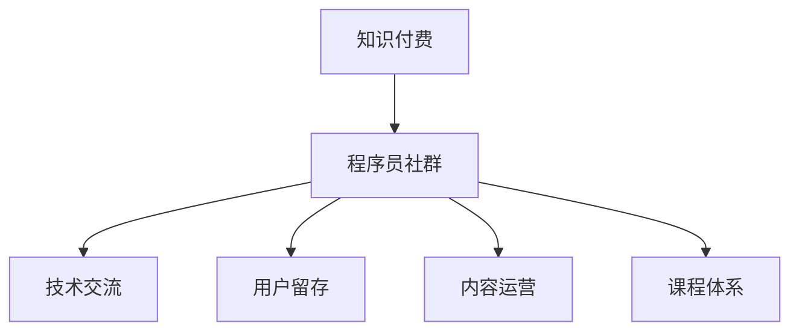

                 

# 如何打造高人气的程序员知识付费社群

> 关键词：知识付费, 程序员社群, 技术交流, 内容运营, 用户留存

## 1. 背景介绍

### 1.1 问题由来

在互联网时代，知识付费逐渐成为一种主流趋势。特别是在科技领域，专业知识和技能的学习与分享变得尤为重要。程序员作为互联网行业的基石，其知识分享和交流对于技术进步和行业发展具有重要意义。因此，打造一个高人气的程序员知识付费社群，不仅能够提升程序员的专业技能，还能促进技术交流和知识传播，具有极大的潜力和价值。

### 1.2 问题核心关键点

一个成功的程序员知识付费社群，需要满足以下几个核心要求：
- **高质量内容**：社群内必须提供系统化、专业化、实用的技术知识，满足不同水平程序员的学习需求。
- **活跃的交流环境**：通过高质量的交流讨论、问题答疑，营造良好的学习氛围，增强用户粘性。
- **高效的运营管理**：通过合理的用户管理、内容管理、营销策略，保证社群的健康发展和可持续发展。
- **良好的用户体验**：提供便捷的课程购买、支付、学习工具，确保用户能够轻松获取所需知识。

### 1.3 问题研究意义

打造一个高人气的程序员知识付费社群，不仅能够帮助程序员提升技能，还能推动技术进步和行业发展。具体而言：

1. **知识共享**：社群能够汇聚各领域的顶尖技术人才，共享最新的技术动态和研究成果，促进技术知识的广泛传播。
2. **技术交流**：通过问题答疑、项目合作、技术讨论等方式，加速技术创新和应用实践。
3. **职业发展**：提供专业的职业规划和发展指导，帮助程序员实现职业目标，提高竞争力。
4. **社区文化**：培养和弘扬程序员社区文化，增强技术社群的凝聚力和认同感。
5. **商业价值**：通过社群平台，实现知识变现，探索商业化发展路径，创造更大的经济效益。

## 2. 核心概念与联系

### 2.1 核心概念概述

为了更好地理解如何打造高人气的程序员知识付费社群，本节将介绍几个关键概念：

- **知识付费（Knowledge-Driven Pricing）**：指以提供高质量、系统化的知识内容为核心，通过付费方式获取的知识分享模式。
- **程序员社群（Programmer Community）**：指由程序员组成的技术交流和分享平台，包括线上和线下的各种形式。
- **技术交流（Technical Exchange）**：指通过问题讨论、技术分享、项目合作等方式，促进技术知识和经验的传播。
- **用户留存（User Retention）**：指通过优化社群环境、提升用户体验，增强用户对社群的黏性，避免用户流失。
- **内容运营（Content Operation）**：指对社群内的知识内容进行规划、策划、执行，确保内容的高质量和时效性。
- **课程体系（Course System）**：指根据用户需求和行业趋势，构建科学合理的课程体系，满足不同水平和领域的学习需求。

这些概念之间的逻辑关系可以通过以下Mermaid流程图来展示：



这个流程图展示了知识付费与程序员社群之间的关系，以及技术交流、用户留存、内容运营和课程体系在社群中的作用。

## 3. 核心算法原理 & 具体操作步骤
### 3.1 算法原理概述

打造一个高人气的程序员知识付费社群，本质上是构建一个高质量的知识内容生态，通过有效的运营管理，吸引和留住用户，形成良性的互动循环。其核心算法原理可以概括为以下几个方面：

1. **需求分析与定位**：对目标用户群体的需求进行深入分析，明确社群的核心价值和目标方向。
2. **内容策划与制作**：围绕社群的核心价值，策划和制作高质量的内容，满足用户的学习需求。
3. **用户管理与互动**：建立科学的用户管理机制，通过互动交流，增强用户粘性。
4. **运营策略与执行**：制定合理的运营策略，确保社群的健康发展和可持续发展。
5. **技术支撑与保障**：采用先进的技术手段，保障社群的高效运行和用户体验。

### 3.2 算法步骤详解

下面详细介绍如何通过具体的步骤打造高人气的程序员知识付费社群：

**Step 1: 需求分析与定位**

1. **目标用户分析**：分析目标用户群体的特征、需求和痛点，如初级开发者、中级开发者、高级开发者等。
2. **市场调研**：了解现有技术社群的优缺点，分析市场需求和竞争环境。
3. **价值定位**：明确社群的核心价值和目标方向，如技术交流、职业发展、商业合作等。

**Step 2: 内容策划与制作**

1. **内容类型规划**：根据用户需求和目标方向，规划课程、文章、视频、直播等多种内容类型。
2. **内容策划流程**：制定内容策划流程，包括选题、撰稿、审稿、发布等环节。
3. **内容制作团队**：组建专业的内容制作团队，如讲师、编辑、技术支持等。

**Step 3: 用户管理与互动**

1. **用户管理机制**：建立科学的用户管理机制，包括注册、认证、权限等。
2. **互动交流平台**：搭建互动交流平台，如论坛、私信、直播等，促进用户间的交流和互动。
3. **社区文化建设**：培养和弘扬社区文化，如开放、共享、互助等，增强用户认同感。

**Step 4: 运营策略与执行**

1. **营销策略**：制定合理的营销策略，通过多种渠道推广社群，吸引新用户。
2. **用户留存策略**：制定用户留存策略，如优质内容、互动活动、优惠政策等，增强用户粘性。
3. **风险管理**：建立风险管理机制，如内容审核、违规处理等，确保社群的健康发展。

**Step 5: 技术支撑与保障**

1. **技术架构设计**：设计高效、稳定、可扩展的技术架构，保障社群的高效运行。
2. **用户体验优化**：优化用户体验，确保课程购买、支付、学习工具等环节的便捷性。
3. **安全保障**：建立安全保障机制，如数据加密、防泄漏、反盗版等，确保用户数据安全。

### 3.3 算法优缺点

打造高人气的程序员知识付费社群，具有以下优点：
1. **知识共享**：通过高质量的知识内容，促进技术知识和经验的传播，加速技术创新和应用实践。
2. **技术交流**：提供平台和技术支持，增强用户之间的互动和交流，提升技术社群的凝聚力。
3. **职业发展**：提供专业的职业规划和发展指导，帮助用户实现职业目标，提高竞争力。
4. **商业价值**：通过知识变现，探索商业化发展路径，创造更大的经济效益。

同时，该方法也存在一定的局限性：
1. **内容制作成本**：高质量的内容制作需要耗费大量的时间和资源，需要专业的内容制作团队和资金支持。
2. **运营管理复杂**：社群的运营管理涉及多方面的工作，需要专业的人才和持续的投入。
3. **用户留存困难**：需要不断创新和优化，才能持续吸引和留住用户，避免社群的衰退。
4. **市场竞争激烈**：面对众多的技术社群，如何突出特色和优势，吸引用户，是一个重要的挑战。

尽管存在这些局限性，但就目前而言，通过高质量的内容和有效的运营管理，打造高人气的程序员知识付费社群，依然是一种极具潜力和价值的方式。

### 3.4 算法应用领域

高人气的程序员知识付费社群可以应用于多个领域，如编程、人工智能、区块链、云计算等，具体包括：

1. **编程学习**：提供系统化的编程课程，涵盖从入门到高级的内容，帮助程序员提升编程技能。
2. **技术交流**：搭建技术交流平台，促进编程社区内外的技术交流和合作，提升技术水平。
3. **职业发展**：提供职业规划和发展指导，帮助程序员实现职业目标，提高竞争力。
4. **商业合作**：通过知识变现和商业合作，探索社群的商业化发展路径，创造更大的经济效益。

除了以上领域外，高人气的程序员知识付费社群还可以应用于更多的场景，如技术培训、企业内训、职业认证等，为程序员提供更多的学习和发展机会。

## 4. 数学模型和公式 & 详细讲解 & 举例说明（备注：数学公式请使用latex格式，latex嵌入文中独立段落使用 $$，段落内使用 $)
### 4.1 数学模型构建

本文将从数学模型的角度，进一步阐述如何打造高人气的程序员知识付费社群。

设社群内用户总数为 $N$，课程总数为 $M$，每门课程的用户覆盖率为 $C$，每门课程的平均评分分为 $S$，则社群的总评分 $\mathcal{S}$ 可以表示为：

$$
\mathcal{S} = \frac{1}{N} \sum_{i=1}^{M} C_i \cdot S_i
$$

其中 $C_i$ 表示课程 $i$ 的用户覆盖率，$S_i$ 表示课程 $i$ 的平均评分分。社群的总评分越高，说明用户对课程的评价越好，社群的吸引力也越大。

### 4.2 公式推导过程

为了最大化社群的总评分 $\mathcal{S}$，需要对课程进行合理的规划和制作。假设课程数量为 $M$，每门课程的评分分为 $S_i$，用户覆盖率为 $C_i$，则：

$$
\max_{S_i, C_i} \mathcal{S} = \max_{S_i, C_i} \frac{1}{N} \sum_{i=1}^{M} C_i \cdot S_i
$$

通过对公式进行优化，可以发现，社群的总评分 $\mathcal{S}$ 与课程的平均评分分 $S_i$ 和用户覆盖率 $C_i$ 成正比。因此，制作高质量的课程和吸引更多用户参与，是提升社群总评分的关键。

### 4.3 案例分析与讲解

以一家技术社区为例，该社区通过以下步骤提升用户总评分：

1. **内容制作**：定期发布高质量的编程课程和文章，涵盖从入门到高级的内容，满足不同水平用户的学习需求。
2. **用户互动**：搭建互动交流平台，如论坛、直播、技术问答等，促进用户间的交流和互动，增强用户粘性。
3. **营销推广**：通过社交媒体、技术博客、邮件推送等渠道，推广社群和优质内容，吸引新用户。
4. **用户反馈**：定期收集用户反馈，优化课程内容和社区环境，提升用户满意度。

通过以上措施，该社区逐渐形成了良好的知识生态，用户总评分显著提升，社群的吸引力和用户粘性也随之增强。

## 5. 项目实践：代码实例和详细解释说明
### 5.1 开发环境搭建

在进行项目实践前，我们需要准备好开发环境。以下是使用Python进行Flask框架开发的环境配置流程：

1. 安装Python：从官网下载并安装Python，确保版本为3.7或以上。
2. 安装Flask：
```bash
pip install Flask
```
3. 安装Flask-SQLAlchemy：
```bash
pip install Flask-SQLAlchemy
```
4. 安装Flask-Login：
```bash
pip install Flask-Login
```
5. 安装Flask-WTF：
```bash
pip install Flask-WTF
```

完成上述步骤后，即可在本地搭建Flask应用。

### 5.2 源代码详细实现

下面是使用Flask框架实现一个简单的程序员知识付费社群平台的代码实现。

```python
from flask import Flask, render_template, redirect, url_for
from flask_sqlalchemy import SQLAlchemy
from flask_login import LoginManager, login_user, logout_user, login_required
from flask_wtf import FlaskForm
from wtforms import StringField, PasswordField, SubmitField, IntegerField, TextAreaField
from wtforms.validators import DataRequired, Email, Length
from werkzeug.security import generate_password_hash, check_password_hash

app = Flask(__name__)
app.config['SECRET_KEY'] = 'secret-key'
app.config['SQLALCHEMY_DATABASE_URI'] = 'sqlite:////tmp/test.db'
db = SQLAlchemy(app)
login_manager = LoginManager()
login_manager.init_app(app)
login_manager.login_view = 'login'
login_manager.login_message_category = 'info'

class User(db.Model):
    id = db.Column(db.Integer, primary_key=True)
    username = db.Column(db.String(50), unique=True, nullable=False)
    email = db.Column(db.String(120), unique=True, nullable=False)
    password_hash = db.Column(db.String(60), nullable=False)
    courses = db.relationship('Course', backref='author', lazy='dynamic')

    def set_password(self, password):
        self.password_hash = generate_password_hash(password)

    def check_password(self, password):
        return check_password_hash(self.password_hash, password)

@login_manager.user_loader
def load_user(user_id):
    return User.query.get(int(user_id))

class Course(db.Model):
    id = db.Column(db.Integer, primary_key=True)
    title = db.Column(db.String(80), nullable=False)
    description = db.Column(db.Text, nullable=False)
    author_id = db.Column(db.Integer, db.ForeignKey('user.id'), nullable=False)
    rating = db.Column(db.Float, nullable=False, default=0.0)
    review_count = db.Column(db.Integer, nullable=False, default=0)

class Review(db.Model):
    id = db.Column(db.Integer, primary_key=True)
    course_id = db.Column(db.Integer, db.ForeignKey('course.id'), nullable=False)
    user_id = db.Column(db.Integer, db.ForeignKey('user.id'), nullable=False)
    review = db.Column(db.Text, nullable=False)
    rating = db.Column(db.Float, nullable=False, default=0.0)

class ReviewForm(FlaskForm):
    review = TextAreaField('Review', validators=[DataRequired(), Length(max=200)])
    rating = IntegerField('Rating', validators=[DataRequired()], default=1)

@app.route('/')
def index():
    courses = Course.query.all()
    return render_template('index.html', courses=courses)

@app.route('/login', methods=['GET', 'POST'])
def login():
    form = LoginForm()
    if form.validate_on_submit():
        user = User.query.filter_by(username=form.username.data).first()
        if user and user.check_password(form.password.data):
            login_user(user)
            return redirect(url_for('index'))
        else:
            flash('Invalid username or password')
            return redirect(url_for('login'))
    return render_template('login.html', form=form)

@app.route('/logout')
@login_required
def logout():
    logout_user()
    return redirect(url_for('index'))

@app.route('/course/<int:id>')
@login_required
def course(id):
    course = Course.query.get_or_404(id)
    return render_template('course.html', course=course)

@app.route('/course/<int:id>/add_review', methods=['GET', 'POST'])
@login_required
def add_review(id):
    form = ReviewForm()
    if form.validate_on_submit():
        review = Review(review=form.review.data, rating=form.rating.data, user=current_user, course=Course.query.get_or_404(id))
        db.session.add(review)
        db.session.commit()
        flash('Your review has been posted')
        return redirect(url_for('course', id=course.id))
    return render_template('add_review.html', form=form)

if __name__ == '__main__':
    app.run(debug=True)
```

上述代码实现了一个简单的程序员知识付费社群平台，包括用户注册、登录、课程浏览、课程评价等功能。

### 5.3 代码解读与分析

让我们再详细解读一下关键代码的实现细节：

**User模型**：
- `id`：用户ID，作为主键。
- `username`：用户名，唯一且不可为空。
- `email`：用户邮箱，唯一且不可为空。
- `password_hash`：密码哈希值，不可为空。
- `courses`：用户发布的课程，通过外键关联。

**Course模型**：
- `id`：课程ID，作为主键。
- `title`：课程标题，不可为空。
- `description`：课程描述，不可为空。
- `author_id`：发布课程的用户ID，外键关联。
- `rating`：课程评分，不可为空，初始值为0.0。
- `review_count`：课程评价数量，不可为空，初始值为0。

**Review模型**：
- `id`：评价ID，作为主键。
- `course_id`：课程ID，外键关联。
- `user_id`：评价用户ID，外键关联。
- `review`：评价内容，不可为空。
- `rating`：评价评分，不可为空，初始值为1。

**ReviewForm表单**：
- `review`：评价内容，必填，长度不超过200个字符。
- `rating`：评价评分，必填，初始值为1。

**index路由**：
- 返回所有课程的列表。

**login路由**：
- 提供用户登录功能，通过用户名和密码验证登录。

**logout路由**：
- 提供用户注销功能，退出当前登录状态。

**course路由**：
- 返回指定课程的详细信息。

**add_review路由**：
- 提供用户对课程进行评价的功能。

这些关键代码实现了一个基本的程序员知识付费社群平台，涵盖了用户管理、课程管理、课程评价等基本功能。开发者可以根据实际需求，进一步优化和扩展功能。

## 6. 实际应用场景
### 6.1 智能客服系统

高人气的程序员知识付费社群，可以为智能客服系统的构建提供技术支持。通过社群内程序员的技术分享和问题解答，智能客服系统可以更好地理解用户需求，提供更加高效、精准的响应。

在技术实现上，可以收集社群内程序员的历史问答记录，将常见问题和最佳答复构建成监督数据，在此基础上对预训练模型进行微调。微调后的模型能够自动理解用户意图，匹配最合适的答案模板进行回复。对于用户提出的新问题，还可以接入检索系统实时搜索相关内容，动态组织生成回答。如此构建的智能客服系统，能大幅提升客户咨询体验和问题解决效率。

### 6.2 金融舆情监测

金融机构需要实时监测市场舆论动向，以便及时应对负面信息传播，规避金融风险。传统的人工监测方式成本高、效率低，难以应对网络时代海量信息爆发的挑战。基于高人气的程序员知识付费社群的技术分享和问题答疑，金融舆情监测系统可以更好地理解市场信息，识别负面舆情，并及时采取应对措施。

具体而言，可以收集社群内程序员对金融市场的分析和讨论，从中提取重要的市场动态和舆情信息。将这些信息作为监督数据，训练模型学习舆情分析任务，预测市场舆情变化趋势，及时发出预警，帮助金融机构规避风险。

### 6.3 个性化推荐系统

当前的推荐系统往往只依赖用户的历史行为数据进行物品推荐，无法深入理解用户的真实兴趣偏好。高人气的程序员知识付费社群能够提供高质量的编程课程和文章，帮助用户掌握最新的技术动态和知识。基于社群内的技术分享和问题答疑，个性化推荐系统可以更好地理解用户的兴趣和需求，提供更精准、多样的推荐内容。

在技术实现上，可以收集社群内程序员的阅读和观看行为数据，提取和用户交互的物品标题、描述、标签等文本内容。将文本内容作为模型输入，用户的后续行为（如是否点击、购买等）作为监督信号，在此基础上微调预训练语言模型。微调后的模型能够从文本内容中准确把握用户的兴趣点。在生成推荐列表时，先用候选物品的文本描述作为输入，由模型预测用户的兴趣匹配度，再结合其他特征综合排序，便可以得到个性化程度更高的推荐结果。

### 6.4 未来应用展望

随着高人气的程序员知识付费社群的发展，未来的应用场景将更加多样和广泛：

1. **智能教育**：提供高质量的编程课程和讲座，促进技术知识的传播和教育。
2. **企业培训**：为各行各业的企业提供定制化的技术培训和知识分享，提升员工技术水平。
3. **职业发展**：提供职业规划和发展指导，帮助用户实现职业目标，提高竞争力。
4. **技术合作**：促进技术社群内外的合作和交流，推动技术创新和应用实践。

此外，高人气的程序员知识付费社群还可以应用于更多领域，如科技创新、人工智能、区块链等，为相关行业提供技术和知识支持。

## 7. 工具和资源推荐
### 7.1 学习资源推荐

为了帮助开发者系统掌握高人气的程序员知识付费社群的技术实现和运营管理，这里推荐一些优质的学习资源：

1. **《Python网络爬虫》**：该书详细介绍了Python网络爬虫的实现方法和技巧，涵盖网络请求、爬虫框架、数据处理等方面。
2. **《Flask Web开发》**：该书详细介绍了Flask框架的使用方法和最佳实践，涵盖Web应用开发、数据库交互、用户管理等方面。
3. **《机器学习实战》**：该书详细介绍了机器学习算法和实战案例，涵盖数据预处理、模型训练、模型部署等方面。
4. **《人工智能导论》**：该书详细介绍了人工智能的原理和应用，涵盖机器学习、深度学习、自然语言处理等方面。
5. **《NLP实战》**：该书详细介绍了自然语言处理的实现方法和技巧，涵盖文本处理、情感分析、机器翻译等方面。

通过对这些资源的学习实践，相信你一定能够掌握高人气的程序员知识付费社群的技术实现和运营管理。

### 7.2 开发工具推荐

高效的开发离不开优秀的工具支持。以下是几款用于高人气的程序员知识付费社群开发的常用工具：

1. **PyCharm**：一款强大的Python IDE，提供代码补全、调试、版本控制等功能，适合大型项目的开发。
2. **Git**：一款强大的版本控制系统，支持分布式协作开发，适合代码管理和版本控制。
3. **Jupyter Notebook**：一款交互式的Python开发环境，支持代码编写、数据可视化等功能，适合数据驱动的开发。
4. **Docker**：一款容器化技术，支持应用部署、环境隔离等功能，适合分布式应用的开发和部署。
5. **Kubernetes**：一款容器编排技术，支持自动化部署、扩展、监控等功能，适合大规模应用的部署和运维。

合理利用这些工具，可以显著提升高人气的程序员知识付费社群的开发效率，加快创新迭代的步伐。

### 7.3 相关论文推荐

高人气的程序员知识付费社群的技术发展源于学界的持续研究。以下是几篇奠基性的相关论文，推荐阅读：

1. **《大规模在线学习社区的研究》**：该论文探讨了大规模在线学习社区的形成和演化机制，为社群的建设和管理提供了理论基础。
2. **《社交网络分析》**：该论文详细介绍了社交网络分析的方法和应用，为社群内的互动交流提供了技术支持。
3. **《机器学习在个性化推荐系统中的应用》**：该论文探讨了机器学习在个性化推荐系统中的应用，为推荐算法提供了理论基础。
4. **《知识图谱在智能推荐系统中的应用》**：该论文介绍了知识图谱在智能推荐系统中的应用，为推荐系统的知识整合提供了方法。
5. **《人工智能伦理和安全》**：该论文探讨了人工智能的伦理和安全问题，为社群的运营管理提供了指导。

这些论文代表了大规模在线学习社区的研究进展，为社群的建设和管理提供了理论基础和技术支持。

## 8. 总结：未来发展趋势与挑战
### 8.1 总结

本文对如何打造高人气的程序员知识付费社群进行了全面系统的介绍。首先阐述了社群发展的背景和意义，明确了社群的核心价值和目标方向。其次，从原理到实践，详细讲解了社群的构建和运营管理的全过程，包括需求分析、内容策划、用户管理、运营策略等。同时，本文还介绍了社群技术实现的案例，展示了实际应用场景。

通过本文的系统梳理，可以看到，高人气的程序员知识付费社群在知识共享、技术交流、职业发展等方面具有重要价值。开发者和运营者可以通过系统的需求分析和内容策划，打造高效、可持续发展的技术社群，提升用户粘性和满意度。

### 8.2 未来发展趋势

展望未来，高人气的程序员知识付费社群将呈现以下几个发展趋势：

1. **内容多样化**：随着技术的发展，社群内容将更加多样化，涵盖编程、人工智能、区块链等多个领域。
2. **互动高频化**：通过更多互动交流的方式，如直播、问答、协作开发等，增强社群的活跃度和用户粘性。
3. **商业化发展**：通过知识变现和商业合作，探索社群的商业化路径，创造更大的经济效益。
4. **智能推荐**：引入智能推荐技术，提升课程推荐和内容匹配的精准度，满足用户个性化的学习需求。
5. **社交化融合**：通过社交网络分析，优化社群内的人际关系，增强社区的凝聚力和认同感。
6. **技术融合**：与人工智能、大数据、区块链等前沿技术深度融合，提升社群的技术水平和应用范围。

这些趋势凸显了高人气的程序员知识付费社群的广阔前景，为社群的持续发展和创新提供了方向。

### 8.3 面临的挑战

尽管高人气的程序员知识付费社群具有巨大的潜力和价值，但在实际运营中也面临诸多挑战：

1. **内容制作成本高**：高质量的内容制作需要耗费大量的时间和资源，需要专业的内容制作团队和资金支持。
2. **用户留存困难**：需要不断创新和优化，才能持续吸引和留住用户，避免社群的衰退。
3. **市场竞争激烈**：面对众多的技术社群，如何突出特色和优势，吸引用户，是一个重要的挑战。
4. **技术融合复杂**：与人工智能、大数据、区块链等前沿技术深度融合，需要专业的技术团队和持续的投入。
5. **风险管理难度大**：社群的运营和管理涉及多方面的工作，需要科学的管理机制和风险控制策略。

尽管存在这些挑战，但只要能够克服，高人气的程序员知识付费社群必将在知识共享、技术交流、职业发展等方面发挥重要作用，为技术社群和互联网产业的发展做出贡献。

### 8.4 研究展望

面对高人气的程序员知识付费社群的运营和管理，未来的研究需要在以下几个方面寻求新的突破：

1. **内容自动化**：利用自然语言处理和机器学习技术，自动生成高质量的内容，降低内容制作的成本。
2. **个性化推荐**：引入个性化推荐技术，提升课程推荐和内容匹配的精准度，满足用户个性化的学习需求。
3. **互动智能化**：引入智能算法和自然语言处理技术，提升互动交流的智能化水平，增强用户粘性。
4. **技术融合**：与人工智能、大数据、区块链等前沿技术深度融合，提升社群的技术水平和应用范围。
5. **社交化融合**：通过社交网络分析，优化社群内的人际关系，增强社区的凝聚力和认同感。
6. **风险管理**：建立科学的管理机制和风险控制策略，保障社群的健康发展和可持续发展。

这些研究方向的探索，必将引领高人气的程序员知识付费社群走向更高的台阶，为技术社群和互联网产业的发展带来新的动力和方向。

## 9. 附录：常见问题与解答

**Q1: 如何提升社群的用户粘性？**

A: 提升社群的用户粘性需要从多个方面入手：

1. **内容质量**：提供高质量、系统化的内容，满足用户的学习需求。
2. **互动交流**：搭建互动交流平台，如论坛、直播、技术问答等，促进用户间的交流和互动。
3. **用户体验**：优化用户体验，确保课程购买、支付、学习工具等环节的便捷性。
4. **社区文化**：培养和弘扬社区文化，如开放、共享、互助等，增强用户认同感。
5. **定期活动**：定期举办技术分享、项目合作、技术竞赛等活动，增强用户参与感和归属感。
6. **用户反馈**：定期收集用户反馈，优化课程内容和社区环境，提升用户满意度。

通过以上措施，可以显著提升社群的用户粘性，增强用户的活跃度和留存率。

**Q2: 如何处理社群内的恶意行为？**

A: 处理社群内的恶意行为需要建立科学的管理机制和风险控制策略：

1. **规则制定**：制定明确的用户行为规范和惩罚措施，如禁止发布低俗内容、禁止广告等。
2. **举报机制**：建立举报机制，及时处理恶意行为，如侵权、造谣等。
3. **人工审核**：对重要的内容和互动进行人工审核，及时发现和处理恶意行为。
4. **用户分级**：根据用户行为和贡献，进行分级管理，限制恶意行为用户的权限。
5. **技术手段**：利用自然语言处理和机器学习技术，自动识别和处理恶意行为。

通过以上措施，可以有效处理社群内的恶意行为，保障社群的健康发展和用户体验。

**Q3: 如何提高社群的商业化效果？**

A: 提高社群的商业化效果需要从多个方面入手：

1. **课程变现**：通过知识变现，将课程内容转化为商业价值，实现盈利。
2. **广告合作**：与相关企业合作，推广课程和社群，获取广告收入。
3. **技术合作**：与企业合作，提供技术支持和服务，获取技术服务收入。
4. **品牌赞助**：与知名品牌合作，提高社群的品牌影响力，获取品牌赞助收入。
5. **活动策划**：举办技术分享、项目合作、技术竞赛等活动，吸引企业赞助。
6. **内容营销**：通过高质量的内容营销，提高社群的影响力和用户粘性，吸引更多商业合作。

通过以上措施，可以显著提升社群的商业化效果，实现盈利和发展。

---

作者：禅与计算机程序设计艺术 / Zen and the Art of Computer Programming

