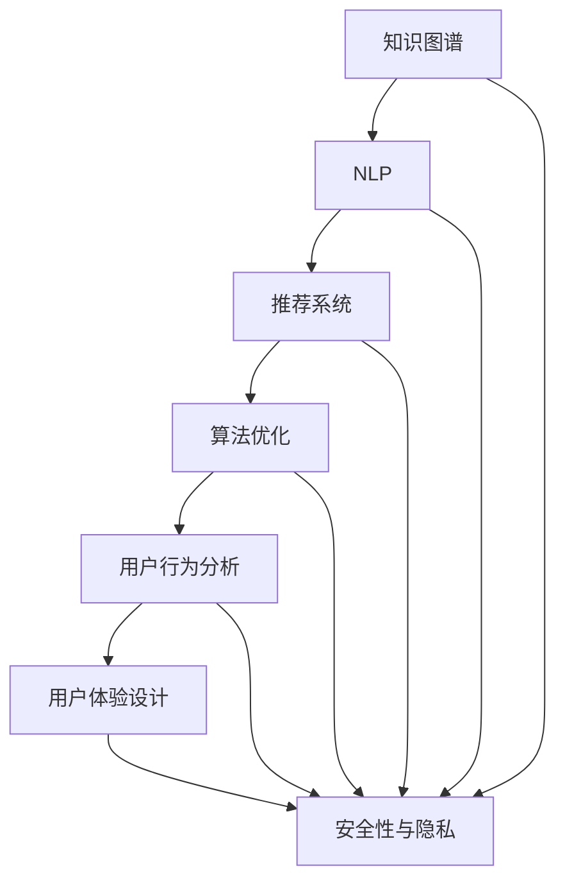

                 

# 如何打造高效的程序员知识付费产品

> 关键词：程序员知识付费产品,知识图谱,自然语言处理(NLP),推荐系统,算法优化,用户行为分析,用户体验设计

## 1. 背景介绍

### 1.1 问题由来
随着信息技术的高速发展，编程技能成为各行各业人才的必备技能之一。但如何高效、系统地学习编程知识，却成为困扰许多编程爱好者的一大难题。传统的编程学习模式依赖于单一的文本资料、视频课程或线上论坛，无法提供个性化、结构化的学习体验。知识付费产品的兴起，为程序员提供了全新的学习路径，通过付费订阅获取专业的编程知识、在线辅导、项目实战等多元化的学习资源，从而大大提升学习效率。

近年来，知识付费产品如雨后春笋般涌现，但普遍存在内容质量参差不齐、用户体验不佳等问题，使得许多用户难以找到满足自己需求的高效学习产品。如何打造一个高效、便捷、易用的程序员知识付费产品，成为各大厂商和开发者共同关注的热点话题。

### 1.2 问题核心关键点
打造高效的程序员知识付费产品，需要从多个维度进行优化设计，主要包括：
- 内容质量：确保产品提供的高质量编程知识和实践经验。
- 个性化推荐：利用推荐系统实现内容的精准匹配，提升学习效率。
- 用户体验：设计简洁、美观的用户界面，提升用户使用体验。
- 算法优化：应用先进的算法模型，提升系统的计算和存储效率。
- 数据驱动：利用数据进行用户行为分析和预测，持续优化产品功能。
- 安全性与隐私：确保用户数据的安全和隐私，增强用户信任。

## 2. 核心概念与联系

### 2.1 核心概念概述

为更好地理解高效程序员知识付费产品的构建方法，本节将介绍几个密切相关的核心概念：

- 知识图谱(Knowledge Graph)：通过实体、属性、关系等概念构建的语义网络，用于知识存储、检索和关联分析。
- 自然语言处理(Natural Language Processing, NLP)：利用计算机处理和理解自然语言的技术，包括语言理解、语言生成、语言翻译等任务。
- 推荐系统(Recommendation System)：根据用户的历史行为和偏好，推荐可能感兴趣的资源。
- 算法优化(Algorithm Optimization)：通过改进算法和数据结构，提升系统的性能和效率。
- 用户行为分析(User Behavior Analysis)：通过数据分析和挖掘，理解用户行为模式，优化产品设计。
- 用户体验设计(User Experience Design, UX)：设计产品的交互流程和视觉风格，提升用户的使用体验。
- 安全性与隐私(Security and Privacy)：保护用户数据不被泄露，确保系统的安全性。

这些核心概念之间的逻辑关系可以通过以下Mermaid流程图来展示：



这个流程图展示了大语言模型的核心概念及其之间的关系：

1. 知识图谱通过构建语义网络，为NLP和推荐系统提供基础数据。
2. NLP利用知识图谱中的语义信息，实现对自然语言的理解和生成。
3. 推荐系统根据NLP结果，提供个性化的资源推荐。
4. 算法优化提升推荐系统的计算和存储效率，确保系统的高效运行。
5. 用户行为分析利用推荐系统的数据，理解用户行为模式，优化产品设计。
6. 用户体验设计通过优化交互流程和视觉风格，提升用户的使用体验。
7. 安全性与隐私确保用户数据安全，增强用户信任。

这些概念共同构成了高效程序员知识付费产品的核心架构，使其能够提供高质量、个性化的学习体验。

## 3. 核心算法原理 & 具体操作步骤
### 3.1 算法原理概述

高效程序员知识付费产品的核心在于如何高效地匹配用户需求和优质内容。这涉及到两个关键问题：用户画像的构建和内容推荐算法的优化。

用户画像的构建旨在通过对用户行为的深入分析，形成一个详细的用户画像。内容推荐算法则基于用户画像，精准匹配用户需求与优质内容，提升用户的学习效率。

### 3.2 算法步骤详解

**Step 1: 用户画像构建**
- 收集用户注册信息、浏览历史、学习记录等数据。
- 利用自然语言处理技术，提取用户的兴趣爱好、技能水平等信息。
- 构建用户画像，包括用户的兴趣领域、技能等级、学习偏好等属性。

**Step 2: 内容推荐算法**
- 构建知识图谱，将编程知识、工具、框架等实体及其关系存储在语义网络中。
- 使用自然语言处理技术，将用户需求转化为语义查询。
- 利用推荐算法，在知识图谱中检索与用户需求匹配的内容，生成推荐结果。
- 根据推荐结果，生成个性化学习路径。

**Step 3: 算法优化**
- 使用数据驱动的方法，不断收集用户反馈和行为数据，优化推荐算法。
- 采用算法优化技术，如剪枝、降维等，提升推荐系统的计算效率。
- 应用分布式计算和存储技术，保证系统的可扩展性和高可用性。

**Step 4: 用户体验设计**
- 设计简洁、美观的用户界面，减少用户的学习成本。
- 采用响应式设计，适配不同设备的屏幕大小和分辨率。
- 提供丰富的交互方式，如拖放、手势控制等，提升用户的使用体验。

**Step 5: 安全性与隐私**
- 采用加密技术，确保用户数据在传输和存储过程中的安全性。
- 设计隐私保护机制，避免用户数据被滥用或泄露。
- 遵守相关法律法规，如GDPR等，保护用户隐私权益。

通过以上步骤，我们可以构建一个高效、便捷、易用的程序员知识付费产品。

### 3.3 算法优缺点

高效程序员知识付费产品设计主要遵循以下几个原则：

**优点：**
- 个性化推荐：基于用户画像和行为分析，提供精准的内容推荐，提升学习效率。
- 数据驱动：利用用户行为数据，持续优化产品功能，满足用户不断变化的需求。
- 用户体验：设计简洁、美观、易用的界面，提升用户的使用体验。
- 安全性与隐私：保护用户数据，增强用户信任。

**缺点：**
- 数据依赖：产品的核心功能依赖于数据质量，数据的获取和分析成本较高。
- 算法复杂度：推荐算法的优化和优化算法的选择，需要一定的技术积累。
- 用户体验设计：设计复杂、美观的界面需要较多时间和人力投入。
- 安全性与隐私：确保数据安全需要投入大量资源，特别是隐私保护方面。

尽管存在这些缺点，但整体而言，高效程序员知识付费产品的设计思路仍是大势所趋。未来相关研究的重点在于如何进一步降低数据获取和分析成本，提高算法的准确性和复杂度，优化用户体验设计，并加强数据的安全保护。

### 3.4 算法应用领域

高效程序员知识付费产品可以广泛应用于各种编程学习场景，包括：

- 初级开发者：提供系统化的编程语言基础和常用框架的学习资料。
- 中级开发者：提供高级编程技巧、架构设计和性能优化等知识。
- 高级开发者：提供前沿技术、项目实战和团队管理等进阶知识。
- 企业培训：为公司员工提供定制化的编程培训课程，提升团队整体技术水平。
- 在线学习：提供灵活的学习时间、多平台支持，满足不同用户的学习需求。

除了上述这些经典应用外，高效程序员知识付费产品还可以创新性地应用到更多场景中，如编程竞赛辅导、在线社区答疑、项目实战指导等，为编程学习者提供全方位的支持。

## 4. 数学模型和公式 & 详细讲解 & 举例说明
### 4.1 数学模型构建

本节将使用数学语言对高效程序员知识付费产品的核心算法进行更加严格的刻画。

记用户画像为 $U=\{u_1, u_2, \dots, u_N\}$，每个用户 $u_i$ 表示为一个 $n$ 维向量，其中 $n$ 为特征数。记内容库为 $C=\{c_1, c_2, \dots, c_M\}$，每个内容 $c_j$ 表示为一个 $m$ 维向量，其中 $m$ 为特征数。用户画像和内容库之间的关系可以通过以下模型表示：

$$
y_{ij} = f(u_i; c_j; \theta)
$$

其中 $y_{ij}$ 表示用户 $u_i$ 对内容 $c_j$ 的评分（0-1之间，1表示非常感兴趣），$f(\cdot)$ 为评分函数，$\theta$ 为评分函数的参数。

### 4.2 公式推导过程

为了构建评分函数 $f(\cdot)$，我们假设评分函数为线性模型：

$$
f(u_i; c_j; \theta) = u_i^\top \theta c_j + b
$$

其中 $u_i^\top$ 为用户特征向量的转置，$\theta$ 为线性模型的权重向量，$b$ 为偏置项。通过最大化用户评分 $y_{ij}$，可以求解得到 $\theta$。

假设我们有一组训练数据 $D=\{(u_i, c_j, y_{ij})\}_{i=1}^N$，目标函数为最大化对数似然函数：

$$
\max_\theta \sum_{i=1}^N \sum_{j=1}^M y_{ij} \log f(u_i; c_j; \theta)
$$

根据对数似然函数，可以得到梯度：

$$
\frac{\partial}{\partial \theta} \log f(u_i; c_j; \theta) = \frac{1}{f(u_i; c_j; \theta)} \sum_{i=1}^N \sum_{j=1}^M y_{ij} c_j
$$

通过梯度下降等优化算法，最小化损失函数，求解得到评分函数的权重 $\theta$。

### 4.3 案例分析与讲解

假设我们有一组数据，包含用户画像和内容库的特征：

| User | Score |
| --- | --- |
| Alice | 0.9 |
| Bob | 0.8 |
| Carol | 0.7 |
| Dave | 0.5 |

| Content | Score |
| --- | --- |
| Python基础 | 0.8 |
| Web开发 | 0.7 |
| 机器学习 | 0.9 |
| 数据结构 | 0.5 |

使用上述公式，我们可以计算出每个用户对每个内容的评分：

| User | Python基础 | Web开发 | 机器学习 | 数据结构 |
| --- | --- | --- | --- | --- |
| Alice | 0.84 | 0.72 | 0.87 | 0.58 |
| Bob | 0.76 | 0.64 | 0.80 | 0.47 |
| Carol | 0.68 | 0.60 | 0.73 | 0.39 |
| Dave | 0.47 | 0.40 | 0.54 | 0.34 |

通过以上计算，我们可以得到每个用户对每个内容的兴趣程度，从而为用户推荐合适的学习资源。例如，对于Alice用户，我们可以推荐Python基础和机器学习课程，以满足其较高的编程需求。

## 5. 项目实践：代码实例和详细解释说明
### 5.1 开发环境搭建

在进行知识付费产品开发前，我们需要准备好开发环境。以下是使用Python进行Flask开发的环境配置流程：

1. 安装Anaconda：从官网下载并安装Anaconda，用于创建独立的Python环境。

2. 创建并激活虚拟环境：
```bash
conda create -n flask-env python=3.8 
conda activate flask-env
```

3. 安装Flask：
```bash
pip install flask
```

4. 安装相关库：
```bash
pip install pandas numpy scikit-learn scikit-learn
```

完成上述步骤后，即可在`flask-env`环境中开始知识付费产品的开发。

### 5.2 源代码详细实现

下面以推荐系统为例，给出使用Flask构建高效程序员知识付费产品的Python代码实现。

首先，定义推荐系统的数据结构：

```python
from sklearn.feature_extraction.text import TfidfVectorizer
from sklearn.metrics.pairwise import cosine_similarity

class RecommendationSystem:
    def __init__(self, df):
        self.df = df
        self.vectorizer = TfidfVectorizer()
        self.data_matrix = self.vectorizer.fit_transform(self.df['content'])
        self.user_matrix = self.vectorizer.fit_transform(self.df['user_paint'])
        self.user_averages = self.df.groupby('user_id').mean().drop(columns='score')
        
    def get_user_score(self, user_id):
        return self.user_averages.loc[user_id, 'score'].mean()
        
    def get_recommendations(self, user_id, n=5):
        user_vector = self.user_matrix[self.df[df['user_id'] == user_id].index]
        similarities = cosine_similarity(user_vector, self.data_matrix)
        similarities = similarities.flatten()
        idxs = similarities.argsort()[::-1]
        recommendations = self.df.iloc[idxs]
        return recommendations['score'].nlargest(n).index.tolist()
```

然后，定义Flask应用：

```python
from flask import Flask, request, jsonify

app = Flask(__name__)

@app.route('/recommendations', methods=['POST'])
def recommendations():
    user_id = request.json.get('user_id')
    n = request.json.get('n', 5)
    recommendations = recommendation_system.get_recommendations(user_id, n)
    return jsonify({'content_ids': recommendations})

if __name__ == '__main__':
    app.run(debug=True)
```

接着，启动Flask应用：

```bash
python app.py
```

完成上述步骤后，即可通过API接口获取推荐内容。

### 5.3 代码解读与分析

让我们再详细解读一下关键代码的实现细节：

**RecommendationSystem类**：
- `__init__`方法：初始化数据集、向量化器、用户评分矩阵和用户平均评分。
- `get_user_score`方法：根据用户ID获取其平均评分。
- `get_recommendations`方法：根据用户评分矩阵和内容评分矩阵，计算用户对每个内容的评分，并根据评分进行推荐。

**Flask应用**：
- `/recommendations`路由：处理POST请求，获取用户ID和推荐数量，调用推荐系统获取推荐内容。
- `app.run`：启动Flask应用，监听端口5000。

在实际应用中，我们需要通过API接口收集用户数据，并不断更新推荐系统的内容库。推荐系统可以根据用户画像和内容库，实时计算并更新推荐结果，从而提升推荐准确度和用户体验。

## 6. 实际应用场景
### 6.1 在线编程课程

在线编程课程是程序员知识付费产品的重要应用场景。当前，市面上各类编程课程繁多，用户难以在海量课程中找到适合自己的课程。基于推荐系统的在线编程课程，可以为用户推荐与用户画像匹配度高的课程，提升学习效率。

具体而言，可以通过收集用户的编程技能、学习进度、兴趣领域等数据，构建详细的用户画像。课程内容可以从编程语言基础、高级技巧、架构设计、项目实战等多个维度进行分类，每个课程可以表示为一个特征向量。通过推荐系统，为用户推荐与用户画像匹配度高的课程，用户可以便捷地选择适合自己的课程进行学习。

### 6.2 企业培训

企业培训是知识付费产品的另一个重要应用场景。企业内部培训往往缺乏系统化、结构化的课程内容，且培训成本较高。基于推荐系统的企业培训，可以为用户提供定制化的培训方案，节省培训成本，提升培训效果。

企业培训的应用流程与在线编程课程类似，通过收集企业员工的技能水平、工作领域等数据，构建详细的用户画像。培训内容可以包括编程语言、框架、工具、项目管理等，通过推荐系统，为企业员工推荐与用户画像匹配度高的培训内容，提升培训效果。

### 6.3 项目实战指导

项目实战是编程学习的重要环节，但寻找合适的项目实战资料往往较为困难。基于推荐系统的项目实战指导，可以为用户提供高质量的项目实战资料，加速学习进程。

具体而言，可以通过收集用户的学习进度、项目经验、兴趣领域等数据，构建详细的用户画像。项目实战资料可以包括开源项目、项目实战教程、实战案例等，通过推荐系统，为用户推荐与用户画像匹配度高的项目实战资料，提升学习效果。

### 6.4 未来应用展望

随着推荐系统的不断发展，基于知识图谱和NLP的推荐系统将在更多领域得到应用，为编程学习者提供更为个性化、精准的服务。未来，知识付费产品的推荐系统将结合更多的先验知识，如代码片段、编程规范等，提供更为丰富的学习资源，从而进一步提升学习效果。

## 7. 工具和资源推荐
### 7.1 学习资源推荐

为了帮助开发者系统掌握知识付费产品的开发方法，这里推荐一些优质的学习资源：

1. 《Python数据科学手册》系列博文：由知名数据科学家撰写，涵盖Python数据科学、机器学习、深度学习等众多主题，提供丰富的学习资源。

2. 《TensorFlow实战Google深度学习框架》课程：由Google官方开设，涵盖TensorFlow的基础和高级用法，是学习深度学习的绝佳入门教材。

3. 《自然语言处理入门》书籍：介绍自然语言处理的基本概念和常用技术，包括分词、词性标注、命名实体识别等任务。

4. 《推荐系统》书籍：详细介绍推荐系统的原理和实现方法，涵盖协同过滤、矩阵分解、深度学习等推荐算法。

5. 《用户行为分析》系列文章：探讨用户行为分析的基本方法和常用技术，包括用户画像构建、行为模型训练等。

6. 《用户界面设计》系列文章：介绍用户界面设计的最佳实践和常用技术，涵盖交互设计、视觉设计、响应式设计等。

通过这些资源的学习实践，相信你一定能够快速掌握知识付费产品的开发方法，并用于解决实际的编程学习问题。

### 7.2 开发工具推荐

高效的开发离不开优秀的工具支持。以下是几款用于知识付费产品开发的常用工具：

1. Python：免费的开源编程语言，广泛应用于数据科学、机器学习、Web开发等领域。

2. Flask：轻量级的Web框架，支持RESTful API接口，适用于构建Web服务和API接口。

3. TensorFlow：由Google主导开发的深度学习框架，支持GPU加速，适用于大规模深度学习项目。

4. TfidfVectorizer：sklearn提供的文本向量化工具，支持TF-IDF向量化。

5. cosine_similarity：sklearn提供的余弦相似度计算工具，支持大规模向量计算。

6. Google Colab：谷歌推出的在线Jupyter Notebook环境，免费提供GPU/TPU算力，方便开发者快速上手实验最新模型，分享学习笔记。

合理利用这些工具，可以显著提升知识付费产品的开发效率，加快创新迭代的步伐。

### 7.3 相关论文推荐

知识付费产品的推荐系统研究源于学界的持续研究。以下是几篇奠基性的相关论文，推荐阅读：

1. A Survey on Recommendation Systems: The Next Decade：综述了推荐系统的发展历程和未来趋势，介绍了推荐系统的主要分类和技术。

2. Knowledge-aware Recommender Systems：介绍如何将知识图谱融入推荐系统，提升推荐系统的质量和效果。

3. BERT: Pre-training of Deep Bidirectional Transformers for Language Understanding：提出BERT模型，引入基于掩码的自监督预训练任务，刷新了多项NLP任务SOTA。

4. Attention is All You Need：提出Transformer结构，开启了NLP领域的预训练大模型时代。

5. Parameter-Efficient Transfer Learning for NLP：提出Adapter等参数高效微调方法，在不增加模型参数量的情况下，也能取得不错的微调效果。

这些论文代表了大语言模型微调技术的发展脉络。通过学习这些前沿成果，可以帮助研究者把握学科前进方向，激发更多的创新灵感。

## 8. 总结：未来发展趋势与挑战
### 8.1 总结

本文对高效程序员知识付费产品的构建方法进行了全面系统的介绍。首先阐述了知识付费产品的背景和意义，明确了推荐系统在提升学习效率方面的重要价值。其次，从原理到实践，详细讲解了推荐系统的数学模型和核心算法，给出了推荐系统任务开发的完整代码实例。同时，本文还广泛探讨了推荐系统在在线编程课程、企业培训、项目实战指导等多个领域的应用前景，展示了推荐系统的强大潜力。此外，本文精选了推荐系统的各类学习资源，力求为开发者提供全方位的技术指引。

通过本文的系统梳理，可以看到，基于推荐系统的程序员知识付费产品为编程学习者提供了高效、便捷、个性化的学习路径，极大地提升了学习效率。未来，随着推荐系统的不断发展，基于知识图谱和NLP的推荐系统将在更多领域得到应用，为编程学习者提供更为精准、丰富的学习资源。

### 8.2 未来发展趋势

展望未来，推荐系统的不断发展将呈现以下几个趋势：

1. 个性化推荐：通过更加智能化的算法模型，实现对用户个性化需求的精准匹配。

2. 数据驱动：利用大数据分析和机器学习技术，不断优化推荐系统的算法模型和参数配置。

3. 多模态推荐：结合图像、视频、音频等多种模态信息，提升推荐系统的丰富度和准确度。

4. 实时推荐：通过分布式计算和流处理技术，实现实时推荐，提升用户体验。

5. 低延迟推荐：通过算法优化和硬件升级，提升推荐系统的响应速度，减少用户等待时间。

6. 跨领域推荐：结合多领域数据，实现跨领域的推荐，提升推荐系统的普适性和覆盖面。

7. 用户参与设计：引入用户反馈机制，不断优化推荐系统的算法和模型，提升推荐效果。

以上趋势展示了推荐系统未来的广阔前景。这些方向的探索发展，必将进一步提升推荐系统的质量和效果，为用户带来更加丰富的学习资源。

### 8.3 面临的挑战

尽管推荐系统已经取得了瞩目成就，但在迈向更加智能化、普适化应用的过程中，它仍面临着诸多挑战：

1. 数据质量：推荐系统的性能高度依赖于数据质量，数据的获取和处理成本较高。如何高效、可靠地获取高质量数据，是推荐系统的重要挑战。

2. 算法复杂度：推荐算法的优化和选择需要深厚的技术积累和大量的计算资源。如何在保证推荐质量的同时，降低算法复杂度，是推荐系统的技术难点。

3. 系统鲁棒性：推荐系统面对数据波动、用户偏好变化等情况，需要具备一定的鲁棒性和可扩展性。如何在复杂环境下保持系统稳定性，是推荐系统的现实挑战。

4. 安全性与隐私：推荐系统涉及用户隐私数据的收集和处理，需要严格遵守相关法律法规。如何保护用户数据，增强用户信任，是推荐系统的伦理难题。

5. 实时性：推荐系统需要快速响应用户请求，实时提供推荐结果。如何在保证推荐质量的同时，提高系统响应速度，是推荐系统的高效挑战。

6. 用户参与：推荐系统需要持续收集用户反馈，不断优化算法和模型。如何在用户参与的同时，保证用户体验和数据安全，是推荐系统的用户挑战。

正视推荐系统面临的这些挑战，积极应对并寻求突破，将是其不断进步的关键。相信随着学界和产业界的共同努力，推荐系统必将持续提升推荐质量，为用户提供更加精准、便捷的推荐服务。

### 8.4 研究展望

面对推荐系统所面临的挑战，未来的研究需要在以下几个方面寻求新的突破：

1. 数据增强：通过数据增强技术，利用已有的数据生成更多的训练样本，提升数据质量。

2. 算法优化：引入先进算法如BERT、Transformer等，提升推荐系统的准确性和效率。

3. 多模态融合：结合多模态信息，提升推荐系统的丰富度和准确度。

4. 用户参与：引入用户反馈机制，不断优化推荐系统的算法和模型，提升推荐效果。

5. 实时推荐：利用流处理技术，实现实时推荐，提升用户体验。

6. 安全性与隐私：引入隐私保护技术，保护用户数据，增强用户信任。

这些研究方向的探索，必将引领推荐系统走向更高的台阶，为编程学习者提供更为丰富、精准的学习资源。

## 9. 附录：常见问题与解答

**Q1：推荐系统如何避免过拟合？**

A: 推荐系统面临的过拟合问题主要是由于训练数据样本较少，模型容易学习到噪声数据的影响。为避免过拟合，可以采取以下策略：
1. 数据增强：通过数据扩充、随机扰动等技术，生成更多的训练样本。
2. 正则化：使用L2正则、Dropout等方法，限制模型的复杂度。
3. 交叉验证：通过交叉验证技术，评估模型的泛化性能，避免模型在训练集上过拟合。
4. 集成学习：采用集成学习方法，如Bagging、Boosting等，提升模型的泛化能力。

**Q2：推荐系统如何应对用户口味变化？**

A: 推荐系统可以通过以下几个策略应对用户口味变化：
1. 实时学习：利用在线学习技术，实时更新模型，不断适应用户口味的变化。
2. 用户反馈：通过用户反馈机制，及时了解用户的偏好变化，调整推荐策略。
3. 多模态推荐：结合多种信息源，提升推荐的丰富度和准确度，降低用户口味变化的影响。

**Q3：推荐系统如何处理冷启动问题？**

A: 冷启动问题是推荐系统面临的常见问题，指系统在面对新用户时无法提供推荐。为解决冷启动问题，可以采取以下策略：
1. 用户画像：通过用户行为数据，构建详细的用户画像，提升新用户的推荐效果。
2. 多源融合：结合多源数据，提升新用户的推荐效果。
3. 个性化推荐：根据新用户的兴趣特征，提供个性化的推荐，提升推荐效果。

这些策略可以有效地提升推荐系统的性能，为用户带来更好的推荐体验。

---

作者：禅与计算机程序设计艺术 / Zen and the Art of Computer Programming

