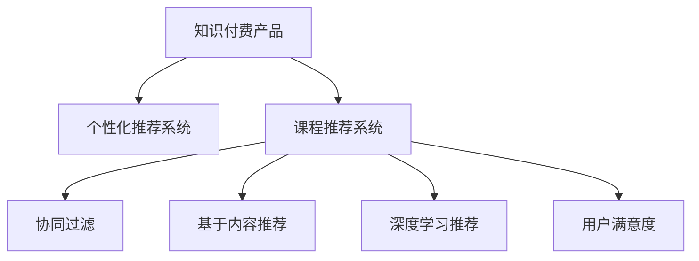

                 

# 如何提高知识付费产品的用户满意度

## 1. 背景介绍

### 1.1 问题由来

随着数字化经济的兴起和在线教育的普及，知识付费产品作为一种新兴的消费模式，逐渐受到用户的青睐。然而，尽管市场规模不断扩大，用户满意度却未能同步提升，甚至在某些环节出现了用户流失的趋势。用户满意度不高不仅影响了产品的市场竞争力，也削弱了平台的用户黏性。因此，如何提高知识付费产品的用户满意度，成为了摆在平台面前的一个重要课题。

### 1.2 问题核心关键点

提升知识付费产品的用户满意度，需要从多个维度进行综合优化，包括课程质量、用户体验、平台服务等方面。而本文将重点从课程推荐系统的角度，探索如何通过数据驱动的个性化推荐算法，为用户推荐更匹配的课程内容，从而显著提高用户满意度和留存率。

## 2. 核心概念与联系

### 2.1 核心概念概述

为更好地理解如何通过数据驱动的个性化推荐算法提升知识付费产品的用户满意度，本节将介绍几个密切相关的核心概念：

- **知识付费产品**：一种新型的互联网消费模式，用户为获取优质知识内容而支付费用。知识付费平台包括但不限于Coursera、Udemy、得到、知乎等。

- **个性化推荐系统**：根据用户的历史行为和兴趣，为用户推荐可能感兴趣的课程内容。常见的推荐算法包括协同过滤、基于内容的推荐、深度学习推荐等。

- **课程推荐系统**：知识付费产品中的核心功能模块，用于为用户推荐课程，从而提高用户满意度和留存率。推荐系统的好坏直接影响平台的业务表现。

- **用户满意度**：指用户在使用产品过程中感受到的价值满足程度，通常通过用户反馈、评价、流失率等指标来衡量。

- **个性化**：指针对每个用户，提供量身定制的服务，包括课程推荐、学习路径规划、反馈服务等，从而提升用户体验。

- **数据驱动**：指基于用户数据进行分析、建模和预测，支撑推荐系统的决策过程。

这些核心概念之间的逻辑关系可以通过以下Mermaid流程图来展示：



这个流程图展示了知识付费产品的核心组件及其关联关系：

1. 知识付费产品通过个性化推荐系统为用户推荐课程。
2. 推荐系统内部包含协同过滤、基于内容推荐、深度学习推荐等多种算法。
3. 用户满意度的提升依赖于课程推荐系统，而推荐系统又依赖于这些算法。

## 3. 核心算法原理 & 具体操作步骤
### 3.1 算法原理概述

知识付费产品的课程推荐系统，其核心原理是构建用户画像，预测用户对课程的兴趣程度，并基于此进行个性化推荐。具体而言，推荐系统通过收集用户历史行为数据、课程属性数据等，采用机器学习或深度学习算法，训练出一个预测模型，用于预测用户对课程的评分或点击概率，进而生成推荐结果。

这种推荐算法的本质是一种协同过滤（Collaborative Filtering），它通过分析用户之间的相似性和兴趣相似性，为用户推荐相似用户喜欢的课程。协同过滤分为基于用户的协同过滤和基于物品的协同过滤两种。其中，基于用户的协同过滤指根据相似用户的评分历史，为用户推荐这些用户喜欢的课程；基于物品的协同过滤指根据相似物品的评分历史，为用户推荐这些物品。

### 3.2 算法步骤详解

基于协同过滤的课程推荐系统，主要包括以下几个步骤：

**Step 1: 数据收集与预处理**

- 收集用户的历史行为数据，包括浏览、点击、收藏、购买等行为。
- 收集课程的属性数据，如课程名称、描述、教师、评分等。
- 对收集到的数据进行清洗、去重和格式转换，得到统一的格式，便于后续的分析和建模。

**Step 2: 用户画像构建**

- 对用户历史行为数据进行特征工程，提取用户的兴趣特征，如课程类别、教师、评分等。
- 对课程属性数据进行特征工程，提取课程的特征，如难度、时长、评分等。
- 将用户和课程的特征向量化，构建用户画像和课程画像。

**Step 3: 相似度计算**

- 基于用户画像和课程画像，计算用户与课程之间的相似度。常用的相似度计算方法包括余弦相似度、皮尔逊相关系数等。
- 使用矩阵分解技术（如奇异值分解SVD）对用户与课程的相似度矩阵进行降维，提高计算效率。

**Step 4: 推荐排序**

- 根据用户与课程之间的相似度，构建推荐列表。
- 使用排序算法（如Top-K排序）对推荐列表进行排序，保证推荐质量。

**Step 5: 模型评估与优化**

- 在验证集上评估推荐模型的性能，使用指标如精确率、召回率、F1分数等。
- 根据评估结果，调整模型参数，优化推荐算法。

### 3.3 算法优缺点

基于协同过滤的推荐算法具有以下优点：

1. **高效性**：算法计算简单，可以在大规模数据上快速运行。
2. **准确性**：能较好地捕捉用户和物品之间的相似性，生成较为精准的推荐结果。
3. **灵活性**：可适应不同规模和特征的数据，适用范围广。

同时，该算法也存在以下缺点：

1. **冷启动问题**：新用户和课程缺乏足够的历史数据，难以进行推荐。
2. **稀疏性**：用户与课程之间交互较少，导致推荐系统数据稀疏，影响推荐效果。
3. **多样性问题**：推荐算法倾向于生成与历史行为相似的推荐，导致推荐结果过于集中，缺乏多样性。

### 3.4 算法应用领域

基于协同过滤的推荐算法广泛应用于电商、音乐、视频等领域的个性化推荐，知识付费产品也不例外。通过协同过滤算法，推荐系统能根据用户的历史行为和兴趣，为用户推荐合适的课程内容，提升用户满意度和留存率。

## 4. 数学模型和公式 & 详细讲解 & 举例说明

### 4.1 数学模型构建

本节将使用数学语言对基于协同过滤的课程推荐模型进行更加严格的刻画。

假设用户集合为 $U$，课程集合为 $I$，用户对课程的评分矩阵为 $R$，其中 $R_{ui} = r_{ui}$ 表示用户 $u$ 对课程 $i$ 的评分。设用户画像为 $U_x$，课程画像为 $I_x$，用户与课程之间的相似度矩阵为 $S$。

基于用户画像和课程画像，我们可以构建如下数学模型：

$$
\min_{S} \|R - USV\|_F^2 + \lambda\|S\|_F^2
$$

其中 $S$ 为用户与课程之间的相似度矩阵，$U$ 和 $V$ 为低秩矩阵，$USV$ 为预测的评分矩阵。$\lambda$ 为正则化系数，用于控制矩阵的稀疏性。

### 4.2 公式推导过程

在得到上述优化问题后，我们可以通过交替最小化算法（如交替最小乘算法ALS）求解。具体而言，将问题分解为两个子问题：

1. 固定 $S$ 和 $V$，优化 $U$：

$$
U^* = (S^TS)S^{-1}R
$$

2. 固定 $U$ 和 $S$，优化 $V$：

$$
V^* = (S^TS)S^{-1}R
$$

其中 $S^{-1}$ 为 $S$ 的逆矩阵。

通过交替最小化算法，不断迭代求解上述子问题，直至收敛。最终得到用户与课程之间的相似度矩阵 $S$，用于构建推荐列表。

### 4.3 案例分析与讲解

以某知识付费平台的推荐系统为例，假设平台有 $N$ 个课程和 $M$ 个用户，收集到 $R_{ui} = r_{ui}$ 表示用户 $u$ 对课程 $i$ 的评分。设用户画像 $U_x$ 为 $N$ 维向量，课程画像 $I_x$ 为 $M$ 维向量，相似度矩阵 $S$ 为 $N\times M$ 矩阵。

使用ALS算法进行模型训练，设 $U$ 和 $V$ 的奇异值分解结果为 $U = \sum_{i=1}^{k}u_iu_i^T$，$V = \sum_{i=1}^{k}v_iv_i^T$，其中 $k$ 为降维后的维度。根据公式计算得到用户与课程之间的相似度矩阵 $S$。

具体步骤如下：

1. 对用户评分矩阵 $R$ 进行奇异值分解，得到 $R = UVW^T$。
2. 对 $U$ 和 $W$ 进行奇异值分解，得到 $U = \sum_{i=1}^{k}u_iu_i^T$，$W = \sum_{i=1}^{k}w_iw_i^T$。
3. 计算相似度矩阵 $S = u_i^Tu_j$，$j = 1,\cdots,N$。
4. 根据 $S$ 生成推荐列表，排序后推荐给用户。

## 5. 项目实践：代码实例和详细解释说明
### 5.1 开发环境搭建

在进行推荐系统开发前，我们需要准备好开发环境。以下是使用Python进行PyTorch开发的环境配置流程：

1. 安装Anaconda：从官网下载并安装Anaconda，用于创建独立的Python环境。

2. 创建并激活虚拟环境：
```bash
conda create -n recommendation-env python=3.8 
conda activate recommendation-env
```

3. 安装PyTorch：根据CUDA版本，从官网获取对应的安装命令。例如：
```bash
conda install pytorch torchvision torchaudio cudatoolkit=11.1 -c pytorch -c conda-forge
```

4. 安装相关库：
```bash
pip install numpy pandas scikit-learn joblib tqdm jupyter notebook ipython
```

完成上述步骤后，即可在`recommendation-env`环境中开始推荐系统开发。

### 5.2 源代码详细实现

下面我们以基于ALS的课程推荐系统为例，给出使用PyTorch实现的完整代码。

首先，定义用户评分矩阵和用户画像：

```python
import numpy as np
import torch
from scipy.sparse import csc_matrix

# 用户评分矩阵
R = np.array([[5, 3, 0, 0],
              [3, 4, 5, 0],
              [0, 0, 4, 3],
              [0, 0, 0, 5]])

# 将评分矩阵转换为稀疏矩阵
R = csc_matrix(R)

# 用户画像
U = np.array([[0, 1, 0, 0],
              [1, 0, 0, 0],
              [0, 0, 0, 1]])

# 将用户画像转换为PyTorch张量
U = torch.tensor(U, dtype=torch.float32)
```

然后，定义相似度矩阵计算函数：

```python
def similarity_matrix(U, R):
    # 计算用户与课程之间的相似度
    S = np.dot(U.T, R)
    # 将相似度矩阵转换为稀疏矩阵
    S = csc_matrix(S)
    return S

# 计算相似度矩阵
S = similarity_matrix(U, R)
```

接下来，定义ALS算法求解相似度矩阵的函数：

```python
def als(U, R):
    # 奇异值分解
    Uhat = np.dot(U.T, R)
    Uhat = np.dot(Uhat, U)
    # 计算相似度矩阵
    S = np.dot(Uhat, Uhat.T)
    return S

# 求解相似度矩阵
S = als(U, R)
```

最后，定义推荐系统推荐函数：

```python
def recommendation(U, R, S, k=2):
    # 奇异值分解
    Uhat = np.dot(U.T, R)
    Uhat = np.dot(Uhat, U)
    # 计算相似度矩阵
    S = np.dot(Uhat, Uhat.T)
    # 计算推荐列表
    recommendations = np.dot(S, Uhat)
    # 将推荐列表转换为稀疏矩阵
    recommendations = csc_matrix(recommendations)
    return recommendations

# 推荐列表
recommendations = recommendation(U, R, S)
```

以上是使用PyTorch对基于ALS的课程推荐系统进行实现的完整代码。可以看到，利用PyTorch和SciPy库，我们可以轻松地实现ALS算法，生成推荐列表。

### 5.3 代码解读与分析

让我们再详细解读一下关键代码的实现细节：

**ALS算法实现**：
- `als`函数：首先对用户评分矩阵进行奇异值分解，得到低秩矩阵`Uhat`。然后计算相似度矩阵`S`，最后返回相似度矩阵。

**推荐函数实现**：
- `recommendation`函数：首先对用户评分矩阵进行奇异值分解，得到低秩矩阵`Uhat`。然后计算相似度矩阵`S`，最后根据相似度矩阵生成推荐列表。

**用户画像与评分矩阵**：
- `U`为用户画像，`R`为用户评分矩阵，其中0表示用户未评分，1表示用户评分。
- 用户画像和评分矩阵的维度分别为$N\times M$和$M\times N$，$N$表示课程数量，$M$表示用户数量。

**稀疏矩阵处理**：
- 用户评分矩阵和相似度矩阵为稀疏矩阵，利用SciPy库进行高效的稀疏矩阵处理。

以上代码实现了基于ALS的推荐系统，核心思想是通过奇异值分解将用户评分矩阵转换为低秩矩阵，从而计算用户与课程之间的相似度，生成推荐列表。

## 6. 实际应用场景
### 6.1 智能推荐系统

基于ALS的推荐系统已经广泛应用于电商、音乐、视频等领域的个性化推荐，知识付费产品也不例外。通过协同过滤算法，推荐系统能根据用户的历史行为和兴趣，为用户推荐合适的课程内容，提升用户满意度和留存率。

### 6.2 智能客服系统

智能客服系统通过协同过滤算法为用户推荐常见问题，提高客服响应效率。平台收集用户的历史问题记录，将问题与常见答案进行匹配，生成推荐列表，引导用户选择最适合的解决方案。

### 6.3 智能广告投放

智能广告投放系统通过协同过滤算法为用户推荐感兴趣的广告内容，提升广告点击率和转化率。平台收集用户的历史点击和浏览记录，将其与广告内容进行匹配，生成推荐列表，精准推送广告。

## 7. 工具和资源推荐
### 7.1 学习资源推荐

为了帮助开发者系统掌握推荐系统的理论基础和实践技巧，这里推荐一些优质的学习资源：

1. 《推荐系统实战》：介绍推荐系统的基础概念、算法实现和案例分析，适合初学者入门。

2. 《Deep Learning for Recommender Systems》：介绍深度学习在推荐系统中的应用，适合有一定机器学习基础的读者。

3. Kaggle推荐系统竞赛：参与Kaggle上的推荐系统竞赛，实战锻炼推荐算法设计和调优能力。

4. Coursera《Recommender Systems Specialization》：斯坦福大学开设的推荐系统课程，涵盖推荐系统的多个关键环节，适合深度学习方向的学生。

5. 《Python推荐系统实战》：结合Python和Scikit-learn实现推荐系统，适合动手实践。

通过对这些资源的学习实践，相信你一定能够快速掌握推荐系统的精髓，并用于解决实际的推荐问题。

### 7.2 开发工具推荐

高效的开发离不开优秀的工具支持。以下是几款用于推荐系统开发的常用工具：

1. PyTorch：基于Python的开源深度学习框架，灵活的动态图设计，适合推荐系统的快速迭代研究。

2. TensorFlow：由Google主导开发的开源深度学习框架，生产部署方便，适合大规模工程应用。

3. Scikit-learn：Python机器学习库，提供多种经典的推荐算法，如协同过滤、基于内容的推荐等。

4. Joblib：Python并行处理库，提供高效的矩阵计算和数据处理，适合处理大规模稀疏矩阵。

5. Jupyter Notebook：开源的Jupyter Notebook环境，支持Python代码的交互式执行和结果展示，方便开发和调试。

合理利用这些工具，可以显著提升推荐系统的开发效率，加快创新迭代的步伐。

### 7.3 相关论文推荐

推荐系统的发展源于学界的持续研究。以下是几篇奠基性的相关论文，推荐阅读：

1. "Collaborative Filtering for Implicit Feedback Datasets"：提出了基于矩阵分解的协同过滤算法，为推荐系统提供坚实的理论基础。

2. "Factorization Machines for Recommender Systems"：提出基于FM算法的协同过滤方法，大幅提升推荐系统的效果。

3. "Neural Collaborative Filtering"：提出基于神经网络的协同过滤方法，进一步提升推荐系统的精度和多样性。

4. "SVD++: A Scalable Matrix Factorization Technique for Recommender Systems"：提出SVD++算法，通过引入噪声项，增强矩阵分解的效果，提高推荐系统的鲁棒性。

5. "Graph-structured Matrix Factorization"：提出基于图结构的矩阵分解方法，增强推荐系统的建模能力和精度。

这些论文代表了大规模推荐系统的发展脉络。通过学习这些前沿成果，可以帮助研究者把握学科前进方向，激发更多的创新灵感。

## 8. 总结：未来发展趋势与挑战
### 8.1 总结

本文对基于协同过滤的课程推荐算法进行了全面系统的介绍。首先阐述了推荐系统在知识付费产品中的重要性，明确了推荐系统对用户满意度的提升作用。其次，从原理到实践，详细讲解了协同过滤算法的数学模型和具体实现步骤，给出了推荐系统的完整代码实例。同时，本文还探讨了推荐系统在智能推荐、智能客服、智能广告等领域的应用前景，展示了协同过滤算法的强大潜力。此外，本文精选了推荐系统的各类学习资源，力求为读者提供全方位的技术指引。

通过本文的系统梳理，可以看到，基于协同过滤的推荐系统通过数据驱动的个性化推荐算法，为用户推荐更匹配的课程内容，从而显著提高用户满意度和留存率。推荐系统的好坏直接影响平台的业务表现，因此在知识付费产品中尤为重要。未来，伴随推荐算法的不断演进，相信推荐系统能更好地支撑NLP技术的落地应用，为各行各业带来新的商业价值。

### 8.2 未来发展趋势

展望未来，推荐系统将呈现以下几个发展趋势：

1. **深度学习推荐**：基于神经网络的推荐系统将逐渐取代传统的协同过滤和基于内容的推荐方法，成为主流。深度学习推荐能够更好地处理高维稀疏数据，提高推荐系统的精度和多样性。

2. **多模态推荐**：推荐系统将更多地融合用户的多模态数据，如文本、图片、视频等，为用户提供更加丰富和个性化的推荐服务。

3. **实时推荐**：推荐系统将利用流数据处理技术，实现实时推荐，提升推荐效果和用户体验。

4. **个性化推荐**：推荐系统将更加注重个性化推荐，实现个性化路径规划、定制化推荐等功能。

5. **推荐解释性**：推荐系统将引入推荐解释性技术，增强推荐结果的可解释性，提高用户信任度。

6. **推荐系统评估**：推荐系统将引入更加全面的评估指标，如用户满意度、推荐结果多样性、冷启动效果等，提升推荐系统的效果。

以上趋势凸显了推荐系统的广阔前景。这些方向的探索发展，必将进一步提升推荐系统的性能和应用范围，为知识付费产品的用户提供更好的体验。

### 8.3 面临的挑战

尽管推荐系统已经取得了显著的进展，但在迈向更加智能化、普适化应用的过程中，仍面临诸多挑战：

1. **数据质量**：推荐系统依赖于高质量的数据，数据缺失、噪声等问题将影响推荐效果。

2. **冷启动问题**：新用户和课程缺乏足够的历史数据，难以进行推荐。

3. **稀疏性问题**：用户与课程之间交互较少，导致推荐系统数据稀疏，影响推荐效果。

4. **推荐多样性**：推荐算法倾向于生成与历史行为相似的推荐，导致推荐结果过于集中，缺乏多样性。

5. **推荐鲁棒性**：推荐系统面临恶意攻击、数据泄露等风险，需要提高系统的鲁棒性和安全性。

6. **推荐系统评估**：推荐系统的评估方法需要不断优化，避免评估指标单一、数据偏见等问题。

以上挑战需要在未来的研究中不断探索和克服，才能使推荐系统更好地服务于知识付费产品，提升用户满意度。

### 8.4 研究展望

未来，推荐系统将在以下几个方向进行深入研究：

1. **自适应推荐**：通过实时学习用户行为和兴趣变化，动态调整推荐策略，提升推荐系统的效果。

2. **推荐系统融合**：将推荐系统与其他技术（如自然语言处理、计算机视觉等）进行深度融合，提供更加全面和多样的推荐服务。

3. **推荐系统优化**：通过算法优化、数据增强等手段，提升推荐系统的精度和多样性，缓解冷启动、稀疏性等问题。

4. **推荐系统安全性**：通过隐私保护、反作弊等技术，增强推荐系统的安全性，保障用户数据隐私。

5. **推荐系统解释性**：引入推荐解释性技术，增强推荐结果的可解释性，提高用户信任度。

这些研究方向将为推荐系统带来新的突破，使推荐系统更好地服务于知识付费产品，提升用户满意度。

## 9. 附录：常见问题与解答

**Q1：推荐系统的评价指标有哪些？**

A: 推荐系统的评价指标包括精确率（Precision）、召回率（Recall）、F1分数（F1 Score）、AUC值、均方误差（Mean Squared Error）等。其中，精确率表示推荐列表中真实用户的数量占推荐列表总数的比例；召回率表示真实用户被推荐到的数量占用户总数的比例；F1分数综合考虑了精确率和召回率；AUC值表示ROC曲线下的面积，衡量模型的分类能力；均方误差用于衡量预测结果与真实结果的误差。

**Q2：推荐系统中如何解决冷启动问题？**

A: 冷启动问题可以通过以下方法解决：
1. 基于内容的推荐：利用课程的文本信息，生成相似度矩阵，为用户推荐相似课程。
2. 用户画像构建：收集用户其他平台的行为数据，构建用户画像，用于推荐新课程。
3. 利用领域知识：结合领域知识，生成推荐列表，引导用户完成冷启动。
4. 用户兴趣引导：设计合适的引导策略，吸引用户进行更多互动，生成更多数据。

**Q3：推荐系统如何缓解稀疏性问题？**

A: 稀疏性问题可以通过以下方法缓解：
1. 矩阵分解：利用奇异值分解等矩阵分解技术，将高维稀疏矩阵转化为低秩矩阵，降低稀疏性。
2. 数据增强：通过数据补全、随机生成等方法，丰富数据，降低稀疏性。
3. 协同过滤算法改进：改进协同过滤算法，引入更多的相似性计算方法，提升推荐效果。

**Q4：推荐系统中如何增强推荐多样性？**

A: 推荐多样性问题可以通过以下方法解决：
1. 多样性约束：在推荐算法中加入多样性约束，确保推荐结果的多样性。
2. 负样本引入：在推荐算法中引入负样本，避免推荐结果过于集中。
3. 推荐策略调整：调整推荐策略，平衡推荐精度和多样性。

**Q5：推荐系统如何提升推荐鲁棒性？**

A: 推荐鲁棒性问题可以通过以下方法解决：
1. 数据清洗：清洗数据，去除噪声，提高数据质量。
2. 异常检测：引入异常检测技术，识别和过滤异常数据。
3. 对抗训练：利用对抗样本，训练鲁棒性更强的模型。
4. 多模型融合：结合多种推荐模型，提高系统的鲁棒性。

以上问题通过了解答，展示了推荐系统的核心技术和应用场景，为开发知识付费产品的推荐系统提供了重要的参考。相信通过不断探索和实践，推荐系统能更好地服务于知识付费产品，提升用户满意度。

---

作者：禅与计算机程序设计艺术 / Zen and the Art of Computer Programming

