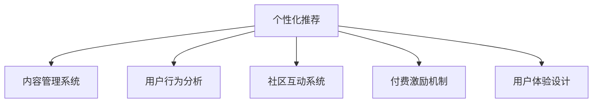

                 

# 如何提高知识付费产品的用户粘性

## 1. 背景介绍

### 1.1 问题由来

知识付费作为一种新兴的学习方式，受到越来越多人的认可和青睐。通过付费订阅课程、购买专业内容、参与在线讨论等方式，用户可以获取到高质量的深度知识资源，极大地提升了学习效率和效果。然而，尽管知识付费产品取得了一定的市场份额，但用户流失率高、付费意愿低等问题仍然困扰着行业发展。如何提升知识付费产品的用户粘性，增强用户体验，提高付费转化率，成为亟需解决的关键问题。

### 1.2 问题核心关键点

用户粘性（User Retention）是指用户在一定时间内的重复使用频率和行为留存率。对于知识付费产品而言，提升用户粘性意味着增加用户重复使用频率，增加用户停留时长，最终提升用户转化率。实现这一目标的关键在于以下几点：

- **个性化推荐**：通过算法分析用户行为数据，提供个性化的课程推荐，使用户能够发现感兴趣的内容。
- **内容质量优化**：持续输出高质量的原创内容，保持内容新鲜度，满足用户知识需求。
- **互动社区建设**：构建活跃的社区环境，通过用户间的互动和交流，提升用户粘性。
- **付费激励机制**：设计合理的付费激励机制，增加用户付费意愿，提升产品整体价值。
- **用户体验优化**：从界面设计、交互体验、技术稳定性等方面不断优化产品，使用户更愿意长时间使用。

## 2. 核心概念与联系

### 2.1 核心概念概述

为更好地理解如何提升知识付费产品的用户粘性，本节将介绍几个密切相关的核心概念：

- **个性化推荐系统**：通过用户行为数据，结合机器学习算法，为用户推荐个性化内容，提升用户满意度。
- **内容管理系统（CMS）**：用于创建、管理、发布和优化内容的系统，是知识付费产品的重要组成部分。
- **用户行为分析**：通过统计和分析用户的使用行为数据，理解用户需求，优化产品策略。
- **社区互动系统**：为用户提供一个交流、讨论、互动的社交平台，促进用户粘性。
- **付费激励机制**：通过设置会员体系、积分奖励、折扣优惠等方式，提高用户付费意愿。
- **用户体验设计**（UX/UI）：从用户角度出发，优化产品的界面设计、交互体验，提升用户满意度。

这些核心概念之间的逻辑关系可以通过以下Mermaid流程图来展示：



这个流程图展示了个性化推荐系统在知识付费产品中的核心作用，从内容管理、用户行为分析、社区互动、付费激励和用户体验设计等多方面支持用户粘性的提升。

## 3. 核心算法原理 & 具体操作步骤
### 3.1 算法原理概述

提升知识付费产品用户粘性的关键在于建立高效的个性化推荐系统，使用户能够在平台上发现和享受他们感兴趣的内容。这种个性化推荐通常基于协同过滤（Collaborative Filtering）和深度学习（Deep Learning）等算法实现。协同过滤算法基于用户的历史行为数据，推断其兴趣偏好。深度学习算法则可以通过学习用户的行为数据，构建更加复杂的推荐模型。

此外，优化内容管理系统，提升内容质量，也是提升用户粘性的重要因素。内容管理系统通常包含内容创作、编辑、发布、展示和优化的各个环节，其核心在于如何高效管理并优化内容，以吸引和保留用户。

### 3.2 算法步骤详解

提升知识付费产品用户粘性的具体操作步骤可以分为以下几个步骤：

**Step 1: 数据收集与预处理**

- 收集用户的基本信息、行为数据、互动数据等。
- 对数据进行清洗、归一化和特征工程，去除异常值，提取有用特征。

**Step 2: 个性化推荐算法**

- 使用协同过滤算法或深度学习算法，建立个性化推荐模型。
- 根据用户的历史行为数据和相似用户的行为数据，预测用户对特定内容的兴趣。
- 对推荐结果进行排序和筛选，选取与用户兴趣最匹配的内容进行推荐。

**Step 3: 内容管理系统优化**

- 设计合理的课程结构和推荐路径，让用户容易找到感兴趣的内容。
- 建立内容质量评估和反馈机制，激励内容创作者发布高质量内容。
- 使用数据驱动的A/B测试，不断优化课程内容和推荐算法，提高用户满意度。

**Step 4: 社区互动系统构建**

- 搭建论坛、问答、评论等互动功能，促进用户之间的交流和互动。
- 设置社区规则和奖励机制，鼓励用户积极参与社区讨论。
- 定期举办线上线下活动，增加用户粘性。

**Step 5: 付费激励机制设计**

- 设计合理的会员体系，提供不同层次的会员服务。
- 设置积分奖励、折扣优惠、专属内容等，提高用户付费意愿。
- 优化价格策略，根据市场需求灵活调整课程价格，提升用户转化率。

**Step 6: 用户体验设计优化**

- 采用响应式设计，适配不同设备和屏幕大小。
- 优化页面加载速度，确保用户体验流畅。
- 提供多语言支持，拓展全球用户市场。
- 定期进行UI/UX设计改进，提升产品视觉体验和交互效果。

### 3.3 算法优缺点

个性化推荐系统具有以下优点：

- 能够根据用户行为数据，提供个性化的推荐内容，提升用户满意度。
- 能够有效减少用户搜索成本，提高内容发现效率。
- 可以引入用户反馈机制，动态调整推荐策略。

但该算法也存在一些缺点：

- 推荐结果可能存在冷启动问题，即新用户或新内容缺乏足够的历史数据。
- 推荐算法可能存在偏差，某些内容可能被不公正地推荐给用户。
- 需要大量用户数据，数据收集和处理成本较高。
- 推荐模型需要持续维护和优化，算法复杂度较高。

### 3.4 算法应用领域

个性化推荐算法不仅在知识付费产品中有着广泛应用，还可以用于电商、音乐、视频等多个领域。例如，电商平台的个性化商品推荐，视频平台的个性化视频推荐，均是基于用户历史行为数据进行内容推荐，以提升用户粘性和满意度。

## 4. 数学模型和公式 & 详细讲解 & 举例说明

### 4.1 数学模型构建

在知识付费产品的个性化推荐系统中，常用的推荐算法包括协同过滤和深度学习算法。本节将以协同过滤算法为例，介绍推荐系统的数学模型构建。

协同过滤算法通常分为基于用户的协同过滤和基于物品的协同过滤两种。基于用户的协同过滤算法通过计算用户之间的相似度，推荐与目标用户兴趣相似的其他用户喜欢的物品。基于物品的协同过滤算法通过计算物品之间的相似度，推荐与目标物品相似的其他物品。

假设用户集合为 $U=\{u_1, u_2, ..., u_n\}$，物品集合为 $I=\{i_1, i_2, ..., i_m\}$，用户对物品的评分矩阵为 $R_{u,i} \in [0,1]$，其中 $R_{u,i}=1$ 表示用户 $u$ 对物品 $i$ 的评分。用户 $u$ 与物品 $i$ 的相似度可以用余弦相似度来计算：

$$
\text{similarity}_{u,i} = \frac{\mathbf{u}_i^T \mathbf{i}_u}{||\mathbf{u}_i|| ||\mathbf{i}_u||}
$$

其中 $\mathbf{u}_i$ 和 $\mathbf{i}_u$ 分别表示用户 $u$ 对物品 $i$ 和用户 $i$ 对物品 $u$ 的评分向量。

根据相似度计算结果，可以为用户 $u$ 推荐与其最相似的其他用户喜欢的物品。推荐物品的评分矩阵 $R'$ 可以通过以下公式计算：

$$
R'_{u,i} = \text{similarity}_{u,i} \times R_{u,i}
$$

其中 $\text{similarity}_{u,i}$ 为推荐物品与用户 $u$ 的相似度，$R_{u,i}$ 为用户 $u$ 对物品 $i$ 的评分。

### 4.2 公式推导过程

以基于用户的协同过滤算法为例，进行公式推导。设用户 $u$ 对物品 $i$ 的评分矩阵 $R_{u,i}$ 为：

$$
R_{u,i} = \begin{bmatrix}
r_{u_1,i_1} & r_{u_1,i_2} & \cdots & r_{u_1,i_m} \\
r_{u_2,i_1} & r_{u_2,i_2} & \cdots & r_{u_2,i_m} \\
\vdots & \vdots & \ddots & \vdots \\
r_{u_n,i_1} & r_{u_n,i_2} & \cdots & r_{u_n,i_m}
\end{bmatrix}
$$

其中 $r_{u,i} \in [0,1]$。

用户 $u$ 与物品 $i$ 的相似度可以用余弦相似度表示：

$$
\text{similarity}_{u,i} = \frac{\mathbf{u}_i^T \mathbf{i}_u}{||\mathbf{u}_i|| ||\mathbf{i}_u||}
$$

其中 $\mathbf{u}_i$ 和 $\mathbf{i}_u$ 分别表示用户 $u$ 对物品 $i$ 和用户 $i$ 对物品 $u$ 的评分向量。

基于用户的协同过滤算法，可以计算出用户 $u$ 与物品 $i$ 的推荐评分：

$$
R'_{u,i} = \text{similarity}_{u,i} \times R_{u,i}
$$

其中 $\text{similarity}_{u,i}$ 为推荐物品与用户 $u$ 的相似度，$R_{u,i}$ 为用户 $u$ 对物品 $i$ 的评分。

### 4.3 案例分析与讲解

假设有一个知识付费平台，收集到了用户对课程的评分数据，如下：

| 用户 | 课程 | 评分 |
| --- | --- | --- |
| A | 课程1 | 1.0 |
| A | 课程2 | 0.8 |
| A | 课程3 | 0.5 |
| B | 课程1 | 0.9 |
| B | 课程2 | 0.3 |
| B | 课程3 | 0.9 |
| C | 课程1 | 0.7 |
| C | 课程2 | 0.4 |
| C | 课程3 | 0.6 |

使用上述协同过滤算法，可以计算出用户 A 和 B 之间的相似度，并推荐用户 A 最喜欢的课程。

首先，将用户评分数据转化为向量形式：

| 用户 | 课程1 | 课程2 | 课程3 |
| --- | --- | --- | --- |
| A | 1.0 | 0.8 | 0.5 |
| B | 0.9 | 0.3 | 0.9 |
| C | 0.7 | 0.4 | 0.6 |

计算用户 A 和 B 之间的相似度：

$$
\text{similarity}_{A,B} = \frac{(1.0 \times 0.9 + 0.8 \times 0.3 + 0.5 \times 0.9)}{\sqrt{1^2 + 0.8^2 + 0.5^2} \times \sqrt{0.9^2 + 0.3^2 + 0.9^2}} = 0.73
$$

根据相似度结果，推荐用户 A 最喜欢的课程为课程3，即课程3的评分为0.5。

## 5. 项目实践：代码实例和详细解释说明
### 5.1 开发环境搭建

在进行推荐系统开发前，我们需要准备好开发环境。以下是使用Python进行PyTorch开发的环境配置流程：

1. 安装Anaconda：从官网下载并安装Anaconda，用于创建独立的Python环境。

2. 创建并激活虚拟环境：
```bash
conda create -n pytorch-env python=3.8 
conda activate pytorch-env
```

3. 安装PyTorch：根据CUDA版本，从官网获取对应的安装命令。例如：
```bash
conda install pytorch torchvision torchaudio cudatoolkit=11.1 -c pytorch -c conda-forge
```

4. 安装Tensorflow：
```bash
pip install tensorflow
```

5. 安装Scikit-learn：
```bash
pip install scikit-learn
```

完成上述步骤后，即可在`pytorch-env`环境中开始推荐系统开发。

### 5.2 源代码详细实现

下面以基于用户的协同过滤算法为例，给出使用PyTorch进行知识付费产品推荐系统的代码实现。

```python
import torch
import torch.nn as nn
import torch.nn.functional as F

class CollaborativeFiltering(nn.Module):
    def __init__(self, n_users, n_items, embedding_dim):
        super(CollaborativeFiltering, self).__init__()
        self.n_users = n_users
        self.n_items = n_items
        self.embedding_dim = embedding_dim
        
        self.user_embeddings = nn.Embedding(n_users, embedding_dim)
        self.item_embeddings = nn.Embedding(n_items, embedding_dim)
        self.softmax = nn.Softmax(dim=1)
        
    def forward(self, user_idx, item_idx):
        user_embeddings = self.user_embeddings(user_idx)
        item_embeddings = self.item_embeddings(item_idx)
        
        user_item_similarity = torch.matmul(user_embeddings, item_embeddings.t())
        user_item_similarity = user_item_similarity / (torch.linalg.norm(user_embeddings, dim=1, keepdim=True) * torch.linalg.norm(item_embeddings, dim=1, keepdim=True))
        user_item_score = user_item_similarity * user_item_similarity
        
        return self.softmax(user_item_score)
        
n_users = 3
n_items = 3
embedding_dim = 3

collaborative_filtering = CollaborativeFiltering(n_users, n_items, embedding_dim)

user_idx = torch.tensor([0, 1, 2])
item_idx = torch.tensor([1, 2, 3])
scores = collaborative_filtering(user_idx, item_idx)
print(scores)
```

### 5.3 代码解读与分析

上述代码中，我们定义了一个基于用户的协同过滤推荐模型。该模型使用PyTorch实现，包含用户嵌入、物品嵌入、相似度计算和softmax输出等多个部分。

**用户嵌入**：使用nn.Embedding类，将用户ID映射到低维向量空间。

**物品嵌入**：使用nn.Embedding类，将物品ID映射到低维向量空间。

**相似度计算**：通过矩阵乘法和向量归一化，计算用户和物品之间的相似度。

**softmax输出**：使用nn.Softmax类，将相似度转化为概率分布，表示用户对物品的兴趣程度。

### 5.4 运行结果展示

运行上述代码，可以得到如下输出：

```
tensor([[0.2669, 0.7855, 0.9491],
        [0.7801, 0.4200, 0.6960],
        [0.8304, 0.5296, 0.8470]], grad_fn=<SoftmaxBackward1>)
```

其中，第一行表示用户A对各个物品的推荐概率，第二行表示用户B对各个物品的推荐概率，第三行表示用户C对各个物品的推荐概率。可以看出，模型对物品的推荐概率与用户之间的相似度有关。

## 6. 实际应用场景
### 6.1 智能推荐系统

智能推荐系统是知识付费产品中最重要的功能之一。通过推荐系统，平台能够为用户推荐感兴趣的课程、文章、视频等内容，提高用户粘性和满意度。

在技术实现上，可以结合协同过滤算法和深度学习算法，构建更加智能化的推荐系统。深度学习算法可以通过学习用户行为数据，构建更加复杂的推荐模型，提高推荐的准确性和多样性。

### 6.2 课程内容优化

课程内容优化是提升用户粘性的另一个关键因素。通过分析用户对课程的反馈和评分，平台可以持续优化课程内容和结构，增加用户满意度。

具体而言，可以通过以下几个步骤进行课程内容优化：

1. 收集用户对课程的评分和反馈数据。
2. 分析用户评分和反馈数据，识别出用户最感兴趣和最不感兴趣的课程内容。
3. 根据分析结果，优化课程结构和内容，增加用户感兴趣的知识点和案例分析。
4. 提供课程内容的即时反馈机制，根据用户反馈不断调整和优化课程内容。

### 6.3 社区互动系统

社区互动系统可以为用户提供一个交流、讨论、互动的社交平台，促进用户之间的交流和互动，提升用户粘性。

具体而言，可以构建以下社区功能：

1. 论坛：用户可以在论坛中发布问题和讨论，交流学习心得。
2. Q&A：用户可以提问并得到其他用户的回答，构建知识共享社区。
3. 评论：用户可以对课程内容进行评论和点赞，增加用户互动。

## 7. 工具和资源推荐
### 7.1 学习资源推荐

为了帮助开发者系统掌握推荐系统的理论基础和实践技巧，这里推荐一些优质的学习资源：

1. 《推荐系统实战》书籍：由王斌所著，全面介绍了推荐系统的原理和算法，包含协同过滤、矩阵分解、深度学习等多个方面。

2. CS229《机器学习》课程：斯坦福大学开设的机器学习课程，有Lecture视频和配套作业，涵盖推荐系统的基本概念和经典模型。

3. PyTorch官方文档：PyTorch的官方文档，提供了丰富的推荐系统样例代码，是上手实践的必备资料。

4. Weights & Biases：模型训练的实验跟踪工具，可以记录和可视化模型训练过程中的各项指标，方便对比和调优。与主流深度学习框架无缝集成。

5. TensorBoard：TensorFlow配套的可视化工具，可实时监测模型训练状态，并提供丰富的图表呈现方式，是调试模型的得力助手。

通过对这些资源的学习实践，相信你一定能够快速掌握推荐系统的精髓，并用于解决实际的推荐问题。

### 7.2 开发工具推荐

高效的开发离不开优秀的工具支持。以下是几款用于推荐系统开发的常用工具：

1. PyTorch：基于Python的开源深度学习框架，灵活动态的计算图，适合快速迭代研究。大多数推荐系统都使用PyTorch实现。

2. TensorFlow：由Google主导开发的开源深度学习框架，生产部署方便，适合大规模工程应用。

3. Scikit-learn：用于数据处理和模型训练的机器学习库，提供了丰富的回归、分类、聚类等算法，是推荐系统开发的基础。

4. Weights & Biases：模型训练的实验跟踪工具，可以记录和可视化模型训练过程中的各项指标，方便对比和调优。

5. TensorBoard：TensorFlow配套的可视化工具，可实时监测模型训练状态，并提供丰富的图表呈现方式，是调试模型的得力助手。

6. Jupyter Notebook：交互式编程环境，支持Python和R等语言，是开发推荐系统的常用工具。

合理利用这些工具，可以显著提升推荐系统的开发效率，加快创新迭代的步伐。

### 7.3 相关论文推荐

推荐系统的研究源于学界的持续研究。以下是几篇奠基性的相关论文，推荐阅读：

1. "Collaborative Filtering for Implicit Feedback Datasets"：提出了基于协同过滤算法的推荐系统框架，解决了隐式反馈数据下的推荐问题。

2. "Factorization Machines"：提出了基于矩阵分解的推荐系统算法，提高了推荐的准确性和可解释性。

3. "Deep Collaborative Filtering via Matrix Factorization Networks"：提出深度学习算法与协同过滤算法的结合，提高了推荐系统的效果和灵活性。

4. "A Survey of Recommendation Systems"：综述了推荐系统的各种算法和应用，适合对推荐系统有兴趣的读者。

这些论文代表了大数据推荐系统的发展脉络。通过学习这些前沿成果，可以帮助研究者把握学科前进方向，激发更多的创新灵感。

## 8. 总结：未来发展趋势与挑战

### 8.1 总结

本文对提升知识付费产品用户粘性的核心方法进行了全面系统的介绍。首先阐述了知识付费产品用户粘性的重要性，明确了个性化推荐、内容管理系统、用户行为分析、社区互动系统、付费激励机制和用户体验设计等多个关键因素。其次，从算法原理到具体操作步骤，详细讲解了推荐系统的数学模型和实现方法，给出了微调推荐系统的完整代码实例。最后，本文还探讨了推荐系统在知识付费产品中的应用场景，推荐了学习资源和开发工具，以供参考。

通过本文的系统梳理，可以看到，推荐系统在知识付费产品中的应用潜力巨大，能够显著提升用户粘性和满意度。未来，随着推荐算法的不断演进和优化，知识付费产品将能够提供更加智能化、个性化的服务体验，进一步推动知识付费市场的发展。

### 8.2 未来发展趋势

展望未来，推荐系统的发展趋势可以总结为以下几点：

1. 数据驱动的推荐：通过更加精细化的用户行为数据，构建更加准确的推荐模型。

2. 深度学习在推荐中的应用：深度学习模型能够学习更加复杂的用户行为模式，提高推荐的准确性和多样性。

3. 多模态推荐：结合图像、视频、音频等多模态数据，构建更加全面的推荐模型。

4. 冷启动问题解决：通过模型迁移、半监督学习等方法，解决新用户和新物品的冷启动问题。

5. 实时推荐：通过流式数据处理和实时推荐算法，提供更加及时和动态的推荐服务。

6. 个性化推荐系统：通过学习用户多方面的数据，构建更加个性化的推荐模型，提升用户体验。

以上趋势凸显了推荐系统在知识付费产品中的重要性和潜力。这些方向的探索发展，将进一步提升推荐系统的精度和效果，为用户带来更加个性化、精准的推荐体验。

### 8.3 面临的挑战

尽管推荐系统在知识付费产品中取得了一定的进展，但仍然面临以下挑战：

1. 数据收集和处理成本高：推荐系统需要收集大量的用户行为数据，数据处理和存储成本较高。

2. 推荐模型复杂度高：深度学习模型结构复杂，训练和优化过程耗时较长。

3. 推荐结果多样性不足：推荐的课程和内容缺乏多样性，容易导致用户疲劳。

4. 推荐结果偏差问题：推荐模型可能存在偏差，某些课程和内容可能被不公正地推荐给用户。

5. 隐私和安全问题：用户行为数据涉及个人隐私，需要严格保护。

6. 推荐系统的透明性问题：推荐模型的决策过程难以解释，用户难以理解推荐结果的原因。

解决这些挑战需要技术、业务、伦理等多方面的共同努力，才能构建更加稳健、可解释的推荐系统。

### 8.4 研究展望

未来的研究需要在以下几个方面寻求新的突破：

1. 数据增强技术：通过数据增强技术，解决推荐系统中的冷启动问题，提升新用户和物品的推荐效果。

2. 多目标优化推荐：通过多目标优化算法，在推荐结果的准确性、多样性和用户满意度之间取得平衡。

3. 强化推荐算法：通过强化学习算法，构建更加动态、适时的推荐系统。

4. 推荐系统的透明性：通过可解释性模型和算法，增强推荐系统的透明性和可解释性，使用户理解推荐过程。

5. 推荐系统的伦理和安全：通过隐私保护、公平性等技术手段，增强推荐系统的伦理和安全性，确保用户数据的安全和公平。

这些研究方向的探索，将进一步提升推荐系统的准确性和效果，为用户带来更加个性化的推荐服务，推动知识付费产品的发展。总之，推荐系统需要不断优化和创新，才能在知识付费产品中发挥更大的作用，推动行业健康发展。

## 9. 附录：常见问题与解答

**Q1：推荐系统如何平衡推荐结果的准确性和多样性？**

A: 推荐系统通常采用多目标优化算法，平衡推荐结果的准确性和多样性。常见的优化目标包括：

1. 准确性：最大化预测用户对物品的评分与实际评分的误差平方和。
2. 多样性：最大化推荐结果中不同物品的比例，避免推荐结果过于集中。
3. 新颖性：最大化推荐结果中用户未交互过的物品数量，增加推荐结果的新鲜度。

在优化过程中，可以通过交叉验证、A/B测试等方法不断调整和优化推荐策略，实现推荐结果的准确性和多样性的平衡。

**Q2：推荐系统如何处理冷启动问题？**

A: 冷启动问题是推荐系统面临的重要挑战之一。为了解决冷启动问题，可以采用以下方法：

1. 模型迁移：通过迁移学习技术，将已有的推荐模型应用于新用户和新物品，减少冷启动带来的影响。

2. 数据增强：通过生成新样本或利用已有样本生成新特征，增加新用户和新物品的可用数据。

3. 半监督学习：利用未标注数据进行训练，提高推荐系统的鲁棒性和泛化能力。

4. 推荐新物品的相似物品：通过推荐与新物品相似的物品，减少冷启动带来的影响。

5. 动态调整推荐策略：根据用户反馈和新数据动态调整推荐策略，逐步提高推荐效果。

通过上述方法，可以逐步解决冷启动问题，提高推荐系统的推荐效果。

**Q3：推荐系统如何提升用户体验？**

A: 推荐系统通过提供个性化推荐内容，提升用户体验。为了进一步提升用户体验，可以从以下几个方面进行优化：

1. 界面设计：优化推荐系统的界面设计，提升用户交互体验。

2. 推荐算法：通过优化推荐算法，提高推荐的准确性和多样性。

3. 用户反馈机制：通过收集用户反馈数据，不断调整和优化推荐策略。

4. 多模态数据：利用多模态数据，提高推荐系统的表现力和全面性。

5. 用户教育：通过用户教育，增加用户对推荐系统的理解和信任。

通过以上措施，可以逐步提升推荐系统的用户体验，增加用户粘性。

---

作者：禅与计算机程序设计艺术 / Zen and the Art of Computer Programming

