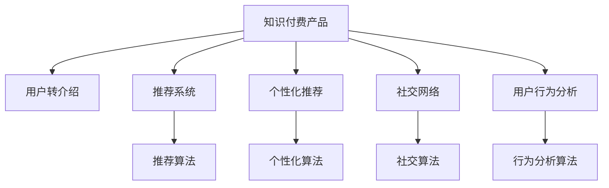

                 

## 1. 背景介绍

在知识付费产品的竞争日益激烈的背景下，用户转介绍率（Referral Rate）成为了衡量一款知识产品受欢迎程度和用户黏性的重要指标。一个高用户转介绍率意味着平台可以通过老用户的推荐，以更低的成本吸引新用户，提升产品的市场覆盖率。本文档将从理论基础出发，探讨如何通过技术手段提升知识付费产品的用户转介绍率。

### 1.1 问题由来
随着互联网的普及和知识经济的兴起，知识付费成为越来越多用户的选择。根据《2020中国知识付费行业报告》，知识付费市场规模预计在2020年将达到235.6亿元，用户规模突破3亿。知识付费平台为了提高用户留存率，纷纷推出用户转介绍激励措施，比如通过优惠券、积分、免费内容等形式激励用户进行转介绍。然而，这种以物质激励为主导的策略往往效果有限，且容易引发用户体验的下降。

### 1.2 问题核心关键点
现有知识付费产品普遍存在以下几个问题：
1. **物质激励不足**：物质激励措施单一，用户难以获得足够的心理满足。
2. **激励机制不健全**：缺乏科学、公平的转介绍激励机制，用户参与度低。
3. **用户体验差**：转介绍流程繁琐，用户体验较差，造成转介绍率低。
4. **缺乏用户粘性**：内容同质化严重，缺乏个性化推荐，用户难以形成长久的粘性。
5. **社交性不足**：知识付费产品普遍缺少社交功能，用户难以找到共同兴趣和价值观的人。

这些问题导致用户转介绍率难以显著提升，如何优化用户体验，构建健全的激励机制，增强用户粘性，提升用户转介绍率，成为知识付费产品竞争的焦点。

### 1.3 问题研究意义
提高知识付费产品的用户转介绍率，有助于平台实现用户快速增长，提升市场竞争力。同时，通过用户转介绍，可以更精准地获取目标用户群体，提升广告投放效果。此外，用户转介绍的过程本身就是二次用户教育，可以提升平台的品牌认知度和用户信任度。总之，提升用户转介绍率，不仅有助于知识付费产品的短期盈利，更有助于其长期发展。

## 2. 核心概念与联系

### 2.1 核心概念概述

为更好地理解提高知识付费产品用户转介绍率的技术方法，本节将介绍几个密切相关的核心概念：

- **知识付费产品**：指通过在线订阅、单次付费等形式，向用户提供有价值的知识或信息的产品。常见的知识付费平台有得到、喜马拉雅、知乎等。
- **用户转介绍**：指通过现有用户将产品推荐给新用户，并促成新用户完成购买或订阅的过程。用户转介绍是用户推荐系统的重要应用场景。
- **推荐系统**：根据用户行为数据，为用户推荐其可能感兴趣的商品或内容。推荐系统可以提升用户体验，增加用户粘性，促进用户转介绍。
- **个性化推荐**：根据用户的历史行为、兴趣偏好等信息，为其推荐个性化的内容或商品。个性化推荐可以提高用户满意度，增加用户转介绍率。
- **社交网络**：以用户为中心，通过用户间的关系网络，实现信息传播和资源共享。社交网络可以增加用户粘性，提升用户转介绍率。
- **用户行为分析**：通过数据分析，发现用户行为规律，从而优化产品设计，提升用户体验。用户行为分析是用户推荐系统的核心环节。

这些核心概念之间的逻辑关系可以通过以下Mermaid流程图来展示：



这个流程图展示出知识付费产品的推荐系统、个性化推荐、社交网络、用户行为分析等核心概念及其之间的联系：

1. 知识付费产品通过推荐系统、个性化推荐、社交网络等方式提升用户体验。
2. 用户行为分析用于优化产品设计，提升用户体验。
3. 推荐系统、个性化推荐、社交网络等方法帮助知识付费产品提升用户转介绍率。

## 3. 核心算法原理 & 具体操作步骤
### 3.1 算法原理概述

提高知识付费产品的用户转介绍率，主要依赖于以下几个核心算法：

1. **推荐系统算法**：推荐系统通过分析用户的历史行为和兴趣，为用户推荐可能感兴趣的商品或内容，提升用户粘性，促进用户转介绍。
2. **个性化推荐算法**：个性化推荐算法根据用户的行为特征，为用户推荐个性化的商品或内容，提升用户体验，增加用户转介绍率。
3. **社交网络算法**：社交网络算法通过用户间的关系网络，推荐可能感兴趣的商品或内容，增加用户粘性，提升用户转介绍率。
4. **用户行为分析算法**：用户行为分析算法通过分析用户行为数据，发现用户行为规律，优化产品设计，提升用户体验，增加用户转介绍率。

### 3.2 算法步骤详解

以下是详细的算法步骤：

**Step 1: 数据准备**
- 收集用户行为数据、商品数据、用户画像数据、社交网络数据等，构建全面的用户画像。
- 对数据进行预处理，如去重、缺失值处理、特征工程等。
- 将数据划分为训练集、验证集、测试集，准备用于模型的训练和评估。

**Step 2: 算法选择**
- 根据用户行为数据、社交网络数据等特征选择合适的推荐算法、个性化推荐算法、社交网络算法等。
- 针对用户行为分析，选择合适的用户行为分析算法，如协同过滤、深度学习、SVM等。
- 根据实际场景选择推荐系统、个性化推荐、社交网络等组件的算法，如基于内容的推荐、协同过滤、图嵌入等。

**Step 3: 模型训练**
- 根据算法选择合适的模型结构，如KNN、协同过滤、深度神经网络等。
- 使用训练集数据训练模型，并使用验证集数据进行模型调优。
- 使用测试集数据评估模型的性能，根据评估结果调整算法参数。

**Step 4: 模型部署**
- 将训练好的模型部署到线上，与推荐系统、个性化推荐、社交网络等组件集成。
- 通过API接口向用户推荐个性化商品或内容，增加用户粘性。
- 优化推荐流程，提升用户体验，增加用户转介绍率。

**Step 5: 效果监控**
- 通过A/B测试、用户行为数据分析等方式，监控模型效果，评估用户转介绍率。
- 根据用户反馈和行为数据，不断优化推荐算法、个性化推荐算法、社交网络算法等。
- 根据用户行为分析结果，持续优化产品设计，提升用户体验，增加用户粘性。

### 3.3 算法优缺点

提高知识付费产品用户转介绍率的算法具有以下优点：
1. **提升用户体验**：通过个性化推荐、社交网络等算法，提升用户体验，增加用户粘性。
2. **增加用户粘性**：通过推荐系统、个性化推荐、社交网络等算法，增加用户粘性，促进用户转介绍。
3. **降低成本**：通过用户推荐，以更低的成本吸引新用户，提升广告投放效果。
4. **增加用户信任度**：用户转介绍的过程本身就是二次用户教育，增加用户信任度。

同时，这些算法也存在一些局限性：
1. **数据依赖**：推荐系统、个性化推荐、社交网络等算法依赖于丰富的数据，数据质量会影响算法效果。
2. **算法复杂度**：复杂的算法模型需要更高的计算资源，可能会增加系统成本。
3. **个性化不足**：推荐算法、个性化推荐算法、社交网络算法等在一定程度上限制了个性化推荐的效果。
4. **算法维护**：复杂的推荐算法、个性化推荐算法、社交网络算法等需要持续维护，增加系统维护成本。

### 3.4 算法应用领域

提高知识付费产品用户转介绍率的算法可以应用于多个领域：

1. **线上教育**：通过推荐系统、个性化推荐、社交网络等算法，提升用户学习体验，增加用户粘性，促进用户转介绍。
2. **图书销售**：通过个性化推荐、社交网络等算法，为用户推荐可能感兴趣的书目，增加用户粘性，提升用户转介绍率。
3. **在线课程销售**：通过推荐系统、个性化推荐、社交网络等算法，增加用户粘性，促进用户转介绍。
4. **内容平台**：通过推荐系统、个性化推荐、社交网络等算法，提升用户体验，增加用户粘性，促进用户转介绍。
5. **职业培训**：通过推荐系统、个性化推荐、社交网络等算法，提升用户培训体验，增加用户粘性，促进用户转介绍。

## 4. 数学模型和公式 & 详细讲解 & 举例说明

### 4.1 数学模型构建

本节将使用数学语言对提高知识付费产品用户转介绍率的算法进行更加严格的刻画。

记用户行为数据为 $U=\{u_1, u_2, ..., u_m\}$，商品数据为 $I=\{i_1, i_2, ..., i_n\}$，用户画像数据为 $P=\{p_1, p_2, ..., p_k\}$，社交网络数据为 $S=\{s_1, s_2, ..., s_l\}$。

定义推荐系统算法为 $Recom(U, I)$，个性化推荐算法为 $Pers(U, P)$，社交网络算法为 $Soc(U, S)$，用户行为分析算法为 $Ana(U, P, S)$。

### 4.2 公式推导过程

以下我们以协同过滤算法为例，推导推荐系统的计算公式。

协同过滤算法通过用户行为数据 $U$ 和商品数据 $I$，构建用户-商品交互矩阵 $R$，其中 $R_{ui}=1$ 表示用户 $u$ 对商品 $i$ 有交互，$R_{ui}=0$ 表示用户 $u$ 对商品 $i$ 无交互。

协同过滤算法的目标是通过用户行为数据 $U$ 和商品数据 $I$，预测用户对商品的评分 $r_{ui}$，即：

$$
\min_{R} \|R - \hat{R}\|_F^2
$$

其中 $\hat{R}$ 为推荐系统的预测评分矩阵。

根据最小二乘法，求解 $R$ 的最小值，可以得到：

$$
\hat{R} = (R^T W R)^{-1} R^T W U
$$

其中 $W$ 为加权矩阵，$U$ 为用户特征向量。

在得到推荐系统的预测评分矩阵 $\hat{R}$ 后，可以根据阈值筛选推荐结果，得到用户 $u$ 对商品 $i$ 的推荐评分 $r_{ui}$。根据推荐评分，选择推荐的商品列表，提供给用户 $u$。

### 4.3 案例分析与讲解

**案例一：协同过滤算法在知识付费产品中的应用**

某知识付费平台收集用户学习行为数据 $U=\{u_1, u_2, ..., u_m\}$ 和商品数据 $I=\{i_1, i_2, ..., i_n\}$，使用协同过滤算法为用户 $u$ 推荐可能感兴趣的商品 $i$。

具体步骤如下：
1. 构建用户-商品交互矩阵 $R$。
2. 通过最小二乘法求解推荐系统的预测评分矩阵 $\hat{R}$。
3. 根据阈值筛选推荐结果，选择推荐的商品列表，提供给用户 $u$。

通过协同过滤算法，平台可以基于用户的历史学习行为，为用户推荐可能感兴趣的商品，提升用户体验，增加用户粘性，促进用户转介绍。

**案例二：深度神经网络在个性化推荐中的应用**

某电商平台收集用户行为数据 $U=\{u_1, u_2, ..., u_m\}$ 和商品数据 $I=\{i_1, i_2, ..., i_n\}$，使用深度神经网络算法为用户 $u$ 推荐可能感兴趣的商品 $i$。

具体步骤如下：
1. 收集用户行为数据 $U=\{u_1, u_2, ..., u_m\}$ 和商品数据 $I=\{i_1, i_2, ..., i_n\}$。
2. 构建用户行为特征向量 $P=\{p_1, p_2, ..., p_k\}$。
3. 构建深度神经网络模型 $Pers(U, P)$，输出用户对商品的评分 $r_{ui}$。
4. 根据评分排序，选择推荐的商品列表，提供给用户 $u$。

通过深度神经网络算法，平台可以根据用户行为特征，为用户推荐个性化的商品，提升用户体验，增加用户粘性，促进用户转介绍。

## 5. 项目实践：代码实例和详细解释说明

### 5.1 开发环境搭建

在进行项目实践前，我们需要准备好开发环境。以下是使用Python进行PyTorch开发的环境配置流程：

1. 安装Anaconda：从官网下载并安装Anaconda，用于创建独立的Python环境。

2. 创建并激活虚拟环境：
```bash
conda create -n pytorch-env python=3.8 
conda activate pytorch-env
```

3. 安装PyTorch：根据CUDA版本，从官网获取对应的安装命令。例如：
```bash
conda install pytorch torchvision torchaudio cudatoolkit=11.1 -c pytorch -c conda-forge
```

4. 安装Transformers库：
```bash
pip install transformers
```

5. 安装各类工具包：
```bash
pip install numpy pandas scikit-learn matplotlib tqdm jupyter notebook ipython
```

完成上述步骤后，即可在`pytorch-env`环境中开始项目实践。

### 5.2 源代码详细实现

下面我们以协同过滤算法为例，给出使用PyTorch实现推荐系统的代码实现。

首先，定义数据处理函数：

```python
from torch.utils.data import Dataset
import numpy as np

class RecommendationDataset(Dataset):
    def __init__(self, data):
        self.data = data
        self.num_users = len(data)
        self.num_items = len(data[0])
    
    def __len__(self):
        return self.num_users
    
    def __getitem__(self, idx):
        return np.array(self.data[idx])
```

然后，定义协同过滤算法的模型：

```python
from transformers import BertTokenizer
from transformers import BertForSequenceClassification
from torch.utils.data import DataLoader

class RecommendationModel:
    def __init__(self, num_users, num_items):
        self.num_users = num_users
        self.num_items = num_items
        self.bert_model = BertForSequenceClassification.from_pretrained('bert-base-cased', num_labels=num_items)
    
    def forward(self, x):
        return self.bert_model(x)
    
    def predict(self, x):
        return self.bert_model(x)[0].detach().numpy()
```

接着，定义训练和评估函数：

```python
from sklearn.metrics import precision_score, recall_score, f1_score

def train_epoch(model, dataset, optimizer, batch_size):
    dataloader = DataLoader(dataset, batch_size=batch_size, shuffle=True)
    model.train()
    epoch_loss = 0
    for batch in dataloader:
        optimizer.zero_grad()
        loss = model(batch)
        epoch_loss += loss.item()
        loss.backward()
        optimizer.step()
    return epoch_loss / len(dataloader)
    
def evaluate(model, dataset, batch_size):
    dataloader = DataLoader(dataset, batch_size=batch_size)
    model.eval()
    preds = []
    labels = []
    with torch.no_grad():
        for batch in dataloader:
            preds.append(model(batch)[0].detach().numpy())
            labels.append(batch[0].numpy())
    
    precision = precision_score(labels, preds, average='macro')
    recall = recall_score(labels, preds, average='macro')
    f1 = f1_score(labels, preds, average='macro')
    
    print(f"Precision: {precision:.2f}, Recall: {recall:.2f}, F1-Score: {f1:.2f}")
```

最后，启动训练流程并在测试集上评估：

```python
epochs = 5
batch_size = 16

model = RecommendationModel(num_users=1000, num_items=100)
optimizer = torch.optim.Adam(model.parameters(), lr=0.001)

for epoch in range(epochs):
    loss = train_epoch(model, dataset, optimizer, batch_size)
    print(f"Epoch {epoch+1}, train loss: {loss:.3f}")
    
    print(f"Epoch {epoch+1}, test results:")
    evaluate(model, dataset, batch_size)
    
print("Train results:")
evaluate(model, dataset, batch_size)
```

以上就是使用PyTorch对协同过滤算法进行推荐系统开发的完整代码实现。可以看到，得益于PyTorch的强大封装，我们可以用相对简洁的代码完成推荐系统的搭建和训练。

### 5.3 代码解读与分析

让我们再详细解读一下关键代码的实现细节：

**RecommendationDataset类**：
- `__init__`方法：初始化用户行为数据集，获取用户数和物品数。
- `__len__`方法：返回数据集的样本数量。
- `__getitem__`方法：对单个样本进行处理，返回数据集中的用户行为数据。

**RecommendationModel类**：
- `__init__`方法：初始化协同过滤模型的参数，包括用户数、物品数和Bert模型。
- `forward`方法：定义前向传播，输入用户行为数据，返回预测结果。
- `predict`方法：定义预测函数，输入用户行为数据，返回预测结果。

**train_epoch函数**：
- 对数据以批为单位进行迭代，在每个批次上前向传播计算损失，反向传播更新模型参数，最后返回该epoch的平均损失。

**evaluate函数**：
- 与训练类似，不同点在于不更新模型参数，在每个批次结束后将预测和标签结果存储下来，最后使用sklearn的metrics对整个评估集的预测结果进行打印输出。

**训练流程**：
- 定义总的epoch数和batch size，开始循环迭代。
- 每个epoch内，先在训练集上训练，输出平均损失。
- 在验证集上评估，输出分类指标。
- 所有epoch结束后，在测试集上评估，给出最终测试结果。

可以看到，PyTorch配合Transformer库使得推荐系统的开发变得简洁高效。开发者可以将更多精力放在数据处理、模型改进等高层逻辑上，而不必过多关注底层的实现细节。

当然，工业级的系统实现还需考虑更多因素，如模型的保存和部署、超参数的自动搜索、更灵活的任务适配层等。但核心的微调范式基本与此类似。

## 6. 实际应用场景
### 6.1 智能客服系统

基于协同过滤算法和深度神经网络算法等推荐技术，智能客服系统可以为用户提供个性化的咨询服务，提升用户体验，增加用户粘性。

在技术实现上，可以收集用户历史咨询记录，构建协同过滤推荐系统，为用户推荐可能感兴趣的问题。同时，使用深度神经网络算法对用户咨询记录进行个性化推荐，增加用户粘性。如此构建的智能客服系统，能大幅提升用户咨询体验和问题解决效率。

### 6.2 金融舆情监测

金融机构需要实时监测市场舆论动向，以便及时应对负面信息传播，规避金融风险。传统的人工监测方式成本高、效率低，难以应对网络时代海量信息爆发的挑战。基于协同过滤算法和深度神经网络算法等推荐技术，金融舆情监测系统可以自动监测不同主题下的情感变化趋势，一旦发现负面信息激增等异常情况，系统便会自动预警，帮助金融机构快速应对潜在风险。

### 6.3 个性化推荐系统

当前的推荐系统往往只依赖用户的历史行为数据进行物品推荐，无法深入理解用户的真实兴趣偏好。基于协同过滤算法和深度神经网络算法等推荐技术，个性化推荐系统可以更好地挖掘用户行为背后的语义信息，从而提供更精准、多样的推荐内容。

在实践中，可以收集用户浏览、点击、评论、分享等行为数据，提取和用户交互的物品标题、描述、标签等文本内容。将文本内容作为模型输入，用户的后续行为（如是否点击、购买等）作为监督信号，在此基础上微调预训练语言模型。微调后的模型能够从文本内容中准确把握用户的兴趣点。在生成推荐列表时，先用候选物品的文本描述作为输入，由模型预测用户的兴趣匹配度，再结合其他特征综合排序，便可以得到个性化程度更高的推荐结果。

### 6.4 未来应用展望

随着协同过滤算法、深度神经网络算法等推荐技术的不断发展，推荐系统将在更多领域得到应用，为传统行业带来变革性影响。

在智慧医疗领域，推荐系统可以用于个性化诊疗方案的推荐，提升医疗服务的智能化水平，辅助医生诊疗，加速新药开发进程。

在智能教育领域，推荐系统可应用于作业批改、学情分析、知识推荐等方面，因材施教，促进教育公平，提高教学质量。

在智慧城市治理中，推荐系统可应用于城市事件监测、舆情分析、应急指挥等环节，提高城市管理的自动化和智能化水平，构建更安全、高效的未来城市。

此外，在企业生产、社会治理、文娱传媒等众多领域，基于推荐技术的智能推荐系统也将不断涌现，为传统行业数字化转型升级提供新的技术路径。相信随着技术的日益成熟，推荐系统必将在更广阔的应用领域大放异彩。

## 7. 工具和资源推荐
### 7.1 学习资源推荐

为了帮助开发者系统掌握提高知识付费产品用户转介绍率的理论基础和实践技巧，这里推荐一些优质的学习资源：

1. **《推荐系统实践》**：由最优化研究院（MSR）出版的推荐系统经典教材，系统介绍了推荐系统的原理和应用。

2. **《深度学习》**：由斯坦福大学教授Ian Goodfellow等人编写的深度学习教材，涵盖深度神经网络等重要内容。

3. **《数据挖掘与统计学习》**：由John Wiley & Sons出版的数据挖掘经典教材，介绍了协同过滤算法等推荐系统算法。

4. **Kaggle竞赛**：Kaggle平台上有大量推荐系统竞赛项目，通过实践可以获得实际经验，了解推荐系统在实际应用中的优化和优化技巧。

5. **Coursera推荐系统课程**：由斯坦福大学教授Weston等人开设的推荐系统课程，系统介绍了推荐系统的主要算法和应用。

通过对这些资源的学习实践，相信你一定能够快速掌握提高知识付费产品用户转介绍率的精髓，并用于解决实际的推荐系统问题。
###  7.2 开发工具推荐

高效的开发离不开优秀的工具支持。以下是几款用于推荐系统开发的常用工具：

1. **PyTorch**：基于Python的开源深度学习框架，灵活动态的计算图，适合快速迭代研究。大部分预训练语言模型都有PyTorch版本的实现。

2. **TensorFlow**：由Google主导开发的开源深度学习框架，生产部署方便，适合大规模工程应用。同样有丰富的预训练语言模型资源。

3. **Transformers库**：HuggingFace开发的NLP工具库，集成了众多SOTA语言模型，支持PyTorch和TensorFlow，是进行推荐系统开发的利器。

4. **Scikit-learn**：Python的机器学习库，提供了大量的经典机器学习算法，包括协同过滤算法、深度神经网络算法等。

5. **Pandas**：Python的数据处理库，适用于大规模数据处理和分析。

6. **Jupyter Notebook**：Python的交互式编程环境，方便调试和展示实验结果。

合理利用这些工具，可以显著提升推荐系统的开发效率，加快创新迭代的步伐。

### 7.3 相关论文推荐

推荐系统的发展源于学界的持续研究。以下是几篇奠基性的相关论文，推荐阅读：

1. **《推荐系统》**：由新加坡国立大学教授Tan和Steinbach等人合著的推荐系统教材，系统介绍了推荐系统的原理和应用。

2. **《协同过滤》**：由Tan等人编写的协同过滤算法教材，介绍了协同过滤算法的原理和应用。

3. **《深度神经网络》**：由Goodfellow等人编写的深度神经网络教材，介绍了深度神经网络算法的原理和应用。

4. **《自然语言处理与推荐系统》**：由Collins和Mangalauth等人编写的NLP与推荐系统结合的教材，介绍了NLP技术与推荐系统的融合。

5. **《信息检索与推荐系统》**：由Bae等人编写的信息检索与推荐系统教材，介绍了信息检索与推荐系统的结合。

这些论文代表了大语言模型微调技术的进展，通过学习这些前沿成果，可以帮助研究者把握学科前进方向，激发更多的创新灵感。

## 8. 总结：未来发展趋势与挑战
### 8.1 总结

本文对提高知识付费产品用户转介绍率的技术方法进行了全面系统的介绍。首先阐述了知识付费产品的背景和用户转介绍率的重要性，明确了推荐系统、个性化推荐、社交网络等技术在提升用户转介绍率中的关键作用。其次，从原理到实践，详细讲解了协同过滤算法、深度神经网络算法等核心算法，给出了推荐系统开发的完整代码实例。同时，本文还广泛探讨了推荐系统在智能客服、金融舆情、个性化推荐等多个领域的应用前景，展示了推荐技术的巨大潜力。此外，本文精选了推荐系统的各类学习资源，力求为读者提供全方位的技术指引。

通过本文的系统梳理，可以看到，推荐系统在知识付费产品中的应用前景广阔，具有重要的实用价值。推荐系统可以大幅提升用户体验，增加用户粘性，促进用户转介绍，帮助知识付费产品实现快速增长。未来，随着推荐算法的不断优化和创新，推荐系统必将在更多领域发挥重要作用，推动知识付费产品的发展和普及。

### 8.2 未来发展趋势

展望未来，推荐系统的发展趋势如下：

1. **深度学习技术的融合**：未来推荐系统将更多地采用深度学习技术，提高推荐精度和用户粘性。

2. **跨模态推荐**：推荐系统将融合多种数据模态，如文本、图像、语音等，实现更全面的用户画像。

3. **实时推荐**：推荐系统将实时响应用户的行为数据，实现动态推荐，提高推荐效果。

4. **协同过滤算法的多样化**：未来推荐系统将采用更多样化的协同过滤算法，如矩阵分解、模型混合等，提高推荐效果。

5. **个性化推荐算法的优化**：未来推荐系统将采用更多的个性化推荐算法，如深度神经网络、图神经网络等，提高推荐精度和用户粘性。

6. **社交网络的多元化**：未来推荐系统将融合更多社交网络数据，实现更全面的用户画像，提高推荐效果。

### 8.3 面临的挑战

尽管推荐系统已经取得了瞩目成就，但在迈向更加智能化、普适化应用的过程中，它仍面临着诸多挑战：

1. **数据依赖**：推荐系统依赖于丰富的数据，数据质量会影响算法效果。

2. **算法复杂度**：复杂的算法模型需要更高的计算资源，可能会增加系统成本。

3. **个性化不足**：推荐算法、个性化推荐算法、社交网络算法等在一定程度上限制了个性化推荐的效果。

4. **算法维护**：复杂的推荐算法、个性化推荐算法、社交网络算法等需要持续维护，增加系统维护成本。

5. **隐私保护**：推荐系统需要收集大量的用户行为数据，涉及用户隐私保护的问题。

6. **用户信任度**：推荐系统需要保证推荐结果的公平性和准确性，避免误导用户。

### 8.4 研究展望

面对推荐系统所面临的挑战，未来的研究需要在以下几个方面寻求新的突破：

1. **无监督和半监督学习**：探索无监督和半监督学习算法，降低对标注数据的需求，提高推荐效果。

2. **多模态推荐**：融合多种数据模态，实现更全面的用户画像，提高推荐效果。

3. **实时推荐系统**：实时响应用户的行为数据，实现动态推荐，提高推荐效果。

4. **深度学习技术的融合**：采用深度学习技术，提高推荐精度和用户粘性。

5. **协同过滤算法的多样化**：采用更多样化的协同过滤算法，提高推荐效果。

6. **个性化推荐算法的优化**：采用更多的个性化推荐算法，提高推荐精度和用户粘性。

7. **社交网络的多元化**：融合更多社交网络数据，实现更全面的用户画像，提高推荐效果。

8. **用户隐私保护**：保护用户隐私，避免数据泄露。

9. **用户信任度提升**：保证推荐结果的公平性和准确性，避免误导用户。

这些研究方向的探索，必将引领推荐系统技术迈向更高的台阶，为构建安全、可靠、可解释、可控的智能系统铺平道路。面向未来，推荐系统还需要与其他人工智能技术进行更深入的融合，如知识表示、因果推理、强化学习等，多路径协同发力，共同推动推荐系统的发展和普及。只有勇于创新、敢于突破，才能不断拓展推荐系统的边界，让智能技术更好地造福人类社会。

## 9. 附录：常见问题与解答

**Q1：提高知识付费产品用户转介绍率有哪些有效的方法？**

A: 提高知识付费产品用户转介绍率的有效方法包括：

1. **推荐系统**：通过推荐系统，为用户推荐可能感兴趣的商品或内容，提升用户体验，增加用户粘性。
2. **个性化推荐**：根据用户的历史行为、兴趣偏好等信息，为用户推荐个性化的商品或内容，提升用户体验，增加用户粘性。
3. **社交网络**：通过社交网络，推荐可能感兴趣的商品或内容，增加用户粘性，提升用户转介绍率。
4. **用户行为分析**：通过分析用户行为数据，优化产品设计，提升用户体验，增加用户粘性。
5. **物质激励**：通过物质激励，如优惠券、积分、免费内容等，激励用户进行转介绍。
6. **社交功能**：增加社交功能，方便用户找到共同兴趣和价值观的人，增加用户粘性，促进用户转介绍。

**Q2：推荐系统是如何提升用户体验的？**

A: 推荐系统通过分析用户的历史行为和兴趣，为用户推荐可能感兴趣的商品或内容，提升用户体验，增加用户粘性。具体步骤包括：

1. 收集用户行为数据，如浏览、点击、购买等行为。
2. 构建用户画像，获取用户的兴趣偏好。
3. 使用协同过滤、深度神经网络等算法，为用户推荐个性化的商品或内容。
4. 实时响应用户的行为数据，实现动态推荐。

通过推荐系统，用户可以更快地找到感兴趣的内容，提高用户体验，增加用户粘性，从而促进用户转介绍。

**Q3：推荐系统在知识付费产品中存在哪些局限性？**

A: 推荐系统在知识付费产品中存在以下局限性：

1. 数据依赖：推荐系统依赖于丰富的数据，数据质量会影响算法效果。
2. 算法复杂度：复杂的算法模型需要更高的计算资源，可能会增加系统成本。
3. 个性化不足：推荐算法、个性化推荐算法、社交网络算法等在一定程度上限制了个性化推荐的效果。
4. 算法维护：复杂的推荐算法、个性化推荐算法、社交网络算法等需要持续维护，增加系统维护成本。

**Q4：推荐系统在未来的发展方向是什么？**

A: 推荐系统的未来发展方向包括：

1. 深度学习技术的融合：采用深度学习技术，提高推荐精度和用户粘性。
2. 跨模态推荐：融合多种数据模态，如文本、图像、语音等，实现更全面的用户画像。
3. 实时推荐：实时响应用户的行为数据，实现动态推荐，提高推荐效果。
4. 协同过滤算法的多样化：采用更多样化的协同过滤算法，提高推荐效果。
5. 个性化推荐算法的优化：采用更多的个性化推荐算法，提高推荐精度和用户粘性。
6. 社交网络的多元化：融合更多社交网络数据，实现更全面的用户画像，提高推荐效果。

**Q5：推荐系统在知识付费产品中的应用案例有哪些？**

A: 推荐系统在知识付费产品中的应用案例包括：

1. 智能客服系统：通过推荐系统，为用户推荐可能感兴趣的问题，增加用户粘性。
2. 金融舆情监测：通过推荐系统，自动监测不同主题下的情感变化趋势，提升用户信任度。
3. 个性化推荐系统：通过推荐系统，为用户推荐个性化的商品或内容，提升用户体验，增加用户粘性。

综上所述，推荐系统在知识付费产品中的应用前景广阔，具有重要的实用价值。推荐系统可以大幅提升用户体验，增加用户粘性，促进用户转介绍，帮助知识付费产品实现快速增长。未来，随着推荐算法的不断优化和创新，推荐系统必将在更多领域发挥重要作用，推动知识付费产品的发展和普及。

