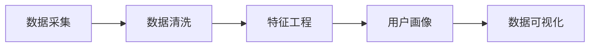

                 

## 1. 背景介绍

在数字化时代，如何精准理解用户行为、预测用户需求、优化用户体验，成为企业数字化转型的核心挑战之一。用户行为分析作为数字化运营的关键工具，其重要性不言而喻。本文将系统介绍如何进行有效的用户行为分析，涵盖数据采集、分析模型、应用场景等方面，旨在帮助企业通过深入的用户行为洞察，提升业务决策水平和运营效率。

## 2. 核心概念与联系

### 2.1 核心概念概述

- **用户行为分析(User Behavior Analysis, UBA)**：指通过对用户在使用产品或服务时的行为数据进行收集和分析，从而洞察用户需求、行为特征、偏好等，为产品优化、营销决策提供依据。
- **数据采集(Data Collection)**：通过各种方式（如浏览器Cookie、移动设备日志、用户调查等）收集用户在使用产品时的各种行为数据。
- **数据清洗(Data Cleaning)**：对采集到的数据进行去重、去噪、格式转换等预处理，以保证数据的质量和一致性。
- **特征工程(Feature Engineering)**：从原始数据中提取有意义的特征，用于训练机器学习模型。
- **用户画像(User Persona)**：根据用户行为数据，构建详细的用户画像，描绘用户的基本信息、兴趣爱好、行为模式等。
- **数据可视化(Data Visualization)**：通过图表、仪表盘等形式，将分析结果直观呈现，辅助业务决策。

### 2.2 核心概念原理和架构的 Mermaid 流程图



这个流程图展示了用户行为分析的核心流程，即从数据采集开始，经过数据清洗和特征工程，最终构建用户画像并可视化的过程。

## 3. 核心算法原理 & 具体操作步骤

### 3.1 算法原理概述

用户行为分析的核心理论基于统计学和机器学习。通过收集用户的各种行为数据，运用统计方法计算用户行为指标（如点击率、转化率、停留时间等），并通过机器学习模型对用户行为进行预测和分类，构建用户画像，预测用户行为，优化产品设计，提升用户体验。

### 3.2 算法步骤详解

**Step 1: 数据采集**

1. **选择数据源**：根据业务需求，选择适合的监测工具和数据源，如浏览器的Cookie、网站事件、移动设备日志等。
2. **设置数据采集规则**：定义哪些行为需要被采集、数据采集的频率等。

**Step 2: 数据清洗**

1. **去重**：去除重复的数据，避免数据冗余。
2. **去噪**：过滤掉不相关的噪音数据，如系统自动生成的无效日志。
3. **格式转换**：将不同格式的数据转换为统一格式，方便后续分析。

**Step 3: 特征工程**

1. **特征提取**：从原始数据中提取有意义的特征，如用户登录时间、浏览时间、购买金额等。
2. **特征选择**：通过特征选择方法（如卡方检验、信息增益等）选择最具代表性和区分度的特征。
3. **特征构建**：通过拼接、组合等方式构建新的特征，如日活跃用户数、周活跃用户数等。

**Step 4: 用户画像构建**

1. **数据汇总**：对特征数据进行汇总，计算用户的基本行为指标。
2. **聚类分析**：通过K-means聚类等方法，将用户分为不同的群体。
3. **画像建模**：为每个群体构建详细的用户画像，描述用户的基本信息、行为特征、兴趣爱好等。

**Step 5: 数据可视化**

1. **选择可视化工具**：根据业务需求选择适合的可视化工具，如Tableau、Power BI、Grafana等。
2. **制作仪表盘**：将分析结果以仪表盘形式呈现，提供多维度的数据分析视图。
3. **定期更新**：根据业务动态和数据变化，定期更新仪表盘内容。

### 3.3 算法优缺点

**优点**：
- **精准洞察**：通过多维度的用户行为分析，可以深入了解用户需求和行为模式，指导产品设计和营销策略。
- **实时分析**：数据分析模型能够实时处理大量数据，快速响应业务需求。
- **灵活应用**：数据分析结果可以用于网站优化、个性化推荐、营销活动等多个场景。

**缺点**：
- **数据隐私**：用户行为数据涉及隐私问题，需要严格遵守数据保护法规。
- **模型复杂性**：数据分析模型较为复杂，需要专业知识和技能。
- **成本高**：数据采集、清洗和分析需要投入大量人力和技术资源。

### 3.4 算法应用领域

用户行为分析广泛应用于电子商务、金融、社交媒体等多个领域。具体应用场景包括：

- **电商行业**：分析用户购买行为，优化商品推荐，提升转化率。
- **金融行业**：监测用户交易行为，防范金融风险，提升用户体验。
- **社交媒体**：分析用户互动行为，优化内容推荐，提高用户粘性。
- **旅游行业**：分析用户旅游行为，优化旅行路线，提升客户满意度。

## 4. 数学模型和公式 & 详细讲解

### 4.1 数学模型构建

用户行为分析的数据模型主要分为两类：描述性分析和预测性分析。

**描述性分析**：通过统计指标描述用户行为特征。

$$
指标 = \frac{\text{事件数}}{\text{总用户数} \times \text{事件发生时间}}
$$

**预测性分析**：通过机器学习模型预测用户行为。

$$
模型 = \text{用户特征} \times \text{权重}
$$

### 4.2 公式推导过程

以点击率预测为例，假设用户点击事件为1，不点击为0。通过逻辑回归模型预测用户是否点击，模型的公式如下：

$$
\text{预测点击率} = \frac{1}{1 + \exp(-\text{预测值})}
$$

其中，预测值计算公式为：

$$
\text{预测值} = \sum_{i=1}^{n} \text{特征}_i \times \text{权重}_i
$$

### 4.3 案例分析与讲解

假设有一个电商平台，通过用户行为分析发现，用户在晚上8点后浏览商品的概率较高，因此在晚上8点后推出促销活动，可以显著提升用户的点击率和购买率。

## 5. 项目实践：代码实例和详细解释说明

### 5.1 开发环境搭建

1. **选择编程语言**：根据业务需求选择Python或R。
2. **安装数据分析库**：安装pandas、numpy、scikit-learn等常用数据分析库。
3. **设置开发环境**：创建虚拟环境，安装依赖包。

### 5.2 源代码详细实现

以下是一个简单的用户行为分析示例代码，包括数据采集、清洗、特征工程和用户画像构建。

```python
import pandas as pd
from sklearn.cluster import KMeans
from sklearn.preprocessing import StandardScaler
import matplotlib.pyplot as plt

# 数据采集
data = pd.read_csv('user_behavior_data.csv')

# 数据清洗
data = data.drop_duplicates()
data = data.dropna()

# 特征工程
features = ['login_time', 'purchase_amount', 'browsing_time']
data[features] = data[features].apply(lambda x: x.std())
scaler = StandardScaler()
data[features] = scaler.fit_transform(data[features])

# 用户画像构建
kmeans = KMeans(n_clusters=3, random_state=0)
kmeans.fit(data[features])
data['cluster'] = kmeans.predict(data[features])

# 数据可视化
fig, ax = plt.subplots()
ax.scatter(data['login_time'], data['purchase_amount'], c=data['cluster'])
plt.show()
```

### 5.3 代码解读与分析

- **数据采集**：使用pandas读取用户行为数据。
- **数据清洗**：使用drop_duplicates和dropna方法去除重复和缺失数据。
- **特征工程**：计算用户行为指标，并进行标准化处理。
- **用户画像构建**：使用K-means聚类算法构建用户画像。
- **数据可视化**：使用matplotlib绘制散点图，展示不同用户群体的行为特征。

### 5.4 运行结果展示

运行上述代码后，将得到用户行为分析的可视化结果，展示不同用户群体的登录时间和购买金额分布情况。

## 6. 实际应用场景

### 6.1 电商行业

电商行业通过用户行为分析，可以了解用户的购物习惯、偏好、流失原因等，从而优化商品推荐、提升用户体验。

**应用示例**：一家电商企业通过分析用户的浏览和购买数据，发现用户对某类商品的需求量较大，因此在推广时重点宣传该类商品，提高了销售转化率。

### 6.2 金融行业

金融行业通过用户行为分析，可以防范欺诈行为、优化用户体验、提升客户满意度。

**应用示例**：一家银行通过分析用户的交易数据，发现某一批用户有异常的交易行为，立即采取措施，阻止了潜在的欺诈行为。

### 6.3 社交媒体

社交媒体通过用户行为分析，可以优化内容推荐、提高用户粘性、增加用户活跃度。

**应用示例**：一家社交媒体平台通过分析用户的互动数据，发现用户对某类内容的兴趣较高，因此增加该类内容的推荐，提高了用户的日活跃用户数。

### 6.4 旅游行业

旅游行业通过用户行为分析，可以优化旅行路线、提升客户满意度、提高客户粘性。

**应用示例**：一家旅游公司通过分析用户的旅游行为数据，发现用户对某个地区的偏好较高，因此推出针对该地区的定制化旅游产品，提高了用户的旅行体验。

## 7. 工具和资源推荐

### 7.1 学习资源推荐

1. **《用户行为分析：理论与实践》**：系统介绍用户行为分析的基本概念、方法和应用场景。
2. **Coursera《数据科学与机器学习》课程**：涵盖数据分析、机器学习等基础知识，适合初学者学习。
3. **Kaggle用户行为分析竞赛**：通过实际竞赛案例，提升数据分析和机器学习技能。

### 7.2 开发工具推荐

1. **Python**：常用的数据分析语言，拥有丰富的库和工具。
2. **R**：适合统计分析和机器学习任务，拥有ggplot2等优秀可视化工具。
3. **Jupyter Notebook**：优秀的交互式编程环境，方便代码调试和结果展示。

### 7.3 相关论文推荐

1. **《用户行为分析：理论与方法》**：综述用户行为分析的基本理论和常用方法。
2. **《大数据时代下的用户行为分析》**：分析大数据技术在用户行为分析中的应用。

## 8. 总结：未来发展趋势与挑战

### 8.1 研究成果总结

用户行为分析作为数字化运营的关键技术，在多个行业已广泛应用。通过深入分析用户行为，企业可以优化产品设计、提升用户体验、增加收入。

### 8.2 未来发展趋势

未来，用户行为分析将向以下方向发展：

- **自动化**：通过自动化工具和算法，减少人工干预，提升分析效率。
- **实时性**：实现实时数据分析，快速响应业务需求。
- **个性化**：通过精准的用户画像，实现个性化的推荐和服务。
- **多模态**：结合多种数据源，提供多维度的数据分析视角。

### 8.3 面临的挑战

用户行为分析面临的挑战主要包括：

- **数据隐私**：用户数据涉及隐私问题，需要严格遵守数据保护法规。
- **数据质量**：数据采集和清洗需要高质量的监控和维护机制。
- **算法复杂性**：数据分析模型较为复杂，需要专业知识和技能。

### 8.4 研究展望

未来，用户行为分析的研究将更加注重以下几个方面：

- **隐私保护**：开发隐私保护技术，确保用户数据安全。
- **自动化工具**：开发自动化工具，简化分析流程。
- **多模态分析**：结合多种数据源，提供多维度的数据分析视角。
- **实时分析**：实现实时数据分析，快速响应业务需求。

## 9. 附录：常见问题与解答

**Q1: 用户行为分析如何保护用户隐私？**

A: 用户行为分析需严格遵守数据保护法规，如GDPR等，确保用户数据的安全和隐私。可以使用数据匿名化、差分隐私等技术，保护用户隐私。

**Q2: 用户行为分析的局限性有哪些？**

A: 用户行为分析的局限性包括数据质量、算法复杂性、隐私保护等。数据质量问题可能导致分析结果偏差，算法复杂性需要专业知识和技能，隐私保护是用户行为分析的难点。

**Q3: 用户行为分析在电商行业有哪些具体应用？**

A: 在电商行业，用户行为分析可以用于商品推荐、流失分析、营销策略优化等。通过分析用户购买行为，可以优化商品推荐，提升用户体验。

**Q4: 用户行为分析在金融行业有哪些具体应用？**

A: 在金融行业，用户行为分析可以用于交易监测、欺诈检测、客户满意度分析等。通过分析用户交易行为，可以防范欺诈行为，优化客户服务。

**Q5: 用户行为分析的难点是什么？**

A: 用户行为分析的难点主要包括数据隐私保护、数据质量保证、算法复杂性等。需要开发相应的技术手段，确保数据分析的准确性和可靠性。

---

作者：禅与计算机程序设计艺术 / Zen and the Art of Computer Programming

