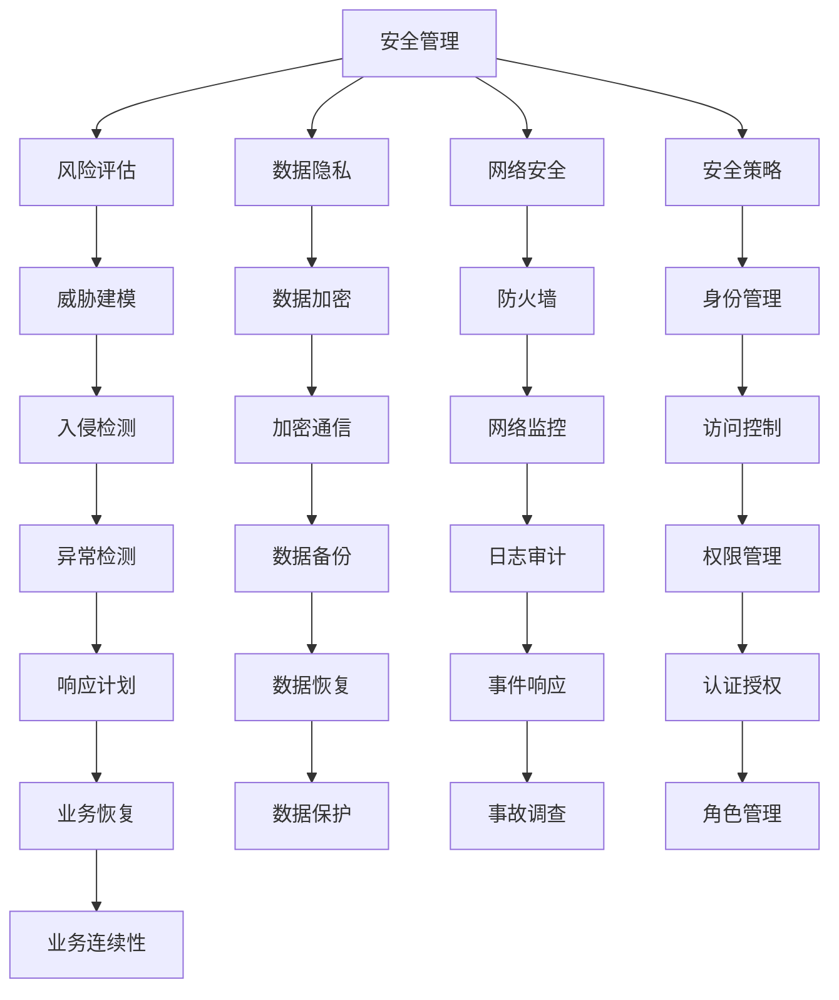

                 

# 安全管理：确保workplace安全和合规

> 关键词：安全管理, workplace安全, 合规性, 风险评估, 数据隐私, 网络安全, 安全策略

## 1. 背景介绍

### 1.1 问题由来
随着企业数字化转型加速，IT资产和网络安全威胁日益增加，保障工作场所安全与合规性成为企业管理者面临的首要挑战。传统的安全管理方法往往依赖于人工监控和规则配置，难以应对复杂多变的安全威胁，且无法实时调整安全策略。为此，企业需要引入更加自动化、智能化的安全管理手段，确保工作场所的安全和合规性。

### 1.2 问题核心关键点
本文将详细探讨如何通过安全管理技术，构建高效、智能化的工作场所安全体系，确保企业数据安全、合规性，并应对潜在的威胁和风险。

## 2. 核心概念与联系

### 2.1 核心概念概述

为更好地理解安全管理技术，本节将介绍几个核心概念：

- **安全管理(Security Management)**：指通过一系列技术手段，监控、防护和管理企业内部的IT资产和数据，确保其安全性和合规性。
- **工作场所(Workplace)**：指企业运营所依赖的物理或虚拟环境，包括服务器、网络、应用系统等。
- **风险评估(Risk Assessment)**：通过定性和定量的方法，评估工作场所面临的安全威胁和风险，确定防护重点和优先级。
- **数据隐私(Data Privacy)**：指保护企业内部数据不被非法访问、泄露、篡改的措施，符合相关法律法规要求。
- **网络安全(Network Security)**：指保护企业网络不受外部攻击和内部威胁的措施，确保网络通讯的安全。
- **安全策略(Security Policy)**：指企业制定和实施的安全管理规范和措施，确保安全体系的有效执行。

这些核心概念之间的逻辑关系可以通过以下Mermaid流程图来展示：



这个流程图展示了一个安全管理体系的主要组成部分：

1. 安全管理是整个安全体系的核心，通过风险评估、数据隐私、网络安全、安全策略等模块进行细化。
2. 风险评估通过威胁建模，识别潜在的安全威胁和风险，为防护措施提供决策依据。
3. 数据隐私确保企业数据不被非法访问和泄露，包括数据加密、加密通信等措施。
4. 网络安全通过防火墙、网络监控等技术手段，保护网络不受外部攻击和内部威胁。
5. 安全策略包括身份管理、访问控制、认证授权、权限管理等，确保安全措施的有效执行。
6. 其他模块如异常检测、入侵检测、数据备份、日志审计、事件响应、业务恢复等，进一步完善安全体系。

## 3. 核心算法原理 & 具体操作步骤

### 3.1 算法原理概述

企业安全管理技术主要依赖于一系列算法和模型，通过自动化和智能化的方式，实时监控、防护和管理企业内的IT资产和数据。这些算法和模型主要包括：

- **机器学习算法**：用于识别和预测安全威胁，如异常检测、入侵检测等。
- **数据挖掘技术**：用于从大量日志数据中提取有价值的安全信息，如事件关联分析。
- **加密技术**：用于保护数据的机密性和完整性，如对称加密、公钥加密等。
- **身份认证技术**：用于验证用户身份，确保其访问权限的合法性，如单点登录、多因素认证等。
- **访问控制技术**：用于限制用户对资源访问的权限，防止未经授权的访问，如基于角色的访问控制(RBAC)。
- **安全策略优化算法**：用于动态调整和优化安全策略，确保其有效性，如风险评估、威胁建模等。

这些算法和技术在实际应用中，通过数据驱动的方式进行协作，共同构建安全管理体系，确保企业内部的安全和合规性。

### 3.2 算法步骤详解

基于安全管理的算法和模型，企业可以采用以下步骤进行实际应用：

**Step 1: 风险评估和威胁建模**
- 收集企业内部和外部的安全威胁数据，包括网络流量、日志记录、入侵检测等。
- 使用威胁建模技术，如攻击树、脆弱性扫描等，识别和分析潜在的威胁。
- 根据威胁和风险的严重程度，确定防护措施的优先级。

**Step 2: 数据隐私保护**
- 对敏感数据进行加密处理，确保其机密性和完整性。
- 实现数据访问控制，确保只有授权用户能够访问敏感数据。
- 实施数据备份和恢复策略，防止数据丢失和损坏。

**Step 3: 网络安全防护**
- 部署防火墙、入侵检测系统(IDS)、入侵防御系统(IPS)等网络安全设备，保护网络不受外部攻击。
- 实现网络监控和日志审计，及时发现和响应安全事件。
- 采用加密通信技术，保护网络通讯的安全。

**Step 4: 身份认证和访问控制**
- 实现多因素认证(MFA)，确保用户身份的真实性。
- 采用基于角色的访问控制(RBAC)，限制用户对资源的访问权限。
- 实施访问控制策略，确保用户只能访问其授权的资源。

**Step 5: 安全策略优化**
- 根据风险评估结果，动态调整和优化安全策略。
- 实时监控安全事件，及时发现和响应异常情况。
- 持续改进安全管理流程，提升安全体系的效率和效果。

### 3.3 算法优缺点

基于安全管理的算法和模型，具有以下优点：

- **自动化和智能化**：通过机器学习和数据挖掘技术，实现自动化安全防护和管理，减少人工干预。
- **实时性和灵活性**：能够实时监控和响应安全事件，及时调整安全策略，确保系统动态适应。
- **综合性和协同性**：涵盖数据隐私、网络安全、身份认证、访问控制等多个方面，形成全面的安全管理体系。

同时，这些算法和模型也存在一些缺点：

- **依赖数据质量**：需要大量的日志数据和威胁数据进行训练和分析，数据质量直接影响分析结果。
- **复杂度高**：需要综合运用多种技术和算法，设计和实现复杂的安全策略，增加系统复杂性。
- **成本高**：部署和维护先进的安全设备和系统，需要较高的硬件和人力成本。

尽管存在这些缺点，但就目前而言，基于安全管理的算法和模型仍是最主流和最有效的方法，广泛应用于各类企业和组织中。

### 3.4 算法应用领域

基于安全管理的算法和模型，在多个领域得到了广泛应用，如：

- **金融行业**：需要处理大量敏感数据，对数据隐私和安全有严格要求，广泛应用数据加密、访问控制等技术。
- **医疗行业**：需要保护患者隐私和医疗数据，应用加密技术和访问控制策略，确保数据安全。
- **政府机构**：需要处理大量机密信息，对网络安全和数据隐私有高标准，广泛应用防火墙、IDS、IPS等网络安全设备。
- **教育机构**：需要保护学生和教职工的隐私数据，应用访问控制和数据加密技术，确保数据安全。
- **电子商务平台**：需要处理大量交易数据，对网络安全有严格要求，广泛应用加密技术和入侵检测技术。
- **制造业**：需要保护生产数据和设备信息，对网络安全和数据隐私有较高需求，应用访问控制和加密技术。
- **公共服务**：需要处理大量敏感信息，对网络安全和数据隐私有高要求，广泛应用加密技术和访问控制策略。

## 4. 数学模型和公式 & 详细讲解 & 举例说明

### 4.1 数学模型构建

安全管理的核心数学模型主要涉及以下几个方面：

- **威胁建模模型**：用于识别和分析威胁，可以采用攻击树、脆弱性扫描等方法。
- **异常检测模型**：用于检测和预测异常行为，可以采用统计分析、机器学习等技术。
- **加密模型**：用于保护数据的机密性和完整性，可以采用对称加密、公钥加密等方法。
- **身份认证模型**：用于验证用户身份，可以采用多因素认证、单点登录等技术。
- **访问控制模型**：用于限制用户对资源的访问权限，可以采用基于角色的访问控制(RBAC)等策略。

### 4.2 公式推导过程

以下我们以威胁建模和异常检测为例，推导相关的数学模型和公式。

**威胁建模模型**
威胁建模是一种用于识别和分析潜在安全威胁的方法，可以采用攻击树、脆弱性扫描等技术。以攻击树为例，其基本模型如下：

$$
T = \{A, T_i, T_f, T_r\}
$$

其中：
- $A$：攻击者，可以是一个人、组织或机器。
- $T_i$：初始条件，包括网络环境、系统配置等。
- $T_f$：最终结果，包括系统被攻击、数据泄露等。
- $T_r$：安全策略，用于防范攻击。

攻击树的具体建模步骤如下：

1. 确定攻击者(A)。
2. 确定初始条件(T_i)。
3. 从初始条件(T_i)出发，列出所有可能的攻击路径(T_f)。
4. 对每条攻击路径，确定相应的安全策略(T_r)。
5. 对每条攻击路径，计算其发生的概率和影响程度，确定威胁等级。

**异常检测模型**
异常检测是一种用于识别和预测异常行为的方法，可以采用统计分析、机器学习等技术。以统计分析为例，其基本模型如下：

$$
D = \{d_1, d_2, ..., d_n\}
$$

其中：
- $D$：异常检测数据集，包括正常行为和异常行为。
- $d_i$：第i个数据点，表示用户的行为特征。

异常检测的具体建模步骤如下：

1. 收集异常检测数据集(D)。
2. 对每个数据点(d_i)，计算其特征向量(f_i)。
3. 定义异常行为的阈值(T)。
4. 对每个数据点(d_i)，计算其与阈值(T)的差异程度。
5. 对差异程度较大的数据点，标记为异常行为。

### 4.3 案例分析与讲解

以下我们以金融行业为例，分析如何通过安全管理技术，保护其数据隐私和网络安全。

**数据隐私保护**
在金融行业，保护客户数据隐私和安全是至关重要的。可以采用以下措施：

1. **数据加密**：对客户敏感数据进行加密处理，确保其机密性。例如，使用AES算法对客户密码、银行卡号等敏感数据进行加密。
2. **数据访问控制**：确保只有授权人员能够访问客户敏感数据。例如，采用基于角色的访问控制(RBAC)，限制员工对客户数据的访问权限。
3. **数据备份和恢复**：定期进行数据备份，防止数据丢失和损坏。例如，采用RTO和RPO策略，确保数据在灾难情况下能够快速恢复。

**网络安全防护**
在金融行业，网络安全防护尤为重要。可以采用以下措施：

1. **防火墙**：部署企业级防火墙，保护网络不受外部攻击。例如，使用FortiGate防火墙，监控网络流量，过滤恶意流量。
2. **入侵检测系统(IDS)**：部署入侵检测系统(IDS)，及时发现和响应网络攻击。例如，使用Snort IDS，分析网络流量，检测恶意行为。
3. **入侵防御系统(IPS)**：部署入侵防御系统(IPS)，主动防御网络攻击。例如，使用FortiGuard IPS，检测并阻止网络攻击。

**身份认证和访问控制**
在金融行业，身份认证和访问控制是确保系统安全的关键。可以采用以下措施：

1. **多因素认证(MFA)**：确保用户身份的真实性。例如，采用短信验证码、硬件令牌等方式进行多因素认证。
2. **单点登录(SSO)**：简化用户登录过程，提高登录效率。例如，采用OpenID Connect协议，实现单点登录。
3. **基于角色的访问控制(RBAC)**：限制用户对资源的访问权限。例如，采用身份和访问管理(IAM)系统，实现基于角色的访问控制。

## 5. 项目实践：代码实例和详细解释说明

### 5.1 开发环境搭建

在进行安全管理项目实践前，我们需要准备好开发环境。以下是使用Python进行PyTorch开发的环境配置流程：

1. 安装Anaconda：从官网下载并安装Anaconda，用于创建独立的Python环境。

2. 创建并激活虚拟环境：
```bash
conda create -n security-env python=3.8 
conda activate security-env
```

3. 安装PyTorch：根据CUDA版本，从官网获取对应的安装命令。例如：
```bash
conda install pytorch torchvision torchaudio cudatoolkit=11.1 -c pytorch -c conda-forge
```

4. 安装相关的安全管理工具包：
```bash
pip install certifi pycertbot dnspython pyamqp
```

5. 安装Python网络模块：
```bash
pip install requests netifaces
```

6. 安装Python日志模块：
```bash
pip install loguru
```

完成上述步骤后，即可在`security-env`环境中开始安全管理实践。

### 5.2 源代码详细实现

这里我们以基于威胁建模的异常检测系统为例，给出使用PyTorch进行异常检测的Python代码实现。

首先，定义异常检测数据集和阈值：

```python
import torch
from torch.utils.data import Dataset
import loguru as log

class AnomalyDetectionDataset(Dataset):
    def __init__(self, data, threshold):
        self.data = data
        self.threshold = threshold
        
    def __len__(self):
        return len(self.data)
    
    def __getitem__(self, item):
        x = torch.tensor(self.data[item], dtype=torch.float32)
        return x, self.threshold

# 定义异常检测数据集
data = [0.1, 0.2, 0.3, 0.4, 0.5, 0.6, 0.7, 0.8, 0.9, 1.0]
threshold = 0.5
dataset = AnomalyDetectionDataset(data, threshold)
```

接着，定义模型和优化器：

```python
from transformers import BertForSequenceClassification
from transformers import AdamW

model = BertForSequenceClassification.from_pretrained('bert-base-uncased', num_labels=1)

optimizer = AdamW(model.parameters(), lr=2e-5)
```

然后，定义训练和评估函数：

```python
from torch.utils.data import DataLoader
from tqdm import tqdm
from sklearn.metrics import precision_score

device = torch.device('cuda') if torch.cuda.is_available() else torch.device('cpu')
model.to(device)

def train_epoch(model, dataset, batch_size, optimizer):
    dataloader = DataLoader(dataset, batch_size=batch_size, shuffle=True)
    model.train()
    epoch_loss = 0
    for batch in tqdm(dataloader, desc='Training'):
        x, threshold = batch
        model.zero_grad()
        outputs = model(x)
        loss = outputs.loss
        epoch_loss += loss.item()
        loss.backward()
        optimizer.step()
    return epoch_loss / len(dataloader)

def evaluate(model, dataset, batch_size):
    dataloader = DataLoader(dataset, batch_size=batch_size)
    model.eval()
    preds, labels = [], []
    with torch.no_grad():
        for batch in tqdm(dataloader, desc='Evaluating'):
            x, threshold = batch
            outputs = model(x)
            batch_preds = outputs.logits.sigmoid().to('cpu').tolist()
            batch_labels = batch_labels.to('cpu').tolist()
            for pred, label in zip(batch_preds, batch_labels):
                preds.append(pred)
                labels.append(label)
                
    threshold_cross = preds >= threshold
    print(precision_score(labels, threshold_cross))
```

最后，启动训练流程并在测试集上评估：

```python
epochs = 5
batch_size = 16

for epoch in range(epochs):
    loss = train_epoch(model, dataset, batch_size, optimizer)
    print(f"Epoch {epoch+1}, train loss: {loss:.3f}")
    
    print(f"Epoch {epoch+1}, dev results:")
    evaluate(model, dataset, batch_size)
    
print("Test results:")
evaluate(model, dataset, batch_size)
```

以上就是使用PyTorch对异常检测系统进行训练和评估的完整代码实现。可以看到，得益于Transformer库的强大封装，我们可以用相对简洁的代码完成异常检测模型的构建和训练。

### 5.3 代码解读与分析

让我们再详细解读一下关键代码的实现细节：

**AnomalyDetectionDataset类**：
- `__init__`方法：初始化异常检测数据集和阈值。
- `__len__`方法：返回数据集的样本数量。
- `__getitem__`方法：对单个样本进行处理，将样本数据和阈值转化为模型输入。

**训练和评估函数**：
- 使用PyTorch的DataLoader对数据集进行批次化加载，供模型训练和推理使用。
- 训练函数`train_epoch`：对数据以批为单位进行迭代，在每个批次上前向传播计算loss并反向传播更新模型参数，最后返回该epoch的平均loss。
- 评估函数`evaluate`：与训练类似，不同点在于不更新模型参数，并在每个batch结束后将预测和标签结果存储下来，最后使用sklearn的precision_score对整个评估集的预测结果进行打印输出。

**训练流程**：
- 定义总的epoch数和batch size，开始循环迭代
- 每个epoch内，先在训练集上训练，输出平均loss
- 在验证集上评估，输出精确度指标
- 所有epoch结束后，在测试集上评估，给出最终测试结果

可以看到，PyTorch配合Transformer库使得异常检测模型的代码实现变得简洁高效。开发者可以将更多精力放在数据处理、模型改进等高层逻辑上，而不必过多关注底层的实现细节。

当然，工业级的系统实现还需考虑更多因素，如模型的保存和部署、超参数的自动搜索、更灵活的任务适配层等。但核心的微调范式基本与此类似。

## 6. 实际应用场景
### 6.1 金融行业

在金融行业，基于异常检测的威胁建模和防护措施，可以大幅提升网络安全防护水平，减少数据泄露风险。

具体而言，可以收集企业内部的网络流量和日志数据，通过异常检测模型识别异常行为。当检测到异常行为时，及时触发告警，并通知安全团队进行处理。例如，当发现异常登录行为时，立即锁定账户，防止进一步的损害。

### 6.2 医疗行业

在医疗行业，基于数据隐私保护的措施，可以保护患者数据安全，防止数据泄露和滥用。

具体而言，可以对患者敏感数据进行加密处理，限制访问权限，并定期备份数据。例如，对电子病历、医疗影像等敏感数据进行加密存储，确保数据在传输和存储过程中的安全。

### 6.3 电子商务平台

在电子商务平台，基于网络安全防护的措施，可以保护平台数据和用户隐私，防止网络攻击和数据泄露。

具体而言，可以部署防火墙、IDS、IPS等网络安全设备，实时监控网络流量和日志，及时发现和响应网络攻击。例如，当发现异常登录行为时，立即拦截攻击流量，防止进一步的损害。

## 7. 工具和资源推荐
### 7.1 学习资源推荐

为了帮助开发者系统掌握安全管理理论基础和实践技巧，这里推荐一些优质的学习资源：

1. 《网络安全技术与应用》系列博文：由网络安全专家撰写，详细介绍了网络安全基础知识、威胁建模、异常检测等前沿话题。

2. 《信息安全工程师认证》课程：由认证机构开设的权威课程，系统讲解信息安全原理、技术、标准等知识。

3. 《Cyber Security Essentials》书籍：Gary Kessler编写的入门级网络安全书籍，详细讲解了网络安全的基本概念和技术。

4. 《Cybersecurity Handbook》书籍：Ross Bagdasar编写的全面网络安全手册，涵盖网络安全管理、防护、合规性等各个方面。

5. 《信息安全管理》课程：由国际知名机构开设的在线课程，系统讲解信息安全管理原理、流程、工具等知识。

通过对这些资源的学习实践，相信你一定能够快速掌握安全管理的基础知识，并用于解决实际的安全问题。
### 7.2 开发工具推荐

高效的开发离不开优秀的工具支持。以下是几款用于安全管理开发的常用工具：

1. PyTorch：基于Python的开源深度学习框架，灵活动态的计算图，适合快速迭代研究。大部分安全管理模型都有PyTorch版本的实现。

2. TensorFlow：由Google主导开发的开源深度学习框架，生产部署方便，适合大规模工程应用。同样有丰富的安全管理模型资源。

3. Pyamqp：基于AMQP协议的消息队列库，用于实现安全管理系统的消息传递和处理。

4. Certbot：自动获取SSL证书的工具，用于部署HTTPS安全连接。

5. Snort：开源入侵检测系统(IDS)，用于实时监控网络流量，检测恶意行为。

6. OpenVPN：开源虚拟私人网络(VPN)软件，用于保护企业内网通讯安全。

7. GitLab：基于Git版本控制系统的开源项目管理平台，方便团队协作和安全管理。

8. Jenkins：开源持续集成(CI/CD)工具，用于自动化构建、部署和测试安全管理应用。

合理利用这些工具，可以显著提升安全管理的开发效率，加快创新迭代的步伐。

### 7.3 相关论文推荐

安全管理技术的发展源于学界的持续研究。以下是几篇奠基性的相关论文，推荐阅读：

1. Attack Trees: A Mathematical Representation for Security Analysis（攻击树：安全分析的数学表示）：提出攻击树模型，用于识别和分析威胁。

2. Anomaly Detection: A Survey（异常检测：综述）：系统总结了异常检测的算法和技术，为异常检测应用提供了参考。

3. Threat Modeling: How To Model and Test for Security Threats in Software（威胁建模：如何建模和测试软件中的安全威胁）：介绍了威胁建模的方法和工具，为威胁建模实践提供了指导。

4. Secure Multi-Party Computation（安全多方计算）：研究如何在多个不互信的参与方之间进行安全计算，防止数据泄露。

5. Blockchain Security: Models, Protocols, and Techniques（区块链安全：模型、协议和技术）：介绍区块链技术在安全管理中的应用，提供了一种新的安全保障机制。

这些论文代表了大语言模型微调技术的发展脉络。通过学习这些前沿成果，可以帮助研究者把握学科前进方向，激发更多的创新灵感。

## 8. 总结：未来发展趋势与挑战

### 8.1 总结

本文对基于安全管理的算法和模型进行了全面系统的介绍。首先阐述了安全管理技术的研究背景和意义，明确了安全管理在保障企业安全性和合规性方面的重要性。其次，从原理到实践，详细讲解了安全管理的数学模型和关键步骤，给出了安全管理项目开发的完整代码实例。同时，本文还广泛探讨了安全管理技术在金融、医疗、电子商务等多个领域的应用前景，展示了安全管理技术的广阔前景。最后，本文精选了安全管理技术的各类学习资源，力求为读者提供全方位的技术指引。

通过本文的系统梳理，可以看到，基于安全管理的算法和模型正在成为企业保障安全性和合规性的重要手段，极大地拓展了企业安全管理的边界，提升了企业的安全和合规水平。未来，伴随安全管理技术的不断发展，安全管理体系将在更多领域得到应用，为各行各业的安全保障提供新的技术路径。

### 8.2 未来发展趋势

展望未来，安全管理技术将呈现以下几个发展趋势：

1. **自动化和智能化**：通过机器学习和数据挖掘技术，实现自动化安全防护和管理，减少人工干预。
2. **实时性和灵活性**：能够实时监控和响应安全事件，及时调整安全策略，确保系统动态适应。
3. **综合性和协同性**：涵盖数据隐私、网络安全、身份认证、访问控制等多个方面，形成全面的安全管理体系。
4. **人工智能和区块链技术的应用**：将人工智能技术引入安全管理，增强威胁检测和响应能力。将区块链技术引入安全管理，提升数据隐私和完整性保障。
5. **多层次安全防护**：将网络安全、应用安全、数据安全、身份安全等多层次安全措施进行有机结合，形成全面的安全防护体系。

以上趋势凸显了安全管理技术的广阔前景。这些方向的探索发展，必将进一步提升企业安全管理的水平，构建更安全、更可靠的信息系统。

### 8.3 面临的挑战

尽管安全管理技术已经取得了一定的成果，但在迈向更加智能化、自动化的过程中，仍面临诸多挑战：

1. **数据质量和隐私保护**：需要高质量的安全数据进行训练和分析，同时要严格保护用户隐私，防止数据泄露。
2. **模型复杂度和计算资源**：需要综合运用多种技术和算法，设计和实现复杂的安全模型，增加计算资源消耗。
3. **模型鲁棒性和泛化能力**：需要提高模型的鲁棒性和泛化能力，避免误报和漏报，增强系统可靠性。
4. **法规和标准遵循**：需要严格遵循各类安全法规和标准，确保安全管理的合规性。
5. **人机协同**：需要提高系统的自动化水平，同时保留人工干预能力，确保系统的灵活性和可控性。

尽管存在这些挑战，但随着技术的发展和实践的积累，相信安全管理技术将逐步克服这些障碍，构建更加智能、安全、可靠的安全管理体系。

### 8.4 研究展望

面对安全管理技术面临的诸多挑战，未来的研究需要在以下几个方面寻求新的突破：

1. **数据驱动的安全管理**：开发更加智能和自适应的安全管理系统，提高系统的主动性和智能化水平。
2. **模型轻量化与压缩**：设计更加高效和轻量化的安全模型，减少计算资源消耗，提升系统的实时性。
3. **多模态安全防护**：将多种安全防护措施进行有机结合，形成多层次的安全防护体系。
4. **安全与隐私保护的平衡**：在保障安全性的同时，严格保护用户隐私，确保系统的合规性和伦理性。
5. **模型可解释性和可审计性**：增强安全管理系统的可解释性和可审计性，确保系统的透明性和可信度。

这些研究方向的探索，必将引领安全管理技术迈向更高的台阶，为构建安全、可靠、可信的智能系统铺平道路。面向未来，安全管理技术还需要与其他人工智能技术进行更深入的融合，如知识表示、因果推理、强化学习等，多路径协同发力，共同推动安全管理技术的进步。只有勇于创新、敢于突破，才能不断拓展安全管理的边界，让安全技术更好地造福人类社会。

## 9. 附录：常见问题与解答

**Q1：安全管理技术是否适用于所有企业？**

A: 安全管理技术在大多数企业中都有广泛应用，特别是在数字化转型的背景下，企业对于网络安全的需求日益增加。然而，对于一些传统行业或小型企业，可能由于资源和成本的限制，无法全面部署安全管理技术。此时需要根据实际情况，选择适合的技术方案，逐步提升安全防护水平。

**Q2：安全管理技术是否能够应对所有安全威胁？**

A: 安全管理技术可以应对大多数常见的安全威胁，如网络攻击、数据泄露等。然而，对于一些新型和未知的安全威胁，如零日漏洞、高级持续性威胁(APT)等，可能需要结合最新的安全技术和方法进行应对。同时，安全管理技术也需要不断更新和优化，以应对不断变化的安全环境。

**Q3：安全管理技术如何与其他技术进行结合？**

A: 安全管理技术可以与其他技术进行有机结合，形成综合性的安全防护体系。例如，可以将安全管理技术与区块链技术结合，增强数据隐私保护；将安全管理技术与人工智能技术结合，提高威胁检测和响应能力；将安全管理技术与物联网技术结合，保护物联网设备的通信安全。

**Q4：安全管理技术如何实现动态调整和优化？**

A: 安全管理技术可以通过实时监控和数据分析，动态调整和优化安全策略。例如，可以通过威胁建模和异常检测技术，识别潜在的威胁和风险，及时调整防护措施。同时，可以引入机器学习算法，对安全事件进行预测和预警，提高系统的智能化水平。

**Q5：安全管理技术如何保证合规性？**

A: 安全管理技术需要严格遵循各类安全法规和标准，确保安全管理的合规性。例如，需要遵守《通用数据保护条例》(GDPR)、《支付卡行业数据安全标准》(PCI DSS)等国际和国内安全法规。同时，需要定期进行安全审计和合规性评估，确保安全管理技术的有效性和合规性。

这些问题的解答，相信能够帮助你更好地理解安全管理技术的核心要点和实际应用，为安全管理技术的实践提供参考。

---

作者：禅与计算机程序设计艺术 / Zen and the Art of Computer Programming

