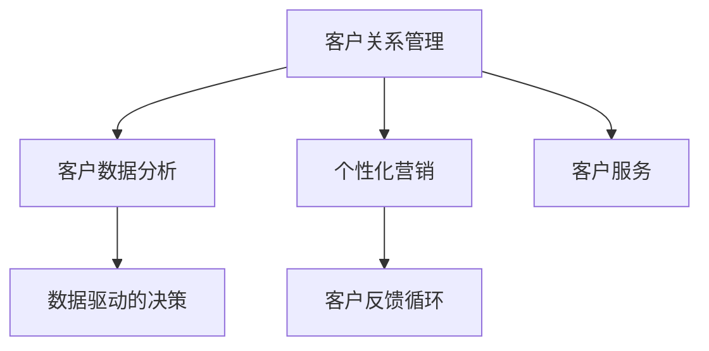

                 

# 客户关系管理：提升客户满意度的策略

> 关键词：客户关系管理,CRM,客户满意度,客户数据管理,数据分析,营销策略

## 1. 背景介绍

### 1.1 问题由来

在当今竞争激烈的商业环境中，客户关系管理（CRM）已成为企业获取竞争优势的关键。一个有效的CRM系统不仅能够帮助企业记录和管理客户数据，还能通过数据分析来优化客户体验，提升客户满意度。随着大数据和人工智能技术的发展，越来越多的企业开始利用CRM系统来优化运营和客户服务。然而，尽管许多企业已经采用了CRM系统，但关于如何充分利用这些系统来提升客户满意度的问题仍然存在。本文将深入探讨如何通过优化客户关系管理策略来提升客户满意度。

### 1.2 问题核心关键点

要提升客户满意度，必须从多个角度入手，包括但不限于：

1. 数据分析与客户洞察：通过分析客户行为和反馈，了解客户需求和痛点。
2. 个性化营销：根据客户偏好和行为，提供个性化推荐和优惠。
3. 客户服务优化：提升客户服务响应速度和质量，解决客户问题。
4. 客户反馈循环：建立客户反馈机制，及时收集并处理客户反馈。
5. 数据驱动的决策：基于数据分析来制定和调整客户管理策略。

这些关键点共同构成了提升客户满意度的综合策略。

### 1.3 问题研究意义

提升客户满意度不仅能够增加客户忠诚度和复购率，还能提升企业品牌形象，降低客户流失率，最终推动企业业绩增长。通过系统化地优化客户关系管理策略，企业可以更有效地管理客户关系，提升客户体验，从而在激烈的市场竞争中脱颖而出。

## 2. 核心概念与联系

### 2.1 核心概念概述

在讨论提升客户满意度的策略之前，首先需要明确一些关键概念：

- **客户关系管理（CRM）**：一套用于管理客户信息、客户交互历史、客户行为数据等的系统，旨在提高客户满意度和忠诚度，同时提升企业效率。
- **客户满意度（Customer Satisfaction, CS）**：客户对企业产品或服务的满意程度，通常通过客户调查、反馈、行为数据等进行评估。
- **客户数据分析（Customer Analytics）**：通过对客户数据进行收集、分析和挖掘，以获得洞察，优化客户体验和提升客户满意度。
- **个性化营销（Personalization）**：根据客户的行为和偏好，提供定制化的产品或服务，提升客户体验。
- **客户服务（Customer Service）**：提供及时、有效、满意的客户支持，解决客户问题和疑虑。

这些概念之间的逻辑关系可以通过以下Mermaid流程图来展示：



这个流程图展示了CRM系统的核心组成部分及其相互关系：

1. CRM系统收集和管理客户数据，作为后续分析和营销的基础。
2. 客户数据分析提供了客户洞察，帮助制定和调整营销策略。
3. 个性化营销根据客户行为和偏好，提供定制化服务。
4. 客户服务解决客户问题，提升客户满意度。
5. 客户反馈循环通过收集客户反馈，不断优化CRM系统。
6. 数据驱动的决策基于客户数据分析结果，制定和调整策略。

## 3. 核心算法原理 & 具体操作步骤

### 3.1 算法原理概述

提升客户满意度的核心在于通过数据分析来理解客户需求和行为，并据此提供个性化的服务和支持。这一过程通常包括以下几个步骤：

1. **数据收集与整合**：收集客户交互历史、行为数据、反馈信息等，整合到CRM系统中。
2. **数据分析与洞察**：通过数据挖掘和分析，获得客户行为和需求的洞察。
3. **策略制定与执行**：基于客户洞察制定个性化营销和客户服务策略，并实施。
4. **反馈收集与优化**：通过客户反馈收集和处理，不断优化策略和系统。

### 3.2 算法步骤详解

#### 步骤1：数据收集与整合

客户数据通常来自多个渠道，包括网站、移动应用、客服互动、社交媒体等。数据收集和整合是CRM系统的第一步。

- **数据源识别**：确定需要收集的数据来源，包括网站流量、应用使用数据、客服交互记录、社交媒体互动等。
- **数据收集工具**：选择适合的数据收集工具，如Google Analytics、Mixpanel、Salesforce等。
- **数据整合与存储**：将收集到的数据整合到一个统一的CRM系统中，存储在数据库中。

#### 步骤2：数据分析与洞察

数据分析是理解客户需求和行为的关键。常用的分析方法包括：

- **描述性分析**：通过统计分析，了解客户的基本特征和行为模式。
- **诊断性分析**：深入分析客户行为，找出背后的原因和趋势。
- **预测性分析**：基于历史数据，预测未来行为和趋势。
- **规范性分析**：提出优化建议，指导决策制定。

#### 步骤3：策略制定与执行

基于数据分析结果，制定个性化的营销和客户服务策略，并执行。

- **个性化推荐**：根据客户历史行为和偏好，提供个性化产品或服务推荐。
- **动态定价**：根据客户价值和需求，制定动态价格策略。
- **客户细分**：将客户分为不同的细分市场，制定针对性策略。

#### 步骤4：反馈收集与优化

客户反馈是优化策略和系统的关键。

- **反馈收集**：通过在线调查、客服互动、社交媒体等渠道收集客户反馈。
- **反馈分析**：分析反馈内容，找出常见问题和改进点。
- **策略优化**：根据反馈结果，优化客户服务流程和营销策略。

### 3.3 算法优缺点

基于数据分析的客户关系管理策略有以下优点：

- **数据驱动**：通过分析客户数据，制定更有效的策略。
- **个性化服务**：根据客户偏好提供定制化服务，提升客户满意度。
- **效率提升**：通过自动化分析工具和策略执行，提升运营效率。

然而，这种方法也存在一些缺点：

- **数据质量问题**：数据收集和整合过程可能存在数据质量问题，影响分析结果。
- **隐私保护**：客户数据的收集和使用可能涉及隐私问题，需要严格遵守相关法律法规。
- **技术门槛高**：需要一定的数据分析和技术能力，对中小企业可能存在挑战。

### 3.4 算法应用领域

客户关系管理策略在多个领域都有广泛应用，包括但不限于：

- **零售行业**：通过CRM系统管理客户信息，提升销售转化率和客户满意度。
- **金融行业**：通过分析客户行为和需求，提供个性化的金融产品和建议。
- **医疗行业**：通过客户数据分析，优化医疗服务和患者体验。
- **旅游行业**：通过CRM系统收集客户反馈，提升旅游服务和客户满意度。

## 4. 数学模型和公式 & 详细讲解 & 举例说明

### 4.1 数学模型构建

提升客户满意度的核心在于理解客户行为和需求，并提供个性化服务。因此，可以通过以下数学模型来进行分析：

设 $C$ 为客户的集合，$D_i$ 为第 $i$ 个客户的交互历史数据，$S_i$ 为第 $i$ 个客户的满意度评分。

客户满意度模型可以表示为：

$$
S_i = f(D_i; \theta)
$$

其中 $f$ 为满意度预测函数，$\theta$ 为模型参数。

### 4.2 公式推导过程

满意度预测函数 $f$ 通常基于多个特征进行建模，如客户年龄、购买频率、投诉次数等。

假设 $x_i$ 为第 $i$ 个客户的相关特征向量，$S_i$ 为第 $i$ 个客户的满意度评分。

则客户满意度模型可以表示为：

$$
S_i = \alpha x_i^T \beta + \gamma
$$

其中 $\alpha$ 和 $\beta$ 为模型参数，$\gamma$ 为截距。

### 4.3 案例分析与讲解

假设某电商平台收集了客户的购买记录、浏览历史、评价信息等数据，希望通过这些数据预测客户满意度。

- **数据收集**：从电商平台收集客户的购买记录、浏览历史、评价信息等数据。
- **数据预处理**：对数据进行清洗和标准化处理，如去除缺失值、异常值。
- **特征工程**：选择和构建有意义的特征，如购买频率、评价得分等。
- **模型训练**：使用多元线性回归模型，基于客户特征向量 $x_i$ 和满意度评分 $S_i$ 训练模型。
- **模型评估**：使用测试数据集评估模型性能，调整参数以优化模型。

## 5. 项目实践：代码实例和详细解释说明

### 5.1 开发环境搭建

进行客户关系管理系统的开发，需要一个合适的开发环境。以下是使用Python进行开发的环境配置流程：

1. 安装Anaconda：从官网下载并安装Anaconda，用于创建独立的Python环境。

2. 创建并激活虚拟环境：
```bash
conda create -n crm-env python=3.8 
conda activate crm-env
```

3. 安装必要的库：
```bash
conda install pandas numpy matplotlib sklearn
```

4. 安装客户关系管理工具：
```bash
pip install salesforce-alm pydata-gbq oauth2client pyjwt requests
```

5. 安装数据分析工具：
```bash
pip install seaborn
```

完成上述步骤后，即可在`crm-env`环境中进行开发。

### 5.2 源代码详细实现

以下是一个使用Salesforce API进行客户数据分析的Python代码示例：

```python
import pandas as pd
import pydata_google_auth
import pydata_google_auth.oauth2
import oauth2client

# 获取Google API访问令牌
creds = pydata_google_auth.oauth2.access_token_from_client_secrets_file(
    'client_secret.json',
    'drive_integration.json',
    ['https://www.googleapis.com/auth/drive', 'https://www.googleapis.com/auth/drive.file', 'https://www.googleapis.com/auth/drive.readonly'])

# 读取Google Drive文件
data = pydata_google_auth.oauth2.read_file('customer_data.csv', creds)

# 数据预处理
df = pd.read_csv(data)
df = df.dropna()

# 特征工程
features = ['age', 'purchase_frequency', 'complaints']
df = df[features]

# 训练模型
from sklearn.linear_model import LinearRegression
model = LinearRegression()
model.fit(df, target)

# 预测客户满意度
df_test = pd.read_csv('customer_data_test.csv')
predictions = model.predict(df_test)
```

### 5.3 代码解读与分析

让我们再详细解读一下关键代码的实现细节：

**代码解析**：
- 通过Google API访问令牌，读取Google Drive上的客户数据文件。
- 对数据进行预处理，去除缺失值和异常值。
- 选择和构建有意义的特征，如客户年龄、购买频率、投诉次数等。
- 使用多元线性回归模型，基于客户特征向量 $x_i$ 和满意度评分 $S_i$ 训练模型。
- 使用训练好的模型对新客户进行满意度预测。

**代码实现**：
- `pydata_google_auth.oauth2.access_token_from_client_secrets_file`：获取Google API访问令牌。
- `pydata_google_auth.oauth2.read_file`：读取Google Drive上的客户数据文件。
- `pd.read_csv`：读取和处理CSV文件。
- `sklearn.linear_model.LinearRegression`：使用多元线性回归模型。
- `model.fit`：训练模型。
- `model.predict`：使用模型进行预测。

**代码结果**：
- 代码示例展示了如何通过Google API和Python进行客户数据分析，并使用多元线性回归模型预测客户满意度。

## 6. 实际应用场景

### 6.1 智能客服系统

智能客服系统可以通过CRM系统收集和分析客户互动数据，提供个性化的客户服务。

- **自动响应**：通过分析客户历史互动数据，智能客服系统可以自动提供适当的回复。
- **客户分类**：根据客户行为和偏好，智能客服系统可以分类客户，提供有针对性的服务。
- **实时分析**：通过实时分析客户互动数据，智能客服系统可以及时调整服务策略。

### 6.2 个性化营销

个性化营销是提升客户满意度的重要手段。通过CRM系统收集和分析客户数据，企业可以制定更有效的营销策略。

- **个性化推荐**：根据客户历史行为和偏好，推荐相关产品或服务。
- **动态定价**：根据客户价值和需求，制定动态价格策略。
- **客户细分**：将客户分为不同的细分市场，制定针对性策略。

### 6.3 客户服务优化

客户服务是提升客户满意度的关键。通过CRM系统收集和分析客户反馈，企业可以优化客户服务流程。

- **服务响应时间**：通过分析客户反馈，优化客服响应时间和流程。
- **问题解决率**：通过分析客户投诉和反馈，提升问题解决率。
- **客户满意度**：通过收集客户反馈，持续优化客户服务质量。

### 6.4 未来应用展望

未来，客户关系管理技术将进一步发展，推动客户满意度的提升。

- **AI驱动的客户服务**：利用AI技术，提供更智能、更个性化的客户服务。
- **多渠道整合**：整合多渠道数据，提供更全面的客户洞察。
- **实时数据分析**：利用实时数据分析，提升客户服务响应速度和质量。
- **个性化体验**：通过个性化推荐和定制化服务，提升客户体验。
- **客户反馈机制**：建立健全的客户反馈机制，持续优化客户关系管理策略。

## 7. 工具和资源推荐

### 7.1 学习资源推荐

为了帮助开发者系统掌握客户关系管理技术，这里推荐一些优质的学习资源：

1. **《客户关系管理：理论与实践》**：系统介绍客户关系管理的基本概念、技术框架和实践方法。
2. **Coursera《客户关系管理》课程**：斯坦福大学开设的客户关系管理课程，涵盖客户数据管理、客户洞察、个性化营销等主题。
3. **《客户数据分析与挖掘》**：介绍客户数据分析的理论与实践，帮助理解客户行为和需求。
4. **Salesforce官方文档**：Salesforce CRM系统的官方文档，提供详细的API和SDK使用指南。
5. **Google Analytics官方文档**：Google Analytics的数据分析和报告工具，帮助理解客户行为和趋势。

通过这些资源的学习，相信你一定能够快速掌握客户关系管理技术，并用于解决实际的客户服务问题。

### 7.2 开发工具推荐

高效的工具支持是客户关系管理开发的关键。以下是几款用于客户关系管理开发的常用工具：

1. **Salesforce**：全球领先的客户关系管理平台，提供丰富的CRM功能和集成选项。
2. **HubSpot**：提供客户关系管理、营销自动化、CRM等功能，适合中小型企业。
3. **Zoho CRM**：提供客户管理、销售自动化、客户服务等功能，适合中小型企业。
4. **Google Analytics**：Google提供的免费数据分析工具，帮助理解客户行为和趋势。
5. **Mixpanel**：提供用户行为分析、产品改进建议等功能，帮助优化客户体验。

合理利用这些工具，可以显著提升客户关系管理系统的开发效率，加快创新迭代的步伐。

### 7.3 相关论文推荐

客户关系管理技术的发展源于学界的持续研究。以下是几篇奠基性的相关论文，推荐阅读：

1. **《客户关系管理系统的设计和实现》**：介绍CRM系统的设计原则和实现方法。
2. **《基于客户数据分析的个性化营销策略》**：探讨如何利用客户数据分析制定个性化营销策略。
3. **《客户满意度预测模型研究》**：介绍基于客户数据分析的满意度预测模型。
4. **《客户服务自动化与优化》**：探讨如何利用AI技术优化客户服务流程。
5. **《实时数据分析与客户关系管理》**：探讨如何利用实时数据分析提升客户满意度。

这些论文代表了大客户关系管理技术的发展脉络。通过学习这些前沿成果，可以帮助研究者把握学科前进方向，激发更多的创新灵感。

## 8. 总结：未来发展趋势与挑战

### 8.1 总结

本文对如何通过客户关系管理策略提升客户满意度进行了全面系统的介绍。首先阐述了客户关系管理的重要性，明确了提升客户满意度的关键点，包括数据分析与客户洞察、个性化营销、客户服务优化、客户反馈循环等。其次，从原理到实践，详细讲解了客户关系管理系统的构建和优化过程。同时，本文还广泛探讨了客户关系管理技术在多个行业领域的应用前景，展示了该技术的广泛适用性和巨大潜力。

通过本文的系统梳理，可以看到，客户关系管理技术正成为企业提升客户满意度的重要工具。这一技术的不断发展，将为企业带来更多的客户洞察和个性化服务，从而在竞争激烈的市场中脱颖而出。

### 8.2 未来发展趋势

展望未来，客户关系管理技术将呈现以下几个发展趋势：

1. **AI驱动的客户服务**：利用AI技术，提供更智能、更个性化的客户服务。
2. **多渠道整合**：整合多渠道数据，提供更全面的客户洞察。
3. **实时数据分析**：利用实时数据分析，提升客户服务响应速度和质量。
4. **个性化体验**：通过个性化推荐和定制化服务，提升客户体验。
5. **客户反馈机制**：建立健全的客户反馈机制，持续优化客户关系管理策略。

这些趋势凸显了客户关系管理技术的广阔前景。这些方向的探索发展，必将进一步提升客户关系管理系统的性能和应用范围，为构建人机协同的智能系统铺平道路。

### 8.3 面临的挑战

尽管客户关系管理技术已经取得了显著进展，但在迈向更加智能化、普适化应用的过程中，仍面临诸多挑战：

1. **数据质量问题**：数据收集和整合过程可能存在数据质量问题，影响分析结果。
2. **隐私保护**：客户数据的收集和使用可能涉及隐私问题，需要严格遵守相关法律法规。
3. **技术门槛高**：客户关系管理系统的开发需要一定的数据分析和技术能力，对中小企业可能存在挑战。
4. **成本问题**：客户关系管理系统的建设和维护需要一定的成本投入，特别是对中小型企业。
5. **系统集成问题**：客户关系管理系统的建设和维护需要与企业的其他系统进行有效集成，才能发挥最大效能。

正视客户关系管理面临的这些挑战，积极应对并寻求突破，将是大客户关系管理技术走向成熟的必由之路。相信随着学界和产业界的共同努力，这些挑战终将一一被克服，客户关系管理技术必将在构建安全、可靠、可解释、可控的智能系统方面发挥重要作用。

### 8.4 研究展望

面向未来，客户关系管理技术需要在以下几个方面寻求新的突破：

1. **数据治理与质量管理**：建立完善的数据治理机制，确保数据质量。
2. **隐私保护与安全**：制定隐私保护策略，确保客户数据的安全性和合法性。
3. **技术自动化**：开发自动化工具，降低技术门槛，提升开发效率。
4. **成本优化**：通过云计算和平台化服务，降低客户关系管理系统的建设和维护成本。
5. **系统集成与协同**：实现与企业其他系统的无缝集成，提升系统协同能力。

这些研究方向的探索，必将引领客户关系管理技术迈向更高的台阶，为构建安全、可靠、可解释、可控的智能系统铺平道路。面向未来，客户关系管理技术还需要与其他人工智能技术进行更深入的融合，如知识表示、因果推理、强化学习等，多路径协同发力，共同推动客户关系管理系统的进步。

## 9. 附录：常见问题与解答

**Q1：客户关系管理系统的关键组成部分有哪些？**

A: 客户关系管理系统的关键组成部分包括：

1. **客户数据管理**：收集、存储和管理客户信息。
2. **客户互动记录**：记录和分析客户与企业的互动数据。
3. **客户分析与洞察**：通过数据分析，获得客户行为和需求的洞察。
4. **个性化营销**：根据客户行为和偏好，提供个性化推荐和服务。
5. **客户服务管理**：提供及时、有效的客户支持，解决客户问题。

**Q2：客户关系管理系统对客户满意度的影响是什么？**

A: 客户关系管理系统对客户满意度的影响主要体现在以下几个方面：

1. **客户数据管理**：通过收集和管理客户数据，客户关系管理系统能够提供更全面的客户洞察。
2. **客户分析与洞察**：通过数据分析，客户关系管理系统能够了解客户行为和需求，提供更个性化的服务。
3. **个性化营销**：根据客户行为和偏好，客户关系管理系统能够提供个性化的推荐和服务，提升客户满意度。
4. **客户服务管理**：通过优化客户服务流程，客户关系管理系统能够提供及时、有效的客户支持，解决客户问题，提升客户满意度。

**Q3：如何通过客户关系管理系统提升客户满意度？**

A: 通过客户关系管理系统提升客户满意度，主要通过以下几个步骤：

1. **数据收集与整合**：收集和管理客户信息，整合到CRM系统中。
2. **数据分析与洞察**：通过数据分析，获得客户行为和需求的洞察。
3. **策略制定与执行**：基于客户洞察制定个性化营销和客户服务策略，并实施。
4. **反馈收集与优化**：通过客户反馈收集和处理，不断优化策略和系统。

这些步骤共同构成了提升客户满意度的综合策略，通过数据驱动的方式，不断优化客户关系管理系统的表现，提升客户满意度。

**Q4：客户关系管理系统对企业运营的影响是什么？**

A: 客户关系管理系统对企业运营的影响主要体现在以下几个方面：

1. **提升运营效率**：通过自动化客户服务和管理，客户关系管理系统能够提升企业的运营效率。
2. **优化资源分配**：通过数据分析，客户关系管理系统能够优化资源分配，提升运营效益。
3. **增强客户忠诚度**：通过提供个性化的服务和支持，客户关系管理系统能够增强客户忠诚度，提升客户满意度。
4. **提升市场竞争力**：通过更全面、更准确的客户洞察，客户关系管理系统能够提升企业的市场竞争力。

总之，客户关系管理系统通过提升客户满意度和运营效率，帮助企业在激烈的市场竞争中脱颖而出。

**Q5：客户关系管理系统的未来发展方向是什么？**

A: 客户关系管理系统的未来发展方向主要包括以下几个方面：

1. **AI驱动的客户服务**：利用AI技术，提供更智能、更个性化的客户服务。
2. **多渠道整合**：整合多渠道数据，提供更全面的客户洞察。
3. **实时数据分析**：利用实时数据分析，提升客户服务响应速度和质量。
4. **个性化体验**：通过个性化推荐和定制化服务，提升客户体验。
5. **客户反馈机制**：建立健全的客户反馈机制，持续优化客户关系管理策略。

这些发展方向凸显了客户关系管理系统的广阔前景，将帮助企业在更智能、更高效、更个性化的客户服务方面取得突破。

---

作者：禅与计算机程序设计艺术 / Zen and the Art of Computer Programming

