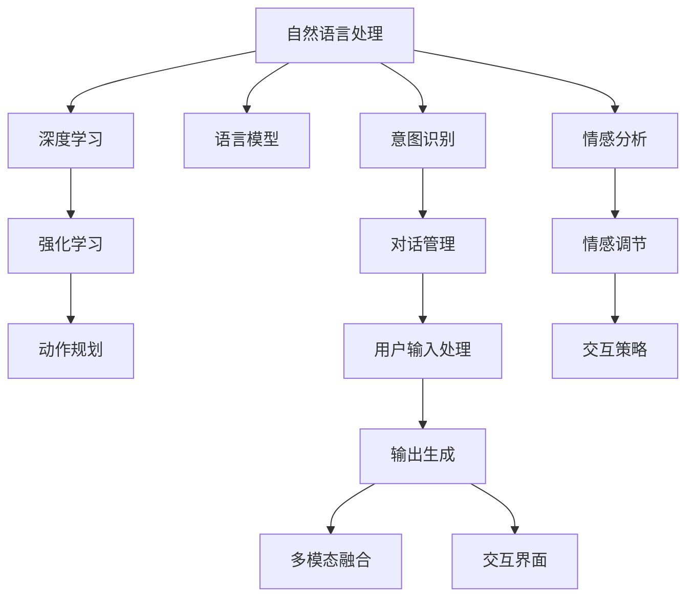

                 

# 对话式AI：构建更自然、更智能的交互界面

> 关键词：对话式AI, 自然语言处理, 交互界面, 深度学习, 语言模型, 强化学习, 情感分析, 意图识别

## 1. 背景介绍

### 1.1 问题由来
随着人工智能技术的迅猛发展，对话式AI（ Conversational AI, CAI）已经成为研究者和企业关注的焦点。对话式AI能够与用户进行自然、流畅的交互，模拟真实的人类对话，在客服、娱乐、教育、智能家居等多个领域展现了巨大的应用潜力。传统基于规则的交互系统难以应对复杂多变的用户需求，而基于深度学习的对话式AI可以更准确地理解和回应用户的意图，提供个性化的交互体验。

### 1.2 问题核心关键点
构建自然、智能的对话式AI系统，核心在于解决以下几个关键问题：
1. 如何构建高质量的自然语言理解（NLU）和自然语言生成（NLG）模型，使其能够准确理解和生成自然语言。
2. 如何设计有效的对话管理机制，使系统能够流畅地维护对话上下文和状态。
3. 如何融合多模态信息，提升对话系统的感知能力。
4. 如何处理用户的多样化需求，实现个性化和可定制的对话服务。
5. 如何在对话过程中进行情感和语气的识别与生成，提升用户体验。
6. 如何设计用户友好的界面和交互流程，确保系统的易用性和可访问性。

本文将详细探讨这些核心问题，介绍目前对话式AI系统构建的技术框架和实现方法。

## 2. 核心概念与联系

### 2.1 核心概念概述

为更好地理解对话式AI系统的构建，本节将介绍几个关键概念：

- **自然语言处理（NLP）**：通过计算机技术实现自然语言与形式语言之间的相互转换，包括文本处理、语音识别与合成、自然语言理解、自然语言生成等。
- **深度学习（Deep Learning, DL）**：一种模拟人脑神经网络结构进行数据学习的算法，通过多层神经网络实现特征提取和模式识别。
- **语言模型（Language Model）**：用于预测给定上下文下的下一个单词或字符的概率，广泛应用于文本生成、语音识别、机器翻译等任务。
- **强化学习（Reinforcement Learning, RL）**：通过与环境的交互，学习在特定环境下如何做出最优决策，是对话管理机制的重要组成部分。
- **意图识别（Intent Recognition）**：识别用户输入文本的意图，为系统提供下一步操作的方向。
- **情感分析（Sentiment Analysis）**：分析用户输入文本中的情感倾向，为系统调整交互风格和策略提供依据。
- **多模态信息融合**：结合文本、语音、图像等多种信息源，提升对话系统的感知和交互能力。
- **交互界面设计（UI/UX）**：设计直观易用的用户界面和流畅自然的交互流程，确保系统的易用性和可访问性。

这些概念之间的逻辑关系可以通过以下Mermaid流程图来展示：



这个流程图展示了对话式AI系统的主要组件及其之间的联系：

1. 自然语言处理作为输入，通过深度学习等技术实现语言模型、意图识别和情感分析。
2. 强化学习用于对话管理，制定和调整系统行为。
3. 意图识别和情感分析结果用于对话管理和情感调节，指导系统生成自然语言回复。
4. 多模态信息融合结合文本、语音、图像等，增强系统的感知能力。
5. 交互界面设计确保系统的易用性和用户体验。

## 3. 核心算法原理 & 具体操作步骤

### 3.1 算法原理概述

构建对话式AI系统的核心算法包括深度学习模型、强化学习算法和自然语言处理技术。其中，深度学习用于构建高质量的NLP模型，强化学习用于对话管理，自然语言处理技术用于理解和生成自然语言。

对话式AI的算法流程大致如下：
1. 收集和处理用户输入数据，包括文本、语音、图像等。
2. 使用深度学习模型对输入数据进行特征提取和语义理解。
3. 应用意图识别和情感分析技术，理解用户意图和情感倾向。
4. 通过强化学习算法，根据用户反馈和对话历史，动态调整对话策略。
5. 结合多模态信息，生成自然语言回复。
6. 将回复传递给用户，并根据用户反馈进行迭代优化。

### 3.2 算法步骤详解

构建对话式AI系统通常包括以下几个关键步骤：

**Step 1: 数据收集与预处理**
- 收集对话数据集，包括用户输入、系统回复、对话上下文等。
- 对数据进行清洗、去噪和标准化，确保数据质量。

**Step 2: 构建深度学习模型**
- 选择合适的深度学习框架（如PyTorch、TensorFlow等）和模型结构。
- 使用大规模标注数据训练深度学习模型，如BERT、GPT等。
- 应用迁移学习技术，将预训练模型适应特定任务。

**Step 3: 意图识别和情感分析**
- 使用深度学习模型或规则引擎进行意图识别，确定用户输入的意图。
- 应用情感分析技术，识别用户情感倾向，如正面、中性、负面等。

**Step 4: 对话管理**
- 设计对话管理机制，包括对话策略、对话历史存储等。
- 应用强化学习算法，通过与环境的交互，优化对话策略。

**Step 5: 自然语言生成**
- 使用深度学习模型或规则引擎生成自然语言回复。
- 应用多模态信息融合技术，提升回复质量。

**Step 6: 用户交互和反馈收集**
- 将生成的回复传递给用户，等待用户回应。
- 收集用户反馈，用于后续模型的迭代优化。

**Step 7: 模型优化和迭代**
- 根据用户反馈，不断调整模型参数和对话策略。
- 应用模型压缩、优化算法等技术，提高系统性能。

### 3.3 算法优缺点

对话式AI系统具有以下优点：
1. 可以处理自然语言输入，提升人机交互的自然性和流畅性。
2. 具备自学习和自适应能力，能够根据用户反馈进行优化和改进。
3. 能够处理多种模态信息，提升感知和交互能力。
4. 可以实现多轮对话，提供更丰富、更个性化的交互体验。

同时，对话式AI系统也存在一些局限性：
1. 对数据质量和多样性要求较高，数据收集成本较高。
2. 模型训练和优化复杂，需要大量计算资源和专业技能。
3. 对话管理机制设计复杂，难以应对所有可能的用户行为。
4. 系统鲁棒性不足，可能存在语言理解错误和输出不一致等问题。
5. 用户隐私保护问题，对话数据需要严格管理和保护。

### 3.4 算法应用领域

对话式AI技术在多个领域已经得到了广泛应用，例如：

- 客户服务：通过对话式AI提供7x24小时不间断客服服务，快速响应客户需求，提升客户满意度。
- 金融咨询：使用对话式AI进行智能投资建议、财务规划等，提升金融服务质量和用户体验。
- 智能家居：通过对话式AI与用户进行交互，实现智能设备控制、场景设置等功能，提升生活便利性。
- 教育培训：利用对话式AI提供个性化学习建议、语言学习辅导等服务，提升教育效果。
- 医疗咨询：使用对话式AI进行健康咨询、诊疗建议等，提升医疗服务质量和便利性。
- 智能助手：通过对话式AI提供日常事务管理、日程安排、信息查询等服务，提升生活效率。

这些应用领域展示了对话式AI技术的多样性和实用性，未来有望在更多场景中得到广泛应用。

## 4. 数学模型和公式 & 详细讲解 & 举例说明

### 4.1 数学模型构建

对话式AI系统的核心数学模型包括语言模型、意图识别模型和情感分析模型。这里以语言模型为例，介绍其数学模型构建过程。

假设训练集为 $D = \{(x_i, y_i)\}_{i=1}^N$，其中 $x_i$ 为输入文本，$y_i$ 为输出标签。定义模型 $M_{\theta}$ 为深度神经网络，其参数 $\theta$ 用于描述网络结构和权重。模型 $M_{\theta}$ 在输入文本 $x_i$ 上的输出概率为 $P_{M_{\theta}}(y_i|x_i)$，则定义交叉熵损失函数为：

$$
\mathcal{L}(\theta) = -\frac{1}{N} \sum_{i=1}^N \log P_{M_{\theta}}(y_i|x_i)
$$

通过最小化损失函数 $\mathcal{L}(\theta)$，可以训练出高质量的语言模型 $M_{\theta}$。

### 4.2 公式推导过程

语言模型 $P_{M_{\theta}}(y_i|x_i)$ 可以通过深度神经网络来实现，其输出概率通过softmax函数计算：

$$
P_{M_{\theta}}(y_i|x_i) = \frac{\exp(u_i(\theta))}{\sum_k \exp(u_k(\theta))}
$$

其中 $u_i(\theta)$ 为神经网络在输入 $x_i$ 上的输出，表示输入 $x_i$ 与标签 $y_i$ 之间的相关性。

使用交叉熵损失函数，最小化损失函数 $\mathcal{L}(\theta)$ 的过程为：

$$
\frac{\partial \mathcal{L}(\theta)}{\partial \theta} = -\frac{1}{N} \sum_{i=1}^N \frac{y_i}{P_{M_{\theta}}(y_i|x_i)}
$$

通过反向传播算法，计算出梯度 $\frac{\partial \mathcal{L}(\theta)}{\partial \theta}$，并根据梯度下降等优化算法更新模型参数 $\theta$，即可训练出高质量的语言模型。

### 4.3 案例分析与讲解

以BERT模型为例，介绍其语言模型的构建和应用。

BERT模型的核心组件为Transformer编码器，其输入为文本序列 $x_i = \{x_i^1, x_i^2, \ldots, x_i^n\}$，输出为每个单词的嵌入向量 $\{h_i^1, h_i^2, \ldots, h_i^n\}$。语言模型的输出为输入序列中每个单词的条件概率 $P_{M_{\theta}}(y_i|x_i)$，其中 $y_i$ 为单词 $x_i^j$ 的概率分布。

BERT模型的训练过程如下：
1. 将输入文本 $x_i$ 转化为Transformer编码器的输入序列 $x_i = \{x_i^1, x_i^2, \ldots, x_i^n\}$。
2. 应用Transformer编码器计算每个单词的嵌入向量 $\{h_i^1, h_i^2, \ldots, h_i^n\}$。
3. 通过神经网络计算输出概率 $P_{M_{\theta}}(y_i|x_i)$。
4. 计算交叉熵损失 $\mathcal{L}(\theta)$，并使用梯度下降算法更新模型参数 $\theta$。

训练好的BERT模型可以用于意图识别和情感分析等任务，通过预训练和微调过程，适配特定任务需求。

## 5. 项目实践：代码实例和详细解释说明

### 5.1 开发环境搭建

在进行对话式AI系统开发前，我们需要准备好开发环境。以下是使用Python进行PyTorch开发的环境配置流程：

1. 安装Anaconda：从官网下载并安装Anaconda，用于创建独立的Python环境。

2. 创建并激活虚拟环境：
```bash
conda create -n cai-env python=3.8 
conda activate cai-env
```

3. 安装PyTorch：根据CUDA版本，从官网获取对应的安装命令。例如：
```bash
conda install pytorch torchvision torchaudio cudatoolkit=11.1 -c pytorch -c conda-forge
```

4. 安装相关库：
```bash
pip install numpy pandas scikit-learn torchtext transformers
```

5. 安装各类工具包：
```bash
pip install tqdm jupyter notebook ipython
```

完成上述步骤后，即可在`cai-env`环境中开始开发实践。

### 5.2 源代码详细实现

这里我们以构建意图识别系统为例，给出使用PyTorch和Transformers库的代码实现。

首先，定义意图识别数据集：

```python
import torch
import torchtext as tt
import pandas as pd
import numpy as np

data = pd.read_csv('intents.csv')
labels = data['label']
texts = data['text']

texts = [text.lower() for text in texts]

tokenizer = tt.data.Field(tokenize='spacy', lower=True, include_lengths=True)
tokenizer.build_vocab(list(texts), max_size=10000)

train_data, test_data = tt.datasets.TextClassificationDataset(
    path='train.txt', 
    text_field=tokenizer,
    label_field=tt.LabelField(sequential=False)
)
```

然后，定义模型和优化器：

```python
from transformers import BertForTokenClassification, AdamW

model = BertForTokenClassification.from_pretrained('bert-base-cased', num_labels=10)

optimizer = AdamW(model.parameters(), lr=2e-5)
```

接着，定义训练和评估函数：

```python
from torch.utils.data import DataLoader
from tqdm import tqdm

device = torch.device('cuda') if torch.cuda.is_available() else torch.device('cpu')
model.to(device)

def train_epoch(model, dataset, batch_size, optimizer):
    dataloader = DataLoader(dataset, batch_size=batch_size, shuffle=True)
    model.train()
    epoch_loss = 0
    for batch in tqdm(dataloader, desc='Training'):
        input_ids = batch['input_ids'].to(device)
        attention_mask = batch['attention_mask'].to(device)
        labels = batch['labels'].to(device)
        model.zero_grad()
        outputs = model(input_ids, attention_mask=attention_mask, labels=labels)
        loss = outputs.loss
        epoch_loss += loss.item()
        loss.backward()
        optimizer.step()
    return epoch_loss / len(dataloader)

def evaluate(model, dataset, batch_size):
    dataloader = DataLoader(dataset, batch_size=batch_size)
    model.eval()
    preds, labels = [], []
    with torch.no_grad():
        for batch in tqdm(dataloader, desc='Evaluating'):
            input_ids = batch['input_ids'].to(device)
            attention_mask = batch['attention_mask'].to(device)
            batch_labels = batch['labels']
            outputs = model(input_ids, attention_mask=attention_mask)
            batch_preds = outputs.logits.argmax(dim=2).to('cpu').tolist()
            batch_labels = batch_labels.to('cpu').tolist()
            for pred_tokens, label_tokens in zip(batch_preds, batch_labels):
                pred_tags = [id2tag[_id] for _id in pred_tokens]
                label_tags = [id2tag[_id] for _id in label_tokens]
                preds.append(pred_tags[:len(label_tokens)])
                labels.append(label_tags)
                
    print(classification_report(labels, preds))
```

最后，启动训练流程并在测试集上评估：

```python
epochs = 5
batch_size = 16

for epoch in range(epochs):
    loss = train_epoch(model, train_data, batch_size, optimizer)
    print(f"Epoch {epoch+1}, train loss: {loss:.3f}")
    
    print(f"Epoch {epoch+1}, test results:")
    evaluate(model, test_data, batch_size)
    
print("Final results:")
evaluate(model, test_data, batch_size)
```

以上就是使用PyTorch对BERT进行意图识别系统微调的完整代码实现。可以看到，得益于Transformers库的强大封装，我们可以用相对简洁的代码完成BERT模型的加载和微调。

### 5.3 代码解读与分析

让我们再详细解读一下关键代码的实现细节：

**意图识别数据集定义**：
- 使用Pandas读取意图识别数据集，提取文本和标签。
- 对文本进行预处理，包括转换为小写、分词等。
- 定义tokenizer，用于对文本进行分词和编码，并构建词汇表。
- 使用torchtext库构建训练集和测试集。

**模型和优化器定义**：
- 使用BertForTokenClassification模型作为预训练模型，其预训练权重来自'bert-base-cased'。
- 定义AdamW优化器，设置学习率为2e-5。

**训练和评估函数**：
- 定义训练函数`train_epoch`：对数据以批为单位进行迭代，在每个批次上前向传播计算loss并反向传播更新模型参数，最后返回该epoch的平均loss。
- 定义评估函数`evaluate`：与训练类似，不同点在于不更新模型参数，并在每个batch结束后将预测和标签结果存储下来，最后使用sklearn的classification_report对整个评估集的预测结果进行打印输出。

**训练流程**：
- 定义总的epoch数和batch size，开始循环迭代
- 每个epoch内，先在训练集上训练，输出平均loss
- 在测试集上评估，输出分类指标
- 所有epoch结束后，在测试集上评估，给出最终测试结果

可以看到，PyTorch配合Transformers库使得BERT微调的代码实现变得简洁高效。开发者可以将更多精力放在数据处理、模型改进等高层逻辑上，而不必过多关注底层的实现细节。

当然，工业级的系统实现还需考虑更多因素，如模型的保存和部署、超参数的自动搜索、更灵活的任务适配层等。但核心的微调范式基本与此类似。

## 6. 实际应用场景
### 6.1 智能客服系统

基于对话式AI技术的智能客服系统，已经在各大企业中广泛应用。传统的客服系统往往需要大量人工客服进行回答，高峰期响应缓慢且难以保证一致性。而使用对话式AI，能够24小时不间断提供客服服务，快速响应客户需求，提升客户满意度。

在技术实现上，可以收集企业内部的历史客服对话记录，将问题和最佳答复构建成监督数据，在此基础上对预训练对话模型进行微调。微调后的对话模型能够自动理解用户意图，匹配最合适的答案模板进行回复。对于客户提出的新问题，还可以接入检索系统实时搜索相关内容，动态组织生成回答。如此构建的智能客服系统，能大幅提升客户咨询体验和问题解决效率。

### 6.2 金融咨询

金融机构需要实时监测市场舆论动向，以便及时应对负面信息传播，规避金融风险。传统的人工监测方式成本高、效率低，难以应对网络时代海量信息爆发的挑战。基于对话式AI的文本分类和情感分析技术，为金融舆情监测提供了新的解决方案。

具体而言，可以收集金融领域相关的新闻、报道、评论等文本数据，并对其进行主题标注和情感标注。在此基础上对预训练语言模型进行微调，使其能够自动判断文本属于何种主题，情感倾向是正面、中性还是负面。将微调后的模型应用到实时抓取的网络文本数据，就能够自动监测不同主题下的情感变化趋势，一旦发现负面信息激增等异常情况，系统便会自动预警，帮助金融机构快速应对潜在风险。

### 6.3 智能家居

当前的智能家居设备，往往需要用户手动操作才能实现功能，用户体验不够流畅。对话式AI技术可以将用户与智能家居设备无缝连接，通过自然语言交互，实现家电控制、场景设置等功能，提升生活便利性。

在技术实现上，对话式AI系统可以集成到智能家居平台中，根据用户指令控制各种家电设备。通过微调，对话式AI能够理解不同家电的指令规则，提供个性化的控制方案。用户只需通过语音或文字与系统交互，即可实现对家电商具的远程控制，提升智能家居系统的智能化水平。

### 6.4 未来应用展望

随着对话式AI技术的不断演进，其在更多领域的应用前景将更加广阔。

- 医疗咨询：利用对话式AI进行健康咨询、诊疗建议等，提升医疗服务质量和便利性。
- 教育培训：利用对话式AI提供个性化学习建议、语言学习辅导等服务，提升教育效果。
- 智能助手：通过对话式AI提供日常事务管理、日程安排、信息查询等服务，提升生活效率。
- 自动驾驶：利用对话式AI与用户进行交互，实时调整驾驶策略，提升行车安全和舒适性。
- 电子商务：通过对话式AI与用户互动，推荐商品、解答疑问，提升购物体验。
- 聊天机器人：构建多模态对话系统，结合图像、语音等多种信息源，提升机器人感知和交互能力。

## 7. 工具和资源推荐
### 7.1 学习资源推荐

为了帮助开发者系统掌握对话式AI的理论基础和实践技巧，这里推荐一些优质的学习资源：

1. 《对话式AI：构建更自然、更智能的交互界面》系列博文：由大模型技术专家撰写，深入浅出地介绍了对话式AI的基本概念、核心算法和应用案例。

2. 《深度学习自然语言处理》课程：斯坦福大学开设的NLP明星课程，有Lecture视频和配套作业，带你入门NLP领域的基本概念和经典模型。

3. 《Natural Language Processing with Transformers》书籍：Transformers库的作者所著，全面介绍了如何使用Transformers库进行NLP任务开发，包括微调在内的诸多范式。

4. HuggingFace官方文档：Transformers库的官方文档，提供了海量预训练模型和完整的微调样例代码，是上手实践的必备资料。

5. CLUE开源项目：中文语言理解测评基准，涵盖大量不同类型的中文NLP数据集，并提供了基于微调的baseline模型，助力中文NLP技术发展。

通过对这些资源的学习实践，相信你一定能够快速掌握对话式AI的精髓，并用于解决实际的NLP问题。
###  7.2 开发工具推荐

高效的开发离不开优秀的工具支持。以下是几款用于对话式AI开发常用的工具：

1. PyTorch：基于Python的开源深度学习框架，灵活动态的计算图，适合快速迭代研究。大部分预训练语言模型都有PyTorch版本的实现。

2. TensorFlow：由Google主导开发的开源深度学习框架，生产部署方便，适合大规模工程应用。同样有丰富的预训练语言模型资源。

3. Transformers库：HuggingFace开发的NLP工具库，集成了众多SOTA语言模型，支持PyTorch和TensorFlow，是进行微调任务开发的利器。

4. Weights & Biases：模型训练的实验跟踪工具，可以记录和可视化模型训练过程中的各项指标，方便对比和调优。与主流深度学习框架无缝集成。

5. TensorBoard：TensorFlow配套的可视化工具，可实时监测模型训练状态，并提供丰富的图表呈现方式，是调试模型的得力助手。

6. Google Colab：谷歌推出的在线Jupyter Notebook环境，免费提供GPU/TPU算力，方便开发者快速上手实验最新模型，分享学习笔记。

合理利用这些工具，可以显著提升对话式AI系统的开发效率，加快创新迭代的步伐。

### 7.3 相关论文推荐

对话式AI技术的发展源于学界的持续研究。以下是几篇奠基性的相关论文，推荐阅读：

1. Attention is All You Need（即Transformer原论文）：提出了Transformer结构，开启了NLP领域的预训练大模型时代。

2. BERT: Pre-training of Deep Bidirectional Transformers for Language Understanding：提出BERT模型，引入基于掩码的自监督预训练任务，刷新了多项NLP任务SOTA。

3. Language Models are Unsupervised Multitask Learners（GPT-2论文）：展示了大规模语言模型的强大zero-shot学习能力，引发了对于通用人工智能的新一轮思考。

4. Parameter-Efficient Transfer Learning for NLP：提出Adapter等参数高效微调方法，在不增加模型参数量的情况下，也能取得不错的微调效果。

5. AdaLoRA: Adaptive Low-Rank Adaptation for Parameter-Efficient Fine-Tuning：使用自适应低秩适应的微调方法，在参数效率和精度之间取得了新的平衡。

6. Premier: Hierarchical Reasoning in Transformer-based Pre-training：提出Premier预训练方法，增强了模型的推理能力。

这些论文代表了大语言模型微调技术的发展脉络。通过学习这些前沿成果，可以帮助研究者把握学科前进方向，激发更多的创新灵感。

## 8. 总结：未来发展趋势与挑战

### 8.1 总结

本文对对话式AI系统的构建过程进行了全面系统的介绍。首先阐述了对话式AI系统的背景和意义，明确了系统的核心问题，包括自然语言处理、深度学习模型、意图识别、情感分析、对话管理、多模态融合和交互界面设计等。其次，从原理到实践，详细讲解了对话式AI系统的构建方法，包括深度学习模型的构建、意图识别和情感分析等核心算法，以及微调技术的实现细节。最后，本文还探讨了对话式AI系统的实际应用场景，展示了其在智能客服、金融咨询、智能家居等多个领域的应用潜力。

通过本文的系统梳理，可以看到，对话式AI系统已经在多个领域展现出强大的应用价值，未来有望在更多场景中得到广泛应用。

### 8.2 未来发展趋势

展望未来，对话式AI系统的发展将呈现以下几个趋势：

1. 技术框架更加多样化。对话式AI系统将结合多种技术和工具，形成更高效、更灵活的开发环境。
2. 多模态信息融合能力提升。对话式AI系统将更好地融合文本、语音、图像等多种信息源，提升感知和交互能力。
3. 意图识别和情感分析技术优化。通过更先进的方法，提升系统对用户意图的准确理解和情感的精准判断。
4. 对话管理机制更加智能。引入更多AI技术，如强化学习、生成对抗网络等，提升系统的对话管理能力。
5. 个性化和可定制能力增强。通过个性化推荐和自适应技术，提升对话系统的个性化和定制化能力。
6. 交互界面设计更加人性化。结合UI/UX设计理念，提升对话系统的易用性和用户体验。
7. 跨领域和跨平台应用拓展。对话式AI系统将更好地应用于不同领域和平台，提升其在更多场景中的应用价值。

以上趋势展示了对话式AI系统的广阔前景。这些方向的探索发展，必将进一步提升对话系统的性能和应用范围，为人工智能技术带来新的突破。

### 8.3 面临的挑战

尽管对话式AI系统已经取得了瞩目成就，但在迈向更加智能化、普适化应用的过程中，仍面临诸多挑战：

1. 数据质量和多样性。对话式AI系统对数据质量和多样性要求较高，数据收集成本较高，且数据标注质量影响模型性能。
2. 模型训练和优化复杂。对话式AI系统训练和优化复杂，需要大量计算资源和专业技能，且模型鲁棒性不足。
3. 系统设计和实现难度大。对话管理机制设计复杂，难以应对所有可能的用户行为，且系统设计和实现难度大。
4. 用户隐私保护问题。对话式AI系统处理大量用户数据，需要严格管理和保护用户隐私。
5. 技术集成和部署困难。对话式AI系统需要与其他系统集成，且在实际部署中存在技术瓶颈。
6. 可解释性和透明度不足。对话式AI系统输出缺乏可解释性，难以解释其内部工作机制和决策逻辑。

### 8.4 研究展望

面对对话式AI系统面临的挑战，未来的研究需要在以下几个方面寻求新的突破：

1. 探索无监督和半监督学习范式。摆脱对大规模标注数据的依赖，利用自监督学习、主动学习等方法，最大限度利用非结构化数据，实现更加灵活高效的微调。
2. 开发更加参数高效和计算高效的微调方法。开发更加参数高效和计算高效的微调方法，在固定大部分预训练参数的同时，只更新极少量的任务相关参数。同时优化模型计算图，减少前向传播和反向传播的资源消耗。
3. 引入更多先验知识。将符号化的先验知识，如知识图谱、逻辑规则等，与神经网络模型进行巧妙融合，引导微调过程学习更准确、合理的语言模型。同时加强不同模态数据的整合，实现视觉、语音等多模态信息与文本信息的协同建模。
4. 结合因果分析和博弈论工具。将因果分析方法引入微调模型，识别出模型决策的关键特征，增强输出解释的因果性和逻辑性。借助博弈论工具刻画人机交互过程，主动探索并规避模型的脆弱点，提高系统稳定性。
5. 纳入伦理道德约束。在模型训练目标中引入伦理导向的评估指标，过滤和惩罚有偏见、有害的输出倾向。同时加强人工干预和审核，建立模型行为的监管机制，确保输出符合人类价值观和伦理道德。
6. 提升可解释性和透明度。在模型设计中引入可解释性机制，增强模型的透明度和可解释性，确保用户对系统行为的可理解性和信任度。

这些研究方向的探索，必将引领对话式AI系统的不断进步，为人工智能技术带来新的突破。未来，对话式AI系统需要在技术、伦理、隐私等多个维度上不断优化，才能真正实现人机协同的智能交互，为用户提供更自然、更智能的交互体验。

## 9. 附录：常见问题与解答

**Q1：对话式AI系统如何提升用户体验？**

A: 对话式AI系统通过自然语言处理和深度学习技术，能够理解和生成自然语言，与用户进行流畅的对话。系统通过意图识别和情感分析，理解用户需求和情感倾向，提供个性化和定制化的回复，提升用户体验。同时，多模态信息融合技术提升了系统的感知和交互能力，使对话更加自然和智能。

**Q2：对话式AI系统在技术实现上有哪些难点？**

A: 对话式AI系统的技术实现上，主要有以下几个难点：
1. 数据质量和多样性。对话式AI系统对数据质量和多样性要求较高，数据收集成本较高，且数据标注质量影响模型性能。
2. 模型训练和优化复杂。对话式AI系统训练和优化复杂，需要大量计算资源和专业技能，且模型鲁棒性不足。
3. 系统设计和实现难度大。对话管理机制设计复杂，难以应对所有可能的用户行为，且系统设计和实现难度大。
4. 用户隐私保护问题。对话式AI系统处理大量用户数据，需要严格管理和保护用户隐私。
5. 技术集成和部署困难。对话式AI系统需要与其他系统集成，且在实际部署中存在技术瓶颈。
6. 可解释性和透明度不足。对话式AI系统输出缺乏可解释性，难以解释其内部工作机制和决策逻辑。

**Q3：对话式AI系统如何实现多模态信息融合？**

A: 对话式AI系统实现多模态信息融合，通常需要以下步骤：
1. 收集多种信息源，如文本、语音、图像等。
2. 对信息源进行预处理和特征提取，提取每个信息源的特征向量。
3. 使用深度学习模型，如Transformer、LSTM等，将多种信息源的特征向量进行融合，得到综合特征向量。
4. 将综合特征向量作为输入，输入到对话生成模型中，生成自然语言回复。
5. 在回复中适当展示多模态信息，如语音、图像等，提升交互体验。

**Q4：对话式AI系统如何处理自然语言输入？**

A: 对话式AI系统处理自然语言输入，主要通过以下几个步骤：
1. 对用户输入进行分词和标准化处理，去除噪音和冗余信息。
2. 使用深度学习模型，如BERT、GPT等，对用户输入进行特征提取和语义理解。
3. 通过意图识别和情感分析，理解用户输入的意图和情感倾向。
4. 根据用户输入，设计合适的对话策略，生成自然语言回复。
5. 将回复传递给用户，等待用户回应。

**Q5：对话式AI系统如何设计用户友好的交互界面？**

A: 对话式AI系统设计用户友好的交互界面，主要通过以下几个步骤：
1. 根据系统功能设计简洁明了的用户界面，包括菜单、按钮等。
2. 优化交互流程，确保用户操作简单易懂，减少用户困惑。
3. 提供实时反馈和提示，帮助用户理解系统操作和状态。
4. 支持多语言和国际化，提升系统的可访问性和可用性。
5. 使用UI/UX设计理念，提升系统的易用性和用户体验。

通过本文的系统梳理，可以看到，对话式AI系统已经在多个领域展现出强大的应用价值，未来有望在更多场景中得到广泛应用。未来，对话式AI系统需要在技术、伦理、隐私等多个维度上不断优化，才能真正实现人机协同的智能交互，为用户提供更自然、更智能的交互体验。

---

作者：禅与计算机程序设计艺术 / Zen and the Art of Computer Programming

