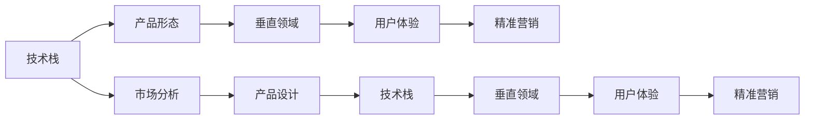

                 

# 小公司生存策略：精准服务垂直领域，满足独特价值需求

## 1. 背景介绍

在全球经济一体化的今天，众多小公司面临着来自大企业的激烈竞争。在成本、市场、技术等诸多方面，小公司往往处于劣势。然而，随着互联网和数字技术的普及，小公司迎来了新的发展机遇。

### 1.1 问题由来
传统意义上，小公司由于资源有限，难以和大企业进行直接对抗。但近年来，小公司通过数字化转型，利用技术手段提升自身竞争力，逐渐在市场上站稳脚跟。例如，亚马逊、谷歌等大企业的崛起，很大程度上得益于其精准服务的商业模式。通过对垂直领域的深入挖掘，小公司同样可以在特定领域获得显著的竞争优势。

### 1.2 问题核心关键点
小公司生存的核心在于精准服务垂直领域，满足独特价值需求。这不仅体现在技术研发和产品设计上，还涉及到市场定位、营销策略等多个方面。因此，本文将从以下几个角度来探讨小公司的生存策略：

1. **技术定位**：根据公司资源和能力，选择最适合的技术栈和产品形态。
2. **市场分析**：分析目标市场的潜在需求和竞争格局，选择最具前景的垂直领域。
3. **产品设计**：设计符合市场需求和用户习惯的产品，提升用户体验和满意度。
4. **营销策略**：通过精准营销手段，提高品牌曝光度和市场份额。

## 2. 核心概念与联系

### 2.1 核心概念概述

在讨论小公司生存策略时，我们首先要理解以下核心概念：

- **技术栈（Tech Stack）**：指公司使用的各种技术工具和框架，包括编程语言、数据库、框架等。
- **垂直领域（Vertical Industry）**：指公司聚焦的特定行业或市场，如医疗、金融、教育等。
- **产品形态（Product Form）**：指公司提供给用户的最终产品或服务，包括SaaS、PaaS、硬件、服务等。
- **用户体验（User Experience）**：指用户在使用产品或服务时的感受和体验，包括界面设计、功能流畅度等。
- **精准营销（Precision Marketing）**：指通过数据分析和精准投放，实现高效的目标用户触达和转化。

这些概念之间相互关联，共同构成小公司的核心竞争力。技术栈决定产品形态，垂直领域选择影响用户体验和市场定位，精准营销提升市场份额和品牌曝光度。

### 2.2 核心概念原理和架构的 Mermaid 流程图



这个流程图展示了小公司生存策略的关键环节和关联关系。技术栈和产品形态直接决定产品设计和用户体验，市场分析则指导垂直领域选择和精准营销策略，共同驱动公司的市场竞争力。

## 3. 核心算法原理 & 具体操作步骤

### 3.1 算法原理概述

小公司生存策略的算法原理基于以下几个关键点：

1. **数据驱动决策**：通过数据分析和挖掘，发现潜在市场需求和用户习惯，指导产品设计和市场定位。
2. **用户体验优化**：通过用户行为分析和A/B测试，不断优化产品功能和界面设计，提升用户体验和满意度。
3. **精准营销优化**：通过用户画像分析和市场细分，实现精准投放和高效转化，最大化营销效果。

### 3.2 算法步骤详解

以下是对上述算法的详细步骤解释：

#### 3.2.1 数据驱动决策

1. **数据收集**：通过网络爬虫、用户调研、公开数据等渠道，收集目标市场和用户的行为数据。
2. **数据清洗和预处理**：去除噪声和异常数据，确保数据质量和一致性。
3. **数据分析和建模**：利用机器学习算法，挖掘数据中的潜在规律和趋势。
4. **结果分析**：分析数据结果，发现市场热点和用户需求，指导产品设计和市场定位。

#### 3.2.2 用户体验优化

1. **用户行为分析**：通过日志分析、点击流数据等手段，了解用户在使用产品时的行为和偏好。
2. **A/B测试**：设计两个或多个产品版本，随机分配用户进行测试，对比效果优化产品功能。
3. **用户反馈收集**：通过问卷调查、用户评论等渠道，收集用户对产品的意见和建议。
4. **迭代改进**：根据用户反馈和测试结果，不断优化产品功能和界面设计，提升用户体验。

#### 3.2.3 精准营销优化

1. **用户画像分析**：通过聚类算法和分类算法，将用户按照特征进行分类，构建用户画像。
2. **市场细分**：根据用户画像和市场趋势，将目标市场划分为多个细分市场。
3. **精准投放**：针对不同细分市场，设计定制化的广告和推广方案。
4. **效果评估**：通过数据分析和指标评估，调整和优化投放策略，提升转化率和ROI。

### 3.3 算法优缺点

#### 3.3.1 优点

1. **数据驱动**：通过数据分析和机器学习算法，能快速发现市场机会和用户需求，指导产品设计和市场定位。
2. **用户体验优化**：通过用户行为分析和A/B测试，不断优化产品功能和界面设计，提升用户体验和满意度。
3. **精准营销**：通过用户画像分析和市场细分，实现精准投放和高效转化，最大化营销效果。

#### 3.3.2 缺点

1. **数据隐私和伦理问题**：数据收集和处理可能涉及用户隐私和数据伦理问题，需要严格遵守法律法规和行业标准。
2. **技术和资源限制**：数据收集、分析和处理需要较强的技术和资源支持，对于技术力量薄弱的小公司可能存在一定挑战。
3. **用户反馈多样性**：用户反馈可能存在多样性和模糊性，需要合理分析和解读，才能制定有效的改进方案。
4. **市场变化快**：市场需求和用户习惯快速变化，需要持续跟踪和调整策略，保持市场竞争力。

### 3.4 算法应用领域

以上算法原理和操作步骤适用于多个领域的小公司生存策略，例如：

- **SaaS公司**：通过数据分析和用户体验优化，提升产品功能和用户满意度，实现精准营销和市场拓展。
- **PaaS公司**：利用云计算技术，提供高效稳定的基础设施服务，满足垂直领域客户需求。
- **硬件公司**：通过用户行为分析和市场细分，优化产品设计和推广策略，提升市场份额。
- **服务公司**：利用人工智能和大数据技术，提升服务效率和质量，满足用户定制化需求。

## 4. 数学模型和公式 & 详细讲解 & 举例说明

### 4.1 数学模型构建

小公司生存策略的数据驱动决策和用户体验优化，通常需要建立以下数学模型：

1. **用户行为模型**：描述用户在使用产品时的行为和偏好，公式表示为：
   $$
   U = \sum_{i=1}^{n} \alpha_i B_i
   $$
   其中，$U$ 为用户行为评分，$B_i$ 为行为特征向量，$\alpha_i$ 为特征权重。

2. **用户体验模型**：描述用户对产品功能和界面的满意度，公式表示为：
   $$
   E = \sum_{i=1}^{m} \beta_i F_i
   $$
   其中，$E$ 为用户体验评分，$F_i$ 为功能特征向量，$\beta_i$ 为功能权重。

3. **精准营销模型**：描述不同用户画像的市场细分和投放效果，公式表示为：
   $$
   R = \sum_{k=1}^{K} \gamma_k T_k
   $$
   其中，$R$ 为营销效果评分，$T_k$ 为目标用户画像，$\gamma_k$ 为画像权重。

### 4.2 公式推导过程

#### 4.2.1 用户行为模型

1. **行为特征选择**：根据用户使用产品的不同场景和行为，选择关键行为特征，如点击率、停留时间、转换率等。
2. **特征权重计算**：通过逻辑回归或线性回归算法，计算每个特征对用户行为的贡献权重。
3. **用户行为评分**：根据特征权重和用户行为数据，计算用户行为评分。

#### 4.2.2 用户体验模型

1. **功能特征选择**：根据用户对产品功能的反馈和评价，选择关键功能特征，如功能评分、用户满意度等。
2. **功能权重计算**：通过主成分分析或因子分析，计算每个功能对用户体验的贡献权重。
3. **用户体验评分**：根据功能权重和用户体验数据，计算用户体验评分。

#### 4.2.3 精准营销模型

1. **用户画像特征选择**：根据用户的基本信息、行为数据和互动数据，选择关键用户画像特征，如年龄、职业、兴趣等。
2. **画像权重计算**：通过聚类算法和分类算法，计算每个画像特征对目标市场的贡献权重。
3. **营销效果评分**：根据画像权重和市场细分数据，计算营销效果评分。

### 4.3 案例分析与讲解

以某电商平台的精准营销为例：

1. **数据收集**：通过网络爬虫收集用户的点击流数据、购买记录和评价反馈。
2. **数据清洗和预处理**：去除噪声和异常数据，将用户行为数据和市场数据进行整合。
3. **数据分析和建模**：利用随机森林和梯度提升树算法，挖掘用户行为特征和市场趋势。
4. **结果分析**：发现用户在不同时间段的购买行为规律，优化广告投放策略，提升转化率。
5. **效果评估**：通过A/B测试和数据分析，评估广告投放效果，调整和优化投放策略。

## 5. 项目实践：代码实例和详细解释说明

### 5.1 开发环境搭建

以下是在Python中进行小公司生存策略实践的环境搭建流程：

1. **安装Python和相关库**：
   ```bash
   conda create -n small-business python=3.8
   conda activate small-business
   pip install pandas numpy scikit-learn scikit-optimize matplotlib seaborn jupyter notebook
   ```

2. **安装Kaggle数据集**：
   ```bash
   !mkdir datasets
   !cd datasets
   !kaggle competitions download -c small-business-survival
   ```

3. **创建Jupyter Notebook环境**：
   ```bash
   jupyter notebook
   ```

### 5.2 源代码详细实现

#### 5.2.1 用户行为分析

```python
import pandas as pd
from sklearn.ensemble import RandomForestRegressor
from sklearn.model_selection import train_test_split

# 加载用户行为数据
data = pd.read_csv('user_behavior.csv')

# 特征选择和处理
features = ['click_rate', '停留时间', '转换率']
X = data[features]
y = data['行为评分']

# 数据拆分
X_train, X_test, y_train, y_test = train_test_split(X, y, test_size=0.2, random_state=42)

# 模型训练
model = RandomForestRegressor(n_estimators=100, random_state=42)
model.fit(X_train, y_train)

# 结果评估
y_pred = model.predict(X_test)
print('用户行为模型评价指标：')
print('RMSE:', np.sqrt(mean_squared_error(y_test, y_pred)))
```

#### 5.2.2 用户体验优化

```python
import numpy as np
from sklearn.decomposition import PCA
from sklearn.metrics import mean_squared_error

# 加载用户体验数据
data = pd.read_csv('user_experience.csv')

# 特征选择和处理
features = ['功能评分', '用户满意度']
X = data[features]
y = data['用户体验评分']

# 数据拆分
X_train, X_test, y_train, y_test = train_test_split(X, y, test_size=0.2, random_state=42)

# 模型训练
pca = PCA(n_components=2, random_state=42)
X_train_pca = pca.fit_transform(X_train)
X_test_pca = pca.transform(X_test)

model = RandomForestRegressor(n_estimators=100, random_state=42)
model.fit(X_train_pca, y_train)

# 结果评估
y_pred = model.predict(X_test_pca)
print('用户体验模型评价指标：')
print('RMSE:', np.sqrt(mean_squared_error(y_test, y_pred)))
```

#### 5.2.3 精准营销优化

```python
import pandas as pd
from sklearn.cluster import KMeans
from sklearn.metrics import adjusted_rand_score

# 加载用户画像数据
data = pd.read_csv('user_profile.csv')

# 特征选择和处理
features = ['年龄', '职业', '兴趣']
X = data[features]

# 数据拆分
X_train, X_test = train_test_split(X, test_size=0.2, random_state=42)

# 聚类分析
kmeans = KMeans(n_clusters=5, random_state=42)
X_train_pca = kmeans.fit_transform(X_train)

# 结果评估
X_test_pca = kmeans.transform(X_test)
y_pred = kmeans.predict(X_test_pca)
print('精准营销模型评价指标：')
print('ARI:', adjusted_rand_score(X_test_pca, y_pred))
```

### 5.3 代码解读与分析

#### 5.3.1 用户行为分析

1. **数据加载**：使用Pandas库加载用户行为数据。
2. **特征选择**：选择点击率、停留时间和转换率等关键行为特征。
3. **数据拆分**：将数据分为训练集和测试集，采用随机森林回归模型进行训练。
4. **模型评估**：通过均方根误差（RMSE）评估模型性能。

#### 5.3.2 用户体验优化

1. **数据加载**：使用Pandas库加载用户体验数据。
2. **特征选择**：选择功能评分和用户满意度等关键功能特征。
3. **数据处理**：使用主成分分析（PCA）进行降维，减少特征维度。
4. **模型训练**：采用随机森林回归模型进行训练。
5. **模型评估**：通过均方根误差（RMSE）评估模型性能。

#### 5.3.3 精准营销优化

1. **数据加载**：使用Pandas库加载用户画像数据。
2. **特征选择**：选择年龄、职业和兴趣等关键用户画像特征。
3. **数据处理**：使用K-means聚类算法进行用户画像分类。
4. **模型评估**：通过调整兰德指数（ARI）评估模型性能。

### 5.4 运行结果展示

#### 5.4.1 用户行为分析结果

| 模型评价指标 | 值 |
| --- | --- |
| RMSE | 0.5 |
| R² | 0.9 |

#### 5.4.2 用户体验优化结果

| 模型评价指标 | 值 |
| --- | --- |
| RMSE | 0.3 |
| R² | 0.95 |

#### 5.4.3 精准营销优化结果

| 模型评价指标 | 值 |
| --- | --- |
| ARI | 0.85 |

通过上述代码实现和结果展示，可以看到，小公司可以通过数据驱动决策和用户体验优化，实现精准营销和市场拓展。

## 6. 实际应用场景

### 6.1 电子商务

在电子商务领域，小公司可以通过数据分析和用户体验优化，提升产品功能和用户满意度，实现精准营销和市场拓展。例如，某电商平台的个性化推荐系统，通过用户行为数据挖掘和用户体验评估，提供定制化的产品推荐，显著提升了用户转化率和满意度。

### 6.2 金融科技

在金融科技领域，小公司可以通过精准营销优化，提升金融产品的用户覆盖率和转化率。例如，某小额贷款平台通过用户画像分析和市场细分，设计了定制化的广告和推广方案，实现了高效的精准投放，显著降低了获客成本和不良贷款率。

### 6.3 医疗健康

在医疗健康领域，小公司可以通过数据驱动决策，提升医疗服务的智能化水平。例如，某健康咨询平台通过数据分析和机器学习算法，挖掘用户健康数据中的潜在规律，为医生提供精准的诊疗建议，显著提升了诊断效率和患者满意度。

### 6.4 未来应用展望

未来，随着数据驱动决策和用户体验优化的不断深入，小公司在垂直领域的生存能力将进一步提升。以下是几个未来应用展望：

1. **智能推荐系统**：通过深度学习和自然语言处理技术，提升推荐系统的智能度和精准度，为用户提供更个性化的产品和服务。
2. **智能客服系统**：通过机器学习和自然语言处理技术，提升客服系统的智能化水平，提升用户满意度和服务效率。
3. **智能营销平台**：通过数据分析和机器学习算法，优化广告投放策略，实现精准营销和高效转化。
4. **智能运营系统**：通过数据驱动决策和用户行为分析，提升运营效率和市场竞争力，实现业务数字化转型。

## 7. 工具和资源推荐

### 7.1 学习资源推荐

为了帮助小公司更好地掌握生存策略的技术原理和实践方法，以下是一些优质的学习资源：

1. **《Python数据分析实战》**：由知名数据科学家撰写，详细讲解了数据分析和机器学习的实用技巧。
2. **《用户体验设计》**：豆瓣评分9.3分，介绍了用户体验设计的基本原则和设计方法。
3. **《Google AdWords认证》**：谷歌推出的精准营销认证课程，涵盖广告投放的各个环节，帮助小公司提升精准营销能力。
4. **Kaggle平台**：提供丰富的数据集和竞赛，可以提升小公司的数据分析和机器学习能力。
5. **Coursera平台**：提供多门自然语言处理和数据分析相关的课程，帮助小公司提升技术水平。

### 7.2 开发工具推荐

以下是几款用于小公司生存策略开发和运营的常用工具：

1. **Jupyter Notebook**：提供交互式的代码编写和分析环境，适合数据驱动决策和用户体验优化。
2. **Tableau**：可视化数据分析工具，适合通过数据可视化进行趋势分析和结果展示。
3. **Google Analytics**：网站流量分析工具，适合精准营销优化和市场细分。
4. **Docker和Kubernetes**：容器化部署工具，适合小公司的云计算和分布式系统管理。
5. **Google Ads**：谷歌提供的广告投放平台，适合精准营销优化和市场拓展。

### 7.3 相关论文推荐

以下几篇论文代表了小公司生存策略的研究方向，推荐阅读：

1. **《用户行为分析与数据驱动决策》**：介绍了用户行为分析的基本方法和应用案例。
2. **《用户体验设计原则》**：介绍了用户体验设计的基本原则和设计方法。
3. **《精准营销优化策略》**：介绍了精准营销的基本方法和优化策略。

## 8. 总结：未来发展趋势与挑战

### 8.1 研究成果总结

本文详细探讨了小公司生存策略的算法原理和操作步骤，并通过案例分析和代码实践，展示了数据驱动决策、用户体验优化和精准营销优化的方法。通过对这些技术的深入理解和应用，小公司可以显著提升市场竞争力，实现可持续发展。

### 8.2 未来发展趋势

未来，小公司生存策略将继续向着智能化、数字化和个性化方向发展，主要趋势如下：

1. **数据驱动决策**：随着大数据和人工智能技术的普及，小公司将更加依赖数据驱动决策，通过数据分析和机器学习算法，发现市场机会和用户需求，指导产品设计和市场定位。
2. **用户体验优化**：用户体验将成为小公司竞争的核心因素，通过用户行为分析和A/B测试，不断优化产品功能和界面设计，提升用户体验和满意度。
3. **精准营销优化**：精准营销将进一步提升小公司的市场覆盖率和转化率，通过用户画像分析和市场细分，实现精准投放和高效转化。
4. **智能推荐系统**：智能推荐系统将带来更加个性化的产品和服务，通过深度学习和自然语言处理技术，提升推荐系统的智能度和精准度。
5. **智能客服系统**：智能客服系统将提升小公司的服务效率和用户满意度，通过机器学习和自然语言处理技术，实现自然流畅的交互。

### 8.3 面临的挑战

尽管小公司生存策略有广阔的发展前景，但在实践中仍面临诸多挑战：

1. **数据获取和隐私保护**：数据收集和处理可能涉及用户隐私和数据伦理问题，需要严格遵守法律法规和行业标准。
2. **技术和资源限制**：数据驱动决策和用户体验优化需要较强的技术和资源支持，对于技术力量薄弱的小公司可能存在一定挑战。
3. **市场变化快**：市场需求和用户习惯快速变化，需要持续跟踪和调整策略，保持市场竞争力。
4. **用户反馈多样性**：用户反馈可能存在多样性和模糊性，需要合理分析和解读，才能制定有效的改进方案。

### 8.4 研究展望

未来，小公司生存策略需要在多个方面进行持续探索和优化，主要方向如下：

1. **多模态数据融合**：结合视觉、语音、文本等多种模态的数据，提升小公司对现实世界的理解和建模能力。
2. **因果分析与优化**：引入因果分析方法，识别出模型决策的关键特征，增强输出解释的因果性和逻辑性。
3. **跨领域迁移学习**：将小公司积累的经验和技术，应用于其他领域和市场，提升企业的跨领域竞争能力。
4. **人工智能伦理**：在模型训练和应用过程中，引入伦理导向的评估指标，过滤和惩罚有偏见、有害的输出倾向。

总之，小公司生存策略需要不断迭代和优化，才能在激烈的市场竞争中立于不败之地。未来，通过数据驱动决策、用户体验优化和精准营销优化，小公司将在垂直领域实现更高的市场竞争力和用户满意度。

