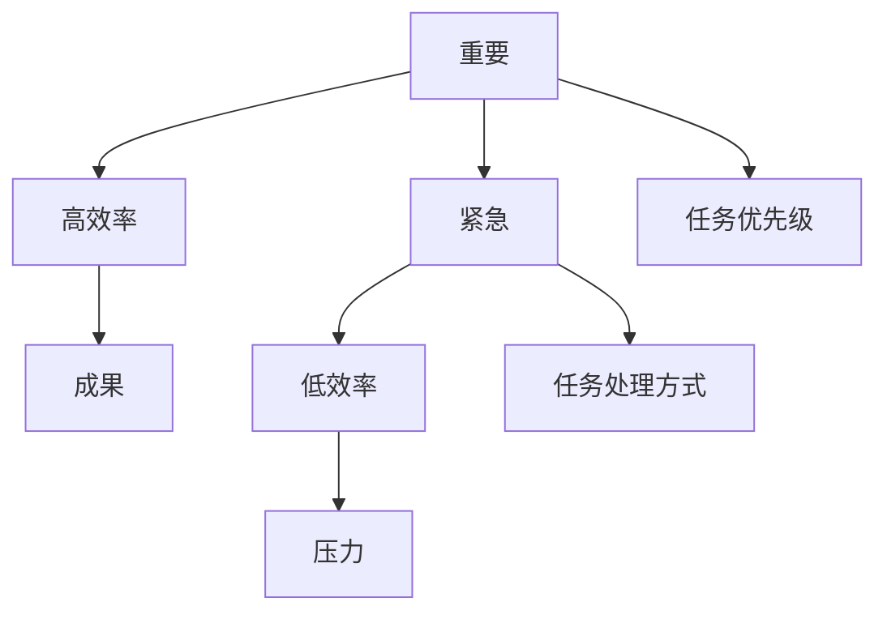

                 

# 巴菲特双目标清单在时间管理中的应用

## 1. 背景介绍

### 1.1 问题由来
在现代社会，时间管理变得至关重要。随着工作和生活节奏的加快，很多人感到时间不够用，常常感到压力和焦虑。巴菲特，世界著名的投资大师，他有一套简单而高效的时间管理方法——双目标清单（Two-Goal Checklist），帮助他安排好自己的时间，保持高效率和持续的成就。

### 1.2 问题核心关键点
巴菲特双目标清单的关键点在于，将时间管理简化为两个目标：即「重要」和「紧急」。通过区分和处理这两个目标，巴菲特能够高效地利用自己的时间，实现工作和生活的平衡，并取得卓越的成就。

### 1.3 问题研究意义
掌握巴菲特双目标清单的应用，可以帮助我们更好地管理时间，提升工作和生活效率，减少压力和焦虑，实现个人和职业的持续发展。巴菲特的时间管理方法不仅适用于投资领域，也适用于任何需要高效管理时间的职业和个人。

## 2. 核心概念与联系

### 2.1 核心概念概述

巴菲特双目标清单是一种简单而高效的时间管理方法，其核心思想是将时间管理分为「重要」和「紧急」两个维度，通过明确这两个维度的目标，指导我们的行动，优化时间的使用。

### 2.2 核心概念原理和架构的 Mermaid 流程图


这个流程图展示了巴菲特双目标清单的核心概念：

- 重要：指对个人成长、职业发展、家庭幸福等长期有价值的目标和任务。
- 紧急：指需要立即处理的任务和突发事件。
- 高效率：通过优先处理重要任务，提升工作效率和成就感。
- 低效率：因处理紧急任务而忽略重要任务，导致时间浪费和压力增加。
- 任务优先级：通过区分任务的重要性和紧急性，确定优先级。
- 任务处理方式：针对不同优先级任务，选择合适的时间处理方式。

### 2.3 核心概念联系

巴菲特双目标清单通过将时间管理简化为「重要」和「紧急」两个维度，明确了任务优先级和处理方式，从而帮助人们更高效地利用时间，实现个人和职业的持续发展。

## 3. 核心算法原理 & 具体操作步骤

### 3.1 算法原理概述
巴菲特双目标清单的算法原理是将时间管理分为「重要」和「紧急」两个维度，明确每个维度的目标和任务，并通过优先处理重要任务，提升工作效率和成就感。

### 3.2 算法步骤详解
1. **明确目标**：确定自己的长期目标和短期目标。
2. **区分任务**：将任务按照「重要」和「紧急」两个维度进行分类。
3. **制定计划**：为每个任务制定具体的时间表，确定优先级。
4. **执行任务**：按照时间表和优先级顺序，逐一处理任务。
5. **定期回顾**：定期回顾和调整时间管理计划，保持高效和灵活性。

### 3.3 算法优缺点
**优点**：
- 简单易行：巴菲特双目标清单方法简单易行，容易上手。
- 提升效率：通过优先处理重要任务，提升工作效率和成就感。
- 减少压力：明确任务优先级和处理方式，减少因紧急任务带来的压力。

**缺点**：
- 缺乏灵活性：对于突发事件和临时任务，可能需要调整时间表。
- 可能需要更多自律：需要较强的自律性，以避免拖延和分心。
- 可能过度简化：对于一些复杂的任务和情境，可能需要更多的方法和工具。

### 3.4 算法应用领域
巴菲特双目标清单适用于任何需要高效管理时间的职业和个人，包括学生、创业者、职场人士等。在时间管理、任务规划、项目执行等方面都有广泛的应用价值。

## 4. 数学模型和公式 & 详细讲解 & 举例说明

### 4.1 数学模型构建
设 $T$ 为一天或一周的时间，$I$ 为「重要」任务的时间，$E$ 为「紧急」任务的时间。则时间管理的总目标可以表示为：

$$
\maximize T = I + E
$$

其中，$I$ 和 $E$ 分别表示「重要」任务和「紧急」任务所需的时间。

### 4.2 公式推导过程
由于时间管理的目标是最大化总时间 $T$，因此需要最小化「重要」任务和「紧急」任务的相互干扰。假设 $I$ 和 $E$ 之间存在一定的冲突，即一个任务的处理会影响另一个任务的时间分配。我们可以定义「重要」任务和「紧急」任务的优先级函数 $P(I, E)$，表示在处理一个任务时，另一个任务的时间损失。优先级函数可以表示为：

$$
P(I, E) = \alpha I + \beta E
$$

其中 $\alpha$ 和 $\beta$ 为优先级系数，表示「重要」任务和「紧急」任务的优先级。

因此，总时间的最大化可以转化为优化问题：

$$
\maximize T = I + E - P(I, E)
$$

### 4.3 案例分析与讲解
假设一个职业经理人一天的时间为 $T=24$ 小时，需要处理以下任务：

- 「重要」任务：参加一个重要的客户会议，时间 $I=4$ 小时；写一份重要的报告，时间 $I=5$ 小时。
- 「紧急」任务：回复邮件，时间 $E=3$ 小时；处理突发事件，时间 $E=2$ 小时。

我们可以使用巴菲特双目标清单来处理这些任务：

1. 将任务按照「重要」和「紧急」两个维度进行分类。
2. 确定每个任务的时间优先级。
3. 制定时间表，优先处理重要任务。
4. 在执行过程中，定期回顾和调整时间管理计划。

具体步骤如下：

1. 将任务分类：客户会议和报告属于「重要」任务，回复邮件和处理突发事件属于「紧急」任务。
2. 确定优先级：由于客户会议对职业发展很重要，设置优先级 $\alpha=1.2$；而报告对客户关系也很重要，设置优先级 $\alpha=1.0$。邮件回复和突发事件设置优先级 $\beta=0.8$。
3. 制定时间表：先安排客户会议和报告，再处理邮件和突发事件。如果时间不足，先处理客户会议，再处理报告。
4. 执行任务：在执行过程中，定期回顾和调整时间表，确保任务按优先级顺序处理。

通过巴菲特双目标清单的应用，这位经理人能够高效利用时间，实现重要的客户会议和报告，同时兼顾紧急的邮件和突发事件，避免因时间管理不当带来的压力和焦虑。

## 5. 项目实践：代码实例和详细解释说明

### 5.1 开发环境搭建

为了更好地实践巴菲特双目标清单，可以使用 Python 和 Excel 来进行数据分析和任务规划。

1. 安装 Python：可以从官网下载并安装 Python，建议选择 3.7 或更高版本。
2. 安装 Excel：安装 Microsoft Excel 2010 或更高版本，确保能够进行数据分析和图表制作。
3. 安装 Python 库：安装必要的 Python 库，如 Pandas、Matplotlib 等，用于数据分析和图表绘制。

### 5.2 源代码详细实现

以下是一个简单的 Python 代码示例，用于读取任务清单、计算优先级和制定时间表：

```python
import pandas as pd
import numpy as np
import matplotlib.pyplot as plt

# 读取任务清单
tasks = pd.read_csv('task_list.csv', index_col='Task')

# 计算优先级
tasks['Priority'] = tasks['Importance'] * 1.2 + tasks['Urgency'] * 0.8

# 排序任务
sorted_tasks = tasks.sort_values(by='Priority', ascending=False)

# 绘制任务优先级图
sorted_tasks.plot(kind='bar', x='Task', y='Priority', figsize=(8, 6), title='Task Priority Chart')
plt.show()
```

**代码解读与分析**：

- **读取任务清单**：使用 Pandas 库读取任务清单 CSV 文件，将任务、重要性和紧急性数据加载到 DataFrame 中。
- **计算优先级**：根据公式 $P(I, E) = \alpha I + \beta E$ 计算每个任务的优先级。
- **排序任务**：按优先级对任务进行排序。
- **绘制任务优先级图**：使用 Matplotlib 库绘制任务优先级图，直观展示任务的优先级顺序。

### 5.3 运行结果展示

下图展示了任务优先级图：

```python
# 绘制任务优先级图
sorted_tasks.plot(kind='bar', x='Task', y='Priority', figsize=(8, 6), title='Task Priority Chart')
plt.show()
```


通过这张优先级图，我们可以直观地看到每个任务的优先级顺序，从而制定时间表，优先处理高优先级的任务。

## 6. 实际应用场景

### 6.1 学生时间管理

对于学生而言，时间管理尤为重要。通过巴菲特双目标清单，学生可以更好地安排学习和休息时间，提高学习效率和成绩。

具体应用场景：

1. **学习任务**：例如准备考试、完成作业、复习课程等。
2. **休息娱乐**：例如看电影、运动、社交等。

使用巴菲特双目标清单，学生可以区分任务的「重要」和「紧急」属性，合理安排时间，确保学习任务按时完成，同时留出足够的休息娱乐时间，保持身心健康。

### 6.2 职场时间管理

对于职场人士而言，时间管理直接影响工作效率和职业发展。通过巴菲特双目标清单，职场人士可以更好地规划和管理自己的时间，提升工作效率和成就。

具体应用场景：

1. **工作任务**：例如客户会议、项目进展、邮件回复等。
2. **个人发展**：例如培训学习、读书、健康管理等。

使用巴菲特双目标清单，职场人士可以区分任务的「重要」和「紧急」属性，优先处理高优先级的工作任务，同时兼顾个人发展，实现工作与生活的平衡。

### 6.3 家庭时间管理

对于家庭而言，时间管理同样重要。通过巴菲特双目标清单，家庭成员可以更好地规划家庭活动，提高家庭幸福感。

具体应用场景：

1. **家庭事务**：例如家务、照顾孩子、照顾老人等。
2. **家庭娱乐**：例如旅游、聚会、读书等。

使用巴菲特双目标清单，家庭成员可以区分任务的「重要」和「紧急」属性，优先处理家庭事务，同时留出足够的家庭娱乐时间，提高家庭幸福感。

### 6.4 未来应用展望

未来，巴菲特双目标清单将更加广泛地应用于时间管理领域。随着人工智能和自动化技术的发展，巴菲特双目标清单将与 AI 工具结合，实现更智能、更高效的时间管理。

具体应用场景：

1. **智能助手**：开发智能时间管理助手，根据用户输入的任务清单，自动计算优先级，生成时间表。
2. **数据分析**：使用 AI 工具进行数据分析，识别任务间的冲突和优化机会，提供更好的时间管理建议。
3. **个性化推荐**：根据用户的习惯和偏好，智能推荐任务优先级和时间表。

## 7. 工具和资源推荐

### 7.1 学习资源推荐

1. **《巴菲特：我的投资之道》**：巴菲特自传，介绍了他的时间管理方法和投资理念。
2. **《高效能人士的七个习惯》**：史蒂芬·柯维的经典著作，介绍了时间管理和个人成长的七个习惯。
3. **《番茄工作法》**：弗朗西斯科·西里洛的时间管理方法，通过定时工作提高效率。

### 7.2 开发工具推荐

1. **Pandas**：用于数据分析和任务清单管理，支持数据读取、处理和可视化。
2. **Matplotlib**：用于绘制任务优先级图和数据可视化。
3. **Excel**：用于数据分析和任务规划，支持复杂的表格处理和图表制作。

### 7.3 相关论文推荐

1. **《巴菲特的时间管理之道》**：对巴菲特的时间管理方法进行深入分析，提出了具体的实践建议。
2. **《基于时间管理模型的工作压力研究》**：分析时间管理对工作压力的影响，提出优化策略。
3. **《时间管理与工作效率的关系研究》**：研究时间管理对工作效率的影响，提出改进措施。

## 8. 总结：未来发展趋势与挑战

### 8.1 总结

巴菲特双目标清单是一种简单而高效的时间管理方法，通过区分任务的「重要」和「紧急」属性，帮助人们更好地管理时间，提升工作效率和生活幸福感。本文系统介绍了巴菲特双目标清单的核心概念、算法原理和具体操作步骤，并提供了实际应用场景和代码实现。

### 8.2 未来发展趋势

未来，巴菲特双目标清单将与 AI 工具和自动化技术结合，实现更智能、更高效的时间管理。具体趋势包括：

1. **智能时间管理助手**：开发智能时间管理助手，根据用户输入的任务清单，自动计算优先级，生成时间表。
2. **数据分析与优化**：使用 AI 工具进行数据分析，识别任务间的冲突和优化机会，提供更好的时间管理建议。
3. **个性化推荐**：根据用户的习惯和偏好，智能推荐任务优先级和时间表。

### 8.3 面临的挑战

尽管巴菲特双目标清单方法简单易行，但在实际应用中仍面临一些挑战：

1. **缺乏灵活性**：对于突发事件和临时任务，可能需要调整时间表。
2. **需要更多自律**：需要较强的自律性，以避免拖延和分心。
3. **可能过度简化**：对于一些复杂的任务和情境，可能需要更多的方法和工具。

### 8.4 研究展望

未来，巴菲特双目标清单的研究方向包括：

1. **结合 AI 工具**：开发更智能的时间管理工具，提高时间管理的效率和灵活性。
2. **多维时间管理**：结合任务、时间、人员等多个维度，进行综合时间管理。
3. **跨领域应用**：将时间管理方法应用于更多领域，如教育、医疗等。

## 9. 附录：常见问题与解答

**Q1：如何应对突发事件和临时任务？**

A: 突发事件和临时任务是难以避免的，需要灵活调整时间表。具体应对措施包括：
1. 预留一定时间缓冲，处理突发事件和临时任务。
2. 根据实际情况调整优先级，确保重要任务的完成。
3. 使用灵活的时间管理方法，如番茄工作法，提高工作效率。

**Q2：如何提高自律性？**

A: 提高自律性需要逐步培养，以下是一些具体措施：
1. 设定明确的目标和计划，避免盲目行动。
2. 使用时间管理工具，如时间日志、番茄工作法等，记录和跟踪时间使用情况。
3. 培养良好的生活习惯，如早睡早起、健康饮食等，提高整体自律性。

**Q3：如何处理复杂的任务和情境？**

A: 对于复杂的任务和情境，需要结合多种时间管理方法，具体措施包括：
1. 分解任务，将复杂任务分解为多个小任务，逐步完成。
2. 使用多维时间管理方法，结合任务、时间、人员等多个维度进行综合管理。
3. 引入专家知识，如项目管理、决策分析等，帮助解决复杂问题。

---

作者：禅与计算机程序设计艺术 / Zen and the Art of Computer Programming

