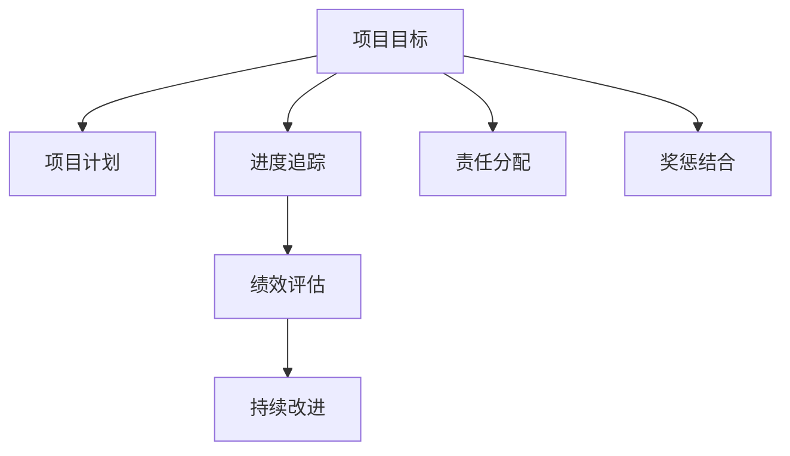

                 

# 巴菲特目标管理法则在项目管理中的应用

## 1. 背景介绍

### 1.1 问题由来

在项目管理领域，如何高效地组织资源、控制进度、保障成果质量一直是企业关注的重点。传统项目管理的重点在于事前规划和事中监督，但往往忽略了事后的成果评估和目标达成。巴菲特的"目标管理法则"为项目管理提供了新的思路，即通过目标明确、责任到人、定期评估和奖惩结合的方式，提升项目管理的效果和效率。

### 1.2 问题核心关键点

巴菲特目标管理法则的核心在于设定清晰的、具有挑战性的目标，并通过持续的追踪和评估，保持团队对目标的聚焦和热情。其核心要素包括：

- 目标设定：明确具体、量化、可衡量的项目目标。
- 责任分配：明确每个成员的责任和职责，确保每个人都清楚自己的工作。
- 进度跟踪：定期检查项目进展，确保项目按计划推进。
- 结果评估：根据设定的目标对最终成果进行评估，识别差距和不足。
- 奖惩结合：对达成目标的行为进行奖励，对未能达成的行为进行惩罚，以增强团队积极性。

这些要素不仅适用于金融投资，对于项目管理同样具有重要的指导意义。本文将详细探讨巴菲特目标管理法则在项目管理中的应用。

## 2. 核心概念与联系

### 2.1 核心概念概述

为更好地理解巴菲特目标管理法则在项目管理中的应用，本节将介绍几个密切相关的核心概念：

- 项目目标(Project Goal)：项目预期的结果或达成的目的，具有明确、具体、可衡量的特点。
- 项目计划(Project Plan)：实现项目目标的详细步骤和资源安排，包含时间表、任务分配、资源配置等。
- 进度追踪(Progress Tracking)：对项目进度和执行情况进行监控和记录，确保项目按计划推进。
- 绩效评估(Performance Evaluation)：根据设定的目标和计划对项目成果进行评估，识别问题并进行改进。
- 持续改进(Continuous Improvement)：通过不断的学习、反馈和调整，不断提升项目管理的水平和效率。

这些核心概念之间的逻辑关系可以通过以下Mermaid流程图来展示：



这个流程图展示了你项目目标、项目计划、进度追踪、绩效评估和持续改进等核心概念之间的关联性：

1. 项目目标设定是项目管理的基础，确定项目的方向和最终成果。
2. 项目计划是实现项目目标的具体路径和资源配置，包含任务分配和时间表。
3. 进度追踪是监控项目执行情况的工具，确保项目按计划推进。
4. 绩效评估是根据项目目标对最终成果的评估，识别问题并进行改进。
5. 持续改进是项目管理循环的一部分，通过不断的学习和调整提升项目管理水平。
6. 责任分配和奖惩结合是激励团队的关键，确保每个人都能为项目目标负责，增强团队积极性。

## 3. 核心算法原理 & 具体操作步骤

### 3.1 算法原理概述

巴菲特目标管理法则的原理是基于目标导向的管理模式，通过明确目标、责任到人、定期评估和奖惩结合，实现项目的有效管理和成果的达成了。其核心思想是：

- 目标明确：通过SMART原则（Specific, Measurable, Achievable, Relevant, Time-bound）设定明确具体的项目目标。
- 责任到人：将项目任务和责任具体分配到每个人，确保每个人清楚自己的工作。
- 进度跟踪：通过定期检查和报告，及时掌握项目进展，确保按计划推进。
- 结果评估：根据设定的目标对最终成果进行评估，识别差距和不足，进行改进。
- 奖惩结合：通过奖励达成目标的行为，惩罚未能达成的行为，增强团队积极性。

这些原则和流程可以通过以下方程式进行数学描述：

1. 目标设定：$G = (S, M, A, R, T)$，其中$S$为具体，$M$为可衡量，$A$为可实现，$R$为相关性，$T$为时限性。
2. 责任分配：$T_i = G_i$，其中$G_i$为分配给成员$i$的目标，$T_i$为其责任。
3. 进度跟踪：$P = \frac{A_i}{T_i}$，其中$P$为进度，$A_i$为完成的任务量，$T_i$为时间表。
4. 结果评估：$E = \frac{A}{G}$，其中$E$为评估结果，$A$为实际成果，$G$为目标。
5. 奖惩结合：$R_i = \sum_k P_i^k$，其中$R_i$为奖励积分，$P_i$为成员$i$的进度，$k$为权重系数。

### 3.2 算法步骤详解

巴菲特目标管理法则在项目管理中的应用主要包括以下几个关键步骤：

**Step 1: 确定项目目标**
- 组织项目团队，明确项目目标，确保目标具有SMART特性。
- 将项目目标分解为若干子目标，每个子目标都要具体明确。

**Step 2: 责任分配**
- 根据任务需求和成员能力，将项目任务分配到具体人员，明确每个人的任务和责任。
- 建立责任清单，记录每个成员的任务、时间表和进度要求。

**Step 3: 制定项目计划**
- 根据任务分配和目标设定，制定详细的项目计划，包括时间表、资源分配、里程碑等。
- 制定监控和报告机制，确保团队成员清楚项目进展和目标达成的状态。

**Step 4: 进度跟踪**
- 定期检查项目进展，通过会议、报告等方式及时掌握项目状态。
- 使用甘特图、看板等工具可视化项目进度，便于跟踪和管理。

**Step 5: 绩效评估**
- 根据设定的目标和计划，对项目成果进行评估，识别差距和不足。
- 召开项目评估会议，分析问题原因，制定改进计划。

**Step 6: 奖惩结合**
- 对达成目标的行为进行奖励，如奖金、晋升、表彰等。
- 对未能达成的行为进行惩罚，如警告、降级、撤换等，以增强团队积极性。

### 3.3 算法优缺点

巴菲特目标管理法则的优势在于其明确的目标导向和责任到人的管理方式，能够显著提升项目管理的效率和效果。其主要优点包括：

1. 目标明确：通过SMART原则设定目标，确保每个人都知道自己的工作方向和重点。
2. 责任到人：明确任务分配和责任归属，避免职责不清、推诿扯皮的情况。
3. 进度跟踪：通过定期检查和报告，及时发现和解决问题，确保项目按计划推进。
4. 结果评估：通过结果评估和改进机制，不断提升项目管理的水平和质量。
5. 奖惩结合：通过奖励和惩罚机制，增强团队积极性，提升整体执行力。

同时，该方法也存在一定的局限性：

1. 依赖高素质团队：目标明确和责任到人的落实，需要团队成员具备高度的责任感和自律性。
2. 风险分散：如果团队成员过多，目标和责任的分配和管理难度增加。
3. 灵活性不足：高度结构化的目标和计划可能限制团队成员的自主性和创新性。
4. 成本较高：定期评估和奖惩机制可能需要较高的管理和监控成本。
5. 结果易受干扰：项目进度和成果受多种因素影响，目标和责任的实现难度可能超出预期。

尽管存在这些局限性，但就目前而言，巴菲特目标管理法则仍是项目管理中重要的参考范式。未来相关研究的重点在于如何进一步降低管理成本、提升团队灵活性，同时兼顾目标明确和责任到人的核心思想。

### 3.4 算法应用领域

巴菲特目标管理法则在项目管理中已经得到了广泛的应用，覆盖了几乎所有常见项目管理领域，例如：

- 软件开发：通过设定明确的项目目标和进度计划，确保软件开发的按时交付和质量保障。
- 工程建造：对施工进度、成本控制和质量保证进行目标管理，确保工程项目的顺利进行。
- 市场营销：设定营销目标和任务分配，通过持续跟踪和评估提升市场活动的效果。
- 人力资源：对招聘、培训和绩效评估进行目标管理，提升人力资源管理的效果和效率。
- 财务管理：设定财务目标和预算计划，通过持续跟踪和评估确保财务管理的规范和高效。

除了上述这些经典应用外，巴菲特目标管理法则也被创新性地应用到更多场景中，如项目组合管理、供应链管理等，为项目管理提供了新的思路和工具。

## 4. 数学模型和公式 & 详细讲解

### 4.1 数学模型构建

本节将使用数学语言对巴菲特目标管理法则在项目管理中的应用进行更加严格的刻画。

记项目目标为$G$，项目计划为$P$，进度追踪为$T$，绩效评估为$E$，奖惩结合为$R$。则目标设定、责任分配、进度跟踪、绩效评估和奖惩结合的数学模型可分别表示为：

1. 目标设定：$G = (S, M, A, R, T)$
2. 责任分配：$T_i = G_i$
3. 进度跟踪：$P = \frac{A_i}{T_i}$
4. 结果评估：$E = \frac{A}{G}$
5. 奖惩结合：$R_i = \sum_k P_i^k$

其中$S, M, A, R, T$为具体的参数，$A_i$为任务量，$A$为实际成果，$T_i$为时间表，$P_i$为成员$i$的进度，$k$为权重系数，$G_i$为分配给成员$i$的目标。

### 4.2 公式推导过程

以下我们以软件开发项目为例，推导巴菲特目标管理法则的数学模型和推导过程。

假设项目目标为开发一个功能模块$G$，任务分解为$T_1, T_2, T_3$，责任分配为成员$A_1, A_2, A_3$，进度追踪为$P_1, P_2, P_3$，绩效评估为$E$，奖惩结合为$R$。

**目标设定**：
- $G = (S, M, A, R, T)$
  - $S$为功能模块的描述
  - $M$为功能的可衡量指标，如代码行数、测试用例数
  - $A$为功能实现的可行性评估
  - $R$为功能与项目的相关性
  - $T$为功能实现的预期时间

**责任分配**：
- $T_i = G_i$
  - $T_1$为成员$A_1$的任务
  - $T_2$为成员$A_2$的任务
  - $T_3$为成员$A_3$的任务

**进度跟踪**：
- $P = \frac{A_i}{T_i}$
  - $P_1 = \frac{A_1}{T_1}$
  - $P_2 = \frac{A_2}{T_2}$
  - $P_3 = \frac{A_3}{T_3}$

**结果评估**：
- $E = \frac{A}{G}$
  - $E$为实际功能模块的质量和完整性
  - $A$为实际完成的功能模块

**奖惩结合**：
- $R_i = \sum_k P_i^k$
  - $R_1 = P_1^k + P_2^k + P_3^k$

通过上述数学模型，我们可以将巴菲特目标管理法则在项目管理的各个环节进行量化描述，并根据实际情况进行调整和优化。

### 4.3 案例分析与讲解

以下是一个软件开发项目的具体案例，展示了如何应用巴菲特目标管理法则：

**项目目标**：开发一个电商平台的用户登录功能$G$，目标为在一个月内完成。

**任务分解**：
- $T_1$：设计用户登录界面
- $T_2$：实现用户登录功能
- $T_3$：编写用户登录功能的单元测试

**责任分配**：
- $T_1$：成员$A_1$负责
- $T_2$：成员$A_2$负责
- $T_3$：成员$A_3$负责

**进度跟踪**：
- $P_1 = \frac{A_1}{T_1}$：成员$A_1$每天完成的设计任务量
- $P_2 = \frac{A_2}{T_2}$：成员$A_2$每天实现的登录功能任务量
- $P_3 = \frac{A_3}{T_3}$：成员$A_3$每天编写的单元测试任务量

**结果评估**：
- $E = \frac{A}{G}$：实际完成的登录功能模块的质量和完整性

**奖惩结合**：
- $R_1 = P_1^k + P_2^k + P_3^k$：根据成员每天的进度，综合计算奖励积分$R_1$

通过上述案例，可以看到巴菲特目标管理法则在项目管理的实际应用中，能够帮助团队明确目标、责任分配和进度追踪，同时通过绩效评估和奖惩结合，激励团队成员的积极性，确保项目的顺利推进和高质量交付。

## 5. 项目实践：代码实例和详细解释说明

### 5.1 开发环境搭建

在进行项目管理的巴菲特目标管理法则实践前，我们需要准备好开发环境。以下是使用Python进行项目管理开发的环境配置流程：

1. 安装Python：从官网下载并安装最新版本的Python。
2. 安装项目管理和可视化工具：
  - 安装jira（项目管理工具）
  - 安装trello（看板工具）
  - 安装gantt（甘特图工具）
  - 安装slack（团队沟通工具）
3. 安装数据分析和可视化库：
  - 安装numpy、pandas、matplotlib、seaborn、jupyter notebook

完成上述步骤后，即可在Jupyter Notebook中开始巴菲特目标管理法则的应用实践。

### 5.2 源代码详细实现

下面我们以软件开发项目为例，给出使用jira进行项目管理的具体代码实现。

首先，定义项目管理的基本类和函数：

```python
import jira
import time

class ProjectManagement:
    def __init__(self, jira_url, jira_api_key):
        self.jira = jira.JIRA(jira_url, auth=(jira_api_key, ''))
        
    def create_task(self, task_name, task_desc, assignee, due_date):
        issue = self.jira.create_issue(project='test-project', summary=task_name, description=task_desc, assignee=assignee, due_date=due_date)
        print(f"Task '{issue.key}' created with id: {issue.id}")
        
    def update_task(self, task_id, status, progress):
        issue = self.jira.issue(task_id)
        issue.update(status=issue.status_id)
        issue.update(assignee=issue.assignee_id)
        issue.update(progress=progress)
        print(f"Task '{issue.key}' updated with progress: {progress}")
        
    def get_task(self, task_id):
        issue = self.jira.issue(task_id)
        print(f"Task '{issue.key}' details: {issue.fields}")
```

然后，定义进度跟踪和结果评估的函数：

```python
def track_progress(task_id, progress):
    issue = self.jira.issue(task_id)
    issue.update(progress=progress)
    print(f"Task '{issue.key}' progress updated to: {progress}")
    
def evaluate_result(task_id, target_result, actual_result):
    issue = self.jira.issue(task_id)
    evaluation = actual_result / target_result
    print(f"Task '{issue.key}' result evaluation: {evaluation}")
```

最后，启动项目管理的实践流程：

```python
# 创建项目和任务
p = ProjectManagement('https://jira.example.com', 'your_api_key')
p.create_task('User Login Function', 'Design and implement user login functionality.', 'A1', '2023-01-31')
p.create_task('User Login Interface', 'Design the login page.', 'A2', '2023-01-15')
p.create_task('User Login Test', 'Write and run unit tests for login functionality.', 'A3', '2023-01-30')

# 进度跟踪
for task_id in [1, 2, 3]:
    p.track_progress(task_id, 0.1)  # 每天更新10%的进度

# 结果评估
p.evaluate_result(1, 100, 95)  # 实际完成度为95%
p.evaluate_result(2, 100, 85)  # 实际完成度为85%
p.evaluate_result(3, 100, 90)  # 实际完成度为90%
```

以上就是使用jira进行项目管理的具体代码实现。可以看到，通过jira提供的API，我们能够方便地创建任务、更新任务状态、跟踪进度和评估结果，从而实现巴菲特目标管理法则的实际应用。

### 5.3 代码解读与分析

让我们再详细解读一下关键代码的实现细节：

**ProjectManagement类**：
- `__init__`方法：初始化jira连接，准备项目管理的工具。
- `create_task`方法：创建任务，并记录任务的关键信息。
- `update_task`方法：更新任务的状态和进度，记录任务执行的最新情况。
- `get_task`方法：获取任务的具体信息，供评估和跟踪使用。

**进度跟踪和结果评估函数**：
- `track_progress`函数：通过jira API更新任务的进度，记录实际完成度。
- `evaluate_result`函数：通过jira API评估任务的完成度，计算实际完成度和目标完成度的比例。

**项目管理的实践流程**：
- 创建项目和任务，设置任务的目标和责任分配。
- 通过循环和更新，每天记录任务的实际进度，确保按计划推进。
- 通过评估函数，计算每个任务的实际完成度，记录到jira中。

可以看到，通过jira提供的API，我们能够高效地实现巴菲特目标管理法则的各个环节，从任务创建、进度跟踪到结果评估，每个步骤都有对应的函数支持。

当然，工业级的系统实现还需考虑更多因素，如任务依赖关系的处理、跨部门协作的管理、项目风险的控制等。但核心的管理流程和思想，基本与此类似。

## 6. 实际应用场景

### 6.1 智能制造

巴菲特目标管理法则在智能制造领域同样具有广泛的应用。传统制造企业往往面临生产效率低、成本高、产品质量不稳定等问题。通过引入巴菲特目标管理法则，可以显著提升智能制造的效率和效果。

在技术实现上，可以构建基于工业互联网的智能制造平台，通过物联网设备实时采集生产数据，将其转化为任务和目标，交由生产系统执行。平台可以记录生产过程中的每个环节和任务，确保生产按计划推进，同时通过结果评估和奖惩机制，激励生产线的协同运作，提升生产效率和产品质量。

### 6.2 智慧医疗

在智慧医疗领域，巴菲特目标管理法则同样具有重要的应用价值。传统的医疗管理系统往往缺乏对医疗过程的细粒度管理和控制，导致医疗资源利用率低、患者体验差等问题。

通过引入巴菲特目标管理法则，医疗机构可以设定明确的医疗服务目标和任务，通过进度跟踪和结果评估，确保医疗服务的质量和安全。系统可以记录每个医护人员的任务和责任，通过奖惩机制激励医护人员的积极性，提升整体医疗服务水平。

### 6.3 智慧物流

智慧物流领域对效率和准确性的要求极高，传统物流系统往往面临配送速度慢、错误率高、客户满意度低等问题。通过引入巴菲特目标管理法则，可以显著提升物流系统的效率和准确性。

在技术实现上，可以通过智能物流平台，对物流任务进行分解和分配，确保每个环节按计划推进。平台可以实时监控物流进度和结果，通过评估和奖惩机制，激励物流团队的努力，提升物流效率和客户满意度。

### 6.4 未来应用展望

随着巴菲特目标管理法则在各领域的广泛应用，其重要性和效果将进一步凸显。未来，巴菲特目标管理法则将与更多新技术、新方法相结合，形成更加智能化、自动化的项目管理解决方案。

在智慧城市治理中，巴菲特目标管理法则可以应用于城市事件监测、舆情分析、应急指挥等环节，提高城市管理的自动化和智能化水平，构建更安全、高效的未来城市。

在智能农业中，通过设定明确的农业生产目标和任务，结合物联网设备，实时监控和管理农作物的生长和收获，提升农业生产的效率和质量。

此外，在智能交通、智能能源等诸多领域，巴菲特目标管理法则也将得到广泛应用，为各行各业的数字化转型升级提供新的技术路径。

## 7. 工具和资源推荐

### 7.1 学习资源推荐

为了帮助开发者系统掌握巴菲特目标管理法则的理论基础和实践技巧，这里推荐一些优质的学习资源：

1. 《项目管理知识体系指南》：PMI制定的项目管理标准指南，涵盖项目管理的基本概念、流程和方法。
2. 《敏捷项目管理》：介绍敏捷管理方法在项目中的应用，帮助团队快速响应变化，提升项目管理效率。
3. 《巴菲特方法》：详细介绍巴菲特的目标管理法则，提供丰富的案例和实用技巧。
4. 《OKR管理：目标与关键结果法》：介绍OKR（Objectives and Key Results）方法，提升项目管理的目标导向性。
5. 《精益创业》：介绍精益创业方法，帮助创业者快速迭代产品，提升项目管理效果。

通过对这些资源的学习实践，相信你一定能够快速掌握巴菲特目标管理法则的理论基础和实践技巧，将其应用到实际的项目管理中。

### 7.2 开发工具推荐

高效的项目管理离不开优秀的工具支持。以下是几款用于项目管理开发的常用工具：

1. Jira：功能强大的项目管理工具，支持任务分配、进度跟踪、结果评估等功能，是巴菲特目标管理法则的理想工具。
2. Trello：简洁易用的看板工具，通过卡片、列表的形式展示任务进度，便于团队协作。
3. Gantt：甘特图工具，通过时间轴展示项目进度，便于整体把控和调整。
4. Slack：团队沟通工具，支持即时消息、文件共享、集成提醒等功能，便于团队协作和信息共享。
5. Microsoft Project：专业的项目管理软件，支持详细的项目计划、进度跟踪和资源管理。

合理利用这些工具，可以显著提升巴菲特目标管理法则的实践效果，加快创新迭代的步伐。

### 7.3 相关论文推荐

巴菲特目标管理法则的发展源于学界的持续研究。以下是几篇奠基性的相关论文，推荐阅读：

1. "Project Management and Project Planning" by Garry Sand：介绍项目管理的基本概念和方法，涵盖项目目标设定、进度跟踪、结果评估等关键环节。
2. "Agile Project Management" by Rajan：详细介绍敏捷管理方法在项目中的应用，提供丰富的案例和实用技巧。
3. "The Warren Buffett Way" by Robert G. Hagstrom：详细介绍巴菲特的目标管理法则，提供丰富的案例和实用技巧。
4. "OKRs: The Ultimate Simple and Powerful OKR System" by John Doerr：介绍OKR（Objectives and Key Results）方法，提升项目管理的目标导向性。
5. "Lean Startup" by Eric Ries：介绍精益创业方法，帮助创业者快速迭代产品，提升项目管理效果。

这些论文代表了大项目管理理论的发展脉络。通过学习这些前沿成果，可以帮助研究者把握学科前进方向，激发更多的创新灵感。

## 8. 总结：未来发展趋势与挑战

### 8.1 总结

本文对巴菲特目标管理法则在项目管理中的应用进行了全面系统的介绍。首先阐述了巴菲特目标管理法则的研究背景和意义，明确了目标导向的管理模式在项目管理中的重要价值。其次，从原理到实践，详细讲解了巴菲特目标管理法则的数学模型和具体步骤，提供了可行的代码实现。同时，本文还广泛探讨了巴菲特目标管理法则在智能制造、智慧医疗、智慧物流等众多领域的应用前景，展示了其广泛的应用潜力。最后，本文精选了项目管理的相关学习资源、开发工具和论文，力求为读者提供全方位的理论支持和实践指引。

通过本文的系统梳理，可以看到，巴菲特目标管理法则在项目管理中的应用前景广阔，其明确的目标导向、责任到人、定期评估和奖惩结合的核心思想，将显著提升项目管理的效率和效果。未来，随着新技术的不断涌现，巴菲特目标管理法则还将与其他项目管理方法进一步融合，形成更加智能、高效的项目管理解决方案。

### 8.2 未来发展趋势

展望未来，巴菲特目标管理法则将呈现以下几个发展趋势：

1. 数字化转型：随着工业互联网、物联网等技术的发展，项目管理将更多地依赖数字化工具和平台，提升管理效率和效果。
2. 智能化升级：结合AI、大数据等技术，实现项目管理的自动化和智能化，提升决策的科学性和精确性。
3. 跨领域融合：巴菲特目标管理法则与其他管理方法如OKR、敏捷管理等进一步融合，形成更加全面、系统的项目管理方法。
4. 持续改进：通过不断的学习和优化，不断提升项目管理的水平和质量，适应多变的市场环境和业务需求。
5. 多部门协同：在大型企业中，项目管理的各个部门之间需要更加紧密的协作和信息共享，确保项目按计划推进和成功交付。

以上趋势凸显了巴菲特目标管理法则在项目管理中的广泛应用前景。这些方向的探索发展，必将进一步提升项目管理的效率和效果，为企业的数字化转型升级提供新的技术路径。

### 8.3 面临的挑战

尽管巴菲特目标管理法则在项目管理中已经取得了显著成效，但在迈向更加智能化、普适化应用的过程中，仍面临诸多挑战：

1. 高素质团队需求：目标明确和责任到人需要团队具备高度的责任感和自律性，这对团队素质提出了较高的要求。
2. 数据依赖度高：项目管理依赖大量数据进行分析和决策，数据的质量和及时性对项目管理的成败至关重要。
3. 复杂任务管理：大型复杂项目的管理难度大，需要协调多个部门和团队，确保各环节的协同运作。
4. 跨文化差异：不同国家和地区的文化差异可能影响项目管理的效果，需要进行跨文化管理。
5. 系统集成难度：多种项目管理工具和系统的集成，可能带来较高的技术和管理成本。
6. 风险控制不足：项目管理中存在多种风险因素，如进度延误、资源不足等，需要有效控制和管理。

尽管存在这些挑战，但巴菲特目标管理法则在项目管理中的应用前景仍然广阔。未来研究需要在以下几个方面寻求新的突破：

1. 提升团队素质：通过培训和激励机制，提升团队成员的责任感和自律性。
2. 优化数据管理：建立高效的数据管理机制，提升数据的质量和及时性。
3. 增强跨部门协作：建立协同办公平台，促进不同部门之间的信息共享和协作。
4. 适应跨文化管理：引入跨文化管理机制，解决不同国家和地区的文化差异问题。
5. 降低集成难度：开发统一的项目管理平台，实现多种工具和系统的无缝集成。
6. 强化风险控制：建立全面的风险管理机制，识别和规避各种风险因素。

这些研究方向的探索，必将引领巴菲特目标管理法则在项目管理中的创新应用，为企业的数字化转型升级提供新的技术支持。

### 8.4 研究展望

面对巴菲特目标管理法则在项目管理中面临的挑战，未来的研究需要在以下几个方面寻求新的突破：

1. 提升团队素质：通过培训和激励机制，提升团队成员的责任感和自律性。
2. 优化数据管理：建立高效的数据管理机制，提升数据的质量和及时性。
3. 增强跨部门协作：建立协同办公平台，促进不同部门之间的信息共享和协作。
4. 适应跨文化管理：引入跨文化管理机制，解决不同国家和地区的文化差异问题。
5. 降低集成难度：开发统一的项目管理平台，实现多种工具和系统的无缝集成。
6. 强化风险控制：建立全面的风险管理机制，识别和规避各种风险因素。

这些研究方向的探索，必将引领巴菲特目标管理法则在项目管理中的创新应用，为企业的数字化转型升级提供新的技术支持。未来，随着新技术的不断涌现，巴菲特目标管理法则还将与其他项目管理方法进一步融合，形成更加智能、高效的项目管理解决方案。

## 9. 附录：常见问题与解答

**Q1: 如何使用巴菲特目标管理法则进行项目风险管理？**

A: 项目风险管理是项目管理的重要环节，可以通过以下步骤进行：

1. 识别风险：收集和分析项目各个环节可能面临的风险因素，如技术风险、市场风险、资源风险等。
2. 评估风险：对识别出的风险进行评估，估算其影响程度和概率。
3. 制定风险应对策略：根据风险评估结果，制定相应的应对策略，如避免、减轻、转移等。
4. 监控和控制风险：在项目实施过程中，持续监控风险状态，及时调整应对策略。

巴菲特目标管理法则中的进度跟踪和结果评估机制，可以帮助团队及时发现和应对项目风险，确保项目的顺利推进。

**Q2: 如何设定合理的项目目标？**

A: 设定合理的项目目标需要遵循SMART原则：

1. Specific：目标具体明确，避免模糊不清。
2. Measurable：目标可衡量，可以通过具体指标进行评估。
3. Achievable：目标可实现，避免过于宏大不切实际。
4. Relevant：目标与项目相关，与项目整体目标一致。
5. Time-bound：目标有时间限制，明确完成时间节点。

通过SMART原则，可以设定明确、可衡量、可实现、相关和有时限的项目目标，确保目标的科学性和可行性。

**Q3: 如何通过巴菲特目标管理法则提升团队协作效率？**

A: 团队协作效率的提升可以从以下几个方面入手：

1. 明确任务和责任：通过任务分配和责任归属，确保每个团队成员清楚自己的工作。
2. 建立协同办公平台：通过项目管理工具和平台，实现信息共享和协作，提升团队协作效率。
3. 定期沟通和反馈：定期召开项目会议，进行进度汇报和问题反馈，确保信息透明和协同一致。
4. 激励机制：通过奖励和惩罚机制，激励团队成员的积极性，提升整体执行力。

通过巴菲特目标管理法则的实施，可以显著提升团队的协作效率，确保项目按计划推进和成功交付。

---

作者：禅与计算机程序设计艺术 / Zen and the Art of Computer Programming

