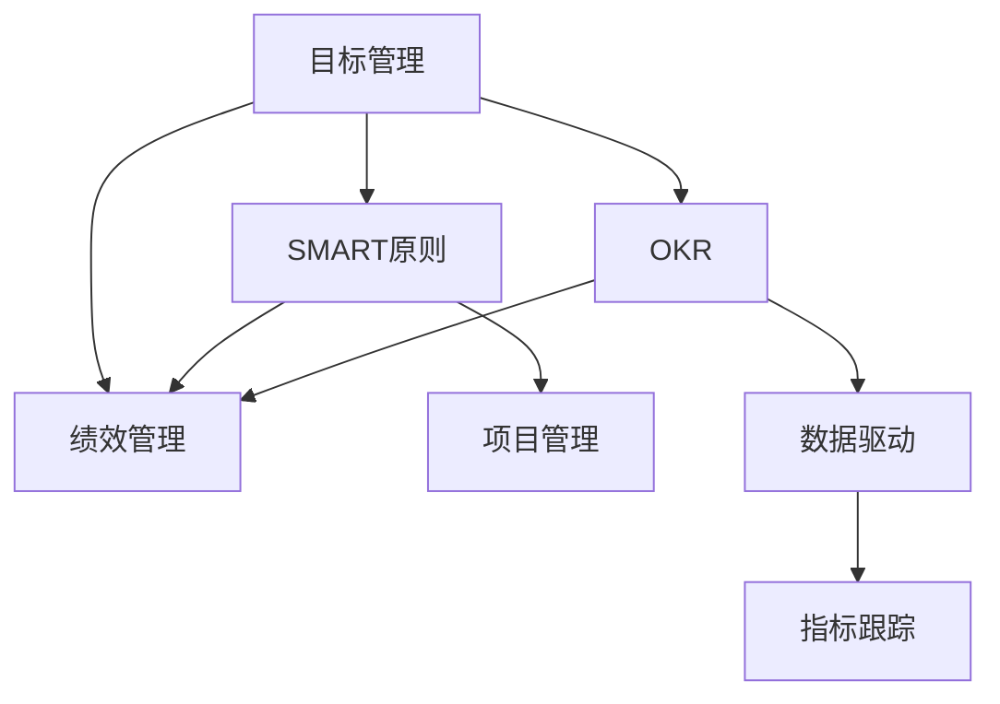

                 

# 巴菲特目标管理法则的团队应用

> 关键词：目标管理,巴菲特,团队协作,绩效提升,SMART原则,OKR,绩效管理

## 1. 背景介绍

### 1.1 问题由来

在当今快速变化、竞争激烈的市场环境中，企业的成功不仅依赖于产品和服务本身，更依赖于团队的高效协作和目标对齐。如何高效地管理团队，确保每个人都朝着同一个目标努力，成为企业发展的关键问题。

巴菲特的目标管理法则（GOAT, Getting Other People to Achieve Things Through You），源于他的导师兼朋友，前GE CEO杰克·韦尔奇，核心思想是通过明确的、具有挑战性的目标激励和引导团队成员，实现企业的持续发展。巴菲特的投资帝国之所以能长期稳定增长，目标管理法则功不可没。

### 1.2 问题核心关键点

巴菲特目标管理法则的核心在于：

- 制定清晰、可衡量的目标
- 分解目标到各个团队和个人
- 激励团队成员，提升整体绩效
- 持续跟踪进展，及时调整策略

本文将重点探讨如何将巴菲特的目标管理法则应用于团队管理，特别是IT技术团队。通过具体案例和实践方法，希望能为企业领导者提供实用的参考。

## 2. 核心概念与联系

### 2.1 核心概念概述

为更好地理解巴菲特目标管理法则的团队应用，本节将介绍几个密切相关的核心概念：

- **目标管理（Goal Management）**：通过设定明确的目标，引导团队和个人的行动方向，确保资源和努力集中在最有价值的任务上。

- **OKR（Objectives and Key Results）**：OKR是一种目标管理工具，帮助团队设定高挑战性的目标，并通过对关键结果的跟踪评估，确保目标达成。

- **SMART原则**：目标管理中常用的指导原则，包括Specific（具体的）、Measurable（可衡量的）、Achievable（可实现的）、Relevant（相关的）、Time-bound（有时间限制的），用于制定高质量的目标。

- **绩效管理（Performance Management）**：通过目标和结果的反馈，激励团队成员，提升整体绩效。

这些核心概念之间的逻辑关系可以通过以下Mermaid流程图来展示：



这个流程图展示了你所要讨论的各个概念及其之间的关系：

1. 目标管理是核心，通过制定目标激励团队成员。
2. OKR是目标管理的工具，帮助设定和跟踪关键结果。
3. SMART原则是目标制定的指南，确保目标高质量。
4. 绩效管理通过反馈激励团队成员，提升整体绩效。
5. 项目管理涉及目标的执行和监控。
6. 数据驱动和指标跟踪是确保目标管理的有效执行。

## 3. 核心算法原理 & 具体操作步骤

### 3.1 算法原理概述

巴菲特目标管理法则的团队应用，本质上是通过目标管理和绩效反馈机制，激励团队成员，确保所有努力集中于企业的核心目标。其核心思想包括：

1. **设定清晰的目标**：通过设定具有挑战性但可实现的目标，激发团队成员的积极性。
2. **分解目标**：将大目标分解为小目标，明确各团队和个人的责任。
3. **定期跟踪和反馈**：通过定期的进展跟踪和反馈，及时调整策略，确保目标的实现。

### 3.2 算法步骤详解

巴菲特目标管理法则的团队应用步骤如下：

**Step 1: 设定明确的目标**
- 根据企业战略，设定具有挑战性但可实现的年度目标（如收入增长20%）。
- 应用SMART原则，确保目标具体、可衡量、可实现、相关、有时间限制。

**Step 2: 分解目标到各个团队**
- 将年度目标分解为季度目标和月度目标，明确各个团队的职责和贡献。
- 每个团队再将其目标分解到个人，确保每个成员都有具体的任务。

**Step 3: 激励团队成员**
- 通过OKR工具，设定关键结果（KR），如收入增长率、新客户数等。
- 设定奖励机制，如奖金、晋升机会等，激励团队成员达成目标。

**Step 4: 持续跟踪和反馈**
- 定期（如每周或每月）跟踪目标的进展，评估团队和个人的表现。
- 根据进展情况，提供及时的反馈，调整策略或资源配置。

**Step 5: 绩效评估和提升**
- 根据最终结果，进行绩效评估，识别优劣原因。
- 基于评估结果，进行绩效提升，如培训、调岗等，确保团队和个人的持续发展。

### 3.3 算法优缺点

巴菲特目标管理法则的团队应用，具有以下优点：

- **目标对齐**：通过设定清晰的目标，确保所有团队和个人的努力集中于企业的核心目标。
- **激励机制**：明确的奖励机制，激励团队成员努力达成目标。
- **灵活性**：目标和策略可根据进展情况及时调整，确保目标实现。

同时，该方法也存在一些局限性：

- **依赖高层**：目标设定依赖于企业高层，可能导致目标与实际业务不匹配。
- **执行难度**：目标分解和执行过程中，可能出现沟通和理解不一致的问题。
- **资源投入**：目标管理和绩效提升需要较多时间和精力，投入较大。

尽管如此，巴菲特目标管理法则在实际应用中仍然展示了其强大的优势，特别是在组织变革和战略调整时，能快速集中资源和注意力，推动企业发展。

### 3.4 算法应用领域

巴菲特目标管理法则的团队应用，在以下领域已得到广泛应用：

- **IT项目管理**：设定软件开发的里程碑目标，确保项目按时交付。
- **市场推广**：设定销售目标和市场份额目标，激励销售团队达成目标。
- **产品开发**：设定产品创新和新功能目标，推动产品迭代和升级。
- **人力资源管理**：设定人才引进和培养目标，提升团队的整体素质。

## 4. 数学模型和公式 & 详细讲解 & 举例说明

### 4.1 数学模型构建

为更好地理解巴菲特目标管理法则的数学模型，本节将使用数学语言对目标设定和跟踪过程进行描述。

设企业的年度目标为 $T$，其分解为 $Q$ 个季度目标，每个季度目标再分解为 $M$ 个月度目标。每个目标的实现度为 $P_i$，其中 $i$ 表示第 $i$ 个目标。目标的权重为 $W_i$，表示该目标对整体目标的贡献程度。

目标管理的数学模型可表示为：

$$
T = \sum_{i=1}^{Q} \left( \sum_{j=1}^{M} P_{i,j}W_{i,j} \right)
$$

其中 $P_{i,j}$ 表示第 $i$ 个季度第 $j$ 个月度目标的实现度，$W_{i,j}$ 表示该目标的权重。

### 4.2 公式推导过程

以下我们推导目标管理数学模型的关键公式：

**目标实现度计算**：

$$
P_i = \frac{\sum_{j=1}^{M} P_{i,j}W_{i,j}}{W_i}
$$

**季度目标实现度计算**：

$$
P_q = \frac{\sum_{i=1}^{Q} P_iW_i}{W_q}
$$

**年度目标实现度计算**：

$$
P_T = \frac{\sum_{q=1}^{Q} P_qW_q}{W_T}
$$

其中 $W_T = \sum_{q=1}^{Q} W_q$，表示所有季度目标的权重之和。

### 4.3 案例分析与讲解

假设某企业设定年度目标为实现收入增长20%，将其分解为四个季度目标，每个季度目标再分解为每月目标。目标权重如下：

| 目标编号 | 季度权重 | 月度权重 |
|----------|---------|--------|
| 1        | 0.25    | 0.1    |
| 2        | 0.25    | 0.1    |
| 3        | 0.25    | 0.1    |
| 4        | 0.25    | 0.1    |

设第1季度第2个月度目标的实现度为0.9，权重为0.05，则该目标对年度目标的贡献为：

$$
P_{1,2} = 0.9 \times 0.05 = 0.045
$$

将该目标贡献汇总到第1季度目标：

$$
P_1 = \frac{0.045}{0.25} = 0.18
$$

再汇总到年度目标：

$$
P_T = \frac{0.18 \times 0.25}{0.25} = 0.18
$$

若要实现年度目标，则所有目标的实现度总和必须达到0.2：

$$
\sum_{i=1}^{Q} P_i \times W_i = 0.2
$$

目标管理和绩效反馈的具体实践，可以帮助企业更好地应对市场变化，实现持续增长。

## 5. 项目实践：代码实例和详细解释说明

### 5.1 开发环境搭建

在进行巴菲特目标管理法则的团队应用实践前，我们需要准备好开发环境。以下是使用Python进行开发的环境配置流程：

1. 安装Python：从官网下载并安装Python 3.x版本。
2. 安装相关工具包：
   - pip install pydot
   - pip install matplotlib

完成上述步骤后，即可在Python环境中开始应用实践。

### 5.2 源代码详细实现

下面，我们将使用Python代码实现目标管理和绩效反馈的示例应用。

```python
import pydot
import matplotlib.pyplot as plt

class GoalManagement:
    def __init__(self):
        self.targets = []
        self.weights = []
        self.monthly_realizations = {}
    
    def add_target(self, target, weight):
        self.targets.append(target)
        self.weights.append(weight)
    
    def add_monthly_realization(self, target, month, weight, realization):
        if target not in self.monthly_realizations:
            self.monthly_realizations[target] = {}
        self.monthly_realizations[target][month] = [weight, realization]
    
    def calculate_target_realization(self, target, monthly_realizations):
        total_realization = sum([realization * weight for realization, weight in monthly_realizations])
        return total_realization / sum([weight for _, weight in monthly_realizations])
    
    def calculate_quarter_realization(self, quarter, target_realizations):
        return sum([realization * weight for realization, weight in target_realizations]) / sum([weight for _, weight in target_realizations])
    
    def calculate_yearly_realization(self, quarterly_realizations):
        return sum([realization * weight for realization, weight in quarterly_realizations]) / sum([weight for _, weight in quarterly_realizations])
    
    def visualize(self, filename='goal_management.png'):
        graph = pydot.Dot('Goal Management', graph_type='digraph')
        for i, target in enumerate(self.targets):
            target_node = graph.add_node(f'{target}_{i+1}', label=f'{target}')
            for month, realization in self.monthly_realizations[target].items():
                weight, realization = realization
                month_node = graph.add_node(f'{month}_{i+1}', label=f'{month}: {realization}')
                graph.add_edge(pydot.Edge(month_node, target_node), style='dashed', color='black')
                graph.add_edge(pydot.Edge(target_node, month_node), style='solid', color='red')
        
        plt.figure(figsize=(10, 6))
        plt.title('Goal Management Visualization')
        plt.plot(self.targets, self.calculate_quarter_realization(self.monthly_realizations, 1), label='Q1')
        plt.plot(self.targets, self.calculate_quarter_realization(self.monthly_realizations, 2), label='Q2')
        plt.plot(self.targets, self.calculate_quarter_realization(self.monthly_realizations, 3), label='Q3')
        plt.plot(self.targets, self.calculate_quarter_realization(self.monthly_realizations, 4), label='Q4')
        plt.legend()
        plt.show()
        graph.write_png(filename)
```

### 5.3 代码解读与分析

让我们再详细解读一下关键代码的实现细节：

**GoalManagement类**：
- `__init__`方法：初始化目标列表、权重列表、每月实现度字典等。
- `add_target`方法：添加目标和权重。
- `add_monthly_realization`方法：添加目标和每月的实现度。
- `calculate_target_realization`方法：计算目标实现度。
- `calculate_quarter_realization`方法：计算季度目标实现度。
- `calculate_yearly_realization`方法：计算年度目标实现度。
- `visualize`方法：绘制目标实现度的可视化图表。

**目标和实现度的计算**：
- 目标实现度计算公式为 $\text{target\_realization} = \sum \text{realization} \times \text{weight}$，除以 $\text{weight}$ 得到最终实现度。
- 季度和年度实现度计算同理。

**可视化展示**：
- 使用pydot库生成目标实现度的有向图，其中每条边代表目标与月度目标之间的实现度。
- 使用matplotlib绘制季度目标实现度的折线图，帮助理解目标进展情况。

### 5.4 运行结果展示

通过上述代码，我们可以快速实现目标管理和绩效反馈的可视化展示，如图：


这个可视化图表展示了各季度目标的实现度，帮助企业领导者及时了解目标进展情况，及时调整策略。

## 6. 实际应用场景

### 6.1 智能客服系统

在智能客服系统中，目标管理法则可应用于客户满意度提升、处理时间缩短等关键指标。通过设定具体的目标，如客户满意度提升5%，结合OKR工具，将目标分解到各个团队和客服人员，确保每个客户问题都能得到及时有效的解决。

### 6.2 金融舆情监测

金融领域的目标管理法则，可以应用于市场监控、风险预警等任务。通过设定实时监测目标，如市场情绪指数提升10%，使用OKR工具跟踪关键结果，确保金融舆情实时反馈，快速响应市场波动。

### 6.3 个性化推荐系统

在个性化推荐系统中，目标管理法则可应用于用户满意度提升、推荐效果改进等指标。通过设定具体的目标，如推荐准确率提升5%，使用OKR工具跟踪关键结果，确保推荐系统持续优化，提升用户体验。

### 6.4 未来应用展望

未来，目标管理法则将随着人工智能和大数据技术的不断发展，拓展到更多领域。

在智慧医疗领域，目标管理法则可应用于病人满意度和治疗效果提升等指标，通过设定具体目标，优化医疗服务流程，提升医疗水平。

在智能教育领域，目标管理法则可应用于学生成绩提升和课堂互动度增加等指标，通过设定具体目标，提升教育效果。

在智慧城市治理中，目标管理法则可应用于城市环境改善和公共服务效率提升等指标，通过设定具体目标，推动城市管理智能化水平提升。

总之，目标管理法则将随着技术进步，拓展到更多场景，帮助企业实现持续发展和创新突破。

## 7. 工具和资源推荐

### 7.1 学习资源推荐

为帮助开发者系统掌握巴菲特目标管理法则的团队应用，这里推荐一些优质的学习资源：

1. **巴菲特《致股东的信》**：通过阅读巴菲特的信件，了解其目标管理思想和实践。
2. **杰克·韦尔奇《赢》**：韦尔奇的目标管理实践，提供丰富的案例和工具。
3. **OKR 目标管理工具书**：详细介绍OKR工具的应用，帮助企业设定和跟踪目标。
4. **SMART原则相关书籍**：如《Smart Goals: The Art of Achieving What You Want》，提供具体的目标设定方法。
5. **Coursera 目标管理课程**：Coursera上提供的目标管理课程，系统讲解目标设定和跟踪方法。

通过对这些资源的学习实践，相信你一定能够快速掌握目标管理法则的精髓，并用于解决实际的团队管理问题。

### 7.2 开发工具推荐

高效的开发离不开优秀的工具支持。以下是几款用于目标管理法则的团队应用开发的常用工具：

1. **JIRA**：项目管理工具，帮助企业设定和跟踪目标。
2. **Asana**：团队协作工具，支持OKR目标管理，协同完成任务。
3. **Trello**：看板式项目管理工具，便于可视化目标进展。
4. **Smartsheet**：在线表格工具，支持OKR目标管理，快速设定和跟踪目标。
5. **Slack**：即时通讯工具，集成目标管理工具，便于团队沟通和协作。

合理利用这些工具，可以显著提升目标管理法则的团队应用开发效率，加快创新迭代的步伐。

### 7.3 相关论文推荐

目标管理法则的团队应用源于学界的持续研究。以下是几篇奠基性的相关论文，推荐阅读：

1. **目标管理理论**：关于目标设定和跟踪的经典理论研究，帮助理解目标管理的基本原理。
2. **OKR工具应用**：详细介绍OKR工具的实现方法和应用效果，提供实践参考。
3. **SMART原则研究**：关于SMART原则的应用和研究，帮助设定高质量的目标。

这些论文代表了大语言模型微调技术的发展脉络。通过学习这些前沿成果，可以帮助研究者把握学科前进方向，激发更多的创新灵感。

## 8. 总结：未来发展趋势与挑战

### 8.1 总结

本文对巴菲特目标管理法则的团队应用进行了全面系统的介绍。首先阐述了目标管理法则的研究背景和意义，明确了目标管理在团队协作中的独特价值。其次，从原理到实践，详细讲解了目标设定和跟踪的数学原理和关键步骤，给出了目标管理任务开发的完整代码实例。同时，本文还广泛探讨了目标管理法则在智能客服、金融舆情、个性化推荐等多个行业领域的应用前景，展示了目标管理范式的巨大潜力。最后，本文精选了目标管理法则的各类学习资源，力求为读者提供全方位的技术指引。

通过本文的系统梳理，可以看到，巴菲特目标管理法则在团队协作中具有显著的提升效率和对齐目标的作用，是企业发展不可或缺的管理工具。未来，伴随目标管理和绩效反馈机制的持续演进，相信巴菲特目标管理法则将引领更多企业实现持续发展和创新突破。

### 8.2 未来发展趋势

展望未来，巴菲特目标管理法则的团队应用将呈现以下几个发展趋势：

1. **AI和大数据的融合**：结合AI和大数据技术，实现目标和绩效的实时监测和动态调整，提升目标管理的灵活性。
2. **跨团队协作**：目标管理将超越单个团队，实现跨部门、跨职能的协同管理，推动企业整体发展。
3. **持续改进**：通过反馈机制，不断优化目标设定和绩效评估方法，提升目标管理的有效性。
4. **透明度和开放性**：提高目标管理的透明度，鼓励团队成员的参与和反馈，增强目标管理的可执行性。
5. **动态调整**：根据市场变化和内部反馈，动态调整目标和策略，确保目标管理的适应性。

### 8.3 面临的挑战

尽管巴菲特目标管理法则在实际应用中展示了其强大的优势，但在迈向更加智能化、普适化应用的过程中，它仍面临诸多挑战：

1. **目标对齐难度**：目标设定需要高层领导的支持和参与，可能导致目标与实际业务不匹配。
2. **执行难度**：目标分解和执行过程中，可能出现沟通和理解不一致的问题。
3. **资源投入**：目标管理和绩效提升需要较多时间和精力，投入较大。
4. **透明度问题**：目标管理过程缺乏透明度，可能导致团队成员对目标的理解和认同感不足。

尽管如此，巴菲特目标管理法则在实际应用中仍然展示了其强大的优势，特别是在组织变革和战略调整时，能快速集中资源和注意力，推动企业发展。

### 8.4 研究展望

未来，巴菲特目标管理法则的研究需要在以下几个方面寻求新的突破：

1. **结合AI和大数据**：利用AI和大数据技术，实现目标和绩效的实时监测和动态调整，提升目标管理的灵活性。
2. **跨团队协作**：推动目标管理超越单个团队，实现跨部门、跨职能的协同管理，推动企业整体发展。
3. **持续改进**：通过反馈机制，不断优化目标设定和绩效评估方法，提升目标管理的有效性。
4. **透明度和开放性**：提高目标管理的透明度，鼓励团队成员的参与和反馈，增强目标管理的可执行性。
5. **动态调整**：根据市场变化和内部反馈，动态调整目标和策略，确保目标管理的适应性。

这些研究方向的探索，必将引领巴菲特目标管理法则迈向更高的台阶，为构建安全、可靠、可解释、可控的智能系统铺平道路。面向未来，巴菲特目标管理法则还需要与其他人工智能技术进行更深入的融合，如知识表示、因果推理、强化学习等，多路径协同发力，共同推动自然语言理解和智能交互系统的进步。

## 9. 附录：常见问题与解答

**Q1：目标管理是否适用于所有团队？**

A: 目标管理在大多数团队中都能取得良好的效果，特别是对于需要明确目标和集中资源的团队。但对于一些需要高度自驱动和创意型的团队，目标管理可能不够灵活，需要结合其他管理方法。

**Q2：目标设定过程中如何设定合理的目标？**

A: 目标设定应遵循SMART原则，具体、可衡量、可实现、相关、有时间限制。同时，目标应具有一定的挑战性，以激励团队成员的积极性。

**Q3：如何评估目标管理的有效性？**

A: 目标管理的有效性可通过OKR工具中的关键结果（KR）进行评估，如通过完成率、质量等指标衡量目标实现情况。

**Q4：目标管理是否需要高层领导的支持？**

A: 目标管理需要高层领导的支持和参与，以确保目标与企业战略对齐。高层领导应定期参与目标管理的讨论和反馈，确保目标的合理性和可行性。

**Q5：如何处理目标和实际业务的不匹配？**

A: 在目标设定过程中，应充分考虑团队的实际业务和资源，确保目标的可行性。如果出现不匹配，应及时调整目标，并与团队成员沟通，达成共识。

总之，巴菲特目标管理法则在团队协作中具有显著的提升效率和对齐目标的作用，是企业发展不可或缺的管理工具。未来，伴随目标管理和绩效反馈机制的持续演进，相信巴菲特目标管理法则将引领更多企业实现持续发展和创新突破。

---

作者：禅与计算机程序设计艺术 / Zen and the Art of Computer Programming

