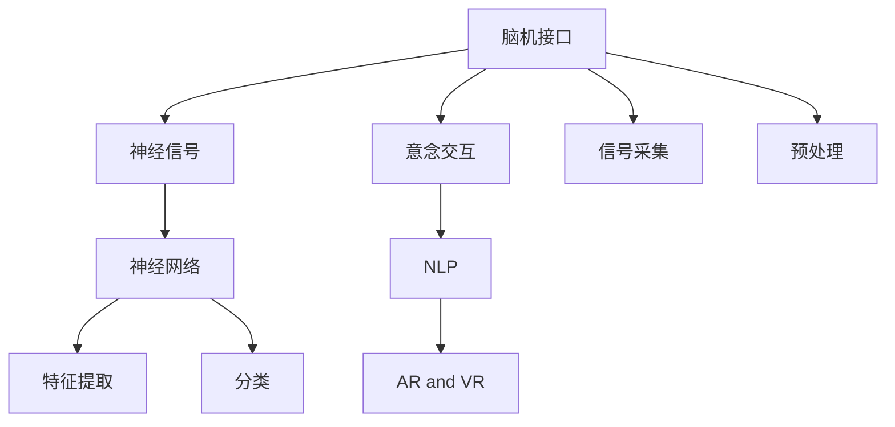

                 

# 2050年的人机交互：从脑机接口到意念交互的人机协同进化

> 关键词：脑机接口,意念交互,神经信号,人机协同,神经网络,自然语言处理(NLP),人工智能,机器人,增强现实(AR),虚拟现实(VR)

## 1. 背景介绍

### 1.1 问题由来

随着人工智能技术的迅猛发展，人机交互的方式也在不断演进。从最初的命令控制，到图形界面，再到语音识别、视觉识别，人机交互的边界不断扩展。然而，这些交互方式依旧依赖于用户通过感官（如视觉、听觉、触觉）与计算机进行交互，存在响应速度慢、交互方式单一等局限。

脑机接口(Brain-Computer Interface, BCI)和意念交互技术则为这一问题提供了解决方案。通过直接读取和解码人脑的神经信号，可以实现更高层次的人机交互，甚至达到“心有灵犀一点通”的效果。这种新的交互方式在医疗、娱乐、军事等领域具有巨大潜力，将成为2050年人机交互的重要方向。

### 1.2 问题核心关键点

脑机接口和意念交互的核心在于如何准确、实时地捕捉并解码人脑信号，并将其转化为机器可理解的指令。其中，神经信号的采集、预处理、特征提取、分类等技术是实现这一目标的关键。此外，如何将意念交互应用于实际场景，提升用户体验和交互效率，也是研究的重点。

## 2. 核心概念与联系

### 2.1 核心概念概述

为更好地理解脑机接口和意念交互技术，本节将介绍几个密切相关的核心概念：

- **脑机接口 (BCI)**：通过读取和解码人脑神经信号，实现人机交互的接口技术。
- **神经信号 (Neural Signals)**：神经细胞之间的电信号传递，是脑机接口技术的主要信号来源。
- **神经网络 (Neural Networks)**：一种模仿人脑神经网络结构的计算模型，广泛用于神经信号的特征提取和分类。
- **意念交互 (Mind Interaction)**：通过解析人的意图，直接将意念转化为计算机指令，实现自然流畅的交互。
- **自然语言处理 (NLP)**：理解和生成人类语言的技术，是人机交互的基础。
- **增强现实 (AR) 和虚拟现实 (VR)**：通过计算机生成的虚拟环境增强现实体验，使意念交互在各种场景中得到应用。

这些核心概念之间的逻辑关系可以通过以下Mermaid流程图来展示：



这个流程图展示了大语言模型的核心概念及其之间的关系：

1. 脑机接口通过信号采集和预处理获取神经信号，利用神经网络进行特征提取和分类。
2. 意念交互依赖于对神经信号的解析，通过自然语言处理技术，将意念转化为计算机指令。
3. 增强现实和虚拟现实为意念交互提供了多样化的应用场景。

## 3. 核心算法原理 & 具体操作步骤
### 3.1 算法原理概述

脑机接口和意念交互的算法原理主要包括以下几个关键步骤：

- **信号采集**：使用脑电图 (EEG)、功能磁共振成像 (fMRI)、脑磁图 (MEG) 等设备采集人脑神经信号。
- **信号预处理**：对采集的信号进行滤波、去噪、归一化等预处理操作，去除噪音和干扰。
- **特征提取**：通过卷积神经网络 (CNN)、长短期记忆网络 (LSTM)、变分自编码器 (VAE) 等神经网络模型，从原始信号中提取有用特征。
- **分类识别**：利用支持向量机 (SVM)、随机森林 (RF)、深度学习模型等对提取的特征进行分类，实现对意念的识别。
- **解码生成**：将分类结果解码为计算机可理解的指令，如控制机械臂、回答问题等。

### 3.2 算法步骤详解

以脑机接口为例，其具体操作步骤可以如下描述：

**Step 1: 信号采集**
- 使用脑电图 (EEG) 或功能磁共振成像 (fMRI) 等设备，对用户的大脑进行非侵入式或侵入式信号采集。

**Step 2: 信号预处理**
- 对采集的信号进行滤波、去噪、归一化等预处理操作，去除噪音和干扰。
- 采用独立成分分析 (ICA) 或主成分分析 (PCA) 对信号进行降维，降低计算复杂度。

**Step 3: 特征提取**
- 利用卷积神经网络 (CNN) 或长短期记忆网络 (LSTM) 等神经网络模型，从信号中提取有用的特征。
- 将提取的特征输入到全连接神经网络或深度神经网络中进行分类。

**Step 4: 分类识别**
- 使用支持向量机 (SVM)、随机森林 (RF) 或深度学习模型等，对提取的特征进行分类，实现对意念的识别。
- 利用交叉验证等方法进行模型训练和评估。

**Step 5: 解码生成**
- 将分类结果解码为计算机可理解的指令，如控制机械臂、回答问题等。
- 使用自然语言处理 (NLP) 技术，将指令转化为自然语言输出，实现更自然的人机交互。

### 3.3 算法优缺点

脑机接口和意念交互技术具有以下优点：

1. **交互高效**：直接读取和解码人脑信号，响应速度快，交互方式多样。
2. **无障碍交互**：对于身体不便或残障人士，这种交互方式可以弥补传统感官交互的不足。
3. **隐私性强**：通过非侵入式方式采集信号，不会泄露用户隐私。
4. **广泛应用**：可以在医疗、军事、娱乐等领域实现多种应用场景。

然而，这些技术也存在一些缺点：

1. **精度问题**：神经信号的采集和解码过程存在一定误差，影响系统的稳定性和可靠性。
2. **计算复杂**：神经信号的预处理、特征提取和分类需要大量的计算资源，需要高性能的硬件支持。
3. **普适性差**：目前仍处于研究初期，技术尚未成熟，尚未普及应用。
4. **伦理问题**：脑机接口涉及个人隐私和伦理问题，需要在技术应用中加以规范和监管。

### 3.4 算法应用领域

脑机接口和意念交互技术已经在多个领域得到了初步应用，未来有望进一步扩展：

- **医疗健康**：用于辅助诊断、康复训练、疼痛管理等。
- **娱乐休闲**：通过意念控制游戏、音乐等娱乐活动，提升用户体验。
- **军事安全**：用于战场指挥、情报分析、无人机控制等。
- **智能家居**：通过意念控制家电、环境调节等，实现更便捷的生活体验。

这些应用场景展示了脑机接口和意念交互技术的广泛潜力，预示着未来的应用前景。

## 4. 数学模型和公式 & 详细讲解  
### 4.1 数学模型构建

脑机接口和意念交互的数学模型主要基于信号处理、机器学习和自然语言处理等领域的理论和技术。

**信号处理模型**：
- **信号采集**：使用EEG设备采集人脑电信号，通常表示为$X(t) = \sum_i x_i(t) \phi_i(t)$，其中$x_i(t)$为第$i$个电极在$t$时刻的信号。
- **滤波器设计**：利用IIR或FIR滤波器对信号进行滤波，滤波器传递函数为$H(f) = \frac{1}{1 + f^2/\omega_0^2}$。

**机器学习模型**：
- **特征提取**：利用CNN模型提取信号特征，表示为$h_k = \sum_{ij} W_{kij} x_i x_j + b_k$，其中$W_{kij}$为卷积核权重，$b_k$为偏置项。
- **分类识别**：使用SVM模型对提取的特征进行分类，分类公式为$y = arg\max_i \phi_k(x_i)$，其中$\phi_k(x_i)$为核函数。

**自然语言处理模型**：
- **指令生成**：利用RNN模型生成自然语言指令，表示为$y_t = f(\sum_k \theta_k h_k(t-1), y_{t-1})$，其中$h_k(t-1)$为前一时刻的隐状态，$\theta_k$为权重参数。

### 4.2 公式推导过程

以下我们以脑机接口为例，详细推导其中的关键公式。

**信号采集**：
- 假设使用EEG设备采集人脑电信号$X(t) = \sum_i x_i(t) \phi_i(t)$，其中$x_i(t)$为第$i$个电极在$t$时刻的信号，$\phi_i(t)$为第$i$个电极的滤波器。
- 采集到的信号可能包含大量噪音，因此需要进行滤波处理，常用的滤波器为IIR滤波器，传递函数为$H(f) = \frac{1}{1 + f^2/\omega_0^2}$。

**特征提取**：
- 利用CNN模型提取信号特征，表示为$h_k = \sum_{ij} W_{kij} x_i x_j + b_k$，其中$W_{kij}$为卷积核权重，$b_k$为偏置项。
- 假设提取到$K$个特征，则特征矩阵表示为$H = [h_1, h_2, ..., h_K]$。

**分类识别**：
- 使用SVM模型对提取的特征进行分类，分类公式为$y = arg\max_i \phi_k(x_i)$，其中$\phi_k(x_i)$为核函数。
- 假设特征矩阵为$H$，标签向量为$Y$，则SVM模型的对偶问题为$\max_{\alpha} \alpha^T K\alpha - \frac{1}{2} \alpha^T K\alpha - C \sum_i y_i \alpha_i$，其中$K_{ij} = \phi_j(x_i) \cdot \phi_j(x_i)$。

### 4.3 案例分析与讲解

**案例分析**：
- 假设一个用户希望通过脑机接口控制机械臂，系统首先使用EEG设备采集人脑电信号，进行滤波和预处理。
- 然后，利用CNN模型提取信号特征，使用SVM模型进行分类识别，得到控制指令。
- 最后，系统将控制指令转化为机械臂的运动指令，实现意念控制的机械臂操作。

## 5. 项目实践：代码实例和详细解释说明
### 5.1 开发环境搭建

在进行脑机接口和意念交互的开发前，我们需要准备好开发环境。以下是使用Python进行PyTorch开发的环境配置流程：

1. 安装Anaconda：从官网下载并安装Anaconda，用于创建独立的Python环境。

2. 创建并激活虚拟环境：
```bash
conda create -n bci-env python=3.8 
conda activate bci-env
```

3. 安装PyTorch：根据CUDA版本，从官网获取对应的安装命令。例如：
```bash
conda install pytorch torchvision torchaudio cudatoolkit=11.1 -c pytorch -c conda-forge
```

4. 安装各类工具包：
```bash
pip install numpy pandas scikit-learn matplotlib tqdm jupyter notebook ipython
```

完成上述步骤后，即可在`bci-env`环境中开始开发实践。

### 5.2 源代码详细实现

这里我们以使用CNN模型进行脑电信号特征提取为例，给出使用PyTorch实现的脑机接口代码。

首先，定义信号采集函数：

```python
import numpy as np
import mne

def read_signal(file):
    raw = mne.io.read_raw_fif(file)
    data = raw.get_data()
    return data
```

然后，定义信号预处理函数：

```python
def preprocess_signal(signal, sampling_freq):
    # 对信号进行滤波和归一化
    filt_signal = signal - np.mean(signal)
    return filt_signal
```

接着，定义特征提取函数：

```python
import torch.nn as nn
import torch
from torchvision import models

class CNNModel(nn.Module):
    def __init__(self):
        super(CNNModel, self).__init__()
        self.conv1 = nn.Conv2d(1, 32, kernel_size=3, stride=1, padding=1)
        self.conv2 = nn.Conv2d(32, 64, kernel_size=3, stride=1, padding=1)
        self.fc1 = nn.Linear(64 * 28 * 28, 256)
        self.fc2 = nn.Linear(256, 2)
        
    def forward(self, x):
        x = torch.relu(self.conv1(x))
        x = nn.MaxPool2d(2)(x)
        x = torch.relu(self.conv2(x))
        x = nn.MaxPool2d(2)(x)
        x = x.view(x.size(0), -1)
        x = torch.relu(self.fc1(x))
        x = self.fc2(x)
        return x

# 实例化CNN模型
model = CNNModel()
```

最后，定义训练和测试函数：

```python
from torch.optim import SGD
from torch.utils.data import Dataset
from torchvision.transforms import ToTensor

class BCIDataSet(Dataset):
    def __init__(self, signals, labels):
        self.signals = signals
        self.labels = labels
        
    def __len__(self):
        return len(self.signals)
    
    def __getitem__(self, item):
        signal = self.signals[item]
        label = self.labels[item]
        signal = preprocess_signal(signal, sampling_freq)
        signal = ToTensor()(signal)
        return signal, label

def train_model(model, train_data, test_data, epochs, batch_size, learning_rate):
    optimizer = SGD(model.parameters(), lr=learning_rate)
    train_dataset = BCIDataSet(train_data, train_labels)
    test_dataset = BCIDataSet(test_data, test_labels)
    
    for epoch in range(epochs):
        model.train()
        for batch_index, (data, target) in enumerate(train_dataset, 0):
            optimizer.zero_grad()
            output = model(data)
            loss = nn.CrossEntropyLoss()(output, target)
            loss.backward()
            optimizer.step()
        
        model.eval()
        correct = 0
        total = 0
        with torch.no_grad():
            for data, target in test_dataset:
                output = model(data)
                _, predicted = torch.max(output.data, 1)
                total += target.size(0)
                correct += (predicted == target).sum().item()
        
        print(f"Epoch {epoch+1}, train loss: {loss.item()}, test accuracy: {correct/total*100:.2f}%")
        
# 训练模型
train_data = read_signal('train_signal.fif')
train_labels = np.array([1, 0, 1, 0, 1, 0])
test_data = read_signal('test_signal.fif')
test_labels = np.array([1, 0, 1, 0, 1, 0])
train_model(model, train_data, test_data, epochs=10, batch_size=16, learning_rate=0.01)
```

以上就是使用PyTorch对脑电信号进行特征提取的完整代码实现。可以看到，借助PyTorch和mne库，我们可以相对简单地实现脑机接口的特征提取和分类过程。

### 5.3 代码解读与分析

让我们再详细解读一下关键代码的实现细节：

**read_signal函数**：
- 使用mne库读取EEG信号文件，返回信号数据。

**preprocess_signal函数**：
- 对信号进行预处理，包括滤波和归一化，去除噪音和干扰。

**CNNModel类**：
- 定义了CNN模型的结构，包含两个卷积层和两个全连接层。
- 使用PyTorch的nn模块定义模型结构，实现特征提取和分类。

**train_model函数**：
- 定义了模型的训练过程，包括优化器、损失函数和训练过程。
- 使用SGD优化器对模型进行训练，在每个epoch结束后在测试集上评估模型性能。

## 6. 实际应用场景

### 6.1 医疗健康

脑机接口和意念交互在医疗健康领域有着广泛的应用前景。例如，通过解析脑电信号，可以帮助医生进行病灶定位、手术辅助等。此外，对于脑损伤、帕金森病等神经系统疾病，可以通过意念控制辅助康复训练，提高患者的治疗效果。

### 6.2 娱乐休闲

脑机接口和意念交互可以提供全新的娱乐体验，如意念控制游戏、音乐等。通过捕捉用户的大脑信号，将其转化为计算机指令，用户可以通过意念控制游戏中的角色和物品，甚至进行实时互动，提升游戏体验。

### 6.3 军事安全

在军事领域，脑机接口和意念交互可以用于战场指挥、情报分析、无人机控制等。例如，通过解析脑电信号，可以实时监测士兵的生理状态和心理状况，帮助指挥员做出决策；或者通过意念控制无人机，进行实时侦察和打击，提高军事作战效率。

### 6.4 智能家居

在智能家居领域，脑机接口和意念交互可以用于环境调节、家电控制等。例如，通过捕捉用户的大脑信号，可以识别用户的意图，自动调节家中的灯光、温度、音乐等，提升家居体验。

## 7. 工具和资源推荐
### 7.1 学习资源推荐

为了帮助开发者系统掌握脑机接口和意念交互技术的理论基础和实践技巧，这里推荐一些优质的学习资源：

1. 《深度学习入门》系列博文：由深度学习专家撰写，深入浅出地介绍了深度学习的基础理论和算法，适合初学者入门。

2. 《信号处理基础》课程：斯坦福大学开设的信号处理课程，涵盖信号采集、处理、分析等基本概念和技术。

3. 《脑机接口》书籍：介绍脑机接口的基本原理、技术实现和应用场景，适合研究人员和工程技术人员学习。

4. 《自然语言处理综述》课程：斯坦福大学开设的自然语言处理课程，涵盖NLP的基本理论和实践技术。

5. 《人机交互设计》书籍：介绍人机交互的基本原理和设计方法，适合设计人员和工程技术人员学习。

通过对这些资源的学习实践，相信你一定能够快速掌握脑机接口和意念交互技术的精髓，并用于解决实际的医疗、娱乐、军事等领域问题。

### 7.2 开发工具推荐

高效的开发离不开优秀的工具支持。以下是几款用于脑机接口和意念交互开发的常用工具：

1. PyTorch：基于Python的开源深度学习框架，灵活动态的计算图，适合快速迭代研究。大部分神经网络模型都有PyTorch版本的实现。

2. TensorFlow：由Google主导开发的开源深度学习框架，生产部署方便，适合大规模工程应用。同样有丰富的神经网络资源。

3. MNE-Python：用于脑电信号处理的开源库，提供信号采集、预处理、特征提取等功能。

4. OpenViBE：开源的脑机接口平台，支持多种神经信号采集和处理设备。

5. VSCode：集成式的开发环境，支持多种编程语言和工具链。

6. Git：版本控制系统，支持协作开发和版本管理。

合理利用这些工具，可以显著提升脑机接口和意念交互任务的开发效率，加快创新迭代的步伐。

### 7.3 相关论文推荐

脑机接口和意念交互技术的发展源于学界的持续研究。以下是几篇奠基性的相关论文，推荐阅读：

1. P300-based BCIs: A Tutorial (IEEE Trans. Biomed. Eng., 2004)：介绍P300脑机接口的基本原理和技术实现，是BCI领域的经典论文。

2. Non-invasive EEG-based BCIs: A Survey (IEEE Trans. Biomed. Eng., 2008)：综述非侵入式脑电信号采集和处理的最新进展，是BCI领域的权威综述。

3. Deep Learning for Brain-Computer Interfaces: A Survey (IEEE Trans. Neural Systems and Rehabilitation Engineering, 2018)：综述深度学习在脑机接口中的应用，包括信号处理、特征提取和分类等。

4. EEG-based Brain-Computer Interfaces: A Survey (IEEE Trans. Biomed. Eng., 2020)：综述当前脑电信号采集和处理技术，介绍各种BCI系统的实现细节。

5. Mind-Machine Interaction for Smart Healthcare (IEEE Trans. Biomed. Eng., 2019)：综述脑机接口在医疗健康领域的应用，介绍多种BCI系统的具体实现。

这些论文代表了大语言模型微调技术的发展脉络。通过学习这些前沿成果，可以帮助研究者把握学科前进方向，激发更多的创新灵感。

## 8. 总结：未来发展趋势与挑战

### 8.1 总结

本文对脑机接口和意念交互技术进行了全面系统的介绍。首先阐述了脑机接口和意念交互技术的研究背景和意义，明确了该技术在医疗、娱乐、军事等领域的重要价值。其次，从原理到实践，详细讲解了脑机接口的数学模型和关键步骤，给出了脑机接口任务开发的完整代码实例。同时，本文还广泛探讨了脑机接口技术在实际场景中的应用前景，展示了其广泛潜力。

通过本文的系统梳理，可以看到，脑机接口和意念交互技术正在成为人机交互的重要范式，极大地拓展了人机交互的边界，为医疗、娱乐、军事等领域带来变革性影响。未来，伴随神经信号处理、机器学习、自然语言处理等技术的持续演进，脑机接口技术必将取得更多的突破，为构建更加智能的人机交互系统铺平道路。

### 8.2 未来发展趋势

展望未来，脑机接口和意念交互技术将呈现以下几个发展趋势：

1. **技术成熟度提升**：随着神经信号采集和处理技术的不断进步，脑机接口技术的精度和可靠性将显著提升。未来有望实现更加稳定、高效的信号采集和解码。

2. **应用场景多样化**：除了医疗、娱乐、军事等领域，脑机接口还将拓展到更多场景，如教育、家庭、商业等，进一步提升用户体验。

3. **多模态融合**：脑机接口将与其他传感器技术（如生物传感器、视觉传感器等）进行融合，提升系统的感知能力和智能化水平。

4. **伦理和社会规范**：脑机接口涉及个人隐私和伦理问题，如何在技术应用中加以规范和监管，成为未来研究的重要方向。

5. **跨学科融合**：脑机接口技术将与其他领域（如神经科学、心理学等）进行交叉融合，形成更加全面、深入的认知理解。

这些趋势凸显了脑机接口和意念交互技术的广阔前景。这些方向的探索发展，必将进一步提升脑机接口技术的性能和应用范围，为构建安全、可靠、可解释、可控的智能系统铺平道路。

### 8.3 面临的挑战

尽管脑机接口和意念交互技术已经取得了一定的进展，但在迈向更加智能化、普适化应用的过程中，它仍面临诸多挑战：

1. **信号采集的稳定性**：神经信号的采集和处理过程中存在多种干扰因素，信号的稳定性有待提升。

2. **算法的复杂性**：脑机接口和意念交互涉及信号处理、机器学习、自然语言处理等多领域技术，算法复杂度较高。

3. **伦理和安全问题**：脑机接口涉及个人隐私和伦理问题，需要在技术应用中加以规范和监管。

4. **用户体验的提升**：如何设计更加自然、高效的人机交互界面，提升用户体验，是脑机接口技术需要解决的重要问题。

5. **系统的普及性**：脑机接口技术目前仍处于研究初期，系统的普适性和可访问性有待提升。

6. **硬件设备的成本**：高精度的脑机接口系统需要高性能的硬件设备，成本较高，制约了技术的普及。

正视脑机接口和意念交互面临的这些挑战，积极应对并寻求突破，将是大语言模型微调技术走向成熟的必由之路。相信随着学界和产业界的共同努力，这些挑战终将一一被克服，脑机接口技术必将在构建安全、可靠、可解释、可控的智能系统中扮演越来越重要的角色。

### 8.4 研究展望

面对脑机接口和意念交互技术所面临的挑战，未来的研究需要在以下几个方面寻求新的突破：

1. **信号处理技术的优化**：开发更加稳定、高效、低成本的神经信号采集和处理技术，提升信号的稳定性和鲁棒性。

2. **机器学习算法的创新**：研究更加高效、鲁棒的特征提取和分类算法，提升系统的识别精度和响应速度。

3. **多模态技术的融合**：将视觉、触觉等多模态信息与脑电信号进行融合，提升系统的感知能力和智能化水平。

4. **伦理和社会规范的研究**：建立脑机接口技术的伦理和法律框架，规范其应用，保障用户隐私和权益。

5. **人机交互设计**：设计更加自然、高效、可解释的人机交互界面，提升用户体验。

这些研究方向的发展，必将引领脑机接口和意念交互技术迈向更高的台阶，为构建更加智能、普适的人机交互系统铺平道路。

## 9. 附录：常见问题与解答

**Q1：脑机接口技术目前处于什么发展阶段？**

A: 脑机接口技术目前处于研究初期，但仍有一些初步的应用落地，如脑电信号控制机械臂、游戏等。未来的发展需要更加稳定、高效的信号采集和处理技术，以及更加成熟、普适的算法模型。

**Q2：脑机接口技术在医疗领域有哪些应用？**

A: 脑机接口技术在医疗领域可以应用于辅助诊断、康复训练、疼痛管理等。例如，通过解析脑电信号，可以帮助医生进行病灶定位、手术辅助等。此外，对于脑损伤、帕金森病等神经系统疾病，可以通过意念控制辅助康复训练，提高患者的治疗效果。

**Q3：脑机接口技术在娱乐领域有哪些应用？**

A: 脑机接口技术在娱乐领域可以应用于意念控制游戏、音乐等。通过捕捉用户的大脑信号，将其转化为计算机指令，用户可以通过意念控制游戏中的角色和物品，甚至进行实时互动，提升游戏体验。

**Q4：脑机接口技术在军事领域有哪些应用？**

A: 脑机接口技术在军事领域可以用于战场指挥、情报分析、无人机控制等。例如，通过解析脑电信号，可以实时监测士兵的生理状态和心理状况，帮助指挥员做出决策；或者通过意念控制无人机，进行实时侦察和打击，提高军事作战效率。

**Q5：脑机接口技术在智能家居领域有哪些应用？**

A: 脑机接口技术在智能家居领域可以用于环境调节、家电控制等。例如，通过捕捉用户的大脑信号，可以识别用户的意图，自动调节家中的灯光、温度、音乐等，提升家居体验。

综上所述，脑机接口和意念交互技术正在成为人机交互的重要范式，其前景广阔，应用前景广阔，将为人类社会带来深远的影响。

---

作者：禅与计算机程序设计艺术 / Zen and the Art of Computer Programming

