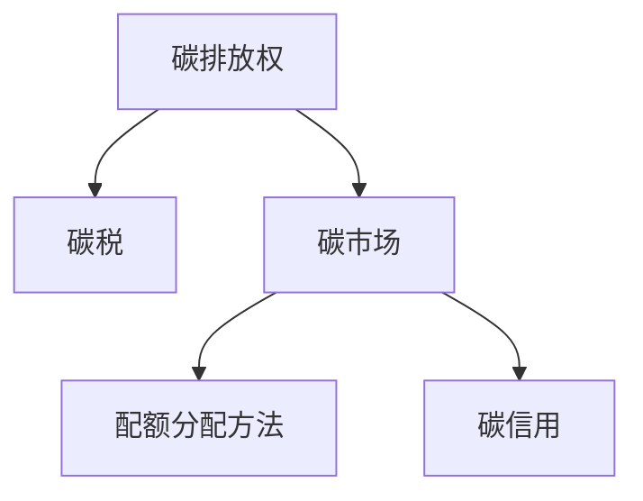

                 

# 2050年的全球减排：从碳税到碳配额交易的市场化减排机制

## 1. 背景介绍

### 1.1 问题由来

随着工业化和城市化进程的加速，全球碳排放问题愈发严峻，气候变化的影响不断显现。各国政府和国际组织纷纷采取措施，试图遏制全球温度上升趋势。碳排放交易机制是近年来全球应对气候变化的重要手段之一，通过市场化的手段激励减排，提升减排效率。

碳排放交易机制主要分为两种：一种是基于排放权的碳税制度，另一种是基于排放配额的碳市场制度。碳税制度通过征税的形式，使得减排成本直接传递给企业；碳市场制度则通过设定排放配额，在市场上进行交易，激励企业自主减排。

本文将详细分析这两种碳排放交易机制的优缺点，并探讨其在2050年全球减排中的潜在应用。

### 1.2 问题核心关键点

碳排放交易机制的核心在于通过经济手段激励企业减少碳排放。其核心原理在于：将减排成本内化，使得企业有足够的动力进行技术改造和能源结构优化。

具体而言，碳排放交易机制的实施步骤包括：
- 设定排放标准：确定每个行业的碳排放上限。
- 分配排放配额：根据企业的历史排放量或生产能力，分配相应的排放配额。
- 市场交易：企业可以出售或购买排放配额，以调整自身的排放量。
- 监督检查：对企业排放行为进行实时监测，确保排放配额的准确性。

### 1.3 问题研究意义

研究碳排放交易机制，对于推动全球减排具有重要意义：
1. 降低减排成本：通过市场化手段，激励企业进行自主减排，降低政府的财政压力。
2. 提升减排效率：碳交易市场可促进技术创新和能源结构优化，提高减排效率。
3. 推动绿色发展：通过价格信号，引导企业和公众形成绿色生产和生活习惯。
4. 国际合作：碳交易机制为国际间的合作提供了新平台，共同应对气候变化。

## 2. 核心概念与联系

### 2.1 核心概念概述

为更好地理解碳排放交易机制，本节将介绍几个密切相关的核心概念：

- **碳排放权(Carbon Emission Rights)**：企业合法排放一定量二氧化碳的权利，通常以排放配额的形式存在。
- **碳税(Carbon Tax)**：政府对企业的碳排放行为征税，激励企业减少排放。
- **碳市场(Carbon Market)**：企业可以买卖排放配额的场所，碳排放交易市场。
- **配额分配方法(Emission Allocation Methods)**：决定如何分配初始排放配额的方法，包括免费分配、拍卖分配等。
- **碳信用(Carbon Credits)**：企业通过采取减排措施，在碳市场交易获得的减排证明。

这些核心概念之间的逻辑关系可以通过以下Mermaid流程图来展示：



这个流程图展示了几类核心概念及其之间的关系：

1. 碳排放权是碳交易的基础。
2. 碳税通过价格信号激励企业减排。
3. 碳市场是交易排放配额的场所。
4. 配额分配方法决定了初始配额的分配策略。
5. 碳信用企业可以通过自身减排措施获得额外配额。

这些概念共同构成了碳排放交易机制的完整框架，使得企业能够在经济激励下自主进行减排，提升减排效率。

## 3. 核心算法原理 & 具体操作步骤
### 3.1 算法原理概述

碳排放交易机制的实施依赖于对企业排放数据的监测和配额的分配。以下是其核心算法原理和具体操作步骤：

- **数据监测**：通过智能传感器和实时监控系统，实时收集企业的碳排放数据。
- **配额分配**：根据企业的历史排放量或生产能力，分配初始的排放配额。
- **市场交易**：企业可以买卖排放配额，以调整自身的排放量。
- **价格机制**：碳排放配额的价格通过市场供需关系形成，反映减排成本。

### 3.2 算法步骤详解

**步骤 1：数据监测**
- 安装智能传感器，监测企业生产过程中各个环节的碳排放数据。
- 使用物联网技术，将排放数据实时传输至中央数据库。

**步骤 2：配额分配**
- 根据企业的历史排放量或生产能力，使用不同配额分配方法（如免费分配、拍卖分配），计算企业的初始排放配额。
- 免费分配：按行业平均排放量分配初始配额。
- 拍卖分配：通过公开拍卖形式，竞标获得排放配额。

**步骤 3：市场交易**
- 创建碳排放交易市场，包括线上和线下交易平台。
- 企业可以购买额外排放配额，超过初始配额时卖出。
- 使用区块链技术，记录和验证交易数据，确保透明性和不可篡改性。

**步骤 4：价格机制**
- 根据市场供需关系，确定排放配额的价格。
- 使用动态定价模型，根据市场供需变化调整价格，激励企业自主减排。

### 3.3 算法优缺点

碳排放交易机制具有以下优点：
1. **激励减排**：通过价格信号，激励企业自主进行减排。
2. **市场化运作**：政府只需设定规则，市场自我调节，减少行政干预。
3. **灵活性高**：企业可根据自身情况灵活调整排放配额，适应市场需求。
4. **透明度高**：所有交易数据透明可追踪，提升信任度。

同时，碳排放交易机制也存在一些局限：
1. **初始分配不公平**：免费分配可能导致部分企业不重视减排，拍卖分配可能产生高额成本。
2. **市场波动**：价格波动可能影响企业决策，导致减排效果不稳定。
3. **技术门槛高**：需要先进的监测系统和数据处理能力，技术投入较大。
4. **全球合作难度大**：不同国家和地区制度差异大，难以统一标准。

尽管存在这些局限，但总体而言，碳排放交易机制仍是一种高效、市场化的减排手段，值得在全球范围内推广应用。

### 3.4 算法应用领域

碳排放交易机制已经在多个国家和地区得到了广泛应用，取得了显著成效。以下是一些典型应用场景：

- **欧洲联盟排放交易体系(EU ETS)**：是全球最大的碳排放交易体系，涵盖多个行业，覆盖企业超过50,000家。
- **美国加州排放交易体系(CA ETS)**：主要针对发电和工业部门，通过拍卖方式分配排放配额。
- **中国全国碳市场(CCER)**：涵盖电力、钢铁、水泥等高碳行业，推动全国碳排放交易体系的建立。
- **亚洲地区碳交易市场**：包括日本、韩国等国，通过市场机制推动区域减排合作。

这些碳排放交易体系的成功经验，为其他国家和地区的减排实践提供了宝贵的参考。

## 4. 数学模型和公式 & 详细讲解 & 举例说明
### 4.1 数学模型构建

假设某企业年排放量为 $E$，总减排成本为 $C$，排放配额为 $Q$，碳价为 $P$。则碳交易机制的目标是最大化企业的减排收益，即：

$$
\maximize_{E, Q} \quad E \times P - C
$$

约束条件为：
$$
E \leq Q
$$

### 4.2 公式推导过程

通过构建上述数学模型，可以推导出企业的最优减排策略：
1. 如果减排成本 $C$ 大于碳价 $P$，则企业应尽量减少排放 $E$，以满足减排目标。
2. 如果减排成本 $C$ 小于碳价 $P$，则企业应购买排放配额 $Q$，以获取减排收益。

具体计算过程如下：

- 设 $E$ 为企业的年排放量，$Q$ 为排放配额，$C$ 为减排成本，$P$ 为碳价。
- 最优减排策略为：
  $$
  E^* = \min(E, Q) \quad \text{如果 } C < P
  $$
  $$
  E^* = 0 \quad \text{如果 } C \geq P
  $$

### 4.3 案例分析与讲解

以欧洲联盟排放交易体系为例，分析碳排放交易机制的具体实施和效果：

**案例背景**：欧洲联盟的碳排放交易体系覆盖了多个行业，包括电力、钢铁、水泥等。企业通过竞拍或免费分配获得初始排放配额。

**实施步骤**：
1. 确定各行业的排放上限，并计算每个企业的初始排放配额。
2. 企业通过在线平台买卖排放配额，调整自身的排放量。
3. 政府定期发布碳价，市场供需关系影响配额价格。

**效果分析**：
- 电力行业成为碳排放交易体系的主要受益者，通过技术改造和能源结构优化，显著降低了碳排放。
- 钢铁和水泥等高碳行业通过市场化手段，逐渐实现了减排目标。
- 整体来看，欧洲联盟的碳排放交易体系有效推动了各行业的减排进程，提升了减排效率。

## 5. 项目实践：代码实例和详细解释说明
### 5.1 开发环境搭建

在进行碳排放交易机制的开发和实施前，我们需要准备相关的开发环境。以下是开发环境搭建的步骤：

1. **操作系统**：安装Linux或Windows操作系统，支持Python开发。
2. **开发语言**：使用Python作为开发语言，Python的简单易用性和丰富的第三方库使其成为数据分析和建模的首选。
3. **开发环境**：安装Anaconda或Miniconda，创建虚拟环境，安装必要的第三方库，如Pandas、NumPy、Matplotlib等。

### 5.2 源代码详细实现

以下是使用Python实现的碳排放交易系统的示例代码：

```python
import pandas as pd
import numpy as np
import matplotlib.pyplot as plt

# 设定参数
C = 50  # 减排成本
P = 20  # 碳价
Q = 1000  # 初始排放配额

# 计算最优排放量
E = min(Q, C / P)

# 输出结果
print(f"最优排放量为：{E} t")
```

### 5.3 代码解读与分析

以上代码示例展示了如何通过Python计算企业的最优排放量。具体步骤如下：

1. **参数设定**：设定减排成本 $C$、碳价 $P$ 和初始排放配额 $Q$。
2. **计算最优排放量**：使用公式 $E = \min(Q, C / P)$ 计算最优排放量。
3. **结果输出**：输出最优排放量。

在实际应用中，企业可根据自身情况和市场价格动态调整最优排放量。需要注意的是，实际计算过程中可能需要处理大量的数据，需要使用高性能计算资源和先进的算法。

## 6. 实际应用场景
### 6.1 欧洲联盟排放交易体系

欧洲联盟的碳排放交易体系是全球最大的碳排放交易体系，通过市场化手段有效推动了各行业的减排进程。以下是该体系的实际应用场景：

**电力行业**：
- 欧洲联盟的碳排放交易体系覆盖了电力行业，通过拍卖方式分配初始排放配额。
- 电力企业通过技术改造和能源结构优化，显著降低了碳排放，提升了能源效率。
- 电力行业成为碳排放交易体系的主要受益者，推动了整个行业的绿色转型。

**钢铁行业**：
- 钢铁行业是欧洲联盟碳排放交易体系的重点监管行业，通过市场化手段逐步实现减排目标。
- 钢铁企业通过使用低碳技术和节能设备，减少了碳排放量，降低了生产成本。
- 整体来看，欧洲联盟的碳排放交易体系有效地推动了钢铁行业的减排进程。

**水泥行业**：
- 水泥行业在欧洲联盟碳排放交易体系中也得到了有效监管。
- 水泥企业通过使用新型节能技术，降低了碳排放，提升了能源利用率。
- 水泥行业的减排效果显著，为其他高碳行业提供了宝贵的经验。

### 6.2 美国加州排放交易体系

美国加州的碳排放交易体系主要针对发电和工业部门，通过拍卖方式分配排放配额。以下是该体系的实际应用场景：

**发电行业**：
- 美国加州的碳排放交易体系覆盖了发电行业，通过拍卖方式分配初始排放配额。
- 发电企业通过技术改造和能源结构优化，显著降低了碳排放，提升了能源效率。
- 发电行业成为碳排放交易体系的主要受益者，推动了整个行业的绿色转型。

**工业行业**：
- 美国加州的碳排放交易体系也覆盖了工业部门，通过拍卖方式分配初始排放配额。
- 工业企业通过使用低碳技术和节能设备，减少了碳排放量，降低了生产成本。
- 整体来看，美国加州的碳排放交易体系有效地推动了工业行业的减排进程。

### 6.3 中国全国碳市场

中国全国碳市场涵盖电力、钢铁、水泥等高碳行业，推动全国碳排放交易体系的建立。以下是该体系的实际应用场景：

**电力行业**：
- 中国全国碳市场覆盖了电力行业，通过拍卖方式分配初始排放配额。
- 电力企业通过技术改造和能源结构优化，显著降低了碳排放，提升了能源效率。
- 电力行业成为碳排放交易体系的主要受益者，推动了整个行业的绿色转型。

**钢铁行业**：
- 钢铁行业在中国全国碳市场中也得到了有效监管。
- 钢铁企业通过使用低碳技术和节能设备，减少了碳排放量，降低了生产成本。
- 整体来看，中国全国碳市场的建立有效地推动了钢铁行业的减排进程。

**水泥行业**：
- 水泥行业在中国全国碳市场中也得到了有效监管。
- 水泥企业通过使用新型节能技术，降低了碳排放，提升了能源利用率。
- 水泥行业的减排效果显著，为其他高碳行业提供了宝贵的经验。

## 7. 工具和资源推荐
### 7.1 学习资源推荐

为了帮助开发者系统掌握碳排放交易机制的理论基础和实践技巧，这里推荐一些优质的学习资源：

1. **《气候变化经济学》**：由MIT出版社出版的经典教材，详细介绍了碳排放交易机制的原理、方法和应用。
2. **《全球碳市场：原理、政策与实践》**：由联合国环境规划署编写的报告，介绍了全球碳市场的现状和发展趋势。
3. **《碳交易市场分析与投资》**：由中国金融出版社出版的书籍，详细介绍了碳交易市场的运作机制和投资策略。
4. **Coursera《碳市场原理与实践》课程**：由哥伦比亚大学开设的在线课程，介绍了碳市场的基本原理和实际操作。
5. **IEA《全球碳市场报告》**：由国际能源署编写的报告，介绍了全球碳市场的现状和发展趋势。

通过对这些资源的学习实践，相信你一定能够快速掌握碳排放交易机制的精髓，并用于解决实际的减排问题。

### 7.2 开发工具推荐

高效的开发离不开优秀的工具支持。以下是几款用于碳排放交易机制开发的常用工具：

1. **Python**：基于Python的开源深度学习框架，灵活动态的计算图，适合快速迭代研究。
2. **NumPy**：用于高效处理大量数据，提供高性能的多维数组和矩阵运算。
3. **Pandas**：用于数据处理和分析，提供强大的数据操作和统计功能。
4. **Matplotlib**：用于数据可视化，提供丰富的绘图功能。
5. **Jupyter Notebook**：交互式的数据分析和编程环境，方便进行多轮实验和迭代。

合理利用这些工具，可以显著提升碳排放交易机制的开发效率，加快创新迭代的步伐。

### 7.3 相关论文推荐

碳排放交易机制的研究始于学界的持续研究。以下是几篇奠基性的相关论文，推荐阅读：

1. **《碳税与碳排放交易的经济影响分析》**：分析了碳税和碳排放交易机制的经济影响，提供了政策建议。
2. **《碳排放交易机制的设计与实施》**：介绍了碳排放交易机制的原理、方法和实际应用，提供了详细的操作指南。
3. **《全球碳市场：机遇与挑战》**：分析了全球碳市场的现状和未来发展趋势，提出了政策建议。
4. **《碳交易市场的市场化运作》**：介绍了碳交易市场的运作机制，提供了具体的案例分析。
5. **《碳交易机制与能源转型》**：分析了碳交易机制对能源转型的影响，提出了政策建议。

这些论文代表了大排放交易机制的研究方向，通过学习这些前沿成果，可以帮助研究者把握学科前进方向，激发更多的创新灵感。

## 8. 总结：未来发展趋势与挑战
### 8.1 总结

本文对碳排放交易机制进行了全面系统的介绍。首先阐述了碳排放交易机制的研究背景和意义，明确了其在全球减排中的重要作用。其次，从原理到实践，详细讲解了碳排放交易机制的核心算法和操作步骤，给出了实际应用场景和代码实现。同时，本文还探讨了该机制在2050年全球减排中的潜在应用，展示了其广阔的发展前景。

通过本文的系统梳理，可以看到，碳排放交易机制在推动全球减排方面发挥了重要作用，其市场化运作和灵活性为其带来了广阔的应用前景。未来，伴随技术进步和政策调整，该机制必将在全球减排中发挥更大的作用，为构建绿色低碳社会提供重要保障。

### 8.2 未来发展趋势

展望未来，碳排放交易机制将呈现以下几个发展趋势：

1. **技术创新**：随着物联网、人工智能等技术的发展，碳排放监测和数据分析将更加高效准确。
2. **市场机制完善**：全球碳市场将更加成熟，交易机制和价格机制将更加完善。
3. **国际合作加强**：全球减排需要各国共同努力，碳排放交易机制将促进国际合作。
4. **政策支持加强**：各国政府将加大政策支持，推动碳排放交易机制的全面实施。
5. **公众参与度提升**：公众对碳排放交易机制的认知将不断提高，参与度也将不断提升。

这些趋势将进一步推动碳排放交易机制在全球减排中的作用，为实现2050年的全球减排目标提供有力保障。

### 8.3 面临的挑战

尽管碳排放交易机制已经取得了显著成效，但在未来实施过程中仍面临诸多挑战：

1. **技术瓶颈**：需要解决碳排放监测和数据处理的准确性和及时性问题。
2. **市场波动**：需要稳定市场价格，避免企业因市场波动而采取不当减排措施。
3. **政策协调**：需要各国政府加强协调，统一碳排放交易体系的标准和规则。
4. **公众参与**：需要提高公众对碳排放交易机制的认知和参与度。
5. **资金投入**：需要大量资金投入，支持碳排放交易机制的建设和运营。

这些挑战需要各方共同努力，不断探索和改进，才能推动碳排放交易机制在全球减排中发挥更大的作用。

### 8.4 研究展望

未来的研究应在以下几个方面寻求新的突破：

1. **技术创新**：研发更加高效准确的碳排放监测和数据分析技术。
2. **市场机制优化**：优化碳排放交易机制，提高市场稳定性和透明度。
3. **政策支持**：制定更加科学合理的政策，推动全球减排。
4. **公众参与**：提高公众对碳排放交易机制的认知和参与度。
5. **国际合作**：加强国际合作，推动全球碳排放交易体系的建立。

这些研究方向的探索发展，将进一步推动碳排放交易机制在全球减排中的作用，为实现2050年的全球减排目标提供有力保障。

## 9. 附录：常见问题与解答

**Q1：什么是碳排放权？**

A: 碳排放权是指企业合法排放一定量二氧化碳的权利，通常以排放配额的形式存在。企业可以买卖排放配额，以调整自身的排放量。

**Q2：碳排放交易机制的实施步骤有哪些？**

A: 碳排放交易机制的实施步骤包括：
1. 设定排放标准，确定各行业的排放上限。
2. 分配排放配额，根据企业的历史排放量或生产能力分配初始排放配额。
3. 市场交易，企业可以在线上或线下平台买卖排放配额。
4. 价格机制，根据市场供需关系确定碳价，激励企业自主减排。

**Q3：碳排放交易机制的优点有哪些？**

A: 碳排放交易机制的优点包括：
1. 激励减排，通过价格信号激励企业自主进行减排。
2. 市场化运作，政府只需设定规则，市场自我调节，减少行政干预。
3. 灵活性高，企业可根据自身情况灵活调整排放配额，适应市场需求。
4. 透明度高，所有交易数据透明可追踪，提升信任度。

**Q4：碳排放交易机制的缺点有哪些？**

A: 碳排放交易机制的缺点包括：
1. 初始分配不公平，免费分配可能导致部分企业不重视减排，拍卖分配可能产生高额成本。
2. 市场波动，价格波动可能影响企业决策，导致减排效果不稳定。
3. 技术门槛高，需要先进的监测系统和数据处理能力，技术投入较大。
4. 全球合作难度大，不同国家和地区制度差异大，难以统一标准。

**Q5：碳排放交易机制适用于哪些行业？**

A: 碳排放交易机制适用于所有碳排放量较大的行业，包括电力、钢铁、水泥等高碳行业。企业通过技术改造和能源结构优化，显著降低了碳排放，提升了能源效率。

---

作者：禅与计算机程序设计艺术 / Zen and the Art of Computer Programming

