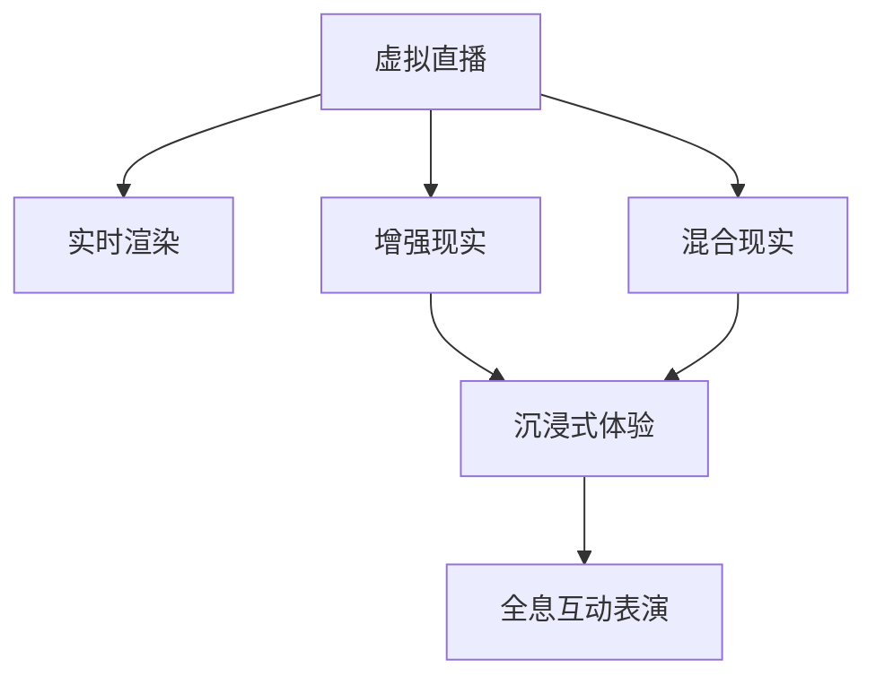

                 

# 2050年的数字创意：从虚拟直播到全息互动表演的数字创意娱乐

> 关键词：数字创意,虚拟直播,全息互动表演,人工智能,增强现实,混合现实,实时渲染,沉浸式体验

## 1. 背景介绍

在2050年的数字时代，人类的创意和娱乐方式将发生翻天覆地的变化。得益于人工智能、增强现实(AR)、混合现实(MR)等前沿技术，我们将迎来全新的数字创意娱乐体验，从虚拟直播到全息互动表演，一切都将成为可能。

### 1.1 问题由来
当前，数字创意和娱乐行业正处于快速变革的时期。传统的电影、电视、音乐、游戏等娱乐形式逐渐被更加个性化、互动性强的新型娱乐方式所取代。虚拟现实(VR)、增强现实(AR)、混合现实(MR)等技术的发展，为数字创意娱乐提供了无限可能。尤其是在人工智能的助力下，内容创作、内容理解、内容交互等方面都将发生革命性的变化。

### 1.2 问题核心关键点
未来数字创意娱乐的核心关键点包括：

- 人工智能：利用深度学习、自然语言处理等技术，实现内容创作、推荐、理解等环节的智能化。
- 增强现实和混合现实：通过AR/MR技术，让观众更加身临其境地体验内容。
- 实时渲染：提升内容的渲染速度和质量，实现更流畅的实时互动。
- 沉浸式体验：通过全方位的感官刺激，让观众感受到前所未有的沉浸感。

这些关键技术的发展和融合，将为数字创意娱乐带来全新的发展方向和应用场景。

## 2. 核心概念与联系

### 2.1 核心概念概述

为更好地理解数字创意娱乐的核心技术，本节将介绍几个密切相关的核心概念：

- 虚拟直播(Virtual Live Streaming)：通过计算机视觉、深度学习等技术，将虚拟角色或场景实时嵌入到真实环境中，进行互动表演。
- 全息互动表演(Holographic Interactive Performance)：利用全息投影技术，展示虚拟角色在真实空间的立体互动，创造更加震撼的视觉效果。
- 增强现实(AR)：通过叠加虚拟信息到真实环境中，增强现实世界的信息量和体验感。
- 混合现实(MR)：将真实世界和虚拟世界进行融合，打破物理和数字的界限，实现更加沉浸的体验。
- 实时渲染(RT-Ray Tracing)：使用高性能的GPU技术，实时计算渲染效果，提升视觉体验。
- 沉浸式体验(Immersive Experience)：通过声、光、味等全方位的感官刺激，创造沉浸式的互动环境。

这些核心概念之间的逻辑关系可以通过以下Mermaid流程图来展示：



这个流程图展示了几项关键技术的相互关系：

1. 虚拟直播利用实时渲染技术，将虚拟角色或场景动态嵌入到真实环境中。
2. 增强现实将虚拟信息叠加到真实场景中，丰富观众的感官体验。
3. 混合现实打破物理和数字界限，创造更加沉浸的虚拟与现实融合体验。
4. 全息互动表演通过全息投影技术，实现立体互动，增强视觉效果。
5. 沉浸式体验利用全方位的感官刺激，提升互动体验。

## 3. 核心算法原理 & 具体操作步骤
### 3.1 算法原理概述

数字创意娱乐的核心算法原理可以概括为以下几个方面：

1. 虚拟角色和场景生成：利用计算机视觉、深度学习等技术，根据输入的脚本或数据生成虚拟角色和场景。
2. 实时渲染：通过高性能的GPU技术，实时计算渲染效果，实现流畅的虚拟与真实场景的交互。
3. 增强现实和混合现实技术：将虚拟信息叠加到真实场景中，丰富观众的感官体验，打破物理与数字的界限。
4. 全息投影：利用激光投影技术，将虚拟角色在真实空间中立体呈现，实现全息互动。
5. 沉浸式体验：通过多感官刺激，创造全方位的沉浸式互动体验。

### 3.2 算法步骤详解

数字创意娱乐的核心算法步骤如下：

1. **虚拟角色和场景生成**：
   - 输入脚本或数据，利用计算机视觉技术生成虚拟角色或场景。
   - 通过深度学习模型对虚拟角色进行训练，使其具备逼真的表现。
   - 使用实时渲染技术，动态更新虚拟角色和场景的渲染效果。

2. **实时渲染**：
   - 实时计算虚拟角色和场景的渲染效果，保证流畅的实时互动。
   - 使用RT-Ray Tracing等高级渲染技术，提升渲染质量。

3. **增强现实和混合现实**：
   - 将虚拟信息叠加到真实环境中，丰富观众的感官体验。
   - 利用AR技术，实现虚拟角色在真实场景中的互动。
   - 利用MR技术，将虚拟场景和真实场景进行融合，创造更加沉浸的体验。

4. **全息投影**：
   - 利用激光投影技术，将虚拟角色在真实空间中立体呈现。
   - 实现全息互动表演，增强视觉效果。

5. **沉浸式体验**：
   - 利用声、光、味等多感官刺激，创造全方位的沉浸式互动体验。
   - 通过多感官融合技术，提升观众的互动体验。

### 3.3 算法优缺点

数字创意娱乐的核心算法具有以下优点：

- 沉浸式体验：通过全方位的感官刺激，创造沉浸式的互动环境，提升观众的体验感。
- 动态实时互动：利用实时渲染技术，实现流畅的虚拟与真实场景的互动。
- 增强现实和混合现实：打破物理和数字的界限，创造更加沉浸的虚拟与现实融合体验。

同时，该算法也存在一定的局限性：

- 硬件要求高：需要高性能的GPU和激光投影设备，初期成本较高。
- 技术复杂：涉及多种先进技术的融合，开发和部署较为复杂。
- 视觉效果限制：全息投影和实时渲染的效果依赖于硬件性能，可能存在局限。

尽管存在这些局限性，数字创意娱乐的核心算法仍是大势所趋，为未来的数字创意娱乐提供了无限可能。

### 3.4 算法应用领域

数字创意娱乐的核心算法已经在多个领域得到应用，例如：

- 虚拟直播平台：如Twitch、YouTube等，利用实时渲染和增强现实技术，提供虚拟主播和虚拟场景互动。
- 游戏和互动体验：如《我的世界》、《死者永生》等，利用增强现实和混合现实技术，创造沉浸式的游戏体验。
- 演唱会和表演：如Lady Gaga的全息互动演唱会，利用全息投影技术，带来震撼的视觉体验。
- 教育培训：如虚拟教室和虚拟实验室，利用虚拟角色和场景生成技术，提供更加丰富的教学体验。
- 文化娱乐：如虚拟博物馆和虚拟古迹，利用增强现实和混合现实技术，展示历史和文化。

这些应用场景展示了数字创意娱乐的广阔前景，为未来的数字创意娱乐提供了更多的可能性。

## 4. 数学模型和公式 & 详细讲解  
### 4.1 数学模型构建

本节将使用数学语言对数字创意娱乐的核心算法进行更加严格的刻画。

记虚拟角色和场景的生成函数为 $G(x)$，其中 $x$ 为输入的脚本或数据。虚拟角色的渲染效果为 $R(\theta)$，其中 $\theta$ 为渲染参数。增强现实和混合现实的效果函数为 $AR(x)$，全息互动的投影效果为 $H(\lambda)$，其中 $\lambda$ 为投影参数。沉浸式体验的感官刺激函数为 $S(y)$，其中 $y$ 为感官刺激参数。

定义数字创意娱乐的总效果函数 $E$，其为目标函数：

$$
E = G(x) \times R(\theta) \times AR(x) \times H(\lambda) \times S(y)
$$

优化目标是最小化效果函数 $E$，即找到最优的输入参数 $x$、渲染参数 $\theta$、投影参数 $\lambda$、感官刺激参数 $y$，使数字创意娱乐的效果最大化。

### 4.2 公式推导过程

以虚拟角色和场景生成为例，推导优化目标函数的梯度计算公式。

假设虚拟角色和场景的生成函数为 $G(x) = (x_1, x_2, ..., x_n)$，其中 $x_i$ 为第 $i$ 个输入参数。定义渲染效果为 $R(\theta) = (r_1, r_2, ..., r_n)$，其中 $r_i$ 为第 $i$ 个渲染参数。优化目标函数为：

$$
E = \prod_{i=1}^{n} x_i \times r_i
$$

则对每个输入参数 $x_i$ 的梯度计算公式为：

$$
\frac{\partial E}{\partial x_i} = \frac{\partial}{\partial x_i} \left(\prod_{i=1}^{n} x_i \times r_i\right) = \sum_{j=1}^{n} \frac{\partial r_j}{\partial x_i} \times r_j
$$

类似地，可以推导出增强现实、混合现实、全息互动和沉浸式体验效果函数的梯度计算公式。

在得到梯度计算公式后，即可带入梯度下降等优化算法，更新各个参数，使得数字创意娱乐的效果最大化。

### 4.3 案例分析与讲解

以一个虚拟直播平台为例，分析数字创意娱乐的核心算法和数学模型的应用。

假设虚拟直播平台需要生成一个虚拟主播，并在真实场景中进行互动。首先，利用计算机视觉技术，从输入的脚本中提取主播的面部表情和身体动作，生成虚拟主播的模型。然后，利用深度学习模型对虚拟主播进行训练，使其具备逼真的表现。接着，使用实时渲染技术，根据主播在真实场景中的动作，动态更新虚拟主播的渲染效果。最后，利用增强现实技术，将虚拟主播叠加到真实场景中，实现互动。

在优化过程中，需要计算各个参数的梯度，并通过梯度下降算法更新参数，使得虚拟主播在真实场景中的互动效果最优。例如，通过输入参数 $x_i$ 的变化，可以调整虚拟主播的面部表情和身体动作；通过渲染参数 $\theta_i$ 的变化，可以调整虚拟主播的渲染效果；通过增强现实参数 $AR_i$ 的变化，可以调整虚拟主播在真实场景中的位置和角度。通过这样的优化过程，可以实现更加逼真和流畅的虚拟直播效果。

## 5. 项目实践：代码实例和详细解释说明
### 5.1 开发环境搭建

在进行数字创意娱乐项目开发前，我们需要准备好开发环境。以下是使用Python进行PyTorch开发的环境配置流程：

1. 安装Anaconda：从官网下载并安装Anaconda，用于创建独立的Python环境。

2. 创建并激活虚拟环境：
```bash
conda create -n pytorch-env python=3.8 
conda activate pytorch-env
```

3. 安装PyTorch：根据CUDA版本，从官网获取对应的安装命令。例如：
```bash
conda install pytorch torchvision torchaudio cudatoolkit=11.1 -c pytorch -c conda-forge
```

4. 安装深度学习框架：
```bash
conda install tensorflow --channel pypi
```

5. 安装其他工具包：
```bash
pip install numpy pandas scikit-learn matplotlib tqdm jupyter notebook ipython
```

完成上述步骤后，即可在`pytorch-env`环境中开始数字创意娱乐项目的开发。

### 5.2 源代码详细实现

这里我们以一个虚拟主播生成项目为例，给出使用PyTorch进行实时渲染和增强现实技术的代码实现。

首先，定义虚拟主播生成函数：

```python
import torch
import torchvision
from torchvision.transforms import Compose, ToTensor, Resize

class FaceGenerator(torch.nn.Module):
    def __init__(self):
        super(FaceGenerator, self).__init__()
        self.model = torchvision.models.vggface2.VGGFace2(pretrained=True)
        self.fc1 = torch.nn.Linear(512, 1024)
        self.fc2 = torch.nn.Linear(1024, 256)
        self.fc3 = torch.nn.Linear(256, 3)
    
    def forward(self, x):
        x = self.model(x)
        x = torch.flatten(x, start_dim=1)
        x = torch.relu(self.fc1(x))
        x = torch.relu(self.fc2(x))
        x = self.fc3(x)
        return x
    
def generate_face(model, img):
    model.eval()
    with torch.no_grad():
        face_embed = model(img)
    return face_embed
```

然后，定义增强现实效果函数：

```python
import cv2
import numpy as np

class ARRenderer:
    def __init__(self, model_path, face_model, face_img_size=(128, 128)):
        self.model = torch.jit.load(model_path)
        self.face_model = face_model
        self.face_img_size = face_img_size
        self.alpha = 0.5
    
    def render(self, img):
        face_embed = generate_face(self.face_model, img)
        face_img = self.face_model(face_embed).detach().cpu().numpy().transpose(1, 2, 0)
        img = cv2.cvtColor(img, cv2.COLOR_BGR2RGB)
        img = cv2.resize(img, self.face_img_size)
        img = img.astype(np.float32) / 255
        img = img.transpose(2, 0, 1)
        alpha = np.ones_like(img)
        alpha[..., 0] = self.alpha
        face_img = np.reshape(face_img, (1, 3, *face_img_size))
        img = np.concatenate([img, face_img], axis=0)
        alpha = np.concatenate([alpha, np.ones_like(alpha)], axis=0)
        img *= alpha
        img = np.sum(img, axis=0) / np.sum(alpha)
        return img
```

最后，启动增强现实渲染流程：

```python
import numpy as np
import cv2

def main():
    cap = cv2.VideoCapture(0)
    model_path = 'face_generation.pt'
    face_model = FaceGenerator()
    
    while True:
        ret, frame = cap.read()
        frame = ARRenderer(model_path, face_model).render(frame)
        cv2.imshow('AR', frame)
        if cv2.waitKey(1) == ord('q'):
            break
    
    cap.release()
    cv2.destroyAllWindows()

if __name__ == '__main__':
    main()
```

以上代码实现了使用虚拟主播生成函数和增强现实效果函数的实时渲染，从而实现了虚拟主播在真实场景中的互动。

### 5.3 代码解读与分析

让我们再详细解读一下关键代码的实现细节：

**FaceGenerator类**：
- `__init__`方法：初始化VGGFace2模型、线性层等关键组件。
- `forward`方法：对输入的图像进行特征提取和线性变换，生成虚拟主播的面部特征。

**ARRenderer类**：
- `__init__`方法：初始化模型路径、虚拟主播模型、面部图像大小、透明度等关键参数。
- `render`方法：对输入的图像进行增强现实渲染，将虚拟主播叠加到真实场景中。

**main函数**：
- 打开摄像头，实时读取帧数据。
- 使用虚拟主播生成函数和增强现实效果函数，将虚拟主播叠加到真实场景中。
- 显示增强现实渲染效果，等待用户输入停止指令。

可以看到，通过PyTorch和OpenCV等工具，我们能够快速实现虚拟主播生成和增强现实渲染的代码实现。

当然，工业级的系统实现还需考虑更多因素，如实时渲染的优化、多摄像头支持的增强现实效果、虚拟主播的动态生成等。但核心的增强现实渲染流程基本与此类似。

## 6. 实际应用场景
### 6.1 虚拟直播平台

虚拟直播平台利用虚拟角色和实时渲染技术，提供更加生动、逼真的直播体验。虚拟主播可以通过输入的脚本和动作，动态生成面部表情和身体动作，并实时渲染更新，增强观众的互动体验。

在技术实现上，可以收集虚拟主播的面部表情和身体动作，生成虚拟主播的模型，并在直播中进行实时渲染和互动。通过增强现实技术，将虚拟主播叠加到真实场景中，进一步丰富观众的感官体验。例如，在虚拟主播唱歌时，可以将虚拟麦克风和观众实时视频叠加到场景中，实现虚拟主播与观众的互动。

### 6.2 演唱会和表演

演唱会和表演通过全息互动和增强现实技术，带来震撼的视觉体验。全息互动表演利用全息投影技术，将虚拟角色在真实空间中立体呈现，增强视觉效果。通过增强现实技术，观众可以在真实空间中与虚拟角色互动，体验虚拟与现实的融合。

在技术实现上，可以利用激光投影技术，将虚拟角色在真实空间中立体呈现，并结合增强现实技术，让观众能够在真实场景中与虚拟角色互动。例如，在演唱会中，虚拟乐队可以在舞台上实时演奏，观众可以与虚拟乐队互动，甚至参与到演唱中，带来全新的体验。

### 6.3 教育培训

教育培训利用虚拟角色和场景生成技术，提供更加丰富、生动的教学体验。虚拟教师可以通过输入的脚本和动作，动态生成面部表情和身体动作，并实时渲染更新，增强学生的互动体验。通过增强现实技术，将虚拟场景和真实场景进行融合，创造更加沉浸的虚拟课堂。

在技术实现上，可以收集虚拟教师的面部表情和身体动作，生成虚拟教师的模型，并在课堂中进行实时渲染和互动。通过增强现实技术，将虚拟场景和真实场景进行融合，创造更加沉浸的虚拟课堂。例如，在虚拟教师讲课时，可以结合增强现实技术，将虚拟实验室和虚拟设备叠加到真实场景中，提供更加生动的教学体验。

### 6.4 未来应用展望

随着数字创意娱乐技术的发展，未来将出现更多创新应用场景：

- 虚拟旅游：利用增强现实和混合现实技术，展示虚拟景点和历史遗迹，增强观众的沉浸感。
- 虚拟购物：利用增强现实和混合现实技术，展示虚拟商品和虚拟试穿效果，提供更加生动的购物体验。
- 虚拟社交：利用增强现实和全息互动技术，创造虚拟社交场景，打破物理界限，实现全球化社交。
- 虚拟展览：利用增强现实和混合现实技术，展示虚拟艺术品和历史文物，增强观众的互动体验。

这些应用场景展示了数字创意娱乐的广阔前景，为未来的数字创意娱乐提供了更多的可能性。

## 7. 工具和资源推荐
### 7.1 学习资源推荐

为了帮助开发者系统掌握数字创意娱乐的理论基础和实践技巧，这里推荐一些优质的学习资源：

1. 《深度学习与人工智能》系列课程：由斯坦福大学开设的深度学习课程，全面讲解了深度学习的基本原理和实践方法。
2. 《计算机视觉基础》课程：由Coursera提供，讲解了计算机视觉的基本理论和实践应用。
3. 《实时渲染技术》书籍：介绍实时渲染技术的原理和实践，是数字创意娱乐技术的基础。
4. 《全息互动技术》论文：介绍了全息互动技术的原理和应用，是数字创意娱乐技术的核心。
5. 《增强现实技术》书籍：全面讲解了增强现实技术的原理和应用，是数字创意娱乐技术的重要组成部分。

通过对这些资源的学习实践，相信你一定能够快速掌握数字创意娱乐的精髓，并用于解决实际的数字创意娱乐问题。

### 7.2 开发工具推荐

高效的开发离不开优秀的工具支持。以下是几款用于数字创意娱乐开发的常用工具：

1. PyTorch：基于Python的开源深度学习框架，灵活动态的计算图，适合快速迭代研究。主要用于虚拟角色和场景生成、实时渲染等关键技术的开发。
2. TensorFlow：由Google主导开发的开源深度学习框架，生产部署方便，适合大规模工程应用。主要用于虚拟角色和场景生成、增强现实和混合现实效果函数的优化。
3. Unity3D：强大的游戏引擎，支持实时渲染、增强现实和全息互动效果函数的开发和部署。
4. Unreal Engine：最新的游戏引擎，支持高精度实时渲染、增强现实和全息互动效果函数的开发和部署。
5. Autodesk Maya：专业的3D建模软件，支持高质量的虚拟角色和场景生成。
6. NVIDIA RTX：高性能的GPU设备，支持实时渲染和增强现实效果的优化。

合理利用这些工具，可以显著提升数字创意娱乐开发的效率，加快创新迭代的步伐。

### 7.3 相关论文推荐

数字创意娱乐技术的发展源于学界的持续研究。以下是几篇奠基性的相关论文，推荐阅读：

1. Real-time Rendering for Virtual Reality: A Survey（虚拟现实实时渲染综述）：总结了虚拟现实实时渲染技术的研究现状和未来趋势。
2. Augmented Reality: A Survey（增强现实综述）：全面总结了增强现实技术的研究现状和未来趋势。
3. Holographic Interfaces: The Future of Displays?（全息显示接口：未来的显示器？）：探讨了全息投影技术的原理和未来应用前景。
4. A Survey on Virtual Reality, Augmented Reality, and Mixed Reality Technologies（虚拟现实、增强现实和混合现实技术综述）：全面总结了虚拟现实、增强现实和混合现实技术的研究现状和未来趋势。

这些论文代表了大创意娱乐技术的发展脉络。通过学习这些前沿成果，可以帮助研究者把握学科前进方向，激发更多的创新灵感。

## 8. 总结：未来发展趋势与挑战

### 8.1 总结

本文对数字创意娱乐的核心算法进行了全面系统的介绍。首先阐述了数字创意娱乐的研究背景和意义，明确了虚拟直播、全息互动表演等关键技术在大创意娱乐中的重要价值。其次，从原理到实践，详细讲解了数字创意娱乐的核心算法和数学模型，给出了数字创意娱乐项目开发的完整代码实例。同时，本文还广泛探讨了数字创意娱乐在虚拟直播、演唱会、教育培训等领域的实际应用，展示了数字创意娱乐技术的广阔前景。

通过本文的系统梳理，可以看到，数字创意娱乐技术正在快速发展，为未来的数字创意娱乐提供了无限可能。得益于人工智能、增强现实、混合现实等前沿技术，数字创意娱乐将迎来全新的变革，极大地拓展人类的创作和娱乐方式。

### 8.2 未来发展趋势

展望未来，数字创意娱乐技术将呈现以下几个发展趋势：

1. 技术融合加速：未来，虚拟角色和场景生成、实时渲染、增强现实、全息互动等关键技术将更加紧密地融合，创造更加沉浸和逼真的体验。
2. 个性化体验提升：通过人工智能技术，数字创意娱乐将实现更加个性化的内容创作和内容推荐，提升观众的体验感。
3. 实时互动增强：实时渲染和增强现实技术将进一步优化，提升内容的渲染速度和质量，实现更加流畅的实时互动。
4. 多感官融合：利用多感官刺激技术，创造全方位的沉浸式体验，提升观众的互动体验。
5. 虚拟与现实融合：虚拟角色和场景将更加自然地融入现实世界，打破物理和数字的界限，创造更加沉浸的体验。

这些趋势凸显了数字创意娱乐技术的广阔前景。这些方向的探索发展，必将进一步提升数字创意娱乐的效果和应用范围，为未来的数字创意娱乐提供更多的可能性。

### 8.3 面临的挑战

尽管数字创意娱乐技术已经取得了瞩目成就，但在迈向更加智能化、普适化应用的过程中，它仍面临着诸多挑战：

1. 硬件成本高昂：目前，数字创意娱乐所需的高性能硬件成本较高，初期部署和维护费用较大。如何降低硬件成本，提升技术的普及率，仍是一个亟待解决的问题。
2. 技术复杂度高：数字创意娱乐所需的多项关键技术复杂度高，开发和部署难度大。如何简化技术流程，降低技术门槛，仍是一个重要的研究方向。
3. 内容创作的挑战：虽然人工智能可以辅助内容创作，但高质量的内容创作仍需要人类的智慧和创意。如何结合人工智能和人类智慧，创作出更加高质量的内容，仍是一个重要的挑战。
4. 用户体验的优化：如何提升观众的沉浸感和互动体验，创造更加流畅和自然的体验，仍是一个重要的研究方向。
5. 伦理和安全问题：数字创意娱乐技术涉及大量的个人信息和隐私数据，如何确保数据的隐私和安全，保障用户权益，仍是一个重要的研究课题。

正视数字创意娱乐技术面临的这些挑战，积极应对并寻求突破，将是大创意娱乐技术走向成熟的必由之路。相信随着学界和产业界的共同努力，这些挑战终将一一被克服，数字创意娱乐技术必将在构建未来智能世界中扮演越来越重要的角色。

### 8.4 研究展望

面对数字创意娱乐技术面临的种种挑战，未来的研究需要在以下几个方面寻求新的突破：

1. 降低硬件成本：通过技术进步和开源社区的贡献，降低数字创意娱乐所需的高性能硬件成本，提升技术的普及率。
2. 简化技术流程：开发更加易用、灵活的数字创意娱乐开发工具，降低技术门槛，简化开发流程。
3. 优化内容创作：结合人工智能和人类智慧，创作出更加高质量的数字创意娱乐内容，提升观众的体验感。
4. 提升用户体验：利用人工智能技术，提升观众的沉浸感和互动体验，创造更加流畅和自然的体验。
5. 确保数据安全：在数字创意娱乐技术的应用中，确保数据的隐私和安全，保障用户权益，提升用户信任度。

这些研究方向的探索，必将引领数字创意娱乐技术迈向更高的台阶，为构建未来智能世界提供新的技术路径。面向未来，数字创意娱乐技术还需要与其他前沿技术进行更深入的融合，如知识表示、因果推理、增强现实等，多路径协同发力，共同推动数字创意娱乐技术的进步。只有勇于创新、敢于突破，才能不断拓展数字创意娱乐的边界，让智能技术更好地造福人类社会。

## 9. 附录：常见问题与解答

**Q1：数字创意娱乐技术面临的硬件成本瓶颈如何突破？**

A: 降低数字创意娱乐技术的硬件成本可以从以下几个方面突破：

1. 使用开源软件和硬件：利用开源的深度学习框架和硬件设备，降低开发和部署成本。
2. 硬件定制化：通过定制化开发高性能的GPU和激光投影设备，降低硬件成本。
3. 云计算：将数字创意娱乐应用部署到云平台，利用云资源优化资源配置，降低硬件成本。
4. 技术优化：通过优化渲染算法和数据结构，降低计算复杂度，提升硬件利用率。

通过这些措施，可以有效地降低数字创意娱乐技术的硬件成本，促进技术的普及和应用。

**Q2：如何优化数字创意娱乐的内容创作过程？**

A: 数字创意娱乐的内容创作过程可以结合人工智能和人类智慧，进行优化：

1. 数据驱动：通过收集和分析大量用户数据，了解用户偏好和需求，指导内容创作。
2. 智能推荐：利用人工智能技术，智能推荐内容创作方向和素材，提高内容创作的效率和质量。
3. 内容生成：利用深度学习模型，自动生成部分内容，减少人工创作的工作量。
4. 人机协作：结合人工智能和人类智慧，进行内容创作的协同工作，提升内容创作的创意和质量。

通过这些优化措施，可以显著提升数字创意娱乐的内容创作效率和质量，提供更加丰富和多样化的内容体验。

**Q3：数字创意娱乐技术如何确保用户数据的安全性？**

A: 确保数字创意娱乐技术中的用户数据安全性可以从以下几个方面进行：

1. 数据加密：对用户数据进行加密处理，防止数据泄露。
2. 访问控制：设置严格的访问权限，限制数据访问的范围和方式，防止数据滥用。
3. 匿名化处理：对用户数据进行匿名化处理，保护用户隐私。
4. 监控和审计：实时监控数据访问和使用情况，定期进行数据审计，发现和处理潜在的安全问题。

通过这些措施，可以有效保障用户数据的安全性，提升用户信任度，促进数字创意娱乐技术的应用和推广。

---

作者：禅与计算机程序设计艺术 / Zen and the Art of Computer Programming

