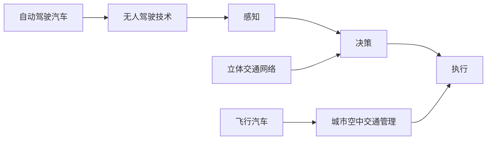

                 

# 2050年的智能交通：从自动驾驶汽车到飞行汽车的立体交通网络

在2050年的未来，智能交通将以更加多样化和立体化的形态呈现，自动驾驶汽车和飞行汽车作为其中重要组成部分，将彻底改变人类出行方式。本文将从自动驾驶汽车的演进、飞行汽车的崛起以及立体交通网络的构建三个角度，探讨2050年智能交通的发展趋势。

## 1. 背景介绍

### 1.1 问题由来
随着技术的不断进步，自动驾驶汽车已经在过去几年中逐渐从实验室走向现实，成为智能交通的重要组成部分。未来，随着自动驾驶技术的进一步成熟和普及，其在城市和乡村的广泛应用将成为可能。同时，随着飞行技术的发展，飞行汽车这一新兴交通工具也将逐步进入人们的视野，成为智能交通系统的重要补充。

### 1.2 问题核心关键点
自动驾驶汽车和飞行汽车的发展，需要依赖于强大的感知、决策、执行等系统，以及与交通基础设施的深度融合。这些关键技术的进步，将推动智能交通系统向更加智能、高效、安全的方向发展。

## 2. 核心概念与联系

### 2.1 核心概念概述

- **自动驾驶汽车**：一种无需人工驾驶即可自主导航、控制、停车的智能车辆。通过感知、决策、执行等模块的协同工作，实现车辆在复杂交通环境中的安全、高效运行。
- **飞行汽车**：结合了汽车和飞机的功能，具备垂直起降、自主飞行、安全着陆等特点，能够在城市和乡村之间快速高效地进行交通。
- **立体交通网络**：由地面交通、空中交通、地下交通等多种交通方式构成的综合交通网络，通过智能调度实现无缝对接，提升交通系统的效率和可靠性。
- **无人驾驶技术**：包括感知、决策、控制等技术，是自动驾驶汽车和飞行汽车的核心技术之一，通过集成各类传感器和算法，实现自主导航。
- **城市空中交通管理**：为飞行汽车在城市空域中的安全运行提供管理保障，包括空域规划、飞行管制、应急响应等。

这些核心概念之间相互关联，共同构成了2050年智能交通系统的技术基础。自动驾驶汽车和飞行汽车作为重要的交通工具，将在立体交通网络中发挥关键作用。无人驾驶技术的发展，则是实现这些交通工具自主运行的基础。

### 2.2 核心概念原理和架构的 Mermaid 流程图



这个流程图展示了从感知到执行的自动驾驶汽车和飞行汽车运行流程，以及无人驾驶技术和城市空中交通管理在其中的作用。立体交通网络则是连接各种交通方式的桥梁。

## 3. 核心算法原理 & 具体操作步骤
### 3.1 算法原理概述

自动驾驶汽车和飞行汽车的运行，依赖于无人驾驶技术的支持。无人驾驶技术主要包括感知、决策和执行三个模块，其核心算法如下：

- **感知**：通过各类传感器（如雷达、激光雷达、摄像头、GPS等）获取周围环境信息，并进行实时处理。
- **决策**：根据感知数据和预设规则，进行路径规划和行为决策。
- **执行**：将决策转换为车辆的控制指令，实现车辆的自主行驶。

立体交通网络则是在这些技术的基础上，通过智能调度系统实现多种交通方式的无缝对接，提升交通系统的效率和安全性。

### 3.2 算法步骤详解

自动驾驶汽车和飞行汽车的无人驾驶算法步骤如下：

1. **数据采集**：通过传感器获取车辆周围环境信息，并进行实时处理。
2. **目标检测与跟踪**：使用目标检测算法（如YOLO、SSD等）识别并跟踪周围的行人、车辆、障碍物等。
3. **路径规划**：根据目标检测结果和环境信息，使用图搜索、动态规划等算法进行路径规划。
4. **行为决策**：根据路径规划结果和环境变化，进行行为决策，如加速、减速、变道等。
5. **控制指令生成**：将决策结果转换为车辆的加速、转向、制动等控制指令，并发送给执行器。

立体交通网络中的智能调度算法步骤如下：

1. **数据融合**：将来自不同交通方式的数据进行融合，生成综合交通状态图。
2. **动态规划**：根据交通状态图，使用动态规划等算法进行路径规划和调度。
3. **实时监控**：通过实时监控系统，及时发现并处理交通异常情况。
4. **应急响应**：在发生事故或其他紧急情况时，进行快速应急响应和调度调整。

### 3.3 算法优缺点

自动驾驶汽车和飞行汽车的无人驾驶技术具有以下优点：

- **提升安全性**：自动驾驶技术能够减少人为错误，降低交通事故率。
- **提高效率**：自动驾驶车辆能够实时感知和响应交通状况，提升通行效率。
- **减少能源消耗**：通过优化驾驶策略和行驶路径，自动驾驶车辆能够节省能源消耗。

同时，这些技术也存在一些缺点：

- **技术复杂度高**：无人驾驶技术的实现需要复杂的感知、决策和执行模块，技术难度大。
- **成本高**：无人驾驶技术涉及大量传感器和计算资源，初期投入成本较高。
- **法规和伦理问题**：无人驾驶车辆面临复杂的法规和伦理问题，需要多方协同解决。

立体交通网络的构建，则面临以下挑战：

- **技术复杂性**：多种交通方式的深度融合，需要复杂的技术支持和算法设计。
- **基础设施投资**：立体交通网络建设需要大量的基础设施投资，如空中交通管理、道路改造等。
- **用户习惯**：立体交通网络需要改变用户习惯，提升接受度和使用率。

### 3.4 算法应用领域

自动驾驶汽车和飞行汽车的应用领域广泛，包括城市交通、物流运输、货运配送等。在城市交通领域，自动驾驶汽车可以缓解交通拥堵，提高出行效率。在物流运输领域，自动驾驶货车可以实现全天候运输，提升物流效率。在货运配送领域，飞行汽车可以在短时间内完成长距离运输，提升配送速度。

## 4. 数学模型和公式 & 详细讲解 & 举例说明

### 4.1 数学模型构建

自动驾驶汽车和飞行汽车的核心算法可以使用数学模型进行描述。以下是一个简化的数学模型，用于描述自动驾驶汽车的运动状态：

$$
\dot{x} = v_x\cos(\theta) - w_y
$$

$$
\dot{y} = v_x\sin(\theta) + w_y
$$

$$
\dot{\theta} = \omega
$$

其中，$x$ 和 $y$ 分别表示车辆的位置坐标，$\theta$ 表示车辆的转向角度，$v_x$ 和 $v_y$ 分别表示车辆的速度分量，$\omega$ 表示车辆的转向角速度。

### 4.2 公式推导过程

在自动驾驶汽车的运动模型中，位置坐标 $x$ 和 $y$ 的变化率由速度分量 $v_x$ 和 $v_y$ 以及转向角速度 $\omega$ 决定。具体推导如下：

$$
\frac{dx}{dt} = v_x\cos(\theta) - w_y
$$

$$
\frac{dy}{dt} = v_x\sin(\theta) + w_y
$$

$$
\frac{d\theta}{dt} = \omega
$$

其中，$v_x = v\cos(\theta)$ 和 $v_y = v\sin(\theta)$，$w_y$ 为向心加速度，$\omega$ 为角速度。

### 4.3 案例分析与讲解

以自动驾驶汽车在道路上行驶为例，假设车辆以 $v$ 的速度匀速直线行驶，转向角度为 $0$。此时，车辆的运动方程可以简化为：

$$
\frac{dx}{dt} = v\cos(\theta)
$$

$$
\frac{dy}{dt} = v\sin(\theta)
$$

$$
\frac{d\theta}{dt} = 0
$$

这意味着，车辆在直线上以 $v$ 的速度匀速运动，转向角度不变。通过计算可以得到车辆的位置和速度分量，从而实现自动驾驶汽车的精确控制。

## 5. 项目实践：代码实例和详细解释说明

### 5.1 开发环境搭建

在进行自动驾驶汽车和飞行汽车的开发前，需要搭建相应的开发环境。以下是使用Python进行自动驾驶开发的环境配置流程：

1. 安装Anaconda：从官网下载并安装Anaconda，用于创建独立的Python环境。

2. 创建并激活虚拟环境：
```bash
conda create -n auto驾驶-env python=3.8 
conda activate auto驾驶-env
```

3. 安装相关依赖：
```bash
conda install numpy scipy matplotlib pandas scikit-image
pip install gym-gpu-opencv
```

4. 安装TensorFlow和OpenCV：
```bash
pip install tensorflow opencv-python
```

完成上述步骤后，即可在`auto驾驶-env`环境中开始自动驾驶汽车和飞行汽车的开发。

### 5.2 源代码详细实现

以下是一个简化的自动驾驶汽车路径规划的Python代码实现：

```python
import numpy as np

def calculate_new_position(position, speed, angle, time, accel):
    """计算新的车辆位置"""
    x_new = position[0] + speed[0] * np.cos(angle) * time - 0.5 * accel[0] * time**2
    y_new = position[1] + speed[1] * np.sin(angle) * time - 0.5 * accel[1] * time**2
    theta_new = angle + speed[2] * time
    return x_new, y_new, theta_new

def calculate_path(path, speed, angle, time):
    """计算路径上的每个位置"""
    x, y, theta = path[0]
    for t in np.arange(0, time, 0.01):
        accel = np.array([0, 0, 0])  # 假设车辆匀速行驶，加速度为0
        x_new, y_new, theta_new = calculate_new_position([x, y, theta], speed, angle, t, accel)
        path.append((x_new, y_new, theta_new))
    return path
```

这个代码实现了一个简单的车辆路径规划算法，假设车辆在直线上匀速行驶，速度和角度保持不变。通过计算，可以生成车辆在指定时间内的路径。

### 5.3 代码解读与分析

在代码中，`calculate_new_position`函数计算车辆的新的位置和角度，`calculate_path`函数则计算路径上的每个位置。这里假设车辆匀速行驶，加速度为0。

## 6. 实际应用场景

### 6.1 智能交通系统

自动驾驶汽车和飞行汽车的应用场景广泛，其中最为重要的应用之一是智能交通系统的构建。通过无人驾驶技术，智能交通系统可以实现车辆的自动驾驶、路径规划、交通监控等功能，提高交通系统的效率和安全性。

在城市交通领域，自动驾驶汽车可以缓解交通拥堵，减少交通事故。在物流运输领域，自动驾驶货车可以实现全天候运输，提升物流效率。在货运配送领域，飞行汽车可以在短时间内完成长距离运输，提升配送速度。

### 6.2 城市空中交通管理

飞行汽车的应用还将带来城市空中交通管理的新挑战。城市空中交通管理需要协调飞行汽车在城市空域中的飞行，确保其安全运行。这包括空域规划、飞行管制、应急响应等功能。

## 7. 工具和资源推荐

### 7.1 学习资源推荐

为帮助开发者系统掌握自动驾驶汽车和飞行汽车技术，以下是一些优质的学习资源：

1. 《自动驾驶汽车原理与实践》系列博文：由自动驾驶领域专家撰写，详细介绍了自动驾驶技术的基本原理和最新进展。

2. 《城市空中交通管理》课程：斯坦福大学开设的交通管理课程，介绍了城市空中交通管理的理论和技术。

3. 《无人驾驶技术》书籍：深度学习专家撰写的无人驾驶技术入门书籍，涵盖无人驾驶技术的各个方面。

4. HuggingFace官方文档：自动驾驶汽车和飞行汽车技术相关的各类学习资源，包括代码实现和应用案例。

5. Autopilot开源项目：自动驾驶汽车技术的开源项目，提供了自动驾驶汽车的基本实现和代码示例。

通过对这些资源的学习实践，相信你一定能够快速掌握自动驾驶汽车和飞行汽车技术的精髓，并用于解决实际的交通问题。

### 7.2 开发工具推荐

高效的开发离不开优秀的工具支持。以下是几款用于自动驾驶汽车和飞行汽车开发的常用工具：

1. ROS：Robot Operating System，提供了丰富的机器人开发环境，支持自动驾驶汽车和飞行汽车的系统集成。

2. Ubuntu：面向机器人开发的操作系统，提供了强大的环境支持和安全保障。

3. NVIDIA Jetson：NVIDIA推出的面向嵌入式系统的高性能计算平台，适合自动驾驶汽车和飞行汽车的嵌入式开发。

4. Carla模拟环境：用于自动驾驶汽车和飞行汽车模拟的开放平台，可以模拟多种交通场景，进行测试和优化。

5. Alt controllers：开源的飞行控制器，支持飞行汽车的自主飞行控制。

6. DJI MAVSDK：大疆无人机SDK，支持飞行汽车的控制和数据传输。

合理利用这些工具，可以显著提升自动驾驶汽车和飞行汽车的开发效率，加快创新迭代的步伐。

### 7.3 相关论文推荐

自动驾驶汽车和飞行汽车技术的发展源于学界的持续研究。以下是几篇奠基性的相关论文，推荐阅读：

1. "Towards Autonomous Vehicle Design for Roadway and Airway Transportation"：关于自动驾驶汽车和飞行汽车的综合设计论文。

2. "Autonomous Vehicle Mapping and Localization for Roadway and Airway Transportation"：关于自动驾驶汽车和飞行汽车的地图和定位技术的论文。

3. "Towards Urban Air Mobility"：关于城市空中交通管理的最新研究论文。

4. "Deep Learning for Self-Driving Cars"：关于自动驾驶汽车中的深度学习应用的论文。

5. "Airborne UAV (Unmanned Aerial Vehicle) Traffic Management System"：关于飞行汽车交通管理的最新研究论文。

这些论文代表了大语言模型微调技术的发展脉络。通过学习这些前沿成果，可以帮助研究者把握学科前进方向，激发更多的创新灵感。

## 8. 总结：未来发展趋势与挑战

### 8.1 总结

本文对自动驾驶汽车和飞行汽车技术进行了全面系统的介绍。首先阐述了自动驾驶汽车和飞行汽车的发展背景和意义，明确了这些技术在智能交通系统中的应用价值。其次，从原理到实践，详细讲解了无人驾驶技术和立体交通网络的数学模型和算法实现。最后，讨论了自动驾驶汽车和飞行汽车技术在实际应用中面临的挑战和未来发展趋势。

通过本文的系统梳理，可以看到，自动驾驶汽车和飞行汽车技术正在成为智能交通系统的重要组成部分，极大地提升交通系统的效率和安全性。未来，伴随技术的不断演进，这些技术将在更广阔的应用领域发挥更大的作用。

### 8.2 未来发展趋势

展望未来，自动驾驶汽车和飞行汽车技术将呈现以下几个发展趋势：

1. 自动驾驶技术普及：随着自动驾驶技术的不断成熟，其在城市和乡村的广泛应用将成为可能。自动驾驶汽车和飞行汽车将成为人们出行的主要方式。

2. 飞行汽车发展：飞行汽车将成为城市交通的重要组成部分，提升交通效率和覆盖范围。

3. 智能交通网络完善：立体交通网络将逐步完善，实现多种交通方式的深度融合，提升交通系统的整体效率。

4. 无人驾驶技术的智能化：无人驾驶技术将不断向智能化、自动化方向发展，提高车辆的自主性和可靠性。

5. 城市空中交通管理：随着飞行汽车数量的增加，城市空中交通管理将更加复杂，需要智能调度系统实现高效管理。

这些趋势凸显了自动驾驶汽车和飞行汽车技术的广阔前景。这些方向的探索发展，将进一步提升交通系统的效率和安全性，为人类社会带来更多的便利和福祉。

### 8.3 面临的挑战

尽管自动驾驶汽车和飞行汽车技术已经取得了显著进展，但在迈向更加智能化、普适化应用的过程中，仍面临诸多挑战：

1. 技术复杂性高：自动驾驶汽车和飞行汽车技术涉及复杂的环境感知、决策和执行等系统，技术难度大。

2. 法规和伦理问题：无人驾驶车辆面临复杂的法规和伦理问题，需要多方协同解决。

3. 基础设施建设：立体交通网络建设需要大量的基础设施投资，如空中交通管理、道路改造等。

4. 用户习惯改变：自动驾驶汽车和飞行汽车需要改变用户习惯，提升接受度和使用率。

5. 成本问题：自动驾驶汽车和飞行汽车技术涉及大量传感器和计算资源，初期投入成本较高。

6. 安全性和可靠性：无人驾驶车辆的安全性和可靠性需要不断提升，以确保用户的出行安全。

7. 数据隐私和安全：自动驾驶汽车和飞行汽车的数据采集和使用需要严格保护，以确保用户隐私安全。

这些挑战需要行业内外的共同努力，通过技术创新、政策引导和多方协作，才能实现自动驾驶汽车和飞行汽车技术的全面普及和应用。

### 8.4 研究展望

面对自动驾驶汽车和飞行汽车技术所面临的挑战，未来的研究需要在以下几个方面寻求新的突破：

1. 探索更高效的无人驾驶算法：开发更高效、更可靠的感知、决策和执行算法，提高自动驾驶汽车和飞行汽车的安全性和可靠性。

2. 发展更智能的城市空中交通管理：开发智能调度系统，实现多种交通方式的深度融合，提升城市空中交通管理效率。

3. 推动基础设施建设：加快立体交通网络的建设，提升交通系统的整体效率。

4. 促进用户习惯改变：通过多种宣传和教育手段，提升用户对自动驾驶汽车和飞行汽车技术的接受度和使用率。

5. 降低成本：通过技术创新和规模化生产，降低自动驾驶汽车和飞行汽车技术的初期投入成本。

6. 提升数据隐私和安全：制定严格的数据隐私和安全保护措施，确保用户隐私安全。

这些研究方向的探索，将引领自动驾驶汽车和飞行汽车技术迈向更高的台阶，为构建安全、可靠、可解释、可控的智能系统铺平道路。面向未来，自动驾驶汽车和飞行汽车技术还需要与其他人工智能技术进行更深入的融合，如知识表示、因果推理、强化学习等，多路径协同发力，共同推动智能交通系统的进步。只有勇于创新、敢于突破，才能不断拓展智能交通系统的边界，让智能技术更好地造福人类社会。

## 9. 附录：常见问题与解答

**Q1: 自动驾驶汽车和飞行汽车技术在实际应用中面临哪些技术挑战？**

A: 自动驾驶汽车和飞行汽车技术在实际应用中面临以下技术挑战：

1. **环境感知**：复杂多变的交通环境对感知系统提出了高要求，需要高效的传感器和算法来实时获取和处理环境信息。
2. **决策和规划**：在动态变化的交通环境中，决策和规划算法需要实时处理大量信息，并进行高效路径规划。
3. **执行和控制**：自动驾驶汽车和飞行汽车的执行和控制需要精确、可靠的机械和电子系统，避免因执行异常导致的交通事故。
4. **法规和伦理**：自动驾驶汽车和飞行汽车面临复杂的法规和伦理问题，需要多方协作解决。

**Q2: 自动驾驶汽车和飞行汽车技术的未来发展方向是什么？**

A: 自动驾驶汽车和飞行汽车技术的未来发展方向包括：

1. **智能化和自动化**：无人驾驶技术将向智能化、自动化方向发展，提高车辆的自主性和可靠性。
2. **多模态融合**：立体交通网络将实现多种交通方式的深度融合，提升交通系统的整体效率。
3. **城市空中交通管理**：随着飞行汽车数量的增加，城市空中交通管理将更加复杂，需要智能调度系统实现高效管理。
4. **成本降低**：通过技术创新和规模化生产，降低自动驾驶汽车和飞行汽车技术的初期投入成本。
5. **用户习惯改变**：通过多种宣传和教育手段，提升用户对自动驾驶汽车和飞行汽车技术的接受度和使用率。

**Q3: 如何确保自动驾驶汽车和飞行汽车的安全性和可靠性？**

A: 确保自动驾驶汽车和飞行汽车的安全性和可靠性，需要从以下几个方面进行考虑：

1. **严格的测试和验证**：对自动驾驶汽车和飞行汽车进行全面的测试和验证，确保其在各种复杂环境下的可靠性和安全性。
2. **严格的数据隐私和安全保护**：制定严格的数据隐私和安全保护措施，确保用户隐私安全。
3. **实时监控和应急响应**：通过实时监控系统，及时发现并处理交通异常情况，进行快速应急响应和调度调整。
4. **法规和伦理规范**：制定严格的法规和伦理规范，确保自动驾驶汽车和飞行汽车的安全运行。

**Q4: 如何推动自动驾驶汽车和飞行汽车技术的普及？**

A: 推动自动驾驶汽车和飞行汽车技术的普及，需要从以下几个方面进行考虑：

1. **技术创新和优化**：通过技术创新和优化，提高自动驾驶汽车和飞行汽车的安全性、可靠性和用户接受度。
2. **政策和法规支持**：制定相关政策和法规，支持自动驾驶汽车和飞行汽车技术的研发和应用。
3. **宣传和教育**：通过多种宣传和教育手段，提升用户对自动驾驶汽车和飞行汽车技术的接受度和使用率。
4. **基础设施建设**：加快立体交通网络的建设，提升交通系统的整体效率。

总之，推动自动驾驶汽车和飞行汽车技术的普及，需要技术、政策、教育和基础设施等多方面的协同努力，才能实现智能交通系统的全面普及和应用。

---

作者：禅与计算机程序设计艺术 / Zen and the Art of Computer Programming

