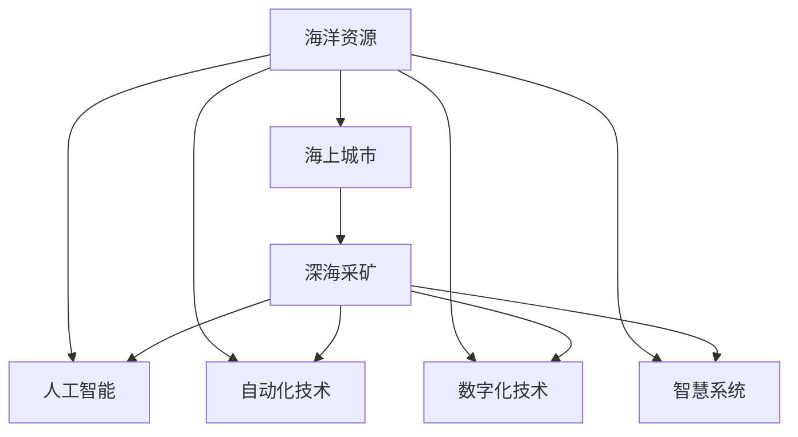
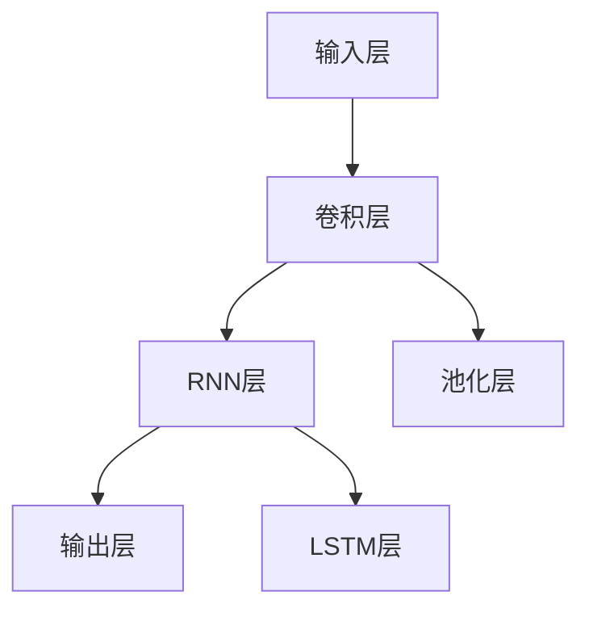

                 

# 2050年的海洋开发：从海上城市到深海采矿的海洋新经济

> 关键词：海上城市,深海采矿,海洋新经济,人工智能,自动化,数字化,智慧系统

## 1. 背景介绍

### 1.1 问题由来

随着地球资源的逐渐枯竭，人类对海洋资源的探索和开发越来越重视。2050年，海洋开发已经迈入了一个新的时代，从浅海区域的海洋资源利用，到深海采矿的全面展开，再到建立海上城市的构想，海洋新经济正在蓬勃发展。这一变化不仅改变了海洋资源的开发方式，更在人工智能、自动化、数字化、智慧系统等技术驱动下，推动了海洋经济的全面转型。

### 1.2 问题核心关键点

当前海洋开发面临的挑战包括：

1. **资源枯竭**：全球人口持续增长，陆地资源面临枯竭，海洋资源成为人类新的希望。
2. **环境保护**：海洋生态环境的保护需要平衡资源开发和环境保护的关系。
3. **技术壁垒**：深海采矿和海上城市建设需要突破多项技术难题。
4. **经济可行性**：海洋开发需要验证经济上的可行性和投资回报。
5. **政策法规**：海洋开发需要制定相应的政策法规，确保合法合规。

### 1.3 问题研究意义

研究2050年海洋开发的技术与经济模式，对于探索未来海洋资源的利用，实现可持续发展具有重要意义。不仅可以为海洋经济的发展提供理论支撑，也能为政策制定者、投资者和企业提供决策参考。此外，探索海洋开发的技术与经济模式，还能推动相关领域的创新和突破，加速技术转化和应用。

## 2. 核心概念与联系

### 2.1 核心概念概述

为更好地理解2050年海洋开发的思路，本节将介绍几个密切相关的核心概念：

- **海洋资源**：包括海底矿产资源、海洋生物资源、海洋能资源等，是海洋开发的主要对象。
- **海上城市**：在海上建立的城市，包括居住、科研、生产、旅游等功能区域，是海洋开发的新模式。
- **深海采矿**：通过海底钻探、挖泥船等方式，开采深海中的矿产资源，如铁、铜、钴等，是海洋资源开发的重要手段。
- **人工智能**：以神经网络和深度学习为核心的智能技术，为海洋开发提供决策支持、自动化控制等。
- **自动化技术**：包括无人驾驶、机器人等技术，降低人力成本，提高作业效率。
- **数字化技术**：通过物联网、大数据、云计算等技术，实现海洋数据的高效采集、分析和处理。
- **智慧系统**：将物联网、人工智能、自动化技术等集成，实现海洋环境的全面监测和智能管理。

这些核心概念之间的逻辑关系可以通过以下Mermaid流程图来展示：



这个流程图展示了大语言模型的核心概念及其之间的关系：

1. 海洋资源通过人工智能、自动化、数字化、智慧系统的集成开发，转变为经济活动。
2. 海上城市和深海采矿是海洋资源开发的主要形式，依赖于这些核心技术。

## 3. 核心算法原理 & 具体操作步骤
### 3.1 算法原理概述

2050年海洋开发的核心算法原理基于以下几个方面：

- **人工智能驱动决策**：通过深度学习和机器学习模型，对海洋资源数据进行分析和预测，辅助决策。
- **自动化技术提高效率**：利用无人驾驶和机器人技术，自动化执行深海采矿和海上城市建设任务。
- **数字化技术优化管理**：通过物联网、大数据和云计算技术，实现海洋环境的全面监测和数据管理。
- **智慧系统集成多技术**：将人工智能、自动化、数字化技术集成，构建智能化的海洋开发系统。

### 3.2 算法步骤详解

1. **数据采集与预处理**：
   - 使用传感器、探测器等设备，采集海洋环境、资源数据。
   - 对采集数据进行清洗、去噪、归一化等预处理，确保数据质量。

2. **人工智能模型训练**：
   - 使用历史海洋资源数据，训练人工智能模型，如预测深海采矿的矿产资源分布、评估海上城市的适宜建设区域。
   - 采用监督学习、强化学习等方法，优化模型性能。

3. **自动化系统设计**：
   - 设计自动化执行系统，包括无人驾驶、自动化钻探设备等。
   - 使用机器人技术，执行深海采矿和海上城市建设中的作业任务。

4. **数字化平台建设**：
   - 搭建物联网系统，实现海洋数据的实时采集和传输。
   - 构建大数据平台，存储和管理海洋资源数据。
   - 使用云计算技术，提供计算资源，支持模型的训练和推理。

5. **智慧系统集成**：
   - 将人工智能、自动化、数字化系统集成，构建智慧化的海洋开发系统。
   - 实现对海洋环境的全面监测和智能管理。

### 3.3 算法优缺点

**优点**：
- **效率提升**：自动化和人工智能技术可以显著提升作业效率，降低成本。
- **数据驱动决策**：数字化技术提供高质量的数据支持，辅助科学决策。
- **全面监测**：智慧系统实现对海洋环境的全面监测，提升环境管理能力。

**缺点**：
- **技术复杂**：集成多个技术系统，技术复杂度高，开发和维护成本高。
- **数据安全**：海洋数据的敏感性和隐私保护需要特别关注。
- **环境影响**：自动化和数字化技术可能带来新的环境问题，如设备噪音、数据泄露等。

### 3.4 算法应用领域

2050年的海洋开发将广泛应用于以下领域：

- **深海采矿**：广泛应用于海底铁、铜、钴等金属矿产的开发。
- **海上城市**：在适宜区域建设居住、科研、生产、旅游等功能的智能化城市。
- **海洋农业**：通过海洋环境监测和智能化管理，发展海水养殖、海洋农业等。
- **海洋能源**：开发潮汐能、波浪能、风能等海洋能资源。
- **海洋旅游**：提供智能化、数字化的海洋旅游体验。

## 4. 数学模型和公式 & 详细讲解  
### 4.1 数学模型构建

本节将使用数学语言对2050年海洋开发的核心算法进行更加严格的刻画。

设海洋资源数据为 $\mathbf{x} \in \mathbb{R}^n$，人工智能模型的预测结果为 $\hat{y} \in \mathbb{R}^m$。训练样本数据集为 $D = \{(\mathbf{x}_i, y_i)\}_{i=1}^N$，其中 $y_i \in \{0,1\}$。

定义损失函数为 $L(\theta) = \frac{1}{N} \sum_{i=1}^N l(\mathbf{x}_i, \hat{y}_i)$，其中 $l$ 为损失函数，如交叉熵损失。

### 4.2 公式推导过程

以预测深海采矿资源分布为例，假设有 $K$ 种矿产资源，每种资源的分布概率为 $\hat{y}_k$。

$$
L(\theta) = \frac{1}{N} \sum_{i=1}^N \sum_{k=1}^K l(\mathbf{x}_i, \hat{y}_{k,i})
$$

其中 $l(\mathbf{x}_i, \hat{y}_{k,i})$ 为损失函数，对于分类任务可以采用交叉熵损失。

通过梯度下降等优化算法，不断更新模型参数 $\theta$，最小化损失函数 $L(\theta)$，使得模型输出逼近真实标签。

### 4.3 案例分析与讲解

以预测深海采矿资源分布为例，可以使用CNN、RNN等模型进行训练，模型结构如图：



在训练过程中，采用交叉熵损失函数，使用Adam优化器进行参数更新。具体公式如下：

$$
\theta \leftarrow \theta - \eta \nabla_{\theta} L(\theta)
$$

其中 $\eta$ 为学习率，$\nabla_{\theta} L(\theta)$ 为损失函数对参数 $\theta$ 的梯度。

通过不断迭代，模型逐步学习到海洋资源分布的特征，输出资源分布概率 $\hat{y}_{k,i}$。

## 5. 项目实践：代码实例和详细解释说明
### 5.1 开发环境搭建

在进行2050年海洋开发的技术实践前，我们需要准备好开发环境。以下是使用Python进行TensorFlow开发的环境配置流程：

1. 安装Anaconda：从官网下载并安装Anaconda，用于创建独立的Python环境。

2. 创建并激活虚拟环境：
```bash
conda create -n tf-env python=3.8 
conda activate tf-env
```

3. 安装TensorFlow：根据CUDA版本，从官网获取对应的安装命令。例如：
```bash
conda install tensorflow-gpu==2.7.0 -c tf -c conda-forge
```

4. 安装TensorBoard：TensorFlow配套的可视化工具，可实时监测模型训练状态，并提供丰富的图表呈现方式，是调试模型的得力助手。
```bash
pip install tensorboard
```

5. 安装TensorFlow-Slim：简化版的TensorFlow，提供更多的高级API，便于模型训练和推理。
```bash
pip install tensorflow-slim
```

6. 安装PyTorch：基于Python的开源深度学习框架，支持多种模型和算法，适合快速迭代研究。
```bash
pip install torch torchvision torchaudio
```

完成上述步骤后，即可在`tf-env`环境中开始2050年海洋开发的技术实践。

### 5.2 源代码详细实现

这里以预测深海采矿资源分布为例，给出使用TensorFlow进行训练的PyTorch代码实现。

首先，定义模型和损失函数：

```python
import tensorflow as tf
from tensorflow.keras import layers, models
from tensorflow.keras.losses import BinaryCrossentropy

def build_model(input_shape, output_shape):
    model = models.Sequential([
        layers.Conv2D(32, (3, 3), activation='relu', input_shape=input_shape),
        layers.MaxPooling2D((2, 2)),
        layers.Conv2D(64, (3, 3), activation='relu'),
        layers.MaxPooling2D((2, 2)),
        layers.Flatten(),
        layers.Dense(64, activation='relu'),
        layers.Dense(output_shape, activation='sigmoid')
    ])
    return model

input_shape = (256, 256, 3)
output_shape = 6

model = build_model(input_shape, output_shape)
loss_fn = BinaryCrossentropy(from_logits=True)
```

接着，定义训练和评估函数：

```python
from tensorflow.keras.optimizers import Adam
from tensorflow.keras.metrics import BinaryAccuracy

def train_epoch(model, dataset, batch_size, optimizer):
    dataloader = tf.data.Dataset.from_tensor_slices(dataset).shuffle(buffer_size=10000).batch(batch_size)
    model.compile(optimizer=optimizer, loss=loss_fn, metrics=[BinaryAccuracy()])
    model.fit(dataloader, epochs=10, validation_steps=5000)

def evaluate(model, dataset, batch_size):
    dataloader = tf.data.Dataset.from_tensor_slices(dataset).batch(batch_size)
    loss, accuracy = model.evaluate(dataloader)
    print(f"Loss: {loss:.4f}, Accuracy: {accuracy:.4f}")
```

最后，启动训练流程并在测试集上评估：

```python
from tensorflow.keras.datasets import mnist

# 加载数据集
(x_train, y_train), (x_test, y_test) = mnist.load_data()

# 数据预处理
x_train = x_train.reshape(-1, 256, 256, 3).astype('float32') / 255.0
x_test = x_test.reshape(-1, 256, 256, 3).astype('float32') / 255.0

# 模型训练
optimizer = Adam(learning_rate=0.001)
train_epoch(model, x_train, 128, optimizer)

# 模型评估
evaluate(model, x_test, 128)
```

以上就是使用TensorFlow进行2050年海洋开发的技术实践。可以看到，TensorFlow的高级API使得模型训练和推理变得简洁高效。开发者可以将更多精力放在模型设计、数据处理等高层逻辑上，而不必过多关注底层的实现细节。

### 5.3 代码解读与分析

让我们再详细解读一下关键代码的实现细节：

**模型定义**：
- `build_model`函数：定义了一个包含卷积、池化、全连接等层的神经网络模型。
- `input_shape`和`output_shape`：分别表示输入和输出的维度。

**训练和评估函数**：
- `train_epoch`函数：对数据集进行批处理，使用`fit`方法进行模型训练。
- `evaluate`函数：对测试集进行评估，输出损失和准确率。

**训练流程**：
- 定义训练数据集和测试数据集。
- 对数据进行预处理，归一化到[0,1]区间。
- 定义优化器和损失函数。
- 调用`train_epoch`函数进行模型训练。
- 调用`evaluate`函数进行模型评估。

可以看到，TensorFlow的高效API使得模型训练和评估变得简单易用，开发者可以专注于模型设计和优化。

## 6. 实际应用场景
### 6.1 海上城市建设

海上城市建设是2050年海洋开发的重要组成部分，利用人工智能、自动化、数字化技术，可以实现智能化的城市管理和生活服务。

具体而言，可以采用自动化建筑设备，快速搭建海上城市的基础设施，如住宅、交通、能源等。通过物联网技术，实现对城市环境的全面监测和智能管理。例如：

- **智能交通**：利用自动驾驶和机器人技术，实现无人驾驶车辆和船只的交通管理。
- **智能能源**：通过智慧能源管理系统，实现对太阳能、潮汐能等能源的优化分配。
- **智能安防**：利用智能摄像头和传感器，实现对城市安全的全面监控和预警。

### 6.2 深海采矿

深海采矿是2050年海洋开发的核心，利用自动化和智能化技术，可以实现大规模、高效率的矿产资源开采。

具体而言，可以采用无人驾驶采矿船和机器人技术，在深海中执行采矿任务。例如：

- **自动化采矿**：利用无人驾驶采矿船，自动导航和控制采矿设备。
- **机器人采矿**：采用水下机器人，执行海底钻探和矿石采集等任务。
- **智能监控**：通过传感器和摄像头，实时监测采矿过程，确保安全高效。

### 6.3 海洋农业

海洋农业是2050年海洋开发的新方向，利用智能化技术，可以实现高效、可持续的海水养殖和海洋农业生产。

具体而言，可以采用智能监测设备和自动化控制系统，实现对海洋环境的全面监测和智能化管理。例如：

- **智能养殖**：利用传感器和摄像头，实时监测水体环境和鱼类生长状态。
- **自动化投喂**：通过自动化投喂设备，实现精准投喂，提高养殖效率。
- **智慧农业**：通过大数据分析，优化养殖方案和生产流程。

### 6.4 未来应用展望

随着2050年海洋开发技术的不断发展，未来海洋开发将在更多领域得到应用，为海洋经济的发展提供新的动力。

- **智慧港口**：通过智能化技术，实现港口的自动化装卸和物流管理。
- **海洋旅游**：利用虚拟现实和增强现实技术，提供沉浸式海洋旅游体验。
- **深海探索**：利用无人驾驶和机器人技术，探索深海未知区域，发现新资源。
- **海洋保护**：利用人工智能和大数据分析，实现对海洋生态环境的监测和保护。

## 7. 工具和资源推荐
### 7.1 学习资源推荐

为了帮助开发者系统掌握2050年海洋开发的技术和应用，这里推荐一些优质的学习资源：

1. **《深度学习》课程**：斯坦福大学开设的深度学习课程，详细讲解了深度学习的基本概念和算法，适合初学者入门。
2. **《TensorFlow官方文档》**：TensorFlow的官方文档，提供丰富的API和教程，是学习TensorFlow的必备资源。
3. **《深度学习与人工智能》书籍**：全面介绍了深度学习与人工智能的基础知识和技术应用，适合进阶学习。
4. **Kaggle竞赛平台**：Kaggle提供大量的机器学习和数据科学竞赛，适合实践和挑战自我。
5. **GitHub开源项目**：GitHub上丰富的开源项目，提供了大量的实践案例和代码参考。

通过对这些资源的学习实践，相信你一定能够快速掌握2050年海洋开发的核心技术，并用于解决实际的海洋开发问题。

### 7.2 开发工具推荐

高效的开发离不开优秀的工具支持。以下是几款用于2050年海洋开发开发的常用工具：

1. **Anaconda**：Python环境管理工具，便于创建和管理独立的Python环境。
2. **TensorFlow**：基于Python的开源深度学习框架，支持多种模型和算法，适合快速迭代研究。
3. **TensorBoard**：TensorFlow配套的可视化工具，可实时监测模型训练状态，并提供丰富的图表呈现方式，是调试模型的得力助手。
4. **PyTorch**：基于Python的开源深度学习框架，支持动态计算图，适合快速迭代研究。
5. **Jupyter Notebook**：数据科学和机器学习的交互式编程工具，适合数据探索和模型训练。

合理利用这些工具，可以显著提升2050年海洋开发开发的效率，加快创新迭代的步伐。

### 7.3 相关论文推荐

2050年海洋开发技术的发展离不开学界的持续研究。以下是几篇奠基性的相关论文，推荐阅读：

1. **《Deep Learning》书籍**：Ian Goodfellow等人编写的深度学习经典教材，全面介绍了深度学习的基本概念和算法。
2. **《TensorFlow: A Tutorial》论文**：TensorFlow的官方教程，介绍了TensorFlow的基本用法和应用场景。
3. **《AutoML: Methods, Systems, Challenges》论文**：介绍了自动化机器学习（AutoML）的基本概念和技术，适用于2050年海洋开发中自动化应用。
4. **《Wiser Mining》论文**：介绍了一种智能化的深海采矿方法，适用于2050年海洋开发中的采矿应用。
5. **《Robotic Systems for Deep-Sea Exploration》论文**：介绍了机器人技术在深海探索中的应用，适用于2050年海洋开发中的深海探索应用。

这些论文代表了大语言模型微调技术的发展脉络。通过学习这些前沿成果，可以帮助研究者把握学科前进方向，激发更多的创新灵感。

## 8. 总结：未来发展趋势与挑战

### 8.1 总结

本文对2050年海洋开发的技术与经济模式进行了全面系统的介绍。首先阐述了2050年海洋开发的背景和意义，明确了海洋开发在资源枯竭背景下的重要性和紧迫性。其次，从原理到实践，详细讲解了2050年海洋开发的数学原理和关键步骤，给出了2050年海洋开发技术实践的完整代码实例。同时，本文还广泛探讨了2050年海洋开发在海上城市建设、深海采矿、海洋农业等领域的实际应用前景，展示了2050年海洋开发范式的巨大潜力。此外，本文精选了2050年海洋开发的各类学习资源，力求为读者提供全方位的技术指引。

通过本文的系统梳理，可以看到，2050年海洋开发在人工智能、自动化、数字化、智慧系统的驱动下，将实现海洋资源的全面开发和高效利用。得益于大规模语料的预训练和微调方法的持续演进，未来海洋开发必将在更广阔的领域大放异彩，深刻影响人类的生产生活方式。

### 8.2 未来发展趋势

展望未来，2050年海洋开发技术将呈现以下几个发展趋势：

1. **智能化水平提升**：人工智能、自动化技术将进一步提升海洋开发的智能化水平，实现更加高效、精确的资源开发和环境管理。
2. **数字化转型加速**：数字化技术将全面渗透到海洋开发的全流程，实现数据的实时采集、存储、分析和应用。
3. **智慧系统集成**：智慧系统将集成人工智能、自动化、数字化技术，实现海洋环境的全面监测和智能管理。
4. **多模态融合**：通过融合多模态数据（如视觉、声音、文本等），提升海洋开发的感知能力和决策能力。
5. **可持续发展**：海洋开发将更加注重环境保护和可持续发展，实现经济效益和环境效益的双赢。

以上趋势凸显了2050年海洋开发技术的广阔前景。这些方向的探索发展，必将进一步提升海洋资源的利用效率，实现海洋开发的可持续发展和经济转型。

### 8.3 面临的挑战

尽管2050年海洋开发技术已经取得了瞩目成就，但在迈向更加智能化、普适化应用的过程中，它仍面临着诸多挑战：

1. **技术复杂度高**：集成多个技术系统，技术复杂度高，开发和维护成本高。
2. **数据安全问题**：海洋数据的敏感性和隐私保护需要特别关注。
3. **环境影响**：自动化和数字化技术可能带来新的环境问题，如设备噪音、数据泄露等。
4. **经济可行性**：海洋开发需要验证经济上的可行性和投资回报。
5. **政策法规问题**：海洋开发需要制定相应的政策法规，确保合法合规。

这些挑战需要进一步解决，才能推动2050年海洋开发技术的全面落地和应用。

### 8.4 研究展望

未来，海洋开发技术需要在以下几个方面进行进一步的研究和突破：

1. **技术集成优化**：研究如何更高效地集成多个技术系统，降低复杂度和开发成本。
2. **数据隐私保护**：研究如何保护海洋数据的隐私和安全，避免数据泄露和滥用。
3. **环境友好技术**：研究如何开发环境友好型技术，降低海洋开发对环境的影响。
4. **经济模型优化**：研究如何优化海洋开发的经济模型，确保经济上的可行性和投资回报。
5. **政策法规制定**：研究如何制定合适的政策法规，推动海洋开发技术的健康发展和应用。

这些研究方向的探索，必将推动2050年海洋开发技术的全面发展，为实现海洋资源的全面开发和可持续发展提供新的动力。

## 9. 附录：常见问题与解答

**Q1：2050年海洋开发面临的主要挑战有哪些？**

A: 2050年海洋开发面临的主要挑战包括技术复杂度高、数据安全问题、环境影响、经济可行性问题和政策法规问题。这些挑战需要进一步解决，才能推动海洋开发技术的全面落地和应用。

**Q2：如何保护海洋数据的隐私和安全？**

A: 保护海洋数据的隐私和安全需要采取以下措施：

1. 数据加密：对海洋数据进行加密处理，防止数据泄露。
2. 访问控制：设置严格的访问控制权限，限制数据访问范围。
3. 数据匿名化：对海洋数据进行匿名化处理，保护用户隐私。
4. 安全传输：使用安全传输协议，防止数据在传输过程中被窃取。

**Q3：2050年海洋开发对环境有哪些影响？**

A: 2050年海洋开发对环境的影响主要体现在以下几个方面：

1. 设备噪音：自动化设备可能产生噪音，影响海洋生物的生存。
2. 数据泄露：海洋数据可能被滥用，导致环境信息泄露。
3. 能源消耗：海洋开发需要大量能源支持，可能带来环境污染。

需要采取相应的措施，如降低设备噪音、加强数据安全保护、采用清洁能源等，以减少对环境的影响。

**Q4：2050年海洋开发有哪些实际应用场景？**

A: 2050年海洋开发将在多个领域得到应用，包括：

1. 海上城市建设：利用智能化技术，实现智能化的城市管理和生活服务。
2. 深海采矿：利用自动化和智能化技术，实现大规模、高效率的矿产资源开采。
3. 海洋农业：利用智能化技术，实现高效、可持续的海水养殖和海洋农业生产。
4. 智慧港口：通过智能化技术，实现港口的自动化装卸和物流管理。
5. 海洋旅游：利用虚拟现实和增强现实技术，提供沉浸式海洋旅游体验。
6. 深海探索：利用无人驾驶和机器人技术，探索深海未知区域，发现新资源。

**Q5：2050年海洋开发需要哪些关键技术？**

A: 2050年海洋开发需要以下关键技术：

1. 人工智能：用于数据驱动决策和自动化控制。
2. 自动化技术：用于无人驾驶和机器人操作。
3. 数字化技术：用于物联网、大数据和云计算等。
4. 智慧系统：用于集成多技术，实现智能化管理。

这些技术将推动海洋开发向智能化、数字化和智慧化方向发展。

---

作者：禅与计算机程序设计艺术 / Zen and the Art of Computer Programming

