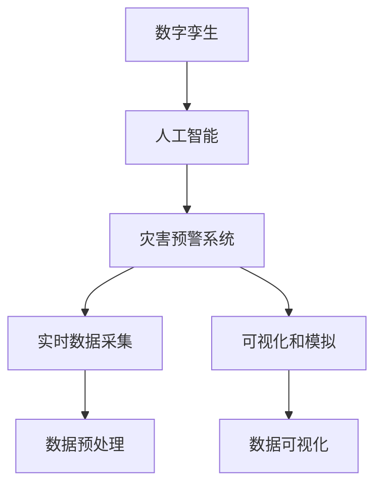

                 

## 1. 背景介绍

### 1.1 问题由来

进入21世纪以来，随着全球气候变化、城市化进程加速、人类活动密度增加，各类灾害事件频发且损失惨重，如地震、洪涝、台风、森林火灾、泥石流、地质滑坡等。传统灾害防控体系难以满足复杂多变的灾害场景需求，尤其是突发性强、传播速度快的灾害，常常造成巨大的人员伤亡和财产损失。

近年来，数字孪生和人工智能技术的兴起，为灾害防控带来了新的思路和方向。数字孪生技术通过创建虚拟世界，实时映射真实世界的动态变化，以可视化、模拟、预测等方式辅助决策。而人工智能技术在数据处理、模式识别、趋势预测等方面展现出卓越的能力，尤其擅长从海量数据中挖掘隐含信息，预测潜在风险。

利用数字孪生和人工智能技术，可以实现对自然灾害、突发事件的实时监测、预警和应对，为灾害防控提供科学决策依据。本文将探讨2050年灾害预防中，数字孪生与人工智能预警系统的结合，分析其工作原理和实际应用案例，展望未来发展趋势。

### 1.2 问题核心关键点

数字孪生和人工智能技术在灾害预防中的核心关键点包括：

- 数字孪生技术：创建虚拟世界模型，实时映射真实世界的变化，实现灾害场景的可视化、模拟和预测。
- 人工智能技术：利用机器学习、深度学习等算法，从海量数据中挖掘隐含模式，预测灾害趋势，辅助决策。
- 灾害预警系统：基于数字孪生和人工智能技术，构建灾害预警体系，实现灾害的早期识别和快速响应。

这些核心技术紧密结合，能够大幅提升灾害防控的准确性和及时性，降低灾害损失。

## 2. 核心概念与联系

### 2.1 核心概念概述

为更好地理解数字孪生与人工智能在灾害预防中的应用，本节将介绍几个密切相关的核心概念：

- 数字孪生(Digital Twin)：通过创建虚拟世界的动态模型，实时映射真实世界的物理和行为特征，支持仿真、分析和决策。
- 人工智能(AI)：利用机器学习、深度学习等算法，从数据中学习模型，实现智能推理和决策。
- 灾害预警系统：基于数字孪生和人工智能技术，构建的灾害预警平台，实现灾害的早期识别和快速响应。
- 实时数据采集：从各类传感器、监测设备中获取实时数据，作为数字孪生和人工智能算法的输入。
- 可视化和模拟：利用3D建模和仿真技术，对灾害场景进行可视化展示和模拟分析，辅助决策。

这些核心概念之间的逻辑关系可以通过以下Mermaid流程图来展示：



这个流程图展示了一系列概念之间的联系：

1. 数字孪生技术通过实时数据采集，构建虚拟世界模型。
2. 人工智能技术基于虚拟世界模型，进行数据预处理和智能推理。
3. 灾害预警系统集成数字孪生和人工智能技术，实现灾害的早期识别和快速响应。
4. 可视化和模拟技术，辅助决策和灾害场景的展示分析。

## 3. 核心算法原理 & 具体操作步骤

### 3.1 算法原理概述

基于数字孪生和人工智能的灾害预警系统，通过构建虚拟世界的动态模型，实时映射真实世界的物理和行为特征，利用机器学习、深度学习等算法，从海量数据中挖掘隐含模式，预测灾害趋势，辅助决策。其核心算法原理包括以下几个步骤：

1. **数据采集与预处理**：通过各类传感器、监测设备获取实时数据，并进行预处理，确保数据的时效性和准确性。
2. **虚拟世界建模**：利用数字孪生技术，构建虚拟世界的动态模型，实时映射真实世界的物理和行为特征。
3. **智能推理与预测**：基于虚拟世界模型，应用机器学习、深度学习等算法，从海量数据中挖掘隐含模式，预测灾害趋势。
4. **灾害预警与应对**：利用灾害预警系统，对预测结果进行分析评估，制定应急预案，实现灾害的早期识别和快速响应。
5. **可视化和模拟**：通过3D建模和仿真技术，对灾害场景进行可视化展示和模拟分析，辅助决策。

### 3.2 算法步骤详解

以下是数字孪生与人工智能在灾害预警系统中的具体算法步骤：

**Step 1: 数据采集与预处理**
- 部署各类传感器、监测设备，如地震仪、水位计、气象站等，实时采集灾害相关数据。
- 对采集数据进行预处理，包括去噪、归一化、数据清洗等操作，确保数据的准确性和时效性。

**Step 2: 虚拟世界建模**
- 利用数字孪生技术，构建虚拟世界的动态模型。通常采用3D建模软件，如Blender、Maya等，创建详细的地理、地质、气象模型。
- 将采集到的实时数据，映射到虚拟世界中，实现对真实世界的动态模拟。

**Step 3: 智能推理与预测**
- 应用机器学习、深度学习等算法，对虚拟世界模型进行智能推理和预测。如利用时间序列分析、异常检测等算法，预测地震、洪涝、台风等灾害事件的发生概率。
- 集成多个传感器和监测设备的数据，构建综合性的预测模型，提高预测的准确性。

**Step 4: 灾害预警与应对**
- 基于预测结果，利用灾害预警系统，进行风险评估和决策支持。如地震预警系统可在地震发生前，发出预警，通知相关人员撤离。
- 制定应急预案，如地震发生时，自动开启避难所和紧急供水系统，减少灾害损失。

**Step 5: 可视化和模拟**
- 利用3D建模和仿真技术，对灾害场景进行可视化展示和模拟分析。如在地震发生前，可以模拟地震波的传播路径，评估建筑物受损程度。
- 通过虚拟现实技术，对灾害预警信息进行可视化展示，辅助决策和应急响应。

### 3.3 算法优缺点

基于数字孪生和人工智能的灾害预警系统具有以下优点：
1. **实时性**：通过实时数据采集和虚拟世界建模，实现对灾害的动态监测和预测，提高了预警的及时性。
2. **准确性**：利用机器学习和深度学习等算法，从海量数据中挖掘隐含模式，提高了预测的准确性。
3. **可视化**：通过3D建模和仿真技术，对灾害场景进行可视化展示和模拟分析，辅助决策。
4. **预测性**：能够预测未来灾害的发生概率，提前采取措施，减少灾害损失。

同时，该系统也存在以下局限性：
1. **数据依赖**：系统依赖于各类传感器和监测设备，数据的质量和完整性直接影响预警效果。
2. **模型复杂**：构建虚拟世界模型和预测模型，需要复杂的算法和大量的计算资源，系统构建和维护成本较高。
3. **技术门槛**：需要专业技术人员进行数据采集、模型构建和算法实现，技术门槛较高。
4. **模拟精度**：虚拟世界模型的精度直接影响模拟结果的准确性，对模型的精细程度要求较高。

尽管存在这些局限性，但就目前而言，基于数字孪生和人工智能的灾害预警系统仍是最先进的灾害防控手段。未来相关研究的重点在于如何进一步降低技术门槛，提高系统的鲁棒性和预测精度，同时兼顾成本和可用性等因素。

### 3.4 算法应用领域

基于数字孪生和人工智能的灾害预警系统，已在多个领域得到应用，包括：

- 地震预警：利用地震仪、水位计等设备，构建虚拟世界的地震模型，预测地震的发生概率，实现地震预警。
- 洪水预警：通过水位计、降雨量计等设备，实时监测水位和降雨量，构建虚拟世界的洪水模型，预测洪水风险。
- 台风预警：利用气象站、雷达站等设备，实时监测气象数据，构建虚拟世界的台风模型，预测台风路径和强度。
- 森林火灾预警：利用红外监测设备，实时监测林火热点，构建虚拟世界的火灾模型，预测火灾蔓延趋势。
- 地质滑坡预警：利用位移计、加速度计等设备，实时监测地质变化，构建虚拟世界的滑坡模型，预测滑坡风险。

此外，基于数字孪生和人工智能的灾害预警系统，还应用于智慧城市、应急救援、灾害管理等多个领域，为社会安全和国家治理提供了重要支持。

## 4. 数学模型和公式 & 详细讲解 & 举例说明

### 4.1 数学模型构建

本节将使用数学语言对基于数字孪生和人工智能的灾害预警系统进行更加严格的刻画。

假设灾害预警系统中的虚拟世界模型为 $M$，实时采集的数据集为 $D=\{(x_i,y_i)\}_{i=1}^N, x_i \in \mathbb{R}^d, y_i \in \mathbb{R}^k$，其中 $d$ 为数据维度，$k$ 为预测目标的维度。

定义灾害预警系统在数据样本 $(x,y)$ 上的损失函数为 $\ell(M, y)$，则在数据集 $D$ 上的经验风险为：

$$
\mathcal{L}(M) = \frac{1}{N} \sum_{i=1}^N \ell(M, y_i)
$$

其中 $\ell(M, y)$ 为预测误差函数，如均方误差、交叉熵等。微调的目标是最小化经验风险，即找到最优模型参数：

$$
M^* = \mathop{\arg\min}_{M} \mathcal{L}(M)
$$

在实践中，我们通常使用基于梯度的优化算法（如SGD、Adam等）来近似求解上述最优化问题。设 $\eta$ 为学习率，$\lambda$ 为正则化系数，则模型参数 $M$ 的更新公式为：

$$
M \leftarrow M - \eta \nabla_{M}\mathcal{L}(M) - \eta\lambda M
$$

其中 $\nabla_{M}\mathcal{L}(M)$ 为损失函数对模型参数 $M$ 的梯度，可通过反向传播算法高效计算。

### 4.2 公式推导过程

以下我们以地震预警系统为例，推导损失函数及其梯度的计算公式。

假设虚拟世界模型为 $M$，输入为 $x \in \mathbb{R}^d$，输出为 $y \in \mathbb{R}$，表示地震的发生概率。模型预测输出的均方误差损失函数定义为：

$$
\ell(M, y) = \frac{1}{2} \left[ (y - \hat{y})^2 \right]
$$

其中 $\hat{y}=M(x)$ 为模型对输入 $x$ 的预测输出。将其代入经验风险公式，得：

$$
\mathcal{L}(M) = \frac{1}{N} \sum_{i=1}^N \ell(M, y_i) = \frac{1}{N} \sum_{i=1}^N \frac{1}{2} \left[ (y_i - M(x_i))^2 \right]
$$

根据链式法则，损失函数对模型参数 $M$ 的梯度为：

$$
\frac{\partial \mathcal{L}(M)}{\partial M} = \frac{1}{N} \sum_{i=1}^N -\left[ (y_i - M(x_i))M(x_i) \right]
$$

其中 $\frac{\partial M(x_i)}{\partial M}$ 可进一步递归展开，利用自动微分技术完成计算。

在得到损失函数的梯度后，即可带入模型参数更新公式，完成模型的迭代优化。重复上述过程直至收敛，最终得到适应灾害预警任务的最优模型参数 $M^*$。

## 5. 项目实践：代码实例和详细解释说明

### 5.1 开发环境搭建

在进行灾害预警系统开发前，我们需要准备好开发环境。以下是使用Python进行PyTorch开发的环境配置流程：

1. 安装Anaconda：从官网下载并安装Anaconda，用于创建独立的Python环境。

2. 创建并激活虚拟环境：
```bash
conda create -n pytorch-env python=3.8 
conda activate pytorch-env
```

3. 安装PyTorch：根据CUDA版本，从官网获取对应的安装命令。例如：
```bash
conda install pytorch torchvision torchaudio cudatoolkit=11.1 -c pytorch -c conda-forge
```

4. 安装TensorFlow：
```bash
pip install tensorflow
```

5. 安装PyTorch的GPU支持：
```bash
pip install torch torchvision torchtext
```

完成上述步骤后，即可在`pytorch-env`环境中开始开发实践。

### 5.2 源代码详细实现

这里我们以地震预警系统为例，给出使用PyTorch进行模型训练的PyTorch代码实现。

首先，定义地震预警系统中的数据处理函数：

```python
from torch.utils.data import Dataset
from torch.utils.data import DataLoader
import numpy as np
import torch

class EarthquakeDataset(Dataset):
    def __init__(self, x, y):
        self.x = x
        self.y = y
        
    def __len__(self):
        return len(self.x)
    
    def __getitem__(self, idx):
        x = self.x[idx]
        y = self.y[idx]
        return x, y
```

然后，定义模型和优化器：

```python
import torch.nn as nn
import torch.optim as optim

class EarthquakeModel(nn.Module):
    def __init__(self, input_dim, output_dim):
        super(EarthquakeModel, self).__init__()
        self.fc1 = nn.Linear(input_dim, 64)
        self.fc2 = nn.Linear(64, 32)
        self.fc3 = nn.Linear(32, output_dim)
        
    def forward(self, x):
        x = F.relu(self.fc1(x))
        x = F.relu(self.fc2(x))
        x = torch.sigmoid(self.fc3(x))
        return x

model = EarthquakeModel(input_dim=10, output_dim=1)
optimizer = optim.Adam(model.parameters(), lr=0.001)
```

接着，定义训练和评估函数：

```python
def train_model(model, train_loader, epochs, optimizer):
    model.train()
    for epoch in range(epochs):
        for batch_idx, (x, y) in enumerate(train_loader):
            optimizer.zero_grad()
            output = model(x)
            loss = nn.MSELoss()(output, y)
            loss.backward()
            optimizer.step()
        print(f'Epoch {epoch+1}, Loss: {loss.item()}')
    
def evaluate_model(model, test_loader):
    model.eval()
    total_loss = 0
    with torch.no_grad():
        for x, y in test_loader:
            output = model(x)
            loss = nn.MSELoss()(output, y)
            total_loss += loss.item()
    print(f'Test Loss: {total_loss/len(test_loader)}')
```

最后，启动训练流程并在测试集上评估：

```python
train_loader = DataLoader(EarthquakeDataset(x_train, y_train), batch_size=32, shuffle=True)
test_loader = DataLoader(EarthquakeDataset(x_test, y_test), batch_size=32, shuffle=False)

train_model(model, train_loader, epochs=10, optimizer=optimizer)
evaluate_model(model, test_loader)
```

以上就是使用PyTorch对地震预警系统进行模型训练的完整代码实现。可以看到，利用PyTorch，我们可以用相对简洁的代码完成模型的构建、训练和评估。

### 5.3 代码解读与分析

让我们再详细解读一下关键代码的实现细节：

**EarthquakeDataset类**：
- `__init__`方法：初始化输入和输出数据。
- `__len__`方法：返回数据集的大小。
- `__getitem__`方法：获取指定索引的样本数据。

**EarthquakeModel类**：
- `__init__`方法：定义模型的结构，包括三个全连接层。
- `forward`方法：前向传播计算输出，包括两个ReLU激活和一个sigmoid输出。

**模型训练与评估**：
- `train_model`函数：迭代训练模型，输出每个epoch的损失。
- `evaluate_model`函数：在测试集上评估模型性能，输出测试集的平均损失。

**训练流程**：
- 定义训练集和测试集的数据加载器。
- 定义训练函数，迭代训练模型。
- 在测试集上评估模型性能。

## 6. 实际应用场景

### 6.1 智慧城市

基于数字孪生和人工智能的灾害预警系统，可以广泛应用于智慧城市的建设中。智慧城市通过集成各类传感器和监测设备，构建虚拟世界的数字孪生模型，实现对城市环境的全面监控。

在智慧城市中，可以部署各类传感器，实时监测环境变化，构建虚拟世界的动态模型。利用人工智能技术，对各类灾害风险进行预测和预警，提高城市应急响应能力。例如，通过监测气温、湿度、降雨量等数据，构建虚拟世界的洪水模型，预测洪水风险，及时发布预警信息，协助城市居民疏散。

### 6.2 应急救援

在应急救援场景中，基于数字孪生和人工智能的灾害预警系统，可以为救援人员提供实时的灾害信息。救援人员可以通过查看虚拟世界中的实时数据和预测结果，制定更科学合理的救援计划，提高救援效率。

例如，在地震发生时，利用虚拟世界的地震模型，实时监测地震波的传播路径和强度，预测建筑物受损程度，指导救援人员优先疏散受灾严重的区域。在洪水发生时，通过虚拟世界的洪水模型，预测洪水蔓延范围，协助救援人员进行灾后重建。

### 6.3 智慧农业

在智慧农业领域，基于数字孪生和人工智能的灾害预警系统，可以为农业生产提供科学决策支持。通过实时监测气象、土壤、作物等数据，构建虚拟世界的农业模型，预测灾害风险，指导农业生产。

例如，在干旱发生时，利用虚拟世界的气象模型，预测未来降雨趋势，指导农民合理灌溉。在病虫害发生时，通过虚拟世界的农作物模型，预测病虫害传播范围，及时采取防治措施，减少农业损失。

### 6.4 未来应用展望

随着数字孪生和人工智能技术的不断发展，基于这两项技术的灾害预警系统将在更多领域得到应用，为灾害防控提供科学决策支持。

在未来的智慧交通、智慧环保、智慧医疗等领域，通过构建虚拟世界的数字孪生模型，实时监测环境变化，利用人工智能技术，预测各类灾害风险，提高应急响应能力，减少灾害损失。

同时，随着物联网、边缘计算等技术的普及，实时数据采集和处理能力将进一步提升，灾害预警系统的覆盖面和精度将不断扩大，为社会的安全和稳定提供更有力的保障。

## 7. 工具和资源推荐

### 7.1 学习资源推荐

为了帮助开发者系统掌握数字孪生和人工智能在灾害预警中的应用，这里推荐一些优质的学习资源：

1. 《Digital Twin: Principles and Applications in Manufacturing and Supply Chain》系列博文：由数字孪生技术专家撰写，详细介绍了数字孪生的原理、实现方法和应用场景。

2. 《Artificial Intelligence in Environmental Disaster Management》书籍：介绍了人工智能在环境灾害管理中的应用，涵盖预测、预警、应急响应等多个方面。

3. 《Natural Disasters: Understanding Risk and Mitigation Strategies》课程：介绍了自然灾害的类型、特征、风险评估和应对策略，适用于灾害预警领域的学习。

4. 《Python Machine Learning》书籍：深入浅出地介绍了机器学习和深度学习的基础知识和应用技巧，是学习人工智能的必备资源。

5. 《Deep Learning with PyTorch》课程：由PyTorch官方提供，系统讲解了使用PyTorch进行深度学习模型的开发和训练，适合学习基于数字孪生和人工智能的灾害预警系统。

通过对这些资源的学习实践，相信你一定能够快速掌握数字孪生和人工智能在灾害预警中的应用，并用于解决实际的灾害防控问题。

### 7.2 开发工具推荐

高效的开发离不开优秀的工具支持。以下是几款用于数字孪生和人工智能开发的工具：

1. PyTorch：基于Python的开源深度学习框架，支持动态计算图，适合快速迭代研究。

2. TensorFlow：由Google主导开发的开源深度学习框架，生产部署方便，适合大规模工程应用。

3. Blender：开源3D建模软件，支持复杂的虚拟世界建模和渲染。

4. Maya：商业级3D建模软件，适用于影视、游戏等领域的高精度建模。

5. Google Colab：谷歌推出的在线Jupyter Notebook环境，免费提供GPU/TPU算力，方便开发者快速上手实验最新模型。

合理利用这些工具，可以显著提升数字孪生和人工智能在灾害预警中的应用开发效率，加快创新迭代的步伐。

### 7.3 相关论文推荐

数字孪生和人工智能在灾害预警领域的研究已经取得了一定的进展，以下是几篇奠基性的相关论文，推荐阅读：

1. Digital Twins in the Context of Disaster Management: Challenges, Opportunities and Directions：综述了数字孪生技术在灾害管理中的应用，探讨了面临的挑战和未来的研究方向。

2. Machine Learning Approaches for Environmental Disaster Prediction and Mitigation：总结了机器学习和深度学习在环境灾害预测和应对中的应用，提出了一些新的方法和技术。

3. Real-time Disaster Prediction Using Digital Twins and Machine Learning：提出了一种基于数字孪生和机器学习的实时灾害预测方法，展示了其在灾害预警中的应用效果。

4. Earthquake Prediction Using Deep Learning and Digital Twins：利用深度学习和数字孪生技术，构建了地震预测模型，实现了地震的早期识别和预警。

5. Flood Prediction and Management with Digital Twins and AI：利用数字孪生和人工智能技术，构建了洪水预测和管理系统，展示了其高精度和实时性。

这些论文代表了大规模灾害预警技术的发展脉络。通过学习这些前沿成果，可以帮助研究者把握学科前进方向，激发更多的创新灵感。

## 8. 总结：未来发展趋势与挑战

### 8.1 总结

本文对基于数字孪生和人工智能的灾害预警系统进行了全面系统的介绍。首先阐述了数字孪生技术和大语言模型微调的研究背景和意义，明确了两者在灾害预警中的独特价值。其次，从原理到实践，详细讲解了系统的工作流程和关键步骤，给出了基于PyTorch的代码实现。同时，本文还广泛探讨了系统的实际应用案例和未来发展趋势，展示了其广阔的应用前景。

通过本文的系统梳理，可以看到，基于数字孪生和人工智能的灾害预警系统正在成为灾害防控的重要手段，极大地提升了灾害预警的及时性和准确性。未来，伴随技术的发展和应用的深入，该系统必将在更多领域得到应用，为社会安全和国家治理提供更有力的保障。

### 8.2 未来发展趋势

展望未来，数字孪生和人工智能在灾害预警中的应用将呈现以下几个发展趋势：

1. **实时性**：随着传感器和监测设备的发展，实时数据采集能力将进一步提升，灾害预警系统的覆盖面和精度将不断扩大。

2. **智能化**：利用人工智能技术，从海量数据中挖掘隐含模式，预测灾害趋势，提高预警的准确性。

3. **可视化**：通过3D建模和仿真技术，对灾害场景进行可视化展示和模拟分析，辅助决策。

4. **模型可解释性**：利用可解释性技术，提高模型的决策透明度和可理解性，增强系统的可信度。

5. **融合多模态数据**：结合卫星遥感、物联网、气象数据等多模态信息，提高灾害预警的全面性和准确性。

6. **持续学习**：随着数据分布的变化，系统需要不断学习新数据，保持模型的鲁棒性和适应性。

以上趋势凸显了数字孪生和人工智能在灾害预警中的强大潜力。这些方向的探索发展，必将进一步提升灾害预警系统的性能和应用范围，为社会的安全和稳定提供更有力的保障。

### 8.3 面临的挑战

尽管数字孪生和人工智能在灾害预警中展现出了巨大的潜力，但在实际应用中仍面临诸多挑战：

1. **数据质量**：数据采集设备的精度和稳定性直接影响预警效果，数据质量不高会导致预警失真。

2. **模型复杂性**：构建虚拟世界模型和预测模型需要复杂的算法和大量的计算资源，系统构建和维护成本较高。

3. **技术门槛**：需要专业技术人员进行数据采集、模型构建和算法实现，技术门槛较高。

4. **模拟精度**：虚拟世界模型的精度直接影响模拟结果的准确性，对模型的精细程度要求较高。

5. **伦理与安全**：系统采集和处理敏感数据，需要关注数据隐私和伦理问题，确保系统安全可靠。

尽管存在这些挑战，但通过不断技术迭代和优化，数字孪生和人工智能在灾害预警中的应用前景仍然广阔。相信随着学界和产业界的共同努力，这些挑战终将一一克服，数字孪生和人工智能必将在构建安全、可靠、智能的灾害防控体系中发挥越来越重要的作用。

### 8.4 研究展望

面向未来，数字孪生和人工智能在灾害预警领域的研究方向包括以下几个方面：

1. **融合多源数据**：结合卫星遥感、物联网、气象数据等多源信息，提高灾害预警的全面性和准确性。

2. **模型可解释性**：利用可解释性技术，提高模型的决策透明度和可理解性，增强系统的可信度。

3. **持续学习与演化**：随着数据分布的变化，系统需要不断学习新数据，保持模型的鲁棒性和适应性。

4. **自动化模型构建**：开发自动化模型构建工具，降低技术门槛，提高系统的可操作性。

5. **融合其他智能技术**：将其他智能技术，如知识图谱、因果推理、强化学习等，与数字孪生和人工智能进行更深入的融合，多路径协同发力，共同推动灾害预警技术的进步。

这些研究方向的探索，必将引领数字孪生和人工智能在灾害预警中的应用迈向更高的台阶，为构建安全、可靠、智能的灾害防控体系提供更强大的技术支持。

## 9. 附录：常见问题与解答

**Q1：数字孪生和人工智能在灾害预警中的应用是否具有通用性？**

A: 数字孪生和人工智能在灾害预警中的应用具有一定的通用性，适用于不同类型的灾害预警。然而，不同类型的灾害预警具有不同的特点，需要根据具体场景进行定制化的设计。例如，地震预警需要监测地震波的传播路径和强度，洪水预警需要监测水位和降雨量，泥石流预警需要监测地质变化等。

**Q2：数字孪生和人工智能在灾害预警中的数据依赖如何降低？**

A: 数字孪生和人工智能在灾害预警中依赖于各类传感器和监测设备，数据的质量和完整性直接影响预警效果。为了降低数据依赖，可以采用以下方法：
1. 使用多源数据融合技术，结合不同传感器和监测设备的数据，提高数据的多样性和可靠性。
2. 引入人工干预和审核机制，确保数据的准确性和完整性。
3. 利用数据增强技术，对采集到的数据进行预处理和清洗，减少噪声和错误。

**Q3：数字孪生和人工智能在灾害预警中如何提高模型的鲁棒性？**

A: 数字孪生和人工智能在灾害预警中，模型的鲁棒性直接影响到预警的准确性和及时性。为了提高模型的鲁棒性，可以采用以下方法：
1. 引入对抗训练技术，在训练过程中加入对抗样本，提高模型对噪声和干扰的鲁棒性。
2. 利用正则化技术，如L2正则、Dropout等，防止模型过拟合，提高模型的泛化能力。
3. 使用数据增强技术，对训练数据进行改写和扩充，提高模型的泛化能力。
4. 引入模型集成技术，将多个模型进行集成，取平均输出，提高模型的鲁棒性。

**Q4：数字孪生和人工智能在灾害预警中的模型可解释性如何提升？**

A: 数字孪生和人工智能在灾害预警中，模型的可解释性直接影响到预警的可信度和决策透明度。为了提升模型的可解释性，可以采用以下方法：
1. 利用可解释性技术，如SHAP、LIME等，对模型进行可视化解释，展示模型内部工作机制。
2. 引入模型调试和验证机制，对模型进行定期审核和验证，确保模型的正确性和可信度。
3. 引入人工干预和审核机制，对模型的决策过程进行监督和调整。

**Q5：数字孪生和人工智能在灾害预警中的伦理与安全如何保障？**

A: 数字孪生和人工智能在灾害预警中，伦理和安全性问题不容忽视。为了保障伦理与安全，可以采用以下方法：
1. 采用数据匿名化和加密技术，确保数据隐私和安全。
2. 建立数据使用和共享的伦理规范，确保数据使用的合法性和合理性。
3. 引入人工智能伦理委员会，对系统进行伦理审查和监督。
4. 引入安全防护机制，对系统进行定期审计和漏洞修复，确保系统的安全可靠。

这些措施能够有效保障数字孪生和人工智能在灾害预警中的伦理和安全，确保系统的高效可靠运行。

---

作者：禅与计算机程序设计艺术 / Zen and the Art of Computer Programming

