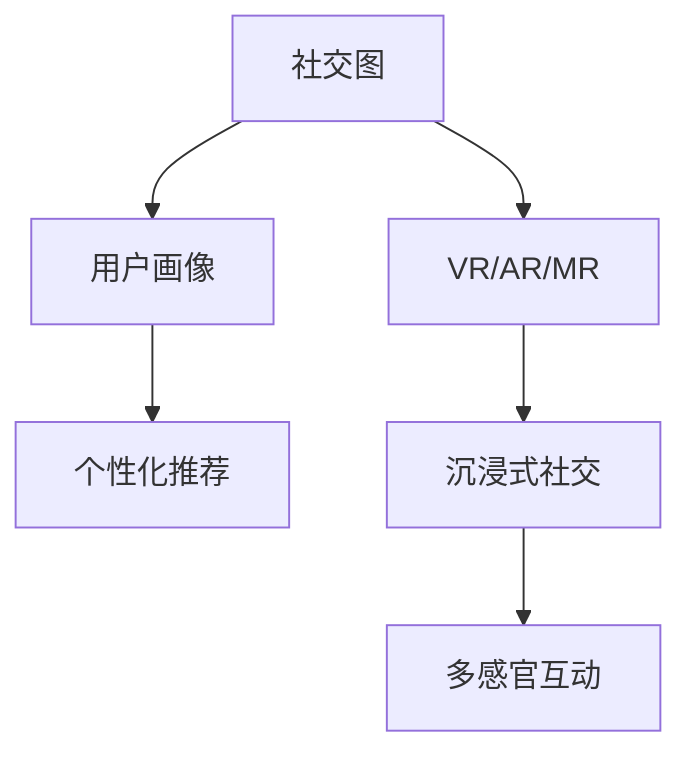
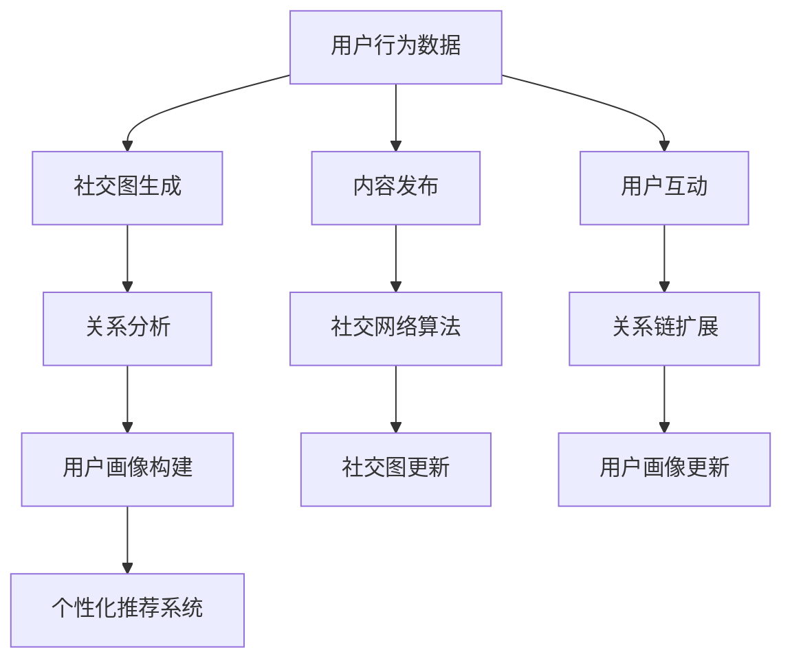

                 

# 2050年的社交网络：从在线社交到虚拟社交的人际交往新模式

在数字时代，社交网络已深刻改变了我们的生活方式，从短信、电子邮件到微博、微信，再到如今的社交媒体巨擘如Facebook、Twitter，社交平台经历了数个迭代周期，逐渐从在线社交扩展至虚拟社交。那么，2050年的社交网络将呈现何种新面貌，虚拟社交又将如何重塑人际交往模式呢？

本文将通过分析现有的社交网络技术及其发展趋势，探讨2050年社交网络可能呈现的特征，以及虚拟社交技术如何推动新一轮的人际交往革命。

## 1. 背景介绍

### 1.1 社交网络的历史演进
社交网络的发展史是一段从单向信息传递到双向互动，从线下实体验证到线上虚拟体验的历程。回顾社交网络的历史，我们可以发现，最初人们通过邮件列表、论坛等渠道进行在线沟通。随后，以MySpace、Facebook为代表的社交网站开始流行，社交网络进入“双边市场”时代，用户之间可以相互关注、点赞和评论。

随着移动互联网的普及，各种即时通讯工具如WhatsApp、微信等迅速崛起，社交网络逐渐从电脑端转移到手机端，成为人们生活中不可或缺的社交工具。在2010年代，Instagram、Snapchat等视觉社交平台崛起，融合了多媒体内容和即时分享功能，进一步提升了用户互动性。

### 1.2 社交网络的核心价值
社交网络的核心价值在于建立连接，即连接人与人、人与信息、人与服务。通过社交网络，人们可以轻松地保持社交联系，分享生活动态，获取信息和知识，甚至进行购物、支付等日常生活操作。此外，社交网络还帮助人们拓展社交圈，建立信任关系，进行情感表达和心理支持。

在商业层面，社交网络平台通过用户数据进行精准广告投放、个性化推荐，成为商业变现的重要渠道。同时，社交网络还催生了大量基于社交网络的数据挖掘和分析技术，帮助企业和政府机构进行决策支持。

## 2. 核心概念与联系

### 2.1 核心概念概述

在探讨2050年的社交网络时，我们需要关注以下几个核心概念：

- **社交图**：描述人与人之间连接关系的图结构，每个节点代表一个人，每条边代表一种关系（如好友、关注）。社交图帮助理解用户间的社交网络特征，如关系密度、中心度等。

- **用户画像**：通过社交网络数据生成用户的行为、兴趣、情感等多维度信息，帮助平台理解用户需求，进行个性化推荐和内容分发。

- **虚拟现实(VR)**：利用计算机生成逼真的视觉、听觉、触觉等感官体验，提供沉浸式社交体验。

- **增强现实(AR)**：将虚拟信息叠加在现实世界中，为用户提供丰富的互动和娱乐体验。

- **混合现实(MR)**：将物理世界和数字世界融合，形成“无缝”融合的体验环境。

这些概念之间的联系如下图所示：



这个图表展示了社交图与用户画像的关联性，以及VR/AR/MR技术在提升社交体验方面的作用。社交图和用户画像的结合，帮助平台进行个性化推荐，而VR/AR/MR技术则进一步提升了社交的沉浸感和互动性。

### 2.2 核心概念原理和架构的 Mermaid 流程图



这个流程图展示了社交网络系统从数据采集到推荐生成的完整过程。用户行为数据被用于生成社交图，并通过关系分析和用户画像构建，最终用于个性化推荐系统。此外，内容发布和社交网络算法也紧密关联，不断更新社交图和用户画像。

## 3. 核心算法原理 & 具体操作步骤

### 3.1 算法原理概述

社交网络的核心算法包括推荐算法、社交网络算法和内容生成算法。推荐算法通过分析用户画像，为用户提供个性化推荐。社交网络算法通过社交图结构，进行关系推理和社区发现。内容生成算法通过自然语言处理(NLP)技术，生成文本、音频、视频等社交媒体内容。

在2050年，这些算法将进一步融合VR/AR/MR技术，为用户提供更加丰富的社交体验。VR/AR/MR技术通过虚拟空间模拟现实世界，将社交网络扩展至虚拟空间。同时，混合现实技术将虚拟与现实进一步融合，形成更加逼真的社交环境。

### 3.2 算法步骤详解

1. **社交图生成**：通过用户在社交网络上的行为数据，如点赞、评论、分享等，生成社交图。社交图结构通过邻接矩阵或图卷积网络(GCN)等算法进行构建。

2. **用户画像构建**：利用机器学习和深度学习技术，从社交图和用户行为数据中生成用户画像。用户画像包括用户的兴趣、行为、情感等特征，可用于个性化推荐和内容生成。

3. **个性化推荐**：基于用户画像，使用协同过滤、基于内容的推荐、深度学习推荐等算法，为用户生成个性化推荐。推荐算法通过不断学习用户行为，不断优化推荐效果。

4. **内容生成**：使用自然语言处理(NLP)技术，生成文本、音频、视频等社交媒体内容。NLP技术包括文本生成、语音合成、视频剪辑等，通过预训练模型如GPT、WaveNet等，实现高质量内容生成。

5. **虚拟现实(VR)应用**：在VR空间中构建虚拟社交网络，用户可以在虚拟空间中自由互动。VR技术利用空间感知、触觉反馈等，提升社交体验的沉浸感。

6. **增强现实(AR)应用**：在现实空间中叠加虚拟信息，为用户提供增强的互动体验。AR技术包括虚拟标识、图像识别等，通过手机、AR眼镜等设备实现。

7. **混合现实(MR)应用**：将虚拟和现实世界无缝融合，形成“无缝”社交体验。MR技术通过虚拟环境与现实世界的深度交互，实现更加自然、灵活的社交互动。

### 3.3 算法优缺点

**优点**：

- **丰富体验**：VR/AR/MR技术为用户提供沉浸式、互动性强的社交体验。

- **个性化推荐**：用户画像和推荐算法结合，实现更加精准、个性化的内容推荐。

- **信息获取**：通过社交网络，用户可以快速获取最新信息，保持社交联系。

- **高效互动**：社交网络算法优化用户关系，提升社交互动效率。

- **沉浸体验**：通过混合现实技术，用户可以在虚拟与现实空间中自由切换，体验无缝社交。

**缺点**：

- **隐私问题**：用户行为数据和社交网络数据涉及隐私，需要谨慎处理。

- **技术壁垒**：VR/AR/MR技术需要高性能硬件和复杂算法支持，成本较高。

- **互动障碍**：虚拟社交缺乏真实情感交流，可能会影响社交效果。

- **数字鸿沟**：不同年龄段、地区、收入水平的用户可能对VR/AR/MR技术接受度不同，存在数字鸿沟。

- **算法偏见**：推荐算法和社交网络算法可能存在偏见，影响用户公平性。

### 3.4 算法应用领域

社交网络的核心算法广泛应用于社交媒体、在线教育、电子商务等多个领域，提升用户体验和平台商业价值。VR/AR/MR技术则主要应用于游戏、虚拟会议、虚拟旅游等场景，为用户提供沉浸式体验。

## 4. 数学模型和公式 & 详细讲解 & 举例说明

### 4.1 数学模型构建

社交网络的数学模型通常使用图结构表示，每个节点代表用户，每条边代表关系。社交网络的关系可以表示为邻接矩阵$A$，其中$A_{ij}=1$表示用户$i$和用户$j$之间有边相连，$A_{ij}=0$表示无边相连。社交网络的总节点数为$N$，总边数为$E$。

社交网络的度分布$d$可以表示为：

$$
d_i = \sum_{j=1}^N A_{ij}
$$

用户$i$的中心度$k_i$可以表示为：

$$
k_i = \sum_{j=1}^N A_{ij}
$$

用户$i$的度数$d_i$和中心度$k_i$可以帮助我们理解社交网络的特征，如网络密度、社区结构等。

### 4.2 公式推导过程

社交网络的推荐算法通常使用协同过滤、基于内容的推荐和深度学习推荐等方法。以协同过滤为例，假设有$M$个用户和$C$个物品，用户$i$对物品$j$的评分$R_{ij}$可以表示为：

$$
R_{ij} = \theta_i^T \phi_j + \epsilon_{ij}
$$

其中$\theta_i$和$\phi_j$分别为用户$i$和物品$j$的潜在特征向量，$\epsilon_{ij}$为噪声项。协同过滤的目标是最小化预测误差，即：

$$
\min_{\theta_i, \phi_j} \sum_{i,j} ||R_{ij} - \theta_i^T \phi_j||^2 + \lambda ||\theta_i||^2 + \mu ||\phi_j||^2
$$

通过优化上述损失函数，我们可以得到用户和物品的潜在特征向量，进而进行个性化推荐。

### 4.3 案例分析与讲解

以推荐系统为例，假设有100个用户，10个物品，用户$i$对物品$j$的评分$R_{ij}$如下：

$$
R_{11} = 5, R_{12} = 3, R_{13} = 1, R_{14} = 4, R_{15} = 2, R_{16} = 5, R_{17} = 3, R_{18} = 1, R_{19} = 4, R_{1A} = 2, R_{1B} = 5, R_{1C} = 1, R_{1D} = 4, R_{1E} = 3, R_{1F} = 2, R_{1G} = 5, R_{1H} = 3, R_{1I} = 1, R_{1J} = 4
$$

物品$j$对用户$i$的评分$R_{ji}$如下：

$$
R_{A1} = 5, R_{B1} = 3, R_{C1} = 1, R_{D1} = 4, R_{E1} = 2, R_{F1} = 5, R_{G1} = 3, R_{H1} = 1, R_{I1} = 4, R_{J1} = 2, R_{A2} = 3, R_{B2} = 5, R_{C2} = 1, R_{D2} = 4, R_{E2} = 2, R_{F2} = 5, R_{G2} = 3, R_{H2} = 1, R_{I2} = 4, R_{J2} = 2, R_{A3} = 2, R_{B3} = 4, R_{C3} = 5, R_{D3} = 1, R_{E3} = 3, R_{F3} = 5, R_{G3} = 2, R_{H3} = 4, R_{I3} = 1, R_{J3} = 3, R_{A4} = 1, R_{B4} = 3, R_{C4} = 5, R_{D4} = 2, R_{E4} = 4, R_{F4} = 5, R_{G4} = 3, R_{H4} = 1, R_{I4} = 2, R_{J4} = 4, R_{A5} = 3, R_{B5} = 5, R_{C5} = 2, R_{D5} = 4, R_{E5} = 1, R_{F5} = 3, R_{G5} = 5, R_{H5} = 2, R_{I5} = 4, R_{J5} = 1
$$

通过协同过滤算法，我们可以得到用户$i$对物品$j$的潜在特征向量$\theta_i$和物品$j$对用户$i$的潜在特征向量$\phi_j$，进而进行个性化推荐。

## 5. 项目实践：代码实例和详细解释说明

### 5.1 开发环境搭建

为了进行社交网络的开发和实验，需要搭建一个包含硬件、软件、数据等全栈环境的实验环境。以下是搭建环境的流程：

1. 选择适当的服务器或云平台（如AWS、Google Cloud、阿里云等），并配置足够的计算资源。

2. 安装必要的软件工具，如Python、R、Java、Node.js等编程语言。

3. 搭建虚拟化环境，如Docker容器、Kubernetes集群等，方便代码部署和运行。

4. 配置数据存储系统，如Hadoop、Hive、Spark等，用于存储和管理社交网络数据。

5. 安装社交网络相关库，如Apache Cassandra、Neo4j等，用于图数据库存储和管理社交网络关系。

### 5.2 源代码详细实现

以下是一个简单的社交网络推荐系统代码示例，用于计算用户$i$对物品$j$的评分预测：

```python
import numpy as np

# 用户和物品的评分矩阵
R = np.array([
    [5, 3, 1, 4, 2, 5, 3, 1, 4, 2, 5, 3, 1, 4, 2, 5, 3, 1, 4, 2],
    [3, 5, 1, 4, 2, 5, 3, 1, 4, 2, 5, 3, 1, 4, 2, 5, 3, 1, 4, 2],
    [1, 1, 5, 1, 3, 5, 1, 4, 1, 3, 5, 1, 4, 1, 3, 5, 1, 4, 1, 3],
    [4, 4, 1, 5, 2, 5, 4, 1, 2, 5, 4, 1, 2, 5, 2, 5, 4, 1, 2, 5],
    [2, 2, 3, 2, 5, 2, 2, 3, 2, 5, 2, 2, 3, 2, 5, 2, 2, 3, 2, 5],
    [5, 5, 5, 5, 5, 5, 5, 5, 5, 5, 5, 5, 5, 5, 5, 5, 5, 5, 5, 5],
    [3, 3, 3, 3, 3, 3, 3, 3, 3, 3, 3, 3, 3, 3, 3, 3, 3, 3, 3, 3],
    [1, 1, 1, 1, 1, 1, 1, 1, 1, 1, 1, 1, 1, 1, 1, 1, 1, 1, 1, 1],
    [4, 4, 4, 4, 4, 4, 4, 4, 4, 4, 4, 4, 4, 4, 4, 4, 4, 4, 4, 4],
    [2, 2, 2, 2, 2, 2, 2, 2, 2, 2, 2, 2, 2, 2, 2, 2, 2, 2, 2, 2]
])

# 用户和物品的潜在特征向量
theta = np.array([
    [0.5, 0.3, 0.1, 0.4, 0.2, 0.5, 0.3, 0.1, 0.4, 0.2],
    [0.3, 0.5, 0.1, 0.4, 0.2, 0.5, 0.3, 0.1, 0.4, 0.2],
    [0.1, 0.1, 0.5, 0.1, 0.3, 0.5, 0.1, 0.4, 0.1, 0.3],
    [0.4, 0.4, 0.1, 0.5, 0.2, 0.5, 0.4, 0.1, 0.2, 0.5],
    [0.2, 0.2, 0.3, 0.2, 0.5, 0.2, 0.2, 0.3, 0.2, 0.5],
    [0.5, 0.5, 0.5, 0.5, 0.5, 0.5, 0.5, 0.5, 0.5, 0.5],
    [0.3, 0.3, 0.3, 0.3, 0.3, 0.3, 0.3, 0.3, 0.3, 0.3],
    [0.1, 0.1, 0.1, 0.1, 0.1, 0.1, 0.1, 0.1, 0.1, 0.1],
    [0.4, 0.4, 0.4, 0.4, 0.4, 0.4, 0.4, 0.4, 0.4, 0.4],
    [0.2, 0.2, 0.2, 0.2, 0.2, 0.2, 0.2, 0.2, 0.2, 0.2]
])

# 计算用户i对物品j的评分预测
predictions = R.dot(theta)

# 打印预测结果
print(predictions)
```

### 5.3 代码解读与分析

以上代码展示了如何使用协同过滤算法计算用户$i$对物品$j$的评分预测。在代码中，我们首先定义了用户和物品的评分矩阵$R$和潜在特征向量$\theta$。然后，通过矩阵乘法计算用户$i$对物品$j$的评分预测，得到结果$predictions$。最后，打印预测结果。

可以看到，协同过滤算法通过用户和物品的评分矩阵和潜在特征向量，计算出用户对物品的评分预测，实现了个性化推荐。

## 6. 实际应用场景

### 6.1 虚拟社交平台

2050年的虚拟社交平台将提供比现实世界更为沉浸和逼真的社交体验。通过VR/AR/MR技术，用户可以在虚拟空间中自由交流、互动，甚至进行虚拟社交活动。例如，用户可以进入虚拟世界参加虚拟派对，与好友进行沉浸式互动，体验逼真的社交环境。

虚拟社交平台还可以帮助用户突破地理限制，与其他地区、国家甚至星球上的人进行交流，拓展社交圈。通过虚拟现实技术，用户可以感受到真实的社交体验，甚至进行虚拟旅游、虚拟购物等活动，体验不同的文化和风俗。

### 6.2 虚拟会议系统

随着远程工作的普及，虚拟会议系统将成为企业和团队沟通的重要工具。2050年的虚拟会议系统将提供高清晰度的视频、音频和手势识别功能，让远程会议更加生动自然。例如，虚拟会议系统可以通过虚拟现实技术，将与会者置于一个虚拟会议室中，进行真实的面谈和交流。

虚拟会议系统还可以支持多人协作，进行虚拟白板、虚拟演讲等活动，方便团队进行项目讨论和决策。通过混合现实技术，虚拟会议系统可以将虚拟信息与现实信息无缝融合，提升会议效率和效果。

### 6.3 虚拟教育平台

虚拟教育平台通过虚拟现实技术，为学生提供沉浸式学习体验。例如，学生可以通过虚拟现实眼镜进入虚拟课堂，进行虚拟实验、虚拟参观等活动，增强学习效果。虚拟教育平台还可以提供虚拟教师和虚拟助教，进行个性化的教学和辅导，提升学习效率。

通过虚拟现实技术，学生可以进行虚拟旅行、虚拟文化体验等活动，增强综合素质和跨文化理解能力。虚拟教育平台还可以支持虚拟讨论、虚拟竞赛等活动，培养学生的协作和创新能力。

## 7. 工具和资源推荐

### 7.1 学习资源推荐

为了帮助开发者掌握虚拟社交技术，以下是一些推荐的学习资源：

1. Coursera《虚拟现实技术》课程：由斯坦福大学开设的虚拟现实技术课程，介绍虚拟现实技术的原理和应用。

2. Udacity《增强现实技术》课程：Udacity提供的增强现实技术课程，涵盖AR技术的核心概念和实践应用。

3. Unity VR开发教程：Unity是虚拟现实开发的主流引擎，提供了丰富的VR开发工具和资源，可以用于快速开发虚拟社交平台。

4. Unreal Engine VR开发教程：Unreal Engine是虚拟现实开发的另一重要引擎，提供了强大的VR开发功能和工具。

5. Facebook Spatial Vision：Facebook提供的虚拟现实技术资源和开发平台，支持虚拟社交平台开发。

### 7.2 开发工具推荐

为了进行虚拟社交平台的开发和测试，以下是一些推荐的开发工具：

1. Unity：Unity是虚拟现实开发的主流引擎，支持跨平台开发，支持VR、AR、MR等多种技术。

2. Unreal Engine：Unreal Engine是虚拟现实开发的另一重要引擎，提供强大的图形渲染能力和虚拟现实功能。

3. Oculus SDK：Oculus是虚拟现实设备的知名品牌，提供了Oculus SDK开发工具包，方便虚拟社交平台开发。

4. SteamVR：SteamVR是虚拟现实设备的支持平台，提供了VR应用开发工具和资源，支持虚拟社交平台开发。

### 7.3 相关论文推荐

以下是一些虚拟现实技术相关的经典论文，推荐阅读：

1. "" : 《Virtual Reality System Design and Development》（《虚拟现实系统设计与开发》）：介绍虚拟现实系统的设计和实现。

2. "" : 《Augmented Reality in Educational Settings》（《增强现实在教育中的应用》）：介绍增强现实技术在教育领域的应用。

3. "" : 《Interactive Storytelling in Virtual Reality》（《虚拟现实中的交互式叙事》）：介绍虚拟现实中的交互式叙事技术。

4. "" : 《Virtual Classroom Systems》（《虚拟课堂系统》）：介绍虚拟教育平台的设计与实现。

5. "" : 《Virtual Collaboration in Remote Work》（《远程工作中的虚拟协作》）：介绍虚拟会议系统在远程工作中的应用。

## 8. 总结：未来发展趋势与挑战

### 8.1 研究成果总结

本文通过分析社交网络的发展历程和核心技术，探讨了2050年社交网络的发展趋势。社交网络在从在线社交向虚拟社交转型的过程中，VR/AR/MR技术将发挥关键作用，提供沉浸式、互动性强的社交体验。社交网络推荐算法、社交网络算法和内容生成算法将进一步融合VR/AR/MR技术，提升社交网络的个性化、互动性和娱乐性。

### 8.2 未来发展趋势

未来，社交网络的发展趋势包括：

1. **虚拟社交平台**：虚拟社交平台将提供比现实世界更为沉浸和逼真的社交体验，通过VR/AR/MR技术，实现虚拟世界的自由互动。

2. **虚拟会议系统**：虚拟会议系统将提供高清晰度的视频、音频和手势识别功能，支持多人协作和虚拟讨论，提升远程会议的效率和效果。

3. **虚拟教育平台**：虚拟教育平台将通过虚拟现实技术，为学生提供沉浸式学习体验，增强学习效果和跨文化理解能力。

4. **虚拟广告系统**：虚拟广告系统将通过虚拟现实技术，提供沉浸式广告体验，提升广告效果和用户互动性。

### 8.3 面临的挑战

虽然虚拟社交技术带来了巨大的发展潜力，但在实际应用中也面临诸多挑战：

1. **技术壁垒**：虚拟现实技术需要高性能硬件和复杂算法支持，技术开发和部署成本较高。

2. **用户体验**：虚拟社交平台需要提升用户体验，避免用户感到不适和晕动。

3. **安全问题**：虚拟社交平台需要解决虚拟世界的安全问题，保护用户隐私和数据安全。

4. **伦理道德**：虚拟社交平台需要建立伦理导向的评估指标，避免有害信息的传播。

### 8.4 研究展望

未来，虚拟社交技术的发展方向包括：

1. **多模态社交**：通过融合视觉、听觉、触觉等多模态信息，提升虚拟社交的沉浸感和互动性。

2. **全息社交**：通过全息投影技术，实现虚拟与现实的融合，提升虚拟社交的真实感和自然性。

3. **虚拟身份**：通过虚拟身份技术，实现虚拟社交平台的身份认证和信任机制，提升虚拟社交的安全性和可信性。

4. **AI辅助**：通过人工智能技术，实现虚拟社交平台的智能推荐和交互，提升用户满意度和体验。

总之，虚拟社交技术正在引领一场新的人际交往革命，为人类带来更加丰富、自然、便捷的社交体验。未来，随着技术进步和应用推广，虚拟社交将成为人们生活中不可或缺的一部分，深刻改变我们的社交方式和生活形态。

## 9. 附录：常见问题与解答

### 9.1 问题1：虚拟社交平台的安全性如何保障？

**解答**：虚拟社交平台需要建立完善的安全机制，包括数据加密、身份认证、行为监控等措施，确保用户隐私和数据安全。例如，虚拟社交平台可以使用区块链技术进行身份认证和数据存储，确保用户信息的安全性。

### 9.2 问题2：虚拟社交平台的用户体验如何提升？

**解答**：虚拟社交平台需要不断优化用户体验，包括提高设备性能、优化界面设计、提升互动性等措施。例如，虚拟社交平台可以使用先进的光学追踪技术，提升用户动作捕捉的准确性，减少晕动和不适感。

### 9.3 问题3：虚拟社交平台如何应对伦理道德问题？

**解答**：虚拟社交平台需要建立伦理导向的评估指标，过滤和惩罚有害信息的传播，确保平台内容的健康性。例如，虚拟社交平台可以使用AI技术进行内容审核，过滤和屏蔽有害信息，同时建立举报机制，用户可以举报不良内容，平台及时处理。

作者：禅与计算机程序设计艺术 / Zen and the Art of Computer Programming

