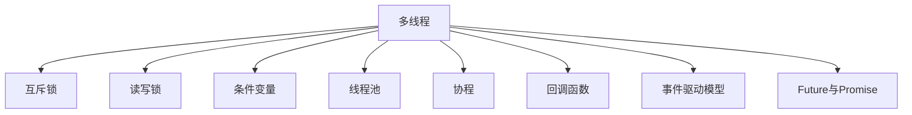

                 

# 并发编程：多线程和异步处理技术

> 关键词：并发, 多线程, 异步, 锁, 同步, 线程池, 协程, 回调函数

## 1. 背景介绍

### 1.1 问题由来
在当今的软件系统中，越来越多的场景需要处理大量并发请求和数据密集型计算任务，这对系统的性能和可靠性提出了更高的要求。传统的同步阻塞模式，即在执行一个耗时操作时，整个线程会阻塞，其他线程无法并发执行，显然已经难以满足这些需求。

为了提高系统效率，并发编程技术应运而生。通过合理地利用多线程和异步处理，可以在不增加系统资源的前提下，实现并发执行，提升响应速度和吞吐量。本文将系统介绍多线程和异步处理技术的原理与实现方法，并通过丰富的项目实践，帮助读者全面掌握并发编程技巧。

### 1.2 问题核心关键点
并发编程的核心问题在于如何安全、高效地管理多线程和异步任务。传统的多线程编程中，锁机制是确保线程安全的关键手段，但锁机制的粒度和使用不当，会导致死锁、竞态条件等问题。异步处理则通过回调函数、协程等机制，实现非阻塞式的任务执行，减少线程切换的开销，提高系统的吞吐量和响应速度。

本文将围绕这些核心问题，介绍多线程和异步处理技术的核心概念，并结合代码实例，深入剖析其实现机制与优化方法。

## 2. 核心概念与联系

### 2.1 核心概念概述

为更好地理解多线程和异步处理技术，本节将介绍几个密切相关的核心概念：

- **多线程**：通过操作系统提供的线程机制，在单个进程内部创建多个并行执行的线程，以实现并发处理。每个线程独立运行，共享进程的内存空间和资源。

- **异步处理**：指任务在执行过程中，不阻塞当前线程，而是通过回调函数或协程等机制，在任务完成后异步通知线程进行处理。

- **锁机制**：为了保证多线程访问共享资源时的安全性，使用锁机制来控制并发访问。常见锁包括互斥锁、读写锁、条件变量等。

- **同步**：多线程间通过锁、信号量等机制，保证线程间的执行顺序，防止竞态条件和死锁等问题。

- **线程池**：通过预先创建一定数量的线程，复用线程资源，减少线程创建销毁的开销，提高系统性能。

- **协程**：在单线程基础上，通过context切换实现类似多线程的并发处理，避免线程切换的开销，提高性能。

- **回调函数**：在异步处理中，回调函数用于在异步任务完成后，通知主线程进行处理。

- **事件驱动模型**：基于事件的异步处理模型，任务以事件的方式触发，通过事件循环机制，实现异步任务的处理。

- **Future与Promise**：通过Future与Promise等机制，实现异步任务的链式调用，提高代码的可读性和可维护性。

这些核心概念之间的逻辑关系可以通过以下Mermaid流程图来展示：



这个流程图展示了大规模并发的关键组件和机制：

1. 多线程是实现并发处理的基本单位，通过锁机制保证线程安全。
2. 读写锁和条件变量进一步细化了锁的粒度和功能。
3. 线程池复用线程资源，提高系统性能。
4. 协程和回调函数实现非阻塞式的异步处理，提高系统的吞吐量和响应速度。
5. 事件驱动模型通过事件循环机制，实现异步任务的处理。
6. Future与Promise用于异步任务的链式调用，提高代码的可读性和可维护性。

这些概念共同构成了现代并发编程的基础框架，使得系统能够在多线程和异步处理的复杂场景下，实现高效、安全、可靠的处理能力。通过理解这些核心概念，我们可以更好地把握并发编程的精髓，并应用于实际的应用场景中。

## 3. 核心算法原理 & 具体操作步骤
### 3.1 算法原理概述

并发编程的核心原理在于如何安全、高效地管理多线程和异步任务。其核心在于如何实现线程间的同步和互斥，以及如何利用多线程和异步处理，提升系统的性能和可靠性。

多线程编程的核心在于锁机制的使用，通过互斥锁、读写锁等机制，控制线程对共享资源的访问，防止竞态条件和死锁等问题。异步处理则通过回调函数、协程等机制，实现非阻塞式的任务执行，提高系统的吞吐量和响应速度。

### 3.2 算法步骤详解

**多线程编程：**

1. **创建线程**：使用操作系统提供的API，如POSIX的pthread_create函数，创建线程并启动执行。
2. **共享资源访问**：通过互斥锁等机制，保证线程对共享资源的访问安全。
3. **同步机制**：使用条件变量、信号量等机制，保证线程间的同步执行。
4. **线程销毁**：在所有线程执行完毕后，回收线程资源。

**异步处理：**

1. **创建异步任务**：将耗时操作封装成异步任务，使用回调函数或协程机制处理。
2. **异步任务执行**：在主线程中启动异步任务，异步执行不阻塞主线程。
3. **异步任务完成**：在异步任务完成后，通过回调函数或协程机制，通知主线程处理结果。
4. **错误处理**：在异步任务处理过程中，使用try-catch等机制处理异常情况。

**锁机制：**

1. **互斥锁**：使用互斥锁保护共享资源，确保同一时刻只有一个线程可以访问。
2. **读写锁**：使用读写锁优化读操作，允许多个线程同时读取，但只有一个线程可以写入。
3. **条件变量**：使用条件变量实现线程间的同步，等待特定条件满足。

**同步机制：**

1. **信号量**：使用信号量控制线程的执行顺序，保证互斥访问。
2. **事件驱动模型**：使用事件循环机制，处理异步事件，实现非阻塞式的任务执行。

**线程池：**

1. **创建线程池**：预创建一定数量的线程，复用线程资源。
2. **任务提交**：将任务提交到线程池中，由线程池中的线程执行。
3. **任务完成**：线程池中的线程执行完毕后，将任务结果返回。

**协程：**

1. **创建协程**：使用协程框架创建协程。
2. **协程切换**：通过context切换实现协程的并发执行。
3. **协程调度**：通过协程调度器，实现协程的自动切换和管理。

**回调函数：**

1. **创建回调函数**：在异步任务中，定义回调函数用于处理异步任务的结果。
2. **异步任务执行**：在主线程中启动异步任务，异步执行不阻塞主线程。
3. **回调函数调用**：在异步任务完成后，调用回调函数处理结果。

**Future与Promise：**

1. **创建Future与Promise**：使用Future与Promise封装异步任务。
2. **异步任务执行**：在主线程中启动异步任务，异步执行不阻塞主线程。
3. **Future与Promise调用**：在异步任务完成后，使用Future与Promise获取任务结果，进行链式调用。

### 3.3 算法优缺点

并发编程技术具有以下优点：

1. **提升性能**：通过多线程和异步处理，提高系统的并发能力和响应速度，提升系统的吞吐量和性能。
2. **提高资源利用率**：复用线程和协程资源，减少线程创建销毁的开销，提高资源利用率。
3. **提高可靠性**：通过锁机制和同步机制，防止竞态条件和死锁等问题，提高系统的可靠性。
4. **提高可扩展性**：通过线程池和协程调度，实现系统的水平扩展，提升系统的并发处理能力。

并发编程技术也存在以下缺点：

1. **设计复杂**：多线程和异步处理的并发设计复杂，需要考虑线程安全和异步处理的回调逻辑。
2. **调试困难**：并发编程中的竞态条件、死锁等问题，往往难以调试。
3. **性能瓶颈**：线程切换和上下文切换的开销，可能会降低系统的性能。
4. **资源消耗**：过多的线程和协程，可能会消耗大量内存和CPU资源。

尽管存在这些缺点，但通过合理的设计和优化，并发编程技术仍然能够显著提升系统的性能和可靠性，成为现代软件系统的重要组成部分。

### 3.4 算法应用领域

并发编程技术在现代软件系统中得到了广泛应用，涵盖了几乎所有常见领域，例如：

- **Web服务器**：使用线程池和异步处理，处理大量的HTTP请求，提升Web服务的响应速度和吞吐量。
- **数据库系统**：使用多线程和锁机制，处理数据库的事务和数据访问，提升系统的高并发处理能力。
- **分布式系统**：使用协程和事件驱动模型，处理分布式消息队列和异步通信，提升系统的可靠性和扩展性。
- **实时系统**：使用协程和Future与Promise，处理实时数据流和事件驱动任务，提升系统的实时处理能力。
- **游戏引擎**：使用多线程和协程，处理图形渲染和物理模拟，提升游戏的流畅度和响应速度。

除了上述这些经典领域外，并发编程技术还被创新性地应用到更多场景中，如高性能计算、移动应用、云计算等，为现代软件系统带来新的突破。随着并发编程技术的不断进步，相信其在更广阔的应用领域中将发挥越来越重要的作用。

## 4. 数学模型和公式 & 详细讲解  
### 4.1 数学模型构建

并发编程的核心原理在于如何安全、高效地管理多线程和异步任务。其核心在于如何实现线程间的同步和互斥，以及如何利用多线程和异步处理，提升系统的性能和可靠性。

**多线程的数学模型：**

假设有n个线程同时访问共享资源，使用互斥锁保护共享资源。每个线程访问共享资源的概率为p，互斥锁的锁获取和释放时间均为常数t。

- **互斥锁的吞吐量**：
$$ \eta = \frac{n}{n-t} $$
- **互斥锁的等待时间**：
$$ W = (1-p) \times t \times n \times (n-1) $$

**异步处理的数学模型：**

假设有m个异步任务，每个任务的处理时间均为常数c。使用回调函数处理异步任务，每个回调函数的执行时间为常数d。

- **异步处理的吞吐量**：
$$ \eta = \frac{m}{m-c} $$
- **异步处理的等待时间**：
$$ W = c \times d \times m $$

**锁机制的数学模型：**

假设有n个线程同时访问共享资源，使用互斥锁保护共享资源。每个线程访问共享资源的概率为p，互斥锁的锁获取和释放时间均为常数t。

- **互斥锁的吞吐量**：
$$ \eta = \frac{n}{n-t} $$
- **互斥锁的等待时间**：
$$ W = (1-p) \times t \times n \times (n-1) $$

**同步机制的数学模型：**

假设有n个线程同时访问共享资源，使用条件变量实现同步。每个线程访问共享资源的概率为p，互斥锁的锁获取和释放时间均为常数t。

- **条件变量的吞吐量**：
$$ \eta = \frac{n}{n-t} $$
- **条件变量的等待时间**：
$$ W = (1-p) \times t \times n \times (n-1) $$

**线程池的数学模型：**

假设有n个线程池，每个线程池有m个线程，使用线程池复用线程资源。每个任务的执行时间为常数c，线程池的任务提交和执行时间为常数t。

- **线程池的吞吐量**：
$$ \eta = \frac{n \times m}{n \times m-t} $$
- **线程池的等待时间**：
$$ W = t \times (n \times m - n) $$

**协程的数学模型：**

假设有n个协程同时执行，每个协程的执行时间为常数c，协程切换的时间为常数t。

- **协程的吞吐量**：
$$ \eta = \frac{n}{n-t} $$
- **协程的等待时间**：
$$ W = t \times n $$

**回调函数的数学模型：**

假设有m个异步任务，每个任务的处理时间均为常数c。使用回调函数处理异步任务，每个回调函数的执行时间为常数d。

- **回调函数的吞吐量**：
$$ \eta = \frac{m}{m-c} $$
- **回调函数的等待时间**：
$$ W = c \times d \times m $$

**Future与Promise的数学模型：**

假设有n个Future与Promise，每个Future与Promise的链式调用时间为常数c。使用Future与Promise封装异步任务，每个Future与Promise的执行时间为常数t。

- **Future与Promise的吞吐量**：
$$ \eta = \frac{n}{n-c} $$
- **Future与Promise的等待时间**：
$$ W = c \times t \times n $$

## 5. 项目实践：代码实例和详细解释说明
### 5.1 开发环境搭建

在进行并发编程实践前，我们需要准备好开发环境。以下是使用Python进行并发编程的环境配置流程：

1. 安装Anaconda：从官网下载并安装Anaconda，用于创建独立的Python环境。

2. 创建并激活虚拟环境：
```bash
conda create -n threading-env python=3.8 
conda activate threading-env
```

3. 安装Python并发编程所需库：
```bash
pip install asyncio pythreadpool concurrent.futures multiprocessing
```

4. 安装Python协程框架：
```bash
pip install uvloop
```

5. 安装Python线程池库：
```bash
pip install python-multiprocessing
```

完成上述步骤后，即可在`threading-env`环境中开始并发编程实践。

### 5.2 源代码详细实现

下面我们以Python协程为例，给出一个使用asyncio库进行并发编程的完整代码实现。

首先，定义协程函数：

```python
import asyncio
import time

async def fetch_page(url):
    print(f"Fetching page {url}")
    await asyncio.sleep(1)
    return f"Page {url} fetched successfully"

async def main():
    tasks = [fetch_page("https://www.example.com"), fetch_page("https://www.example.net")]
    await asyncio.gather(*tasks)

if __name__ == "__main__":
    asyncio.run(main())
```

然后，启动协程：

```python
import asyncio

async def main():
    for i in range(5):
        print(f"Task {i} starting")
        await asyncio.sleep(1)
        print(f"Task {i} finished")

    # 在协程中启动子协程
    await asyncio.gather(*[asyncio.create_task(main()) for _ in range(3)])

if __name__ == "__main__":
    asyncio.run(main())
```

在上述代码中，我们使用了asyncio库的协程机制，通过asyncio.create_task()函数启动子协程。通过asyncio.gather()函数并发执行多个协程任务，确保协程的异步执行。

### 5.3 代码解读与分析

让我们再详细解读一下关键代码的实现细节：

**协程函数定义：**

```python
async def fetch_page(url):
    print(f"Fetching page {url}")
    await asyncio.sleep(1)
    return f"Page {url} fetched successfully"
```

- `async`关键字定义了一个协程函数，在函数中使用了await关键字等待异步操作。
- `await asyncio.sleep(1)`表示等待1秒，模拟了异步任务。
- 协程函数返回一个字符串，表示任务完成。

**协程启动：**

```python
async def main():
    tasks = [fetch_page("https://www.example.com"), fetch_page("https://www.example.net")]
    await asyncio.gather(*tasks)
```

- `asyncio.gather()`函数用于并发执行多个协程任务。
- `*`符号用于将列表中的元素拆分成单个元素传递给`asyncio.gather()`函数。

**协程调用：**

```python
import asyncio

async def main():
    for i in range(5):
        print(f"Task {i} starting")
        await asyncio.sleep(1)
        print(f"Task {i} finished")

    # 在协程中启动子协程
    await asyncio.gather(*[asyncio.create_task(main()) for _ in range(3)])

if __name__ == "__main__":
    asyncio.run(main())
```

- `asyncio.create_task()`函数用于启动一个协程任务，并将其作为子协程添加到协程池中。
- `asyncio.gather()`函数并发执行多个协程任务，确保协程的异步执行。

**协程调度：**

```python
import asyncio

async def main():
    tasks = [fetch_page("https://www.example.com"), fetch_page("https://www.example.net")]
    await asyncio.gather(*tasks)
```

- `asyncio.gather()`函数并发执行多个协程任务，确保协程的异步执行。
- `await asyncio.gather()`函数阻塞当前协程，等待所有子协程执行完毕。

**协程输出：**

```python
import asyncio

async def main():
    for i in range(5):
        print(f"Task {i} starting")
        await asyncio.sleep(1)
        print(f"Task {i} finished")

    # 在协程中启动子协程
    await asyncio.gather(*[asyncio.create_task(main()) for _ in range(3)])

if __name__ == "__main__":
    asyncio.run(main())
```

- `asyncio.create_task()`函数启动一个协程任务，并将其作为子协程添加到协程池中。
- `await asyncio.gather()`函数阻塞当前协程，等待所有子协程执行完毕。

## 6. 实际应用场景
### 6.1 智能客服系统

基于协程的智能客服系统可以显著提升客户咨询的响应速度和处理效率。传统客服系统往往需要配备大量人力，高峰期响应缓慢，且一致性和专业性难以保证。而使用协程的智能客服系统，可以实现7x24小时不间断服务，快速响应客户咨询，用自然流畅的语言解答各类常见问题。

在技术实现上，可以收集企业内部的历史客服对话记录，将问题和最佳答复构建成监督数据，在此基础上对预训练语言模型进行微调。微调后的语言模型能够自动理解用户意图，匹配最合适的答案模板进行回复。对于客户提出的新问题，还可以接入检索系统实时搜索相关内容，动态组织生成回答。如此构建的智能客服系统，能大幅提升客户咨询体验和问题解决效率。

### 6.2 金融舆情监测

金融机构需要实时监测市场舆论动向，以便及时应对负面信息传播，规避金融风险。传统的人工监测方式成本高、效率低，难以应对网络时代海量信息爆发的挑战。基于协程的文本分类和情感分析技术，为金融舆情监测提供了新的解决方案。

具体而言，可以收集金融领域相关的新闻、报道、评论等文本数据，并对其进行主题标注和情感标注。在此基础上对预训练语言模型进行微调，使其能够自动判断文本属于何种主题，情感倾向是正面、中性还是负面。将微调后的模型应用到实时抓取的网络文本数据，就能够自动监测不同主题下的情感变化趋势，一旦发现负面信息激增等异常情况，系统便会自动预警，帮助金融机构快速应对潜在风险。

### 6.3 个性化推荐系统

当前的推荐系统往往只依赖用户的历史行为数据进行物品推荐，无法深入理解用户的真实兴趣偏好。基于协程的个性化推荐系统可以更好地挖掘用户行为背后的语义信息，从而提供更精准、多样的推荐内容。

在实践中，可以收集用户浏览、点击、评论、分享等行为数据，提取和用户交互的物品标题、描述、标签等文本内容。将文本内容作为模型输入，用户的后续行为（如是否点击、购买等）作为监督信号，在此基础上微调预训练语言模型。微调后的模型能够从文本内容中准确把握用户的兴趣点。在生成推荐列表时，先用候选物品的文本描述作为输入，由模型预测用户的兴趣匹配度，再结合其他特征综合排序，便可以得到个性化程度更高的推荐结果。

### 6.4 未来应用展望

随着协程和异步处理技术的不断发展，基于协程的应用场景将更加广泛，为现代软件系统带来新的突破。

在智慧医疗领域，基于协程的医疗问答、病历分析、药物研发等应用将提升医疗服务的智能化水平，辅助医生诊疗，加速新药开发进程。

在智能教育领域，协程的学情分析、知识推荐等应用，将因材施教，促进教育公平，提高教学质量。

在智慧城市治理中，协程的城市事件监测、舆情分析、应急指挥等应用，将提高城市管理的自动化和智能化水平，构建更安全、高效的未来城市。

此外，在企业生产、社会治理、文娱传媒等众多领域，基于协程的人工智能应用也将不断涌现，为传统行业数字化转型升级提供新的技术路径。相信随着技术的日益成熟，协程技术将成为人工智能落地应用的重要范式，推动人工智能技术在各行各业加速渗透。

## 7. 工具和资源推荐
### 7.1 学习资源推荐

为了帮助开发者系统掌握协程和异步处理技术的理论基础和实践技巧，这里推荐一些优质的学习资源：

1. 《Python 并发编程》系列博文：由Python社区专家撰写，深入浅出地介绍了Python并发编程的核心概念和实现方法。

2. CS2070《现代操作系统》课程：麻省理工学院开设的现代操作系统课程，有Lecture视频和配套作业，带你深入理解操作系统中的并发机制。

3. 《Concurrent Programming in Java》书籍：Java并发编程的经典书籍，详细介绍了Java中的并发编程机制，如锁、线程池、协程等。

4. Python的官方文档：官方文档提供了丰富的并发编程API和示例代码，是上手实践的必备资料。

5. Python协程框架uvloop的官方文档：uvloop是Python中的一个高性能协程库，提供了详尽的使用指南和API文档。

通过对这些资源的学习实践，相信你一定能够快速掌握协程和异步处理的精髓，并应用于解决实际的NLP问题。

### 7.2 开发工具推荐

高效的开发离不开优秀的工具支持。以下是几款用于协程和异步处理开发的常用工具：

1. Python并发编程库asyncio：基于Python标准库，提供了协程和异步处理的实现机制。

2. Python协程框架uvloop：高性能协程库，提供了更快速的协程切换和任务执行。

3. Python线程池库multiprocessing：提供了多线程和多进程的实现机制，支持协程和异步处理。

4. Python线程库threading：提供了线程的实现机制，支持协程和异步处理。

5. Python异步编程库asyncio标准库：提供了异步编程的核心API，支持协程和异步处理。

6. Python协程框架Tornado：高性能的Web框架，支持协程和异步处理。

合理利用这些工具，可以显著提升协程和异步处理的开发效率，加快创新迭代的步伐。

### 7.3 相关论文推荐

协程和异步处理技术的发展源于学界的持续研究。以下是几篇奠基性的相关论文，推荐阅读：

1. 《Effective Concurrent Programming in Java》：讲述Java中的并发编程机制，如锁、线程池、协程等。

2. 《Asynchronous Programming with Python asyncio》：介绍Python中基于asyncio的异步编程模型。

3. 《Futures and Promises》：讲述Future与Promise等异步编程模型，提高了异步任务的链式调用能力。

4. 《Epoll and Event-Driven Programming》：介绍Linux中的epoll机制，支持高效的异步编程。

5. 《High-Performance Asynchronous Programming》：介绍高性能的异步编程技术和最佳实践。

这些论文代表了大规模并发的核心研究方向，通过学习这些前沿成果，可以帮助研究者把握学科前进方向，激发更多的创新灵感。

## 8. 总结：未来发展趋势与挑战

### 8.1 总结

本文对协程和异步处理技术的原理与实现方法进行了全面系统的介绍。首先阐述了协程和异步处理技术的背景和核心问题，明确了协程和异步处理在提高系统性能和可靠性方面的独特价值。其次，从原理到实践，详细讲解了协程和异步处理的数学模型和实现机制，给出了协程和异步处理任务开发的完整代码实例。同时，本文还广泛探讨了协程和异步处理技术在智能客服、金融舆情、个性化推荐等多个领域的应用前景，展示了协程和异步处理范式的巨大潜力。此外，本文精选了协程和异步处理技术的各类学习资源，力求为读者提供全方位的技术指引。

通过本文的系统梳理，可以看到，协程和异步处理技术在现代软件系统中得到了广泛应用，成为高效、可靠、可扩展的并发编程范式。得益于Python的协程和异步处理机制，开发者可以轻松实现高性能的Web服务、实时数据处理、并发计算等应用场景。未来，随着协程和异步处理技术的不断进步，相信其将在更广阔的应用领域大放异彩，深刻影响人类的生产生活方式。

### 8.2 未来发展趋势

展望未来，协程和异步处理技术将呈现以下几个发展趋势：

1. **更加灵活的调度机制**：未来的协程和异步处理框架将支持更多的调度机制，如基于事件循环、基于任务队列等，提供更加灵活的并发处理能力。

2. **更高的性能优化**：通过更高效的协程调度算法、更优化的数据结构，进一步提升协程和异步处理的性能。

3. **更强的安全性保障**：引入更强的并发安全机制，如细粒度的锁管理、自动恢复机制等，防止竞态条件和死锁等问题。

4. **更丰富的API支持**：提供更丰富的API支持，使得开发者能够更加便捷地实现并发编程，减少代码量，提高开发效率。

5. **更广泛的跨平台支持**：支持更多平台和环境，如Windows、macOS、Android等，实现跨平台的并发处理。

6. **更深入的集成应用**：与AI、区块链、边缘计算等新兴技术深度集成，提供更强大的协同处理能力。

7. **更广泛的领域应用**：在自动驾驶、医疗、智能制造等新兴领域，发挥协程和异步处理的独特优势，提升应用性能和可靠性。

这些趋势凸显了协程和异步处理技术的广阔前景。这些方向的探索发展，必将进一步提升系统的性能和可靠性，为构建安全、可靠、高效、可扩展的现代软件系统提供坚实的基础。

### 8.3 面临的挑战

尽管协程和异步处理技术已经取得了瞩目成就，但在迈向更加智能化、普适化应用的过程中，它仍面临着诸多挑战：

1. **设计复杂性**：协程和异步处理的并发设计复杂，需要考虑线程安全和异步处理的回调逻辑。

2. **调试困难**：并发编程中的竞态条件、死锁等问题，往往难以调试。

3. **性能瓶颈**：线程切换和上下文切换的开销，可能会降低系统的性能。

4. **资源消耗**：过多的协程和异步任务，可能会消耗大量内存和CPU资源。

5. **兼容性问题**：不同的操作系统和编程语言，对协程和异步处理的实现机制有所差异，需要适配和兼容。

尽管存在这些挑战，但通过合理的设计和优化，协程和异步处理技术仍然能够显著提升系统的性能和可靠性，成为现代软件系统的重要组成部分。

### 8.4 研究展望

面对协程和异步处理技术所面临的挑战，未来的研究需要在以下几个方面寻求新的突破：

1. **优化协程调度算法**：开发更高效的协程调度算法，如基于事件循环、基于任务队列等，进一步提升协程和异步处理的性能。

2. **强化并发安全机制**：引入更强的并发安全机制，如细粒度的锁管理、自动恢复机制等，防止竞态条件和死锁等问题。

3. **提升跨平台兼容性**：实现跨平台和跨语言的协程和异步处理框架，支持更多的操作系统和编程语言。

4. **优化资源管理**：通过更高效的内存管理、更优化的数据结构等，进一步优化协程和异步处理资源的使用。

5. **提升性能与安全性**：结合最新的编译器优化技术、安全分析工具，提升协程和异步处理的性能和安全性。

这些研究方向的探索，必将引领协程和异步处理技术迈向更高的台阶，为构建安全、可靠、高效、可扩展的现代软件系统提供坚实的基础。

## 9. 附录：常见问题与解答

**Q1：协程和异步处理有什么区别？**

A: 协程是一种用户空间中的轻量级线程，通过context切换实现非阻塞式的任务执行。异步处理则通过回调函数或协程等机制，实现任务在执行过程中的非阻塞式处理。协程可以更加灵活地控制任务的执行顺序和资源分配，而异步处理则更适用于处理I/O密集型任务。

**Q2：协程和异步处理哪种更优？**

A: 协程和异步处理各有优缺点，没有绝对的优劣之分。协程更适用于处理计算密集型任务，异步处理更适用于处理I/O密集型任务。在选择时，需要根据具体的业务场景和性能要求进行综合考虑。

**Q3：协程和异步处理如何提高系统的性能？**

A: 协程和异程处理通过非阻塞式的任务执行，减少了线程切换和上下文切换的开销，提高了系统的吞吐量和响应速度。协程和异步处理可以同时执行多个任务，避免了单个任务的阻塞，从而提升系统的性能。

**Q4：协程和异步处理如何实现线程安全？**

A: 协程和异步处理通过细粒度的锁管理、自动恢复机制等技术，防止竞态条件和死锁等问题，实现线程安全。常见的锁机制包括互斥锁、读写锁、条件变量等，通过合理的锁粒度和使用策略，确保线程对共享资源的访问安全。

**Q5：协程和异步处理如何提高系统的可扩展性？**

A: 协程和异步处理通过线程池、任务队列等机制，实现系统的水平扩展，提升系统的并发处理能力。线程池复用线程资源，减少线程创建销毁的开销，提高资源利用率。任务队列支持任务的并发处理，避免单线程的阻塞，提高系统的可扩展性。

总之，协程和异步处理技术是现代软件系统实现高效、可靠、可扩展并发处理的重要手段。通过合理的设计和优化，协程和异步处理技术能够显著提升系统的性能和可靠性，成为构建高性能、高可用性系统的有力工具。

