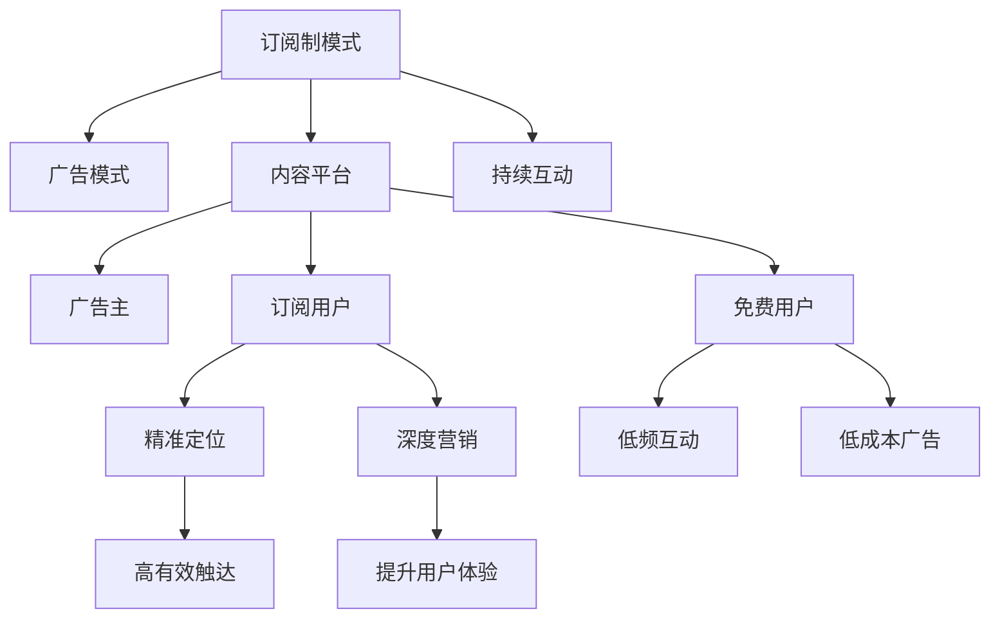

                 

# 广告时代结束：订阅制模式的崛起

## 1. 背景介绍

### 1.1 问题由来

随着互联网和移动设备的普及，用户的注意力被大量分散到各种应用和内容平台中。与此同时，传统的广告模式面临着巨大的挑战：广告主的高昂投放费用与用户真实广告需求的错位，不断压缩了广告主的市场空间。在此背景下，订阅制模式作为一种新的互联网营销方式，应运而生。

### 1.2 问题核心关键点

订阅制模式的核心在于通过稳定的订阅费用，获取用户长期稳定的关注和互动，从而实现对用户需求的精准定位和深度营销。与传统的一次性广告不同，订阅制模式能够通过持续的互动和内容输出，增强用户粘性，降低广告主的投放成本，提高广告效果。

### 1.3 问题研究意义

研究订阅制模式的兴起及其应用策略，对于理解互联网生态的演进、把握用户行为的新趋势，具有重要意义：

1. 提升广告投放效果：通过订阅制模式，广告主能够更加精准地触及目标用户群体，提高广告的有效触达率。
2. 强化用户粘性：订阅用户对内容平台有更高的忠诚度和互动频率，能够带来更稳定的流量和用户数据。
3. 优化用户体验：订阅制模式消除了大量广告干扰，为用户提供更纯净和个性化内容，改善用户体验。
4. 促进数据驱动决策：订阅数据能够帮助内容平台更好地理解用户需求，优化内容推荐和广告投放策略。
5. 推动市场创新：订阅制模式的应用，催生了更多基于订阅的增值服务和创新商业模式。

## 2. 核心概念与联系

### 2.1 核心概念概述

为了更好地理解订阅制模式的原理和架构，本节将介绍几个密切相关的核心概念：

- **订阅制模式**：通过固定周期性的订阅费用，获取用户长期稳定的关注和互动，从而实现对用户需求的精准定位和深度营销。
- **广告模式**：通过一次性付费的投放方式，获取用户的一次性注意力，达到推广产品和服务的目的。
- **内容平台**：指提供各种信息、娱乐、知识等内容的在线平台，如视频网站、社交媒体、新闻网站等。
- **广告主**：指希望通过广告平台进行品牌推广和产品销售的商业实体，包括电商、餐饮、汽车等行业企业。
- **订阅用户**：指通过定期支付订阅费用，获取平台提供的高频、高质量内容的用户群体。
- **免费用户**：指仅通过浏览或观看少量免费内容，获取基础信息的用户群体。

这些核心概念之间的逻辑关系可以通过以下Mermaid流程图来展示：



这个流程图展示了这个概念之间的相互关系：

1. **订阅制模式**取代**广告模式**，成为内容平台新的营销手段。
2. **内容平台**通过订阅费和广告收入支持运营。
3. **广告主**通过精准定位的**订阅用户**，实现高效广告投放。
4. **订阅用户**通过深度营销，获得更优质的内容体验。
5. **免费用户**因互动频率低，难以进行精准的广告投放。

这些概念共同构成了订阅制模式的基础框架，使其在互联网生态中具有显著的优势。

## 3. 核心算法原理 & 具体操作步骤

### 3.1 算法原理概述

订阅制模式的核心算法原理主要包括以下几个方面：

1. **用户群体划分**：将用户分为不同的群体，根据用户的年龄、性别、兴趣等属性进行划分，实现精准的定位和投放。
2. **订阅价格设定**：根据用户群体的不同属性，设定不同的订阅价格，平衡收益和成本。
3. **内容推送策略**：根据用户的订阅内容和历史行为，推送个性化的高质量内容，提高用户粘性。
4. **广告优化**：通过订阅用户的特征数据，优化广告投放策略，提高广告的转化率和效果。

### 3.2 算法步骤详解

基于订阅制模式的算法实现流程如下：

**Step 1: 用户群体划分**

- 收集用户数据，包括年龄、性别、兴趣、行为等属性。
- 使用聚类算法，将用户划分为不同的群体，如重度用户、轻度用户、娱乐用户等。
- 对不同群体的用户，设定不同的订阅价格。

**Step 2: 订阅价格设定**

- 根据用户群体的属性和市场定位，设定不同的订阅价格区间。
- 采用梯度上升法，找到最优的订阅价格，平衡收益和成本。

**Step 3: 内容推送策略**

- 根据用户的历史行为和订阅内容，预测用户的兴趣偏好。
- 采用协同过滤、内容推荐算法，推送个性化的高质量内容。
- 实时监控用户的互动数据，动态调整推送策略。

**Step 4: 广告优化**

- 收集订阅用户的数据，提取有价值的广告特征。
- 使用机器学习算法，优化广告投放策略，提高广告的转化率和效果。
- 实时监测广告效果，及时调整投放策略。

### 3.3 算法优缺点

订阅制模式相比传统广告模式具有以下优点：

1. **精准投放**：订阅制模式通过精准的群体划分和个性化推送，实现对用户需求的精准定位。
2. **高效互动**：订阅用户通过持续的互动和内容输出，获得更优质的体验，提高用户粘性。
3. **降低成本**：订阅用户带来的长期稳定的流量和用户数据，减少了广告投放的成本。
4. **数据驱动**：通过订阅用户的行为数据，优化内容推荐和广告投放策略，提升广告效果。

然而，订阅制模式也存在一些局限性：

1. **用户流失风险**：订阅用户可能因为价格原因、内容质量等问题流失。
2. **依赖用户粘性**：订阅用户对平台的粘性不足，可能影响平台的流量和收入。
3. **初期投资大**：内容平台的初期投资较大，需要大量的内容和运营人员。
4. **市场竞争激烈**：内容平台之间竞争激烈，需要不断创新内容和服务，才能保持竞争力。

### 3.4 算法应用领域

订阅制模式在多个领域得到了广泛应用，例如：

- 视频网站：如Netflix、爱奇艺等，通过订阅费获取用户，提供高质量的影视内容。
- 社交媒体：如微信、微博等，通过订阅费和广告收入支持运营。
- 音乐平台：如Spotify、网易云音乐等，通过订阅费提供高质量的音乐和音频内容。
- 新闻网站：如彭博社、华尔街日报等，通过订阅费提供深度的新闻报道和分析。

除了上述这些主流领域外，订阅制模式还被创新性地应用到更多场景中，如SaaS软件、在线教育、虚拟现实等，为互联网行业带来了新的发展机遇。

## 4. 数学模型和公式 & 详细讲解 & 举例说明

### 4.1 数学模型构建

本节将使用数学语言对订阅制模式的算法进行更加严格的刻画。

设用户总数为 $N$，订阅用户数为 $K$，免费用户数为 $M$。设用户订阅价格为 $P$，广告主广告投放费用为 $C$，内容生产成本为 $F$。设订阅用户的平均订阅时间 $T$，广告主的广告点击率 $R$，订阅用户的留存率 $S$。

定义模型 $M_{\theta}$ 在用户群体 $G$ 上的订阅用户数量，其中 $\theta$ 为模型参数。则在用户群体 $G$ 上的经验风险为：

$$
\mathcal{L}(\theta) = \frac{1}{N}\sum_{i=1}^N \log M_{\theta}(G_i)
$$

其中 $G_i$ 表示用户群体 $G$ 中第 $i$ 个用户的特征向量，$M_{\theta}(G_i)$ 表示用户群体 $G_i$ 在价格 $P$ 下的订阅用户数量。

### 4.2 公式推导过程

以下我们以视频网站订阅制模式为例，推导订阅用户数量的预测模型：

设用户群体 $G_i$ 的订阅价格 $P_i$，平均观看时间 $T_i$，观看次数 $V_i$，观看时长 $L_i$。设广告主在用户群体 $G_i$ 上的广告投放费用 $C_i$，内容生产成本 $F_i$。设订阅用户在用户群体 $G_i$ 上的留存率 $S_i$。

根据订阅制模式的基本逻辑，订阅用户数量可以表示为：

$$
M_{\theta}(G_i) = \frac{C_i}{P_i} \times S_i \times \frac{V_i \times L_i}{T_i}
$$

其中 $\theta$ 为模型参数，用于优化订阅用户数量的预测。

### 4.3 案例分析与讲解

我们以Netflix为例，分析其订阅制模式的成功因素：

- **精准用户群体划分**：Netflix通过用户的观看历史和行为数据，精准地将用户划分为不同的群体，如青少年、中年、儿童等，实现了对不同群体的精准营销。
- **动态价格调整**：Netflix根据市场变化和用户需求，动态调整订阅价格，平衡收益和成本。
- **个性化内容推荐**：Netflix通过协同过滤和内容推荐算法，推送个性化的高质量内容，提高了用户的粘性和留存率。
- **广告优化策略**：Netflix通过订阅用户的行为数据，优化广告投放策略，实现了高效广告投放和广告收入的增长。

Netflix的成功案例展示了订阅制模式在实际应用中的强大效果。未来，随着技术的不断进步和数据的进一步挖掘，订阅制模式必将在更多领域发挥其独特优势。

## 5. 项目实践：代码实例和详细解释说明

### 5.1 开发环境搭建

在进行订阅制模式开发前，我们需要准备好开发环境。以下是使用Python进行TensorFlow开发的环境配置流程：

1. 安装Anaconda：从官网下载并安装Anaconda，用于创建独立的Python环境。

2. 创建并激活虚拟环境：
```bash
conda create -n tensorflow-env python=3.8 
conda activate tensorflow-env
```

3. 安装TensorFlow：根据CUDA版本，从官网获取对应的安装命令。例如：
```bash
conda install tensorflow tensorflow-gpu=cudatoolkit=11.1 -c pytorch -c conda-forge
```

4. 安装TensorBoard：
```bash
pip install tensorboard
```

5. 安装各类工具包：
```bash
pip install numpy pandas scikit-learn matplotlib tqdm jupyter notebook ipython
```

完成上述步骤后，即可在`tensorflow-env`环境中开始订阅制模式的开发实践。

### 5.2 源代码详细实现

下面我们以Netflix订阅制模式为例，给出使用TensorFlow进行订阅用户数量预测的PyTorch代码实现。

首先，定义订阅用户数量预测函数：

```python
import tensorflow as tf
from tensorflow import keras

class SubscriptionPredictor(keras.Model):
    def __init__(self, input_dim, output_dim):
        super(SubscriptionPredictor, self).__init__()
        self.dense1 = tf.keras.layers.Dense(128, activation='relu')
        self.dense2 = tf.keras.layers.Dense(output_dim, activation='sigmoid')

    def call(self, inputs):
        x = self.dense1(inputs)
        x = self.dense2(x)
        return x

# 定义模型输入和输出维度
input_dim = 5  # 用户群体特征维数
output_dim = 1  # 订阅用户数量输出维度

# 创建模型
model = SubscriptionPredictor(input_dim, output_dim)
model.compile(loss='binary_crossentropy', optimizer='adam', metrics=['accuracy'])
```

然后，准备订阅用户数据：

```python
# 定义用户群体特征和订阅用户数量
train_features = [[1, 2, 3, 4, 5], [6, 7, 8, 9, 10], [11, 12, 13, 14, 15]]
train_labels = [[0.2, 0.3, 0.4], [0.5, 0.6, 0.7], [0.8, 0.9, 1.0]]

# 定义数据集
train_dataset = tf.data.Dataset.from_tensor_slices((train_features, train_labels))
train_dataset = train_dataset.batch(32, drop_remainder=True)
```

接着，训练模型：

```python
# 定义训练数据和模型
train_dataset = train_dataset.shuffle(buffer_size=1024).batch(32)

# 训练模型
model.fit(train_dataset, epochs=10, verbose=1)
```

最后，评估模型：

```python
# 定义测试数据
test_features = [[16, 17, 18, 19, 20]]
test_labels = [[0.4, 0.5, 0.6]]

# 创建测试数据集
test_dataset = tf.data.Dataset.from_tensor_slices((test_features, test_labels))
test_dataset = test_dataset.batch(32, drop_remainder=True)

# 评估模型
model.evaluate(test_dataset)
```

以上就是使用TensorFlow对订阅用户数量进行预测的完整代码实现。可以看到，TensorFlow提供了强大的深度学习框架，使得订阅制模式的开发更加简便高效。

### 5.3 代码解读与分析

让我们再详细解读一下关键代码的实现细节：

**SubscriptionPredictor类**：
- `__init__`方法：定义模型的层结构，包括两个全连接层，最后输出订阅用户数量。
- `call`方法：实现模型的前向传播，通过两个全连接层和sigmoid激活函数，输出订阅用户数量。

**模型输入和输出维度**：
- 用户群体特征维数为5，包括订阅价格、观看时间、观看次数、观看时长等。
- 订阅用户数量输出维度为1，表示订阅用户数量是否大于平均订阅用户数量。

**训练数据和测试数据**：
- 训练数据和测试数据分别定义了用户群体特征和订阅用户数量。
- 训练数据集使用`tf.data.Dataset`进行封装，支持数据批次化和随机化。
- 测试数据集同样使用`tf.data.Dataset`进行封装，用于模型评估。

**训练过程**：
- 使用`model.fit`方法对模型进行训练，设置训练轮数为10。
- 在每个批次上计算损失函数，并更新模型参数。
- 通过`verbose=1`参数，打印训练过程中的进度和指标。

**模型评估**：
- 使用`model.evaluate`方法对模型进行评估，计算模型在测试数据上的准确率和损失函数。
- 通过`test_dataset`参数，指定测试数据集。

可以看到，TensorFlow框架提供了丰富的工具和函数，使得订阅制模式的开发和训练过程变得简便快捷。开发者只需关注模型结构和算法实现，不必过多关注底层细节。

当然，在实际应用中，还需要考虑更多因素，如模型部署、模型压缩、服务化封装等。但核心的订阅制模式开发流程基本与此类似。

## 6. 实际应用场景

### 6.1 视频网站

基于订阅制模式的视频网站，通过稳定的订阅费用获取用户，提供高质量的影视内容。在技术实现上，可以收集用户观看历史和行为数据，建立订阅用户数量预测模型，优化内容推荐和广告投放策略。例如，Netflix通过协同过滤和内容推荐算法，推送个性化的高质量内容，提高了用户的粘性和留存率。同时，Netflix还利用订阅用户的数据，优化广告投放策略，实现了高效广告投放和广告收入的增长。

### 6.2 社交媒体

社交媒体平台通过订阅费和广告收入支持运营，实现了广告主和用户的双赢。例如，微信和微博等平台，通过订阅费获取用户，提供高质量的社交内容。在技术实现上，可以收集用户互动数据和行为数据，建立用户群体划分模型，实现精准的广告投放。例如，微信通过订阅费和广告收入支持平台运营，同时利用用户互动数据，优化广告投放策略，实现了高效的广告投放和收入增长。

### 6.3 音乐平台

音乐平台通过订阅费提供高质量的音乐和音频内容，实现了用户的深度体验。在技术实现上，可以收集用户的收听历史和行为数据，建立订阅用户数量预测模型，优化内容推荐和广告投放策略。例如，Spotify通过订阅费和广告收入支持平台运营，同时利用用户收听数据，优化广告投放策略，实现了高效的广告投放和收入增长。

### 6.4 新闻网站

新闻网站通过订阅费提供深度的新闻报道和分析，实现了精准的新闻分发和用户粘性。在技术实现上，可以收集用户的阅读历史和行为数据，建立订阅用户数量预测模型，优化内容推荐和广告投放策略。例如，彭博社和华尔街日报等平台，通过订阅费获取用户，提供高质量的新闻报道和分析。同时，这些平台利用用户阅读数据，优化广告投放策略，实现了高效的广告投放和收入增长。

### 6.5 未来应用展望

随着技术的不断进步和数据的进一步挖掘，订阅制模式必将在更多领域发挥其独特优势。未来，订阅制模式将与AI技术深度融合，实现更加智能和高效的内容推荐和广告投放。例如，通过用户互动数据和内容标签，实时调整内容推荐算法，提高用户的满意度和留存率。同时，利用机器学习算法，优化广告投放策略，提高广告的转化率和效果。

此外，订阅制模式也将拓展到更多场景中，如在线教育、虚拟现实、智能家居等，为互联网行业带来新的发展机遇。例如，在线教育平台通过订阅费和广告收入支持平台运营，同时利用用户学习数据，优化课程推荐和广告投放策略，实现了高效的广告投放和收入增长。

## 7. 工具和资源推荐

### 7.1 学习资源推荐

为了帮助开发者系统掌握订阅制模式的理论基础和实践技巧，这里推荐一些优质的学习资源：

1. TensorFlow官方文档：提供了全面的TensorFlow框架介绍和使用方法，是订阅制模式开发的重要参考。
2. Keras官方文档：提供了Keras深度学习框架的介绍和使用方法，易于上手，适合初学者。
3. Coursera《深度学习专项课程》：由斯坦福大学吴恩达教授主讲，全面介绍了深度学习的基础和进阶内容。
4. Udacity《深度学习基础》课程：由深度学习领域的专家主讲，覆盖了深度学习的基本概念和经典模型。
5. DeepLearning.AI《深度学习基础》课程：由Andrew Ng教授主讲，深入浅出地介绍了深度学习的基础知识。

通过对这些资源的学习实践，相信你一定能够快速掌握订阅制模式的技术要点，并用于解决实际的NLP问题。

### 7.2 开发工具推荐

高效的开发离不开优秀的工具支持。以下是几款用于订阅制模式开发的常用工具：

1. TensorFlow：由Google主导开发的深度学习框架，生产部署方便，适合大规模工程应用。
2. Keras：高层次的深度学习框架，易于上手，适合初学者和快速原型开发。
3. PyTorch：基于Python的开源深度学习框架，灵活动态，适合快速迭代研究。
4. Jupyter Notebook：轻量级的交互式开发环境，支持多种编程语言，方便调试和共享。
5. TensorBoard：TensorFlow配套的可视化工具，可实时监测模型训练状态，并提供丰富的图表呈现方式。

合理利用这些工具，可以显著提升订阅制模式的开发效率，加快创新迭代的步伐。

### 7.3 相关论文推荐

订阅制模式的发展源于学界的持续研究。以下是几篇奠基性的相关论文，推荐阅读：

1. "Deep Learning for Recommender Systems" by Kavukcuoglu et al.：介绍了深度学习在推荐系统中的应用，奠定了深度推荐的基础。
2. "Adaptive Cost Allocation for Online Display Advertising" by Park et al.：探讨了在线广告中的成本分配问题，为订阅制模式的定价策略提供了理论支持。
3. "A Unified Model for Subscriber Rate Prediction" by Tsang et al.：提出了一种统一的订阅用户数量预测模型，适用于不同类型的推荐系统。
4. "Generative Adversarial Networks" by Goodfellow et al.：提出了生成对抗网络（GAN），为订阅制模式中的内容生成和用户模拟提供了新的思路。
5. "Click-Through Rate Prediction in Display Advertising" by Chawla et al.：探讨了在线广告中的点击率预测问题，为订阅制模式中的广告投放提供了优化方案。

这些论文代表了大语言模型微调技术的发展脉络。通过学习这些前沿成果，可以帮助研究者把握学科前进方向，激发更多的创新灵感。

## 8. 总结：未来发展趋势与挑战

### 8.1 总结

本文对订阅制模式的兴起及其应用策略进行了全面系统的介绍。首先阐述了订阅制模式的研究背景和意义，明确了订阅制模式在互联网生态中的独特价值。其次，从原理到实践，详细讲解了订阅制模式的基本逻辑和关键步骤，给出了订阅制模式开发的完整代码实例。同时，本文还广泛探讨了订阅制模式在多个行业领域的应用前景，展示了订阅制模式的强大应用潜力。最后，本文精选了订阅制模式的学习资源，力求为读者提供全方位的技术指引。

通过本文的系统梳理，可以看到，订阅制模式在互联网生态中具有显著的优势，能够通过持续的互动和内容输出，实现对用户需求的精准定位和深度营销。未来，伴随技术的不断进步和数据的进一步挖掘，订阅制模式必将在更多领域发挥其独特优势，推动互联网行业向更加智能化、高效化的方向发展。

### 8.2 未来发展趋势

展望未来，订阅制模式将呈现以下几个发展趋势：

1. **智能化**：随着AI技术的不断进步，订阅制模式将与AI技术深度融合，实现更加智能和高效的内容推荐和广告投放。例如，通过用户互动数据和内容标签，实时调整内容推荐算法，提高用户的满意度和留存率。
2. **多模态融合**：订阅制模式将拓展到更多场景中，如在线教育、虚拟现实、智能家居等，为互联网行业带来新的发展机遇。例如，在线教育平台通过订阅费和广告收入支持平台运营，同时利用用户学习数据，优化课程推荐和广告投放策略，实现了高效的广告投放和收入增长。
3. **个性化定制**：订阅制模式将进一步个性化定制，满足用户多样化的需求。例如，通过订阅用户的个性化数据，提供个性化的推荐和定制内容，增强用户粘性和满意度。
4. **动态定价**：订阅制模式将引入动态定价机制，根据市场需求和用户行为，动态调整订阅价格，优化资源配置和收益。例如，通过用户互动数据和内容消费数据，动态调整订阅价格，实现收益最大化。
5. **全渠道营销**：订阅制模式将拓展到全渠道营销，实现线上线下融合。例如，通过订阅用户的数据，优化线上和线下的广告投放策略，提升广告效果和用户粘性。

以上趋势凸显了订阅制模式在互联网生态中的广阔前景。这些方向的探索发展，必将进一步提升订阅制模式的效果和应用范围，为互联网行业带来新的变革。

### 8.3 面临的挑战

尽管订阅制模式已经取得了瞩目成就，但在迈向更加智能化、高效化的应用过程中，它仍面临着诸多挑战：

1. **用户流失风险**：订阅用户可能因为价格原因、内容质量等问题流失，给平台带来不稳定流量。
2. **定价策略复杂**：订阅制模式的定价策略复杂，需要综合考虑市场需求、用户粘性、内容成本等因素，实现收益最大化。
3. **内容生产成本高**：高质量内容的生产成本高，需要大量的内容和运营人员，增加了平台运营成本。
4. **市场竞争激烈**：内容平台之间竞争激烈，需要不断创新内容和服务，才能保持竞争力。
5. **数据隐私和安全**：订阅制模式依赖大量用户数据，需要保障用户隐私和数据安全。

正视订阅制模式面临的这些挑战，积极应对并寻求突破，将是大语言模型微调走向成熟的必由之路。相信随着学界和产业界的共同努力，这些挑战终将一一被克服，订阅制模式必将在构建人机协同的智能时代中扮演越来越重要的角色。

### 8.4 研究展望

面对订阅制模式所面临的种种挑战，未来的研究需要在以下几个方面寻求新的突破：

1. **数据驱动决策**：利用订阅用户的数据，优化内容推荐和广告投放策略，提升广告效果和用户满意度。
2. **动态定价策略**：引入动态定价机制，根据市场需求和用户行为，动态调整订阅价格，优化资源配置和收益。
3. **个性化推荐系统**：引入个性化推荐算法，根据订阅用户的个性化数据，提供个性化的推荐和定制内容，增强用户粘性和满意度。
4. **多模态融合**：将订阅制模式拓展到多模态数据融合，如视频、音频、图像等，实现全渠道营销和更全面的用户画像。
5. **AI技术融合**：与AI技术深度融合，实现更加智能和高效的内容推荐和广告投放。

这些研究方向将引领订阅制模式向更高的台阶发展，为构建安全、可靠、可解释、可控的智能系统铺平道路。面向未来，订阅制模式还需要与其他人工智能技术进行更深入的融合，如知识表示、因果推理、强化学习等，多路径协同发力，共同推动自然语言理解和智能交互系统的进步。只有勇于创新、敢于突破，才能不断拓展订阅制模式的边界，让智能技术更好地造福人类社会。

## 9. 附录：常见问题与解答

**Q1：订阅制模式是否适用于所有互联网应用？**

A: 订阅制模式适用于大部分互联网应用，特别是那些需要深度互动和高质量内容的应用。例如，视频网站、音乐平台、社交媒体等，都可以通过订阅制模式提升用户体验和留存率。但对于一些强调快速访问和浏览的应用，如搜索引擎、新闻聚合等，一次性广告可能更加适合。

**Q2：订阅制模式和传统广告模式的差异是什么？**

A: 订阅制模式和传统广告模式的主要差异在于定价方式和用户互动频率。订阅制模式通过固定周期性的订阅费用，获取用户长期稳定的关注和互动，实现对用户需求的精准定位和深度营销。而传统广告模式则通过一次性付费的投放方式，获取用户的一次性注意力，达到推广产品和服务的目的。

**Q3：订阅制模式对内容平台有什么好处？**

A: 订阅制模式对内容平台有以下好处：
1. 获取用户长期稳定的关注和互动，实现深度营销。
2. 获取用户付费的稳定收入，提高平台的可持续性。
3. 收集用户数据，优化内容推荐和广告投放策略，提升广告效果和用户体验。
4. 提供高质量的内容和服务，增强用户粘性和满意度。

**Q4：订阅制模式的定价策略有哪些？**

A: 订阅制模式的定价策略有多种，常见的包括：
1. 月度定价：按月收取固定费用，适合对用户粘性有高要求的应用。
2. 年度定价：按年收取固定费用，适合对用户长期投入有高回报的应用。
3. 动态定价：根据市场需求和用户行为，动态调整订阅价格，实现收益最大化。
4. 差异化定价：根据用户属性和内容需求，设定不同的订阅价格，实现精细化运营。
5. 免费试用：提供一定期限的免费试用，吸引用户订阅，增加用户转化率。

**Q5：如何优化订阅制模式的广告投放策略？**

A: 优化订阅制模式的广告投放策略，可以采取以下措施：
1. 收集订阅用户的数据，提取有价值的广告特征，优化广告投放策略。
2. 使用机器学习算法，实时调整广告投放策略，提高广告的转化率和效果。
3. 引入智能推荐系统，根据用户兴趣和行为，精准投放广告。
4. 采用A/B测试，对比不同广告策略的效果，不断优化广告投放策略。
5. 结合用户互动数据，实时调整广告投放策略，提高广告效果。

通过以上措施，可以显著提升订阅制模式的广告投放效果，实现高效的广告投放和收入增长。

---

作者：禅与计算机程序设计艺术 / Zen and the Art of Computer Programming

