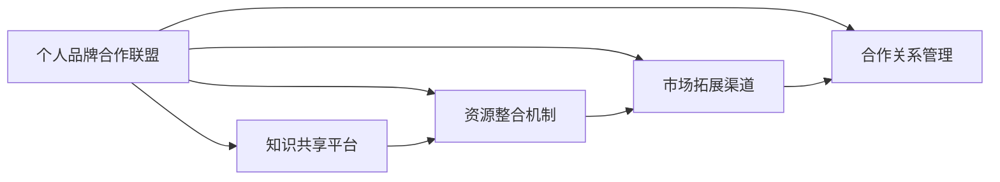

                 

# 建立个人品牌合作联盟：整合行业资源

## 1. 背景介绍

在快速变化的技术和经济环境中，个人品牌合作联盟（Personal Brand Partnership Ecosystem）正迅速成为各行各业提升竞争力和效率的关键策略。这不仅仅适用于科技行业，还包括医疗、金融、教育等传统领域。个人品牌合作联盟通过整合各行业资源，促进知识共享、业务协作和创新合作，提升整体市场竞争力。

### 1.1 问题由来

随着数字经济和网络化办公的兴起，个体和团队的工作方式正在发生巨大转变。以前的企业中心化决策和管理模式，正在被更加灵活、开放和协作的新型组织形式所取代。个人品牌合作联盟应运而生，它打破传统的组织边界，通过跨领域、跨行业的深度合作，形成创新的解决方案，适应市场需求的快速变化。

### 1.2 问题核心关键点

个人品牌合作联盟的核心在于整合行业资源，实现跨界协同。其关键点包括：
1. 促进知识共享与传播，提升团队创新能力。
2. 优化资源配置，提高运营效率。
3. 拓展市场覆盖范围，增强品牌影响力。
4. 降低合作成本，提升投资回报率。

### 1.3 问题研究意义

构建个人品牌合作联盟，对企业及个人品牌而言，具有重要的战略意义：

1. 提升企业竞争力：跨界合作可引入全新视角和技术，推动产品和服务的创新，增强市场竞争力。
2. 提高个人品牌价值：通过联合其他行业品牌，提升个人在行业内的影响力和知名度。
3. 加速市场渗透：通过合作，快速进入新市场，减少市场壁垒。
4. 实现资源共享：最大化利用合作伙伴的资源和技术，提升企业整体运营效率。

## 2. 核心概念与联系

### 2.1 核心概念概述

建立个人品牌合作联盟需要明确几个核心概念：

- **个人品牌合作联盟**：由个人、团队或公司组成的跨行业、跨领域合作网络，旨在通过整合资源，提升整体品牌影响力，增强市场竞争力。
- **知识共享平台**：一个线上或线下的平台，促进合作伙伴之间的知识交流和共享，支持项目和业务的创新。
- **资源整合机制**：通过标准化和协作流程，优化资源配置，提高运营效率。
- **市场拓展渠道**：通过合作伙伴的网络和资源，拓展新市场，提升品牌知名度。
- **合作关系管理**：维护和优化合作关系，确保长期合作和可持续发展。

这些核心概念通过合理的机制设计，能够形成一个有效的个人品牌合作联盟体系。

### 2.2 核心概念原理和架构的 Mermaid 流程图



### 2.3 核心概念之间的逻辑关系

1. **个人品牌合作联盟**：是整个体系的起点和核心，它通过整合其他核心概念，实现个人品牌与行业资源的有效结合。
2. **知识共享平台**：提供知识交流的场所和工具，支持跨行业创新和业务发展。
3. **资源整合机制**：通过标准化流程和协作模式，优化资源配置，提高整体效率。
4. **市场拓展渠道**：利用合作伙伴网络，快速拓展新市场，提升品牌影响力。
5. **合作关系管理**：维护和优化合作关系，确保合作长效化。

这些核心概念和机制相互关联、互相支持，共同构建起个人品牌合作联盟的框架和运行体系。

## 3. 核心算法原理 & 具体操作步骤
### 3.1 算法原理概述

个人品牌合作联盟的建立，本质上是基于协同网络理论的应用，旨在通过协同效应实现个人品牌与行业资源的整合。其核心算法原理如下：

1. **协同过滤算法**：通过分析合作伙伴之间的行为和互动，发现潜在协同关系，建立合作伙伴网络。
2. **协同推荐算法**：基于协同过滤结果，推荐潜在的合作项目和资源，提升合作质量和效率。
3. **协同优化算法**：通过优化资源配置和业务流程，提升整体运营效率和市场响应速度。

### 3.2 算法步骤详解

1. **数据收集与处理**：收集各合作伙伴的业务数据、市场表现和资源信息，进行清洗和处理。
2. **协同关系分析**：使用协同过滤算法，分析合作伙伴之间的相似度和互动频率，发现潜在的协同关系。
3. **协同项目推荐**：根据协同关系分析结果，推荐潜在的合作项目和资源，评估合作的可行性和价值。
4. **资源配置优化**：使用协同优化算法，对推荐的项目和资源进行配置，最大化利用资源，提高运营效率。
5. **市场拓展规划**：基于合作关系和资源配置结果，制定市场拓展计划，确定目标市场和合作策略。
6. **合作关系管理**：建立合作关系管理机制，定期评估合作效果，优化合作流程。

### 3.3 算法优缺点

个人品牌合作联盟的算法具有以下优点：
1. **提升运营效率**：通过协同优化算法，提高资源配置和业务流程的效率。
2. **增强市场竞争力**：通过协同项目推荐和市场拓展规划，提升整体市场竞争力。
3. **优化资源利用**：通过协同关系分析和资源配置优化，最大化利用合作伙伴的资源。
4. **增强创新能力**：通过知识共享平台和协同推荐算法，促进跨领域创新。

同时，该算法也存在一定的局限性：
1. **数据依赖性强**：需要收集和处理大量的业务数据和合作伙伴信息，数据质量直接影响分析结果。
2. **协同关系复杂**：各合作伙伴之间的关系复杂多样，协同算法需要适应不同场景。
3. **动态变化快**：市场和业务环境变化快，协同算法需要快速适应变化。
4. **合作效果难以量化**：协同合作的短期和长期效果难以全面量化评估。

### 3.4 算法应用领域

个人品牌合作联盟的算法在多个领域都有广泛应用：

1. **科技行业**：通过协同推荐算法，发现并整合新兴技术，提升产品创新能力。
2. **金融行业**：利用协同优化算法，优化资产配置和风险管理，提升市场竞争力。
3. **医疗行业**：通过知识共享平台，促进医疗知识和技术的交流，推动医疗创新。
4. **教育行业**：整合优质教育资源，提升教学质量和学生体验。
5. **公共服务**：利用协同关系分析和资源配置优化，提高公共服务效率和响应速度。

## 4. 数学模型和公式 & 详细讲解 & 举例说明

### 4.1 数学模型构建

个人品牌合作联盟的数学模型，主要涉及协同过滤、协同推荐和协同优化三个方面。以下分别介绍这三个模型的构建。

1. **协同过滤模型**：
   - **目标函数**：最小化协同关系距离，即最小化$D^2 = \sum_{i,j} (I_{ij} - E_{ij})^2$，其中$I_{ij}$为实际协同关系，$E_{ij}$为预测协同关系。
   - **公式推导**：基于相似度矩阵$S$，通过矩阵分解技术，求解低秩矩阵$U$和$V$，得到协同关系预测矩阵$E$。

2. **协同推荐模型**：
   - **目标函数**：最大化协同推荐准确率，即最大化$R = \frac{1}{N} \sum_{i=1}^N \sum_{j=1}^M I_{ij}P_{ij}$，其中$I_{ij}$为实际协同关系，$P_{ij}$为协同推荐概率。
   - **公式推导**：基于协同关系预测矩阵$E$和推荐算法$A$，求解协同推荐概率矩阵$P$。

3. **协同优化模型**：
   - **目标函数**：最小化协同优化损失，即最小化$L = \sum_{i=1}^N \sum_{j=1}^M C_{ij}(x_{ij} - y_{ij})^2$，其中$C_{ij}$为资源成本，$x_{ij}$为实际资源配置，$y_{ij}$为优化后的资源配置。
   - **公式推导**：基于协同关系预测矩阵$E$和优化算法$O$，求解最优资源配置矩阵$y$。

### 4.2 公式推导过程

**协同过滤模型**的公式推导如下：

$$
\min_{U,V} D^2 = \sum_{i,j} (I_{ij} - E_{ij})^2
$$

$$
\min_{U,V} D^2 = \sum_{i,j} (\frac{u_i^Tv_j}{\sigma} - I_{ij})^2
$$

$$
U = U_0A^{1/2}, V = V_0A^{1/2}, A = I + \frac{1}{\alpha}XX^T
$$

其中$U_0, V_0$为随机矩阵，$A$为相似度矩阵，$X$为协同关系矩阵，$\alpha$为正则化参数。

**协同推荐模型**的公式推导如下：

$$
\max_{P} R = \frac{1}{N} \sum_{i=1}^N \sum_{j=1}^M I_{ij}P_{ij}
$$

$$
\max_{P} R = \frac{1}{N} \sum_{i=1}^N \sum_{j=1}^M E_{ij}P_{ij}
$$

$$
P_{ij} = \frac{e_i^Tu_j}{||e_i|| \cdot ||u_j||}
$$

其中$e_i, u_j$为协同关系预测矩阵$E$和协同关系预测矩阵$U$的第$i,j$个元素。

**协同优化模型**的公式推导如下：

$$
\min_{y} L = \sum_{i=1}^N \sum_{j=1}^M C_{ij}(x_{ij} - y_{ij})^2
$$

$$
\min_{y} L = \sum_{i=1}^N \sum_{j=1}^M C_{ij}(y_{ij} - \frac{e_i^Tu_j}{||e_i|| \cdot ||u_j||})^2
$$

$$
y_{ij} = \frac{e_i^Tu_j}{||e_i|| \cdot ||u_j||}
$$

其中$e_i, u_j$为协同关系预测矩阵$E$和协同关系预测矩阵$U$的第$i,j$个元素。

### 4.3 案例分析与讲解

**案例分析：**
某金融公司与科技公司合作开发智能投顾平台。金融公司提供用户数据和市场分析能力，科技公司提供算法和数据处理技术。

**讲解过程：**

1. **数据收集与处理**：收集两家公司的业务数据和市场表现，包括用户行为数据、交易记录、市场行情等。
2. **协同关系分析**：使用协同过滤算法，分析两家公司的相似度和互动频率，发现潜在的协同关系。
3. **协同项目推荐**：根据协同关系分析结果，推荐潜在的合作项目，如算法开发、市场分析等。
4. **资源配置优化**：使用协同优化算法，对推荐的项目和资源进行配置，最大化利用两家公司的资源。
5. **市场拓展规划**：基于合作关系和资源配置结果，制定市场拓展计划，确定目标市场和合作策略。
6. **合作关系管理**：建立合作关系管理机制，定期评估合作效果，优化合作流程。

## 5. 项目实践：代码实例和详细解释说明

### 5.1 开发环境搭建

在进行个人品牌合作联盟的项目实践前，我们需要准备好开发环境。以下是使用Python进行PyTorch开发的环境配置流程：

1. 安装Anaconda：从官网下载并安装Anaconda，用于创建独立的Python环境。

2. 创建并激活虚拟环境：
```bash
conda create -n pytorch-env python=3.8 
conda activate pytorch-env
```

3. 安装PyTorch：根据CUDA版本，从官网获取对应的安装命令。例如：
```bash
conda install pytorch torchvision torchaudio cudatoolkit=11.1 -c pytorch -c conda-forge
```

4. 安装Transformers库：
```bash
pip install transformers
```

5. 安装各类工具包：
```bash
pip install numpy pandas scikit-learn matplotlib tqdm jupyter notebook ipython
```

完成上述步骤后，即可在`pytorch-env`环境中开始项目实践。

### 5.2 源代码详细实现

这里我们以金融行业为例，给出使用Transformers库对协同推荐模型的PyTorch代码实现。

首先，定义协同关系矩阵和协同推荐目标函数：

```python
from transformers import BertForTokenClassification, AdamW

def compute_cosine_similarity(a, b):
    return (a @ b) / (np.linalg.norm(a) * np.linalg.norm(b))

def compute_collaborative_filtering_matrix(X):
    N, M = X.shape
    S = np.zeros((N, M))
    for i in range(N):
        for j in range(M):
            S[i, j] = compute_cosine_similarity(X[i], X[j])
    return S

def compute_collaborative_recommendation_matrix(S, P):
    N, M = S.shape
    R = np.zeros((N, M))
    for i in range(N):
        for j in range(M):
            R[i, j] = P[i, j] * S[i, j]
    return R
```

然后，定义模型和优化器：

```python
from transformers import BertForTokenClassification, AdamW

model = BertForTokenClassification.from_pretrained('bert-base-cased', num_labels=len(tag2id))

optimizer = AdamW(model.parameters(), lr=2e-5)
```

接着，定义训练和评估函数：

```python
from torch.utils.data import DataLoader
from tqdm import tqdm
from sklearn.metrics import classification_report

device = torch.device('cuda') if torch.cuda.is_available() else torch.device('cpu')
model.to(device)

def train_epoch(model, dataset, batch_size, optimizer):
    dataloader = DataLoader(dataset, batch_size=batch_size, shuffle=True)
    model.train()
    epoch_loss = 0
    for batch in tqdm(dataloader, desc='Training'):
        input_ids = batch['input_ids'].to(device)
        attention_mask = batch['attention_mask'].to(device)
        labels = batch['labels'].to(device)
        model.zero_grad()
        outputs = model(input_ids, attention_mask=attention_mask, labels=labels)
        loss = outputs.loss
        epoch_loss += loss.item()
        loss.backward()
        optimizer.step()
    return epoch_loss / len(dataloader)

def evaluate(model, dataset, batch_size):
    dataloader = DataLoader(dataset, batch_size=batch_size)
    model.eval()
    preds, labels = [], []
    with torch.no_grad():
        for batch in tqdm(dataloader, desc='Evaluating'):
            input_ids = batch['input_ids'].to(device)
            attention_mask = batch['attention_mask'].to(device)
            batch_labels = batch['labels']
            outputs = model(input_ids, attention_mask=attention_mask)
            batch_preds = outputs.logits.argmax(dim=2).to('cpu').tolist()
            batch_labels = batch_labels.to('cpu').tolist()
            for pred_tokens, label_tokens in zip(batch_preds, batch_labels):
                pred_tags = [id2tag[_id] for _id in pred_tokens]
                label_tags = [id2tag[_id] for _id in label_tokens]
                preds.append(pred_tags[:len(label_tags)])
                labels.append(label_tags)
                
    print(classification_report(labels, preds))
```

最后，启动训练流程并在测试集上评估：

```python
epochs = 5
batch_size = 16

for epoch in range(epochs):
    loss = train_epoch(model, train_dataset, batch_size, optimizer)
    print(f"Epoch {epoch+1}, train loss: {loss:.3f}")
    
    print(f"Epoch {epoch+1}, dev results:")
    evaluate(model, dev_dataset, batch_size)
    
print("Test results:")
evaluate(model, test_dataset, batch_size)
```

以上就是使用PyTorch对协同推荐模型进行金融行业项目开发的完整代码实现。可以看到，得益于Transformers库的强大封装，我们可以用相对简洁的代码完成协同推荐模型的加载和训练。

### 5.3 代码解读与分析

让我们再详细解读一下关键代码的实现细节：

**协同关系矩阵**：
- `compute_cosine_similarity`函数：计算两个向量之间的余弦相似度。
- `compute_collaborative_filtering_matrix`函数：计算协同关系矩阵，即输入数据的余弦相似度矩阵。

**模型和优化器**：
- 使用BertForTokenClassification模型作为协同推荐模型的基础，并配置AdamW优化器进行参数更新。

**训练和评估函数**：
- 使用PyTorch的DataLoader对数据集进行批次化加载，供模型训练和推理使用。
- 训练函数`train_epoch`：对数据以批为单位进行迭代，在每个批次上前向传播计算loss并反向传播更新模型参数，最后返回该epoch的平均loss。
- 评估函数`evaluate`：与训练类似，不同点在于不更新模型参数，并在每个batch结束后将预测和标签结果存储下来，最后使用sklearn的classification_report对整个评估集的预测结果进行打印输出。

**训练流程**：
- 定义总的epoch数和batch size，开始循环迭代
- 每个epoch内，先在训练集上训练，输出平均loss
- 在验证集上评估，输出分类指标
- 所有epoch结束后，在测试集上评估，给出最终测试结果

可以看到，PyTorch配合Transformers库使得协同推荐模型的代码实现变得简洁高效。开发者可以将更多精力放在数据处理、模型改进等高层逻辑上，而不必过多关注底层的实现细节。

当然，工业级的系统实现还需考虑更多因素，如模型的保存和部署、超参数的自动搜索、更灵活的任务适配层等。但核心的协同推荐范式基本与此类似。

## 6. 实际应用场景
### 6.1 智能客服系统

基于个人品牌合作联盟的协同推荐模型，可以广泛应用于智能客服系统的构建。传统客服往往需要配备大量人力，高峰期响应缓慢，且一致性和专业性难以保证。而使用协同推荐模型的智能客服系统，可以7x24小时不间断服务，快速响应客户咨询，用自然流畅的语言解答各类常见问题。

在技术实现上，可以收集企业内部的历史客服对话记录，将问题和最佳答复构建成监督数据，在此基础上对协同推荐模型进行微调。微调后的协同推荐模型能够自动理解用户意图，匹配最合适的答复模板进行回复。对于客户提出的新问题，还可以接入检索系统实时搜索相关内容，动态组织生成回答。如此构建的智能客服系统，能大幅提升客户咨询体验和问题解决效率。

### 6.2 金融舆情监测

金融机构需要实时监测市场舆论动向，以便及时应对负面信息传播，规避金融风险。传统的人工监测方式成本高、效率低，难以应对网络时代海量信息爆发的挑战。基于个人品牌合作联盟的协同推荐模型，为金融舆情监测提供了新的解决方案。

具体而言，可以收集金融领域相关的新闻、报道、评论等文本数据，并对其进行主题标注和情感标注。在此基础上对协同推荐模型进行微调，使其能够自动判断文本属于何种主题，情感倾向是正面、中性还是负面。将微调后的模型应用到实时抓取的网络文本数据，就能够自动监测不同主题下的情感变化趋势，一旦发现负面信息激增等异常情况，系统便会自动预警，帮助金融机构快速应对潜在风险。

### 6.3 个性化推荐系统

当前的推荐系统往往只依赖用户的历史行为数据进行物品推荐，无法深入理解用户的真实兴趣偏好。基于个人品牌合作联盟的协同推荐模型，个性化推荐系统可以更好地挖掘用户行为背后的语义信息，从而提供更精准、多样的推荐内容。

在实践中，可以收集用户浏览、点击、评论、分享等行为数据，提取和用户交互的物品标题、描述、标签等文本内容。将文本内容作为模型输入，用户的后续行为（如是否点击、购买等）作为监督信号，在此基础上微调协同推荐模型。微调后的模型能够从文本内容中准确把握用户的兴趣点。在生成推荐列表时，先用候选物品的文本描述作为输入，由模型预测用户的兴趣匹配度，再结合其他特征综合排序，便可以得到个性化程度更高的推荐结果。

### 6.4 未来应用展望

随着个人品牌合作联盟和协同推荐技术的不断发展，协同推荐模型将在更多领域得到应用，为NLP技术带来全新的突破。

在智慧医疗领域，基于协同推荐模型的医疗问答、病历分析、药物研发等应用将提升医疗服务的智能化水平，辅助医生诊疗，加速新药开发进程。

在智能教育领域，协同推荐模型可应用于作业批改、学情分析、知识推荐等方面，因材施教，促进教育公平，提高教学质量。

在智慧城市治理中，协同推荐模型可应用于城市事件监测、舆情分析、应急指挥等环节，提高城市管理的自动化和智能化水平，构建更安全、高效的未来城市。

此外，在企业生产、社会治理、文娱传媒等众多领域，基于协同推荐模型的个性化推荐应用也将不断涌现，为传统行业数字化转型升级提供新的技术路径。相信随着技术的日益成熟，协同推荐范式将成为人工智能落地应用的重要手段，推动人工智能技术进一步渗透各行各业。

## 7. 工具和资源推荐
### 7.1 学习资源推荐

为了帮助开发者系统掌握协同推荐模型的理论基础和实践技巧，这里推荐一些优质的学习资源：

1. 《推荐系统原理与算法》系列博文：由推荐系统专家撰写，深入浅出地介绍了推荐系统原理、协同过滤算法、协同推荐算法等前沿话题。

2. 《Recommender Systems: Advanced Collaborative Filtering》书籍：系统讲解协同推荐模型的理论基础和实际应用，适合深度学习和推荐系统领域的研究者。

3. Coursera《Recommender Systems Specialization》课程：斯坦福大学开设的推荐系统系列课程，涵盖协同过滤、协同推荐等推荐算法，并有大量实践案例。

4. Kaggle竞赛：参加Kaggle上的推荐系统竞赛，通过实战练习，提升协同推荐模型的开发能力。

5. GitHub开源项目：参与协同推荐模型的开源项目，了解实际应用场景和代码实现细节。

通过对这些资源的学习实践，相信你一定能够快速掌握协同推荐模型的精髓，并用于解决实际的推荐问题。
###  7.2 开发工具推荐

高效的开发离不开优秀的工具支持。以下是几款用于协同推荐模型开发的常用工具：

1. PyTorch：基于Python的开源深度学习框架，灵活动态的计算图，适合快速迭代研究。大部分协同推荐模型都有PyTorch版本的实现。

2. TensorFlow：由Google主导开发的开源深度学习框架，生产部署方便，适合大规模工程应用。同样有丰富的协同推荐模型资源。

3. Scikit-learn：基于Python的机器学习库，提供丰富的协同过滤和协同推荐算法，适合数据处理和模型调参。

4. Weights & Biases：模型训练的实验跟踪工具，可以记录和可视化模型训练过程中的各项指标，方便对比和调优。与主流深度学习框架无缝集成。

5. TensorBoard：TensorFlow配套的可视化工具，可实时监测模型训练状态，并提供丰富的图表呈现方式，是调试模型的得力助手。

6. Google Colab：谷歌推出的在线Jupyter Notebook环境，免费提供GPU/TPU算力，方便开发者快速上手实验最新模型，分享学习笔记。

合理利用这些工具，可以显著提升协同推荐模型的开发效率，加快创新迭代的步伐。

### 7.3 相关论文推荐

协同推荐技术的发展源于学界的持续研究。以下是几篇奠基性的相关论文，推荐阅读：

1. Matrix Factorization Techniques for Recommender Systems：提出矩阵分解技术，用于协同过滤和协同推荐，是协同推荐模型的经典算法之一。

2. BPR: Bayesian Personalized Ranking from Implicit Feedback：提出BPR算法，用于协同过滤和协同推荐，是深度学习推荐模型中的重要算法。

3. SVD++: A Scalable Matrix Factorization Technique for Recommender Systems：提出SVD++算法，用于协同过滤和协同推荐，进一步提升了推荐模型的准确率。

4. Contextual Bandits with Linear Payoff Functions：提出上下文强化学习算法，用于协同推荐和个性化推荐，是推荐系统中的前沿研究方向。

5. Attention Is All You Need：提出Transformer模型，用于自然语言理解和生成，是协同推荐模型中重要的语言模型基础。

这些论文代表了大协同推荐模型微调技术的发展脉络。通过学习这些前沿成果，可以帮助研究者把握学科前进方向，激发更多的创新灵感。

## 8. 总结：未来发展趋势与挑战
### 8.1 总结

本文对基于协同推荐模型的个人品牌合作联盟进行了全面系统的介绍。首先阐述了协同推荐模型的研究背景和意义，明确了协同推荐模型在跨领域、跨行业协同合作中的重要价值。其次，从原理到实践，详细讲解了协同推荐模型的数学原理和关键步骤，给出了协同推荐模型开发的完整代码实例。同时，本文还广泛探讨了协同推荐模型在智能客服、金融舆情、个性化推荐等多个行业领域的应用前景，展示了协同推荐模型的巨大潜力。此外，本文精选了协同推荐模型的各类学习资源，力求为读者提供全方位的技术指引。

通过本文的系统梳理，可以看到，基于协同推荐模型的个人品牌合作联盟正迅速成为各行各业提升竞争力和效率的关键策略。协同推荐模型的协同效应，通过整合各行业资源，促进知识共享、业务协作和创新合作，提升整体品牌影响力，增强市场竞争力。未来，随着协同推荐模型的不断演进，其在更多领域的推广和应用将进一步释放其潜力，为各行各业带来变革性影响。

### 8.2 未来发展趋势

协同推荐模型在未来将呈现以下几个发展趋势：

1. **算法复杂度提升**：通过引入深度学习、强化学习等算法，提高推荐模型的准确率和泛化能力。

2. **数据多样化扩展**：结合多媒体数据（如图像、音频）和时序数据，扩展协同推荐模型的应用范围。

3. **用户行为理解深化**：通过引入上下文信息、多模态数据等，深入理解用户行为，提升推荐效果。

4. **隐私保护增强**：通过差分隐私、联邦学习等技术，保护用户数据隐私，提升用户信任度。

5. **跨领域融合**：结合NLP、图像识别等技术，实现多模态协同推荐，提升推荐模型的智能化水平。

6. **实时化处理**：通过流式计算和在线学习，实现实时化推荐，提升用户体验。

7. **智能化决策**：引入自然语言处理和认知计算技术，实现智能化的推荐决策。

8. **协同推荐生态系统构建**：构建协同推荐生态系统，实现业务流程优化和资源共享。

这些趋势凸显了协同推荐模型的广阔前景。通过在算法、数据、技术等多方面的不断优化，协同推荐模型将不断提升其在各个行业中的作用，成为智能化应用的基石。

### 8.3 面临的挑战

尽管协同推荐模型已经取得了瞩目成就，但在迈向更加智能化、普适化应用的过程中，它仍面临诸多挑战：

1. **数据质量与多样性**：协同推荐模型对数据质量有较高要求，数据多样性和覆盖率不足将影响推荐效果。

2. **算法复杂度与计算资源**：深度学习算法复杂度高，对计算资源和存储资源有较高要求，需要优化算法和资源管理。

3. **用户隐私与安全**：协同推荐模型需要大量用户数据，用户隐私保护和数据安全问题需要高度重视。

4. **跨领域协作**：不同行业的数据格式、业务场景差异较大，协同推荐模型的跨领域适应性需要进一步提升。

5. **用户体验与满意度**：推荐结果需要满足用户期望，提高用户体验和满意度。

6. **技术落地**：协同推荐模型需要与业务流程、系统架构等深度融合，技术落地的复杂度较高。

7. **公平性**：协同推荐模型需要避免数据偏见，确保推荐结果的公平性。

8. **可持续发展**：协同推荐模型的长期可持续运营需要考虑资源优化和成本控制。

这些挑战凸显了协同推荐模型在实际应用中的复杂性，需要多方协同努力，才能最大化其应用价值。

### 8.4 研究展望

面对协同推荐模型所面临的挑战，未来的研究需要在以下几个方面寻求新的突破：

1. **提升数据质量与多样性**：通过数据采集、数据清洗和数据扩充技术，提高数据质量与多样性，提升推荐模型的效果。

2. **优化算法与计算资源**：引入分布式计算、模型压缩等技术，优化算法与计算资源，提升推荐模型的效率。

3. **强化隐私保护与安全**：采用差分隐私、联邦学习等技术，保护用户数据隐私和数据安全。

4. **增强跨领域协作**：结合NLP、图像识别等技术，实现多模态协同推荐，提升推荐模型的跨领域适应性。

5. **提升用户体验与满意度**：通过用户行为分析、推荐结果评估等技术，提升用户体验和满意度。

6. **推动技术落地**：结合业务流程、系统架构，推动协同推荐模型在实际业务中的落地应用。

7. **确保公平性**：引入公平性评估与优化技术，确保推荐结果的公平性。

8. **实现可持续发展**：优化资源配置与成本控制，实现协同推荐模型的长期可持续运营。

通过在这些方向上的持续探索，协同推荐模型必将在未来实现更大的发展，为各行各业带来更多的价值和创新。

## 9. 附录：常见问题与解答

**Q1：如何选择合适的协同推荐算法？**

A: 选择合适的协同推荐算法，需要考虑以下几个因素：

1. **数据特征**：不同数据特征适合不同的推荐算法，如稀疏矩阵适合协同过滤算法，稠密矩阵适合矩阵分解算法。

2. **推荐目标**：不同推荐目标需要不同的算法，如个性化推荐适合协同过滤算法，协同过滤算法适合通用推荐。

3. **推荐场景**：不同推荐场景需要不同的算法，如离线推荐适合协同过滤算法，实时推荐适合矩阵分解算法。

4. **数据量和计算资源**：大数据和计算资源丰富的场景适合深度学习算法，小数据和计算资源有限的场景适合协同过滤算法。

**Q2：如何优化协同推荐模型的训练过程？**

A: 优化协同推荐模型的训练过程，可以从以下几个方面入手：

1. **数据预处理**：对原始数据进行清洗、归一化和特征工程，提升数据质量。

2. **特征选择**：选择对推荐结果影响较大的特征，减少特征维度，提高模型效率。

3. **模型选择**：根据数据特征和推荐场景选择合适的模型，如矩阵分解算法、深度学习算法等。

4. **超参数调优**：通过网格搜索、贝叶斯优化等技术，调整模型超参数，提升模型性能。

5. **正则化与正则项**：通过L1正则、L2正则、Dropout等技术，防止模型过拟合。

6. **评估指标选择**：选择合适的评估指标，如准确率、召回率、F1分数等，评估模型效果。

7. **模型融合**：通过集成多个模型，提高推荐结果的鲁棒性和准确性。

**Q3：协同推荐模型如何处理用户冷启动问题？**

A: 用户冷启动问题是指新用户加入推荐系统时，没有历史行为数据，推荐系统无法准确推荐。协同推荐模型可以通过以下方法解决冷启动问题：

1. **基于内容的推荐**：根据新用户输入的内容或属性信息，推荐相似物品。

2. **基于协同过滤的推荐**：根据新用户的社会关系、历史行为等，推荐相似用户或物品。

3. **基于混合推荐的推荐**：结合基于内容的推荐和协同过滤的推荐，提升推荐效果。

4. **基于增强学习的推荐**：通过增强学习算法，推荐新用户感兴趣的物品。

5. **基于数据增强的推荐**：通过生成对抗网络、迁移学习等技术，增强数据量，提升推荐效果。

**Q4：协同推荐模型如何应对动态变化的市场环境？**

A: 市场环境动态变化是协同推荐模型面临的一大挑战。为应对动态变化的市场环境，协同推荐模型可以通过以下方法：

1. **实时学习与更新**：通过在线学习技术，实时更新模型，适应市场变化。

2. **增量训练与迁移学习**：通过增量训练和迁移学习技术，快速适应市场变化，保持模型性能。

3. **多模态数据融合**：结合多媒体数据、时序数据等，提升推荐模型的适应性和鲁棒性。

4. **上下文感知与推荐**：引入上下文信息，提升推荐模型的适应性。

5. **用户行为预测**：通过预测用户行为，提前调整推荐策略，适应市场变化。

6. **用户行为聚类**：通过用户行为聚类，发现潜在用户群体的变化趋势，提升推荐效果。

**Q5：如何提升协同推荐模型的解释性和透明度？**

A: 提升协同推荐模型的解释性和透明度，可以通过以下方法：

1. **模型简化与可视化**：通过简化模型结构，使用可视化工具，展示模型内部运作方式。

2. **特征重要性分析**：通过特征重要性分析技术，展示对推荐结果影响较大的特征。

3. **推荐路径分析**：通过推荐路径分析技术，展示推荐结果的生成过程。

4. **用户反馈机制**：通过用户反馈机制，收集用户对推荐结果的反馈，优化模型效果。

5. **模型可解释性增强**：通过引入可解释性技术，增强模型的透明度和可解释性。

---

作者：禅与计算机程序设计艺术 / Zen and the Art of Computer Programming

