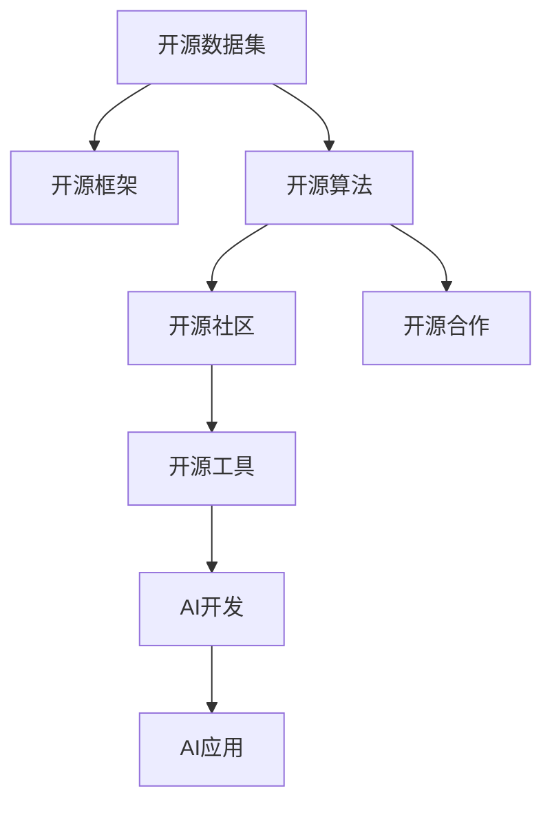

                 

# 开源技术在推动AI进步中的作用

> 关键词：开源技术,人工智能,深度学习,机器学习,大数据,深度学习框架

## 1. 背景介绍

### 1.1 问题由来
近年来，人工智能（AI）技术迅猛发展，成为引领未来科技变革的重要方向。其中，深度学习作为AI的核心技术之一，在图像识别、语音识别、自然语言处理等领域取得了显著成果。然而，AI技术的进步离不开开源技术的支撑，从数据集、框架到模型，开源社区为AI的进步提供了强大的基础设施。

开源技术的迅猛发展不仅推动了AI技术的不断突破，还极大地降低了AI技术的入门门槛，加速了AI技术的普及和应用。本文将深入探讨开源技术在推动AI进步中的作用，包括开源技术如何影响AI生态系统的构建，如何推动AI算法的创新和优化，以及如何促进AI技术的产业化和商业化应用。

### 1.2 问题核心关键点
开源技术在推动AI进步中扮演了至关重要的角色，其主要贡献体现在以下几个方面：

1. **开源数据集**：提供了大量高质量的数据集，为AI模型训练和优化提供了基础。
2. **开源框架**：构建了灵活高效的工具链，加速了AI模型的开发和部署。
3. **开源算法**：推动了AI算法的创新和优化，提高了模型的性能和可解释性。
4. **开源社区**：汇聚了大量优秀的开发者和研究人员，促进了知识和技术的共享与传播。
5. **开源合作**：通过跨领域合作，促进了AI技术的产业化和商业化应用。

这些关键点共同构成了开源技术在推动AI进步中的核心作用，为AI技术的未来发展提供了坚实的基础。

## 2. 核心概念与联系

### 2.1 核心概念概述

为更好地理解开源技术在AI进步中的作用，本节将介绍几个密切相关的核心概念：

- **开源数据集**：由开源社区提供的、公共可用的数据集，如ImageNet、COCO、Wikipedia等，用于训练和评估AI模型。
- **开源框架**：包括深度学习框架（如TensorFlow、PyTorch）、大数据处理框架（如Hadoop、Spark）和计算机视觉库（如OpenCV）等，为AI模型的开发提供了基础设施。
- **开源算法**：指由开源社区开发的、公开可用的AI算法和模型，如卷积神经网络（CNN）、循环神经网络（RNN）和生成对抗网络（GAN）等，推动了AI技术的发展。
- **开源社区**：由志愿者和专业开发者组成的社区，致力于构建和维护开源软件，促进知识共享和技术传播。
- **开源合作**：通过开源软件和社区的合作，实现跨领域的知识和技术整合，促进AI技术的产业化和商业化应用。

这些核心概念之间的逻辑关系可以通过以下Mermaid流程图来展示：



这个流程图展示开源技术在AI生态系统中的核心作用：

1. 开源数据集为AI模型的训练和优化提供了基础。
2. 开源框架构建了AI模型的开发和部署工具链。
3. 开源算法推动了AI技术的创新和优化。
4. 开源社区促进了知识和技术的共享与传播。
5. 开源合作推动了AI技术的产业化和商业化应用。

这些概念共同构成了开源技术在推动AI进步中的基础框架，使其能够支撑AI技术的不断发展和应用。

## 3. 核心算法原理 & 具体操作步骤
### 3.1 算法原理概述

开源技术在AI算法原理的推动中发挥了重要作用。以下将介绍几种典型的AI算法及其开源实现：

1. **深度学习框架**：开源深度学习框架（如TensorFlow、PyTorch）提供了灵活高效的计算图和自动微分技术，使得AI模型的训练和优化更加便捷和高效。
2. **卷积神经网络（CNN）**：开源框架实现了各种类型的卷积神经网络，用于图像识别和计算机视觉任务。
3. **循环神经网络（RNN）**：开源框架提供了RNN和其变种（如LSTM、GRU），用于序列数据处理，如语音识别和自然语言处理。
4. **生成对抗网络（GAN）**：开源框架实现了GAN及其变种，用于图像生成和图像增强等任务。
5. **自然语言处理（NLP）**：开源框架提供了NLP工具库（如Hugging Face、Stanford CoreNLP），用于文本分类、命名实体识别、情感分析等任务。

### 3.2 算法步骤详解

以下以TensorFlow为例，介绍TensorFlow在深度学习算法实现中的应用步骤：

1. **准备数据**：收集、清洗、标注训练数据集，划分训练集、验证集和测试集。
2. **搭建模型**：在TensorFlow中定义神经网络模型结构，选择合适的层类型和激活函数。
3. **配置参数**：设置学习率、批大小、迭代轮数等超参数。
4. **训练模型**：使用训练集对模型进行训练，使用验证集评估模型性能。
5. **评估模型**：在测试集上评估模型性能，判断模型是否收敛。
6. **优化模型**：根据评估结果，调整模型结构和参数，进一步优化模型性能。

### 3.3 算法优缺点

开源技术在推动AI算法实现中具有以下优点：

1. **灵活高效**：开源框架提供了灵活的API和高效的计算图，使得算法实现更加便捷和高效。
2. **社区支持**：开源社区提供了大量的教程、文档和代码示例，有助于开发者快速上手和解决实际问题。
3. **持续更新**：开源框架和算法不断更新，保持了技术的领先性和适用性。

同时，开源技术也存在一定的局限性：

1. **学习成本高**：开源框架和算法功能丰富，但需要较长时间学习和理解。
2. **可扩展性差**：开源框架和算法的灵活性可能导致难以适应特定的应用场景。
3. **依赖性强**：开源框架和算法的实现依赖于特定的环境和工具，可能存在兼容性问题。

尽管存在这些局限性，但就目前而言，开源技术仍然是推动AI算法实现的主流方式。未来相关研究的重点在于如何进一步优化开源框架和算法，降低使用门槛，提高可扩展性和兼容性。

### 3.4 算法应用领域

开源技术在AI算法实现中的应用领域非常广泛，涵盖了以下几个主要领域：

1. **计算机视觉**：图像识别、目标检测、图像生成等任务。
2. **自然语言处理**：文本分类、命名实体识别、情感分析、机器翻译等任务。
3. **语音识别**：语音转文本、语音识别、语音合成等任务。
4. **推荐系统**：用户行为预测、商品推荐、广告推荐等任务。
5. **医疗诊断**：医学影像分析、病理诊断、基因分析等任务。
6. **金融分析**：股票预测、信用评分、欺诈检测等任务。
7. **智能制造**：工业检测、质量控制、设备预测维护等任务。

这些领域中，开源技术的应用不仅提升了AI模型的性能，还推动了AI技术的产业化和商业化应用，为各行业带来了新的变革和发展机遇。

## 4. 数学模型和公式 & 详细讲解  
### 4.1 数学模型构建

以下以TensorFlow为例，介绍TensorFlow在深度学习算法实现中的应用步骤：

1. **数据准备**：收集、清洗、标注训练数据集，划分训练集、验证集和测试集。
2. **模型搭建**：定义神经网络模型结构，选择合适的层类型和激活函数。
3. **配置参数**：设置学习率、批大小、迭代轮数等超参数。
4. **训练模型**：使用训练集对模型进行训练，使用验证集评估模型性能。
5. **评估模型**：在测试集上评估模型性能，判断模型是否收敛。
6. **优化模型**：根据评估结果，调整模型结构和参数，进一步优化模型性能。

### 4.2 公式推导过程

以下以TensorFlow中的卷积神经网络（CNN）为例，介绍CNN的数学原理和公式推导过程：

1. **卷积层**：卷积操作可以表示为：
   $$
   f(x) = \sum_{i=0}^{n-1} \sum_{j=0}^{m-1} w_{i,j}x_{i,j}
   $$
   其中，$w_{i,j}$为卷积核，$x_{i,j}$为输入特征，$f(x)$为卷积输出。

2. **池化层**：最大池化操作可以表示为：
   $$
   f(x) = \max_{i=0}^{n-1} \max_{j=0}^{m-1} x_{i,j}
   $$
   其中，$x_{i,j}$为输入特征，$f(x)$为池化输出。

3. **全连接层**：全连接层可以表示为：
   $$
   f(x) = \sum_{i=0}^{n-1} w_{i}x_{i}
   $$
   其中，$w_{i}$为权重，$x_{i}$为输入特征，$f(x)$为全连接层输出。

4. **激活函数**：常用的激活函数有ReLU、Sigmoid、Tanh等，用于增加模型的非线性特性，公式表示如下：
   $$
   f(x) = \max(0, x)
   $$
   $$
   f(x) = \frac{1}{1 + e^{-x}}
   $$
   $$
   f(x) = \tanh(x)
   $$

### 4.3 案例分析与讲解

以下以ImageNet数据集为例，介绍TensorFlow在图像识别任务中的应用：

1. **数据准备**：收集ImageNet数据集，划分为训练集和验证集。
2. **模型搭建**：搭建卷积神经网络（CNN）模型，包括卷积层、池化层、全连接层等。
3. **配置参数**：设置学习率、批大小、迭代轮数等超参数。
4. **训练模型**：使用训练集对模型进行训练，使用验证集评估模型性能。
5. **评估模型**：在测试集上评估模型性能，判断模型是否收敛。
6. **优化模型**：根据评估结果，调整模型结构和参数，进一步优化模型性能。

## 5. 项目实践：代码实例和详细解释说明
### 5.1 开发环境搭建

在进行AI算法实现前，我们需要准备好开发环境。以下是使用Python进行TensorFlow开发的环境配置流程：

1. 安装Anaconda：从官网下载并安装Anaconda，用于创建独立的Python环境。

2. 创建并激活虚拟环境：
```bash
conda create -n tf-env python=3.8 
conda activate tf-env
```

3. 安装TensorFlow：根据CUDA版本，从官网获取对应的安装命令。例如：
```bash
conda install tensorflow -c tf -c conda-forge
```

4. 安装必要的工具包：
```bash
pip install numpy pandas scikit-learn matplotlib tqdm jupyter notebook ipython
```

完成上述步骤后，即可在`tf-env`环境中开始AI算法实现。

### 5.2 源代码详细实现

下面我们以图像识别任务为例，给出使用TensorFlow实现卷积神经网络（CNN）的PyTorch代码实现。

```python
import tensorflow as tf
from tensorflow.keras import layers

# 定义卷积神经网络模型
model = tf.keras.Sequential([
    layers.Conv2D(32, (3, 3), activation='relu', input_shape=(28, 28, 1)),
    layers.MaxPooling2D((2, 2)),
    layers.Flatten(),
    layers.Dense(10, activation='softmax')
])

# 编译模型
model.compile(optimizer='adam', loss='sparse_categorical_crossentropy', metrics=['accuracy'])

# 训练模型
model.fit(train_images, train_labels, epochs=5, validation_data=(test_images, test_labels))

# 评估模型
model.evaluate(test_images, test_labels)
```

在这个代码示例中，我们首先定义了一个简单的卷积神经网络模型，包括卷积层、池化层和全连接层。然后，我们编译模型，设置优化器、损失函数和评估指标。接着，我们使用训练集对模型进行训练，在验证集上评估模型性能，最后在测试集上评估模型性能。

### 5.3 代码解读与分析

让我们再详细解读一下关键代码的实现细节：

**Sequential模型**：
- Sequential是TensorFlow中常用的线性堆叠模型，可以方便地堆叠多个层，实现深度神经网络模型。

**Conv2D层**：
- Conv2D层实现卷积操作，可以设置卷积核大小和数量。

**MaxPooling2D层**：
- MaxPooling2D层实现最大池化操作，减小特征图的尺寸。

**Flatten层**：
- Flatten层将多维特征图展平，用于输入全连接层。

**Dense层**：
- Dense层实现全连接操作，可以设置输出维度和激活函数。

**compile方法**：
- compile方法用于编译模型，设置优化器、损失函数和评估指标。

**fit方法**：
- fit方法用于训练模型，可以指定训练集、验证集、训练轮数等参数。

**evaluate方法**：
- evaluate方法用于评估模型，可以指定测试集和评估指标。

这些代码示例展示了TensorFlow中构建和训练卷积神经网络的基本步骤。在实际应用中，开发者可以根据具体任务调整模型结构和参数，以获得更好的性能。

## 6. 实际应用场景
### 6.1 智能安防系统

基于开源技术的AI算法在智能安防系统中得到了广泛应用。传统安防系统依赖人工监控，容易产生误报和漏报，而使用基于深度学习的目标检测和行为识别算法，可以实时监控视频流，自动检测异常行为，提高安防系统的智能化和自动化水平。

在技术实现上，可以收集大量的监控视频数据，使用开源数据集进行标注，在此基础上对预训练模型进行微调。微调后的模型能够自动检测并分类视频中的各种异常行为，如入侵、破坏等，从而提高安防系统的响应速度和准确性。

### 6.2 智能推荐系统

智能推荐系统是AI技术在电商、新闻、社交等平台中的重要应用。通过开源技术和算法，推荐系统能够实时分析用户行为数据，智能推荐个性化商品、新闻和内容，提升用户体验和平台粘性。

在技术实现上，可以使用开源数据集和算法搭建推荐模型，如协同过滤、内容推荐、基于深度学习的推荐系统等。通过分析用户历史行为数据，提取用户兴趣特征，模型能够精准预测用户可能感兴趣的商品或内容，从而实现高效的个性化推荐。

### 6.3 智能医疗诊断

AI技术在医疗领域的应用也在不断深化。通过开源数据集和算法，AI模型能够辅助医生进行疾病诊断和治疗方案制定，提升医疗服务的智能化和精准化水平。

在技术实现上，可以使用开源数据集和算法构建医疗影像分析和病理诊断模型。通过分析医疗影像数据，模型能够自动识别和分类病变区域，辅助医生进行诊断和治疗方案的制定，从而提高诊疗效率和准确性。

### 6.4 未来应用展望

随着开源技术的不断发展，基于开源技术的AI算法将在更多领域得到应用，为传统行业带来变革性影响。

在智慧城市治理中，开源AI算法可以用于城市事件监测、舆情分析、应急指挥等环节，提高城市管理的自动化和智能化水平，构建更安全、高效的未来城市。

在智能制造中，开源AI算法可以用于工业检测、质量控制、设备预测维护等任务，提高生产效率和设备利用率。

在智能交通中，开源AI算法可以用于交通流量预测、智能交通信号控制等任务，提高交通系统的效率和安全性。

此外，在教育、金融、娱乐等众多领域，基于开源技术的AI算法也将不断涌现，为社会各行各业带来新的技术突破和应用场景。相信随着开源技术的不断进步，AI算法将在更广阔的领域大放异彩。

## 7. 工具和资源推荐
### 7.1 学习资源推荐

为了帮助开发者系统掌握开源技术在AI算法中的应用，这里推荐一些优质的学习资源：

1. TensorFlow官方文档：TensorFlow的官方文档提供了详细的API和使用方法，是学习和使用TensorFlow的必备资料。

2. PyTorch官方文档：PyTorch的官方文档提供了丰富的教程和示例，帮助开发者快速上手和理解PyTorch。

3. Coursera深度学习课程：由深度学习领域知名教授主讲的Coursera深度学习课程，涵盖深度学习的基本概念和实践技巧。

4. Google AI博客：Google AI博客提供了最新的深度学习研究成果和应用案例，值得开发者关注和学习。

5. arXiv深度学习论文：arXiv上的深度学习论文涵盖了最新的研究成果和前沿技术，是了解深度学习最新进展的重要途径。

通过对这些资源的学习实践，相信你一定能够系统掌握开源技术在AI算法中的应用，并用于解决实际的AI问题。

### 7.2 开发工具推荐

高效的开发离不开优秀的工具支持。以下是几款用于AI算法开发的常用工具：

1. TensorFlow：基于Python的开源深度学习框架，提供了灵活高效的计算图和自动微分技术，适合快速迭代研究。

2. PyTorch：基于Python的开源深度学习框架，提供了动态计算图和灵活的API，适合研究和实验。

3. Jupyter Notebook：交互式的笔记本工具，支持Python、R等语言，方便开发和调试AI算法。

4. Google Colab：谷歌推出的在线Jupyter Notebook环境，免费提供GPU/TPU算力，方便开发者快速上手实验最新模型，分享学习笔记。

合理利用这些工具，可以显著提升AI算法开发的效率，加快创新迭代的步伐。

### 7.3 相关论文推荐

开源技术在AI算法中的应用源于学界的持续研究。以下是几篇奠基性的相关论文，推荐阅读：

1. TensorFlow论文：TensorFlow的原始论文，详细介绍了TensorFlow的架构和使用方法。

2. PyTorch论文：PyTorch的原始论文，详细介绍了PyTorch的架构和使用方法。

3. ImageNet论文：ImageNet数据集的原始论文，介绍了ImageNet数据集的构建和使用方法。

4. AlexNet论文：AlexNet模型在ImageNet上的表现，展示了深度学习的巨大潜力。

5. ResNet论文：ResNet模型在ImageNet上的表现，展示了残差网络在深度学习中的重要性。

这些论文代表了大规模深度学习技术的发展脉络，通过学习这些前沿成果，可以帮助研究者把握学科前进方向，激发更多的创新灵感。

## 8. 总结：未来发展趋势与挑战

### 8.1 总结

本文对开源技术在推动AI进步中的作用进行了全面系统的介绍。首先阐述了开源数据集、框架和算法在AI生态系统中的核心作用，明确了开源技术在推动AI算法创新和优化方面的独特价值。其次，从原理到实践，详细讲解了开源AI算法实现的基本步骤和方法，给出了开源AI算法实现的完整代码实例。同时，本文还广泛探讨了开源AI算法在智能安防、智能推荐、智能医疗等诸多领域的应用前景，展示了开源AI算法的巨大潜力。

通过本文的系统梳理，可以看到，开源技术在推动AI进步中的重要作用。这些技术的进步不仅提升了AI算法的性能和效率，还促进了AI算法的产业化和商业化应用，为社会各行各业带来了新的技术突破和应用场景。未来，随着开源技术的不断进步和完善，AI算法必将取得更大的突破，推动人工智能技术在更广阔的领域大放异彩。

### 8.2 未来发展趋势

展望未来，开源技术在推动AI进步中仍将保持强劲的发展势头，主要趋势如下：

1. **技术不断进步**：开源技术将继续推动AI算法创新和优化，提升模型的性能和可解释性。

2. **应用场景扩展**：开源AI算法将在更多领域得到应用，为传统行业带来变革性影响。

3. **产业化和商业化**：开源AI算法将逐步走向产业化和商业化，为各行业带来新的业务价值和竞争优势。

4. **国际合作加强**：全球开源社区的合作将更加紧密，推动AI技术在全球范围内的普及和应用。

5. **开源生态系统完善**：开源社区将提供更完善的技术支持和工具链，促进开发者高效协作。

6. **跨领域融合**：开源AI算法将与其他前沿技术（如区块链、物联网）进行融合，推动AI技术的跨越式发展。

以上趋势凸显了开源技术在推动AI进步中的广阔前景。这些方向的探索发展，必将进一步提升AI算法的性能和应用范围，为人类认知智能的进化带来深远影响。

### 8.3 面临的挑战

尽管开源技术在推动AI进步中取得了显著成就，但在迈向更加智能化、普适化应用的过程中，它仍面临着诸多挑战：

1. **数据隐私和伦理问题**：开源数据集和算法的使用需要考虑数据隐私和伦理问题，确保数据使用的合法性和安全性。

2. **开源技术兼容性**：不同开源框架和算法的兼容性问题仍需解决，确保跨平台和跨系统的互通。

3. **开源社区合作**：开源社区的合作需要进一步加强，确保技术的共享和传播。

4. **开源技术标准化**：开源技术需要标准化，确保不同开源项目之间的互操作性。

5. **开源社区管理**：开源社区需要更好的管理，确保项目的健康发展和技术的持续优化。

6. **开源技术可持续性**：开源技术需要长期维护和更新，确保其可持续性和适用性。

正视开源技术面临的这些挑战，积极应对并寻求突破，将是大规模深度学习技术走向成熟的必由之路。相信随着学界和产业界的共同努力，这些挑战终将一一被克服，开源技术必将在构建人机协同的智能时代中扮演越来越重要的角色。

### 8.4 研究展望

面向未来，开源技术在推动AI进步中需要进一步的研究和探索，主要包括：

1. **开源数据集和算法的标准化**：制定统一的数据格式和API规范，确保不同开源项目之间的互操作性。

2. **开源技术的协作和共享**：加强全球开源社区的合作，促进技术的共享和传播。

3. **开源技术的可持续性**：建立开源项目的长期维护机制，确保其可持续性和适用性。

4. **开源技术的伦理和隐私保护**：加强数据隐私和伦理保护，确保技术使用的合法性和安全性。

5. **开源技术的跨领域融合**：推动开源AI算法与其他前沿技术的融合，推动AI技术的跨越式发展。

这些研究方向将进一步推动开源技术在推动AI进步中的作用，为构建人机协同的智能时代提供更坚实的基础。

## 9. 附录：常见问题与解答

**Q1：开源数据集是否适用于所有AI算法？**

A: 开源数据集为AI算法的实现提供了基础，但并不适用于所有算法。不同算法对数据的要求不同，需要根据具体算法选择合适的数据集。

**Q2：开源框架和算法是否适合所有开发者？**

A: 开源框架和算法的灵活性较高，但也需要开发者具备一定的编程和数学基础。对于初学者，建议从简单的算法开始，逐步掌握复杂算法。

**Q3：开源技术在实际应用中是否存在风险？**

A: 开源技术在实际应用中需要考虑数据隐私、伦理和安全性问题。开发者需要确保数据使用的合法性和安全性，避免技术滥用。

**Q4：开源技术的未来发展方向是什么？**

A: 开源技术的未来发展方向包括技术不断进步、应用场景扩展、产业化和商业化、国际合作加强、跨领域融合等。

**Q5：开源技术在AI发展中起什么作用？**

A: 开源技术在AI发展中起到了重要的推动作用，提供了高质量的数据集、灵活高效的框架和算法，推动了AI算法的创新和优化，促进了AI技术的产业化和商业化应用。

通过这些问答，我们可以更全面地了解开源技术在推动AI进步中的重要作用，以及其在实际应用中需要注意的问题。

---

作者：禅与计算机程序设计艺术 / Zen and the Art of Computer Programming

