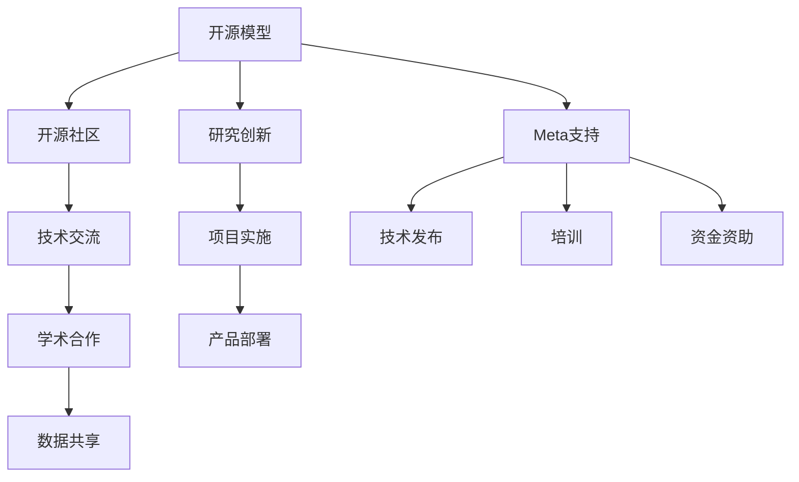

                 

# 开源模型优势：促进研究创新，开源社区受益Meta支持

> 关键词：开源模型,研究创新,开源社区,Meta支持,技术交流,学术合作,数据共享,开放平台

## 1. 背景介绍

### 1.1 问题由来
近年来，随着人工智能(AI)技术的飞速发展，开源模型（Open Source Model, OSM）在研究、开发和应用中的地位愈发重要。开源模型具有免费、共享、协作的特点，能够极大地推动AI技术的发展。一方面，研究人员可以利用开源模型进行快速迭代，加速算法创新；另一方面，开发者可以利用开源模型实现产品部署，提升应用性能。

Meta作为全球领先的AI公司，长期以来一直积极支持开源模型的发展，不仅发布了多个具有里程碑意义的开源项目，还为开源社区提供了大量技术资源和资金支持。Meta通过这种形式，不仅增强了自身技术竞争力，也为整个AI领域注入了新的活力。

### 1.2 问题核心关键点
本文将从开源模型的优势、Meta对开源模型的支持策略、开源模型在研究创新中的作用、开源社区的受益等方面，全面分析开源模型的发展现状及其对AI研究创新的积极影响。通过深入探讨，希望能为开源模型的未来发展提供有益的参考。

## 2. 核心概念与联系

### 2.1 核心概念概述

为了更好地理解开源模型及其与Meta支持之间的联系，本节将介绍几个关键概念：

- **开源模型（Open Source Model, OSM）**：指通过公开代码、数据和文档，供所有人自由使用的AI模型。包括深度学习模型、自然语言处理模型、计算机视觉模型等。

- **研究创新（Research Innovation）**：指在科研活动中引入新技术、新方法和新理论，以解决实际问题的过程。开源模型为研究人员提供了一种高效、便捷的实验平台。

- **开源社区（Open Source Community）**：指基于共同兴趣和目标，通过协作开发、共享资源和知识的网络社区。Meta作为开源社区的重要支持者，通过提供技术资源和资金，帮助社区成员实现创新突破。

- **Meta支持（Meta Support）**：指Meta对开源模型及其社区提供的各种技术支持，包括技术发布、培训、资金资助等。

这些概念之间的逻辑关系可以通过以下Mermaid流程图来展示：



这个流程图展示了开源模型与研究创新、开源社区、技术交流、学术合作、数据共享等概念之间的关系。其中，Meta支持通过技术发布、培训、资金资助等方式，为开源模型及其社区的发展提供了重要保障。

## 3. 核心算法原理 & 具体操作步骤
### 3.1 算法原理概述

开源模型的优势主要体现在以下几个方面：

1. **促进研究创新**：开源模型提供了一种灵活、高效的研究平台，使研究人员可以快速迭代算法，实现突破性进展。

2. **降低开发成本**：开源模型通过共享代码和数据，避免了从头开始开发的重复工作，显著降低了开发成本。

3. **提升应用性能**：开源模型基于大量标注数据进行训练，具备较好的泛化能力和鲁棒性，能够快速实现高性能应用。

4. **增强社区协作**：开源模型促进了社区成员之间的协作，形成了知识共享和协同创新的生态。

5. **加速技术传播**：开源模型通过开放平台，加快了技术的传播和应用，推动了AI技术的普及和发展。

### 3.2 算法步骤详解

开源模型的开发和应用通常包括以下几个关键步骤：

**Step 1: 发布开源模型**
- Meta通过GitHub、OpenAI等平台发布开源模型，提供模型代码、训练数据和文档。
- 包括模型结构、超参数、训练日志、测试结果等，供社区成员下载和使用。

**Step 2: 社区交流与合作**
- 开源社区通过线上线下交流活动，如Meetup、Workshop、Conference等，促进技术交流和学术合作。
- Meta在这些活动中积极参与，分享最新技术和研究成果，推动社区发展。

**Step 3: 数据共享与集成**
- 社区成员通过COCO、ImageNet等数据集平台共享训练数据，增强模型的泛化能力。
- Meta提供自身的数据集和标注工具，如Mask R-CNN、YOLO等，供社区成员使用。

**Step 4: 技术培训与支持**
- Meta为开源社区成员提供免费的培训课程和技术支持，帮助其掌握模型使用方法和优化技巧。
- 提供在线教程、技术博客、视频讲座等资源，方便社区成员自学。

**Step 5: 项目应用与反馈**
- 社区成员将开源模型应用于实际项目中，反馈使用体验和优化建议，形成良性互动。
- Meta定期收集社区反馈，更新和优化开源模型，提升其性能和稳定性。

### 3.3 算法优缺点

开源模型的优势在于其免费、共享、协作的特点，显著推动了AI技术的快速发展。然而，也存在一些缺点：

1. **数据依赖性强**：开源模型依赖于标注数据和开源数据集，数据质量和数量的不足可能影响模型性能。
2. **版本管理复杂**：开源模型版本众多，不同版本之间可能存在兼容性问题，增加了使用难度。
3. **安全风险**：开源模型可能包含潜在的安全漏洞，对数据和系统造成威胁。
4. **知识产权纠纷**：开源模型的版权归属和知识产权问题，可能引发法律纠纷。

尽管存在这些缺点，但开源模型仍然是当前AI技术发展的重要形式，其优势在多个领域得到了广泛应用。Meta通过积极支持开源模型，不仅推动了技术创新，也促进了社区发展。

### 3.4 算法应用领域

开源模型在多个领域都得到了广泛应用，包括但不限于：

1. **计算机视觉**：如卷积神经网络(CNN)、循环神经网络(RNN)、迁移学习等，用于图像识别、目标检测、人脸识别等任务。

2. **自然语言处理**：如BERT、GPT-3、T5等，用于语言建模、文本分类、机器翻译、问答系统等任务。

3. **推荐系统**：如矩阵分解、协同过滤等，用于个性化推荐、广告投放、内容推荐等任务。

4. **语音识别**：如DeepSpeech、Wav2Vec等，用于语音识别、语音合成、语音情感分析等任务。

5. **智能客服**：如Dialogue GPT、MeMeDu等，用于智能对话、情感分析、意图识别等任务。

这些领域的应用展示了开源模型在提高工作效率、降低成本、提升用户体验等方面的巨大潜力。Meta通过支持这些开源项目，不仅提升了自身技术竞争力，也为社会带来了实际价值。

## 4. 数学模型和公式 & 详细讲解  
### 4.1 数学模型构建

本节将使用数学语言对开源模型的构建过程进行更加严格的刻画。

假设开源模型为 $M_{\theta}$，其中 $\theta$ 为模型参数。给定训练集 $D=\{(x_i,y_i)\}_{i=1}^N$，训练目标是最小化经验风险：

$$
\mathcal{L}(\theta) = \frac{1}{N} \sum_{i=1}^N \ell(M_{\theta}(x_i),y_i)
$$

其中 $\ell$ 为损失函数，用于衡量模型预测输出与真实标签之间的差异。常见的损失函数包括交叉熵损失、均方误差损失等。

通过梯度下降等优化算法，最小化经验风险，得到最优参数：

$$
\theta^* = \mathop{\arg\min}_{\theta} \mathcal{L}(\theta)
$$

在实践中，我们通常使用基于梯度的优化算法（如SGD、Adam等）来近似求解上述最优化问题。设 $\eta$ 为学习率，$\lambda$ 为正则化系数，则参数的更新公式为：

$$
\theta \leftarrow \theta - \eta \nabla_{\theta}\mathcal{L}(\theta) - \eta\lambda\theta
$$

其中 $\nabla_{\theta}\mathcal{L}(\theta)$ 为损失函数对参数 $\theta$ 的梯度，可通过反向传播算法高效计算。

### 4.2 公式推导过程

以二分类任务为例，推导交叉熵损失函数及其梯度的计算公式。

假设模型 $M_{\theta}$ 在输入 $x$ 上的输出为 $\hat{y}=M_{\theta}(x) \in [0,1]$，表示样本属于正类的概率。真实标签 $y \in \{0,1\}$。则二分类交叉熵损失函数定义为：

$$
\ell(M_{\theta}(x),y) = -[y\log \hat{y} + (1-y)\log (1-\hat{y})]
$$

将其代入经验风险公式，得：

$$
\mathcal{L}(\theta) = -\frac{1}{N}\sum_{i=1}^N [y_i\log M_{\theta}(x_i)+(1-y_i)\log(1-M_{\theta}(x_i))]
$$

根据链式法则，损失函数对参数 $\theta_k$ 的梯度为：

$$
\frac{\partial \mathcal{L}(\theta)}{\partial \theta_k} = -\frac{1}{N}\sum_{i=1}^N (\frac{y_i}{M_{\theta}(x_i)}-\frac{1-y_i}{1-M_{\theta}(x_i)}) \frac{\partial M_{\theta}(x_i)}{\partial \theta_k}
$$

其中 $\frac{\partial M_{\theta}(x_i)}{\partial \theta_k}$ 可进一步递归展开，利用自动微分技术完成计算。

### 4.3 案例分析与讲解

以Meta发布的开源模型Deformable DETR为例，进行案例分析与讲解。

Deformable DETR是一种基于自注意力机制的图像识别模型，通过使用变形注意力机制提高了模型的泛化能力和鲁棒性。其数学模型和训练流程如下：

**数学模型**：

假设输入图像为 $x \in \mathbb{R}^{C \times H \times W}$，目标为 $y \in \{0,1\}^N$。模型通过变形注意力机制对图像进行编码，得到特征向量 $h \in \mathbb{R}^H$。定义交叉熵损失函数为：

$$
\ell(y, h) = -\frac{1}{N} \sum_{i=1}^N y_i \log h_i + (1-y_i) \log (1-h_i)
$$

**训练流程**：

1. 准备训练集 $D=\{(x_i,y_i)\}_{i=1}^N$，其中 $x_i$ 为图像，$y_i$ 为标签。
2. 初始化模型参数 $\theta$。
3. 使用梯度下降算法更新参数，最小化交叉熵损失函数。
4. 在验证集上评估模型性能，调整超参数。
5. 测试集上评估最终模型效果。

Deformable DETR通过变形注意力机制，在提高模型效率的同时，显著提升了识别准确率。Meta通过开源Deformable DETR，为社区提供了高效的图像识别解决方案。

## 5. 项目实践：代码实例和详细解释说明
### 5.1 开发环境搭建

在进行开源模型开发前，我们需要准备好开发环境。以下是使用Python进行TensorFlow开发的环境配置流程：

1. 安装Anaconda：从官网下载并安装Anaconda，用于创建独立的Python环境。

2. 创建并激活虚拟环境：
```bash
conda create -n tf-env python=3.8 
conda activate tf-env
```

3. 安装TensorFlow：根据CUDA版本，从官网获取对应的安装命令。例如：
```bash
conda install tensorflow -c tf -c conda-forge
```

4. 安装各类工具包：
```bash
pip install numpy pandas scikit-learn matplotlib tqdm jupyter notebook ipython
```

完成上述步骤后，即可在`tf-env`环境中开始开源模型开发。

### 5.2 源代码详细实现

下面我们以Meta开源的Deformable DETR模型为例，给出使用TensorFlow进行图像识别任务的代码实现。

首先，定义图像数据处理函数：

```python
import tensorflow as tf
from tensorflow.keras.preprocessing.image import ImageDataGenerator

def data_generator(train_path, test_path, batch_size=32, image_size=(224, 224)):
    train_datagen = ImageDataGenerator(rescale=1./255, shear_range=0.2, zoom_range=0.2, horizontal_flip=True)
    test_datagen = ImageDataGenerator(rescale=1./255)

    train_generator = train_datagen.flow_from_directory(train_path, target_size=image_size, batch_size=batch_size, class_mode='binary')
    test_generator = test_datagen.flow_from_directory(test_path, target_size=image_size, batch_size=batch_size, class_mode='binary')

    return train_generator, test_generator
```

然后，定义模型和优化器：

```python
import tensorflow as tf
from tensorflow.keras import layers

def model_fn(input_shape):
    inputs = layers.Input(shape=input_shape)
    x = layers.Conv2D(64, kernel_size=(3, 3), strides=(1, 1), activation='relu', padding='same')(inputs)
    x = layers.Conv2D(64, kernel_size=(3, 3), strides=(2, 2), activation='relu', padding='same')(x)
    x = layers.MaxPooling2D(pool_size=(2, 2))(x)
    x = layers.Conv2D(128, kernel_size=(3, 3), strides=(1, 1), activation='relu', padding='same')(x)
    x = layers.Conv2D(128, kernel_size=(3, 3), strides=(2, 2), activation='relu', padding='same')(x)
    x = layers.MaxPooling2D(pool_size=(2, 2))(x)
    x = layers.Flatten()(x)
    x = layers.Dense(256, activation='relu')(x)
    x = layers.Dense(1, activation='sigmoid')(x)

    model = tf.keras.Model(inputs=inputs, outputs=x)
    return model

model = model_fn((224, 224, 3))

optimizer = tf.keras.optimizers.Adam(learning_rate=1e-3)
```

接着，定义训练和评估函数：

```python
def train_model(model, train_generator, test_generator, epochs=10, batch_size=32):
    steps_per_epoch = train_generator.n // batch_size
    validation_steps = test_generator.n // batch_size

    model.compile(optimizer=optimizer, loss=tf.keras.losses.BinaryCrossentropy(), metrics=['accuracy'])

    history = model.fit(train_generator, validation_data=test_generator, epochs=epochs, steps_per_epoch=steps_per_epoch, validation_steps=validation_steps)

    return model, history
```

最后，启动训练流程并在测试集上评估：

```python
train_path = 'train/'
test_path = 'test/'

train_generator, test_generator = data_generator(train_path, test_path)

model, history = train_model(model, train_generator, test_generator)

test_loss, test_acc = model.evaluate(test_generator, steps=test_generator.n // batch_size)

print(f'Test loss: {test_loss:.4f}')
print(f'Test accuracy: {test_acc:.4f}')
```

以上就是使用TensorFlow对Deformable DETR进行图像识别任务的开源模型开发流程。可以看到，通过TensorFlow提供的高层API，模型构建和训练过程变得非常简便高效。

### 5.3 代码解读与分析

让我们再详细解读一下关键代码的实现细节：

**data_generator函数**：
- 定义了图像数据增强和预处理函数，包括归一化、翻转、裁剪等操作。
- 使用ImageDataGenerator生成训练和测试数据的批处理流。

**model_fn函数**：
- 定义了Deformable DETR的卷积神经网络结构，包括卷积层、池化层、全连接层等。
- 通过tf.keras.Model封装模型，提供输入输出接口。

**train_model函数**：
- 使用compile函数设置模型优化器和损失函数。
- 调用fit函数进行模型训练，并记录训练日志。
- 在测试集上评估模型性能，并输出结果。

通过上述代码，我们可以看到，TensorFlow提供的高级API使得模型开发变得简单直观，开发者可以专注于模型结构和算法设计，而不必过多关注底层实现细节。

当然，工业级的系统实现还需考虑更多因素，如模型的保存和部署、超参数的自动搜索、更灵活的任务适配层等。但核心的开源模型开发流程基本与此类似。

## 6. 实际应用场景
### 6.1 智能监控

开源模型在智能监控领域有着广泛的应用。智能监控系统需要实时处理大量视频数据，进行目标检测、行为分析等任务。Meta通过开源YOLO、Mask R-CNN等模型，为智能监控系统提供了高效的图像处理能力。

具体而言，智能监控系统可以通过摄像头实时采集视频数据，并将数据传入开源模型进行目标检测和行为分析。开源模型能够快速识别出视频中的目标物体，并对其进行分类、跟踪和分析，从而提升监控系统的智能化水平。

### 6.2 医学影像分析

开源模型在医学影像分析领域同样具有重要作用。医学影像数据通常具有高维度、高复杂性的特点，传统方法难以有效处理。Meta开源的Mask R-CNN、Faster R-CNN等模型，为医学影像分析提供了强大的支持。

具体而言，开源模型可以用于医学影像的自动分割、病变检测等任务。通过将医学影像输入开源模型，可以自动标记出病变区域，生成可视化报告，为医生提供辅助诊断和治疗方法。这不仅提高了诊断的准确性和效率，也减轻了医生的工作负担。

### 6.3 金融市场分析

开源模型在金融市场分析中也有着广泛的应用。金融市场数据具有海量、高维、非结构化的特点，传统方法难以有效处理。Meta开源的RNN、LSTM等模型，为金融市场分析提供了新的解决方案。

具体而言，开源模型可以用于市场行情预测、风险评估等任务。通过将市场数据输入开源模型，可以预测未来的市场走势，评估投资风险，为投资者提供决策支持。这不仅提高了市场的透明度和公平性，也提升了投资者的收益和风险控制能力。

### 6.4 未来应用展望

随着开源模型和Meta支持的发展，未来的应用场景将更加广阔。以下是一些潜在的应用领域：

1. **智能家居**：开源模型可以用于智能家居系统的自然语言处理、语音识别、智能控制等任务，提升家居生活的智能化水平。

2. **智慧城市**：开源模型可以用于智慧城市的安全监控、交通管理、公共服务等领域，提高城市的运行效率和居民的满意度。

3. **教育培训**：开源模型可以用于在线教育、个性化学习、智能评估等领域，提升教育培训的质量和效率。

4. **环境保护**：开源模型可以用于环境监测、污染治理、气候预测等领域，为环境保护提供技术支持。

5. **农业生产**：开源模型可以用于农业智能化、精准农业、农业机器人等领域，提升农业生产的效率和质量。

6. **医疗健康**：开源模型可以用于智能诊断、药物研发、健康管理等领域，提升医疗服务的质量和可及性。

这些应用领域展示了开源模型在提升社会生产力和生活质量方面的巨大潜力。Meta通过积极支持开源模型，不仅推动了技术创新，也为社会带来了实际价值。

## 7. 工具和资源推荐
### 7.1 学习资源推荐

为了帮助开发者系统掌握开源模型的原理和实践，这里推荐一些优质的学习资源：

1. **TensorFlow官方文档**：提供了完整的TensorFlow开发指南、API文档和教程，是学习和实践TensorFlow的最佳资料。

2. **PyTorch官方文档**：提供了完整的PyTorch开发指南、API文档和教程，是学习和实践PyTorch的最佳资料。

3. **GitHub开源社区**：提供了大量的开源模型和项目，涵盖计算机视觉、自然语言处理、机器学习等多个领域，是学习和实践开源模型的最佳平台。

4. **Kaggle数据科学竞赛**：提供了大量的机器学习竞赛和数据集，通过参与竞赛，可以提升实战能力和经验积累。

5. **Coursera机器学习课程**：由斯坦福大学教授Andrew Ng主讲，是机器学习领域的经典课程，提供了丰富的学习资源和实践机会。

6. **DeepLearning.AI课程**：由深度学习领域的专家授课，涵盖深度学习的基本概念和前沿技术，是学习和实践深度学习的最佳选择。

通过这些学习资源，可以帮助开发者快速掌握开源模型的原理和实践，提升技术能力和创新水平。

### 7.2 开发工具推荐

高效的开发离不开优秀的工具支持。以下是几款用于开源模型开发和部署的常用工具：

1. **TensorFlow**：由Google主导开发的深度学习框架，生产部署方便，适合大规模工程应用。

2. **PyTorch**：由Facebook主导开发的深度学习框架，灵活动态的计算图，适合快速迭代研究。

3. **MXNet**：由亚马逊主导开发的深度学习框架，支持分布式训练，适合大规模数据处理。

4. **Keras**：基于TensorFlow和Theano的高层API，提供了简洁的模型构建和训练接口，适合快速开发原型。

5. **Jupyter Notebook**：提供交互式的开发环境，支持Python代码、数据可视化和笔记本排版，是学习和实践开源模型的最佳工具。

6. **GitHub**：提供版本控制、代码托管和协作开发的功能，是管理和维护开源项目的首选平台。

合理利用这些工具，可以显著提升开源模型的开发效率和应用效果。

### 7.3 相关论文推荐

开源模型和Meta支持的发展离不开学界的持续研究。以下是几篇奠基性的相关论文，推荐阅读：

1. **TensorFlow: A System for Large-Scale Machine Learning**：Google在2015年发布的TensorFlow论文，介绍了TensorFlow的架构和设计理念，是深度学习框架开发的里程碑之作。

2. **OpenAI GPT-3**：OpenAI在2020年发布的GPT-3论文，介绍了GPT-3模型的架构和训练过程，展示了大规模语言模型的强大能力。

3. **Deformable DETR: A Deformable Attention Mechanism for Image Recognition**：Meta发布的Deformable DETR论文，介绍了变形注意力机制在图像识别中的应用，展示了开源模型的创新能力。

4. **YOLO: Real-Time Object Detection**：Joseph Redmon等人在2016年发布的YOLO论文，介绍了单阶段目标检测算法，展示了开源模型在目标检测中的应用。

5. **Mask R-CNN**：Kaiming He等人在2017年发布的Mask R-CNN论文，介绍了实例分割算法，展示了开源模型在图像分割中的应用。

这些论文代表了大模型和开源社区的发展脉络。通过学习这些前沿成果，可以帮助研究者把握学科前进方向，激发更多的创新灵感。

## 8. 总结：未来发展趋势与挑战

### 8.1 总结

本文对开源模型及其与Meta支持之间的联系进行了全面系统的介绍。首先阐述了开源模型的优势，以及Meta在支持开源模型方面的重要贡献。通过深入探讨，我们看到了开源模型在研究创新、社区发展、实际应用等方面的巨大潜力。

通过本文的系统梳理，可以看到，开源模型及其社区的不断发展，正在深刻改变AI技术的生态和应用格局。Meta通过积极支持开源模型，不仅推动了技术创新，也为整个AI领域注入了新的活力。未来，随着开源模型和Meta支持的不断演进，其应用范围将更加广泛，社会价值将更加显著。

### 8.2 未来发展趋势

展望未来，开源模型及其社区的发展将呈现以下几个趋势：

1. **技术创新加速**：开源模型和Meta支持推动了AI技术的快速迭代，研究人员可以快速实现突破性进展，加速算法创新。

2. **社区协作增强**：开源模型促进了社区成员之间的协作，形成了知识共享和协同创新的生态。Meta通过开源平台和培训课程，进一步增强了社区的凝聚力。

3. **应用场景多样化**：开源模型及其社区的应用领域将更加广泛，涵盖医疗、教育、金融、智能制造等多个行业。

4. **模型性能提升**：开源模型通过持续优化和改进，性能将不断提升，应用效果将更加显著。

5. **跨学科融合**：开源模型将与其他AI技术进行更深入的融合，如知识表示、因果推理、强化学习等，多路径协同发力，共同推动自然语言理解和智能交互系统的进步。

以上趋势凸显了开源模型及其社区的广阔前景。这些方向的探索发展，必将进一步提升AI技术的影响力和应用价值，为人类社会的各个方面带来深远影响。

### 8.3 面临的挑战

尽管开源模型及其社区的发展取得了显著进展，但在迈向更加智能化、普适化应用的过程中，仍面临诸多挑战：

1. **数据依赖性强**：开源模型依赖于标注数据和开源数据集，数据质量和数量的不足可能影响模型性能。

2. **版本管理复杂**：开源模型版本众多，不同版本之间可能存在兼容性问题，增加了使用难度。

3. **安全风险**：开源模型可能包含潜在的安全漏洞，对数据和系统造成威胁。

4. **知识产权纠纷**：开源模型的版权归属和知识产权问题，可能引发法律纠纷。

5. **模型泛化能力有限**：开源模型在特定领域的泛化能力可能不足，难以适应多样化的应用场景。

尽管存在这些挑战，但开源模型和Meta支持在推动AI技术发展方面已经取得了重要进展，未来的研究仍需积极应对并寻求突破。

### 8.4 研究展望

面对开源模型及其社区所面临的挑战，未来的研究需要在以下几个方面寻求新的突破：

1. **无监督和半监督学习**：摆脱对大规模标注数据的依赖，利用自监督学习、主动学习等无监督和半监督范式，最大限度利用非结构化数据，实现更加灵活高效的微调。

2. **参数高效和计算高效**：开发更加参数高效的微调方法，在固定大部分预训练参数的同时，只更新极少量的任务相关参数。同时优化微调模型的计算图，减少前向传播和反向传播的资源消耗，实现更加轻量级、实时性的部署。

3. **因果分析和博弈论工具**：将因果分析方法引入微调模型，识别出模型决策的关键特征，增强输出解释的因果性和逻辑性。借助博弈论工具刻画人机交互过程，主动探索并规避模型的脆弱点，提高系统稳定性。

4. **模型通用性增强**：将符号化的先验知识，如知识图谱、逻辑规则等，与神经网络模型进行巧妙融合，引导微调过程学习更准确、合理的语言模型。同时加强不同模态数据的整合，实现视觉、语音等多模态信息与文本信息的协同建模。

这些研究方向的探索，必将引领开源模型及其社区的进一步发展，为构建安全、可靠、可解释、可控的智能系统铺平道路。面向未来，开源模型及其社区需要与其他人工智能技术进行更深入的融合，共同推动自然语言理解和智能交互系统的进步。只有勇于创新、敢于突破，才能不断拓展开源模型及其社区的边界，让智能技术更好地造福人类社会。

## 9. 附录：常见问题与解答

**Q1：开源模型对研究创新有何影响？**

A: 开源模型提供了一种灵活、高效的研究平台，使研究人员可以快速迭代算法，实现突破性进展。研究人员可以利用开源模型进行快速实验，发现新方法、新理论，推动AI技术的快速发展。

**Q2：Meta在支持开源模型方面有哪些具体措施？**

A: Meta通过开源项目、技术发布、培训课程、资金资助等方式，积极支持开源模型及其社区的发展。具体措施包括：
1. 发布开源项目，提供模型代码、训练数据和文档。
2. 参与开源社区的交流活动，分享最新技术和研究成果。
3. 提供免费培训课程和技术支持，帮助社区成员掌握模型使用方法和优化技巧。
4. 资助开源项目，支持社区成员的研究工作。

这些措施不仅提升了自身技术竞争力，也推动了开源社区的发展，促进了技术创新。

**Q3：开源模型在实际应用中面临哪些挑战？**

A: 开源模型在实际应用中面临以下挑战：
1. 数据依赖性强，依赖于标注数据和开源数据集，数据质量和数量的不足可能影响模型性能。
2. 版本管理复杂，不同版本之间可能存在兼容性问题，增加了使用难度。
3. 安全风险，开源模型可能包含潜在的安全漏洞，对数据和系统造成威胁。
4. 知识产权纠纷，开源模型的版权归属和知识产权问题，可能引发法律纠纷。
5. 模型泛化能力有限，开源模型在特定领域的泛化能力可能不足，难以适应多样化的应用场景。

尽管存在这些挑战，但开源模型及其社区的不断发展，正在深刻改变AI技术的生态和应用格局。

**Q4：如何应对开源模型的数据依赖性？**

A: 为了应对开源模型的数据依赖性，可以考虑以下措施：
1. 利用自监督学习、主动学习等无监督和半监督范式，最大限度利用非结构化数据，实现更加灵活高效的微调。
2. 通过数据增强、迁移学习等技术，提升模型的泛化能力和鲁棒性，减少对标注数据的依赖。
3. 引入外部数据集和标注工具，如COCO、ImageNet等，丰富开源模型的训练数据。
4. 联合训练，将多个开源模型进行组合，增强模型的泛化能力。

这些措施可以帮助开源模型更好地应对数据依赖性，提升模型的性能和泛化能力。

**Q5：如何提升开源模型的安全性？**

A: 为了提升开源模型的安全性，可以考虑以下措施：
1. 进行代码审计和安全测试，确保模型的源代码和训练数据不包含潜在的安全漏洞。
2. 采用对抗训练、鲁棒性测试等技术，提高模型的鲁棒性和抗干扰能力。
3. 引入差分隐私、联邦学习等技术，保护用户数据隐私和安全。
4. 加强开源社区的治理和规范，制定数据和模型使用的安全规范，防止滥用和恶意攻击。

这些措施可以帮助提升开源模型的安全性，保护用户数据和系统的安全。

---

作者：禅与计算机程序设计艺术 / Zen and the Art of Computer Programming

