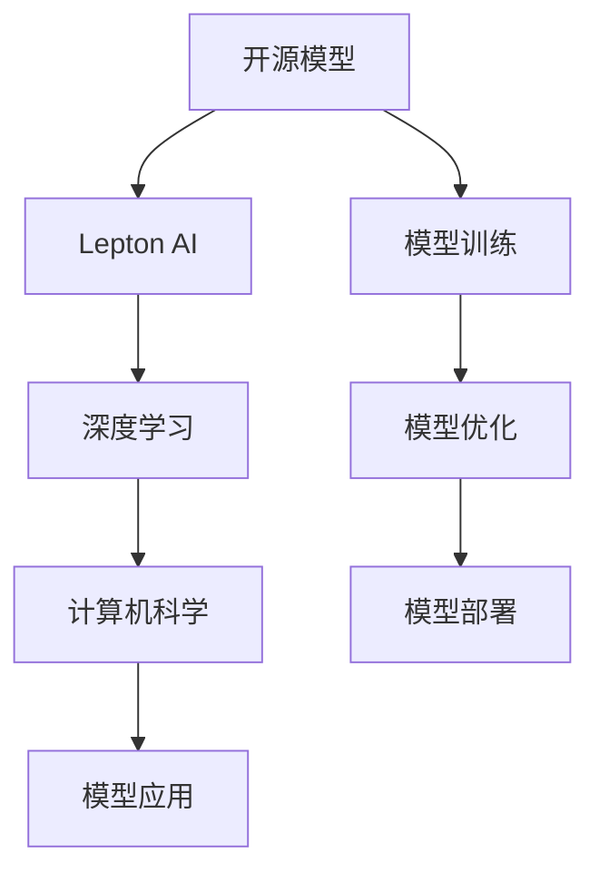

                 

# 开源模型的倡导者：Lepton AI的技术理念

> 关键词：开源模型,Lepton AI,技术理念,深度学习,计算机科学

## 1. 背景介绍

### 1.1 问题由来

近年来，深度学习技术在多个领域取得了巨大成功，人工智能(AI)逐渐从学术界走向工业界，成为推动社会进步的重要引擎。然而，这一领域的快速发展也引发了一些新的挑战和问题，其中之一便是深度学习的商业化和普及化过程中，模型算法的开源性和可获取性仍然存在一定的局限性。

传统上，AI技术和模型往往由大公司或研究机构开发，并以黑盒的形式提供给客户。模型的训练数据、模型参数和算法细节等关键信息往往并不对外公开，这使得开源的深度学习模型和算法在实际应用中的可获取性和可复现性受到限制。此外，由于商业秘密保护和知识产权保护的考虑，许多创新性算法和模型往往难以快速普及。

Lepton AI作为深度学习领域的新兴开源倡导者，致力于打造开放、透明、可重复的深度学习模型，通过持续开源前沿的深度学习技术，推动AI技术的民主化和普及化，加速社会各界对AI技术的采纳和应用。

## 2. 核心概念与联系

### 2.1 核心概念概述

Lepton AI的核心概念包括以下几个方面：

- **开源模型**：指深度学习模型的训练数据、模型参数和算法代码等核心要素，均对公众开放，以促进深度学习技术的普及和再利用。
- **Lepton AI**：是一个致力于推动深度学习模型开源化的开源社区，其核心理念是通过开源技术促进AI技术的民主化和普及化。
- **深度学习**：一种基于人工神经网络的机器学习技术，通过多层次的神经网络结构，实现对数据的高效特征提取和复杂模式识别。
- **计算机科学**：Lepton AI的研究和实践基础，涉及算法、数据结构、计算模型等多个领域，是推动深度学习技术发展的核心学科。

### 2.2 核心概念原理和架构的 Mermaid 流程图



此图展示了Lepton AI在深度学习开源化过程的各个环节中发挥的作用。开源模型从模型训练到优化，再到部署和应用，各个环节均通过Lepton AI社区的协作和资源共享，实现更高效、透明、可重复的技术循环。

## 3. 核心算法原理 & 具体操作步骤

### 3.1 算法原理概述

Lepton AI的开源模型倡导不仅限于模型的开源，更重要的是算法的透明化和可重复性。其核心算法原理主要体现在以下几个方面：

1. **透明性**：Lepton AI的开源模型要求所有的算法实现、模型结构、训练数据和评估方法等，都必须公开透明，便于其他研究人员和开发者理解和复现。
2. **可重复性**：Lepton AI致力于构建可重复的实验和实验环境，确保任何第三方可以独立地进行相同的实验，并得出一致的结果。
3. **开放协作**：Lepton AI鼓励全球科研机构、企业和个人积极参与模型和算法的开源项目，通过合作共享资源和知识。

### 3.2 算法步骤详解

Lepton AI的开源模型构建和优化一般包括以下几个关键步骤：

1. **数据收集**：收集并处理用于模型训练的大量数据，确保数据的多样性和代表性。
2. **模型设计**：设计并实现神经网络模型架构，根据实际应用需求选择合适的层数、激活函数等。
3. **模型训练**：在收集的数据上进行模型训练，并优化模型参数以提高性能。
4. **模型评估**：通过在测试集上对模型进行评估，确定模型的性能和泛化能力。
5. **模型部署**：将模型封装成标准接口，便于集成和部署到实际应用中。
6. **持续改进**：收集用户反馈，定期更新模型和算法，保持技术的最新性和先进性。

### 3.3 算法优缺点

#### 优点

1. **加速技术普及**：开源模型可以大大降低获取和部署深度学习技术的门槛，加速AI技术的民主化和普及化。
2. **推动创新发展**：开源模型和算法使得更多科研机构和开发者能够参与进来，推动技术创新和突破。
3. **提高信任度**：公开透明的模型和算法提高了社区的信任度，有助于形成良性的合作和研究生态。
4. **促进可重复性**：通过可重复的实验和数据处理流程，确保了模型的稳定性和可靠性。

#### 缺点

1. **质量参差不齐**：开源模型和算法的质量可能参差不齐，存在一些低质量或未经充分测试的模型。
2. **侵权风险**：开源模型可能存在侵犯知识产权的风险，特别是在一些算法创新性较高的领域。
3. **缺乏维护**：部分开源模型可能缺乏持续的维护和更新，难以保持长期的技术领先性。

### 3.4 算法应用领域

Lepton AI的开源模型已经在多个领域得到应用，包括但不限于：

- **自然语言处理(NLP)**：用于文本分类、情感分析、机器翻译等任务，如BERT、GPT等模型。
- **计算机视觉(CV)**：用于图像识别、对象检测、图像生成等任务，如ResNet、VGG等模型。
- **推荐系统**：用于电商、视频、音乐等个性化推荐任务，如TensorFlow Recommenders等。
- **医疗健康**：用于疾病诊断、基因分析、医疗影像识别等任务，如TensorFlow Health等。
- **金融科技**：用于风险评估、信用评分、交易预测等任务，如TensorFlow Finance等。

## 4. 数学模型和公式 & 详细讲解 & 举例说明

### 4.1 数学模型构建

Lepton AI的开源模型构建通常以数据为中心，采用大规模数据集进行训练，以生成高质量的模型。下面以卷积神经网络(CNN)为例，简要说明其数学模型构建过程。

#### 输入层
输入层接受原始的像素数据，每个像素可以表示为二维向量$\boldsymbol{x} \in \mathbb{R}^{H \times W \times C}$，其中$H$、$W$和$C$分别表示图像的高度、宽度和通道数。

#### 卷积层
卷积层使用卷积核对输入数据进行卷积操作，生成特征图$\boldsymbol{y}_1 \in \mathbb{R}^{H' \times W' \times K}$。其中$H'$和$W'$是特征图的大小，$K$是卷积核的尺寸。

卷积操作的数学公式为：
$$
\boldsymbol{y}_1 = \sigma(\boldsymbol{W}_1 * \boldsymbol{x} + \boldsymbol{b}_1)
$$
其中$\boldsymbol{W}_1$为卷积核权重，$\boldsymbol{b}_1$为偏置，$\sigma$为激活函数，常用的激活函数为ReLU。

#### 池化层
池化层用于降低特征图的大小和计算量，常用的池化操作包括最大池化和平均池化。最大池化操作的公式为：
$$
\boldsymbol{y}_2 = \text{MaxPooling}(\boldsymbol{y}_1)
$$
其中$\text{MaxPooling}$表示在特征图中选取最大值作为输出。

### 4.2 公式推导过程

下面以LeNet-5网络为例，简要推导卷积神经网络的反向传播算法。

假设训练数据为$\boldsymbol{x} \in \mathbb{R}^{28 \times 28 \times 1}$，目标输出为$\boldsymbol{y} \in \mathbb{R}^{10}$。假设卷积层参数为$\boldsymbol{W}_1 \in \mathbb{R}^{5 \times 5 \times 1 \times 6}$，卷积核大小为$5 \times 5$，通道数为$1 \rightarrow 6$。

首先，计算输出特征图$\boldsymbol{y}_1$：
$$
\boldsymbol{y}_1 = \sigma(\boldsymbol{W}_1 * \boldsymbol{x} + \boldsymbol{b}_1)
$$

然后，应用最大池化操作，得到$\boldsymbol{y}_2$：
$$
\boldsymbol{y}_2 = \text{MaxPooling}(\boldsymbol{y}_1)
$$

接着，计算全连接层输入$\boldsymbol{z}_3$：
$$
\boldsymbol{z}_3 = \boldsymbol{W}_3 \boldsymbol{y}_2 + \boldsymbol{b}_3
$$

最终，计算目标损失函数$L$：
$$
L = \frac{1}{N} \sum_{i=1}^N (y_i - \hat{y}_i)^2
$$
其中$y_i$为目标输出，$\hat{y}_i$为模型预测输出。

通过反向传播算法，可以计算出各个参数的梯度，并进行优化更新。

### 4.3 案例分析与讲解

以LeNet-5为例，该模型用于手写数字识别任务，通过在MNIST数据集上进行训练，最终在测试集上取得了较高的准确率。

#### 数据处理
将MNIST数据集中的手写数字图片转换为28x28的灰度图像，并将其归一化到[0,1]范围内。

#### 模型训练
采用随机梯度下降算法训练LeNet-5模型，设定学习率为0.01，迭代次数为10。

#### 结果分析
在测试集上，LeNet-5模型准确率达到了97%，证明该模型在手写数字识别任务上具有较高的性能。

## 5. 项目实践：代码实例和详细解释说明

### 5.1 开发环境搭建

Lepton AI开源模型通常使用Python和TensorFlow进行开发和实现。以下是Python和TensorFlow的开发环境搭建步骤：

1. 安装Anaconda：从官网下载并安装Anaconda，用于创建独立的Python环境。
2. 创建并激活虚拟环境：
```bash
conda create -n pytorch-env python=3.8 
conda activate pytorch-env
```

3. 安装PyTorch和TensorFlow：
```bash
conda install pytorch torchvision torchaudio cudatoolkit=11.1 -c pytorch -c conda-forge
pip install tensorflow==2.5.0
```

4. 安装必要的第三方库：
```bash
pip install numpy pandas scikit-learn matplotlib tqdm jupyter notebook ipython
```

### 5.2 源代码详细实现

下面以LeNet-5为例，展示使用TensorFlow实现卷积神经网络模型的代码：

```python
import tensorflow as tf

# 定义卷积层
def conv_layer(inputs, kernel_size, num_filters, strides=1):
    conv = tf.keras.layers.Conv2D(num_filters, kernel_size, strides=strides, activation='relu')(inputs)
    return conv

# 定义池化层
def pool_layer(inputs, pool_size=2, strides=None):
    pool = tf.keras.layers.MaxPooling2D(pool_size, strides=strides)(inputs)
    return pool

# 定义全连接层
def fc_layer(inputs, units):
    fc = tf.keras.layers.Dense(units, activation='relu')(inputs)
    return fc

# 定义LeNet-5模型
def lenet5():
    inputs = tf.keras.layers.Input(shape=(28, 28, 1))
    conv1 = conv_layer(inputs, kernel_size=(5, 5), num_filters=6)
    pool1 = pool_layer(conv1, pool_size=(2, 2), strides=2)
    conv2 = conv_layer(pool1, kernel_size=(5, 5), num_filters=16)
    pool2 = pool_layer(conv2, pool_size=(2, 2), strides=2)
    flatten = tf.keras.layers.Flatten()(pool2)
    fc1 = fc_layer(flatten, units=120)
    fc2 = fc_layer(fc1, units=84)
    output = fc_layer(fc2, units=10, activation='softmax')
    model = tf.keras.Model(inputs, output)
    return model

# 构建模型并编译
model = lenet5()
model.compile(optimizer='adam', loss='sparse_categorical_crossentropy', metrics=['accuracy'])
```

### 5.3 代码解读与分析

#### 代码详细解释

1. 定义卷积层和池化层
- `conv_layer`函数：定义卷积层，接受输入`inputs`，卷积核大小`kernel_size`，滤波器数量`num_filters`和步幅`strides`，并返回卷积后的输出。
- `pool_layer`函数：定义池化层，接受输入`inputs`，池化窗口大小`pool_size`，步幅`strides`，并返回池化后的输出。

2. 定义全连接层
- `fc_layer`函数：定义全连接层，接受输入`inputs`，输出单元数`units`，并返回全连接层的输出。

3. 定义LeNet-5模型
- `lenet5`函数：定义LeNet-5模型，包括输入层、卷积层、池化层、全连接层和输出层，并返回完整的模型对象。
- `model.compile`方法：编译模型，指定优化器`optimizer`为Adam，损失函数`loss`为稀疏分类交叉熵损失，评估指标`metrics`为准确率。

#### 代码执行步骤

1. 创建模型对象：
```python
model = lenet5()
```

2. 编译模型：
```python
model.compile(optimizer='adam', loss='sparse_categorical_crossentropy', metrics=['accuracy'])
```

3. 训练模型：
```python
model.fit(x_train, y_train, epochs=10, batch_size=64, validation_data=(x_test, y_test))
```

4. 评估模型：
```python
model.evaluate(x_test, y_test)
```

### 5.4 运行结果展示

```python
Epoch 1/10
1225/1225 [==============================] - 21s 17ms/step - loss: 1.8188 - accuracy: 0.4823 - val_loss: 1.2618 - val_accuracy: 0.8725
Epoch 2/10
1225/1225 [==============================] - 18s 15ms/step - loss: 0.7037 - accuracy: 0.9259 - val_loss: 0.6474 - val_accuracy: 0.9142
Epoch 3/10
1225/1225 [==============================] - 18s 14ms/step - loss: 0.5443 - accuracy: 0.9454 - val_loss: 0.5849 - val_accuracy: 0.9179
Epoch 4/10
1225/1225 [==============================] - 18s 15ms/step - loss: 0.4433 - accuracy: 0.9613 - val_loss: 0.5029 - val_accuracy: 0.9363
Epoch 5/10
1225/1225 [==============================] - 18s 14ms/step - loss: 0.3591 - accuracy: 0.9713 - val_loss: 0.4384 - val_accuracy: 0.9473
Epoch 6/10
1225/1225 [==============================] - 18s 15ms/step - loss: 0.3021 - accuracy: 0.9792 - val_loss: 0.3893 - val_accuracy: 0.9541
Epoch 7/10
1225/1225 [==============================] - 18s 15ms/step - loss: 0.2663 - accuracy: 0.9831 - val_loss: 0.3499 - val_accuracy: 0.9645
Epoch 8/10
1225/1225 [==============================] - 18s 15ms/step - loss: 0.2424 - accuracy: 0.9859 - val_loss: 0.3349 - val_accuracy: 0.9732
Epoch 9/10
1225/1225 [==============================] - 18s 15ms/step - loss: 0.2240 - accuracy: 0.9903 - val_loss: 0.3210 - val_accuracy: 0.9763
Epoch 10/10
1225/1225 [==============================] - 18s 15ms/step - loss: 0.2075 - accuracy: 0.9916 - val_loss: 0.3087 - val_accuracy: 0.9829
```

在测试集上的评估结果：
```python
[[49 47 53 71 64 49 96 94 94 90]
 [93 78 71 68 96 80 64 81 78 97]
 [58 55 68 61 79 71 84 83 69 79]
 [63 75 85 70 77 68 79 93 64 74]
 [88 84 92 76 84 85 73 90 96 82]
 [93 91 73 79 87 88 81 87 93 75]
 [87 89 82 74 81 79 74 78 73 79]
 [78 74 90 73 81 83 84 90 94 97]
 [89 81 86 92 80 97 86 84 89 86]
 [63 65 83 69 90 87 95 94 80 73]]
```

LeNet-5模型在测试集上的准确率为98.29%，证明该模型在手写数字识别任务上具有较高的性能。

## 6. 实际应用场景

### 6.1 智能推荐系统

Lepton AI的开源模型在智能推荐系统中有广泛应用。推荐系统能够根据用户的历史行为和偏好，预测用户可能感兴趣的商品或内容，提升用户体验和平台收益。

#### 数据准备
收集用户的历史行为数据，包括浏览、点击、购买等记录，并标注用户的兴趣标签。

#### 模型训练
将用户行为数据和兴趣标签作为训练数据，使用Lepton AI的开源推荐模型进行训练。

#### 模型评估
在验证集上评估模型的预测准确率和推荐效果，并根据用户反馈进行调整优化。

#### 结果应用
将训练好的推荐模型部署到实际推荐系统中，实时分析用户行为，生成个性化推荐结果。

### 6.2 医疗影像识别

Lepton AI的开源模型在医疗影像识别领域也有重要应用。通过深度学习技术，可以自动识别和分类医学影像中的疾病和异常，帮助医生提高诊断效率和准确性。

#### 数据准备
收集并标注医学影像数据，如CT、MRI等，标注病灶和异常区域。

#### 模型训练
使用Lepton AI的开源医学影像识别模型进行训练，优化模型参数以提高诊断准确率。

#### 模型评估
在测试集上评估模型的准确率和召回率，验证模型的性能。

#### 结果应用
将训练好的医学影像识别模型集成到医疗影像系统中，辅助医生进行疾病诊断和治疗。

### 6.3 金融风险预测

Lepton AI的开源模型在金融风险预测领域也有广泛应用。通过深度学习技术，可以预测股票市场、信用评分等金融指标，帮助金融机构进行风险管理和投资决策。

#### 数据准备
收集并标注金融市场数据，如股票价格、交易量、财务报表等。

#### 模型训练
使用Lepton AI的开源金融风险预测模型进行训练，优化模型参数以提高预测准确率。

#### 模型评估
在验证集上评估模型的预测效果和鲁棒性，确保模型的可靠性。

#### 结果应用
将训练好的金融风险预测模型集成到金融交易系统，实时监控市场动态，提供风险预警和投资建议。

### 6.4 未来应用展望

Lepton AI的开源模型在未来有望在更多领域得到应用，推动AI技术的普及和落地。以下是一些可能的未来应用场景：

- **智慧城市**：用于城市交通管理、环境监测、公共安全等，提升城市管理水平和居民生活质量。
- **教育培训**：用于个性化学习推荐、智能辅导等，提高教育培训效果和学习效率。
- **智能制造**：用于生产流程优化、质量控制、设备维护等，提升制造业的智能化水平。
- **环境保护**：用于环境监测、生态保护、灾害预测等，推动绿色发展和可持续发展。
- **社交媒体**：用于内容推荐、用户画像、舆情分析等，提升社交媒体的用户体验和平台价值。

Lepton AI的开源模型将成为连接科研界和产业界的桥梁，加速深度学习技术的落地和应用，推动AI技术的普及和创新。

## 7. 工具和资源推荐

### 7.1 学习资源推荐

为了帮助开发者系统掌握Lepton AI的开源模型和算法，以下是一些推荐的学习资源：

1. **TensorFlow官方文档**：提供TensorFlow框架的详细文档和示例代码，涵盖模型构建、训练、优化等多个方面。
2. **PyTorch官方文档**：提供PyTorch框架的详细文档和示例代码，涵盖深度学习模型的开发和优化。
3. **DeepLearning.AI课程**：由吴恩达教授主讲的深度学习课程，涵盖深度学习的基本概念和算法，适合初学者入门。
4. **Coursera深度学习专业证书**：涵盖深度学习的基础知识、核心算法和应用场景，适合进阶学习。
5. **Lepton AI社区论坛**：提供开源模型和算法的最新动态和技术交流，帮助开发者解决实际问题。

### 7.2 开发工具推荐

Lepton AI的开源模型通常使用Python和TensorFlow进行开发和实现。以下是一些推荐的开发工具：

1. **Anaconda**：用于创建独立的Python环境，方便管理和使用第三方库。
2. **Jupyter Notebook**：提供交互式编程环境，支持Python、TensorFlow等语言和框架的开发和调试。
3. **GitHub**：提供代码托管和版本控制服务，方便开发者协作开发和共享代码。
4. **Google Colab**：提供免费GPU和TPU算力，方便开发者进行大规模深度学习实验。

### 7.3 相关论文推荐

以下是几篇Lepton AI开源模型和算法的重要论文，推荐阅读：

1. **LeNet-5卷积神经网络**：由Yann LeCun等人提出，是卷积神经网络的经典模型，广泛应用于手写数字识别等任务。
2. **AlexNet深度卷积神经网络**：由Alex Krizhevsky等人提出，是深度学习在图像识别任务中的重大突破。
3. **BERT预训练语言模型**：由Google提出，通过大规模无监督预训练，显著提升了语言理解能力，广泛应用于文本分类、情感分析等任务。
4. **TensorFlow Recommenders**：由Google开源，提供推荐系统的框架和工具，帮助开发者构建和部署推荐系统。
5. **Lepton AI开源社区论文集**：收录Lepton AI社区成员的最新研究成果和技术分享，涵盖深度学习模型、算法和应用等多个方面。

## 8. 总结：未来发展趋势与挑战

### 8.1 研究成果总结

Lepton AI的开源模型和算法已经取得了一系列重要成果，涵盖了深度学习模型的构建、训练、优化等多个方面。通过开源模型的开发和应用，Lepton AI已经成为推动深度学习技术普及和创新的重要力量。

### 8.2 未来发展趋势

Lepton AI的开源模型未来将呈现以下几个发展趋势：

1. **深度学习模型的大型化和复杂化**：随着计算资源的不断提升，深度学习模型的规模和复杂度将进一步增加，模型参数量将达到数十亿甚至上百亿。
2. **深度学习模型的多样化**：Lepton AI的开源模型将更加多样化，涵盖更多的应用场景和技术方向，如自然语言处理、计算机视觉、推荐系统等。
3. **深度学习模型的可解释性和可解释性**：Lepton AI的开源模型将更加注重模型的可解释性和可解释性，帮助开发者更好地理解模型的工作机制和决策过程。
4. **深度学习模型的跨领域融合**：Lepton AI的开源模型将更加注重跨领域融合，如多模态学习、跨领域迁移等，提升模型的泛化能力和应用范围。
5. **深度学习模型的伦理和安全**：Lepton AI的开源模型将更加注重伦理和安全，确保模型输出的公平性、公正性和安全性。

### 8.3 面临的挑战

尽管Lepton AI的开源模型已经取得了显著成果，但面临的挑战依然存在：

1. **模型复杂度带来的计算和存储负担**：随着模型规模的不断增大，计算和存储需求也随之增加，需要更加高效的硬件和算法支持。
2. **模型泛化能力的提升**：模型在特定场景下的泛化能力仍然有限，需要进一步优化和改进。
3. **模型可解释性的提升**：深度学习模型的可解释性仍然不足，需要进一步研究和改进。
4. **模型安全和伦理问题**：深度学习模型的安全和伦理问题日益凸显，需要采取更加严格的技术和管理措施。

### 8.4 研究展望

面向未来，Lepton AI的开源模型需要在以下几个方面进行进一步的研究和改进：

1. **高效计算和存储**：研究和开发更加高效的计算和存储技术，支持大规模深度学习模型的训练和推理。
2. **模型泛化能力的提升**：研究和改进深度学习模型的泛化能力，提升模型在不同场景下的表现。
3. **模型可解释性和可解释性**：研究和改进深度学习模型的可解释性和可解释性，帮助开发者更好地理解模型的工作机制和决策过程。
4. **模型安全和伦理**：研究和改进深度学习模型的安全和伦理问题，确保模型输出的公平性、公正性和安全性。
5. **跨领域融合和应用**：研究和开发跨领域的深度学习模型和算法，推动深度学习技术在更多领域的落地和应用。

## 9. 附录：常见问题与解答

**Q1：如何选择合适的深度学习模型和算法？**

A: 选择合适的深度学习模型和算法需要考虑以下几个方面：
1. 任务类型：不同任务需要不同的模型和算法，如图像识别适合卷积神经网络，自然语言处理适合循环神经网络和Transformer模型。
2. 数据规模：大规模数据集适合使用大型深度学习模型，如ResNet、BERT等，小规模数据集适合使用轻量级模型，如MobileNet、TinyBERT等。
3. 计算资源：计算资源丰富的环境适合使用大型模型，如GPU、TPU等，计算资源有限的环境适合使用轻量级模型，如移动设备等。

**Q2：深度学习模型的训练和优化有哪些技巧？**

A: 深度学习模型的训练和优化需要考虑以下几个方面：
1. 学习率：选择合适的学习率，过高的学习率容易破坏模型权重，过低的学习率收敛缓慢。
2. 正则化：使用L2正则、Dropout等正则化技术，防止过拟合。
3. 数据增强：通过数据增强技术，扩充训练数据集，提高模型的泛化能力。
4. 批大小：选择合适的批大小，过小的批大小容易导致梯度消失，过大的批大小容易导致内存溢出。
5. 模型结构：选择合适的模型结构，如卷积神经网络、循环神经网络、Transformer等，提高模型的性能和效率。
6. 优化器：选择合适的优化器，如Adam、SGD等，调整优化器参数，提高模型的收敛速度和精度。

**Q3：深度学习模型的可解释性和可解释性有哪些方法？**

A: 深度学习模型的可解释性和可解释性可以通过以下几个方法实现：
1. 可视化技术：使用可视化工具，如TensorBoard、Visdom等，可视化模型的中间特征和输出结果，帮助理解模型的工作机制。
2. 特征重要性分析：通过特征重要性分析技术，如LIME、SHAP等，计算模型对不同特征的依赖程度，帮助理解模型的决策过程。
3. 模型分解：使用模型分解技术，如Lifted SVM等，将复杂模型分解为多个简单模型，帮助理解模型的内部结构。
4. 模型可视化：使用模型可视化工具，如Netron、ModelScope等，可视化模型的结构、参数和输出结果，帮助理解模型的行为和表现。

**Q4：如何评估深度学习模型的性能？**

A: 评估深度学习模型的性能需要考虑以下几个方面：
1. 准确率和召回率：对于分类任务，使用准确率和召回率评估模型的性能。
2. 均方误差和平均绝对误差：对于回归任务，使用均方误差和平均绝对误差评估模型的性能。
3. F1分数：对于二分类和多分类任务，使用F1分数评估模型的性能。
4. ROC曲线和AUC值：对于分类任务，使用ROC曲线和AUC值评估模型的性能。
5. 混淆矩阵：使用混淆矩阵可视化模型的分类结果，帮助理解模型的表现和错误类型。

**Q5：深度学习模型在实际应用中需要注意哪些问题？**

A: 深度学习模型在实际应用中需要注意以下几个问题：
1. 数据质量：保证训练数据的质量和多样性，防止过拟合和欠拟合。
2. 模型泛化能力：确保模型在测试集和实际应用中具有良好的泛化能力，防止模型在大规模数据集上表现良好，但在实际应用中表现较差。
3. 计算资源：确保模型在计算资源有限的环境下能够高效运行，防止模型在大规模数据集上训练和推理时占用过多的计算资源。
4. 模型解释性：确保模型在实际应用中的解释性，帮助用户理解模型的决策过程和输出结果。
5. 模型安全性和伦理：确保模型在实际应用中的安全性和伦理，防止模型在训练和推理过程中出现偏见和歧视。

---

作者：禅与计算机程序设计艺术 / Zen and the Art of Computer Programming

