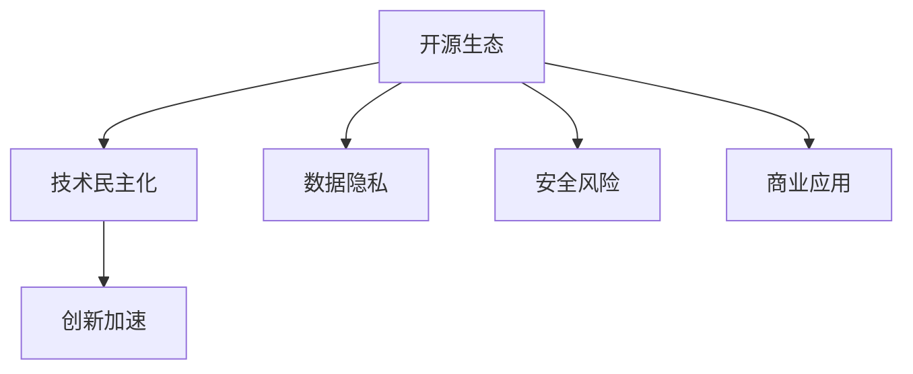

                 

## 1. 背景介绍

### 1.1 问题由来

随着人工智能(AI)技术的不断进步，开源生态已经成为推动AI创新的重要力量。开源社区不仅提供了丰富的代码和工具，还通过协作和共享，促进了技术的快速迭代和普及。这种技术民主化和创新加速的趋势，正在重塑AI领域的竞争格局和发展路径。

近年来，开源AI项目如OpenAI、TensorFlow、PyTorch等迅速崛起，吸引了全球科研机构和企业的广泛关注。这些开源项目通过持续的技术创新和社区合作，推动了AI技术的深度应用，并不断探索新的前沿方向。然而，开源生态也面临着数据隐私、安全风险、商业应用等问题，这些问题亟需得到解决。

### 1.2 问题核心关键点

开源AI生态对AI创新的影响主要体现在以下几个方面：

1. **技术民主化**：开源生态的开放性和协作性，使得更多人能够参与到AI技术的研究和开发中，从而加速技术创新和传播。
2. **创新加速**：开源社区的高效协作和资源共享，促进了技术快速迭代和应用。
3. **问题与挑战**：开源AI项目在数据隐私、安全风险、商业应用等方面的问题，需要得到有效解决。

### 1.3 问题研究意义

研究开源AI生态对AI创新的影响，具有以下重要意义：

1. **推动技术进步**：开源社区的协作与创新，加速了AI技术的开发和应用。
2. **促进产业发展**：开源AI技术成为企业应用的重要基础，推动了AI产业的繁荣。
3. **提升社会福祉**：开源AI技术在医疗、教育、交通等领域的应用，提高了社会的整体福祉。
4. **应对全球挑战**：AI技术的开放合作有助于应对全球气候变化、公共卫生等挑战。

## 2. 核心概念与联系

### 2.1 核心概念概述

为更好地理解开源AI生态对AI创新的影响，本节将介绍几个密切相关的核心概念：

1. **开源生态**：指的是一个由开源社区驱动的、基于协作和共享的技术开发和创新环境。
2. **技术民主化**：指的是技术开发的成果可以自由地共享和传播，使得更多人能够参与到技术创新中。
3. **创新加速**：指的是开源社区的协作和资源共享，促进了技术的快速迭代和应用。
4. **数据隐私**：指的是在开源AI项目中，数据集和模型的隐私保护问题。
5. **安全风险**：指的是开源AI项目中可能存在的数据泄露、模型攻击等安全问题。
6. **商业应用**：指的是开源AI技术在企业中的应用和商业化。

这些核心概念之间的逻辑关系可以通过以下Mermaid流程图来展示：



这个流程图展示了好源AI生态对AI创新的核心概念及其之间的关系：

1. 开源生态通过技术民主化和创新加速，推动AI技术的快速发展。
2. 数据隐私和安全风险是开源AI生态需要面对的重要问题。
3. 开源AI技术在商业应用中的成功，体现了其市场潜力和产业价值。

## 3. 核心算法原理 & 具体操作步骤
### 3.1 算法原理概述

开源AI生态对AI创新的影响，主要通过以下几个方面来实现：

1. **技术共享与协作**：开源社区的代码和工具开放共享，促进了技术的快速迭代和传播。
2. **社区贡献与反馈**：开发者和用户通过代码贡献、问题反馈等方式，推动技术不断改进。
3. **创新激励与认可**：开源社区的贡献者通过开源社区的认可和激励，获得成就感。

这些机制使得开源AI生态能够高效地推动技术创新，同时解决了技术开发中的一些常见问题。

### 3.2 算法步骤详解

基于开源AI生态对AI创新的影响，以下是典型的算法步骤：

**Step 1: 技术共享与协作**

开源社区通过GitHub等平台，提供代码、模型和工具的开放共享，使得更多人能够参与到技术创新中。开发者可以自由地访问、修改和使用开源项目，从而加速技术迭代。

**Step 2: 社区贡献与反馈**

开源社区鼓励开发者提交代码、修复Bug、提出改进建议等，这些贡献通过社区审查和整合，转化为项目的升级和改进。同时，社区成员可以就技术问题进行讨论和交流，及时反馈问题并提出解决方案。

**Step 3: 创新激励与认可**

开源社区通过贡献者认可、开源奖项、技术大会等方式，激励开发者不断贡献代码和改进项目。这些激励措施不仅提高了开发者的积极性，还促进了技术的广泛传播和应用。

### 3.3 算法优缺点

开源AI生态对AI创新的影响，主要具有以下优点和缺点：

**优点**：

1. **技术共享**：开源社区的开放性和协作性，加速了技术开发和传播。
2. **创新加速**：社区的高效协作和资源共享，促进了技术快速迭代。
3. **社区激励**：通过贡献者认可和激励，提高了开发者的积极性。

**缺点**：

1. **数据隐私**：开源项目的数据集和模型可能面临隐私泄露风险。
2. **安全风险**：开源项目中可能存在数据泄露、模型攻击等安全问题。
3. **商业应用**：开源项目在商业应用中可能面临版权和知识产权等问题。

尽管存在这些局限性，但就目前而言，开源AI生态仍然是推动AI技术创新和应用的重要力量。未来相关研究的重点在于如何进一步优化开源社区的治理机制，提升数据隐私和安全水平，以及探索开源技术的商业化路径。

### 3.4 算法应用领域

开源AI生态在多个领域得到了广泛应用，以下是几个典型例子：

1. **科学研究**：开源AI项目如TensorFlow、PyTorch等，被广泛应用于科研机构的深度学习和机器学习研究。
2. **企业应用**：OpenAI、Google等开源AI项目，被众多企业用于构建AI应用，推动了产业数字化转型。
3. **公共服务**：开源AI技术在医疗、教育、交通等领域的应用，提升了公共服务的智能化水平。
4. **社会创新**：开源AI项目通过技术民主化和创新加速，推动了社会创新和可持续发展。

## 4. 数学模型和公式 & 详细讲解 & 举例说明

### 4.1 数学模型构建

为了更好地理解开源AI生态对AI创新的影响，我们引入数学模型来描述技术共享和协作的过程。假设开源社区中有一个项目A，其参与者数量为 $N$，每个参与者贡献的代码量为 $c_i$，则项目A的总代码量为 $C$。设社区对每个贡献者的认可度为 $k_i$，总认可度为 $K$。则社区的平均贡献和认可度分别为：

$$
\bar{c} = \frac{C}{N}, \quad \bar{k} = \frac{K}{N}
$$

其中，认可度 $k_i$ 可以是代码贡献量、代码质量、社区贡献等。

### 4.2 公式推导过程

假设社区中每个贡献者的贡献和认可度之间存在线性关系，即 $c_i = k_i \cdot c_0$，其中 $c_0$ 为平均贡献。则总代码量 $C$ 和总认可度 $K$ 分别为：

$$
C = \sum_{i=1}^N c_i = \sum_{i=1}^N k_i \cdot c_0 = K \cdot c_0
$$

社区的平均贡献和认可度分别为：

$$
\bar{c} = \frac{C}{N} = \frac{K \cdot c_0}{N}, \quad \bar{k} = \frac{K}{N}
$$

可以看出，社区的平均贡献和认可度与总认可度成正比，与参与者数量成反比。这表明，社区的协作和认可机制，能够有效提升项目的整体贡献和质量。

### 4.3 案例分析与讲解

以下是一个简单的案例分析，假设一个开源项目A有100个参与者，每人平均贡献10行代码，总认可度为100。则项目A的总代码量和平均贡献分别为：

$$
C = 100 \cdot 10 = 1000 \text{ 行代码}
$$
$$
\bar{c} = \frac{1000}{100} = 10 \text{ 行代码}
$$

这表明，开源社区的高效协作和资源共享，能够显著提升项目的整体贡献和质量。

## 5. 项目实践：代码实例和详细解释说明

### 5.1 开发环境搭建

在进行开源AI项目的实践前，我们需要准备好开发环境。以下是使用Python进行TensorFlow开发的Python环境配置流程：

1. 安装Anaconda：从官网下载并安装Anaconda，用于创建独立的Python环境。

2. 创建并激活虚拟环境：
```bash
conda create -n tensorflow-env python=3.8 
conda activate tensorflow-env
```

3. 安装TensorFlow：根据CUDA版本，从官网获取对应的安装命令。例如：
```bash
conda install tensorflow tensorflow-gpu -c conda-forge
```

4. 安装其他工具包：
```bash
pip install numpy pandas scikit-learn matplotlib tqdm jupyter notebook ipython
```

完成上述步骤后，即可在`tensorflow-env`环境中开始开源AI项目的实践。

### 5.2 源代码详细实现

以下是使用TensorFlow进行开源AI项目实践的示例代码：

```python
import tensorflow as tf
import numpy as np

# 定义模型
model = tf.keras.Sequential([
    tf.keras.layers.Dense(64, activation='relu', input_shape=(784,)),
    tf.keras.layers.Dense(10, activation='softmax')
])

# 编译模型
model.compile(optimizer=tf.keras.optimizers.Adam(learning_rate=0.001),
              loss=tf.keras.losses.SparseCategoricalCrossentropy(from_logits=True),
              metrics=['accuracy'])

# 加载数据集
mnist = tf.keras.datasets.mnist
(x_train, y_train), (x_test, y_test) = mnist.load_data()
x_train, x_test = x_train / 255.0, x_test / 255.0

# 训练模型
model.fit(x_train, y_train, epochs=10, validation_data=(x_test, y_test))
```

这个代码示例展示了如何使用TensorFlow构建和训练一个简单的图像分类模型。可以看到，TensorFlow的开源社区提供了丰富的工具和库，使得模型构建和训练变得非常简便。

### 5.3 代码解读与分析

让我们再详细解读一下关键代码的实现细节：

**模型定义**：
- 使用`tf.keras.Sequential`定义一个包含两个全连接层的神经网络，第一层有64个神经元，使用ReLU激活函数，输入维度为784；第二层有10个神经元，使用Softmax激活函数，输出维度为10。

**模型编译**：
- 使用`model.compile`方法，设置优化器为Adam，学习率为0.001，损失函数为SparseCategoricalCrossentropy，评价指标为准确率。

**数据加载**：
- 使用`tf.keras.datasets.mnist`加载MNIST数据集，将像素值归一化到0-1之间。

**模型训练**：
- 使用`model.fit`方法，将训练集数据和标签输入模型，进行10轮训练，并在验证集上评估性能。

可以看到，TensorFlow的开源社区提供了丰富的API和工具，使得模型构建和训练变得非常高效和简洁。开发者可以通过这些工具快速迭代和优化模型，推动AI技术的创新。

## 6. 实际应用场景

### 6.1 科学研究

开源AI生态在科学研究中得到了广泛应用，例如TensorFlow、PyTorch等开源项目，被科研机构用于深度学习和机器学习研究。研究人员可以通过这些开源项目，快速构建和训练复杂的模型，并共享研究成果。

### 6.2 企业应用

TensorFlow、PyTorch等开源项目，被众多企业用于构建AI应用，推动了产业数字化转型。例如，Google使用TensorFlow构建了多个AI应用，包括语音识别、图像识别、自然语言处理等，这些应用大幅提升了企业的数据处理能力和决策效率。

### 6.3 公共服务

开源AI技术在医疗、教育、交通等领域的应用，提升了公共服务的智能化水平。例如，OpenAI的GPT模型被用于构建智能客服系统，提升了企业的客户服务水平；TensorFlow被用于开发智能交通系统，提升了城市交通管理效率。

### 6.4 社会创新

开源AI项目通过技术民主化和创新加速，推动了社会创新和可持续发展。例如，OpenAI的GPT模型被用于开发开源AI教育平台，帮助更多人学习和应用AI技术，促进了教育公平和知识普及。

## 7. 工具和资源推荐

### 7.1 学习资源推荐

为了帮助开发者系统掌握开源AI生态的理论基础和实践技巧，这里推荐一些优质的学习资源：

1. TensorFlow官方文档：提供了完整的TensorFlow教程、API文档和案例示例，是学习和使用TensorFlow的必备资源。

2. PyTorch官方文档：提供了丰富的PyTorch教程、API文档和案例示例，是学习和使用PyTorch的必备资源。

3. Kaggle平台：提供了丰富的开源数据集和竞赛项目，帮助开发者实践和应用AI技术。

4. GitHub开源社区：提供了大量的开源AI项目和代码，是学习和应用AI技术的重要平台。

5. Coursera和Udacity等在线教育平台：提供了丰富的AI课程和项目，帮助开发者系统学习和应用AI技术。

通过对这些资源的学习实践，相信你一定能够快速掌握开源AI生态的理论基础和实践技巧，并用于解决实际的AI问题。

### 7.2 开发工具推荐

高效的开发离不开优秀的工具支持。以下是几款用于开源AI项目开发的常用工具：

1. Jupyter Notebook：用于编写和执行Python代码，支持代码高亮和富文本输出，是数据科学家常用的工具。

2. Visual Studio Code：一款轻量级的代码编辑器，支持Python、TensorFlow等工具的集成开发。

3. Git和GitHub：用于版本控制和代码协作，是开源社区的核心工具。

4. Docker和Kubernetes：用于容器化和部署，支持高可用性和自动化管理。

5. JupyterLab：基于Jupyter Notebook的Web界面，支持更丰富的开发环境和协作功能。

合理利用这些工具，可以显著提升开源AI项目的开发效率，加快创新迭代的步伐。

### 7.3 相关论文推荐

开源AI生态的发展源于学界的持续研究。以下是几篇奠基性的相关论文，推荐阅读：

1. TensorFlow: A System for Large-Scale Machine Learning：介绍TensorFlow的设计和实现，是开源AI生态的重要里程碑。

2. PyTorch: A deep learning research platform：介绍PyTorch的设计和实现，是开源AI生态的另一重要组成部分。

3. The Unreasonable Effectiveness of Transfer Learning in Natural Language Processing：研究了迁移学习在NLP中的应用，推动了NLP领域的快速进步。

4. CIFAR-10: A Small Image Dataset for Machine Learning Practice：介绍了CIFAR-10数据集，是机器学习和深度学习研究的重要基准。

5. AI: A New Frontier in Computing：探讨了AI技术的广泛应用和未来发展方向，是AI领域的经典论文。

这些论文代表了好源AI生态的发展脉络。通过学习这些前沿成果，可以帮助研究者把握学科前进方向，激发更多的创新灵感。

## 8. 总结：未来发展趋势与挑战

### 8.1 总结

本文对开源AI生态对AI创新的影响进行了全面系统的介绍。首先阐述了开源AI生态对AI创新的研究背景和意义，明确了开源社区在推动技术创新和应用中的关键作用。其次，从原理到实践，详细讲解了开源AI生态对AI创新的数学模型和操作步骤，给出了开源AI项目的完整代码实例。同时，本文还广泛探讨了开源AI技术在科学研究、企业应用、公共服务和社会创新等各个领域的应用前景，展示了开源AI生态的广泛影响力。此外，本文精选了开源AI生态的各类学习资源，力求为读者提供全方位的技术指引。

通过本文的系统梳理，可以看到，开源AI生态正在成为推动AI技术创新和应用的重要力量，加速了AI技术的开发和普及。开源社区的开放性和协作性，使得更多人能够参与到技术创新中，从而推动了技术的快速迭代和应用。未来，伴随开源社区的不断发展和完善，开源AI技术必将在更多领域得到广泛应用，为AI技术的进一步创新和发展提供强有力的支撑。

### 8.2 未来发展趋势

展望未来，开源AI生态将呈现以下几个发展趋势：

1. **技术民主化**：开源社区的开放性和协作性，将进一步推动技术民主化，使得更多人能够参与到技术创新中。
2. **创新加速**：社区的高效协作和资源共享，将继续促进技术的快速迭代和应用。
3. **多模态融合**：未来的开源AI生态将更多地融合多模态数据，推动多模态AI技术的发展。
4. **自动化和智能化**：开源社区将开发更多的自动化工具和智能化平台，提升开发者的工作效率。
5. **全球协作**：开源社区将进一步拓展全球合作，推动AI技术在全球范围内的普及和应用。

这些趋势凸显了开源AI生态的广阔前景，为AI技术的进一步创新和发展提供了坚实的基础。

### 8.3 面临的挑战

尽管开源AI生态已经取得了显著成就，但在迈向更加智能化、普适化应用的过程中，它仍面临诸多挑战：

1. **数据隐私和安全**：开源项目的数据集和模型可能面临隐私泄露和模型攻击的风险。如何保护数据隐私和安全，将是重要的研究课题。
2. **版权和知识产权**：开源项目在商业应用中可能面临版权和知识产权的问题。如何平衡开源和商业应用的关系，将是一大难题。
3. **生态系统管理**：开源社区需要有效的管理和治理机制，以保障社区的稳定和发展。
4. **技术和标准不统一**：不同开源项目可能采用不同的技术和标准，导致资源共享和协作困难。

这些挑战需要开源社区和开发者共同努力，通过技术创新和社区协作，才能有效应对。

### 8.4 研究展望

未来在开源AI生态的研究方向上，可以从以下几个方面进行探索：

1. **数据隐私保护**：研究新的数据隐私保护技术，保障开源项目的数据安全和隐私。
2. **模型安全性**：开发新的模型安全性技术，防止模型攻击和数据泄露。
3. **生态系统管理**：研究和实施有效的开源社区管理和治理机制，提升社区的协作效率和稳定性。
4. **跨平台和跨技术融合**：研究和实现跨平台和跨技术的资源共享和协作，提升开源社区的资源利用效率。

这些研究方向将推动开源AI生态的持续发展和完善，为AI技术的进一步创新和应用提供强有力的支撑。

## 9. 附录：常见问题与解答

**Q1：开源生态如何推动AI技术的创新？**

A: 开源生态通过技术共享和协作，使得更多人能够参与到技术创新中，从而加速技术的快速迭代和传播。社区的高效协作和资源共享，促进了技术的快速迭代和应用。

**Q2：开源AI项目在商业应用中可能面临哪些问题？**

A: 开源AI项目在商业应用中可能面临版权和知识产权的问题，例如开源项目使用的代码和模型可能存在版权纠纷。同时，开源项目的数据集和模型可能面临隐私泄露和模型攻击的风险。

**Q3：开源社区如何进行有效的管理和治理？**

A: 开源社区可以通过建立明确的项目管理和治理机制，如代码审查、社区规则、贡献者激励等，保障社区的稳定和发展。同时，社区成员可以通过投票和反馈机制，参与社区决策和资源分配。

**Q4：开源社区如何保障数据隐私和安全？**

A: 开源社区可以通过数据匿名化、加密、访问控制等技术手段，保障数据隐私和安全。同时，社区成员可以遵守开源社区的数据隐私和安全标准，共同维护社区的健康发展。

**Q5：开源社区如何进行多模态融合？**

A: 开源社区可以通过研究和实现多模态数据处理和融合技术，如多模态数据标注、多模态特征融合等，推动多模态AI技术的发展。同时，社区成员可以共享多模态数据和模型，提升多模态AI技术的资源利用效率。

这些问题的解答，有助于开发者更好地理解开源AI生态对AI创新的影响，并为其在实际应用中的实践提供指导。

