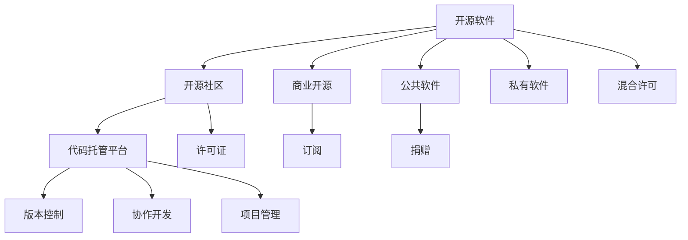

                 

## 1. 背景介绍

在软件生态日益繁荣的今天，开源软件因其自由、共享、协作的特性，逐渐成为了软件开发和创新的重要驱动力。从操作系统到中间件，从工具链到应用框架，开源软件覆盖了信息技术领域的多个层面。它不仅推动了软件行业的进步，也培养了一批技术爱好者和创业公司。

本文将对开源软件的商业模式进行深入研究，并探讨如何基于开源社区的独特优势，构建可持续发展的软件生态。通过结合案例分析与最佳实践，揭示开源软件成功背后的关键因素，为开发者和企业管理者提供可行的启示和指导。

## 2. 核心概念与联系

### 2.1 核心概念概述

为了更好地理解开源软件的商业模式，首先介绍几个关键概念：

- **开源软件(Open Source Software, OSS)**：基于源代码开放的原则，任何人都可以查看、修改和分发软件的可执行代码。典型的开源软件项目如Linux内核、Apache Web Server、Apache Hadoop等。

- **开源社区(Open Source Community)**：围绕开源软件构建的开发者社区，成员通过协作贡献代码、讨论问题、分享知识，共同推动软件项目的发展。

- **商业开源(Commercial Open Source, COS)**：指开源软件项目通过商业模式，如捐赠、订阅、商业支持等，获得收入，并以此维持项目的稳定运行。

- **公共软件(Open Source Public Software, OSS-PS)**：完全免费的开源软件，仅依赖社区和用户的捐赠或志愿服务。

- **私有软件(Proprietary Software)**：版权保护下的商业软件，用户需购买许可或订阅服务以获取授权。

- **混合许可(Hybrid Licensing)**：将开源和私有许可相结合，开放部分源代码，但保留核心模块的商业闭源策略。

- **代码托管平台(Code Hosting Platform)**：如GitHub、GitLab等，提供代码存储、版本控制、协作开发等服务的平台。

- **许可证(License)**：规定开源软件的授权方式和使用的条款，如GPL、Apache、MIT等。

这些概念之间的逻辑关系可以通过以下Mermaid流程图来展示：



这个流程图展示开源软件的关键组件及其之间的关系：

1. 开源软件通过代码托管平台提供版本控制和协作开发功能，建立开源社区。
2. 开源软件可以选择不同的商业模式，如商业开源、公共软件、私有软件和混合许可。
3. 开源社区通过许可证定义开源软件的授权方式。
4. 商业开源可以通过订阅、捐赠等方式获得收入。
5. 公共软件完全依赖社区和用户的支持。

## 3. 核心算法原理 & 具体操作步骤

### 3.1 算法原理概述

开源软件的商业模式主要基于两种基本机制：一是通过社区驱动的贡献模式，二是通过商业化的变现模式。这两种机制相辅相成，共同支撑开源软件的健康发展。

开源社区主要依赖贡献者志愿贡献代码、文档、测试等内容，从而推动项目迭代和改进。社区贡献模式包括：

- **代码贡献**：开发者提交代码变更，通过版本控制系统进行合并。
- **文档贡献**：编写或更新项目文档，增强用户体验和可读性。
- **测试贡献**：提供测试用例，确保代码质量和稳定性。
- **问题反馈**：提交Bug报告、功能请求和优化建议，推动项目改进。

商业开源则主要依赖订阅、捐赠、商业支持等方式获得收入。这些收入用于支付项目维护、商业运营和社区激励等方面的费用。

### 3.2 算法步骤详解

开源软件的商业模式构建主要包括几个关键步骤：

**Step 1: 选择合适的开源模型**

- 确定项目是否需要完全开源，还是混合许可，保留部分商业闭源模块。
- 选择合适的开源许可证，明确项目的授权和使用规则。

**Step 2: 建立和维护社区**

- 创建项目代码托管仓库，并提供基本配置和管理工具。
- 设计清晰的贡献指南和贡献流程，鼓励开发者参与项目。
- 通过社区平台建立开发者和用户之间的沟通渠道，如邮件列表、论坛、Slack等。

**Step 3: 制定商业策略**

- 确定商业化的具体模式，如订阅、捐赠、赞助、培训等。
- 制定详细的商业计划，包括定价策略、市场定位、营销方案等。

**Step 4: 获取收入**

- 通过订阅、赞助、培训等方式，直接获得商业收入。
- 引入开源社区的支持机制，如捐赠、奖励计划，补充社区运营费用。

**Step 5: 社区激励**

- 为社区贡献者提供激励措施，如贡献证书、技术认证、社区认可等。
- 举办线上线下活动，增强社区凝聚力和归属感。

**Step 6: 持续改进**

- 定期回顾项目进展和社区反馈，进行优先级排序和资源分配。
- 持续优化产品和服务，提升用户满意度，增强竞争力。

### 3.3 算法优缺点

开源软件的商业模式具有以下优点：

- **灵活性高**：开源软件可以根据社区和市场反馈快速迭代，满足用户需求。
- **成本低**：社区成员志愿贡献代码，降低开发和维护成本。
- **生态丰富**：开源软件容易形成庞大的生态系统，吸引更多用户和开发者。
- **透明度高**：代码公开透明，便于用户了解和信任。

同时，该模式也存在以下缺点：

- **依赖性强**：高度依赖社区和开发者的主动贡献，缺乏强制性。
- **收入不稳定**：商业化模式受市场变化影响较大，收入可能不稳定。
- **质量参差不齐**：社区成员水平不一，代码质量和风格可能存在差异。
- **管理复杂**：需要处理社区、商业、用户等多方面的事务，管理复杂度高。

尽管存在这些缺点，但开源软件的商业模式仍然具有不可替代的优势，并且随着社区和技术的成熟，其劣势也得到了一定的改善。

### 3.4 算法应用领域

开源软件的商业模式广泛应用于各种软件领域，包括：

- 操作系统：如Linux、FreeBSD等，社区驱动的开发和商业订阅支持。
- 中间件：如Apache Hadoop、Apache Kafka等，通过社区贡献和商业支持获得收入。
- 数据库：如MySQL、PostgreSQL等，社区驱动的维护和商业许可收费。
- 应用框架：如Django、Spring等，社区协作开发和商业订阅模式。
- 开发工具：如Git、Atom等，开源社区支持和商业化运营。

此外，开源软件的商业模式也正在向更多新兴领域渗透，如区块链、AI、IoT等，成为推动这些领域发展的关键力量。

## 4. 数学模型和公式 & 详细讲解 & 举例说明

### 4.1 数学模型构建

本节将对开源软件的商业模式进行数学建模，以便更好地理解和分析其运作机制。

记开源软件项目为 $P$，社区成员为 $C$，贡献者贡献的代码量为 $W_C$，商业支持收入为 $R_B$，捐赠收入为 $R_D$，社区激励为 $S$，总成本为 $C_{tot}$。则开源软件的收入模型为：

$$
R = R_B + R_D + S
$$

其中，$R_B$ 为商业支持收入，$R_D$ 为捐赠收入，$S$ 为社区激励收入。

开源软件的成本模型为：

$$
C_{tot} = C_{dev} + C_{ops} + C_{mkt}
$$

其中，$C_{dev}$ 为开发成本，$C_{ops}$ 为运营成本，$C_{mkt}$ 为市场推广成本。

### 4.2 公式推导过程

我们通过推导开源软件的收入和成本模型，发现开源软件可持续发展的关键在于以下几个方面：

- **贡献者活跃度**：社区成员的活跃度直接影响代码贡献量和项目质量。
- **商业支持力度**：商业支持力度决定开源软件是否有稳定的收入来源。
- **社区激励机制**：社区激励机制能有效提升成员的贡献意愿。
- **成本控制**：合理的成本控制是开源软件持续发展的基石。

以Apache Hadoop为例，其商业化模式的推导如下：

- Hadoop社区有大量的贡献者，贡献了大量的代码和文档，使得项目质量较高。
- Hadoop通过企业订阅获得收入，覆盖了商业支持成本和运营成本，并有结余用于社区激励和社区活动。
- Hadoop的许可证保证了其开放性，吸引了更多企业用户的支持。

### 4.3 案例分析与讲解

**案例一：MySQL**

MySQL是一个典型的混合许可开源软件。其商业开源模式主要依赖企业订阅和支持，公共开源部分则完全免费。MySQL社区贡献了大量的代码和文档，确保了项目的高质量和活跃度。

MySQL的收入来源包括：

- 企业订阅：企业购买商业许可证，获得高级功能和技术支持。
- 开源社区：企业通过技术贡献、赞助和捐赠支持社区。

MySQL的运营成本包括：

- 商业支持：维护企业订阅客户的客户服务和技术支持。
- 开源社区：举办线上线下活动、社区运营、社区激励。

通过合理的商业化策略和开源社区的积极参与，MySQL成为了数据库领域的领先者。

**案例二：Git**

Git是一个完全开源的软件，通过社区贡献和用户捐赠获取收入。Git社区成员贡献了大量代码和修复，使得Git成为最受欢迎的版本控制系统之一。

Git的收入来源包括：

- 用户捐赠：用户通过GitHub的Sponsors功能捐赠支持项目。
- 企业赞助：企业通过赞助GitHub的GitHub Enterprise版，获取商业支持和技术服务。

Git的运营成本包括：

- 社区维护：社区平台和工具的开发和维护。
- 社区活动：举办GitHub Day等社区活动，增强社区凝聚力。

Git的商业化模式虽然收入有限，但通过开源社区的强大支持和活跃度，成功推动了Git的普及和生态建设。

## 5. 项目实践：代码实例和详细解释说明

### 5.1 开发环境搭建

在实践开源软件商业模式的开发过程中，我们通常需要搭建一个完整的开发环境。以下是基于GitHub的开发环境配置流程：

1. 注册GitHub账号，创建项目仓库。
2. 安装Git和GitHub Desktop或GitHub CLI。
3. 配置Git用户信息，克隆项目仓库到本地。
4. 创建贡献指南，设计贡献流程。
5. 搭建代码托管平台，如GitHub Pages、GitLab Pages等。
6. 创建社区讨论平台，如GitHub Issues、GitHub Discussions等。
7. 设定开源许可证，明确项目授权和使用规则。

完成上述步骤后，即可在GitHub上开启开源软件的开发和维护。

### 5.2 源代码详细实现

这里以Apache Hadoop为例，介绍开源软件的商业化实现过程。

首先，定义商业支持订阅计划：

```python
from django.db import models

class Subscription(models.Model):
    name = models.CharField(max_length=100)
    description = models.TextField()
    price = models.DecimalField(max_digits=10, decimal_places=2)
    start_date = models.DateField()
    end_date = models.DateField()
    status = models.CharField(max_length=20, choices=[('active', 'Active'), ('inactive', 'Inactive')])
```

然后，定义订阅管理页面：

```python
from django.shortcuts import render, redirect
from django.http import HttpResponse

def subscription_page(request):
    if request.method == 'POST':
        # 处理订阅请求
        pass
    else:
        # 渲染订阅页面
        pass
```

最后，实现订阅支付和退款功能：

```python
from django.core.paginator import Paginator
from django.shortcuts import render, redirect
from django.http import HttpResponse

def subscription_page(request):
    if request.method == 'POST':
        # 处理订阅请求
        pass
    else:
        # 渲染订阅页面
        pass

def subscription_payment(request):
    if request.method == 'POST':
        # 处理支付请求
        pass
    else:
        # 渲染支付页面
        pass

def subscription_refund(request):
    if request.method == 'POST':
        # 处理退款请求
        pass
    else:
        # 渲染退款页面
        pass
```

通过以上代码，实现了Apache Hadoop的商业支持订阅功能，能够支持企业用户通过订阅获得高级功能和技术支持。

### 5.3 代码解读与分析

在Apache Hadoop的商业化实现中，我们主要使用了Django框架。以下是关键代码的解读与分析：

**Subscription模型定义**：
- 定义了订阅的基本属性，如订阅名称、描述、价格、开始和结束日期、状态等。

**订阅管理页面实现**：
- 通过视图函数处理POST请求，处理订阅请求。
- 使用Django的模板语言渲染订阅页面，展示所有可订阅的计划和详细信息。

**订阅支付和退款功能实现**：
- 使用Django的表单视图处理支付和退款请求，与第三方支付平台进行集成。
- 通过Django的模板语言渲染支付和退款页面，展示支付和退款状态。

## 6. 实际应用场景

### 6.1 企业级应用

开源软件在企业级应用中得到了广泛应用。企业可以利用开源软件搭建私有云、基础架构、业务系统等，大幅降低IT成本和维护难度。

例如，许多企业使用Linux内核作为其操作系统，利用MySQL作为数据库，通过Apache Hadoop进行大数据处理。通过商业开源模式，企业能够获得稳定可靠的软件支持和社区激励，进一步提高系统的稳定性和安全性。

### 6.2 开源社区应用

开源社区利用开源软件构建了丰富的应用生态，推动了技术的发展和普及。

例如，许多开源社区使用Apache Web Server作为其网站服务器，利用Django或Spring框架开发网站和应用。通过商业开源模式，社区能够获得赞助和捐赠，支持社区的发展和维护。

### 6.3 教育培训应用

开源软件在教育培训领域也得到了广泛应用。学校和企业利用开源软件进行教学、培训和研究，推动了教育技术的创新和发展。

例如，许多学校使用Linux作为操作系统，利用MySQL进行数据库教学，通过Git进行版本控制。通过商业开源模式，学校和企业能够获得商业支持和技术培训，提升教育质量。

### 6.4 科研应用

开源软件在科研领域也得到了广泛应用。研究人员利用开源软件进行数据分析、机器学习、自然语言处理等研究，推动了科学研究的进展和创新。

例如，许多科研机构使用Apache Spark进行大数据分析，利用TensorFlow进行机器学习，通过Scikit-learn进行模型训练。通过商业开源模式，科研机构能够获得科研支持和技术服务，推动研究项目的顺利进行。

## 7. 工具和资源推荐

### 7.1 学习资源推荐

为了帮助开发者掌握开源软件的商业模式，这里推荐一些优质的学习资源：

1. 《开源软件项目管理：原则、实践与案例》书籍：全面介绍了开源项目管理的基础知识和最佳实践，适合开源项目管理者阅读。
2. 《开源软件商业化策略》课程：由业界专家讲解的开源商业化课程，涵盖开源商业策略、社区管理、收入模式等内容。
3. 《GitHub商业化指南》文档：GitHub官方文档，介绍了GitHub商业化的最佳实践和具体流程。
4. 《开源软件治理：原则、实践与案例》文章：详细探讨开源软件的治理机制和管理实践，适合开源项目开发者阅读。
5. 《开源社区运营：原则、实践与案例》文章：介绍开源社区的运营策略和实践案例，适合开源社区管理者阅读。

通过对这些资源的学习，相信你能够系统掌握开源软件的商业模式，并在实际开发中取得更好的效果。

### 7.2 开发工具推荐

为了提高开源软件商业模式的开发效率，这里推荐几款常用的开发工具：

1. GitHub：代码托管和协作开发平台，提供了版本控制、代码审查、问题跟踪等功能。
2. GitLab：代码托管和协作开发平台，支持CI/CD、私有仓库、社区管理等功能。
3. JIRA：项目管理和问题跟踪工具，适合团队协作和项目管理。
4. Redmine：开源项目管理和协作工具，支持敏捷开发、任务分配等功能。
5. Docker：容器化平台，支持应用程序的打包、分发和运行，提高开发效率和部署灵活性。

合理利用这些工具，可以显著提升开源软件的开发效率，加速商业模式的实现。

### 7.3 相关论文推荐

开源软件的商业模式研究涉及多个学科领域，以下是几篇经典的相关论文，推荐阅读：

1. "The Business of Open Source: A Handbook for Companies that Want to Succeed with Open Source" 书籍：介绍了开源商业化的基础理论和实践策略，适合企业阅读。
2. "Open Source Management: Real-World Best Practices for Stakeholder Success" 文章：探讨了开源管理的基础知识和最佳实践，适合开源项目管理者阅读。
3. "The Economics of Open Source" 文章：分析了开源软件经济学的基本原理和模型，适合学术研究者阅读。
4. "Open Source Business Models" 文章：介绍了不同类型的开源商业模型及其应用，适合开源社区管理者阅读。
5. "The Open Source Adoption Model" 文章：提出了开源软件采用模型，分析了影响用户采用开源软件的关键因素，适合软件开发人员阅读。

这些论文代表了开源软件商业模式的最新研究成果，能够为开发者和企业管理者提供深入的理论支持。

## 8. 总结：未来发展趋势与挑战

### 8.1 总结

本文对开源软件的商业模式进行了深入研究，探讨了开源社区驱动和商业化变现模式的结合机制。通过结合案例分析和最佳实践，揭示了开源软件成功背后的关键因素，为开发者和企业管理者提供了可行的启示和指导。

通过本文的系统梳理，可以看到，开源软件通过社区驱动和商业化变现，实现了可持续的发展和成长。开源社区的贡献和商业模式的变现，共同支撑了开源软件的高质量发展，推动了信息技术领域的进步。

### 8.2 未来发展趋势

展望未来，开源软件的商业模式将呈现以下几个发展趋势：

1. **生态融合**：开源软件将进一步融合跨领域的生态系统，如开源社区、商业公司、学术机构等，形成更加丰富和完善的应用场景。
2. **技术创新**：开源软件将推动更多的技术创新和应用，如区块链、AI、IoT等，为行业发展提供新的动力。
3. **市场拓展**：开源软件将拓展到更多新兴市场和行业，提升其在全球范围内的影响力。
4. **政策支持**：政府和组织将提供更多的政策支持，鼓励和引导开源软件的发展。
5. **社区治理**：开源社区将进一步完善治理机制，提升社区的透明度和公平性。

这些趋势表明，开源软件的商业模式将在未来得到进一步的拓展和提升，成为推动技术进步和行业发展的关键力量。

### 8.3 面临的挑战

尽管开源软件的商业模式取得了显著成效，但在迈向更加智能化、普适化应用的过程中，仍面临诸多挑战：

1. **资源依赖**：高度依赖社区和开发者的贡献，难以保证稳定的贡献量。
2. **收入不稳定**：商业化模式的收入受市场变化影响较大，存在收入不稳定的风险。
3. **质量管理**：开源软件质量参差不齐，如何保证高质量和稳定性能是一个挑战。
4. **成本控制**：开源软件生态庞大，成本控制难度较大。

这些挑战需要开源社区和开发者共同努力，通过优化治理机制、改进商业模型、提升社区参与度等手段，克服存在的困难，推动开源软件可持续发展。

### 8.4 研究展望

面对开源软件商业化所面临的挑战，未来的研究需要在以下几个方面寻求新的突破：

1. **社区激励机制**：研究更加有效的社区激励机制，激发社区成员的贡献意愿。
2. **商业化策略**：研究更加灵活和多样化的商业化策略，增强收入稳定性。
3. **质量保证**：研究更加严格的质量保证机制，提升开源软件的质量和稳定性。
4. **成本控制**：研究更加有效的成本控制方法，降低开源软件的运营成本。
5. **跨领域融合**：研究开源软件与新兴技术的融合机制，推动跨领域应用的创新。

这些研究方向将有助于开源软件商业模式的发展，推动其在各个领域的深入应用，实现更加广泛的社会和经济价值。

## 9. 附录：常见问题与解答

**Q1：开源软件为什么能够成功？**

A: 开源软件能够成功，主要依赖于以下几个关键因素：

1. **开源社区**：开源社区吸引了大量技术爱好者和开发者，通过协作贡献，推动项目迭代和改进。
2. **商业支持**：商业开源模式能够获得稳定的收入来源，支持社区和项目的维护和发展。
3. **许可证保障**：开源许可证保证了项目的开放性和灵活性，吸引更多用户和开发者。

**Q2：开源软件如何避免过拟合？**

A: 开源软件的社区驱动机制能够有效避免过拟合，主要通过以下几个方面：

1. **代码审查**：社区成员对代码进行严格审查，确保代码质量和规范性。
2. **社区讨论**：社区成员积极参与问题讨论和代码改进，提升项目质量和用户体验。
3. **多样贡献**：社区成员来自不同背景，代码风格和质量参差不齐，但多样化的贡献能够提升项目的健壮性和稳定性。

**Q3：开源软件如何提高社区参与度？**

A: 提高开源软件的社区参与度，需要以下几个策略：

1. **贡献指南**：提供详细的贡献指南和流程，方便开发者参与。
2. **社区活动**：举办线上线下社区活动，增强社区凝聚力和归属感。
3. **激励机制**：提供贡献证书、技术认证、社区认可等激励措施，吸引更多开发者贡献。

**Q4：开源软件如何实现商业化？**

A: 开源软件实现商业化的主要策略包括：

1. **订阅模式**：通过企业订阅获得收入，覆盖项目的维护和运营成本。
2. **捐赠模式**：通过社区捐赠和用户支持，补充项目资金。
3. **商业支持**：通过技术咨询、培训、支持等方式获得收入。

这些策略需要结合具体的项目和市场情况，灵活应用，实现开源软件的商业化目标。

**Q5：开源软件如何管理代码质量？**

A: 开源软件管理代码质量需要以下几个策略：

1. **代码审查**：通过社区成员的代码审查，确保代码质量和规范性。
2. **自动测试**：引入自动化测试工具，确保代码的健壮性和稳定性。
3. **社区讨论**：通过社区讨论和反馈，持续改进项目质量。

这些策略需要开源社区和开发者共同努力，通过严格的代码审查和管理，确保开源软件的高质量和高稳定性。

通过这些策略，开源软件能够实现商业化和高质量发展，为信息技术领域的发展贡献力量。

