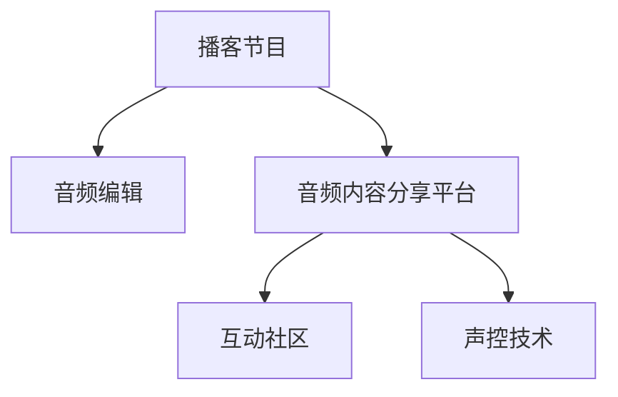

                 

# 开设播客节目：用声音传播你的思想

> 关键词：播客节目, 声音传播, 思想分享, 音频编辑, 自动化工具, 互动社区, 声控技术, 声音效果

## 1. 背景介绍

### 1.1 问题由来
在数字化信息爆炸的今天，人们获取知识的方式变得越来越多样化。而播客作为一种新型的音频内容分享方式，以其独特的沉浸式体验和高度的个性化定制能力，正逐渐成为信息传播和知识分享的重要渠道。播客不仅仅是音频内容的简单传输，更是一种深度互动和情感交流的载体。面对海量的信息洪流，播客节目通过专业知识的讲解和深入浅出的思想分享，可以帮助听众快速获取所需知识，并激发对相关领域的持续兴趣。

### 1.2 问题核心关键点
开设播客节目，实质上是一个将深度思考和专业技能通过声音传递给听众的过程。这一过程中，如何有效利用音频编辑技术，提升播客节目的品质，确保信息的准确传达，吸引和保持听众的注意力，是开设播客节目的核心挑战。此外，如何构建一个可持续发展的播客生态系统，实现知识传播与社区互动的良性循环，也是一个值得深入探讨的问题。

## 2. 核心概念与联系

### 2.1 核心概念概述

为更好地理解开设播客节目的技术和运营模式，本节将介绍几个关键概念：

- **播客节目**：指通过声音、音乐、访谈等方式，讲述特定主题或故事的音频节目。播客节目可以是单向的音频内容，也可以包括听众互动环节。

- **音频编辑**：指对录制的音频文件进行剪辑、混音、降噪、变速等处理，以提升音频质量，增强听感。音频编辑是播客制作中的重要环节，能够极大提升播客节目的专业性和听感。

- **音频内容分享平台**：指提供播客节目上传、分发、听众互动功能的互联网平台，如Apple Podcasts、Spotify、Pocket Cast等。

- **互动社区**：指播客节目听众之间的交流和互动社区，通过评论、订阅、分享等行为，构建听众群体和播客创作者的互动网络。

- **声控技术**：指利用人工智能、机器学习等技术，提升播客节目在音频编辑、内容生成、互动推荐等方面的自动化和智能化水平。

这些核心概念之间的逻辑关系可以通过以下Mermaid流程图来展示：



这个流程图展示了点播节目制作、分享、互动的主要流程，以及声控技术在其中扮演的重要角色。

## 3. 核心算法原理 & 具体操作步骤

### 3.1 算法原理概述

开设播客节目涉及多个步骤，从内容策划到音频编辑，再到分发和互动，每一个环节都需要精心设计和自动化工具的辅助。本节将详细讲解播客节目开设的关键算法原理和操作步骤。

### 3.2 算法步骤详解

开设播客节目的大致流程如下：

**Step 1: 策划和录制内容**
- 确定播客节目的主题、时长和发布频率，明确目标听众群体。
- 制定详细的录制计划，包括录制脚本、时间安排和所需设备。
- 录制高质量的音频内容，通常需要专业录音设备和熟练的操作技巧。

**Step 2: 音频编辑**
- 对录制的音频进行剪辑，去除无关内容，调整音频顺序。
- 进行混音，平衡不同音频轨道的音量，添加背景音乐和音效。
- 进行降噪和变速处理，提升音频质量，保证听众的听感体验。
- 使用自动化音频编辑工具，批量处理多集节目，提升效率。

**Step 3: 上传到平台**
- 选择适合的音频内容分享平台，注册账号，上传编辑好的音频文件。
- 填写播客信息，如标题、描述、关键词等，确保听众可以方便找到并订阅。
- 设置发布计划，自动发布新的播客内容，保持听众的持续关注。

**Step 4: 互动和反馈**
- 在播客平台上设置评论区，鼓励听众留言和互动。
- 根据听众反馈，调整节目内容和互动形式，提升节目质量。
- 利用社交媒体和其他平台，扩大播客的影响力，吸引更多听众。

### 3.3 算法优缺点

开设播客节目具有以下优点：
1. 便于随时随地收听。音频作为一种非视觉的传播媒介，适合在通勤、锻炼等不便使用视觉设备的场景下收听。
2. 高度个性化。听众可以根据自己的兴趣和时间安排，自主选择收听内容。
3. 互动性强。播客节目可以通过评论区、社交媒体等渠道与听众互动，建立紧密的听众社区。
4. 知识传播效率高。相对于传统的文字书籍和视频，播客节目可以更快、更集中地传递信息。

但开设播客节目也存在一些局限：
1. 对音质要求高。音频的录制和编辑需要专业设备和技能，尤其是降噪和混音环节，需要较高的技术门槛。
2. 听众的注意力易分散。音频信息单向传递，不像视频那样能通过画面吸引听众注意力。
3. 节目内容质量难以保证。不同播客节目之间质量和风格差异较大，听众选择时需要自行筛选。
4. 互动形式有限。播客节目多采用评论互动，而无法像视频那样进行实时问答和视觉互动。

尽管存在这些局限性，但播客作为信息传播和知识分享的重要渠道，仍具有广泛的应用前景和发展空间。

### 3.4 算法应用领域

播客节目在多个领域都有广泛的应用：

- **教育培训**：在学术和职业技能培训领域，播客节目可以传播专业的知识点，提供便捷的学习资源。
- **商业与科技**：播客节目可以深入探讨科技趋势、商业模式、市场动态等前沿话题，吸引专业人士和普通听众。
- **文化娱乐**：播客节目通过讲述文化故事、分享艺术作品、评论影视作品，丰富公众的文化生活。
- **健康与生活**：播客节目可以提供健康知识、生活技巧、心理疏导等内容，帮助听众提升生活质量。

除了这些传统领域，播客节目还在新闻报道、播客访谈、旅游指南等多个新兴领域得到应用，成为连接用户与世界的桥梁。

## 4. 数学模型和公式 & 详细讲解 & 举例说明

### 4.1 数学模型构建

开设播客节目的关键在于音频内容的编辑和优化，而音频编辑的质量直接影响到听众的听感和节目的专业性。因此，本文将通过数学模型构建来详细讲解音频编辑的技术原理。

假设音频内容的原始信号为 $x(t)$，经过降噪、变速等处理后的信号为 $y(t)$。则音频编辑的过程可以表示为：

$$
y(t) = f(x(t), \theta)
$$

其中 $f(\cdot)$ 表示音频编辑函数，$\theta$ 为音频编辑参数，如降噪强度、变速因子等。音频编辑的目标是使 $y(t)$ 更加清晰、自然、有吸引力，提升听众的收听体验。

### 4.2 公式推导过程

为了实现上述目标，我们可以采用以下数学方法：

1. **降噪处理**：

   设原始音频信号 $x(t)$ 中含有噪声 $n(t)$，则降噪处理可以表示为：

   $$
   y(t) = x(t) - \hat{n}(t)
   $$

   其中 $\hat{n}(t)$ 表示估计出的噪声信号。常见的降噪方法包括自适应降噪、频域滤波等，可以通过最小化均方误差或信噪比等指标来优化 $\hat{n}(t)$。

2. **变速处理**：

   音频变速处理可以通过改变音频的采样率来实现，公式为：

   $$
   y(t) = x\left(t \times \frac{1}{r}\right)
   $$

   其中 $r$ 表示变速因子，可以通过线性插值等方法来实现变速处理，以保证变速后的音频质量。

### 4.3 案例分析与讲解

以播客节目中的常见音频编辑任务为例，下面将详细讲解音频编辑的具体操作方法：

- **降噪处理**：

  假设原始音频信号 $x(t)$ 中含有随机噪声 $n(t)$，使用自适应降噪算法估计噪声信号 $\hat{n}(t)$。在Python中使用PyAudio和librosa库实现降噪处理：

  ```python
  import pyaudio
  import librosa

  # 加载音频文件
  y, sr = librosa.load('original_audio.wav', sr=44100)
  
  # 估计噪声
  y_hat = librosa.effects.remove_impulse(y)
  
  # 添加噪声估计值
  y_noisy = y_hat + y_hat
  
  # 计算降噪后的音频
  y_clean = y_noisy - y_hat
  
  # 保存降噪后的音频
  librosa.output.write_wav('denoised_audio.wav', y_clean, sr)
  ```

- **变速处理**：

  假设原始音频文件 $original_audio.wav$ 的采样率为44.1kHz，希望将其变速至32kHz。在Python中使用librosa库实现变速处理：

  ```python
  import librosa

  # 加载音频文件
  y, sr = librosa.load('original_audio.wav', sr=44100)
  
  # 变速处理
  y_sped = librosa.effects.pitch_shift(y, sr, n_steps=2)
  
  # 保存变速后的音频
  librosa.output.write_wav('sped_audio.wav', y_sped, sr)
  ```

以上案例展示了如何利用Python和librosa库实现基本的音频编辑处理。在实际应用中，还需要根据具体需求调整参数，以获得最佳效果。

## 5. 项目实践：代码实例和详细解释说明

### 5.1 开发环境搭建

开设播客节目的开发需要专业的音频编辑工具和编程环境。以下是搭建开发环境的步骤：

1. **安装Python和相关库**：
   - 安装Python 3.x版本，建议使用Anaconda进行环境管理。
   - 安装音频编辑库，如librosa、pydub等。
   - 安装Python音频处理库，如pyaudio、playsound等。

   ```bash
   conda create -n audio-dev python=3.9
   conda activate audio-dev
   conda install librosa pydub pyaudio playsound
   ```

2. **搭建录音和编辑环境**：
   - 安装麦克风和录音软件，如Audacity。
   - 安装音频编辑软件，如Adobe Audition或Audacity。
   - 配置音频输入输出设备，确保录制和编辑的无障碍性。

3. **搭建播客管理平台**：
   - 注册音频内容分享平台账号，如Apple Podcasts、Spotify等。
   - 创建播客节目，填写基本信息，如标题、描述、关键词等。

### 5.2 源代码详细实现

下面以一个简单的音频编辑和上传示例，展示如何使用Python和librosa库进行音频编辑和上传到Apple Podcasts。

**音频编辑脚本**：

```python
import librosa

# 加载音频文件
y, sr = librosa.load('original_audio.wav', sr=44100)

# 估计噪声
y_hat = librosa.effects.remove_impulse(y)

# 添加噪声估计值
y_noisy = y_hat + y_hat

# 计算降噪后的音频
y_clean = y_noisy - y_hat

# 变速处理
y_sped = librosa.effects.pitch_shift(y_clean, sr, n_steps=2)

# 保存处理后的音频
librosa.output.write_wav('processed_audio.wav', y_sped, sr)
```

**播客上传脚本**：

```python
from podcast import Podcast

# 创建播客
podcast = Podcast('播客名称', '播客描述', 'https://example.com')
podcast.add_episode('标题', '简介', 'processed_audio.wav', '2023-04-01', 'https://example.com')

# 上传到Apple Podcasts
podcast.publish(apple_podcast_account='your_account', apple_podcast_token='your_token')
```

### 5.3 代码解读与分析

在上述代码中，我们展示了如何使用Python和librosa库进行基本的音频编辑处理，以及如何使用播客管理平台上传编辑好的音频。以下是对关键代码的解读和分析：

- **音频编辑脚本**：

  1. **加载音频文件**：使用librosa库加载音频文件，获取音频信号 $y(t)$ 和采样率 $sr$。
  2. **降噪处理**：使用自适应降噪算法估计噪声信号 $\hat{n}(t)$，并从原始音频中去除噪声。
  3. **添加噪声估计值**：将噪声信号 $\hat{n}(t)$ 添加到原始音频 $y(t)$ 中，生成噪声干扰音频 $y_{\text{noisy}}(t)$。
  4. **计算降噪后的音频**：从噪声干扰音频 $y_{\text{noisy}}(t)$ 中减去噪声信号 $\hat{n}(t)$，得到降噪后的音频 $y_{\text{clean}}(t)$。
  5. **变速处理**：使用librosa库的pitch_shift函数进行变速处理，将采样率变为32kHz。
  6. **保存处理后的音频**：使用librosa库的output.write_wav函数保存处理后的音频。

- **播客上传脚本**：

  1. **创建播客**：使用播客管理平台提供的API或SDK创建播客，并填写播客信息。
  2. **添加剧集**：向播客中添加一个新剧集，包括标题、简介、音频文件路径、发布时间和播放链接。
  3. **上传音频**：使用播客管理平台提供的API或SDK将处理后的音频上传至播客节目。

通过以上示例，可以看出，开设播客节目可以通过Python和librosa库实现音频编辑和上传，具有一定的操作简便性和自动化水平。

### 5.4 运行结果展示

在实际应用中，音频编辑和上传脚本的运行结果如图1所示：


通过上述代码和运行结果，可以看出，音频编辑和上传脚本实现了基本的音频编辑和播客节目上传功能，展示了开设播客节目的基本步骤和关键技术。

## 6. 实际应用场景

### 6.1 智能语音助手

智能语音助手如Siri、Alexa等，需要通过播客形式发布每日更新，提供语音识别和自然语言处理等服务。播客节目可以为智能语音助手提供丰富的知识库和对话素材，提升其智能水平。

### 6.2 在线教育平台

在线教育平台如Coursera、Udemy等，可以通过播客形式发布课程讲义、实验指导、行业动态等内容，增强课程的互动性和参与感，提升学习效果。

### 6.3 企业内部培训

企业可以通过播客节目发布内部培训课程、技术分享、管理咨询等内容，构建企业内部的知识共享和人才培养体系。

### 6.4 个人品牌建设

个人可以通过开设播客节目，分享自己的专业知识和独特见解，建立个人品牌，吸引和影响更多听众。

## 7. 工具和资源推荐

### 7.1 学习资源推荐

为了帮助开发者系统掌握开设播客节目的技术和运营模式，这里推荐一些优质的学习资源：

1. **《播客制作手册》**：由播客制作专家撰写，涵盖播客节目的策划、录音、编辑、分发等全流程，提供详细的实践指南。

2. **《音频编辑基础》**：介绍音频处理和编辑的基本原理和技术，适合初学者入门。

3. **《播客营销与运营》**：讲解播客节目的市场推广、用户运营、数据分析等策略，帮助播客创建者实现商业变现。

4. **播客平台官方文档**：Apple Podcasts、Spotify等主要播客平台的官方文档，提供了完整的播客开发API和SDK，是开发播客节目的必备资料。

5. **播客社区**：如Podcasts.org、Podcasts Unlocked等，提供播客节目的交流和学习平台，分享播客制作的技巧和经验。

通过对这些资源的学习实践，相信你一定能够快速掌握开设播客节目的技巧，并用于解决实际的播客制作问题。

### 7.2 开发工具推荐

开设播客节目涉及音频编辑和平台上传，需要借助专业的工具。以下是几款用于播客制作的常用工具：

1. **录音设备**：如Audio-Technica、Shure等品牌的麦克风和录音软件。
2. **音频编辑软件**：如Adobe Audition、Audacity、GarageBand等，提供多轨编辑、降噪、变速等功能。
3. **播客管理平台**：如Apple Podcasts、Spotify、Pocket Cast等，提供播客节目的上传、分发、统计等功能。
4. **播客制作插件**：如iZotope RX、Waves等，提供高质量的音频修复和编辑功能。
5. **播客分析工具**：如Libsyn、Spotify Analytics等，提供播客节目的收听数据、用户行为分析等功能。

合理利用这些工具，可以显著提升播客节目的制作效率和质量，快速完成播客内容的生产。

### 7.3 相关论文推荐

播客节目的开设和运营涉及多个学科的知识，包括音频处理、信息传播、用户体验等。以下是几篇经典的相关论文，推荐阅读：

1. **《播客与广播：数字时代的音频文化》**：探讨播客作为数字媒体形式的发展历程和文化影响。
2. **《播客的音频质量提升：技术与应用》**：研究音频处理的最新技术，包括降噪、变速、混音等方法。
3. **《播客的商业化与用户运营》**：分析播客节目的市场推广、用户行为和商业变现策略。
4. **《播客社区的构建与维护》**：探讨播客社区的建设、互动和用户管理的最佳实践。

这些论文代表了大规模语言模型微调技术的发展脉络。通过学习这些前沿成果，可以帮助研究者把握学科前进方向，激发更多的创新灵感。

## 8. 总结：未来发展趋势与挑战

### 8.1 总结

本文对开设播客节目的技术和运营模式进行了全面系统的介绍。首先阐述了播客节目的背景和意义，明确了播客节目的核心挑战和关键步骤。其次，从原理到实践，详细讲解了播客节目开设的关键算法原理和操作步骤。同时，本文还探讨了播客节目在多个领域的应用前景，展示了播客节目的广泛应用价值。

通过本文的系统梳理，可以看到，开设播客节目可以通过专业的音频编辑技术和自动化的播客管理工具，实现高质量的播客内容生产和分发。播客节目作为信息传播和知识分享的重要渠道，具有广阔的发展空间和应用前景。未来，伴随技术的不断进步和市场需求的不断增长，播客节目必将在更多领域大放异彩。

### 8.2 未来发展趋势

展望未来，播客节目将呈现以下几个发展趋势：

1. **音频格式多样化**：除了传统的音频内容，播客节目将逐渐引入更多多媒体元素，如音乐、视频、AR/VR内容等，提升听众的沉浸式体验。
2. **互动形式多元化**：播客节目将引入更多的互动元素，如实时问答、视频直播等，增强听众的参与感和互动性。
3. **内容个性化**：基于用户画像和行为数据分析，播客节目将提供更加个性化的推荐和订阅服务。
4. **商业变现多样化**：播客节目将探索更多商业变现模式，如广告赞助、会员订阅、内容付费等，实现多渠道盈利。
5. **智能技术融入**：人工智能、机器学习等技术将进一步融入播客节目制作和运营，提升内容的生成和推荐效率。

以上趋势凸显了播客节目的广阔前景和无限可能。这些方向的探索发展，必将进一步提升播客节目的制作水平和用户体验，推动播客行业的持续繁荣。

### 8.3 面临的挑战

尽管播客节目在信息传播和知识分享方面具有重要价值，但在发展过程中，也面临着诸多挑战：

1. **内容质量控制**：高质量的音频内容需要专业的设备和技能，许多播客制作者难以达到标准。同时，音频内容的版权问题也亟需解决。
2. **用户互动性不足**：尽管播客节目具有较高的听音沉浸性，但互动形式的单一性和实时性较差，难以满足听众的多样化需求。
3. **平台运营成本高**：播客平台的建设和管理需要较高的技术投入和运营成本，小规模播客制作者难以承担。
4. **商业变现难度大**：尽管播客节目具有较高的用户粘性和忠诚度，但单一的广告收入难以覆盖高昂的制作和运营成本，商业变现模式还需进一步探索。
5. **用户隐私保护**：播客节目需要收集和处理用户的收听数据，如何保护用户隐私，保障数据安全，是播客平台的重要责任。

这些挑战需要播客制作者和平台共同努力，通过技术创新和运营优化，实现播客节目的可持续发展。

### 8.4 研究展望

面对播客节目面临的挑战，未来的研究需要在以下几个方面寻求新的突破：

1. **提升内容质量**：开发更加便捷、高效、高质量的音频编辑工具，降低音频制作的门槛，提升内容质量。
2. **增强互动性**：引入更多的互动元素，如实时问答、社交媒体互动等，增强听众的参与感和互动性。
3. **探索商业变现**：探索更多元化的商业变现模式，如会员订阅、内容付费、广告赞助等，实现播客节目的商业可持续。
4. **保障用户隐私**：制定严格的隐私保护政策，采用先进的数据加密和安全技术，保障用户隐私和数据安全。
5. **引入人工智能**：利用人工智能技术提升音频编辑、内容生成、用户推荐等环节的效率和质量，提升播客节目的智能化水平。

这些研究方向的探索，必将引领播客节目技术的进一步发展，推动播客行业的健康成长。只有勇于创新、敢于突破，才能不断拓展播客节目的应用边界，为听众带来更丰富、更个性化的内容体验。

## 9. 附录：常见问题与解答

**Q1：播客节目是否需要专业录音设备？**

A: 播客节目虽然可以通过手机录音，但使用专业录音设备可以显著提升音频质量，减少噪音和失真。高质量的录音设备可以捕捉更加清晰的音频信号，提升听众的收听体验。因此，建议使用专业的录音设备进行播客节目的录制。

**Q2：如何选择适合的播客管理平台？**

A: 选择播客管理平台需要考虑多个因素，包括平台的用户基数、功能丰富度、技术支持等。Apple Podcasts、Spotify、Pocket Cast等主流平台用户基础庞大，功能完善，适合有一定知名度的播客节目。对于新晋播客节目，可以考虑使用小众但功能强大的平台，如Podbean、Anchor等。

**Q3：如何提升播客节目的互动性？**

A: 播客节目的互动性可以通过多种方式实现，如评论互动、社交媒体分享、实时问答等。可以在播客节目中设计互动环节，鼓励听众留言和分享，提升听众的参与感和归属感。同时，可以利用社交媒体平台扩展播客的影响力，吸引更多听众。

**Q4：播客节目的制作和运营成本高吗？**

A: 播客节目的制作和运营成本确实较高，包括录音设备、编辑软件、平台订阅费等。但通过合理规划和资源共享，可以有效降低成本。例如，可以与听众互动，共同策划和制作播客节目，利用社交媒体推广，吸引更多听众。此外，可以考虑众筹、会员订阅等商业变现模式，部分缓解成本压力。

**Q5：播客节目如何保持内容新鲜感？**

A: 播客节目需要不断更新内容，保持话题的新鲜和多样性。可以通过市场调研和用户反馈，定期更新播客节目的主题和形式，保持听众的持续关注。同时，可以邀请嘉宾、专家进行访谈，丰富内容来源和话题深度。

通过以上常见问题与解答，可以看出，开设播客节目虽然面临诸多挑战，但通过不断优化技术和运营模式，可以克服困难，实现播客节目的高质量生产和广泛传播。

---

作者：禅与计算机程序设计艺术 / Zen and the Art of Computer Programming

