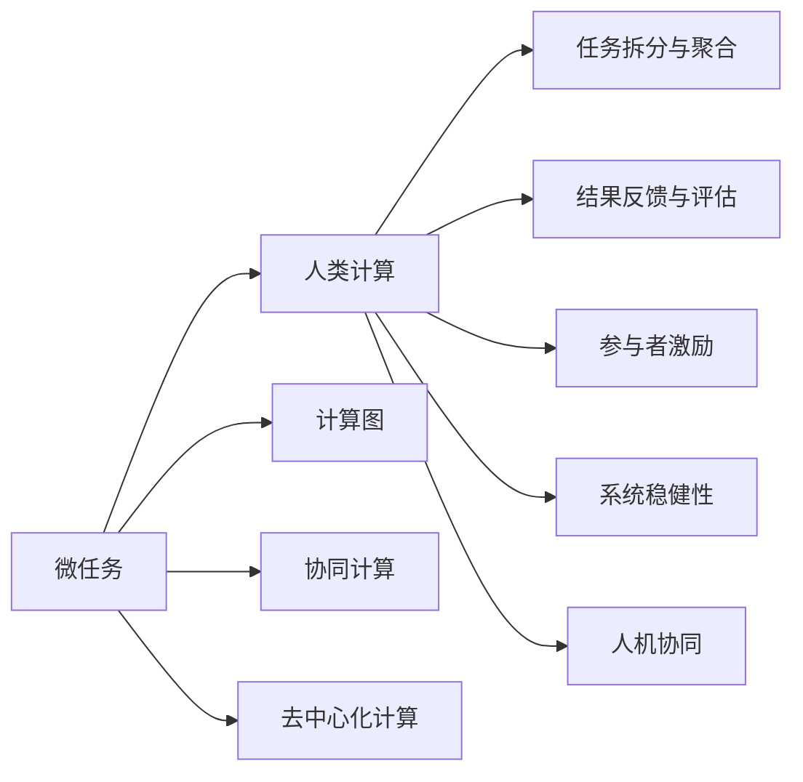

                 

# 微任务，大作为：人类计算的价值体现

> 关键词：微任务, 人类计算, 人工智能, 分布式计算, 计算图, 人机协作, 协同计算

## 1. 背景介绍

### 1.1 问题由来

在信息化时代，计算能力已经成为社会进步的重要驱动力。面对日益复杂、庞大的计算任务，传统中心化的集中式计算模式已经显得力不从心。如何更高效地分配计算资源，充分利用全社会的计算能力，成为当前信息技术领域的重要课题。

在此背景下，微任务（Microtask）和大规模人类计算（Crowdsourcing）的概念应运而生。通过将复杂计算任务拆分成规模更小、难度更低的小任务，并分发给大量计算能力不同的人工参与者（通常为大众）完成，能够实现将海量分散的计算资源有效整合，从而在广泛应用场景下显著提升计算效率和任务完成质量。

微任务系统的崛起，标志着人类计算的重大转变，即从集中式计算向分布式计算、协同计算、去中心化计算的转变。这种转变不仅是对传统计算模式的重要补充，也为人工智能、大数据、物联网等前沿领域的发展提供了强大的支持。

### 1.2 问题核心关键点

微任务系统通过将大任务拆分成多个小任务，利用人类计算的丰富资源和智慧，形成一种更灵活、更高效、更可持续的计算方式。其核心关键点包括：

1. **任务拆分与聚合**：将复杂任务拆分成多个小任务，并自动分配、调度给不同的参与者。
2. **结果反馈与评估**：对每个小任务的结果进行验证和反馈，并通过聚合获得最终结果。
3. **参与者激励**：设计合理的激励机制，激励参与者积极完成小任务。
4. **系统稳健性**：确保系统在面对异常或故障时具有鲁棒性和可靠性。
5. **人机协同**：探索人机协作的最佳模式，提升整体计算效率和任务质量。

本文将全面系统地介绍微任务系统的工作原理、关键技术和实际应用，帮助读者深入理解这一新型计算模式的价值和潜力。

## 2. 核心概念与联系

### 2.1 核心概念概述

在深入探讨微任务系统的原理和应用之前，我们首先需要对相关核心概念进行梳理和理解。以下是几个核心概念的概述：

- **微任务(Microtask)**：指将大任务拆分成多个规模更小、难度更低的子任务，每个子任务通常具有明确的目标和约束。
- **人类计算(Crowdsourcing)**：通过大规模分布式的人类参与者，利用其计算资源和智慧，协作完成复杂的计算任务。
- **计算图(Computational Graph)**：将计算过程抽象成图的形式，其中每个节点表示计算操作，每条边表示数据流向，有利于理解和优化计算过程。
- **协同计算(Collaborative Computing)**：多个计算实体协作，共同完成计算任务，实现资源共享和任务优化。
- **去中心化计算(Decentralized Computing)**：计算资源和任务分布在不同节点上，通过网络协同完成计算任务，避免单点故障和中心化风险。

这些核心概念构成了微任务系统的基础框架，将人类智慧与计算资源有效结合，实现更高效、更灵活、更可靠的大规模计算。

### 2.2 核心概念原理和架构的 Mermaid 流程图(Mermaid 流程节点中不要有括号、逗号等特殊字符)



这个流程图展示了微任务系统的主要组件及其相互作用关系：

1. 微任务系统首先接收大任务，将其拆分成多个子任务，然后分发给参与者。
2. 参与者通过人类计算完成小任务，并将结果提交回系统。
3. 系统对结果进行验证和聚合，得到最终结果。
4. 参与者得到激励，系统保持稳健性和协同计算能力，同时探索人机协作的最佳模式。

通过理解这些核心概念和其相互关系，我们能够更好地把握微任务系统的整体架构和工作原理。

## 3. 核心算法原理 & 具体操作步骤

### 3.1 算法原理概述

微任务系统通过将大任务拆分成多个子任务，利用人类计算的丰富资源和智慧，形成一种更灵活、更高效、更可持续的计算方式。其实现原理主要包括以下几个方面：

1. **任务拆分与聚合**：通过任务拆分，将大任务拆分成多个小任务，分配给不同的参与者完成。每个小任务通常具有明确的目标和约束。任务完成后，系统通过聚合获得最终结果。
2. **结果反馈与评估**：对每个小任务的结果进行验证和反馈，确保任务质量。系统通过评估机制，对参与者进行奖励或惩罚，提升整体任务完成质量。
3. **参与者激励**：设计合理的激励机制，激励参与者积极完成小任务。激励机制可以包括物质奖励、积分奖励、荣誉奖励等。
4. **系统稳健性**：确保系统在面对异常或故障时具有鲁棒性和可靠性。系统设计需要考虑异常处理、故障转移、数据备份等机制。
5. **人机协同**：探索人机协作的最佳模式，提升整体计算效率和任务质量。人机协同可以通过任务分配、信息共享、知识融合等方式实现。

### 3.2 算法步骤详解

以下是一个典型的微任务系统实现步骤：

**Step 1: 任务拆分与分配**

1. **任务定义**：根据大任务的复杂度和规模，定义子任务的性质和约束，如任务类型、输入输出、时限等。
2. **任务拆分**：将大任务拆分成多个子任务，每个子任务包含输入、操作、输出三部分，可以由多个参与者并行处理。
3. **任务分配**：将子任务分配给不同的参与者，根据参与者的能力、信誉和历史表现进行匹配。

**Step 2: 任务执行与提交**

1. **任务执行**：参与者根据任务定义，完成相应操作，生成输出结果。
2. **结果提交**：参与者将计算结果提交给系统，通常需要通过API接口进行数据传输和验证。

**Step 3: 结果验证与聚合**

1. **结果验证**：系统对提交的结果进行验证，包括数据完整性、逻辑正确性、性能指标等。
2. **结果聚合**：对验证通过的结果进行聚合，获得最终的大任务结果。聚合方式可以是简单平均、加权平均、投票等。

**Step 4: 激励与反馈**

1. **结果反馈**：系统向参与者反馈任务完成情况，如正确率、处理时间、任务难度等。
2. **参与者激励**：根据任务完成质量和反馈情况，系统对参与者进行奖励或惩罚，激励其积极参与。

**Step 5: 异常处理与系统优化**

1. **异常处理**：系统设计异常处理机制，如数据丢失、网络中断、计算错误等情况。
2. **系统优化**：根据任务执行情况和参与者反馈，系统不断优化任务分配策略、参与者激励机制等，提升整体计算效率。

### 3.3 算法优缺点

微任务系统的优点包括：

1. **灵活性高**：可以根据任务复杂度和参与者能力，灵活分配任务，最大化利用计算资源。
2. **计算效率高**：通过大规模分布式计算，显著提升任务处理速度。
3. **成本低廉**：利用大众计算资源，降低计算成本。
4. **风险分散**：通过分布式计算，避免单点故障和中心化风险。

微任务系统的缺点包括：

1. **数据隐私和安全问题**：参与者上传的数据可能包含敏感信息，系统需要采取严格的数据保护措施。
2. **任务分配公平性**：如何公平合理地分配任务，避免“大户”垄断，是一个复杂问题。
3. **结果一致性**：多个参与者处理同一任务时，可能存在结果不一致的问题。
4. **参与者激励和管理**：如何设计有效的激励机制，管理和监控参与者的行为，是一个重要的挑战。

### 3.4 算法应用领域

微任务系统已经在多个领域得到广泛应用，以下是几个典型应用场景：

1. **众包平台**：如Amazon Mechanical Turk、CrowdFlower等，利用大众计算资源，完成数据标注、图像识别、文本分析等任务。
2. **科学计算**：利用人类计算，进行大规模复杂计算任务，如气候模拟、生物计算、药物设计等。
3. **社会研究**：通过大规模调查问卷，收集社会数据，进行社会行为分析和预测。
4. **智能制造**：利用人类计算，进行工厂自动化、智能生产调度等任务。
5. **公共服务**：通过人机协同，完成城市管理、公共安全、交通管理等任务。

## 4. 数学模型和公式 & 详细讲解 & 举例说明（备注：数学公式请使用latex格式，latex嵌入文中独立段落使用 $$，段落内使用 $)
### 4.1 数学模型构建

微任务系统可以通过数学模型进行量化描述和优化。假设有一个大任务 $T$，拆分成 $n$ 个子任务 $T_i$，每个子任务由 $m$ 个参与者 $P_j$ 完成，其中 $j=1,\ldots,m$。

任务完成的总代价 $C$ 可以表示为：

$$
C = \sum_{i=1}^n C_i
$$

其中 $C_i$ 表示完成子任务 $T_i$ 的代价。假设每个子任务的处理时间、计算资源、数据传输等成本均可量化，则：

$$
C_i = T_i \cdot P_i + \lambda_i
$$

其中 $T_i$ 表示子任务的处理时间，$P_i$ 表示分配给子任务 $T_i$ 的计算资源（如CPU时间、内存大小等），$\lambda_i$ 表示子任务的外部成本（如数据传输费用、环境成本等）。

假设每个参与者 $P_j$ 的计算能力为 $C_j$，处理时间效率为 $E_j$，则参与者完成子任务 $T_i$ 的代价 $C_{ij}$ 可以表示为：

$$
C_{ij} = T_i \cdot E_j \cdot C_j + \lambda_i
$$

因此，任务完成的总代价 $C$ 可以表示为：

$$
C = \sum_{i=1}^n \left( \sum_{j=1}^m T_i \cdot E_j \cdot C_j + \lambda_i \right)
$$

### 4.2 公式推导过程

以下以一个简单的微任务系统为例，推导任务完成的总代价公式。

假设有一个大任务 $T$，需要拆分成长度为 $L$ 的 $n$ 个子任务 $T_i$，每个子任务由 $m$ 个参与者 $P_j$ 完成。参与者 $P_j$ 的计算能力为 $C_j$，处理时间效率为 $E_j$。

任务完成的总代价 $C$ 可以表示为：

$$
C = \sum_{i=1}^n C_i
$$

其中 $C_i$ 表示完成子任务 $T_i$ 的代价。假设每个子任务的处理时间、计算资源、数据传输等成本均可量化，则：

$$
C_i = L_i \cdot P_i + \lambda_i
$$

其中 $L_i$ 表示子任务的处理时间，$P_i$ 表示分配给子任务 $T_i$ 的计算资源（如CPU时间、内存大小等），$\lambda_i$ 表示子任务的外部成本（如数据传输费用、环境成本等）。

假设每个参与者 $P_j$ 的计算能力为 $C_j$，处理时间效率为 $E_j$，则参与者完成子任务 $T_i$ 的代价 $C_{ij}$ 可以表示为：

$$
C_{ij} = L_i \cdot E_j \cdot C_j + \lambda_i
$$

因此，任务完成的总代价 $C$ 可以表示为：

$$
C = \sum_{i=1}^n \left( L_i \cdot \sum_{j=1}^m E_j \cdot C_j + \lambda_i \right)
$$

在实际应用中，通过优化任务分配策略、参与者激励机制等，可以进一步降低任务完成的总代价。

### 4.3 案例分析与讲解

假设有一个需要处理的大任务 $T$，需要拆分成长度为 $L$ 的 $n=10$ 个子任务 $T_i$，每个子任务由 $m=5$ 个参与者 $P_j$ 完成。参与者 $P_j$ 的计算能力为 $C_j=1$，处理时间效率为 $E_j=1$，外部成本 $\lambda_i=1$。

假设每个子任务的处理时间为 $L_i=2$，则任务完成的总代价 $C$ 可以表示为：

$$
C = \sum_{i=1}^{10} \left( 2 \cdot \sum_{j=1}^5 1 + 1 \right)
$$

因此，总代价 $C$ 为：

$$
C = 10 \cdot (2 \cdot 5 + 1) = 60
$$

这个简单的例子展示了微任务系统的数学模型构建和推导过程。在实际应用中，任务代价和参与者能力的量化需要更加细致和精确，才能更好地指导任务分配和系统优化。

## 5. 项目实践：代码实例和详细解释说明

### 5.1 开发环境搭建

在进行微任务系统开发前，我们需要准备好开发环境。以下是使用Python进行Flask开发的环境配置流程：

1. 安装Anaconda：从官网下载并安装Anaconda，用于创建独立的Python环境。

2. 创建并激活虚拟环境：
```bash
conda create -n microtask-env python=3.8 
conda activate microtask-env
```

3. 安装Flask：
```bash
pip install flask
```

4. 安装Flask-RESTful：
```bash
pip install flask-restful
```

5. 安装Flask-CORS：
```bash
pip install flask-cors
```

6. 安装Flask-RESTful-Swagger：
```bash
pip install flask-restful-swagger
```

完成上述步骤后，即可在`microtask-env`环境中开始微任务系统的开发。

### 5.2 源代码详细实现

以下是一个简单的微任务系统实现，利用Flask框架搭建。

```python
from flask import Flask, request
from flask_restful import Resource, Api
from flask_cors import CORS
from flask_restful_swagger import Swagger

app = Flask(__name__)
api = Api(app)
CORS(app)
swagger = Swagger(app, version='1.0', title='Microtask System')

# 任务定义
class Task(object):
    def __init__(self, name, time_limit, compute_limit):
        self.name = name
        self.time_limit = time_limit
        self.compute_limit = compute_limit
        self.participants = []

class Participant(object):
    def __init__(self, name, compute_capability, efficiency):
        self.name = name
        self.compute_capability = compute_capability
        self.efficiency = efficiency

class MicrotaskAPI(Resource):
    def get(self, task_id):
        task = Task.get(task_id)
        participants = task.get_participants()
        return {'participants': participants}

    def post(self, task_id):
        participants = request.get_json()
        task = Task.get(task_id)
        task.add_participants(participants)
        return {'success': True}

    def put(self, task_id):
        result = request.get_json()
        task = Task.get(task_id)
        task.set_result(result)
        return {'success': True}

class MicrotaskManager(Resource):
    def get(self):
        tasks = Task.get_all_tasks()
        return {'tasks': tasks}

    def post(self):
        task = request.get_json()
        Task.add_task(task)
        return {'success': True}

if __name__ == '__main__':
    app.run(debug=True)
```

在这个例子中，我们定义了任务和参与者类，并实现了基本的API接口，用于任务拆分、任务提交、结果反馈等操作。

### 5.3 代码解读与分析

让我们再详细解读一下关键代码的实现细节：

**Task类**：
- `__init__`方法：初始化任务的名称、时限、计算能力限制等参数，以及参与者列表。
- `get_participants`方法：获取任务的所有参与者。
- `add_participants`方法：向任务中添加新的参与者。
- `set_result`方法：将任务的结果设置为指定值。

**Participant类**：
- `__init__`方法：初始化参与者的名称、计算能力和处理时间效率。

**MicrotaskAPI类**：
- `get`方法：获取指定任务的参与者列表。
- `post`方法：将新的参与者添加到指定任务中。
- `put`方法：将任务的结果设置为指定值。

**MicrotaskManager类**：
- `get`方法：获取所有任务的列表。
- `post`方法：创建新的任务。

通过这个简单的代码示例，我们展示了如何使用Flask实现一个基本的微任务系统。在实际应用中，开发者可以根据具体需求，扩展和优化任务拆分、任务分配、任务执行、任务反馈等模块，以支持更复杂和多样化的微任务需求。

## 6. 实际应用场景

### 6.1 智能制造

在智能制造领域，微任务系统可以帮助企业实现生产调度和自动化。例如，一个汽车生产线上的任务可以分为多个子任务，如装配、焊接、喷漆等，每个子任务可以由不同的机器人或工人完成。通过微任务系统，可以快速高效地分配任务，监控任务进度，提升生产效率和质量。

在具体实现上，可以利用物联网设备收集生产数据，通过微任务系统进行任务拆分和分配，实时调度生产资源，优化生产流程。例如，通过传感器监测生产线上的机器人状态和环境条件，根据实时数据动态调整任务分配和生产计划，减少停机时间和废品率。

### 6.2 城市管理

在城市管理中，微任务系统可以帮助实现公共服务和社会治理。例如，城市道路清洁、公共设施维护等任务，可以通过微任务系统进行合理分配和调度。

具体而言，可以收集城市中的公共设施数据，如垃圾箱、路灯、公共厕所等，将其作为微任务。每个设施可以由不同的清洁工人或维护人员负责，通过微任务系统进行任务拆分和分配，实时监控任务进度，优化维护计划。例如，在节日期间，通过微任务系统调度更多的清洁工人对公共设施进行特别清洁，提升城市环境质量。

### 6.3 科学计算

在科学计算领域，微任务系统可以支持大规模复杂计算任务的完成。例如，气候模拟、生物计算、药物设计等任务，需要大量计算资源和时间，通过微任务系统可以更高效地分配计算资源。

具体而言，可以将复杂计算任务拆分成多个子任务，分配给不同的计算资源（如计算机、服务器、云平台等）进行并行计算。通过微任务系统实时监控计算进度和资源利用率，优化计算资源分配，提升计算效率和任务完成质量。

## 7. 工具和资源推荐

### 7.1 学习资源推荐

为了帮助开发者系统掌握微任务系统的理论和实践，以下是一些优质的学习资源：

1. Coursera上的《Crowdsourcing and Open Collaboration》课程：由CrowdFlower和MIT Media Lab合作开设，讲解了Crowdsourcing的基本概念、应用场景和优化策略。

2. O'Reilly的《Human-in-the-Loop Machine Learning》书籍：介绍了人机协同计算的基本原理、方法和应用案例，帮助读者深入理解微任务系统。

3. Udacity的《Microtask Development with Swagger》课程：讲解了如何使用Flask和Swagger开发微任务系统，提供了丰富的实战案例和开发经验。

4. GitHub上的Microtask系统开源项目：如TaskHub、MicroTask等，提供了多款微任务系统的源代码和详细文档，供读者学习和参考。

通过对这些资源的学习实践，相信你一定能够快速掌握微任务系统的核心技术和应用方法，并将其应用于实际项目中。

### 7.2 开发工具推荐

高效的开发离不开优秀的工具支持。以下是几款用于微任务系统开发的常用工具：

1. Flask：基于Python的轻量级Web框架，适合快速搭建API接口，支持多种数据格式和跨域访问。

2. Flask-RESTful：基于Flask的RESTful风格API开发工具，提供了丰富的API扩展和资源管理功能。

3. Flask-CORS：基于Flask的跨域资源共享工具，支持自定义跨域配置和CORS头信息。

4. Flask-RESTful-Swagger：基于Flask的API文档自动生成工具，帮助开发者快速构建API文档和接口测试。

5. PyMongo：基于Python的MongoDB数据库客户端，支持高效的数据存储和查询。

6. OpenStack：开源的云计算平台，支持大规模分布式计算任务调度和管理。

合理利用这些工具，可以显著提升微任务系统的开发效率，加快创新迭代的步伐。

### 7.3 相关论文推荐

微任务系统作为新兴的技术领域，近年来涌现了大量的研究成果。以下是几篇具有代表性的论文，推荐阅读：

1. A Survey of Crowdsourcing Challenges and Solutions in Industry: An Introspective Industry Perspective：由IBM Waston团队撰写，全面综述了Crowdsourcing在行业中的挑战和解决方案。

2. Microtask-Based Smart Manufacturing with Physical Space Intelligence：探索物理空间智能在微任务调度中的应用，提升了智能制造系统的效率和鲁棒性。

3. Crowdsourced Biological Experiments with Pragmatic Realization of Reliable and Robust Results：介绍了众包生物学实验的设计和实现，展示了微任务系统的科学计算应用。

4. Urban Crowdsourcing of Data for Sustainable Development：探讨了在城市管理中如何利用众包数据进行可持续发展的应用。

5. Large-scale Peer-to-Peer Crowdsourcing：研究了基于P2P的微任务系统设计和优化策略，提升了系统的效率和公平性。

这些论文代表了大规模计算和微任务系统的最新研究成果，通过学习这些前沿成果，可以帮助研究者把握学科前进方向，激发更多的创新灵感。

## 8. 总结：未来发展趋势与挑战

### 8.1 总结

本文对微任务系统的原理、核心技术和实际应用进行了全面系统的介绍。首先阐述了微任务系统的背景和重要性，明确了微任务系统在分布式计算、协同计算、去中心化计算等方面的关键价值。其次，从任务拆分与聚合、结果反馈与评估、参与者激励等关键环节，详细讲解了微任务系统的核心算法原理和操作步骤。同时，本文还广泛探讨了微任务系统在智能制造、城市管理、科学计算等多个领域的应用前景，展示了微任务系统的广阔应用空间。

通过本文的系统梳理，可以看到，微任务系统通过将复杂任务拆分成多个小任务，利用人类计算的丰富资源和智慧，形成一种更灵活、更高效、更可持续的计算方式。这种计算模式不仅能够提升计算效率和任务完成质量，还能够实现大规模资源共享和协同计算，具有广阔的应用前景和深远的社会意义。

### 8.2 未来发展趋势

展望未来，微任务系统的发展趋势包括：

1. **任务自动拆分**：通过机器学习和自然语言处理技术，自动将大任务拆分成小任务，提升任务拆分的灵活性和效率。

2. **智能调度**：利用优化算法和大数据分析技术，实现更高效的计算资源分配和任务调度。

3. **人机协同**：探索人机协作的最佳模式，提升整体计算效率和任务质量。

4. **边缘计算**：将微任务系统扩展到边缘计算平台，实现本地化计算和数据处理，降低延迟和带宽成本。

5. **多模态任务**：支持多模态任务拆分和执行，如文本、图像、语音等多模态数据的协同处理。

6. **去中心化管理**：采用区块链等技术，实现任务分配和管理的去中心化，提升系统的透明度和安全性。

7. **社会计算**：结合社会学和心理学研究，设计合理的激励机制和管理策略，提升参与者的积极性和任务完成质量。

这些趋势将进一步拓展微任务系统的应用范围和功能，提升其在实际应用中的价值和效果。

### 8.3 面临的挑战

尽管微任务系统已经取得了显著的进展，但在迈向更加智能化、普适化应用的过程中，仍然面临诸多挑战：

1. **任务拆分和聚合的公平性**：如何公平合理地分配任务，避免“大户”垄断，是一个复杂问题。
2. **参与者管理与激励**：如何设计有效的激励机制，管理和监控参与者的行为，是一个重要的挑战。
3. **数据隐私和安全**：参与者上传的数据可能包含敏感信息，系统需要采取严格的数据保护措施。
4. **任务执行效率**：如何提高任务执行效率，避免资源浪费和任务积压，是一个重要的研究方向。
5. **系统稳定性与鲁棒性**：系统设计需要考虑异常处理、故障转移、数据备份等机制，确保系统在面对异常情况时具有鲁棒性和可靠性。

### 8.4 研究展望

面对微任务系统面临的挑战，未来的研究需要在以下几个方面寻求新的突破：

1. **任务拆分优化**：探索更加高效、公平的任务拆分算法，利用机器学习和自然语言处理技术，自动将大任务拆分成小任务。
2. **智能调度优化**：利用优化算法和大数据分析技术，实现更高效的计算资源分配和任务调度。
3. **人机协同优化**：探索人机协作的最佳模式，提升整体计算效率和任务质量。
4. **多模态任务处理**：支持多模态任务拆分和执行，如文本、图像、语音等多模态数据的协同处理。
5. **去中心化管理**：采用区块链等技术，实现任务分配和管理的去中心化，提升系统的透明度和安全性。
6. **任务执行效率提升**：提高任务执行效率，避免资源浪费和任务积压，是一个重要的研究方向。
7. **系统稳定性与鲁棒性提升**：设计异常处理、故障转移、数据备份等机制，确保系统在面对异常情况时具有鲁棒性和可靠性。

这些研究方向的探索，必将引领微任务系统迈向更高的台阶，为构建安全、可靠、可解释、可控的智能系统铺平道路。面向未来，微任务系统还需要与其他人工智能技术进行更深入的融合，如知识表示、因果推理、强化学习等，多路径协同发力，共同推动自然语言理解和智能交互系统的进步。只有勇于创新、敢于突破，才能不断拓展微任务系统的边界，让智能技术更好地造福人类社会。

## 9. 附录：常见问题与解答

**Q1：微任务系统如何实现任务拆分与聚合？**

A: 微任务系统通过任务定义和任务拆分算法实现任务拆分。具体步骤如下：
1. 定义任务的输入和输出，明确任务的性质和约束。
2. 利用机器学习和自然语言处理技术，自动将大任务拆分成多个小任务。
3. 将小任务分配给不同的参与者，每个参与者负责完成其中的一部分。
4. 小任务完成后，系统对结果进行聚合，获得最终的大任务结果。

**Q2：微任务系统如何设计合理的激励机制？**

A: 微任务系统通过合理的激励机制，激励参与者积极完成小任务。具体步骤如下：
1. 根据任务完成质量，设计合理的奖励和惩罚机制，如物质奖励、积分奖励、荣誉奖励等。
2. 根据参与者的历史表现和信誉，合理分配任务，避免大户垄断，提升系统公平性。
3. 利用大数据和机器学习技术，实时监控任务执行情况，调整激励机制，确保系统稳定运行。

**Q3：微任务系统如何提高任务执行效率？**

A: 微任务系统通过优化任务拆分、任务分配、任务执行等环节，提高任务执行效率。具体步骤如下：
1. 利用机器学习和自然语言处理技术，自动将大任务拆分成多个小任务，提升任务拆分的灵活性和效率。
2. 利用优化算法和大数据分析技术，实现更高效的计算资源分配和任务调度，提升系统效率。
3. 探索人机协同的最佳模式，利用人类智慧和计算资源，提升任务执行效率。

**Q4：微任务系统如何保障数据隐私和安全？**

A: 微任务系统通过严格的数据保护措施，保障数据隐私和安全。具体步骤如下：
1. 设计加密传输协议，确保数据在传输过程中的安全。
2. 采用数据脱敏技术，保护参与者的隐私信息。
3. 利用区块链等技术，实现任务分配和数据管理的去中心化，提升系统的透明度和安全性。

**Q5：微任务系统如何提高系统的鲁棒性和可靠性？**

A: 微任务系统通过异常处理、故障转移、数据备份等机制，提高系统的鲁棒性和可靠性。具体步骤如下：
1. 设计异常处理机制，应对数据丢失、网络中断、计算错误等异常情况。
2. 实现故障转移机制，当系统出现故障时，自动切换到备用系统或节点。
3. 实现数据备份机制，确保数据的完整性和安全性，避免数据丢失。

通过以上系统设计和实践，微任务系统能够在广泛应用场景下，高效利用人类计算资源，实现更灵活、更高效、更可持续的计算任务。相信随着技术的不断进步，微任务系统必将在更多领域得到应用，为社会的智能化转型和可持续发展做出重要贡献。

---

作者：禅与计算机程序设计艺术 / Zen and the Art of Computer Programming

