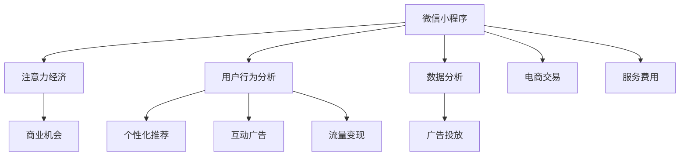

                 

# 微信小程序：注意力经济的新战场

> 关键词：微信小程序,注意力经济,用户行为,数据分析,个性化推荐,互动广告,流量变现,商业机会

## 1. 背景介绍

### 1.1 问题由来
随着移动互联网的普及和智能手机的普及，微信小程序作为一种新兴的轻量级应用形态，凭借其快速、便捷、无缝的用户体验，快速成为连接消费者与商家、企业和品牌的桥梁。自2017年发布以来，微信小程序已经吸引了数亿活跃用户，涵盖社交、电商、教育、娱乐、健康等多个行业领域，形成了一个庞大的数字化生态系统。

微信小程序以其独特的用户界面和交互方式，重塑了用户的注意力获取和使用方式。商家和品牌通过小程序，可以更加精准地触达目标用户，实现用户行为数据的收集与分析，进而进行精准推荐和广告投放，极大地提升了用户参与度和商家经营效益。在此背景下，如何利用微信小程序这一新型媒介，最大化地吸引和利用用户的注意力，成为了商家和品牌关注的焦点。

### 1.2 问题核心关键点
1. **注意力经济**：商家和品牌如何通过微信小程序，高效吸引和利用用户的注意力，实现商业价值最大化。
2. **用户行为分析**：如何通过微信小程序获取和分析用户的行为数据，理解用户偏好和需求。
3. **个性化推荐**：如何利用用户行为数据，提供个性化的商品、服务和广告推荐。
4. **互动广告**：如何设计有效的互动广告形式，提升用户参与度和广告效果。
5. **流量变现**：如何通过微信小程序进行流量变现，拓展商业机会。

这些关键点共同构成了微信小程序在注意力经济中的核心问题和挑战，本文将从这些角度出发，系统地探讨微信小程序的商业应用和实践方法。

## 2. 核心概念与联系

### 2.1 核心概念概述

为更好地理解微信小程序在注意力经济中的应用，本节将介绍几个密切相关的核心概念：

- **微信小程序**：基于微信平台的轻量级应用，支持快速部署、无缝体验，能够跨平台运行。
- **注意力经济**：指通过吸引和利用用户的注意力，创造商业价值和竞争优势的经济模式。
- **用户行为分析**：通过数据分析工具，收集、分析和理解用户在使用微信小程序时的行为数据，如浏览记录、点击行为、购物行为等。
- **个性化推荐**：利用用户行为数据，为用户提供定制化的商品、服务和广告推荐，提高用户满意度和商家转化率。
- **互动广告**：通过微信小程序提供互动性的广告形式，如小游戏、抽奖活动等，增加用户参与度和广告效果。
- **流量变现**：通过微信小程序的广告收入、电商交易、服务费用等方式，将用户流量转化为商业收入。

这些核心概念之间的逻辑关系可以通过以下Mermaid流程图来展示：



这个流程图展示了几组关键概念之间的关系：

1. 微信小程序作为注意力获取的渠道，为商家和品牌提供用户行为数据。
2. 用户行为数据分析后，商家可以通过个性化推荐和互动广告提升用户参与度。
3. 流量变现则是微信小程序商业价值的最终体现。

## 3. 核心算法原理 & 具体操作步骤
### 3.1 算法原理概述

基于微信小程序的注意力经济应用，本质上是一个用户行为数据驱动的个性化推荐和广告投放过程。其核心思想是：通过分析用户在微信小程序上的行为数据，构建用户兴趣模型，从而进行精准的商品、服务和广告推荐，提高用户参与度和商家收益。

形式化地，假设用户行为数据为 $\mathcal{D}$，商家提供的商品、服务和广告集合为 $\mathcal{G}$，用户行为与商品、服务、广告的匹配关系为 $\mathcal{M}$。用户行为分析的目标是最大化 $\mathcal{M}$ 的匹配度，以实现个性化推荐和广告投放的最优效果。

具体来说，商家通过以下步骤进行个性化推荐和广告投放：

1. 收集用户行为数据，构建用户兴趣模型。
2. 通过匹配算法计算用户与商品、服务、广告的匹配度。
3. 根据匹配度排序，进行个性化推荐和广告投放。

### 3.2 算法步骤详解

基于微信小程序的个性化推荐和广告投放一般包括以下几个关键步骤：

**Step 1: 数据收集与预处理**
- 通过微信小程序收集用户的行为数据，包括浏览记录、点击行为、购物行为等。
- 对数据进行清洗、去重和标准化处理，去除异常值和噪声。

**Step 2: 用户行为建模**
- 使用机器学习模型对用户行为数据进行建模，如协同过滤、内容过滤、混合过滤等。
- 构建用户兴趣模型，描述用户的偏好、需求和行为特征。

**Step 3: 商品、服务与广告推荐**
- 通过匹配算法计算用户与商品、服务、广告的匹配度。
- 根据匹配度排序，选择最合适的推荐结果。

**Step 4: 互动广告设计**
- 设计互动性的广告形式，如小游戏、抽奖活动等，提高用户参与度和广告效果。
- 通过A/B测试等方法，优化广告形式和投放策略。

**Step 5: 广告投放与效果评估**
- 利用微信小程序的广告投放平台，对推荐和互动广告进行投放。
- 实时监控广告效果，如点击率、转化率等，评估广告效果并进行优化。

### 3.3 算法优缺点

基于微信小程序的个性化推荐和广告投放方法具有以下优点：
1. 用户参与度高：通过互动性广告和个性化推荐，提高用户参与度和粘性。
2. 广告效果显著：精准的推荐和互动广告，能够有效提升广告的点击率和转化率。
3. 数据实时性：微信小程序的数据实时性高，能够及时更新用户行为数据，进行动态调整。

同时，该方法也存在一定的局限性：
1. 数据隐私问题：用户行为数据的收集和处理需要遵守隐私保护法规，确保用户隐私安全。
2. 用户行为多样性：不同用户的需求和偏好差异大，难以全面覆盖。
3. 广告点击率波动：广告效果的稳定性可能受到用户行为变化和市场环境的影响。
4. 算法复杂度：推荐和广告投放算法较为复杂，需要不断优化和调整。

尽管存在这些局限性，但就目前而言，基于微信小程序的个性化推荐和广告投放方法仍然是目前注意力经济应用的主流范式。未来相关研究的重点在于如何进一步提升算法精度和用户参与度，同时兼顾隐私保护和广告效果。

### 3.4 算法应用领域

基于微信小程序的个性化推荐和广告投放方法，已经在电商、社交、娱乐等多个领域得到了广泛应用，如：

- 电商购物推荐：通过分析用户购物行为，推荐相关商品，提高转化率。
- 社交互动广告：设计互动性广告，如微信红包、小游戏等，增强用户互动和粘性。
- 娱乐内容推荐：通过分析用户娱乐行为，推荐相关影视、音乐、书籍等，提升用户满意度。
- 旅游信息推荐：提供目的地、行程等旅游信息推荐，增加用户出行选择。
- 健康咨询推荐：提供健康咨询和医疗服务推荐，提升用户健康水平。

除了上述这些典型应用外，微信小程序在更多场景中也有着广阔的应用前景，如在线教育、金融理财、企业服务等，为商家和品牌带来了新的商业机会。

## 4. 数学模型和公式 & 详细讲解  
### 4.1 数学模型构建

本节将使用数学语言对微信小程序的个性化推荐和广告投放过程进行更加严格的刻画。

记用户行为数据为 $\mathcal{D}$，商品、服务、广告集合为 $\mathcal{G}$，用户行为与商品、服务、广告的匹配度为 $M_u(g)$，用户兴趣模型为 $U(u)$，商品、服务、广告特征为 $G(g)$。推荐目标为最大化匹配度，即：

$$
\max_{u \in \mathcal{U}, g \in \mathcal{G}} M_u(g)
$$

其中 $\mathcal{U}$ 为用户集合，$\mathcal{G}$ 为商品、服务、广告集合。

在实践中，我们通常使用协同过滤、内容过滤等算法进行用户行为建模，其数学表达式为：

$$
M_u(g) = \phi(u; U(u), G(g))
$$

其中 $\phi$ 为推荐算法函数，$U(u)$ 为用户兴趣模型，$G(g)$ 为商品、服务、广告特征向量。

### 4.2 公式推导过程

以下我们以协同过滤算法为例，推导推荐公式及其梯度计算。

假设用户 $u$ 对商品 $g$ 的兴趣评分 $r_{ug}$ 已知，则协同过滤算法的推荐公式为：

$$
M_u(g) = \frac{\sum_{v \in \mathcal{V}} u_v(g_v)r_{vg}}{\sqrt{\sum_{v \in \mathcal{V}} u_v(g_v)^2} \sqrt{\sum_{v \in \mathcal{V}} r_{vg}^2}}
$$

其中 $u_v(g_v)$ 为用户 $v$ 对商品 $g$ 的评分，$\mathcal{V}$ 为用户集合。

其梯度计算为：

$$
\nabla_u M_u(g) = \frac{\sum_{v \in \mathcal{V}} \left(u_v(g_v)r_{vg} - M_u(g)v_u(g_v)r_{vg}\right)}{2\sqrt{\sum_{v \in \mathcal{V}} u_v(g_v)^2} \sqrt{\sum_{v \in \mathcal{V}} r_{vg}^2}}
$$

根据梯度下降等优化算法，可以进行用户兴趣模型的更新，最小化推荐误差。

## 5. 项目实践：代码实例和详细解释说明
### 5.1 开发环境搭建

在进行微信小程序的个性化推荐和广告投放实践前，我们需要准备好开发环境。以下是使用Python进行TensorFlow开发的环境配置流程：

1. 安装Anaconda：从官网下载并安装Anaconda，用于创建独立的Python环境。

2. 创建并激活虚拟环境：
```bash
conda create -n tf-env python=3.8 
conda activate tf-env
```

3. 安装TensorFlow：根据CUDA版本，从官网获取对应的安装命令。例如：
```bash
conda install tensorflow=2.6 -c pytorch -c conda-forge
```

4. 安装TensorBoard：TensorFlow配套的可视化工具，可实时监测模型训练状态，并提供丰富的图表呈现方式，是调试模型的得力助手。
```bash
pip install tensorboard
```

5. 安装其它必要的Python包：
```bash
pip install numpy pandas scikit-learn sklearn-metrics tqdm jupyter notebook ipython
```

完成上述步骤后，即可在`tf-env`环境中开始微信小程序的个性化推荐和广告投放实践。

### 5.2 源代码详细实现

这里我们以推荐系统的示例代码为例，给出使用TensorFlow进行用户行为分析和个性化推荐的PyTorch代码实现。

首先，定义数据处理函数：

```python
import tensorflow as tf
import numpy as np

class UserBehaviorData(tf.keras.layers.Layer):
    def __init__(self, feature_dim):
        super(UserBehaviorData, self).__init__()
        self.feature_dim = feature_dim
        
    def call(self, inputs):
        user_id, item_id, interaction_time, rating = inputs
        user_input = tf.one_hot(user_id, depth=self.feature_dim)
        item_input = tf.one_hot(item_id, depth=self.feature_dim)
        time_input = tf.expand_dims(interaction_time, -1)
        rating_input = tf.expand_dims(rating, -1)
        
        return tf.concat([user_input, item_input, time_input, rating_input], axis=-1)
```

然后，定义推荐模型：

```python
class RecommendationModel(tf.keras.Model):
    def __init__(self, num_users, num_items, hidden_units, output_units):
        super(RecommendationModel, self).__init__()
        self.num_users = num_users
        self.num_items = num_items
        
        self.user_embeddings = tf.keras.layers.Embedding(num_users, hidden_units)
        self.item_embeddings = tf.keras.layers.Embedding(num_items, hidden_units)
        self.time_embeddings = tf.keras.layers.Dense(hidden_units)
        self.rating_dense = tf.keras.layers.Dense(output_units)
        
    def call(self, inputs):
        user_id, item_id, interaction_time, rating = inputs
        user_embeddings = self.user_embeddings(user_id)
        item_embeddings = self.item_embeddings(item_id)
        time_embeddings = self.time_embeddings(interaction_time)
        
        user_item interactions = tf.reduce_sum(tf.multiply(user_embeddings, item_embeddings), axis=-1)
        interaction_time_embeddings = tf.reduce_sum(tf.multiply(time_embeddings, time_embeddings), axis=-1)
        rating_predictions = self.rating_dense(tf.reduce_sum(tf.multiply(interactions, interaction_time_embeddings), axis=-1))
        
        return rating_predictions
```

最后，定义训练和评估函数：

```python
import sklearn.metrics

def train_epoch(model, dataset, batch_size, optimizer):
    dataloader = tf.data.Dataset.from_tensor_slices(dataset).shuffle(buffer_size=1000).batch(batch_size)
    model.train()
    epoch_loss = 0
    for batch in dataloader:
        user_id, item_id, interaction_time, rating = batch
        rating_predictions = model(user_id, item_id, interaction_time)
        loss = tf.losses.mse(rating_predictions, rating)
        epoch_loss += loss
        optimizer.minimize(loss)
    return epoch_loss / len(dataloader)

def evaluate(model, dataset, batch_size):
    dataloader = tf.data.Dataset.from_tensor_slices(dataset).batch(batch_size)
    model.eval()
    preds, labels = [], []
    with tf.GradientTape() as tape:
        for batch in dataloader:
            user_id, item_id, interaction_time, rating = batch
            rating_predictions = model(user_id, item_id, interaction_time)
            preds.append(rating_predictions.numpy())
            labels.append(rating.numpy())
            
    print(sklearn.metrics.mean_squared_error(labels, preds))
```

完成上述步骤后，即可在`tf-env`环境中开始推荐系统的训练和评估。

### 5.3 代码解读与分析

让我们再详细解读一下关键代码的实现细节：

**UserBehaviorData类**：
- `__init__`方法：初始化用户行为数据，包括用户ID、物品ID、交互时间、评分。
- `call`方法：将用户行为数据转换为模型输入，包括用户嵌入、物品嵌入、时间嵌入和评分。

**RecommendationModel类**：
- `__init__`方法：初始化推荐模型，包括用户嵌入、物品嵌入、时间嵌入和评分预测层。
- `call`方法：进行用户行为数据与时间特征的交互，计算评分预测。

**训练和评估函数**：
- 使用TensorFlow的DataLoader对数据集进行批次化加载，供模型训练和推理使用。
- 训练函数`train_epoch`：对数据以批为单位进行迭代，在每个批次上前向传播计算损失函数，并反向传播更新模型参数。
- 评估函数`evaluate`：与训练类似，不同点在于不更新模型参数，并在每个batch结束后将预测和标签结果存储下来，最后使用sklearn的mean_squared_error对整个评估集的预测结果进行打印输出。

## 6. 实际应用场景
### 6.1 电商购物推荐

微信小程序在电商领域的应用场景广泛，商家通过分析用户的浏览记录、点击行为和购物行为，提供个性化的商品推荐，提高用户的购买转化率。具体而言，商家可以将商品数据和用户行为数据上传到推荐系统，使用协同过滤、内容过滤等算法进行匹配，最后生成个性化的推荐结果。

例如，用户在微信小程序中浏览过某件商品，系统会自动将类似商品推送给该用户。用户点击浏览的商品越多，系统生成的推荐结果越精准。同时，商家可以根据用户的购物行为数据，进行二次推荐，提高用户的购物体验。

### 6.2 社交互动广告

在社交领域，商家和品牌可以通过微信小程序设计互动性的广告形式，如微信红包、小游戏等，提高用户参与度和粘性。通过分析用户的互动行为数据，商家可以了解用户对广告的喜好程度，优化广告设计，提升广告效果。

例如，某品牌在微信小程序中发布一个互动游戏，用户通过小游戏完成任务可以获得优惠券或积分。品牌可以通过分析用户的游戏数据，了解用户对奖励的偏好，进而设计更符合用户喜好的奖励机制。

### 6.3 娱乐内容推荐

在娱乐领域，微信小程序可以提供个性化的影视、音乐、书籍推荐，提升用户的娱乐体验。通过分析用户在不同娱乐内容上的行为数据，推荐系统可以生成个性化的内容推荐列表。

例如，某用户在微信小程序上浏览过某部电影，系统会推荐该用户相似类型的电影，同时提供该电影的预告片、评分等信息，增加用户对电影的兴趣和购买欲望。

### 6.4 旅游信息推荐

在旅游领域，微信小程序可以提供目的地、行程等信息推荐，帮助用户规划旅行路线。通过分析用户的旅游行为数据，推荐系统可以生成个性化的旅游推荐结果。

例如，某用户在微信小程序上搜索过旅游目的地，系统会推荐与该目的地相似的旅游路线和景点，并提供相关活动的推荐信息，增加用户的旅游兴趣和体验。

### 6.5 健康咨询推荐

在健康领域，微信小程序可以提供健康咨询和医疗服务推荐，提升用户健康水平。通过分析用户的健康行为数据，推荐系统可以生成个性化的健康咨询和医疗服务推荐。

例如，某用户在微信小程序上咨询过健康问题，系统会推荐相关疾病的症状描述、预防措施和治疗建议，并提供在线咨询医生的服务。

## 7. 工具和资源推荐
### 7.1 学习资源推荐

为了帮助开发者系统掌握微信小程序的注意力经济应用，这里推荐一些优质的学习资源：

1. 《微信小程序开发实战》系列博文：由微信官方和开发者撰写，深入浅出地介绍了微信小程序的开发流程和应用场景。

2. 微信小程序官方文档：详细介绍了微信小程序的API和开发工具，是开发者必备的学习资源。

3. 《推荐系统实战》书籍：全面介绍了推荐系统的原理和算法，提供了丰富的实践案例和代码示例。

4. 《社交网络分析》课程：讲解社交网络分析的理论和应用，有助于理解用户行为数据的分析方法。

5. 《深度学习基础》课程：系统介绍了深度学习的理论和实践，为推荐系统开发打下坚实基础。

通过对这些资源的学习实践，相信你一定能够快速掌握微信小程序的注意力经济应用，并用于解决实际的商业问题。
###  7.2 开发工具推荐

高效的开发离不开优秀的工具支持。以下是几款用于微信小程序开发的常用工具：

1. 微信开发者工具：微信官方提供的开发调试工具，支持代码编辑、模拟器、调试等功能。

2. VSCode：微软推出的轻量级代码编辑器，支持Python、JavaScript等多种语言，丰富的插件生态系统，方便开发。

3. PyCharm：JetBrains开发的Python IDE，功能强大，支持复杂项目管理和调试。

4. Anaconda：Python环境管理工具，方便创建和管理Python虚拟环境，支持依赖管理。

5. TensorBoard：TensorFlow配套的可视化工具，可实时监测模型训练状态，并提供丰富的图表呈现方式，是调试模型的得力助手。

6. GitHub：全球最大的代码托管平台，支持版本控制、代码审查等功能，方便代码共享和协作开发。

合理利用这些工具，可以显著提升微信小程序的开发效率，加快创新迭代的步伐。

### 7.3 相关论文推荐

微信小程序和个性化推荐技术的发展源于学界的持续研究。以下是几篇奠基性的相关论文，推荐阅读：

1. 《推荐系统评估指标》：介绍了推荐系统常用的评估指标，如均方根误差、准确率、召回率等。

2. 《协同过滤算法》：介绍了协同过滤算法的原理和应用，提供了推荐系统的经典算法实现。

3. 《内容过滤算法》：介绍了内容过滤算法的原理和应用，提供了推荐系统的经典算法实现。

4. 《深度学习在推荐系统中的应用》：介绍了深度学习在推荐系统中的应用，提供了推荐系统的最新算法实现。

5. 《社交网络分析与推荐系统》：介绍了社交网络分析在推荐系统中的应用，提供了推荐系统的应用场景和案例。

这些论文代表了大数据和推荐系统的发展脉络。通过学习这些前沿成果，可以帮助研究者把握学科前进方向，激发更多的创新灵感。

## 8. 总结：未来发展趋势与挑战
### 8.1 总结

本文对微信小程序在注意力经济中的应用进行了全面系统的介绍。首先阐述了微信小程序在用户行为分析、个性化推荐和广告投放等方面的核心问题和挑战，明确了注意力经济应用的重要性。其次，从原理到实践，详细讲解了推荐算法和广告投放的数学模型和实现细节，给出了微信小程序的开发实践示例。同时，本文还广泛探讨了微信小程序在电商、社交、娱乐等多个行业领域的应用前景，展示了注意力经济应用的巨大潜力。此外，本文精选了微信小程序和推荐系统的各类学习资源，力求为开发者提供全方位的技术指引。

通过本文的系统梳理，可以看到，微信小程序作为注意力经济的新战场，正在成为连接用户和商家的重要桥梁。商家和品牌通过微信小程序，可以更加精准地触达目标用户，实现用户行为数据的收集与分析，进而进行精准推荐和广告投放，极大地提升了用户参与度和商家经营效益。未来，伴随微信小程序和推荐系统的持续演进，相信其将在更多领域得到应用，为各行各业带来新的商业机会和竞争优势。

### 8.2 未来发展趋势

展望未来，微信小程序在注意力经济中的应用将呈现以下几个发展趋势：

1. **用户参与度提升**：随着用户行为的丰富化和多样化，微信小程序将进一步提升用户的参与度和粘性，增强用户体验。

2. **个性化推荐精度提高**：基于深度学习和大数据技术的推荐算法将不断进步，推荐精度将进一步提升，更好地满足用户需求。

3. **广告形式多样化**：互动性广告形式将不断创新，如增强现实、虚拟现实等技术的应用，提升广告效果和用户参与度。

4. **流量变现渠道拓展**：通过微信小程序的广告、电商、服务等多种变现渠道，进一步提升商家的收益。

5. **数据隐私保护加强**：用户行为数据的隐私保护将成为重要课题，商家和品牌需要加强数据安全管理，保护用户隐私。

6. **多模态数据融合**：通过融合用户行为数据、社交网络数据、地理位置数据等多种模态数据，提升推荐系统的准确性和泛化能力。

以上趋势凸显了微信小程序在注意力经济中的应用前景。这些方向的探索发展，必将进一步提升微信小程序的商业价值和用户满意度。

### 8.3 面临的挑战

尽管微信小程序在注意力经济中的应用已经取得了一定的成效，但在迈向更加智能化、普适化应用的过程中，它仍面临着诸多挑战：

1. **数据隐私问题**：用户行为数据的收集和处理需要遵守隐私保护法规，确保用户隐私安全。

2. **用户行为多样性**：不同用户的需求和偏好差异大，难以全面覆盖。

3. **广告点击率波动**：广告效果的稳定性可能受到用户行为变化和市场环境的影响。

4. **推荐算法复杂度**：推荐和广告投放算法较为复杂，需要不断优化和调整。

5. **技术门槛高**：推荐系统和广告投放需要专业的技术支持，技术门槛较高。

6. **广告效果评估难**：广告效果的评估需要综合考虑多种指标，如点击率、转化率、投资回报率等，存在一定的难度。

正视微信小程序和推荐系统面临的这些挑战，积极应对并寻求突破，将是大语言模型微调走向成熟的必由之路。相信随着学界和产业界的共同努力，这些挑战终将一一被克服，微信小程序必将在构建人机协同的智能时代中扮演越来越重要的角色。

### 8.4 研究展望

面向未来，微信小程序和推荐系统需要在以下几个方面寻求新的突破：

1. **深度学习与机器学习结合**：通过深度学习和大数据技术的结合，提升推荐系统的精度和泛化能力。

2. **多模态数据融合**：融合用户行为数据、社交网络数据、地理位置数据等多种模态数据，提升推荐系统的准确性和泛化能力。

3. **用户行为预测**：通过预测用户未来的行为，提前进行推荐和广告投放，提升用户参与度和广告效果。

4. **推荐系统的可解释性**：增强推荐系统的可解释性，帮助用户理解推荐结果的依据，提升用户信任度。

5. **推荐系统的公平性**：研究推荐系统的公平性，避免算法偏见，保障所有用户都能获得公平的推荐服务。

6. **推荐系统的实时性**：通过优化算法和架构，提升推荐系统的实时性，快速响应用户需求。

这些研究方向的发展，必将引领微信小程序和推荐系统技术迈向更高的台阶，为商家和品牌提供更加智能、高效、公平的推荐服务，带来新的商业机会和竞争优势。

## 9. 附录：常见问题与解答
**Q1：微信小程序与传统应用的区别是什么？**

A: 微信小程序基于微信平台，具有以下特点：

1. **轻量级**：无须安装，快速启动，占用的内存和流量较小，适合移动端用户使用。
2. **无缝体验**：与微信原生应用无缝连接，可以实现跨平台运行，提高用户使用便捷性。
3. **开发灵活**：支持多种编程语言和开发框架，可以快速迭代和优化。
4. **用户数据安全**：在微信平台上进行开发和部署，数据存储在腾讯云上，安全性较高。

相比传统应用，微信小程序在用户体验、开发效率和安全性方面具有显著优势，能够更好地满足用户需求。

**Q2：如何进行微信小程序的用户行为分析？**

A: 用户行为分析是微信小程序应用的基础，可以通过以下步骤进行：

1. 数据收集：通过微信小程序收集用户的行为数据，包括浏览记录、点击行为、购物行为等。
2. 数据预处理：对数据进行清洗、去重和标准化处理，去除异常值和噪声。
3. 特征工程：提取用户行为数据中的特征，如浏览时长、点击率、购物频率等。
4. 模型训练：使用机器学习模型对用户行为数据进行建模，如协同过滤、内容过滤、混合过滤等。
5. 用户兴趣模型构建：根据用户行为数据，构建用户兴趣模型，描述用户的偏好、需求和行为特征。

通过以上步骤，可以构建用户行为分析模型，理解用户行为特征和需求，为个性化推荐和广告投放提供数据支持。

**Q3：如何进行个性化推荐？**

A: 个性化推荐是微信小程序的重要应用之一，可以通过以下步骤进行：

1. 用户行为分析：通过微信小程序收集用户的行为数据，构建用户兴趣模型，描述用户的偏好、需求和行为特征。
2. 商品、服务与广告推荐：使用协同过滤、内容过滤等算法计算用户与商品、服务、广告的匹配度。
3. 推荐结果排序：根据匹配度排序，选择最合适的推荐结果，生成个性化推荐列表。

通过以上步骤，可以为用户提供个性化的商品、服务和广告推荐，提高用户满意度和商家转化率。

**Q4：如何进行互动广告设计？**

A: 互动广告是微信小程序的重要应用形式，可以通过以下步骤进行：

1. 设计广告形式：设计互动性的广告形式，如微信红包、小游戏等，提高用户参与度和广告效果。
2. 用户行为分析：通过微信小程序收集用户的行为数据，了解用户对广告的喜好程度。
3. 广告优化：根据用户行为数据，优化广告设计，提升广告效果。

通过以上步骤，可以设计互动性的广告形式，增加用户参与度和广告效果，提升广告转化率。

**Q5：如何进行流量变现？**

A: 流量变现是微信小程序的重要商业机会，可以通过以下方式进行：

1. 广告收入：通过微信小程序的广告平台，进行广告投放，获得广告收入。
2. 电商交易：在微信小程序中提供电商功能，通过销售商品获得收入。
3. 服务费用：在微信小程序中提供各类服务，如金融理财、在线教育等，收取服务费用。

通过以上方式，可以将用户流量转化为商业收入，拓展商家的商业机会。

---

作者：禅与计算机程序设计艺术 / Zen and the Art of Computer Programming

