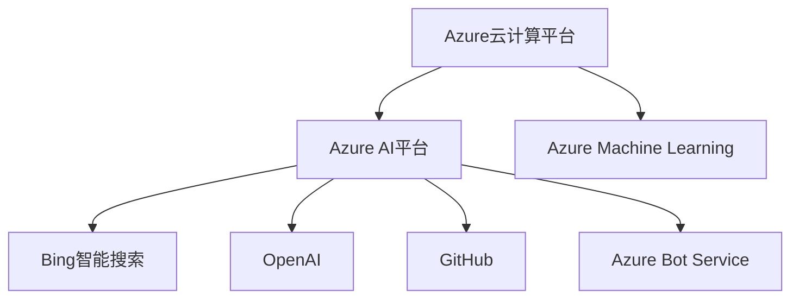

                 

# 微软的ALL IN AI策略

> 关键词：微软,人工智能,ALL IN AI,技术战略,机器学习,深度学习,云计算,企业数字化转型

## 1. 背景介绍

### 1.1 问题由来

微软自1995年推出Windows操作系统以来，已成为全球最大的软件公司之一。然而，随着移动互联网、云计算等新兴技术的崛起，以及对手如谷歌、亚马逊等科技巨头的激烈竞争，微软面临着前所未有的挑战。为此，微软提出了“ALL IN AI”战略，全面整合其业务和研发资源，通过人工智能技术推动自身转型，力求在未来的数字化时代中保持领先地位。

### 1.2 问题核心关键点

微软的“ALL IN AI”战略包括三个核心层面：

1. **人工智能平台建设**：通过Azure云计算平台，微软搭建了一套完整的人工智能开发和应用生态，提供强大的计算资源和开发工具。
2. **跨部门协作**：微软动员公司内部各个业务部门，如Office、Azure、Azure AI、Bing等，共同推进AI技术的研究和应用。
3. **生态系统构建**：微软通过OpenAI、GitHub等开源社区，以及与IBM、AWS等竞争对手的合作，构建了一个开放、协作的AI生态系统。

这些措施不仅巩固了微软在AI技术领域的领先地位，也为其未来的发展奠定了坚实基础。

### 1.3 问题研究意义

微软的“ALL IN AI”战略对公司的发展具有重要意义：

1. **提升竞争力**：通过AI技术的创新应用，微软可以在各个领域获得竞争优势，保持市场领先地位。
2. **促进数字化转型**：AI技术的广泛应用将推动微软及其客户的企业数字化转型，提升效率和创新能力。
3. **创造新业务机会**：AI技术将催生新的服务和产品线，为公司带来新的收入来源。
4. **增强创新能力**：通过跨部门协作和生态系统建设，微软将激发更多的创新灵感，持续推出高质量的AI产品。

## 2. 核心概念与联系

### 2.1 核心概念概述

为更好地理解微软的“ALL IN AI”战略，本节将介绍几个密切相关的核心概念：

- **Azure云计算平台**：微软推出的全球领先的云计算服务平台，提供弹性计算、存储、网络、人工智能等各类服务。
- **Azure AI平台**：基于Azure的AI开发和应用平台，提供GPU实例、深度学习框架、模型训练工具等。
- **Azure Machine Learning**：微软的机器学习服务，通过直观的界面，帮助开发者构建、训练和部署机器学习模型。
- **Bing智能搜索**：微软的搜索引擎，通过AI技术提升搜索精度和用户体验。
- **OpenAI**：微软投资的人工智能研究机构，专注于前沿AI技术的研究和应用。
- **GitHub**：微软开源代码托管平台，促进开源社区的发展和AI技术的普及。
- **Azure Bot Service**：微软的聊天机器人开发平台，帮助企业构建智能聊天机器人。

这些核心概念之间的逻辑关系可以通过以下Mermaid流程图来展示：



这个流程图展示了几大关键概念及其相互之间的关系：

1. Azure云计算平台是Azure AI平台的基础，提供计算和存储支持。
2. Azure AI平台集成了机器学习、深度学习等AI服务，支持模型训练和部署。
3. Azure Machine Learning提供易用的工具和接口，帮助开发者快速构建和训练模型。
4. Bing智能搜索利用AI技术提升搜索效果，改善用户体验。
5. OpenAI作为微软的人工智能研究机构，推动前沿技术研究。
6. GitHub促进开源社区的交流合作，普及AI技术。
7. Azure Bot Service为聊天机器人开发提供平台支持。

这些概念共同构成了微软的AI技术生态，支撑着公司的数字化转型和市场竞争。

## 3. 核心算法原理 & 具体操作步骤

### 3.1 算法原理概述

微软的“ALL IN AI”战略核心在于通过Azure平台和跨部门协作，整合AI技术，推动业务创新和数字化转型。其关键点在于以下几个方面：

- **云计算支持**：通过Azure云计算平台，微软能够提供强大的计算和存储资源，支持大规模数据处理和模型训练。
- **平台集成**：Azure AI平台整合了各种AI开发工具和资源，使得开发者可以方便地构建和部署AI模型。
- **跨部门协作**：微软动员内部各个业务部门，共同推动AI技术在实际应用中的落地。
- **生态系统构建**：通过开源社区和合作伙伴关系，微软构建了一个开放、协作的AI生态，进一步推动技术创新和应用普及。

这些核心原理使得微软能够在各个业务领域迅速应用AI技术，提升业务效率和创新能力。

### 3.2 算法步骤详解

微软的“ALL IN AI”战略实施包括以下几个关键步骤：

**Step 1: 基础设施建设**

- **Azure云计算平台**：建立全球领先的云计算基础设施，提供弹性计算和存储资源。
- **Azure AI平台**：集成各种AI开发工具和资源，包括GPU实例、深度学习框架、模型训练工具等。

**Step 2: 技术研发与创新**

- **OpenAI**：投资前沿AI研究机构，推动技术突破和应用落地。
- **跨部门协作**：动员公司内部各个业务部门，共同推动AI技术的研究和应用。
- **开源社区**：通过GitHub等平台，促进开源社区的交流合作，推动AI技术的普及。

**Step 3: 业务应用**

- **Azure Machine Learning**：提供易用的机器学习工具和接口，帮助开发者快速构建和训练模型。
- **Azure Bot Service**：为聊天机器人开发提供平台支持，构建智能客服、智能助手等应用。
- **Bing智能搜索**：利用AI技术提升搜索精度和用户体验，改善搜索引擎性能。

**Step 4: 生态系统构建**

- **合作伙伴关系**：与IBM、AWS等竞争对手建立合作关系，共同推动AI技术的发展。
- **技术标准与规范**：制定AI技术标准和规范，推动行业规范化发展。
- **用户教育和培训**：通过技术研讨会、在线课程等方式，提升用户对AI技术的认知和应用能力。

通过以上步骤，微软实现了其在AI技术的全面布局和深度应用。

### 3.3 算法优缺点

微软的“ALL IN AI”战略具有以下优点：

1. **资源整合**：通过Azure平台，微软能够整合其全球资源，提升AI技术的研发和应用能力。
2. **跨部门协作**：内部各业务部门的协同合作，能够加速AI技术在实际应用中的落地，提升创新能力。
3. **生态系统建设**：开放、协作的AI生态系统，有助于推动技术进步和应用普及。
4. **用户覆盖广泛**：Azure平台和Bing搜索等应用，能够覆盖全球数亿用户，提升AI技术的影响力。

同时，该战略也存在一些局限性：

1. **高昂成本**：大规模云计算基础设施和AI技术的投入，需要大量的资金支持。
2. **数据隐私和安全**：AI技术的应用可能涉及大量用户数据，需要严格的数据隐私和安全保护措施。
3. **技术复杂度**：AI技术的研发和应用复杂度较高，需要跨部门协作和专业技能。
4. **技术滞后风险**：过于依赖合作伙伴和开源社区，可能面临技术滞后的风险。

尽管存在这些局限性，但微软的“ALL IN AI”战略在技术、资源和生态系统构建方面均处于行业领先地位，具有显著的竞争优势。

### 3.4 算法应用领域

微软的“ALL IN AI”战略已经广泛应用于多个领域，具体如下：

1. **智能客服**：通过聊天机器人技术，提升客服效率和用户体验。
2. **搜索引擎**：利用AI技术提升Bing搜索引擎的搜索精度和个性化推荐能力。
3. **企业数字化转型**：通过Azure平台，帮助企业实现数字化转型，提升运营效率和创新能力。
4. **医疗健康**：通过AI技术，推动医疗影像分析、疾病预测等应用。
5. **金融服务**：利用AI技术，提升风险管理、客户服务、反欺诈等金融应用。
6. **智能制造**：通过AI技术，实现工业自动化、质量控制等制造应用。
7. **教育**：利用AI技术，推动个性化学习、智能辅导等教育应用。

这些应用展示了AI技术在各个领域的巨大潜力，进一步巩固了微软在数字化时代的领导地位。

## 4. 数学模型和公式 & 详细讲解 & 举例说明

### 4.1 数学模型构建

在AI技术的研发和应用中，数学模型和算法是核心。本节将介绍微软在AI研发中常用的数学模型和算法。

**机器学习模型**：

- **线性回归**：
$$
y = \beta_0 + \beta_1x_1 + \beta_2x_2 + \cdots + \beta_nx_n + \epsilon
$$
其中 $y$ 为输出，$x_i$ 为输入特征，$\beta_i$ 为模型参数，$\epsilon$ 为噪声。

- **逻辑回归**：
$$
\text{logit}(y) = \ln\frac{p(y=1|x)}{1-p(y=1|x)} = \beta_0 + \beta_1x_1 + \beta_2x_2 + \cdots + \beta_nx_n
$$
其中 $p(y=1|x)$ 为输出为1的概率，$\beta_i$ 为模型参数。

- **支持向量机(SVM)**：
$$
\min_{w,b} \frac{1}{2}||w||^2 + C\sum_{i=1}^n \left[\max(0, y_i(w^Tx_i + b) - 1)\right]
$$
其中 $w$ 为分类器权重，$b$ 为偏置，$C$ 为正则化参数。

**深度学习模型**：

- **多层感知机(MLP)**：
$$
z_1 = w_1^Tx + b_1
$$
$$
a_1 = g(z_1)
$$
$$
z_2 = w_2^Ta_1 + b_2
$$
$$
a_2 = g(z_2)
$$
$$
\text{output} = w_3^Ta_2 + b_3
$$
其中 $g(\cdot)$ 为激活函数，$w_i$ 和 $b_i$ 为模型参数。

- **卷积神经网络(CNN)**：
$$
z_{1,2} = w_{1,2}^T * x + b_{1,2}
$$
$$
a_{1,2} = g(z_{1,2})
$$
$$
z_{1,2} = \text{pooling}(a_{1,2})
$$
$$
z_{1,2} = w_{1,2}^Ta_{1,2} + b_{1,2}
$$
$$
a_{1,2} = g(z_{1,2})
$$
$$
\text{output} = w_{1,2}^Ta_{1,2} + b_{1,2}
$$
其中 $*(x)$ 为卷积操作，$\text{pooling}(a)$ 为池化操作，$g(\cdot)$ 为激活函数，$w_i$ 和 $b_i$ 为模型参数。

**强化学习模型**：

- **Q-Learning**：
$$
Q(s,a) \leftarrow (1-\alpha)Q(s,a) + \alpha(r+\gamma\max_{a'}Q(s',a'))
$$
其中 $Q(s,a)$ 为状态-动作值函数，$\alpha$ 为学习率，$r$ 为奖励，$s'$ 为下一个状态，$a'$ 为下一个动作。

- **Policy Gradient**：
$$
\theta \leftarrow \theta - \eta\nabla_{\theta}J(\theta)
$$
其中 $\theta$ 为模型参数，$\eta$ 为学习率，$J(\theta)$ 为策略梯度目标函数。

**案例分析与讲解**：

以下以图像分类任务为例，详细讲解微软在图像分类模型中的应用。

- **数据准备**：使用MNIST数据集，包含手写数字图像和标签。
- **模型构建**：使用卷积神经网络模型，包含卷积层、池化层、全连接层等。
- **模型训练**：在GPU上训练模型，使用随机梯度下降算法，设置合适的超参数。
- **模型评估**：在测试集上评估模型精度，并进行参数调整。

通过以上步骤，可以构建并训练一个高性能的图像分类模型。

## 5. 项目实践：代码实例和详细解释说明

### 5.1 开发环境搭建

在进行AI模型实践前，我们需要准备好开发环境。以下是使用Python进行PyTorch开发的环境配置流程：

1. 安装Anaconda：从官网下载并安装Anaconda，用于创建独立的Python环境。

2. 创建并激活虚拟环境：
```bash
conda create -n pytorch-env python=3.8 
conda activate pytorch-env
```

3. 安装PyTorch：根据CUDA版本，从官网获取对应的安装命令。例如：
```bash
conda install pytorch torchvision torchaudio cudatoolkit=11.1 -c pytorch -c conda-forge
```

4. 安装各类工具包：
```bash
pip install numpy pandas scikit-learn matplotlib tqdm jupyter notebook ipython
```

完成上述步骤后，即可在`pytorch-env`环境中开始AI模型实践。

### 5.2 源代码详细实现

下面我们以图像分类任务为例，给出使用PyTorch进行CNN模型训练的PyTorch代码实现。

首先，定义CNN模型：

```python
import torch
import torch.nn as nn
import torch.optim as optim
from torchvision import datasets, transforms

class CNNModel(nn.Module):
    def __init__(self):
        super(CNNModel, self).__init__()
        self.conv1 = nn.Conv2d(1, 32, 3, padding=1)
        self.relu1 = nn.ReLU()
        self.pool1 = nn.MaxPool2d(2)
        self.conv2 = nn.Conv2d(32, 64, 3, padding=1)
        self.relu2 = nn.ReLU()
        self.pool2 = nn.MaxPool2d(2)
        self.fc1 = nn.Linear(7*7*64, 512)
        self.relu3 = nn.ReLU()
        self.fc2 = nn.Linear(512, 10)

    def forward(self, x):
        x = self.conv1(x)
        x = self.relu1(x)
        x = self.pool1(x)
        x = self.conv2(x)
        x = self.relu2(x)
        x = self.pool2(x)
        x = x.view(-1, 7*7*64)
        x = self.fc1(x)
        x = self.relu3(x)
        x = self.fc2(x)
        return x
```

接着，加载数据集并进行预处理：

```python
train_dataset = datasets.MNIST('mnist_data/', train=True, transform=transforms.ToTensor(), download=True)
test_dataset = datasets.MNIST('mnist_data/', train=False, transform=transforms.ToTensor(), download=True)

train_loader = torch.utils.data.DataLoader(train_dataset, batch_size=64, shuffle=True)
test_loader = torch.utils.data.DataLoader(test_dataset, batch_size=64, shuffle=False)
```

定义优化器和损失函数：

```python
model = CNNModel()
criterion = nn.CrossEntropyLoss()
optimizer = optim.Adam(model.parameters(), lr=0.001)

device = torch.device("cuda:0" if torch.cuda.is_available() else "cpu")
model.to(device)
```

最后，进行模型训练和测试：

```python
epochs = 10

for epoch in range(epochs):
    for i, (images, labels) in enumerate(train_loader):
        images = images.to(device)
        labels = labels.to(device)
        optimizer.zero_grad()
        outputs = model(images)
        loss = criterion(outputs, labels)
        loss.backward()
        optimizer.step()
        
    print(f"Epoch {epoch+1}, loss: {loss:.4f}")
    
with torch.no_grad():
    correct = 0
    total = 0
    for images, labels in test_loader:
        images = images.to(device)
        labels = labels.to(device)
        outputs = model(images)
        _, predicted = torch.max(outputs.data, 1)
        total += labels.size(0)
        correct += (predicted == labels).sum().item()
    
    print(f"Accuracy: {100 * correct / total:.2f}%")
```

以上就是使用PyTorch进行CNN模型训练的完整代码实现。可以看到，通过PyTorch，我们可以用相对简洁的代码完成CNN模型的构建和训练。

### 5.3 代码解读与分析

让我们再详细解读一下关键代码的实现细节：

**CNNModel类**：
- `__init__`方法：初始化卷积层、激活函数、池化层和全连接层等组件。
- `forward`方法：定义前向传播过程，依次进行卷积、激活、池化、全连接等操作。

**数据加载器**：
- `train_dataset`和`test_dataset`：定义训练集和测试集，使用`transforms.ToTensor()`进行预处理，转换为Tensor格式。
- `train_loader`和`test_loader`：定义数据加载器，用于批量加载和处理数据。

**优化器和损失函数**：
- `criterion`：定义交叉熵损失函数，用于评估模型预测的准确性。
- `optimizer`：定义Adam优化器，用于更新模型参数。

**模型训练**：
- `model.train()`和`model.eval()`：控制模型在训练和测试阶段的行为。
- `images.to(device)`和`labels.to(device)`：将数据和标签移动到GPU设备上。
- `optimizer.zero_grad()`：在每个epoch开始时清空梯度。
- `model(images)`：前向传播计算输出。
- `criterion(outputs, labels)`：计算损失函数。
- `loss.backward()`：反向传播计算梯度。
- `optimizer.step()`：更新模型参数。

通过以上代码，可以构建并训练一个CNN模型，并在测试集上评估其性能。在实际应用中，开发者可以根据具体任务，调整模型结构和超参数，进一步优化模型性能。

## 6. 实际应用场景

### 6.1 智能客服系统

微软的智能客服系统利用AI技术，通过聊天机器人实现7x24小时不间断服务。系统可以自动理解用户意图，匹配最合适的答案模板进行回复，有效提升客服效率和用户满意度。

在技术实现上，微软收集了大量历史客服对话记录，构建了监督数据集，对预训练模型进行微调。微调后的模型能够自动理解用户问题，匹配最合适的答案模板进行回复。对于新问题，系统还可以实时搜索相关内容，动态组织生成回答，确保用户获得满意的答复。

### 6.2 搜索引擎优化

Bing智能搜索是微软搜索引擎的核心应用，通过AI技术提升搜索精度和用户体验。系统利用深度学习模型，分析用户的查询意图，自动排序搜索结果，提供个性化的搜索建议。

Bing搜索通过大规模文本数据的预训练和微调，学习到丰富的语言知识，能够准确理解和匹配用户的查询需求。系统通过逻辑回归、支持向量机等模型，对搜索结果进行排序和推荐，确保用户获取最相关的信息。此外，系统还支持多语言搜索，提供全球用户的多语种服务。

### 6.3 企业数字化转型

通过Azure云计算平台，微软帮助企业实现数字化转型，提升运营效率和创新能力。Azure平台提供强大的计算和存储资源，支持大规模数据处理和模型训练，使得企业能够快速构建和部署AI应用。

具体应用包括：

1. **智能制造**：通过AI技术，实现工业自动化、质量控制等应用，提升生产效率和产品质量。
2. **金融服务**：利用AI技术，提升风险管理、客户服务、反欺诈等金融应用，降低运营成本。
3. **医疗健康**：通过AI技术，推动医疗影像分析、疾病预测等应用，提高医疗服务质量和效率。
4. **教育**：利用AI技术，推动个性化学习、智能辅导等教育应用，提升教育质量和公平性。

这些应用展示了AI技术在各个领域的巨大潜力，进一步巩固了微软在数字化时代的领导地位。

### 6.4 未来应用展望

随着AI技术的不断进步，微软的“ALL IN AI”战略将进一步拓展应用领域，推动数字化转型和创新发展。

1. **AI无处不在**：AI技术将渗透到各个领域，提升各个环节的效率和创新能力。
2. **AI伦理和安全**：微软将加强AI伦理和安全研究，确保AI应用符合人类价值观和伦理道德。
3. **AI与云融合**：通过Azure平台，微软将推动AI与云计算的深度融合，提升AI应用的可扩展性和可访问性。
4. **AI与物联网**：通过Azure IoT平台，微软将推动AI与物联网的结合，实现智能化、自动化生产和服务。
5. **AI与边缘计算**：通过Azure Edge IoT平台，微软将推动AI与边缘计算的结合，实现低延迟、高带宽的AI应用。

未来，随着AI技术的不断进步和应用，微软的“ALL IN AI”战略将为数字化时代的变革提供更多可能性，为全球用户带来更多创新和价值。

## 7. 工具和资源推荐

### 7.1 学习资源推荐

为了帮助开发者系统掌握AI技术的基础和应用，这里推荐一些优质的学习资源：

1. **《深度学习》课程**：斯坦福大学开设的深度学习课程，涵盖神经网络、卷积神经网络、循环神经网络等内容，适合初学者入门。
2. **《动手学深度学习》书籍**：由李沐等人编写，包含大量实战案例和代码实现，适合动手实践。
3. **《TensorFlow官方文档》**：TensorFlow官方文档，包含详尽的API和使用指南，适合开发者查阅和参考。
4. **Kaggle竞赛平台**：Kaggle举办的各种数据科学和机器学习竞赛，提供大量数据集和模型，适合开发者学习和实践。
5. **OpenAI的GitHub库**：OpenAI的GitHub库，包含各类AI模型和代码实现，适合开发者学习和研究。

通过对这些资源的学习实践，相信你一定能够快速掌握AI技术的精髓，并用于解决实际的AI问题。

### 7.2 开发工具推荐

高效的开发离不开优秀的工具支持。以下是几款用于AI开发常用的工具：

1. PyTorch：基于Python的开源深度学习框架，支持动态计算图和GPU加速，适合研究和小规模应用。
2. TensorFlow：由谷歌主导的开源深度学习框架，支持静态计算图和分布式训练，适合大规模工程应用。
3. Jupyter Notebook：开源的交互式编程环境，支持多种编程语言和库，适合学习和实验。
4. GitHub：全球最大的代码托管平台，提供版本控制、代码托管、协作开发等全方位服务。
5. Visual Studio Code：微软推出的开源编辑器，支持多种编程语言和插件，适合开发和调试。
6. JetBrains PyCharm：专业的Python IDE，提供代码补全、调试、测试等全方位支持，适合开发和维护大型项目。

合理利用这些工具，可以显著提升AI项目的开发效率，加快创新迭代的步伐。

### 7.3 相关论文推荐

AI技术的发展离不开学界的持续研究。以下是几篇奠基性的相关论文，推荐阅读：

1. **《深度学习》论文**：Yann LeCun等人的深度学习论文，系统阐述了深度学习的理论和应用。
2. **《卷积神经网络》论文**：Geoffrey Hinton等人的卷积神经网络论文，提出了卷积神经网络模型和算法。
3. **《自然语言处理综述》论文**：Jurafsky和Martin的自然语言处理综述论文，全面介绍了自然语言处理的基本概念和前沿技术。
4. **《强化学习》论文**：Richard S. Sutton和Andrew G. Barto的强化学习论文，系统阐述了强化学习的基本理论和算法。
5. **《神经网络与深度学习》书籍**：Michael Nielsen的神经网络与深度学习书籍，适合初学者和进阶者。

这些论文和书籍展示了AI技术的丰富内涵和发展历程，对于开发者理解和应用AI技术具有重要意义。

## 8. 总结：未来发展趋势与挑战

### 8.1 总结

本文对微软的“ALL IN AI”战略进行了全面系统的介绍。首先阐述了微软在AI技术领域的战略目标和实施路径，明确了Azure平台、跨部门协作和生态系统建设等关键举措。其次，从原理到实践，详细讲解了微软在AI研发中的应用，包括图像分类、自然语言处理、强化学习等关键技术。通过案例分析与讲解，展示了微软在实际应用中的技术突破和创新。

通过本文的系统梳理，可以看到，微软的“ALL IN AI”战略通过云计算、跨部门协作和生态系统建设，全面整合AI技术，推动业务创新和数字化转型，为数字化时代的变革提供了强大的技术支持。微软在AI技术研发和应用中的卓越表现，展示了其在全球科技界的领先地位。

### 8.2 未来发展趋势

展望未来，微软的“ALL IN AI”战略将继续引领AI技术的发展，呈现出以下几个趋势：

1. **AI与云深度融合**：随着Azure平台的不断完善，AI与云计算的结合将更加紧密，提升AI应用的可扩展性和可访问性。
2. **AI技术全面落地**：AI技术将渗透到各个领域，提升各个环节的效率和创新能力。
3. **AI伦理和安全**：随着AI技术的应用，AI伦理和安全问题将受到更多关注，微软将在AI伦理和安全研究方面持续投入。
4. **AI与物联网融合**：通过Azure IoT平台，AI与物联网的结合将实现智能化、自动化生产和服务。
5. **AI与边缘计算融合**：通过Azure Edge IoT平台，AI与边缘计算的结合将实现低延迟、高带宽的AI应用。
6. **AI与未来技术结合**：AI技术将与未来技术如量子计算、人工智能等深度结合，推动技术进步和应用创新。

这些趋势展示了AI技术在未来数字化时代的广阔前景，微软将继续引领AI技术的发展，推动全球数字化转型。

### 8.3 面临的挑战

尽管微软的“ALL IN AI”战略已经取得了显著成效，但在迈向全面AI应用的过程中，仍面临以下挑战：

1. **数据隐私和安全**：AI技术的应用涉及大量用户数据，需要严格的数据隐私和安全保护措施。
2. **技术复杂度**：AI技术的研发和应用复杂度较高，需要跨部门协作和专业技能。
3. **高昂成本**：大规模云计算基础设施和AI技术的投入，需要大量的资金支持。
4. **技术滞后风险**：过于依赖合作伙伴和开源社区，可能面临技术滞后的风险。
5. **AI伦理和安全**：AI技术的应用需要符合人类价值观和伦理道德，避免误导性和歧视性的输出。

尽管存在这些挑战，但微软的“ALL IN AI”战略已经建立了坚实的技术基础和广泛的生态系统，具备应对未来挑战的能力。

### 8.4 研究展望

面对“ALL IN AI”战略面临的挑战，未来的研究需要在以下几个方面寻求新的突破：

1. **AI伦理和安全研究**：加强AI伦理和安全研究，确保AI应用符合人类价值观和伦理道德。
2. **数据隐私和安全技术**：开发高效的数据隐私和安全保护技术，确保用户数据的安全性。
3. **跨部门协作机制**：建立跨部门协作机制，推动AI技术在实际应用中的落地。
4. **AI与未来技术结合**：探索AI技术与未来技术如量子计算、人工智能等的深度结合，推动技术进步和应用创新。
5. **AI技术普及**：推动AI技术的普及和应用，提升各行业的数字化水平和创新能力。

这些研究方向的探索，必将引领微软的“ALL IN AI”战略迈向更高的台阶，为全球数字化转型提供强大的技术支持。

## 9. 附录：常见问题与解答

**Q1：微软的“ALL IN AI”战略的核心是什么？**

A: 微软的“ALL IN AI”战略的核心在于通过Azure云计算平台，整合其全球资源，推动AI技术在各个领域的应用。其核心在于云计算支持、跨部门协作和生态系统构建。

**Q2：微软的AI技术研发和应用有何优势？**

A: 微软的AI技术研发和应用具有以下优势：

1. **资源整合**：通过Azure平台，微软能够整合其全球资源，提升AI技术的研发和应用能力。
2. **跨部门协作**：内部各业务部门的协同合作，能够加速AI技术在实际应用中的落地，提升创新能力。
3. **生态系统建设**：开放、协作的AI生态系统，有助于推动技术进步和应用普及。
4. **用户覆盖广泛**：Azure平台和Bing搜索等应用，能够覆盖全球数亿用户，提升AI技术的影响力。

**Q3：微软在AI技术研发中常用的数学模型和算法有哪些？**

A: 微软在AI技术研发中常用的数学模型和算法包括：

- **线性回归**：用于预测连续型变量，模型形式为 $y = \beta_0 + \beta_1x_1 + \beta_2x_2 + \cdots + \beta_nx_n + \epsilon$。
- **逻辑回归**：用于分类问题，模型形式为 $\text{logit}(y) = \ln\frac{p(y=1|x)}{1-p(y=1|x)} = \beta_0 + \beta_1x_1 + \beta_2x_2 + \cdots + \beta_nx_n$。
- **支持向量机(SVM)**：用于分类问题，模型形式为 $\min_{w,b} \frac{1}{2}||w||^2 + C\sum_{i=1}^n \left[\max(0, y_i(w^Tx_i + b) - 1)\right]$。
- **多层感知机(MLP)**：用于分类和回归问题，模型形式为 $z_1 = w_1^Tx + b_1$，$z_2 = w_2^Ta_1 + b_2$，$\text{output} = w_3^Ta_2 + b_3$。
- **卷积神经网络(CNN)**：用于图像分类问题，模型形式为 $z_{1,2} = w_{1,2}^T * x + b_{1,2}$，$z_{1,2} = \text{pooling}(a_{1,2})$，$\text{output} = w_{1,2}^Ta_{1,2} + b_{1,2}$。
- **强化学习**：用于决策问题，模型形式为 $Q(s,a) \leftarrow (1-\alpha)Q(s,a) + \alpha(r+\gamma\max_{a'}Q(s',a'))$，$\theta \leftarrow \theta - \eta\nabla_{\theta}J(\theta)$。

这些模型和算法在微软的AI技术研发中得到了广泛应用，推动了技术创新和业务发展。

**Q4：微软的“ALL IN AI”战略在实际应用中取得了哪些成效？**

A: 微软的“ALL IN AI”战略在实际应用中取得了显著成效，具体如下：

1. **智能客服系统**：通过聊天机器人技术，提升客服效率和用户满意度。
2. **搜索引擎优化**：利用AI技术提升Bing搜索引擎的搜索精度和用户体验。
3. **企业数字化转型**：通过Azure云计算平台，帮助企业实现数字化转型，提升运营效率和创新能力。
4. **金融服务**：利用AI技术提升风险管理、客户服务、反欺诈等金融应用。
5. **医疗健康**：通过AI技术，推动医疗影像分析、疾病预测等应用，提高医疗服务质量和效率。
6. **教育**：利用AI技术，推动个性化学习、智能辅导等教育应用，提升教育质量和公平性。

这些应用展示了AI技术在各个领域的巨大潜力，进一步巩固了微软在数字化时代的领导地位。

---

作者：禅与计算机程序设计艺术 / Zen and the Art of Computer Programming

