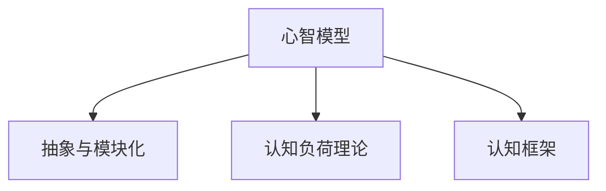

                 

# 心智模型：简化复杂世界的思维工具

## 1. 背景介绍

### 1.1 问题由来

在当今这个信息爆炸、知识繁杂的时代，如何有效管理和理解复杂的世界，成为了人们面临的重大挑战。在计算机科学和人工智能领域，这一问题尤为突出。过去几十年里，我们已经见证了各种复杂算法和模型的提出，但它们往往难以理解、调试和应用。

### 1.2 问题核心关键点

为了应对这一挑战，心智模型（Mental Model）被提出。心智模型是一种简化复杂概念、过程和系统的心理表征方式，它使我们能够更好地理解和应用复杂的系统。在计算机科学中，心智模型特别适用于复杂算法、系统架构和数据结构的理解和设计。

心智模型通常具有以下特点：
- **抽象化**：通过去除无关细节，专注于核心元素和关键属性。
- **模块化**：将复杂系统分解为可管理、可理解的部分。
- **结构化**：通过层次化或网络化组织信息，便于理解和推理。
- **动态性**：能够灵活调整，适应新情况和变化。

心智模型在人工智能和软件工程中的应用非常广泛，它不仅帮助我们更好地理解复杂的系统，还能指导我们设计出更加健壮、可维护的代码。

### 1.3 问题研究意义

心智模型研究的意义在于：
- **简化复杂性**：通过抽象和模块化，心智模型帮助开发者和用户理解复杂系统，减少认知负担。
- **提高效率**：心智模型使系统设计和调试更加高效，减少试错成本。
- **促进创新**：心智模型提供了一个框架，使得在复杂系统中进行创新变得更加容易。
- **增强可维护性**：心智模型有助于构建更可维护的代码和系统，降低维护成本。

## 2. 核心概念与联系

### 2.1 核心概念概述

心智模型研究涉及多个关键概念：

- **心智模型**：指人们用于理解、推理和决策的心理表征。在计算机科学中，心智模型通常指简化复杂系统的心理表征。
- **认知负荷理论**：认为人类认知资源有限，心智模型可以帮助减少认知负荷，提高信息处理效率。
- **抽象与模块化**：心智模型通过抽象和模块化，将复杂系统简化为可理解的部分。
- **认知框架**：心智模型作为认知框架，指导我们理解和推理复杂系统。

这些概念之间的逻辑关系可以通过以下Mermaid流程图来展示：



## 3. 核心算法原理 & 具体操作步骤

### 3.1 算法原理概述

心智模型在计算机科学中的应用，主要基于以下原理：
- **抽象与模块化**：将复杂系统分解为抽象的模块，每个模块只关注其功能和接口。
- **认知框架**：通过构建心智模型，提供一个结构化的框架，帮助理解和推理复杂系统。

### 3.2 算法步骤详解

构建心智模型的主要步骤包括：
1. **识别关键组件**：识别系统中最重要的组件和接口。
2. **建立模块间关系**：理解不同组件之间的关系和依赖。
3. **定义操作和变化**：明确组件的操作和状态变化。
4. **抽象和简化**：通过抽象和简化，去除无关细节，聚焦核心元素。
5. **构建心智模型**：将上述信息整合成一个或多个心智模型。

### 3.3 算法优缺点

心智模型的优点包括：
- **简化复杂性**：通过抽象和模块化，减少认知负荷。
- **提高效率**：帮助更好地理解和调试复杂系统。
- **促进创新**：提供一个结构化的框架，指导创新。

缺点包括：
- **可能过度简化**：过度简化可能导致信息的丢失，影响理解准确性。
- **可能存在偏见**：心智模型可能基于有限的个人经验，存在主观偏差。

### 3.4 算法应用领域

心智模型广泛应用于软件开发、系统设计、数据结构、算法设计等多个领域。具体应用包括：
- **软件架构设计**：通过心智模型设计可扩展、可维护的软件架构。
- **算法实现**：通过心智模型理解算法的工作原理，指导代码实现。
- **系统调试与优化**：通过心智模型定位问题，优化系统性能。

## 4. 数学模型和公式 & 详细讲解

### 4.1 数学模型构建

心智模型通常基于以下数学模型构建：
- **有限状态机**：用于描述系统的状态和状态变化。
- **决策树**：用于表示决策流程和分支。
- **图模型**：用于表示组件间的关系和依赖。

### 4.2 公式推导过程

以有限状态机为例，设系统有 $n$ 个状态，$m$ 个转移规则。状态转移矩阵为 $A$，转移概率矩阵为 $P$。状态 $i$ 到状态 $j$ 的转移概率为 $P_{ij}$，则状态转移过程可以用以下公式描述：

$$
A = \begin{bmatrix}
    a_{11} & a_{12} & \ldots & a_{1n} \\
    a_{21} & a_{22} & \ldots & a_{2n} \\
    \vdots & \vdots & \ddots & \vdots \\
    a_{n1} & a_{n2} & \ldots & a_{nn}
\end{bmatrix}, P = \begin{bmatrix}
    p_{11} & p_{12} & \ldots & p_{1n} \\
    p_{21} & p_{22} & \ldots & p_{2n} \\
    \vdots & \vdots & \ddots & \vdots \\
    p_{n1} & p_{n2} & \ldots & p_{nn}
\end{bmatrix}
$$

其中 $a_{ij}$ 表示状态 $i$ 到状态 $j$ 的转移条件，$p_{ij}$ 表示转移概率。

### 4.3 案例分析与讲解

以RESTful API设计为例，我们可以使用心智模型来简化和理解API的设计和实现。API的核心组件包括资源、动作和表示，其中资源是核心，动作和表示提供接口和数据格式。API的设计和实现可以通过以下心智模型来描述：

- **资源**：表示API的核心资源，如用户、文章等。
- **动作**：描述对资源的操作，如创建、读取、更新、删除等。
- **表示**：定义API的响应格式，如JSON、XML等。

该心智模型可以帮助开发者更好地理解和设计API，提高系统的可维护性和可扩展性。

## 5. 项目实践：代码实例和详细解释说明

### 5.1 开发环境搭建

心智模型研究通常不需要特定的开发环境，但使用Python等编程语言，结合可视化工具如UML，可以更好地展示和理解心智模型。

### 5.2 源代码详细实现

心智模型的实现通常依赖于软件工具，如UML建模工具、代码生成工具等。以下是使用Python和UML工具进行心智模型建模的示例代码：

```python
from uml import UMLDiagram

# 创建心智模型
uml = UMLDiagram()

# 添加组件
resource = uml.add_component('Resource', '资源')
action = uml.add_component('Action', '动作')
representation = uml.add_component('Representation', '表示')

# 添加关系
uml.add_relationship(resource, action, '创建')
uml.add_relationship(resource, action, '读取')
uml.add_relationship(resource, action, '更新')
uml.add_relationship(resource, action, '删除')
uml.add_relationship(action, representation, 'JSON')
uml.add_relationship(action, representation, 'XML')

# 显示心智模型
uml.show()
```

### 5.3 代码解读与分析

上述代码使用了UML建模工具，通过创建资源、动作和表示的组件，以及它们之间的关系，构建了一个简单的RESTful API心智模型。该模型简洁明了，易于理解和扩展。

## 6. 实际应用场景

### 6.1 软件架构设计

心智模型在软件架构设计中的应用非常广泛。通过心智模型，可以更好地理解复杂系统的组件和接口，设计出可扩展、可维护的软件架构。例如，云计算系统可以采用如下心智模型来设计：

- **计算资源**：CPU、内存等计算资源。
- **存储资源**：磁盘、SSD等存储资源。
- **网络资源**：网络带宽、连接数等网络资源。
- **调度器**：负责资源调度和任务分配。
- **监控器**：监控系统性能和资源使用情况。

通过这样的心智模型，可以清晰地理解云计算系统的各个组件及其相互作用，设计出高效、可靠的系统架构。

### 6.2 算法实现

心智模型在算法实现中的应用也很常见。以排序算法为例，可以采用如下心智模型来理解算法的设计和实现：

- **输入数据**：待排序的数组或列表。
- **排序过程**：比较、交换等基本操作。
- **输出数据**：排序后的数组或列表。

通过这样的心智模型，可以更好地理解排序算法的核心步骤和操作，指导代码实现。

### 6.3 系统调试与优化

心智模型在系统调试与优化中的应用也非常重要。例如，在高性能计算系统中，可以通过心智模型理解系统的各个组件及其相互作用，识别性能瓶颈，优化系统性能。以下是一个基于心智模型的系统调试示例：

- **组件**：CPU、GPU、内存、存储。
- **数据流**：输入数据、中间数据、输出数据。
- **通信方式**：并行计算、数据传输、同步机制。

通过这样的心智模型，可以清晰地理解系统的各个组件及其相互作用，识别性能瓶颈，优化系统性能。

### 6.4 未来应用展望

未来，心智模型在计算机科学中的应用将更加广泛。心智模型不仅能帮助我们更好地理解和设计复杂系统，还能促进跨领域、跨学科的知识共享和协作。随着人工智能和大数据技术的发展，心智模型将在更多领域得到应用，成为理解和设计复杂系统的重要工具。

## 7. 工具和资源推荐

### 7.1 学习资源推荐

为了帮助开发者和用户系统掌握心智模型的理论和实践，这里推荐一些优质的学习资源：

1. **《认知心理学与心智模型》**：介绍心智模型在认知心理学中的应用，帮助理解心智模型的原理和应用。
2. **《软件架构与心智模型》**：介绍心智模型在软件架构设计中的应用，帮助设计可扩展、可维护的软件架构。
3. **《算法设计与心智模型》**：介绍心智模型在算法设计中的应用，帮助理解和实现复杂算法。
4. **《心智模型工具和实践》**：介绍心智模型在设计和实现复杂系统中的应用，提供具体工具和实践指南。

### 7.2 开发工具推荐

心智模型的实现和应用通常依赖于多种工具和平台。以下是一些常用的工具和平台：

1. **UML建模工具**：如Lucidchart、Modelio、PlantUML等，帮助创建和展示心智模型。
2. **代码生成工具**：如Swagger Codegen、OpenAPI Generator等，帮助自动生成API文档和代码。
3. **项目管理工具**：如JIRA、Trello等，帮助跟踪和管理心智模型的设计和实现。

### 7.3 相关论文推荐

心智模型研究涉及多个领域，以下是一些具有代表性的相关论文：

1. **《心智模型在软件设计中的应用》**：探讨心智模型在软件设计中的应用，提出心智模型设计的基本原则和实践指南。
2. **《基于心智模型的算法设计和优化》**：探讨心智模型在算法设计和优化中的应用，提出心智模型指导算法设计的方法。
3. **《心智模型在复杂系统设计中的应用》**：探讨心智模型在复杂系统设计中的应用，提出心智模型指导系统设计的框架和方法。

## 8. 总结：未来发展趋势与挑战

### 8.1 总结

心智模型在计算机科学中的应用已经取得了显著进展。通过心智模型，我们能够更好地理解和设计复杂系统，提高系统性能和可维护性。心智模型不仅在软件开发、系统设计、算法实现等领域得到了广泛应用，还在教育和研究中发挥了重要作用。

### 8.2 未来发展趋势

未来心智模型研究将呈现以下几个发展趋势：
1. **跨学科融合**：心智模型将与更多学科和领域融合，如心理学、认知科学、人工智能等。
2. **自动化和智能化**：通过人工智能和机器学习技术，自动生成和优化心智模型。
3. **多模态融合**：心智模型将融合多模态数据，提升系统的感知和理解能力。
4. **增强可解释性**：心智模型将结合解释性技术，提高系统的可解释性和可理解性。

### 8.3 面临的挑战

尽管心智模型在计算机科学中得到了广泛应用，但仍然面临以下挑战：
1. **复杂性增加**：随着系统的复杂性增加，心智模型的构建和理解难度也随之增加。
2. **适应性不足**：心智模型可能无法适应快速变化的系统需求。
3. **主观偏见**：心智模型的构建可能受到个人主观偏见的影响，影响其准确性和可靠性。

### 8.4 研究展望

未来心智模型研究需要在以下几个方面寻求新的突破：
1. **自动化心智模型构建**：通过自动化和智能化技术，自动构建和优化心智模型。
2. **多模态心智模型**：结合多模态数据，构建更全面、更复杂的心智模型。
3. **动态心智模型**：结合实时数据和反馈，构建动态调整的心智模型。
4. **可解释性心智模型**：结合解释性技术，提升心智模型的可解释性和可理解性。

## 9. 附录：常见问题与解答

**Q1：心智模型与抽象概念有何区别？**

A: 心智模型是一种心理表征方式，用于简化和理解复杂系统，而抽象概念是理论上的概括和总结，用于描述事物的本质特征。心智模型通常结合具体应用场景，更注重可理解和可操作性，而抽象概念则更注重理论上的严谨性和普遍性。

**Q2：心智模型在软件开发中的应用有哪些？**

A: 心智模型在软件开发中的应用包括：
1. **需求分析**：通过心智模型理解用户需求和系统功能。
2. **系统设计**：通过心智模型设计可扩展、可维护的系统架构。
3. **代码实现**：通过心智模型指导代码实现和测试。
4. **维护与升级**：通过心智模型理解和优化系统维护和升级。

**Q3：如何构建一个高效的心智模型？**

A: 构建高效心智模型的关键在于：
1. **充分理解系统**：深入理解系统的各个组件及其相互作用。
2. **简化复杂性**：去除无关细节，聚焦核心元素和关键属性。
3. **模块化设计**：将复杂系统分解为可管理、可理解的部分。
4. **结构化组织**：通过层次化或网络化组织信息，便于理解和推理。

**Q4：心智模型在实际应用中需要注意哪些问题？**

A: 心智模型在实际应用中需要注意以下问题：
1. **避免过度简化**：心智模型应充分考虑系统的复杂性，避免过度简化导致信息丢失。
2. **结合实践经验**：心智模型应结合实践经验，避免主观偏见。
3. **定期更新**：随着系统的变化，心智模型需要定期更新和调整。
4. **结合自动化技术**：结合自动化和智能化技术，提高心智模型的构建和优化效率。

---

作者：禅与计算机程序设计艺术 / Zen and the Art of Computer Programming

