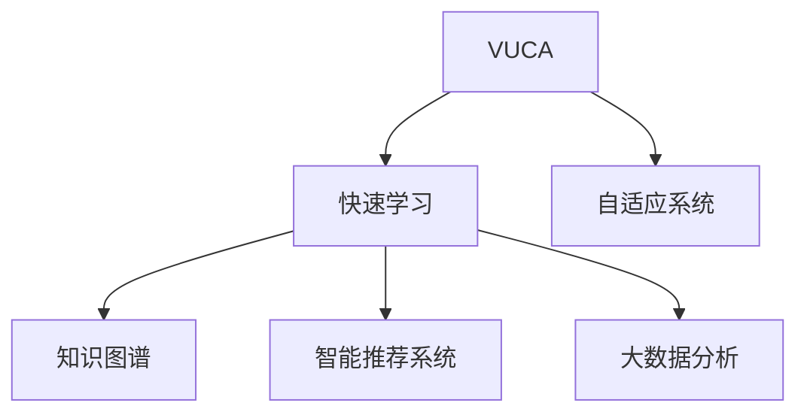

                 

# 快速学习:应对VUCA的制胜法宝

> 关键词：快速学习, 适应性, 灵活性, 自适应, 知识图谱, 智能推荐系统, 大数据分析

## 1. 背景介绍

### 1.1 问题由来
在快速变化的市场环境中，企业面临着不确定性(Volatility)、复杂性(Complexity)、竞争性(Competition)、以及不连续性(Change)。如何在这四股力量的驱动下，快速响应环境变化，保持敏捷性和竞争力，成为当下企业关注的焦点。技术领域的变革，特别是人工智能(AI)和机器学习(ML)的迅猛发展，为企业提供了强有力的工具。

### 1.2 问题核心关键点
快速学习旨在构建自适应、灵活性强的智能系统，帮助企业在VUCA环境下做出快速、准确决策。它涉及到数据挖掘、模型训练、推理应用等多个环节，涵盖了从海量数据处理到知识驱动的复杂系统构建。

### 1.3 问题研究意义
快速学习技术的应用，不仅能够帮助企业降低运营成本，提升决策效率，还能够挖掘数据背后的潜在价值，驱动业务创新，实现智能增长。此外，快速学习技术在面对突发事件、市场波动时，能快速调整策略，增强企业的应变能力。

## 2. 核心概念与联系

### 2.1 核心概念概述

为了更好地理解快速学习技术，本节将介绍几个关键概念及其相互关系：

- **VUCA**: 指的是一个复杂、快速变化的环境，包含不确定性(Volatility)、复杂性(Complexity)、竞争性(Competition)和不确定性(Change)。
- **快速学习**: 指通过自动化学习和自适应机制，使系统能够在不断变化的环境中快速更新知识和策略，以应对新的挑战和需求。
- **自适应系统**: 能够根据环境变化自动调整自身行为的系统，通过学习不断优化策略，适应新场景和新任务。
- **知识图谱**: 一种结构化的知识表示方法，用于描述实体、关系及其属性。知识图谱结合自然语言处理(NLP)和语义理解，能够提供更深层次的语义信息。
- **智能推荐系统**: 利用机器学习算法，对用户行为进行建模，从而预测用户兴趣，并推荐相应内容或产品。
- **大数据分析**: 通过处理大规模数据集，发现隐藏在数据中的规律和趋势，为决策提供支持。

这些概念通过数据、算法和应用三方面连接起来，构建了一个快速学习系统的完整框架：



这些核心概念通过数据的采集、处理和分析，结合自适应算法和系统架构，共同支撑起快速学习的全链路技术栈。

## 3. 核心算法原理 & 具体操作步骤
### 3.1 算法原理概述

快速学习的核心思想是通过自动化学习和自适应机制，使系统能够在不断变化的环境中快速更新知识和策略，以应对新的挑战和需求。其核心算法包括但不限于以下几种：

- **自适应学习算法**: 基于强化学习、迁移学习和元学习等方法，使系统能够根据新数据和新任务，自动更新模型参数，优化决策策略。
- **知识图谱构建算法**: 通过实体识别、关系抽取和属性填充等步骤，构建结构化的知识表示，支持语义理解和推理。
- **智能推荐算法**: 利用协同过滤、内容推荐、混合推荐等算法，对用户行为进行建模，推荐内容或产品。
- **大数据分析算法**: 包括聚类分析、分类分析、关联分析等，从大规模数据中挖掘有价值的信息和模式。

### 3.2 算法步骤详解

快速学习的具体步骤主要包括数据采集、模型训练、推理应用和反馈优化四个环节：

**Step 1: 数据采集**
- 采集VUCA环境中的多源数据，如用户行为数据、市场动态数据、社交媒体数据等。
- 数据清洗和预处理，去除噪音和异常值，确保数据质量。

**Step 2: 模型训练**
- 选择合适的算法框架和模型，如TensorFlow、PyTorch等。
- 构建数据管道，处理和转化数据，送入模型进行训练。
- 使用自适应学习算法进行模型训练，如AdaGrad、Adam等。

**Step 3: 推理应用**
- 将训练好的模型部署到生产环境，进行推理应用。
- 根据推理结果，进行决策和执行，如推荐商品、调整策略等。

**Step 4: 反馈优化**
- 收集应用效果反馈数据，进行效果评估。
- 根据反馈数据，优化模型参数，调整算法策略。
- 重复进行模型训练和推理应用，实现系统持续改进。

### 3.3 算法优缺点

快速学习技术具有以下优点：
1. 能够快速适应环境变化，提升系统灵活性。
2. 通过自动化学习和自适应机制，减少人工干预，提高效率。
3. 支持多源数据融合，从多个维度获取信息，提高决策的全面性和准确性。
4. 能够动态优化算法策略，适应复杂变化，实现智能增长。

但快速学习技术也存在一定的局限性：
1. 对数据质量和量的依赖较大，数据采集和处理成本较高。
2. 模型复杂度较高，需要较强大的计算资源支持。
3. 系统架构复杂，需要专业知识进行设计和维护。
4. 结果解释性不足，难以对模型决策进行深度解释。

尽管存在这些局限性，但快速学习技术在应对VUCA环境方面，具有独特优势，已逐渐成为企业智能化转型的重要工具。

### 3.4 算法应用领域

快速学习技术在多个领域都有广泛应用，例如：

- **智能推荐系统**: 如电商平台、视频平台、社交网络等。通过分析用户行为和偏好，提供个性化的推荐内容。
- **金融风险管理**: 利用大数据分析技术，对市场动态和用户行为进行建模，预测风险和趋势。
- **医疗健康**: 通过分析患者历史数据和实时监测数据，提供个性化诊疗方案和健康建议。
- **智能客服**: 构建自适应智能客服系统，实时响应客户咨询，提供高效的服务体验。
- **城市管理**: 通过分析交通、环境、能源等数据，优化城市资源配置，提升管理效率。
- **市场营销**: 通过分析消费者行为和市场趋势，优化营销策略，提高转化率。

## 4. 数学模型和公式 & 详细讲解
### 4.1 数学模型构建

快速学习技术的核心数学模型通常包括自适应学习模型、知识图谱模型和智能推荐模型。以知识图谱为例，其数学模型构建如下：

1. **实体识别模型**: 用于从文本中识别实体，通常使用命名实体识别(NER)算法。

2. **关系抽取模型**: 用于从文本中抽取实体之间的关系，通常使用关系抽取(Relation Extraction)算法。

3. **属性填充模型**: 用于为实体补充属性信息，通常使用属性填充(Attribute Filling)算法。

这些模型的数学表达如下：

- **实体识别模型**:
  $$
  M_{ER} = \max_{y} \frac{p(y|x)}{p(x)}
  $$
  
- **关系抽取模型**:
  $$
  M_{RE} = \max_{y} \frac{p(y|x)}{p(x)}
  $$

- **属性填充模型**:
  $$
  M_{AF} = \max_{y} \frac{p(y|x)}{p(x)}
  $$

### 4.2 公式推导过程

以实体识别模型为例，其推导过程如下：

1. **训练数据**: 使用标注数据 $(x_i, y_i)$ 进行训练，其中 $x_i$ 为文本，$y_i$ 为实体标签。

2. **模型定义**: 定义模型 $M_{ER}$ 为条件概率模型，其中 $y_i \in \{0, 1\}$，1表示识别到实体，0表示未识别到实体。

3. **似然函数**:
  $$
  L(M_{ER}) = \frac{1}{N} \sum_{i=1}^N \log \frac{p(y_i|x_i)}{p(x_i)}
  $$

4. **模型优化**:
  $$
  \theta^* = \mathop{\arg\min}_{\theta} L(M_{ER})
  $$

其中 $\theta$ 为模型参数，$N$ 为样本总数。

### 4.3 案例分析与讲解

以智能推荐系统为例，其数学模型通常包括协同过滤模型和内容推荐模型。以协同过滤模型为例，其数学模型构建如下：

1. **用户行为矩阵**: 将用户对商品的行为记录转换为矩阵形式，表示为 $U \times I$，其中 $U$ 为用户数，$I$ 为商品数。

2. **用户-商品相似度矩阵**: 计算用户间的相似度，通常使用余弦相似度或皮尔逊相关系数。

3. **商品特征矩阵**: 将商品的属性和标签转换为矩阵形式，表示为 $I \times F$，其中 $F$ 为商品特征数。

4. **用户-商品相似度计算**:
  $$
  \mathbf{S} = \frac{1}{\sqrt{D(\mathbf{U})}\sqrt{D(\mathbf{I})}} \mathbf{U}^T\mathbf{I}
  $$

其中 $D(\cdot)$ 表示矩阵的对角线元素之和。

5. **预测用户评分**:
  $$
  \hat{r}_{ui} = \mathbf{U}_i \times \mathbf{S} \times \mathbf{I}_j
  $$

其中 $\hat{r}_{ui}$ 表示用户 $u$ 对商品 $i$ 的预测评分，$\mathbf{U}_i$ 和 $\mathbf{I}_j$ 分别为用户和商品的相似度向量。

## 5. 项目实践：代码实例和详细解释说明
### 5.1 开发环境搭建

为了快速搭建和测试快速学习系统，可以使用以下开发环境：

1. **Python**: 作为开发语言，Python具有丰富的科学计算库和数据处理库，如NumPy、Pandas等。
2. **TensorFlow**: 作为深度学习框架，TensorFlow提供了丰富的工具和算法库，支持分布式训练和模型部署。
3. **PyTorch**: 作为深度学习框架，PyTorch提供了动态计算图和易用性高的API，适合研究和原型开发。
4. **Jupyter Notebook**: 作为交互式编程环境，Jupyter Notebook可以方便地进行代码编写和结果展示。

以下是使用Python和TensorFlow搭建快速学习系统的具体步骤：

1. 安装Anaconda并创建虚拟环境：
```bash
conda create --name fast_learning python=3.8
conda activate fast_learning
```

2. 安装TensorFlow和PyTorch：
```bash
pip install tensorflow==2.6.0
pip install torch==1.10.1
```

3. 安装相关库：
```bash
pip install scikit-learn pandas matplotlib seaborn
```

### 5.2 源代码详细实现

以构建知识图谱为例，展示使用TensorFlow实现实体识别模型的代码：

```python
import tensorflow as tf
from tensorflow.keras.layers import Input, Dense, Embedding, LSTM, Masking
from tensorflow.keras.models import Model

# 定义模型
input_layer = Input(shape=(MAX_SEQUENCE_LENGTH,))
embedding_layer = Embedding(VOCAB_SIZE, EMBEDDING_DIM)(input_layer)
lstm_layer = LSTM(128)(embedding_layer)
output_layer = Dense(2, activation='softmax')(lstm_layer)

# 定义损失函数和优化器
loss = tf.keras.losses.sparse_categorical_crossentropy
optimizer = tf.keras.optimizers.Adam(learning_rate=0.001)

# 定义模型
model = Model(inputs=input_layer, outputs=output_layer)
model.compile(optimizer=optimizer, loss=loss, metrics=['accuracy'])

# 训练模型
model.fit(X_train, y_train, epochs=10, batch_size=BATCH_SIZE, validation_data=(X_val, y_val))
```

### 5.3 代码解读与分析

上述代码展示了如何使用TensorFlow构建一个基本的实体识别模型。其中，`Input`层用于接收输入文本，`Embedding`层将文本转换为向量表示，`LSTM`层进行序列建模，`Dense`层输出实体标签。在模型训练过程中，使用`sparse_categorical_crossentropy`作为损失函数，`Adam`优化器进行参数优化。

## 6. 实际应用场景

### 6.1 智能推荐系统

快速学习技术在智能推荐系统中具有广泛应用。通过对用户行为和商品特征的建模，快速学习算法可以实时预测用户偏好，提供个性化的推荐内容。例如，亚马逊和Netflix等平台广泛使用快速学习技术，实现高效的个性化推荐。

### 6.2 金融风险管理

在金融领域，快速学习技术可以帮助机构实时监控市场动态和用户行为，预测风险和趋势。例如，金融机构可以通过快速学习算法分析股票价格、交易数据等，预测市场波动，规避风险。

### 6.3 医疗健康

快速学习技术在医疗健康领域也具有重要应用。通过对患者历史数据和实时监测数据的分析，快速学习算法可以提供个性化的诊疗方案和健康建议。例如，智能诊疗系统可以实时分析患者的症状和检查结果，提供诊断和治疗建议。

### 6.4 未来应用展望

未来，快速学习技术将在更多领域得到应用，为社会带来深远影响。例如：

- **智能客服**: 构建自适应的智能客服系统，提升客户服务体验。
- **智能交通**: 通过分析交通数据，优化城市交通管理，提升出行效率。
- **智能家居**: 通过分析用户行为，提供个性化的家居智能解决方案。
- **智能制造**: 通过分析生产数据，优化生产流程，提高生产效率。

## 7. 工具和资源推荐

### 7.1 学习资源推荐

为了帮助开发者快速掌握快速学习技术，以下是一些推荐的资源：

1. **《深度学习》(Deep Learning)书籍**: Ian Goodfellow等人编写，全面介绍深度学习原理和算法。
2. **《Python机器学习》(Python Machine Learning)书籍**: Sebastian Raschka编写，讲解Python在机器学习中的应用。
3. **Coursera《深度学习专项课程》**: 斯坦福大学开设的深度学习课程，系统讲解深度学习原理和实践。
4. **Kaggle数据科学竞赛**: 提供丰富的数据集和比赛机会，帮助开发者提升数据处理和建模能力。
5. **Arxiv预印本**: 提供最新的AI和ML研究论文，帮助开发者了解前沿技术动态。

### 7.2 开发工具推荐

以下是一些常用的快速学习开发工具：

1. **Jupyter Notebook**: 作为交互式编程环境，Jupyter Notebook可以方便地进行代码编写和结果展示。
2. **TensorBoard**: 用于可视化模型训练过程，帮助开发者监控模型训练效果。
3. **Scikit-learn**: 提供了简单易用的机器学习库，支持分类、回归等算法。
4. **PyTorch**: 提供了动态计算图和易用性高的API，适合研究和原型开发。
5. **Keras**: 提供了简单易用的API，支持构建深度学习模型。

### 7.3 相关论文推荐

以下是一些快速学习领域的重要论文，推荐阅读：

1. **"Adaptive Computation of Information" by W. T. Dudley**: 讨论了自适应信息理论，为快速学习提供了理论基础。
2. **"Fast Learning in High-Dimensional Feature Spaces" by S. J. Pachter and D. Rotchey**: 讨论了高维特征空间的快速学习算法。
3. **"Online Learning and Model Selection" by C. Cortes**: 讨论了在线学习算法和模型选择问题。
4. **"Learning from Labelled and Unlabelled Data" by C. J. C. Burges**: 讨论了有标签和无标签数据的学习问题。
5. **"Adaptive Reinforcement Learning in Unknown and Stochastic Environments" by R. S. Sutton and A. G. Barto**: 讨论了自适应强化学习算法。

## 8. 总结：未来发展趋势与挑战

### 8.1 研究成果总结

快速学习技术在应对VUCA环境方面具有独特优势，能够帮助企业在快速变化的市场环境中保持灵活性和竞争力。通过自动化学习和自适应机制，快速学习技术已经在多个领域得到了广泛应用。

### 8.2 未来发展趋势

未来，快速学习技术将呈现以下几个发展趋势：

1. **自动化学习算法**: 自动化学习算法将变得更加普及，通过自适应和强化学习，进一步提升系统的灵活性和自适应能力。
2. **知识图谱与深度学习结合**: 知识图谱将与深度学习进一步结合，提供更深层次的语义理解和推理能力。
3. **多源数据融合**: 多源数据融合技术将更加成熟，从多个维度获取信息，提高决策的全面性和准确性。
4. **实时计算**: 实时计算技术将得到广泛应用，提升系统的响应速度和处理能力。
5. **模型压缩与优化**: 模型压缩与优化技术将得到发展，提升模型在资源受限环境中的性能。

### 8.3 面临的挑战

尽管快速学习技术具有独特优势，但在应用过程中也面临以下挑战：

1. **数据采集与处理**: 数据采集和处理成本较高，需要高效的算法和工具支持。
2. **模型复杂度**: 模型复杂度较高，需要较强大的计算资源支持。
3. **结果解释性**: 结果解释性不足，难以对模型决策进行深度解释。
4. **系统架构**: 系统架构复杂，需要专业知识进行设计和维护。

### 8.4 研究展望

未来，快速学习技术需要在以下几个方面进行更多研究：

1. **自动化学习算法的优化**: 进一步优化自动化学习算法，提升系统的自适应能力。
2. **知识图谱的深度应用**: 深入探索知识图谱的深度应用，提升系统的语义理解和推理能力。
3. **多源数据融合技术**: 探索高效的多源数据融合技术，提升系统的全面性和准确性。
4. **实时计算与模型优化**: 研究和应用实时计算和模型压缩优化技术，提升系统的性能和响应速度。
5. **结果解释与系统可解释性**: 研究结果解释和系统可解释性技术，提高系统的透明度和可信度。

## 9. 附录：常见问题与解答

**Q1: 什么是快速学习？**

A: 快速学习是一种通过自动化学习和自适应机制，使系统能够在不断变化的环境中快速更新知识和策略，以应对新的挑战和需求的技术。

**Q2: 快速学习与传统学习有什么区别？**

A: 快速学习是一种动态的学习方式，能够快速适应环境变化，而传统学习则是静态的，需要手动更新模型参数。快速学习通过自适应学习算法，能够自动调整模型参数，提升系统的灵活性和自适应能力。

**Q3: 快速学习在VUCA环境中的应用场景有哪些？**

A: 快速学习在VUCA环境中的应用场景包括智能推荐、金融风险管理、医疗健康、智能客服、城市管理等。这些场景中，快速学习能够通过多源数据融合和自适应学习算法，提升系统的决策能力和响应速度。

**Q4: 如何构建快速学习系统？**

A: 构建快速学习系统需要以下几个步骤：
1. 数据采集：收集多源数据，进行数据清洗和预处理。
2. 模型训练：选择合适的算法框架和模型，进行模型训练。
3. 推理应用：将训练好的模型部署到生产环境，进行推理应用。
4. 反馈优化：收集应用效果反馈数据，进行效果评估和模型优化。

**Q5: 快速学习有哪些优点和缺点？**

A: 快速学习的优点包括：
1. 能够快速适应环境变化，提升系统灵活性。
2. 通过自动化学习和自适应机制，减少人工干预，提高效率。
3. 支持多源数据融合，从多个维度获取信息，提高决策的全面性和准确性。

缺点包括：
1. 对数据质量和量的依赖较大，数据采集和处理成本较高。
2. 模型复杂度较高，需要较强大的计算资源支持。
3. 系统架构复杂，需要专业知识进行设计和维护。
4. 结果解释性不足，难以对模型决策进行深度解释。

