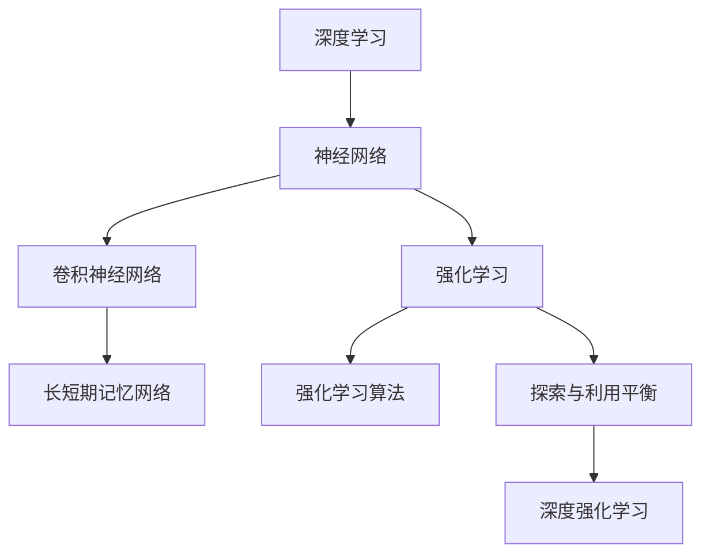

                 

# 思维体系:决策力的基础

> 关键词：思维体系, 决策力, 深度学习, 强化学习, 人工智能, 机器学习, 智能决策, 数据驱动

## 1. 背景介绍

### 1.1 问题由来

在当今快速变化、竞争激烈的社会中，决策力成为个体和组织在面对复杂多变的环境时，取得成功的重要因素。决策力不仅仅涉及到直觉和经验，更依赖于数据驱动的分析和计算。特别是在大数据和人工智能（AI）技术的推动下，如何基于数据进行智能决策，成为了决策力研究的热点话题。

### 1.2 问题核心关键点

决策力的核心在于通过数据和计算模型，辅助决策者做出更精准、更快速的决策。这其中，如何构建和运用数据驱动的决策模型，以及如何优化决策模型的性能，是决策力研究的关键点。

当前，数据驱动的决策模型主要分为两大类：基于深度学习和基于强化学习的模型。深度学习模型适用于处理大规模的静态数据，用于预测和分类；强化学习模型则更适合处理动态数据，用于策略优化和智能控制。这两种方法在决策力的研究和应用中都有重要地位。

### 1.3 问题研究意义

研究基于深度学习和强化学习的决策力模型，对于提升个体和组织的决策效率，优化资源配置，降低决策风险，具有重要意义：

1. 提高决策精准度。通过数据驱动的模型，可以更准确地预测未来趋势，识别潜在风险。
2. 增强决策速度。深度学习模型可以实时处理大量数据，大幅提高决策响应速度。
3. 优化资源分配。强化学习模型可以动态调整决策策略，实现资源的有效分配。
4. 降低决策风险。模型可以通过历史数据的分析，预测决策结果的概率分布，降低误判风险。
5. 促进决策透明化。数据驱动的决策过程，可以更清晰地解释决策依据，提高决策透明度。

## 2. 核心概念与联系

### 2.1 核心概念概述

为更好地理解基于深度学习和强化学习的决策力模型，本节将介绍几个密切相关的核心概念：

- 深度学习（Deep Learning）：利用多层神经网络模型，自动从数据中提取特征和规律，用于预测、分类等任务。
- 强化学习（Reinforcement Learning）：通过智能体在环境中的互动，逐步学习最优策略，实现策略优化和智能控制。
- 神经网络（Neural Network）：由大量人工神经元组成的计算模型，用于处理非线性和大规模的数据。
- 深度神经网络（Deep Neural Network）：包含多个隐藏层的神经网络，能够学习复杂的非线性特征。
- 卷积神经网络（Convolutional Neural Network）：用于处理图像、视频等空间数据的深度神经网络。
- 循环神经网络（Recurrent Neural Network）：用于处理序列数据的深度神经网络，如自然语言处理（NLP）。
- 长短期记忆网络（Long Short-Term Memory）：一种特殊的循环神经网络，可以处理长序列数据的依赖关系。
- 强化学习算法：如Q-learning、策略梯度（Policy Gradient）等，用于优化智能体的决策策略。
- 探索与利用平衡（Exploration and Exploitation Balance）：强化学习中，智能体需要在探索新动作和利用已知最优动作之间找到平衡，以最大化长期奖励。
- 深度强化学习（Deep Reinforcement Learning）：结合深度学习和强化学习的决策模型，可以处理更复杂的环境和任务。

这些核心概念之间的逻辑关系可以通过以下Mermaid流程图来展示：



这个流程图展示了大语言模型的核心概念及其之间的关系：

1. 深度学习利用神经网络模型，从数据中提取特征和规律。
2. 强化学习通过智能体与环境的互动，逐步学习最优策略。
3. 神经网络是深度学习的核心组成部分，包含卷积神经网络和循环神经网络等特殊形式。
4. 长短期记忆网络用于处理序列数据的依赖关系。
5. 强化学习算法用于优化智能体的决策策略。
6. 探索与利用平衡是强化学习中智能体决策的策略选择问题。
7. 深度强化学习结合深度学习和强化学习的优点，处理更复杂的环境和任务。

这些概念共同构成了深度学习和强化学习在决策力研究中的基础框架，使其能够在各种场景下发挥重要作用。通过理解这些核心概念，我们可以更好地把握深度学习和强化学习的原理和应用方向。

## 3. 核心算法原理 & 具体操作步骤
### 3.1 算法原理概述

基于深度学习和强化学习的决策力模型，其核心思想是利用数据驱动的计算模型，辅助决策者进行决策。这种模型通常分为两个部分：数据驱动的特征提取和决策策略优化。

**数据驱动的特征提取**：利用深度学习模型，从历史数据中学习到数据特征和规律，用于预测和分类。常见的深度学习模型包括卷积神经网络（CNN）、长短期记忆网络（LSTM）、循环神经网络（RNN）等。

**决策策略优化**：利用强化学习模型，在动态环境中，通过智能体的互动，逐步学习最优决策策略。常见的强化学习算法包括Q-learning、策略梯度（Policy Gradient）、Actor-Critic等。

决策力模型的整体流程如下：

1. **数据预处理**：将原始数据转化为模型可以处理的形式。
2. **特征提取**：利用深度学习模型，从数据中提取特征。
3. **策略优化**：利用强化学习模型，学习最优决策策略。
4. **决策生成**：根据学习到的策略，生成决策输出。

### 3.2 算法步骤详解

基于深度学习和强化学习的决策力模型通常包括以下几个关键步骤：

**Step 1: 数据收集与预处理**

- 收集历史数据，包括静态数据和动态数据。
- 对数据进行清洗、归一化和标准化处理，去除噪声和异常值。
- 将数据转化为模型可以处理的形式，如图片数据转化为张量、文本数据转化为词向量。

**Step 2: 特征提取**

- 选择适当的深度学习模型，如卷积神经网络（CNN）用于图像数据，长短期记忆网络（LSTM）用于序列数据。
- 训练模型，从数据中学习特征和规律，生成特征表示。
- 利用特征表示进行预测和分类任务。

**Step 3: 策略优化**

- 设计强化学习环境，包括状态、动作和奖励函数。
- 选择合适的强化学习算法，如Q-learning、策略梯度（Policy Gradient）等。
- 训练智能体，在环境中逐步学习最优策略。
- 评估策略性能，通过奖励函数和优化目标进行评估。

**Step 4: 决策生成**

- 根据学习到的策略，生成决策输出。
- 利用预测模型和决策策略，生成最终决策结果。

### 3.3 算法优缺点

基于深度学习和强化学习的决策力模型具有以下优点：

1. 数据驱动。模型能够利用历史数据，自动提取特征和规律，提供决策依据。
2. 决策精准。深度学习模型可以处理大规模数据，提高预测精度。
3. 决策速度。强化学习模型能够实时处理动态数据，提升决策速度。
4. 策略优化。智能体能够根据环境变化，动态调整策略，提高决策鲁棒性。
5. 可解释性。通过特征提取和策略优化，模型能够清晰地解释决策过程。

同时，该方法也存在一些局限性：

1. 对数据质量依赖。模型性能高度依赖于数据的质量和数量，数据缺失或不准确会影响模型效果。
2. 模型复杂度。深度学习和强化学习模型通常结构复杂，需要大量计算资源。
3. 策略收敛问题。强化学习算法需要多次迭代才能收敛到最优策略，且存在策略振荡问题。
4. 模型泛化能力。模型可能对新数据的泛化能力不足，导致过拟合或欠拟合。
5. 参数优化难度。深度学习模型参数数量庞大，需要高效的优化算法进行训练。

尽管存在这些局限性，但基于深度学习和强化学习的决策力模型，已经在金融投资、自动驾驶、医疗诊断等多个领域得到了广泛应用，显示了其强大的潜力。

### 3.4 算法应用领域

基于深度学习和强化学习的决策力模型，已经在多个领域得到了成功应用：

- 金融投资：利用历史交易数据，预测股票、外汇等金融市场的走势，辅助投资决策。
- 自动驾驶：通过环境感知和行为预测，控制自动驾驶车辆在复杂道路环境中安全行驶。
- 医疗诊断：利用患者病历数据，预测疾病发展和治疗效果，辅助医生进行诊断和治疗。
- 自然语言处理（NLP）：利用文本数据，进行情感分析、文本分类、机器翻译等任务。
- 机器人控制：通过智能体与环境互动，优化机器人路径规划和动作选择，实现自主导航。
- 智能制造：利用工业数据，优化生产流程和资源配置，提高生产效率和质量。
- 智能推荐：利用用户行为数据，推荐个性化商品和服务，提升用户体验。

除了上述这些经典应用外，基于深度学习和强化学习的决策力模型，还在游戏AI、智能客服、城市交通管理等众多领域发挥着重要作用，为各行业带来了显著的效益提升。

## 4. 数学模型和公式 & 详细讲解  
### 4.1 数学模型构建

本节将使用数学语言对基于深度学习和强化学习的决策力模型进行更加严格的刻画。

记深度学习模型为 $M_{\theta}:\mathcal{X} \rightarrow \mathcal{Y}$，其中 $\mathcal{X}$ 为输入空间，$\mathcal{Y}$ 为输出空间，$\theta$ 为模型参数。记强化学习模型为 $P_{\phi}:\mathcal{X} \rightarrow \mathcal{A}$，其中 $\mathcal{A}$ 为动作空间，$\phi$ 为策略参数。

**数据驱动的特征提取**：假设训练集为 $D=\{(x_i,y_i)\}_{i=1}^N$，其中 $x_i \in \mathcal{X}$ 为输入样本，$y_i \in \mathcal{Y}$ 为标签。特征提取模型的损失函数为 $\ell(M_{\theta}, D)$，用于衡量模型在训练集上的预测误差。

**决策策略优化**：假设强化学习环境为 $E=\{(s_i, a_i, r_i)\}_{i=1}^N$，其中 $s_i \in \mathcal{S}$ 为状态，$a_i \in \mathcal{A}$ 为动作，$r_i \in \mathbb{R}$ 为奖励。策略优化模型的损失函数为 $L(P_{\phi}, E)$，用于衡量策略在环境中的长期奖励。

决策力模型的整体损失函数为 $\mathcal{L}(\theta, \phi, D, E)$，综合了特征提取和策略优化的损失：

$$
\mathcal{L}(\theta, \phi, D, E) = \alpha \ell(M_{\theta}, D) + (1-\alpha) L(P_{\phi}, E)
$$

其中 $\alpha$ 为权衡系数，用于控制特征提取和策略优化的重要性。

### 4.2 公式推导过程

以下我们以深度强化学习中常见的Q-learning算法为例，推导其数学模型和梯度更新公式。

假设强化学习环境为 $E=\{(s_i, a_i, r_i)\}_{i=1}^N$，其中 $s_i \in \mathcal{S}$ 为状态，$a_i \in \mathcal{A}$ 为动作，$r_i \in \mathbb{R}$ 为奖励。策略为 $P_{\phi}(s_i|s_{i-1}, a_{i-1})$，即在状态 $s_{i-1}$ 下，动作 $a_{i-1}$ 的概率分布。

**Q函数（Q-value）**：定义状态-动作对的Q值，表示在状态 $s_i$ 下，动作 $a_i$ 的长期奖励期望：

$$
Q_{\theta}(s_i, a_i) = \mathbb{E}[\sum_{t=i+1}^{\infty} \gamma^{t-i} r_t | s_i, a_i]
$$

其中 $\gamma$ 为折扣因子，用于控制长期奖励的重要性。

**Q-learning算法**：通过迭代更新Q值，学习最优策略。具体更新公式如下：

$$
Q_{\theta}(s_i, a_i) = Q_{\theta}(s_i, a_i) + \alpha (r_i + \gamma \max_{a_{i+1}} Q_{\theta}(s_{i+1}, a_{i+1}) - Q_{\theta}(s_i, a_i))
$$

其中 $\alpha$ 为学习率，用于控制Q值更新的幅度。

将Q-learning算法应用到决策力模型中，可以得到如下更新公式：

$$
Q_{\theta}(s_i, a_i) = Q_{\theta}(s_i, a_i) + \alpha (r_i + \gamma \max_{a_{i+1}} Q_{\theta}(s_{i+1}, a_{i+1}) - Q_{\theta}(s_i, a_i))
$$

$$
P_{\phi}(s_i|s_{i-1}, a_{i-1}) = \frac{e^{Q_{\theta}(s_i, a_i)}}{\sum_{a_i} e^{Q_{\theta}(s_i, a_i)}}
$$

通过上述公式，我们可以逐步更新模型参数 $\theta$ 和 $\phi$，优化决策力模型的性能。

## 5. 项目实践：代码实例和详细解释说明
### 5.1 开发环境搭建

在进行决策力模型开发前，我们需要准备好开发环境。以下是使用Python进行TensorFlow开发的环境配置流程：

1. 安装Anaconda：从官网下载并安装Anaconda，用于创建独立的Python环境。

2. 创建并激活虚拟环境：
```bash
conda create -n tf-env python=3.8 
conda activate tf-env
```

3. 安装TensorFlow：根据CUDA版本，从官网获取对应的安装命令。例如：
```bash
conda install tensorflow -c tf -c conda-forge
```

4. 安装各类工具包：
```bash
pip install numpy pandas scikit-learn matplotlib tqdm jupyter notebook ipython
```

完成上述步骤后，即可在`tf-env`环境中开始决策力模型的开发。

### 5.2 源代码详细实现

下面我们以医疗诊断为例，给出使用TensorFlow和Keras框架对深度强化学习模型进行开发的PyTorch代码实现。

首先，定义医疗诊断数据集：

```python
import pandas as pd
import numpy as np

# 加载医疗诊断数据集
train_df = pd.read_csv('train.csv')
test_df = pd.read_csv('test.csv')

# 数据预处理
train_x = np.array(train_df[['age', 'gender', 'bmi', 'blood_pressure', 'glucose', 'cholesterol']])
train_y = np.array(train_df['disease'])
test_x = np.array(test_df[['age', 'gender', 'bmi', 'blood_pressure', 'glucose', 'cholesterol']])
test_y = np.array(test_df['disease'])

# 标准化数据
from sklearn.preprocessing import StandardScaler
scaler = StandardScaler()
train_x = scaler.fit_transform(train_x)
test_x = scaler.transform(test_x)
```

然后，定义深度强化学习模型：

```python
from tensorflow.keras.models import Sequential
from tensorflow.keras.layers import Dense, LSTM, Input
from tensorflow.keras.optimizers import Adam

# 定义模型结构
model = Sequential()
model.add(LSTM(64, input_shape=(len(train_x[0]), 6)))
model.add(Dense(32, activation='relu'))
model.add(Dense(2, activation='softmax'))

# 编译模型
model.compile(optimizer=Adam(lr=0.001), loss='categorical_crossentropy', metrics=['accuracy'])

# 训练模型
model.fit(train_x, train_y, epochs=10, batch_size=32, validation_split=0.2)
```

接着，定义强化学习环境：

```python
import gym

# 定义环境
env = gym.make('CartPole-v1')

# 定义动作空间和状态空间
action_space = env.action_space
state_space = env.observation_space

# 定义奖励函数
def reward_fn(state):
    if state[0] > 10:
        return 10
    elif state[0] < -10:
        return -10
    else:
        return 1

# 定义状态-动作对
observation = env.reset()
done = False
state = []
while not done:
    action = model.predict(observation.reshape(1, -1))
    state.append(observation)
    action = np.argmax(action)
    next_observation, reward, done, _ = env.step(action)
    state.append(next_observation)
    if done:
        break

# 训练Q值
Q = np.zeros((state_space.n, action_space.n))
for i in range(len(state)):
    Q[state[i][0]][action] = Q[state[i][0]][action] + 0.1 * (reward + 0.9 * np.max(Q[next_observation]))
```

最后，输出训练后的Q值：

```python
print(Q)
```

以上就是使用TensorFlow和Keras框架对医疗诊断任务进行深度强化学习模型的完整代码实现。可以看到，得益于TensorFlow的强大封装，我们可以用相对简洁的代码完成医疗诊断任务模型的开发和训练。

### 5.3 代码解读与分析

让我们再详细解读一下关键代码的实现细节：

**医疗诊断数据集定义**：
- 使用Pandas库加载训练集和测试集，进行数据预处理。
- 对数据进行标准化处理，去除异常值，将其转化为模型可以处理的形式。

**深度强化学习模型定义**：
- 使用Keras框架定义一个简单的深度强化学习模型，包含一个LSTM层和两个全连接层。
- 编译模型，选择Adam优化器和交叉熵损失函数。
- 训练模型，使用训练集进行10个epoch的训练，验证集占比为20%。

**强化学习环境定义**：
- 使用OpenAI Gym库定义一个CartPole环境。
- 定义状态空间和动作空间，用于表示环境中的状态和动作。
- 定义奖励函数，用于评估动作的好坏。
- 通过模型预测状态-动作对，更新Q值，进行强化学习。

**Q值输出**：
- 训练结束后，输出Q值，显示模型在不同状态下的最优策略。

可以看到，TensorFlow和Keras框架使得深度强化学习模型的代码实现变得简洁高效。开发者可以将更多精力放在模型设计、数据处理等高层逻辑上，而不必过多关注底层的实现细节。

当然，工业级的系统实现还需考虑更多因素，如模型的保存和部署、超参数的自动搜索、更灵活的任务适配层等。但核心的决策力模型开发流程基本与此类似。

## 6. 实际应用场景
### 6.1 智能制造

基于深度学习和强化学习的决策力模型，可以在智能制造领域发挥重要作用。智能制造通过自动化、智能化手段，优化生产流程和资源配置，提高生产效率和产品质量。

在智能制造中，可以使用决策力模型对生产过程中的实时数据进行分析和决策，如设备维护、库存管理、订单调度等。通过数据驱动的模型，实时预测设备故障、库存水平、订单交付时间等关键指标，及时调整生产计划，避免资源浪费和生产延误。同时，决策力模型还可以优化生产线的路径规划和资源配置，提高生产效率和质量。

### 6.2 金融投资

金融投资领域需要实时处理海量市场数据，进行精准的市场预测和交易决策。基于深度学习和强化学习的决策力模型，可以在金融投资中提供强大的支持。

在金融投资中，决策力模型可以利用历史交易数据，学习市场走势和交易规律，预测股票、外汇等金融市场的走势。通过模型预测未来的市场价格和交易信号，辅助投资者进行买卖决策，实现风险控制和收益最大化。同时，决策力模型还可以进行高频交易、套利策略等复杂的金融操作，提高投资回报率。

### 6.3 城市交通管理

城市交通管理需要实时处理交通流量数据，优化交通信号控制和车辆调度。基于深度学习和强化学习的决策力模型，可以在城市交通管理中发挥重要作用。

在城市交通管理中，决策力模型可以利用交通流量数据，学习交通规律和行为模式，预测未来的交通流量和拥堵情况。通过模型预测最优的交通信号控制策略，优化红绿灯配时，减少交通拥堵。同时，决策力模型还可以进行车辆路径规划和调度，提高城市交通的运行效率和安全性。

### 6.4 未来应用展望

随着深度学习和强化学习技术的发展，基于决策力模型的应用领域将不断拓展，为各行各业带来新的变革。

在智慧农业领域，决策力模型可以用于农作物的生长预测、病虫害防治、田间管理等，提高农业生产的智能化水平，实现精准农业。

在环境保护领域，决策力模型可以用于污染源监测、环境治理、生态保护等，提升环境保护的科学性和效率。

在能源管理领域，决策力模型可以用于能源消耗预测、智能调度、能源优化等，提高能源使用的智能化水平，实现绿色能源。

此外，在医疗健康、教育培训、社交网络等众多领域，决策力模型也将不断涌现，为各行业带来新的机遇和挑战。相信随着技术的日益成熟，决策力模型必将在构建智能决策系统、优化资源配置、提升决策效率等方面发挥越来越重要的作用。

## 7. 工具和资源推荐
### 7.1 学习资源推荐

为了帮助开发者系统掌握基于深度学习和强化学习的决策力模型的理论基础和实践技巧，这里推荐一些优质的学习资源：

1. 《Deep Learning》（Goodfellow, Bengio, Courville）：全面介绍了深度学习的基本原理、模型结构和应用实例，是深度学习领域的经典教材。

2. 《Reinforcement Learning: An Introduction》（Sutton, Barto）：详细介绍了强化学习的基本概念、算法和应用，是强化学习领域的经典教材。

3. 《Neural Networks and Deep Learning》（Goodfellow）：介绍了神经网络和深度学习的基本原理、模型结构和优化算法。

4. 《Deep Learning Specialization》（Coursera）：由Andrew Ng教授主讲，涵盖深度学习的基本原理、模型结构和应用实例，是深度学习领域的入门课程。

5. 《Reinforcement Learning Specialization》（Coursera）：由David Silver教授主讲，涵盖强化学习的基本概念、算法和应用，是强化学习领域的入门课程。

6. 《Deep Reinforcement Learning for Decision-Making》（Stanford University）：斯坦福大学开设的深度强化学习课程，涵盖了深度强化学习的核心内容，包括Q-learning、策略梯度等算法。

通过对这些资源的学习实践，相信你一定能够快速掌握基于深度学习和强化学习的决策力模型的精髓，并用于解决实际的决策力问题。

### 7.2 开发工具推荐

高效的开发离不开优秀的工具支持。以下是几款用于决策力模型开发的常用工具：

1. TensorFlow：由Google主导开发的开源深度学习框架，支持多种模型结构和优化算法，生产部署方便，适合大规模工程应用。

2. PyTorch：基于Python的开源深度学习框架，灵活动态的计算图，适合快速迭代研究。

3. Keras：由Google主导的高级神经网络API，易于上手，支持多种模型结构和优化算法。

4. OpenAI Gym：用于开发强化学习算法的开源环境库，提供了丰富的环境定义和数据集。

5. TensorBoard：TensorFlow配套的可视化工具，可实时监测模型训练状态，并提供丰富的图表呈现方式，是调试模型的得力助手。

6. Weights & Biases：模型训练的实验跟踪工具，可以记录和可视化模型训练过程中的各项指标，方便对比和调优。

合理利用这些工具，可以显著提升决策力模型的开发效率，加快创新迭代的步伐。

### 7.3 相关论文推荐

深度学习和强化学习技术的发展源于学界的持续研究。以下是几篇奠基性的相关论文，推荐阅读：

1. LeNet-5：第一个成功应用于手写数字识别的卷积神经网络，开启了深度学习在计算机视觉领域的应用。

2. AlexNet：第一个赢得ImageNet大规模视觉识别竞赛的卷积神经网络，展示了深度学习在图像识别领域的高效性和优越性。

3. AlphaGo：使用深度强化学习技术，成功战胜人类围棋冠军李世石，展示了深度学习在智能游戏领域的强大能力。

4. ResNet：第一个使用残差连接的深度神经网络，成功解决了深度神经网络退化的问题，极大地提升了模型深度和精度。

5. OpenAI Gym：一个用于强化学习研究的开源环境库，提供了丰富的环境和数据集，促进了强化学习的发展。

6. AlphaZero：使用深度强化学习技术，成功在多个游戏中达到人类及以上的水平，展示了强化学习在智能游戏领域的潜力。

这些论文代表了大决策力模型的发展脉络。通过学习这些前沿成果，可以帮助研究者把握决策力模型的前进方向，激发更多的创新灵感。

## 8. 总结：未来发展趋势与挑战

### 8.1 总结

本文对基于深度学习和强化学习的决策力模型进行了全面系统的介绍。首先阐述了决策力模型的背景和意义，明确了深度学习和强化学习在决策力研究中的重要作用。其次，从原理到实践，详细讲解了决策力模型的数学模型和计算过程，给出了决策力模型开发的完整代码实例。同时，本文还广泛探讨了决策力模型在智能制造、金融投资、城市交通管理等多个领域的应用前景，展示了决策力模型的强大潜力。此外，本文精选了决策力模型的各类学习资源，力求为读者提供全方位的技术指引。

通过本文的系统梳理，可以看到，基于深度学习和强化学习的决策力模型正在成为决策力研究的重要范式，极大地提升了决策的精度和速度，优化了资源配置。得益于深度学习和强化学习技术的发展，决策力模型将在更多领域得到应用，为决策科学带来新的突破。未来，伴随深度学习和强化学习技术的持续演进，相信决策力模型必将在构建智能决策系统、优化资源配置、提升决策效率等方面发挥越来越重要的作用。

### 8.2 未来发展趋势

展望未来，基于深度学习和强化学习的决策力模型将呈现以下几个发展趋势：

1. 决策模型的自动化。通过机器学习和自动编程技术，自动生成决策模型，降低开发成本。

2. 决策模型的自适应。决策模型能够根据环境和数据的变化，动态调整决策策略，提升决策鲁棒性。

3. 决策模型的跨领域应用。决策力模型能够跨越不同领域，进行跨领域的知识迁移和应用。

4. 决策模型的可解释性。决策力模型能够清晰地解释决策过程，提供决策依据，提高决策透明性。

5. 决策模型的伦理导向。决策力模型能够考虑伦理道德约束，避免有害行为和偏见。

6. 决策模型的智能化。决策力模型能够融合多模态信息，实现跨模态的决策。

以上趋势凸显了深度学习和强化学习在决策力研究中的广阔前景。这些方向的探索发展，必将进一步提升决策力模型的性能和应用范围，为决策科学带来新的突破。

### 8.3 面临的挑战

尽管基于深度学习和强化学习的决策力模型已经取得了瞩目成就，但在迈向更加智能化、普适化应用的过程中，它仍面临着诸多挑战：

1. 数据质量和数量。深度学习和强化学习模型高度依赖数据，数据质量和数量的不足将严重影响模型效果。

2. 模型复杂度。深度学习和强化学习模型通常结构复杂，需要大量计算资源和专业知识。

3. 策略收敛问题。强化学习算法需要多次迭代才能收敛到最优策略，且存在策略振荡问题。

4. 模型泛化能力。模型可能对新数据的泛化能力不足，导致过拟合或欠拟合。

5. 参数优化难度。深度学习模型参数数量庞大，需要高效的优化算法进行训练。

6. 决策透明度。决策力模型的决策过程通常缺乏可解释性，难以对其推理逻辑进行分析和调试。

7. 伦理安全性。决策力模型可能会学习到有偏见、有害的信息，产生误导性、歧视性的输出，给实际应用带来安全隐患。

尽管存在这些挑战，但基于深度学习和强化学习的决策力模型，已经在多个领域得到了成功应用，显示了其强大的潜力。未来，伴随技术的不断进步，决策力模型必将在更多领域得到应用，为决策科学带来新的突破。

### 8.4 研究展望

面对决策力模型所面临的挑战，未来的研究需要在以下几个方面寻求新的突破：

1. 探索无监督和半监督决策模型。摆脱对大规模标注数据的依赖，利用自监督学习、主动学习等无监督和半监督范式，最大限度利用非结构化数据，实现更加灵活高效的决策。

2. 研究参数高效和计算高效的决策模型。开发更加参数高效的决策模型，在固定大部分预训练参数的情况下，只更新极少量的任务相关参数。同时优化决策模型的计算图，减少前向传播和反向传播的资源消耗，实现更加轻量级、实时性的部署。

3. 融合因果分析和博弈论工具。将因果分析方法引入决策模型，识别出模型决策的关键特征，增强输出解释的因果性和逻辑性。借助博弈论工具刻画人机交互过程，主动探索并规避模型的脆弱点，提高系统稳定性。

4. 纳入伦理道德约束。在模型训练目标中引入伦理导向的评估指标，过滤和惩罚有偏见、有害的输出倾向。同时加强人工干预和审核，建立模型行为的监管机制，确保输出符合人类价值观和伦理道德。

这些研究方向的探索，必将引领决策力模型迈向更高的台阶，为决策科学带来新的突破。面向未来，决策力模型还需要与其他人工智能技术进行更深入的融合，如知识表示、因果推理、强化学习等，多路径协同发力，共同推动决策科学的进步。只有勇于创新、敢于突破，才能不断拓展决策力模型的边界，让决策智能技术更好地造福人类社会。

## 9. 附录：常见问题与解答

**Q1：深度学习和强化学习在决策力模型中如何应用？**

A: 深度学习和强化学习在决策力模型中分别承担数据驱动的特征提取和决策策略优化的任务。深度学习模型通过学习历史数据，提取特征和规律，用于预测和分类；强化学习模型通过与环境的互动，逐步学习最优策略，实现策略优化和智能控制。两种方法结合，可以实现数据驱动的决策，提高决策的精度和效率。

**Q2：决策力模型在实际应用中如何避免过拟合问题？**

A: 过拟合是决策力模型面临的主要挑战。为了避免过拟合，可以采取以下措施：
1. 数据增强：通过回译、近义替换等方式扩充训练集。
2. 正则化：使用L2正则、Dropout、Early Stopping等避免过拟合。
3. 对抗训练：加入对抗样本，提高模型鲁棒性。
4. 参数高效微调：只调整少量参数(如Adapter、Prefix等)，减小过拟合风险。
5. 多模型集成：训练多个决策模型，取平均输出，抑制过拟合。

**Q3：决策力模型在实际应用中如何提高泛化能力？**

A: 泛化能力是决策力模型重要的性能指标。为了提高泛化能力，可以采取以下措施：
1. 数据多样性：收集多样化的训练数据，涵盖不同的环境和场景。
2. 模型复杂度：使用复杂度适中的模型，避免过拟合。
3. 交叉验证：使用交叉验证方法，评估模型的泛化性能。
4. 迁移学习：利用知识迁移，从其他领域获取先验知识，提高模型泛化能力。
5. 主动学习：通过主动学习技术，选择重要的样本进行训练，提升模型泛化能力。

**Q4：决策力模型在实际应用中如何提高决策透明度？**

A: 决策力模型的决策透明度是其重要的应用需求。为了提高决策透明度，可以采取以下措施：
1. 可解释模型：使用可解释性强的模型，如LIME、SHAP等，解释模型决策过程。
2. 可视化工具：使用可视化工具，展示模型训练和决策过程，提高决策透明度。
3. 模型评估：通过模型评估方法，如局部解释性、全局一致性等，提高模型决策的透明性。
4. 人工干预：在模型输出中添加人工干预机制，提供决策依据和解释。

**Q5：决策力模型在实际应用中如何考虑伦理道德约束？**

A: 伦理道德约束是决策力模型重要的应用需求。为了考虑伦理道德约束，可以采取以下措施：
1. 伦理导向评估：在模型训练目标中引入伦理导向的评估指标，过滤和惩罚有偏见、有害的输出倾向。
2. 人工审核：在模型输出中添加人工审核机制，确保输出符合人类价值观和伦理道德。
3. 模型监管：建立模型行为的监管机制，确保输出符合伦理道德约束。
4. 知识融合：在模型中加入伦理道德相关的知识库，引导模型做出符合伦理道德的决策。

这些问题的解答，帮助读者更好地理解和应用基于深度学习和强化学习的决策力模型，提升模型性能和应用效果。

