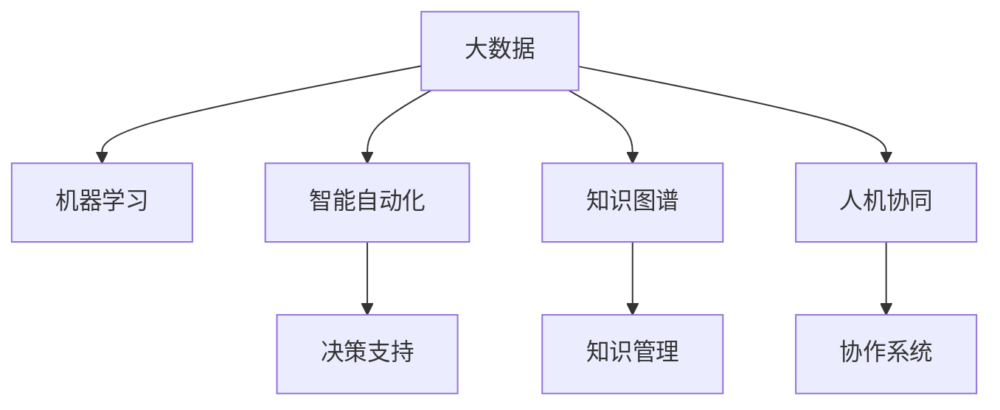

                 

# 思维升级：管理者的竞争优势

## 1. 背景介绍

### 1.1 问题由来

在现代社会中，管理者的角色越来越复杂和多样化。他们需要不仅拥有传统的管理技能，还需要适应新技术带来的变化。随着人工智能(AI)、大数据、物联网(IoT)等技术的飞速发展，管理者的工作内容和方式正在发生深刻变革。如何利用这些新技术，提升管理者的决策能力、执行效率和创新思维，成为了一个亟待解决的问题。

### 1.2 问题核心关键点

本文聚焦于如何通过技术手段，帮助管理者升级思维能力，以提升其在复杂环境下的竞争优势。我们将从以下几个方面进行探讨：

1. **数据驱动决策**：如何利用大数据和机器学习算法，辅助管理者做出更加科学的决策。
2. **智能自动化**：如何利用智能自动化技术，提升管理者的执行效率和工作质量。
3. **知识图谱**：如何构建和管理知识图谱，以支持管理者的认知和创新。
4. **人机协同**：如何通过人机协同技术，增强管理者的协作和沟通能力。

### 1.3 问题研究意义

管理者思维的升级，不仅有助于提高企业的运营效率和盈利能力，还对社会经济的整体进步有着重要影响。通过技术手段提升管理者的能力，可以加速企业数字化转型，促进产业升级，推动社会创新。

## 2. 核心概念与联系

### 2.1 核心概念概述

为了更好地理解技术手段如何帮助管理者思维升级，本节将介绍几个密切相关的核心概念：

- **大数据**：通过收集、处理和分析大规模数据，辅助决策和管理。
- **机器学习**：利用算法模型从数据中提取知识和规律，支持自动化决策。
- **智能自动化**：通过自动化和智能化的工具和系统，提升工作效率和质量。
- **知识图谱**：构建和应用知识图谱，增强信息检索和知识推理能力。
- **人机协同**：通过人机协作，增强管理和沟通效率。

这些核心概念之间的逻辑关系可以通过以下Mermaid流程图来展示：



这个流程图展示了大数据、机器学习、智能自动化、知识图谱和人机协同等概念之间的内在联系，以及它们如何共同支持管理者的思维升级。

## 3. 核心算法原理 & 具体操作步骤

### 3.1 算法原理概述

数据驱动决策、智能自动化、知识图谱和人机协同等技术手段，核心都是通过算法模型和系统架构，辅助管理者进行思维升级。这些技术手段虽然实现方式不同，但都基于以下几个核心算法原理：

1. **数据预处理和特征提取**：将原始数据转换为可供模型处理的格式，提取关键特征。
2. **模型训练和优化**：利用机器学习算法，训练模型并进行参数优化。
3. **系统集成和应用**：将算法模型集成到系统中，提供决策支持和自动化执行。
4. **知识抽取和推理**：从数据和知识库中抽取知识，支持智能推理和决策。
5. **人机交互界面**：设计易于理解和人机协作的用户界面，增强用户体验和交互效率。

### 3.2 算法步骤详解

**数据驱动决策**：

1. **数据收集**：从企业运营、客户反馈、市场环境等多个维度收集数据。
2. **数据清洗**：处理缺失值、异常值等，确保数据质量。
3. **特征工程**：选择和构建关键特征，如销售额、客户满意度、市场份额等。
4. **模型选择**：选择合适的机器学习模型，如回归、分类、聚类等。
5. **模型训练**：利用历史数据训练模型，进行参数优化。
6. **预测和评估**：利用训练好的模型对未来数据进行预测，并评估模型效果。

**智能自动化**：

1. **任务分析**：分析需要自动化的业务流程和工作任务。
2. **工具选择**：选择适合的自动化工具和系统，如RPA、机器学习、自然语言处理等。
3. **流程设计**：设计自动化流程，确保任务的无缝衔接和高效执行。
4. **系统部署**：将自动化系统部署到企业环境中，并进行测试和调试。
5. **持续优化**：根据业务反馈和实际效果，持续优化自动化流程和系统。

**知识图谱**：

1. **领域建模**：确定知识图谱的领域范围和结构，如企业运营、产品管理、市场分析等。
2. **数据收集和整合**：收集和整合领域内的数据，构建知识图谱。
3. **知识抽取**：利用自然语言处理和机器学习技术，从数据中抽取实体和关系。
4. **知识推理**：构建推理引擎，支持基于知识图谱的智能推理和决策。
5. **应用集成**：将知识图谱集成到业务系统中，支持决策和分析。

**人机协同**：

1. **需求分析**：分析业务需求和用户场景，确定人机协同的目标和范围。
2. **系统设计**：设计人机协同的系统架构和用户界面。
3. **交互设计**：设计易于理解和操作的用户界面，支持人机交互。
4. **测试和部署**：进行系统测试和部署，确保系统的稳定性和易用性。
5. **反馈优化**：根据用户反馈，持续优化人机协同系统。

### 3.3 算法优缺点

**数据驱动决策**：

优点：

- 数据驱动的决策更加客观和科学。
- 可支持大规模复杂问题的解决。
- 能够提供可视化的分析和报告。

缺点：

- 对数据质量和处理技术要求较高。
- 模型选择和调参需要专业知识。
- 模型可能存在过拟合或欠拟合问题。

**智能自动化**：

优点：

- 提高工作效率和准确性。
- 减少人为错误和冗余工作。
- 支持24/7不间断作业。

缺点：

- 自动化系统的初始部署成本较高。
- 需要专业技能和知识支持。
- 可能存在系统故障和数据泄露风险。

**知识图谱**：

优点：

- 提供结构化的知识管理和检索能力。
- 支持智能推理和决策支持。
- 提升组织知识共享和创新能力。

缺点：

- 知识图谱构建和维护成本较高。
- 需要专业知识进行构建和应用。
- 数据质量和完整性对知识图谱效果影响较大。

**人机协同**：

优点：

- 提高协作效率和用户体验。
- 增强任务处理的多样性和灵活性。
- 支持人机互动和动态决策。

缺点：

- 系统设计和实施需要较多时间和资源。
- 用户培训和接受度需要时间和成本。
- 可能存在交互界面设计和用户体验问题。

### 3.4 算法应用领域

这些核心算法和原理在多个领域都有广泛的应用，例如：

- **金融领域**：利用大数据和机器学习模型进行风险评估、投资分析和客户管理。
- **医疗领域**：利用智能自动化和知识图谱进行患者诊断、药物研发和健康监测。
- **制造业**：利用数据驱动决策和智能自动化进行生产调度、质量控制和供应链管理。
- **零售行业**：利用人机协同和知识图谱进行客户推荐、库存管理和市场分析。

这些应用场景展示了技术手段如何帮助管理者升级思维，提升决策和执行能力。

## 4. 数学模型和公式 & 详细讲解

### 4.1 数学模型构建

为了更好地理解这些技术手段的数学模型，本节将介绍几个常用的数学模型和公式。

**线性回归模型**：

线性回归模型是一种常用的预测模型，用于建立输入特征和输出变量之间的线性关系。其数学公式如下：

$$y = \beta_0 + \beta_1x_1 + \beta_2x_2 + \cdots + \beta_nx_n + \epsilon$$

其中，$y$ 为输出变量，$x_i$ 为输入特征，$\beta_i$ 为模型参数，$\epsilon$ 为误差项。

**决策树模型**：

决策树模型是一种基于树结构的分类模型，通过选择最佳特征和阈值进行分叉，最终得到分类结果。其数学公式如下：

$$D_t(x) = \begin{cases}
L_t, & x \leq x_t \\
R_t, & x > x_t
\end{cases}$$

其中，$D_t(x)$ 为决策树对输入 $x$ 的分裂结果，$L_t$ 和 $R_t$ 分别为左子树和右子树的分裂结果，$x_t$ 为特征阈值。

**知识图谱推理**：

知识图谱推理通常使用基于规则的推理引擎，进行实体和关系的匹配和推理。其数学模型如下：

$$\text{Inference}(R, E) = \{e | R(e_1, e_2, \cdots, e_n) \land e_i \in E\}$$

其中，$\text{Inference}$ 为推理结果，$R$ 为规则，$E$ 为知识图谱中的实体和关系，$e_i$ 为推理过程中的实体。

### 4.2 公式推导过程

**线性回归模型的推导**：

1. 最小二乘法：最小化误差平方和 $SSE = \sum_{i=1}^n (y_i - \hat{y}_i)^2$，求解 $\beta$。
2. 梯度下降：$\nabla_SSE = 2\sum_{i=1}^n (y_i - \hat{y}_i)x_i$，$\nabla_{\beta} SSE = \sum_{i=1}^n (y_i - \hat{y}_i)x_i$。
3. 更新参数：$\beta_j = \beta_j - \eta \nabla_{\beta} SSE$。

**决策树模型的推导**：

1. 信息增益：选择信息增益最大的特征进行分裂。
2. 递归分裂：对每个特征和阈值进行评估，选择最佳分裂方案。
3. 剪枝处理：对决策树进行剪枝，防止过拟合。

**知识图谱推理的推导**：

1. 规则匹配：利用规则引擎，将实体和关系匹配。
2. 推理引擎：通过逻辑推理，得到推理结果。
3. 结果融合：将推理结果与已有知识库进行融合，得到最终结论。

### 4.3 案例分析与讲解

**案例分析**：

假设某零售公司希望利用数据驱动决策提升销售业绩。公司收集了历史销售数据、市场趋势、竞争对手信息等数据，利用线性回归模型进行销售预测。具体步骤如下：

1. **数据收集**：从销售系统、市场调研和竞争情报等多个渠道收集数据。
2. **数据预处理**：清洗数据，去除缺失值和异常值，选择关键特征如销售额、促销活动、季节性等。
3. **模型选择**：选择线性回归模型进行销售预测。
4. **模型训练**：利用历史数据训练模型，调整参数 $\beta$ 以最小化误差。
5. **预测和评估**：利用训练好的模型对未来销售进行预测，评估预测效果。

**讲解**：

通过数据驱动决策，零售公司可以更好地了解市场需求和趋势，制定更科学的销售策略。例如，通过预测不同促销活动的销售效果，选择最优的促销时机和方式，提升整体销售业绩。

## 5. 项目实践：代码实例和详细解释说明

### 5.1 开发环境搭建

在进行技术实践前，我们需要准备好开发环境。以下是使用Python进行数据驱动决策实践的环境配置流程：

1. 安装Anaconda：从官网下载并安装Anaconda，用于创建独立的Python环境。

2. 创建并激活虚拟环境：
```bash
conda create -n pytorch-env python=3.8 
conda activate pytorch-env
```

3. 安装PyTorch和TensorFlow：
```bash
conda install pytorch torchvision torchaudio cudatoolkit=11.1 -c pytorch -c conda-forge
conda install tensorflow
```

4. 安装Pandas和Scikit-learn：
```bash
pip install pandas scikit-learn
```

5. 安装Matplotlib和Seaborn：
```bash
pip install matplotlib seaborn
```

完成上述步骤后，即可在`pytorch-env`环境中开始数据驱动决策的实践。

### 5.2 源代码详细实现

这里我们以销售预测为例，使用线性回归模型进行数据驱动决策的实现。

首先，定义数据处理函数：

```python
import pandas as pd
from sklearn.model_selection import train_test_split
from sklearn.linear_model import LinearRegression

def load_data(filename):
    data = pd.read_csv(filename)
    return data

def preprocess_data(data):
    data = data.dropna()
    data['season'] = data['season'].map({'Spring': 1, 'Summer': 2, 'Autumn': 3, 'Winter': 4})
    return data

def train_test_split_data(data, test_size=0.2):
    X = data[['temperature', 'humidity', 'wind', 'sales_volume']]
    y = data['sales_volume']
    X_train, X_test, y_train, y_test = train_test_split(X, y, test_size=test_size)
    return X_train, X_test, y_train, y_test

def train_model(X_train, y_train):
    model = LinearRegression()
    model.fit(X_train, y_train)
    return model
```

然后，进行模型训练和预测：

```python
# 加载和预处理数据
data = load_data('sales.csv')
data = preprocess_data(data)

# 分割训练和测试数据
X_train, X_test, y_train, y_test = train_test_split_data(data)

# 训练模型
model = train_model(X_train, y_train)

# 预测结果
y_pred = model.predict(X_test)

# 输出模型参数
print(model.coef_)
```

以上就是使用Python进行数据驱动决策实践的完整代码实现。可以看到，通过Scikit-learn库，我们可以很容易地实现线性回归模型的训练和预测。

### 5.3 代码解读与分析

让我们再详细解读一下关键代码的实现细节：

**load_data函数**：

- 加载销售数据文件，返回Pandas DataFrame对象。
- 可以指定数据文件路径和格式。

**preprocess_data函数**：

- 去除缺失值和异常值。
- 将季节性特征转换为数值型。

**train_test_split_data函数**：

- 将数据集分割为训练集和测试集。
- 可以使用不同比例分割数据集。

**train_model函数**：

- 利用训练数据训练线性回归模型。
- 返回训练好的模型对象。

**输出模型参数**：

- 打印模型系数和截距，展示模型学习到的特征关系。

这些代码实现展示了如何使用Python和Scikit-learn库进行数据驱动决策实践。开发者可以根据具体业务需求，调整数据处理和模型训练的参数，优化模型效果。

## 6. 实际应用场景

### 6.1 智能自动化

智能自动化在现代企业管理中扮演着越来越重要的角色。通过自动化工具和系统，企业管理者可以节省大量时间和精力，提高工作效率和质量。

**应用场景**：

- **日常任务自动化**：自动处理日常的报告生成、数据汇总、邮件管理等任务，减少人工错误和冗余工作。
- **决策支持自动化**：利用智能决策系统，自动化生成决策报告和建议，支持高层管理者的决策过程。
- **流程自动化**：自动化处理供应链管理、客户关系管理等业务流程，提升业务效率和质量。

**实际案例**：

某大型制造企业通过引入RPA自动化工具，将财务报表生成、库存盘点、采购订单处理等任务自动化，显著提高了工作效率和准确性。同时，企业还利用智能决策系统，根据历史销售数据和市场趋势，自动生成销售预测和库存调整建议，帮助管理层做出更科学的决策。

### 6.2 知识图谱

知识图谱在企业管理中的应用，主要体现在提升信息管理和知识共享的能力上。通过构建和管理知识图谱，企业管理者可以更好地掌握企业内部的知识资源，支持决策和创新。

**应用场景**：

- **知识图谱构建**：收集和整合企业内部的文档、专利、产品信息等数据，构建知识图谱。
- **知识检索和推理**：利用知识图谱进行信息检索和知识推理，支持快速获取所需知识和解决方案。
- **知识分享和协作**：通过知识图谱平台，促进企业内部知识共享和协作，提升组织创新能力。

**实际案例**：

某高科技企业通过构建知识图谱平台，整合了公司的专利、论文、技术文档等知识资源，支持研发团队进行信息检索和知识推理。平台还提供了协作工具，支持团队成员在知识图谱上共同构建和分享知识，提升了企业的创新能力和竞争力。

### 6.3 人机协同

人机协同在企业管理中的应用，主要体现在提升协作效率和用户体验上。通过人机协同系统，企业管理者可以更好地与员工和客户进行互动，提升协作效果和沟通质量。

**应用场景**：

- **协作平台**：利用人机协同平台，支持团队成员进行任务分配、进度跟踪和协作讨论。
- **客户沟通**：利用聊天机器人和虚拟助手，自动处理客户咨询和反馈，提升客户满意度。
- **信息展示**：通过智能仪表盘和报告系统，自动生成和展示业务数据和指标，支持高层管理者快速了解业务状况。

**实际案例**：

某大型咨询公司通过引入人机协同平台，将团队协作、客户沟通和信息展示等功能集成在一起，提升了团队的协作效率和客户满意度。平台还支持智能报表生成和分析，帮助管理层快速了解业务状况，做出科学决策。

## 7. 工具和资源推荐

### 7.1 学习资源推荐

为了帮助开发者系统掌握数据驱动决策、智能自动化、知识图谱和人机协同的理论基础和实践技巧，这里推荐一些优质的学习资源：

1. **《Python数据科学手册》**：通过系统讲解Python数据科学库，如Pandas、NumPy、Scikit-learn等，帮助开发者掌握数据处理和机器学习技能。
2. **《机器学习实战》**：通过实际项目案例，深入浅出地介绍了机器学习模型的构建和应用。
3. **《大数据技术与应用》**：介绍大数据技术的基本概念、技术架构和应用场景，帮助开发者理解数据驱动决策的原理。
4. **《知识图谱设计与应用》**：通过系统讲解知识图谱的构建、管理和应用，帮助开发者掌握知识图谱技术。
5. **《人机协同系统设计与实现》**：介绍人机协同系统的设计思路和实现方法，帮助开发者构建高效、易用的协作平台。

通过对这些资源的学习实践，相信你一定能够快速掌握技术手段如何帮助管理者思维升级，并用于解决实际的业务问题。

### 7.2 开发工具推荐

高效的开发离不开优秀的工具支持。以下是几款用于数据驱动决策、智能自动化、知识图谱和人机协同开发的常用工具：

1. **Python**：基于Python的开源深度学习框架，灵活动态的计算图，适合快速迭代研究。大部分预训练语言模型都有Python版本的实现。
2. **RPA工具**：如UiPath、Blue Prism等，支持自动化处理业务流程。
3. **知识图谱平台**：如ArangoDB、Neo4j等，支持构建和管理知识图谱。
4. **协作平台**：如Microsoft Teams、Slack等，支持团队协作和沟通。
5. **智能报表系统**：如Tableau、Power BI等，支持数据可视化和报告生成。

合理利用这些工具，可以显著提升数据驱动决策、智能自动化、知识图谱和人机协同的开发效率，加快创新迭代的步伐。

### 7.3 相关论文推荐

数据驱动决策、智能自动化、知识图谱和人机协同等技术的发展源于学界的持续研究。以下是几篇奠基性的相关论文，推荐阅读：

1. **《大规模并行机器学习》**：Andrew Ng等，介绍了大规模并行机器学习的实现方法和应用场景。
2. **《知识图谱构建与应用》**：Zhihui Wu等，介绍了知识图谱的构建和应用技术。
3. **《人机协同系统设计与实现》**：Sangeet Mishra等，介绍了人机协同系统的设计思路和实现方法。
4. **《数据驱动决策的实践与挑战》**：Yue He等，介绍了数据驱动决策在企业中的应用案例和挑战。

这些论文代表了大数据、机器学习、智能自动化、知识图谱和人机协同技术的发展脉络。通过学习这些前沿成果，可以帮助研究者把握学科前进方向，激发更多的创新灵感。

## 8. 总结：未来发展趋势与挑战

### 8.1 总结

本文对数据驱动决策、智能自动化、知识图谱和人机协同等技术手段进行了全面系统的介绍。首先阐述了这些技术手段在企业管理中的应用背景和意义，明确了技术手段如何帮助管理者思维升级，提升决策和执行能力。其次，从原理到实践，详细讲解了数据驱动决策、智能自动化、知识图谱和人机协同的核心算法和具体操作步骤，提供了完整的代码实例。同时，本文还广泛探讨了这些技术手段在多个领域的应用场景，展示了技术手段如何帮助管理者思维升级，提升企业的竞争优势。

通过对这些技术手段的学习和实践，管理者可以更好地利用数据、算法和系统架构，进行思维升级，提升决策和执行能力。未来，随着技术手段的不断发展，数据驱动决策、智能自动化、知识图谱和人机协同将更加智能化和高效化，帮助管理者在复杂多变的环境中保持竞争优势。

### 8.2 未来发展趋势

展望未来，数据驱动决策、智能自动化、知识图谱和人机协同技术将呈现以下几个发展趋势：

1. **自动化和智能化**：随着AI技术的发展，数据驱动决策、智能自动化和知识图谱将更加智能化和自动化，支持更加复杂和动态的决策和执行。
2. **多模态融合**：将数据源从单一的文本和数值型数据扩展到图像、视频、语音等多模态数据，提升信息获取和处理的全面性。
3. **边缘计算**：将计算任务从云端转移到边缘设备，提升决策和执行的实时性和可靠性。
4. **区块链和隐私保护**：利用区块链技术，提升数据共享和协作的安全性和透明度。
5. **人机协同的进化**：通过自然语言处理、情感分析等技术，提升人机协同系统的理解和交互能力。

以上趋势凸显了数据驱动决策、智能自动化、知识图谱和人机协同技术的广阔前景。这些方向的探索发展，必将进一步提升企业管理者的思维能力，构建更加智能、高效的决策和执行体系。

### 8.3 面临的挑战

尽管数据驱动决策、智能自动化、知识图谱和人机协同技术已经取得了显著成果，但在迈向更加智能化、普适化应用的过程中，仍面临诸多挑战：

1. **数据质量和安全**：数据的准确性和完整性对决策和执行效果有重要影响。如何保证数据质量和数据安全，避免数据泄露和滥用，将是重要的挑战。
2. **模型复杂度**：大规模和高复杂度的模型需要高效的计算资源和存储空间。如何在保证模型效果的同时，控制计算资源的使用，是重要的优化方向。
3. **系统集成和互操作性**：不同系统和平台之间的数据共享和协同工作，需要高效的集成和互操作性解决方案。
4. **用户体验和接受度**：人机协同系统和智能自动化工具需要易于理解和使用，提升用户体验和接受度。
5. **伦理和法律问题**：数据驱动决策和智能自动化可能涉及隐私、公平和责任等伦理和法律问题，需要制定相应的政策和法规。

正视这些挑战，积极应对并寻求突破，将是大数据、机器学习、智能自动化、知识图谱和人机协同技术走向成熟的必由之路。相信随着学界和产业界的共同努力，这些挑战终将一一被克服，数据驱动决策、智能自动化、知识图谱和人机协同技术必将在企业运营中发挥更大的作用。

### 8.4 研究展望

面对数据驱动决策、智能自动化、知识图谱和人机协同技术面临的诸多挑战，未来的研究需要在以下几个方面寻求新的突破：

1. **数据治理和隐私保护**：研究数据治理和隐私保护技术，提升数据质量和数据安全。
2. **模型压缩和优化**：研究模型压缩和优化技术，提高模型效率和实时性。
3. **系统集成和互操作性**：研究高效的系统集成和互操作性解决方案，支持企业内部的数据共享和协同工作。
4. **用户体验和接受度**：研究用户体验和接受度提升技术，设计易于使用和理解的人机协同系统和智能自动化工具。
5. **伦理和法律问题**：研究伦理和法律问题，制定相应的政策和法规，确保技术应用的安全和合规。

这些研究方向的探索，必将引领数据驱动决策、智能自动化、知识图谱和人机协同技术迈向更高的台阶，为企业管理者提供更加智能、高效的决策和执行支持，推动企业的数字化转型和创新发展。

## 9. 附录：常见问题与解答

**Q1：数据驱动决策是否适用于所有业务场景？**

A: 数据驱动决策适用于大多数业务场景，特别是那些数据量较大、决策周期较长的业务。但对于一些高度依赖经验和直觉的业务，数据驱动决策可能无法完全替代人的判断。此时需要结合数据驱动和经验驱动，综合决策。

**Q2：智能自动化是否会替代人类工作？**

A: 智能自动化可以辅助人类工作，提升工作效率和质量。但并不会完全替代人类工作，特别是在需要创造性、复杂性、高价值的业务环节，人类仍然具有不可替代的地位。

**Q3：知识图谱如何构建和管理？**

A: 知识图谱的构建和管理需要专业知识和技术支持。首先需要确定知识领域和范围，收集和整合相关数据，然后利用自然语言处理和机器学习技术抽取实体和关系，构建知识图谱。在使用过程中，需要不断更新和维护，确保知识图谱的时效性和准确性。

**Q4：人机协同系统的设计和实现需要注意哪些问题？**

A: 人机协同系统的设计和实现需要考虑用户体验和系统稳定性。首先需要设计易于理解和操作的用户界面，支持人机交互。其次，需要设计高效的系统架构和算法，确保系统的高可靠性和高性能。

通过本文的系统梳理，可以看到，数据驱动决策、智能自动化、知识图谱和人机协同技术正在成为企业管理的重要范式，极大地提升管理者的决策和执行能力。未来，随着这些技术手段的不断发展，企业管理者可以更好地利用数据、算法和系统架构，进行思维升级，提升企业的竞争优势。

