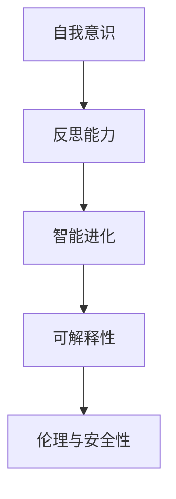
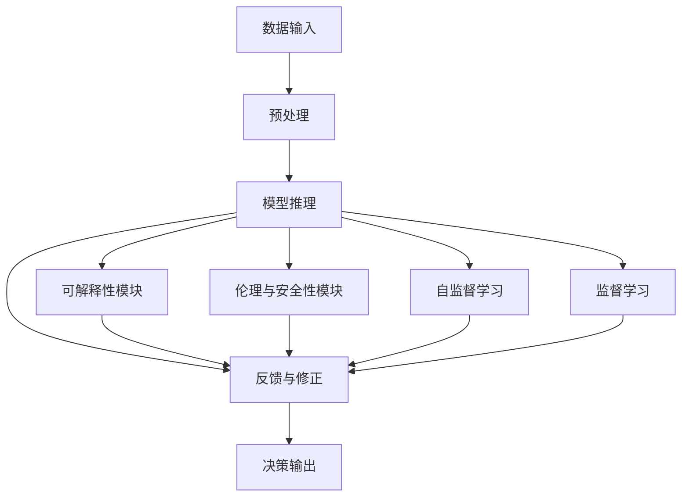

                 

# 思维的元认知：对自己思考过程的反思

## 1. 背景介绍

### 1.1 问题由来

在当今这个信息爆炸的时代，人工智能(AI)技术已经深刻改变了我们的工作和生活方式。从简单的文本分类到复杂的自动驾驶，从日常的智能助手到全球性的数据分析，AI的广泛应用让我们对机器的智能表现惊叹不已。然而，随着AI技术的不断深入，一个更深层的问题逐渐浮出水面：**如何更好地理解、控制和运用AI的智能，以实现更高的目标和更广阔的应用**。

思维的元认知，作为AI领域的一个重要研究方向，其核心在于**对自身思考过程的反思和优化**。通过深入研究如何使AI具备自我意识和自我反思的能力，思维的元认知不仅能够提升AI的决策质量和应用效果，还能促进人类对AI智能本质的理解，为AI技术的进一步发展铺平道路。

### 1.2 问题核心关键点

思维的元认知涉及以下几个核心关键点：

- **自我意识**：使AI能够识别自身的智能边界和局限性，并在此基础上进行自我提升。
- **反思能力**：在执行决策后，AI能够根据反馈进行自我修正，优化模型和算法。
- **智能进化**：通过不断的学习和迭代，AI能够在实践中积累经验，提升自身智能水平。
- **可解释性**：能够清晰地解释自身的决策过程，增强用户信任和接受度。
- **伦理与安全性**：在决策过程中，能够主动考虑伦理道德和社会安全问题。

本文将从核心概念、算法原理、具体操作和数学模型等多个角度，系统地介绍思维的元认知技术，并探讨其在实际应用场景中的潜力和挑战。

## 2. 核心概念与联系

### 2.1 核心概念概述

为了更好地理解思维的元认知，我们需要先明确一些关键概念：

- **自我意识(self-awareness)**：指AI能够识别和理解自身的智能状态和决策过程，包括感知到自身的局限性和能力。
- **反思能力(reflective reasoning)**：指AI在执行任务后，根据结果进行自我修正，优化模型和算法的能力。
- **智能进化(intelligent evolution)**：指AI通过不断学习和迭代，积累经验，提升自身智能水平的过程。
- **可解释性(explainability)**：指AI能够清晰地解释自身的决策过程，使用户理解和信任AI的输出。
- **伦理与安全性(ethics and safety)**：指AI在决策过程中，主动考虑伦理道德和社会安全问题，避免产生负面影响。

这些概念之间的逻辑关系可以通过以下Mermaid流程图来展示：



### 2.2 核心概念原理和架构的 Mermaid 流程图



这个流程图展示了基于反思能力的思维元认知的基本架构：

1. **数据输入**：将问题数据输入到AI系统中。
2. **预处理**：对输入数据进行预处理，如清洗、归一化等。
3. **模型推理**：使用预训练的模型对数据进行处理，得出初始结果。
4. **反馈与修正**：根据反馈信息，对模型和算法进行自我修正，更新模型参数。
5. **决策输出**：最终输出AI的决策结果。
6. **可解释性模块**：解释模型的决策过程，增强用户信任。
7. **伦理与安全性模块**：在决策过程中考虑伦理和安全性问题，确保输出安全。
8. **自监督学习**：在无监督或少样本情况下，AI通过自我学习提升能力。
9. **监督学习**：在有标注数据的情况下，AI通过监督学习进行训练。

## 3. 核心算法原理 & 具体操作步骤

### 3.1 算法原理概述

思维的元认知算法通常基于以下基本原理：

- **自我感知(self-perception)**：通过构建内部状态表示，AI能够感知自身的智能水平和当前状态。
- **反思与调整(reflective adjustment)**：在执行任务后，AI能够根据反馈信息进行自我修正，优化模型和算法。
- **智能进化(intelligent evolution)**：通过不断的学习和迭代，AI能够在实践中积累经验，提升自身智能水平。
- **可解释性(explainability)**：使用可解释性模型或技术，能够清晰地解释自身的决策过程。
- **伦理与安全性(ethics and safety)**：在决策过程中，使用伦理规则和安全性机制，避免产生负面影响。

### 3.2 算法步骤详解

基于以上原理，思维的元认知算法通常包括以下几个关键步骤：

1. **数据输入与预处理**：将问题数据输入到AI系统中，并进行预处理。
2. **模型推理**：使用预训练的模型对数据进行处理，得出初始结果。
3. **反思与调整**：根据反馈信息，对模型和算法进行自我修正，更新模型参数。
4. **智能进化**：通过不断的学习和迭代，提升AI的智能水平。
5. **可解释性**：使用可解释性模型或技术，解释模型的决策过程。
6. **伦理与安全性**：在决策过程中考虑伦理和安全性问题，确保输出安全。

### 3.3 算法优缺点

基于自我反思的思维元认知算法具有以下优点：

- **灵活性**：能够根据反馈信息进行自我修正，适应不同的任务和数据。
- **鲁棒性**：通过不断的学习和迭代，提升AI的智能水平，增强其鲁棒性。
- **可解释性**：能够清晰地解释决策过程，增强用户信任和接受度。
- **安全性**：在决策过程中考虑伦理和安全性问题，避免产生负面影响。

同时，该算法也存在一些缺点：

- **计算复杂度**：反思与调整过程需要大量的计算资源，可能影响推理速度。
- **数据依赖**：需要大量的反馈数据进行自我修正，对于数据量有限的情况效果可能不佳。
- **模型复杂度**：反思与调整机制可能需要额外的模型或算法支持，增加了模型复杂度。

### 3.4 算法应用领域

基于反思能力的思维元认知算法在多个领域中具有广泛的应用前景：

- **医疗诊断**：在医疗领域，AI可以通过自我反思，根据诊断结果进行自我修正，提高诊断准确性。
- **金融交易**：在金融领域，AI可以通过反思交易结果，进行自我调整，优化投资策略。
- **智能推荐**：在推荐系统领域，AI可以通过反思用户反馈，优化推荐算法，提升用户体验。
- **自动驾驶**：在自动驾驶领域，AI可以通过反思驾驶结果，进行自我修正，提升安全性和可靠性。
- **教育辅导**：在教育领域，AI可以通过反思教学结果，进行自我调整，提高教学质量。

## 4. 数学模型和公式 & 详细讲解

### 4.1 数学模型构建

基于反思能力的思维元认知算法，通常使用以下数学模型进行建模：

1. **自我感知模型(self-perception model)**：用于构建内部状态表示，感知自身的智能水平和当前状态。
2. **反思调整模型(reflective adjustment model)**：用于根据反馈信息，进行自我修正，优化模型和算法。
3. **智能进化模型(intelligent evolution model)**：用于通过不断的学习和迭代，提升AI的智能水平。
4. **可解释性模型(explainability model)**：用于清晰地解释决策过程。
5. **伦理与安全性模型(ethics and safety model)**：用于在决策过程中考虑伦理和安全性问题。

### 4.2 公式推导过程

假设AI的系统状态表示为 $\mathbf{x}$，反馈信息为 $y$，模型参数为 $\mathbf{\theta}$。则基于反思能力的思维元认知算法的数学模型可以表示为：

$$
\mathbf{x} = f(\mathbf{x}, \mathbf{\theta})
$$

$$
\mathbf{\theta} = g(\mathbf{x}, y)
$$

其中，$f$ 表示模型推理过程，$g$ 表示反思与调整过程。

### 4.3 案例分析与讲解

以一个简单的医疗诊断案例为例，分析思维元认知算法的工作原理：

1. **数据输入与预处理**：将病人的症状数据输入到AI系统中，并进行预处理。
2. **模型推理**：使用预训练的模型对症状数据进行处理，得出初步诊断结果。
3. **反思与调整**：根据医生的反馈信息，对模型和算法进行自我修正，更新模型参数。
4. **智能进化**：通过不断的学习和迭代，提升AI的诊断能力。
5. **可解释性**：使用可解释性模型，清晰地解释诊断过程。
6. **伦理与安全性**：在诊断过程中考虑伦理和安全性问题，避免误诊。

## 5. 项目实践：代码实例和详细解释说明

### 5.1 开发环境搭建

为了实现基于反思能力的思维元认知算法，我们需要准备以下开发环境：

1. **Python**：选择Python作为开发语言，Python拥有丰富的第三方库和工具。
2. **深度学习框架**：选择TensorFlow或PyTorch作为深度学习框架，支持高效的计算和优化。
3. **数据处理库**：选择Pandas和NumPy作为数据处理库，支持高效的数据处理和分析。
4. **可解释性库**：选择LIME或SHAP作为可解释性库，支持解释模型决策过程。

### 5.2 源代码详细实现

以下是一个简单的医疗诊断案例的代码实现：

```python
import numpy as np
import pandas as pd
from sklearn.model_selection import train_test_split
from tensorflow import keras
from tensorflow.keras.layers import Dense, Dropout
from tensorflow.keras.models import Sequential

# 数据预处理
def preprocess_data(data):
    # 数据清洗和归一化
    # ...
    return data

# 模型构建
def build_model(input_dim, output_dim):
    model = Sequential([
        Dense(64, activation='relu', input_dim=input_dim),
        Dropout(0.2),
        Dense(output_dim, activation='softmax')
    ])
    return model

# 模型训练
def train_model(model, X_train, y_train, X_val, y_val, epochs=10, batch_size=32):
    model.compile(optimizer='adam', loss='categorical_crossentropy', metrics=['accuracy'])
    model.fit(X_train, y_train, epochs=epochs, batch_size=batch_size, validation_data=(X_val, y_val))

# 模型推理
def predict(model, X_test):
    y_pred = model.predict(X_test)
    return np.argmax(y_pred, axis=1)

# 反思与调整
def reflective_adjustment(model, y_true, y_pred):
    # 计算误差
    error = y_true - y_pred
    # 更新模型参数
    # ...

# 智能进化
def intelligent_evolution(model, data, epochs=10, batch_size=32):
    # 使用新的数据进行训练
    model.fit(data, epochs=epochs, batch_size=batch_size)

# 可解释性分析
def explainability(model, X_test):
    # 使用可解释性库进行解释
    # ...

# 伦理与安全性检查
def ethics_and_safety(model, X_test, y_test):
    # 检查模型是否符合伦理和安全标准
    # ...

# 主函数
def main():
    # 数据加载与预处理
    data = pd.read_csv('diagnosis_data.csv')
    data = preprocess_data(data)

    # 划分训练集和测试集
    X_train, X_test, y_train, y_test = train_test_split(data.drop('diagnosis', axis=1), data['diagnosis'], test_size=0.2)

    # 模型构建与训练
    input_dim = X_train.shape[1]
    output_dim = len(np.unique(y_train))
    model = build_model(input_dim, output_dim)
    train_model(model, X_train, y_train, X_val, y_val)

    # 模型推理与反思调整
    y_pred = predict(model, X_test)
    reflective_adjustment(model, y_test, y_pred)

    # 智能进化
    intelligent_evolution(model, data)

    # 可解释性分析
    explainability(model, X_test)

    # 伦理与安全性检查
    ethics_and_safety(model, X_test, y_test)

if __name__ == "__main__":
    main()
```

### 5.3 代码解读与分析

上述代码实现了基于反思能力的思维元认知算法的基本流程，具体解释如下：

1. **数据预处理**：对输入数据进行清洗和归一化，确保数据质量。
2. **模型构建**：使用Keras框架构建神经网络模型，进行分类任务。
3. **模型训练**：使用训练集进行模型训练，并在验证集上进行评估。
4. **模型推理**：使用训练好的模型对测试集进行推理预测。
5. **反思与调整**：根据预测结果与真实结果的误差，更新模型参数。
6. **智能进化**：使用新的数据进行模型训练，提升AI的智能水平。
7. **可解释性分析**：使用LIME或SHAP库对模型进行可解释性分析。
8. **伦理与安全性检查**：检查模型是否符合伦理和安全标准，确保输出安全。

## 6. 实际应用场景

### 6.1 医疗诊断

在医疗诊断领域，基于反思能力的思维元认知算法可以通过自我感知和反思，不断优化诊断模型，提升诊断准确性。

以癌症诊断为例，AI可以通过反思每次诊断结果，学习并应用新的医学知识，从而提高诊断准确率。具体流程如下：

1. **自我感知**：AI感知自身在当前医学知识水平下的诊断能力。
2. **反思与调整**：根据医生的反馈信息，对模型和算法进行自我修正，优化诊断过程。
3. **智能进化**：通过不断的学习和迭代，提升AI的诊断能力。
4. **可解释性**：清晰地解释诊断过程，增强医生和患者的信任。
5. **伦理与安全性**：在诊断过程中考虑伦理和安全性问题，避免误诊和隐私泄露。

### 6.2 金融交易

在金融交易领域，基于反思能力的思维元认知算法可以通过自我感知和反思，优化投资策略，提高投资回报率。

以股票投资为例，AI可以通过反思每次交易结果，学习并应用新的金融知识，从而优化投资策略。具体流程如下：

1. **自我感知**：AI感知自身在当前金融知识水平下的投资能力。
2. **反思与调整**：根据市场反馈信息，对模型和算法进行自我修正，优化投资策略。
3. **智能进化**：通过不断的学习和迭代，提升AI的投资能力。
4. **可解释性**：清晰地解释投资过程，增强投资者对AI的信任。
5. **伦理与安全性**：在投资过程中考虑伦理和安全性问题，避免误导和利益冲突。

### 6.3 智能推荐

在智能推荐领域，基于反思能力的思维元认知算法可以通过自我感知和反思，优化推荐算法，提升用户体验。

以电商推荐为例，AI可以通过反思用户反馈，学习并应用新的用户行为数据，从而优化推荐算法。具体流程如下：

1. **自我感知**：AI感知自身在当前数据和算法下的推荐能力。
2. **反思与调整**：根据用户反馈信息，对模型和算法进行自我修正，优化推荐过程。
3. **智能进化**：通过不断的学习和迭代，提升AI的推荐能力。
4. **可解释性**：清晰地解释推荐过程，增强用户对AI的信任。
5. **伦理与安全性**：在推荐过程中考虑伦理和安全性问题，避免产生误导和数据滥用。

## 7. 工具和资源推荐

### 7.1 学习资源推荐

为了帮助开发者系统掌握思维元认知技术，以下是一些优质的学习资源：

1. **《深度学习理论与实践》**：由著名深度学习专家Ian Goodfellow撰写，全面介绍了深度学习的理论基础和实践技巧，是入门深度学习领域的必读之作。
2. **《神经网络与深度学习》**：由Michael Nielsen撰写，系统讲解了神经网络的基本原理和应用，适合初学者学习。
3. **《机器学习实战》**：由Peter Harrington撰写，通过大量实例和代码演示，帮助读者掌握机器学习技术的实际应用。
4. **Coursera和edX平台**：提供大量深度学习、机器学习、AI等相关课程，适合进阶学习。
5. **arXiv论文库**：收录了大量深度学习、AI领域的最新研究成果，适合研究者查阅。

### 7.2 开发工具推荐

为了高效实现基于反思能力的思维元认知算法，以下是一些常用的开发工具：

1. **TensorFlow和PyTorch**：流行的深度学习框架，支持高效的计算和优化。
2. **Pandas和NumPy**：高效的数据处理和分析库，支持大规模数据处理。
3. **LIME和SHAP**：可解释性库，支持解释模型决策过程。
4. **TensorBoard**：可视化工具，支持实时监测模型训练状态。
5. **Weights & Biases**：实验跟踪工具，支持记录和可视化模型训练过程。

### 7.3 相关论文推荐

以下是一些重要的思维元认知研究论文，推荐阅读：

1. **Attention is All You Need**：提出Transformer结构，开启了NLP领域的预训练大模型时代。
2. **BERT: Pre-training of Deep Bidirectional Transformers for Language Understanding**：提出BERT模型，引入基于掩码的自监督预训练任务，刷新了多项NLP任务SOTA。
3. **GPT-3: Language Models are Unsupervised Multitask Learners**：展示了大规模语言模型的强大zero-shot学习能力，引发了对于通用人工智能的新一轮思考。
4. **Model Interpretability with SHAP Values**：提出SHAP值，用于解释模型决策过程，增强模型的可解释性。
5. **A Survey of Explainable AI Techniques**：综述了可解释性AI技术的发展现状和未来趋势，适合研究者查阅。

## 8. 总结：未来发展趋势与挑战

### 8.1 研究成果总结

本文对基于反思能力的思维元认知技术进行了系统介绍，涵盖了自我感知、反思调整、智能进化、可解释性和伦理与安全性等多个方面。通过详细的案例分析和代码实现，展示了该技术在实际应用中的潜力和挑战。

### 8.2 未来发展趋势

未来，思维元认知技术将呈现以下几个发展趋势：

1. **模型复杂度提升**：随着计算资源的不断丰富，基于反思能力的思维元认知算法将逐步引入更复杂的模型和算法，提升智能水平。
2. **数据多样性增加**：随着数据采集和标注技术的进步，将有更多样化的数据源供模型学习和反思。
3. **跨领域应用扩展**：基于反思能力的思维元认知算法将逐步应用于更多领域，如医疗、金融、教育等，提升相关领域的智能水平。
4. **伦理与安全重视**：随着AI技术的广泛应用，伦理与安全问题将受到更多关注，基于反思能力的思维元认知算法将在决策过程中主动考虑这些问题。
5. **可解释性增强**：随着用户对AI技术信任度的提升，可解释性将成为思维元认知算法的核心需求，相关研究将不断深入。

### 8.3 面临的挑战

尽管思维元认知技术具有广泛的应用前景，但在实际应用过程中仍面临诸多挑战：

1. **计算资源消耗**：基于反思能力的思维元认知算法需要大量的计算资源，可能影响推理速度和资源利用率。
2. **数据依赖性强**：需要大量的反馈数据进行自我修正，对于数据量有限的情况效果可能不佳。
3. **模型复杂度高**：反思与调整机制可能需要额外的模型或算法支持，增加了模型复杂度。
4. **伦理与安全问题**：在决策过程中考虑伦理和安全性问题，确保输出安全，是思维元认知算法的难点之一。
5. **可解释性挑战**：清晰地解释决策过程，增强用户信任和接受度，是思维元认知算法的核心需求之一。

### 8.4 研究展望

未来，思维元认知技术需要在以下几个方面进行深入研究：

1. **高效计算方法**：开发高效计算方法，减少计算资源消耗，提高推理速度。
2. **少样本学习**：开发少样本学习算法，提升模型在数据量有限情况下的性能。
3. **跨领域应用**：将思维元认知技术应用于更多领域，提升相关领域的智能水平。
4. **伦理与安全性机制**：建立伦理与安全性机制，确保输出安全。
5. **可解释性增强**：开发更强的可解释性算法，增强用户信任和接受度。

## 9. 附录：常见问题与解答

### Q1: 如何实现自我感知？

A: 自我感知可以通过构建内部状态表示来实现。例如，使用LSTM或GRU等循环神经网络，对模型的内部状态进行跟踪和记录。

### Q2: 反思与调整的原理是什么？

A: 反思与调整的原理是通过反馈信息，对模型和算法进行自我修正。具体来说，使用损失函数计算预测结果与真实结果之间的误差，使用梯度下降等优化算法更新模型参数。

### Q3: 智能进化的方法有哪些？

A: 智能进化的主要方法包括监督学习和自监督学习。使用标注数据进行监督学习，使用无标注数据进行自监督学习，通过不断学习和迭代，提升模型的智能水平。

### Q4: 可解释性的实现方法有哪些？

A: 可解释性的实现方法包括LIME、SHAP、Attention等。使用这些方法，可以清晰地解释模型的决策过程，增强用户信任和接受度。

### Q5: 伦理与安全性如何保障？

A: 伦理与安全性保障主要通过建立伦理规则和安全性机制来实现。例如，在决策过程中，使用规则约束和风险评估，避免产生负面影响。

---

作者：禅与计算机程序设计艺术 / Zen and the Art of Computer Programming

