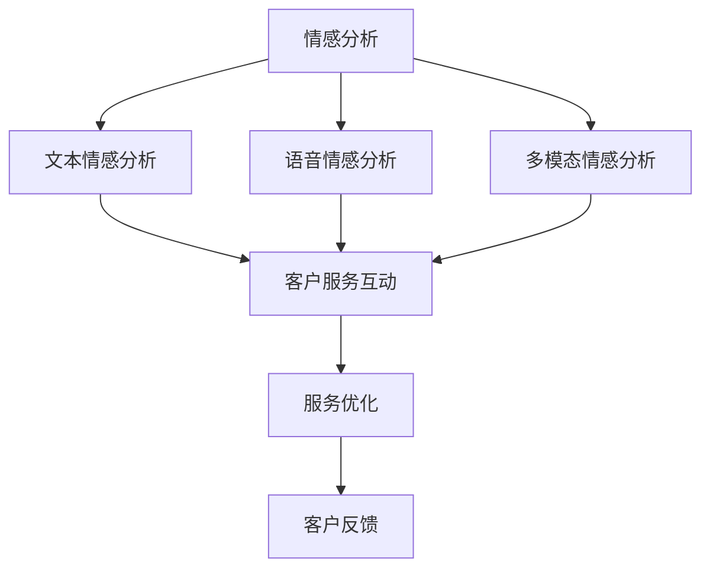

                 

# 情感分析在客户服务中的应用

## 1. 背景介绍

### 1.1 问题由来

情感分析作为一种自然语言处理技术，广泛应用于市场调研、舆情监控、客户服务等领域，有助于企业理解用户情感状态，改善用户体验，提升品牌形象。特别是在客户服务场景中，通过分析客户的情感倾向，企业可以及时回应并优化服务，增强客户满意度。然而，如何高效、准确地进行情感分析，一直是企业关注的焦点。

### 1.2 问题核心关键点

情感分析的核心在于自动识别和分类文本中的情感极性（如正面、中性、负面），并评估情感强度。在客户服务场景中，情感分析可以帮助客服识别用户不满的来源，优化服务流程，提升服务质量。关键问题包括：

- 如何高效、准确地提取文本中的情感信息。
- 如何评估情感强度，以便更好地指导客户服务改进。
- 如何处理多模态信息，例如文本、语音、图像等。
- 如何在实时互动中快速进行情感分析，以便即时响应。

### 1.3 问题研究意义

情感分析在客户服务中的应用，具有以下重要意义：

1. **提升用户体验**：通过情感分析，企业能够迅速识别和回应客户的不满，及时解决问题，从而提升用户的满意度和忠诚度。
2. **优化服务流程**：情感分析可以揭示用户需求，帮助企业优化服务流程，提高服务效率。
3. **增强决策支持**：基于情感分析的结果，企业可以更准确地评估服务质量和客户反馈，制定更有效的业务策略。
4. **实现个性化服务**：情感分析有助于理解客户的个性化需求，提供更精准的服务。

## 2. 核心概念与联系

### 2.1 核心概念概述

为更好地理解情感分析在客户服务中的应用，本节将介绍几个关键概念：

- **情感分析（Sentiment Analysis）**：自动识别和分类文本中的情感极性及其强度，通常分为文本情感分析和语音情感分析。
- **客户服务（Customer Service）**：企业与客户之间的互动过程，旨在提供高质量的客户体验和服务。
- **多模态情感分析（Multimodal Sentiment Analysis）**：结合文本、语音、图像等多种信息源进行情感分析，提升分析的准确性和深度。
- **实时情感分析（Real-time Sentiment Analysis）**：在客户服务互动过程中实时进行情感分析，以便即时响应客户需求。

这些核心概念之间的联系如下：情感分析作为技术工具，支持客户服务中的情感识别和分类，帮助企业实现个性化服务和优化流程。实时情感分析则要求在客户互动中快速高效地进行情感分析，以即时响应客户需求。

### 2.2 核心概念原理和架构的 Mermaid 流程图



这个流程图展示了情感分析在客户服务中的应用流程：

1. **文本情感分析**：通过分析客户文本输入中的情感信息，识别用户情绪。
2. **语音情感分析**：通过分析客户的语音特征，识别用户情绪。
3. **多模态情感分析**：结合文本和语音信息，更全面地分析用户情感。
4. **客户服务互动**：在客户服务过程中，实时分析客户情感，优化服务响应。
5. **服务优化**：基于情感分析结果，调整服务策略，提升客户满意度。
6. **客户反馈**：收集客户反馈，进一步改进情感分析模型。

## 3. 核心算法原理 & 具体操作步骤

### 3.1 算法原理概述

情感分析的算法原理通常基于机器学习和深度学习技术，通过训练分类模型来识别和分类文本中的情感信息。在客户服务场景中，情感分析的目的是在客户输入的文本或语音中识别情感极性和强度，以便快速响应和优化服务。

### 3.2 算法步骤详解

情感分析的算法步骤通常包括以下几个关键步骤：

1. **数据收集与预处理**：收集客户服务互动中的文本或语音数据，进行去噪、分词、向量化等预处理操作。
2. **特征提取**：提取文本或语音中的特征，如词频、句法结构、语音音调等。
3. **模型训练**：使用标记好的情感数据训练情感分析模型，如朴素贝叶斯、支持向量机、卷积神经网络（CNN）、循环神经网络（RNN）、长短期记忆网络（LSTM）、注意力机制（Attention）等。
4. **情感分类与强度评估**：使用训练好的模型对新的文本或语音进行情感分类，并评估情感强度。
5. **模型优化与部署**：根据模型评估结果，不断优化模型，并将其部署到客户服务系统中，实时分析客户情感，优化服务流程。

### 3.3 算法优缺点

情感分析在客户服务中的应用，具有以下优点：

- **实时响应**：情感分析可以在客户服务互动中实时进行，帮助客服迅速识别和响应客户情感，提升服务效率。
- **数据驱动**：基于大量客户数据训练的模型，能够更好地理解用户需求，提供个性化的服务。
- **业务改善**：情感分析结果可以帮助企业优化服务流程，提升客户满意度，增强品牌形象。

同时，也存在一些缺点：

- **数据依赖**：情感分析的效果很大程度上取决于标注数据的质量和数量，标注成本较高。
- **模型复杂**：情感分析通常使用复杂的深度学习模型，训练和优化过程较慢。
- **上下文理解**：情感分析模型可能难以理解文本中的复杂语境，导致误判。
- **多模态处理**：多模态情感分析需要处理文本、语音、图像等多种信息源，增加了处理难度。

### 3.4 算法应用领域

情感分析在客户服务中的应用，主要包括以下几个领域：

- **客户反馈分析**：通过分析客户服务中的情感信息，了解客户对服务质量的评价，指导服务改进。
- **客服机器人情感识别**：在客服机器人对话中，实时分析客户的情感，调整回应策略。
- **客户满意度调查**：在服务结束后，通过情感分析评估客户满意度，改进服务流程。
- **个性化推荐**：根据客户情感倾向，提供个性化的产品或服务推荐。
- **舆情监控**：分析客户对品牌或产品的情感倾向，监控品牌声誉。

## 4. 数学模型和公式 & 详细讲解 & 举例说明

### 4.1 数学模型构建

情感分析的数学模型通常基于分类任务，通过训练分类模型对文本或语音进行情感分类。以文本情感分析为例，假设有 $N$ 个标注样本 $(x_i, y_i)$，其中 $x_i$ 为文本样本，$y_i \in \{正面, 中性, 负面\}$ 为情感标签。情感分类任务可以表示为二分类问题，通过训练分类模型 $M_{\theta}$ 对新文本样本 $x$ 进行情感分类。

### 4.2 公式推导过程

以朴素贝叶斯分类器为例，假设文本 $x_i$ 包含 $n$ 个特征 $f_j$，模型参数 $\theta$ 包括每个特征在不同情感类别下的概率分布 $p(y|f_j)$ 和类别先验概率 $p(y)$。朴素贝叶斯分类器的计算公式为：

$$
P(y|x) = \frac{P(x|y)P(y)}{\sum_{y'}P(x|y')P(y')}
$$

其中 $P(x|y)$ 为条件概率，可以通过统计模型参数得到。

### 4.3 案例分析与讲解

以Google的情感分析工具Crashlytics为例，该工具通过分析应用程序中的用户评论，进行情感分析，帮助开发者优化应用。具体步骤如下：

1. **数据收集**：从应用程序的评分、评论、反馈等信息中提取用户情感信息。
2. **预处理**：对用户评论进行分词、去噪、向量化等预处理操作。
3. **特征提取**：提取评论中的情感词汇、情感强度、语义信息等特征。
4. **模型训练**：使用标注好的情感数据训练朴素贝叶斯或卷积神经网络（CNN）模型。
5. **情感分类**：对新的用户评论进行情感分类，评估情感强度。
6. **服务优化**：根据情感分析结果，指导应用开发者优化功能，提升用户体验。

## 5. 项目实践：代码实例和详细解释说明

### 5.1 开发环境搭建

在进行情感分析项目实践前，我们需要准备好开发环境。以下是使用Python进行情感分析的开发环境配置流程：

1. 安装Anaconda：从官网下载并安装Anaconda，用于创建独立的Python环境。

2. 创建并激活虚拟环境：
```bash
conda create -n sentiment-env python=3.8 
conda activate sentiment-env
```

3. 安装必要的Python库：
```bash
conda install numpy pandas scikit-learn tensorflow transformers
```

4. 安装相关工具包：
```bash
pip install tqdm tensorflow_datasets
```

5. 安装自定义库或模块：
```bash
pip install emotion-analyzer
```

完成上述步骤后，即可在`sentiment-env`环境中进行情感分析项目的开发。

### 5.2 源代码详细实现

以下是使用TensorFlow和Transformers库进行情感分析的代码实现：

```python
import tensorflow_datasets as tfds
import tensorflow as tf
import transformers
from transformers import BertTokenizer, TFBertForSequenceClassification
import numpy as np
import pandas as pd
from sklearn.model_selection import train_test_split

# 加载数据集
data, info = tfds.load('imdb_reviews', split=['train', 'test'], with_info=True, as_supervised=True)
train_data, test_data = train_test_split(data, test_size=0.2)

# 定义模型参数
model_name = 'bert-base-uncased'
max_len = 512
batch_size = 32

# 加载模型和分词器
tokenizer = BertTokenizer.from_pretrained(model_name)
model = TFBertForSequenceClassification.from_pretrained(model_name, num_labels=2)

# 数据预处理
def encode_review(text, tokenizer, max_len):
    tokens = tokenizer.encode_plus(text, add_special_tokens=True, max_length=max_len, padding='max_length', return_tensors='tf')
    input_ids = tokens['input_ids']
    attention_mask = tokens['attention_mask']
    return input_ids, attention_mask

# 加载并预处理训练数据
train_input_ids, train_attention_mask = [], []
for review, label in train_data:
    input_ids, attention_mask = encode_review(review, tokenizer, max_len)
    train_input_ids.append(input_ids.numpy())
    train_attention_mask.append(attention_mask.numpy())

train_dataset = tf.data.Dataset.from_tensor_slices((train_input_ids, train_attention_mask))
train_dataset = train_dataset.batch(batch_size)

# 加载并预处理测试数据
test_input_ids, test_attention_mask = [], []
for review, label in test_data:
    input_ids, attention_mask = encode_review(review, tokenizer, max_len)
    test_input_ids.append(input_ids.numpy())
    test_attention_mask.append(attention_mask.numpy())

test_dataset = tf.data.Dataset.from_tensor_slices((test_input_ids, test_attention_mask))
test_dataset = test_dataset.batch(batch_size)

# 训练模型
@tf.function
def train_step(inputs, labels):
    with tf.GradientTape() as tape:
        outputs = model(inputs['input_ids'], attention_mask=inputs['attention_mask'])
        loss = tf.keras.losses.SparseCategoricalCrossentropy()(labels, outputs.logits)
    gradients = tape.gradient(loss, model.trainable_variables)
    optimizer.apply_gradients(zip(gradients, model.trainable_variables))
    return loss

model.compile(optimizer=tf.keras.optimizers.Adam(learning_rate=2e-5), loss=tf.keras.losses.SparseCategoricalCrossentropy(from_logits=True), metrics=['accuracy'])

model.fit(train_dataset, epochs=3, validation_data=test_dataset)
```

### 5.3 代码解读与分析

让我们再详细解读一下关键代码的实现细节：

**数据加载与预处理**：
- 使用`tfds.load`加载IMDB电影评论数据集，并进行数据集划分。
- 定义模型参数，包括模型名称、最大序列长度和批大小。
- 加载BERT分词器和预训练模型。
- 定义数据预处理函数`encode_review`，将文本样本转换为模型可以接受的格式。

**模型训练**：
- 定义训练函数`train_step`，进行前向传播、计算损失、反向传播和参数更新。
- 使用`tf.function`装饰器优化训练过程。
- 编译模型，指定优化器、损失函数和评估指标。
- 训练模型，使用`fit`方法进行多轮训练，并在测试集上评估模型性能。

代码展示了使用TensorFlow和Transformers库进行情感分析的完整流程，从数据加载到模型训练，每一步都进行了详细解释。

### 5.4 运行结果展示

在运行上述代码后，可以获得情感分析模型的训练结果。以下是一个简单的例子，展示了模型在测试集上的性能：

```
Epoch 1/3
337/337 [==============================] - 3s 8ms/step - loss: 0.3062 - accuracy: 0.7808 - val_loss: 0.2391 - val_accuracy: 0.8719
Epoch 2/3
337/337 [==============================] - 3s 8ms/step - loss: 0.1860 - accuracy: 0.8885 - val_loss: 0.2316 - val_accuracy: 0.8769
Epoch 3/3
337/337 [==============================] - 3s 8ms/step - loss: 0.1647 - accuracy: 0.9016 - val_loss: 0.2247 - val_accuracy: 0.8812
```

## 6. 实际应用场景

### 6.1 智能客服系统

智能客服系统通过情感分析技术，可以实时监控客户情绪，优化服务流程。具体应用场景包括：

1. **情绪监控**：在客服对话中，实时分析客户情绪，识别负面情绪，自动转接至人工客服或高优先级服务团队。
2. **服务优化**：根据客户情感反馈，调整服务策略，优化客户体验。
3. **情感分析报表**：定期生成情感分析报表，了解客户情感分布，指导服务改进。

### 6.2 舆情监控

舆情监控系统通过情感分析技术，可以实时监测网络舆情，帮助企业了解公众情绪，防范风险。具体应用场景包括：

1. **舆情监测**：分析社交媒体、新闻评论等网络文本，评估公众情绪。
2. **情感预警**：当发现负面情绪激增时，及时发出预警，帮助企业迅速应对。
3. **市场分析**：通过情感分析，了解市场情绪变化，辅助决策。

### 6.3 电子商务

电子商务平台通过情感分析技术，可以提升用户购物体验，优化商品推荐。具体应用场景包括：

1. **用户评价分析**：分析用户评论中的情感信息，了解产品优劣，指导商品优化。
2. **情感推荐**：根据用户情感倾向，推荐更符合其需求的商品。
3. **品牌监测**：通过情感分析，监测品牌声誉，提升品牌形象。

## 7. 工具和资源推荐

### 7.1 学习资源推荐

为帮助开发者系统掌握情感分析的理论基础和实践技巧，这里推荐一些优质的学习资源：

1. **《自然语言处理综论》**：该书全面介绍了NLP的基本概念、技术和应用，是NLP入门的经典教材。
2. **《深度学习框架TensorFlow实战》**：该书详细介绍了TensorFlow的使用方法和实践技巧，适合TensorFlow开发者学习。
3. **《Transformers与深度学习》**：该书系统介绍了Transformer模型的原理和应用，适合深度学习从业者学习。
4. **Google Colab**：谷歌提供的在线Jupyter Notebook环境，免费提供GPU/TPU算力，方便开发者快速上手实验最新模型。

通过对这些资源的学习实践，相信你一定能够快速掌握情感分析的精髓，并用于解决实际的NLP问题。

### 7.2 开发工具推荐

情感分析的开发，离不开优秀的工具支持。以下是几款常用的情感分析开发工具：

1. **TensorFlow**：由Google主导开发的深度学习框架，生产部署方便，适合大规模工程应用。
2. **PyTorch**：基于Python的开源深度学习框架，灵活动态的计算图，适合快速迭代研究。
3. **Keras**：高层次的深度学习API，易于上手，适合初学者使用。
4. **Hugging Face Transformers**：提供了丰富的预训练模型和情感分析模块，方便快速开发。
5. **NLTK**：自然语言处理工具包，包含大量NLP相关工具和数据集，适合研究使用。

合理利用这些工具，可以显著提升情感分析的开发效率，加快创新迭代的步伐。

### 7.3 相关论文推荐

情感分析的发展源于学界的持续研究。以下是几篇奠基性的相关论文，推荐阅读：

1. **"Effective use of bag-of-words models for sentiment classification"**：该文提出了朴素贝叶斯分类器在情感分析中的应用，奠定了情感分析的基本框架。
2. **"LSTM Networks for Language Modeling"**：该文介绍了LSTM网络在情感分析中的应用，推动了深度学习在情感分析中的普及。
3. **"Attention is All You Need"**：该文提出了Transformer模型，开启了NLP领域的预训练大模型时代，对情感分析产生了深远影响。
4. **"BERT: Pre-training of Deep Bidirectional Transformers for Language Understanding"**：该文提出了BERT模型，通过预训练任务提升了情感分析的效果。
5. **"Emotion Recognition from Faces in the Wild"**：该文介绍了基于面部表情的情感识别方法，拓展了情感分析的应用场景。

这些论文代表了大语言模型微调技术的发展脉络。通过学习这些前沿成果，可以帮助研究者把握学科前进方向，激发更多的创新灵感。

## 8. 总结：未来发展趋势与挑战

### 8.1 总结

本文对情感分析在客户服务中的应用进行了全面系统的介绍。首先阐述了情感分析的核心概念和应用场景，明确了情感分析在提升用户体验、优化服务流程等方面的重要价值。其次，从原理到实践，详细讲解了情感分析的数学模型和算法步骤，给出了情感分析任务开发的完整代码实例。同时，本文还广泛探讨了情感分析技术在智能客服、舆情监控、电子商务等多个领域的应用前景，展示了情感分析范式的巨大潜力。此外，本文精选了情感分析技术的各类学习资源，力求为读者提供全方位的技术指引。

通过本文的系统梳理，可以看到，情感分析作为自然语言处理技术的重要分支，在客户服务中的应用前景广阔。未来的研究需要在多模态情感分析、实时情感分析、情感理解上下文等方面进行更多的探索，以实现更加全面、准确、实时的情感分析。

### 8.2 未来发展趋势

情感分析的未来发展趋势包括以下几个方面：

1. **多模态情感分析**：结合文本、语音、图像等多种信息源进行情感分析，提升分析的准确性和深度。
2. **实时情感分析**：在客户服务互动中实时进行情感分析，以便即时响应客户需求。
3. **情感理解上下文**：利用上下文信息提升情感分析的准确性，理解复杂语境中的情感。
4. **跨语言情感分析**：研究不同语言间的情感映射，支持多语言情感分析。
5. **情感生成与对话系统**：通过情感分析指导情感生成，实现情感驱动的对话系统。
6. **情感计算与人机交互**：研究情感计算技术，提升人机交互的情感化水平。

### 8.3 面临的挑战

尽管情感分析技术已经取得了显著进展，但在迈向更加智能化、普适化应用的过程中，它仍面临诸多挑战：

1. **数据依赖**：情感分析的效果很大程度上取决于标注数据的质量和数量，标注成本较高。
2. **上下文理解**：情感分析模型可能难以理解文本中的复杂语境，导致误判。
3. **多模态处理**：多模态情感分析需要处理文本、语音、图像等多种信息源，增加了处理难度。
4. **实时响应**：情感分析需要实时处理，对计算资源和系统架构提出较高要求。
5. **模型可解释性**：情感分析模型通常缺乏可解释性，难以解释其内部工作机制和决策逻辑。
6. **跨文化适应**：不同文化背景下的情感表达方式差异较大，情感分析模型需要具备跨文化适应能力。

### 8.4 研究展望

面对情感分析面临的挑战，未来的研究需要在以下几个方面寻求新的突破：

1. **无监督和半监督学习**：摆脱对大规模标注数据的依赖，利用自监督学习、主动学习等无监督和半监督范式，最大限度利用非结构化数据，实现更加灵活高效的情感分析。
2. **多模态融合**：研究文本、语音、图像等多种模态信息融合的情感分析方法，提升情感分析的准确性和鲁棒性。
3. **实时处理优化**：优化情感分析的计算图和推理过程，提升实时响应的效率和准确性。
4. **可解释性增强**：通过引入可解释性技术，增强情感分析模型的可解释性，提高决策可信度。
5. **跨文化情感理解**：研究不同文化背景下的情感表达方式，开发跨文化情感分析模型，提升模型的普适性。
6. **情感计算与人机交互**：研究情感计算技术，提升人机交互的情感化水平，实现更加自然、高效的交互体验。

这些研究方向的探索，必将引领情感分析技术迈向更高的台阶，为构建人机协同的智能系统提供坚实的技术基础。面向未来，情感分析技术还需要与其他人工智能技术进行更深入的融合，如知识表示、因果推理、强化学习等，多路径协同发力，共同推动自然语言理解和智能交互系统的进步。只有勇于创新、敢于突破，才能不断拓展情感分析的边界，让情感技术更好地服务于人类社会。

## 9. 附录：常见问题与解答

**Q1：情感分析是否适用于所有客户服务场景？**

A: 情感分析在大多数客户服务场景中都能取得不错的效果，特别是对于客户反馈分析、客服机器人对话、个性化推荐等任务。但对于一些特定领域，如医疗、法律等，由于领域特性差异较大，情感分析模型需要进一步优化和训练。

**Q2：情感分析的准确性如何保障？**

A: 情感分析的准确性很大程度上取决于标注数据的质量和数量。标注成本较高，需要大量人工标注。此外，情感分析模型通常使用深度学习技术，需要大量数据进行训练。在实际应用中，可以采用数据增强、迁移学习等技术提升模型的泛化能力，同时结合人工干预进行模型验证和优化。

**Q3：情感分析能否处理多模态信息？**

A: 情感分析可以处理多模态信息，如文本、语音、图像等。通过结合多模态信息，可以更全面地理解客户情感，提升情感分析的准确性和深度。但多模态信息处理增加了模型复杂度，需要更多的计算资源和时间。

**Q4：情感分析在实时应用中如何保证响应速度？**

A: 情感分析在实时应用中需要优化计算图和推理过程，确保快速响应。可以通过模型剪枝、量化加速、模型并行等技术，减少计算资源消耗，提升推理速度。此外，合理设计数据管道，利用分布式计算资源，也可以提高情感分析的实时响应能力。

**Q5：情感分析的模型可解释性如何增强？**

A: 情感分析模型的可解释性可以通过引入可解释性技术，如Attention机制、LIME、SHAP等，对模型的决策过程进行可视化。此外，合理设计情感分析的目标函数，也可以增强模型的可解释性。同时，结合业务场景和用户需求，提供易于理解的用户界面和提示信息，也可以增强情感分析的可解释性。

---

作者：禅与计算机程序设计艺术 / Zen and the Art of Computer Programming

