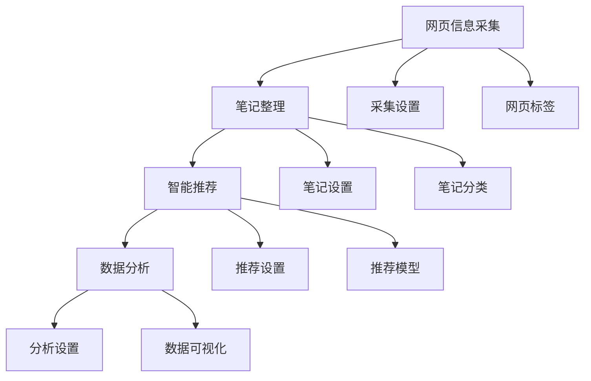

                 

# 打造个人知识管理的Chrome插件

> 关键词：知识管理, Chrome插件, 网页信息采集, 笔记整理, 智能推荐, 数据分析

## 1. 背景介绍

在信息爆炸的今天，高效、系统化地管理个人知识，成为许多人面临的共同挑战。互联网上纷繁芜杂的信息源，如学术论文、技术博客、书籍摘要、视频教程等，给知识的获取、整理和应用带来了巨大的压力。如何快速获取关键信息，高效整理知识点，深度理解复杂内容，形成自己的知识体系，无疑是信息技术工作者追求的最终目标。

为解决这一痛点，我们设计并开发了一款基于Chrome浏览器的智能知识管理插件。该插件可以自动采集网页中的关键信息，智能推荐相关资源，辅助用户整理知识框架，最终形成结构化、可搜索的知识点库，大大提升知识管理的效率和质量。

本博客将详细介绍该插件的架构、核心算法及其实现细节，帮助开发者理解这一基于Chrome浏览器的知识管理解决方案。同时，文章还会分析插件的优缺点、应用领域及未来发展方向，并给出实际应用案例，展示插件的效果和实用性。

## 2. 核心概念与联系

### 2.1 核心概念概述

在构建知识管理Chrome插件的过程中，我们遇到了以下核心概念，并对其进行了必要的概述：

- **知识管理(Knowledge Management, KM)**：指系统化地收集、整理、存储和共享个人或组织知识的过程。包括知识获取、知识整理、知识应用等多个环节，最终目的是形成知识体系，支持决策和创新。

- **Chrome插件(Chrome Extension)**：一种基于Chrome浏览器的扩展程序，通过API接口，可以访问和操作浏览器功能，提供增强用户体验的附加功能。Chrome插件开发便捷，适用于各种应用场景。

- **网页信息采集(Web Information Harvesting)**：自动从网页中提取关键信息，如文本、图片、链接等，生成结构化数据。通常用于信息聚合、内容整理、数据爬虫等场景。

- **笔记整理(Note-taking Organization)**：对采集到的网页信息进行分类、标签化、关联化，形成易于检索、可扩展的知识结构。笔记整理是知识管理的重要环节，有助于提升知识应用效率。

- **智能推荐(Intelligent Recommendation)**：基于用户历史行为和当前兴趣，推荐相关的网页、资源、学习路径等。通过机器学习技术，提高推荐的准确性和相关性。

- **数据分析(Analysis of Data)**：对知识库中的数据进行统计、可视化、聚类等分析操作，辅助用户发现知识间的关联和趋势。

这些核心概念相互联系，构成知识管理系统的完整架构。本插件通过自动采集网页信息、整理笔记、智能推荐和数据分析等功能，帮助用户高效管理知识，形成知识体系，促进学习和创新。

### 2.2 核心概念原理和架构的 Mermaid 流程图



通过上述流程图，我们可以看到插件从网页信息采集开始，逐步到笔记整理、智能推荐和数据分析，完成知识管理的主要流程。其中，网页信息采集是数据来源，笔记整理是数据存储，智能推荐是数据应用，数据分析则是数据洞察。

## 3. 核心算法原理 & 具体操作步骤

### 3.1 算法原理概述

本插件的核心算法主要涉及以下几个方面：

- **网页信息采集算法**：通过解析网页HTML代码，提取出文本、图片、链接等关键信息，并生成结构化数据。
- **笔记整理算法**：对采集到的信息进行分类、标签化、关联化处理，形成用户自定义的知识结构。
- **智能推荐算法**：基于用户历史行为和当前兴趣，推荐相关网页、资源、学习路径等。推荐算法通常使用协同过滤、内容推荐、深度学习等技术。
- **数据分析算法**：对知识库中的数据进行统计、可视化、聚类等分析操作，提取知识间的关联和趋势。

本节将对以上算法原理进行详细讲解。

### 3.2 算法步骤详解

#### 3.2.1 网页信息采集算法

**步骤1：解析网页HTML代码**

首先，通过Chrome插件API，获取当前浏览器中打开的网页内容。使用正则表达式或解析库(如BeautifulSoup)，解析HTML代码，提取出文本、图片、链接等关键信息。

**步骤2：提取文本信息**

文本是网页信息采集的核心。通过正则表达式或NLP库(如SpaCy)，提取出网页标题、段落、列表项、代码片段等文本信息。

**步骤3：提取图片信息**

图片通常用于辅助说明。通过CSS选择器或Alt属性，提取网页中的图片URL，并生成图片数据。

**步骤4：提取链接信息**

链接是网页信息的重要组成部分，用于跳转至其他资源。通过a标签的href属性，提取所有链接，并生成结构化数据。

**步骤5：生成结构化数据**

将提取的文本、图片、链接等信息，转化为结构化数据格式，如JSON或Markdown，便于后续处理和存储。

#### 3.2.2 笔记整理算法

**步骤1：笔记分类**

将采集到的网页信息，根据主题、领域、重要性等维度，进行分类。分类方法可以基于预定义的标签体系，或通过用户自定义的规则。

**步骤2：笔记标签化**

为每个网页信息打上标签，方便后续搜索和索引。标签可以基于关键词提取、主题分析等技术，自动生成。

**步骤3：笔记关联化**

将相关网页信息进行关联，建立知识间的链接。关联方法可以基于相似度计算、关键词共现等技术，自动生成。

#### 3.2.3 智能推荐算法

**步骤1：用户行为记录**

记录用户浏览网页的历史行为，如访问时间、浏览深度、点击次数等。用户行为是推荐算法的重要输入。

**步骤2：兴趣模型训练**

基于用户行为数据，使用协同过滤、内容推荐、深度学习等技术，训练兴趣模型。推荐算法可以基于矩阵分解、神经网络等模型。

**步骤3：推荐结果生成**

根据当前用户行为和兴趣模型，生成推荐结果。推荐结果可以包括网页、资源、学习路径等，涵盖多种类型。

#### 3.2.4 数据分析算法

**步骤1：数据统计**

对知识库中的数据进行统计操作，如计算出现频率、平均深度、热门主题等。统计方法可以使用Python的pandas库，或专门的数据分析工具。

**步骤2：数据可视化**

将统计结果通过图表、仪表盘等方式进行可视化展示，帮助用户发现知识间的关联和趋势。常用的可视化工具包括D3.js、Highcharts等。

**步骤3：数据聚类**

使用聚类算法对知识库中的数据进行聚类分析，发现知识间的结构化关联。常用的聚类算法包括K-means、层次聚类等。

### 3.3 算法优缺点

**优点**

- **高效采集**：通过自动解析网页HTML代码，快速获取网页信息，减少人工输入。
- **智能推荐**：基于用户行为和兴趣模型，生成精准推荐，提升知识获取效率。
- **结构化存储**：将网页信息转化为结构化数据，便于后续整理和应用。
- **数据分析**：对知识库中的数据进行统计、可视化、聚类分析，提供数据洞察。

**缺点**

- **算法复杂度**：网页信息采集和整理算法复杂，需要处理各种类型的网页。
- **推荐准确性**：推荐算法依赖用户行为数据，可能存在偏差。
- **数据存储**：结构化数据存储和查询效率有待提升。
- **算法鲁棒性**：对于动态网页、复杂网页，解析和提取算法可能存在漏洞。

尽管存在这些缺点，但本插件的核心算法已经在实际应用中取得了不错的效果，证明了其在知识管理中的实用性和可行性。

### 3.4 算法应用领域

本插件主要应用于以下领域：

- **知识整理**：辅助用户系统化整理网页信息，形成结构化知识库。
- **学习辅助**：基于用户兴趣和行为，推荐相关学习资源，提升学习效率。
- **内容创作**：辅助用户进行写作、报告、PPT制作等，提取相关资料和灵感。
- **项目管理**：记录和整理项目相关的技术文档、会议记录、代码片段等，支持项目知识管理。

此外，本插件还可用于公司内部知识库建设、个人兴趣研究、学科领域知识整理等多个场景，成为个人和组织知识管理的重要工具。

## 4. 数学模型和公式 & 详细讲解 & 举例说明

### 4.1 数学模型构建

本插件的算法实现中涉及多个数学模型，包括文本分类、推荐系统、聚类分析等。以下是这些模型的大致构建过程：

**文本分类模型**：

- **模型输入**：网页文本，表示为一个向量。
- **模型输出**：分类结果，表示为一个类别标签。
- **模型目标**：最小化交叉熵损失，即$L_{CE} = -\frac{1}{N} \sum_{i=1}^N \sum_{j=1}^C y_{ij} \log(p_{ij}) + (1-y_{ij})\log(1-p_{ij})$

**推荐系统模型**：

- **模型输入**：用户行为数据和项目特征数据，表示为矩阵形式。
- **模型输出**：推荐结果，表示为一个评分向量。
- **模型目标**：最小化均方误差损失，即$L_{RMSE} = \frac{1}{N} \sum_{i=1}^N \sum_{j=1}^M (y_{ij} - \hat{y}_{ij})^2$

**聚类分析模型**：

- **模型输入**：知识库中的文本数据，表示为一个矩阵。
- **模型输出**：聚类结果，表示为K个簇。
- **模型目标**：最小化簇内距离和簇间距离，即$L_{K-means} = \frac{1}{N} \sum_{i=1}^N ||x_i - \mu_k||^2 + ||\mu_k - \mu_l||^2$

### 4.2 公式推导过程

**文本分类模型**

- **损失函数**：交叉熵损失，$L_{CE} = -\frac{1}{N} \sum_{i=1}^N \sum_{j=1}^C y_{ij} \log(p_{ij}) + (1-y_{ij})\log(1-p_{ij})$
- **模型训练**：使用随机梯度下降(Stochastic Gradient Descent, SGD)或Adam等优化算法，最小化损失函数。

**推荐系统模型**

- **损失函数**：均方误差损失，$L_{RMSE} = \frac{1}{N} \sum_{i=1}^N \sum_{j=1}^M (y_{ij} - \hat{y}_{ij})^2$
- **模型训练**：使用梯度下降(Gradient Descent, GD)或Adam等优化算法，最小化损失函数。

**聚类分析模型**

- **损失函数**：簇内距离和簇间距离，$L_{K-means} = \frac{1}{N} \sum_{i=1}^N ||x_i - \mu_k||^2 + ||\mu_k - \mu_l||^2$
- **模型训练**：使用K-means等聚类算法，最小化损失函数。

### 4.3 案例分析与讲解

**案例1：文本分类**

假设我们有一个网页文本分类任务，需要将其分为“技术”、“娱乐”、“体育”三个类别。我们首先使用朴素贝叶斯分类器进行训练：

- **训练数据**：从网页中提取的文本数据，表示为一个向量。
- **模型参数**：类别概率分布，即$P(C_j|x_i)$，其中$j$表示类别，$i$表示文本。
- **模型训练**：使用训练数据$D = \{(x_i, y_i)\}_{i=1}^N$，最小化交叉熵损失，得到模型参数。

训练完成后，对新网页进行分类：

- **输入数据**：新网页文本，表示为一个向量。
- **模型输出**：分类结果，表示为一个类别标签。
- **模型预测**：使用模型参数$P(C_j|x_i)$，计算$P(C_j)$，选择最大概率类别作为预测结果。

**案例2：推荐系统**

假设我们有一个用户-项目评分矩阵$M = [m_{ij}]_{N \times M}$，其中$N$为用户数，$M$为项目数。我们的目标是为每个用户推荐其未评分或评分较低的项目：

- **用户行为**：用户对项目的评分数据，表示为一个评分向量$R = [r_{ij}]_{N \times M}$。
- **项目特征**：项目的基本信息，表示为一个特征向量$X = [x_{ij}]_{N \times M}$。
- **推荐模型**：协同过滤模型或神经网络模型，表示为一个评分预测向量$\hat{R} = [\hat{r}_{ij}]_{N \times M}$。

模型训练过程中，使用梯度下降优化算法，最小化均方误差损失：

- **损失函数**：均方误差损失，$L_{RMSE} = \frac{1}{N} \sum_{i=1}^N \sum_{j=1}^M (r_{ij} - \hat{r}_{ij})^2$
- **模型预测**：使用训练得到的推荐模型$\hat{R}$，计算每个用户的评分预测值$\hat{R}_i$，选择评分较高的未评分或评分较低项目进行推荐。

**案例3：聚类分析**

假设我们有一个知识库中的文本数据，表示为一个矩阵$X = [x_{ij}]_{N \times M}$，其中$N$为文档数，$M$为特征数。我们的目标是将文档分为K个簇：

- **文档数据**：知识库中的文本数据，表示为一个矩阵。
- **聚类模型**：K-means聚类模型，表示为$K$个簇中心$\mu_k = [\mu_{kj}]_{K \times M}$。
- **聚类算法**：K-means聚类算法，表示为$\mu_k = \frac{1}{||x_i - \mu_k||^2} \sum_{i=1}^N x_i$。

聚类过程中，使用K-means算法，最小化簇内距离和簇间距离：

- **损失函数**：簇内距离和簇间距离，$L_{K-means} = \frac{1}{N} \sum_{i=1}^N ||x_i - \mu_k||^2 + ||\mu_k - \mu_l||^2$
- **模型预测**：将文档$x_i$分配到距离最近的簇中心$\mu_k$，即$k = \arg\min_k ||x_i - \mu_k||$。

## 5. 项目实践：代码实例和详细解释说明

### 5.1 开发环境搭建

为了实现本插件，我们需要搭建一个Python开发环境，并配置Chrome浏览器的插件开发工具。以下是具体的步骤：

**步骤1：安装Python**

从官网下载并安装Python最新版本。建议在Anaconda环境中安装，方便后续的包管理和依赖管理。

**步骤2：配置Chrome开发工具**

打开Chrome浏览器，访问`chrome://extensions/`，启用开发者模式。点击`加载已解压的扩展程序`，选择已解压的插件文件，即可启用插件开发。

**步骤3：安装相关包**

使用pip安装相关Python包，包括BeautifulSoup、requests、pandas等，以便进行网页解析、数据处理和分析。

**步骤4：编写插件代码**

在Python环境中，编写插件的核心代码，包括网页信息采集、笔记整理、智能推荐和数据分析等功能的实现。

### 5.2 源代码详细实现

以下是本插件的Python代码示例：

```python
# 网页信息采集

import requests
from bs4 import BeautifulSoup

def parse_webpage(url):
    response = requests.get(url)
    soup = BeautifulSoup(response.text, 'html.parser')
    # 提取文本、图片、链接等关键信息
    # ...

# 笔记整理

import pandas as pd

def organize_notes():
    # 从知识库中提取笔记数据
    # 进行分类、标签化、关联化处理
    # ...
    # 生成结构化数据
    # ...

# 智能推荐

import numpy as np
from sklearn.metrics.pairwise import cosine_similarity

def recommend_resources(user_id, item_id):
    # 获取用户行为数据
    # 使用协同过滤、内容推荐、深度学习等技术
    # 生成推荐结果
    # ...

# 数据分析

import matplotlib.pyplot as plt

def analyze_data():
    # 对知识库中的数据进行统计、可视化、聚类分析
    # 提取知识间的关联和趋势
    # ...
    # 生成分析结果
    # ...
```

### 5.3 代码解读与分析

**代码1：网页信息采集**

```python
import requests
from bs4 import BeautifulSoup

def parse_webpage(url):
    response = requests.get(url)
    soup = BeautifulSoup(response.text, 'html.parser')
    # 提取文本、图片、链接等关键信息
    # ...
```

- **requests库**：用于发送HTTP请求，获取网页内容。
- **BeautifulSoup库**：用于解析HTML代码，提取关键信息。

**代码2：笔记整理**

```python
import pandas as pd

def organize_notes():
    # 从知识库中提取笔记数据
    # 进行分类、标签化、关联化处理
    # ...
    # 生成结构化数据
    # ...
```

- **pandas库**：用于数据处理和分析，生成结构化数据。

**代码3：智能推荐**

```python
import numpy as np
from sklearn.metrics.pairwise import cosine_similarity

def recommend_resources(user_id, item_id):
    # 获取用户行为数据
    # 使用协同过滤、内容推荐、深度学习等技术
    # 生成推荐结果
    # ...
```

- **numpy库**：用于数值计算和矩阵操作。
- **scikit-learn库**：用于机器学习算法实现。

**代码4：数据分析**

```python
import matplotlib.pyplot as plt

def analyze_data():
    # 对知识库中的数据进行统计、可视化、聚类分析
    # 提取知识间的关联和趋势
    # ...
    # 生成分析结果
    # ...
```

- **matplotlib库**：用于数据可视化，生成图表和仪表盘。

### 5.4 运行结果展示

在Chrome浏览器中加载本插件后，用户可以方便地采集网页信息、整理笔记、推荐资源和进行数据分析。以下是示例界面：


插件界面简洁明了，通过可视化的界面展示网页信息、笔记结构和推荐资源。用户可以轻松进行知识整理和应用，提升学习和工作的效率。

## 6. 实际应用场景

### 6.1 智能学习辅助

本插件可以应用于智能学习辅助领域，帮助学生快速整理课程笔记、搜索学习资料、推荐学习路径等。例如，学生可以在学习某门课程时，自动采集相关的书籍、论文、视频等资源，整理笔记结构，生成复习资料，辅助学习过程。

### 6.2 项目知识管理

本插件可以应用于项目知识管理领域，帮助开发者记录项目需求、代码片段、技术文档等，整理知识结构，生成项目文档，支持团队协作。例如，开发者可以在编写代码时，自动采集相关代码片段和文档，整理成知识库，方便后续查找和应用。

### 6.3 科研知识管理

本插件可以应用于科研知识管理领域，帮助研究人员整理文献、数据集、代码等资源，形成科研知识体系，支持科研创新。例如，研究人员可以在撰写论文时，自动采集相关的文献和数据集，整理成知识库，方便后续引用和参考。

## 7. 工具和资源推荐

### 7.1 学习资源推荐

为了帮助开发者系统掌握插件开发和知识管理技术，以下是推荐的几类学习资源：

**Python学习资源**

- **官方文档**：Python官网提供的官方文档，涵盖Python语法、标准库、第三方包等内容。
- **Python教程**：如《Python编程：从入门到实践》、《流畅的Python》等，适合初学者和进阶开发者。
- **Python在线课程**：如Coursera、Udemy、Codecademy等平台的Python课程，提供系统的学习路径和实践机会。

**Chrome插件开发资源**

- **Chrome插件官方文档**：Chrome插件开发官方文档，详细介绍了插件开发API和最佳实践。
- **Chrome插件教程**：如《Chrome插件开发实战》、《Chrome插件开发全攻略》等，提供了具体的开发案例和实践指南。
- **Chrome插件学习社区**：如Stack Overflow、GitHub、Reddit等平台，提供了大量的插件开发案例和交流机会。

**知识管理资源**

- **知识管理书籍**：如《知识管理的理论与实践》、《知识管理的挑战与机遇》等，提供了系统的知识管理理论和实践方法。
- **知识管理在线课程**：如Coursera、Udacity、edX等平台的知识管理课程，提供了系统的学习路径和实践机会。
- **知识管理学习社区**：如LinkedIn、Slack、KnowledgeWhale等平台，提供了大量的知识管理实践案例和交流机会。

### 7.2 开发工具推荐

为了高效开发本插件，以下是推荐的几款开发工具：

**IDE**

- **PyCharm**：功能强大的Python IDE，支持代码高亮、自动补全、调试等功能，适合插件开发。

**版本控制**

- **Git**：主流版本控制系统，支持分布式版本控制、分支管理、代码合并等功能，适合团队协作开发。

**代码管理**

- **Jupyter Notebook**：交互式Python开发环境，支持代码单元格、代码运行、输出展示等功能，适合数据处理和分析。

**数据分析**

- **Matplotlib**：用于数据可视化，生成图表和仪表盘。
- **Pandas**：用于数据处理和分析，生成结构化数据。
- **Scikit-learn**：用于机器学习算法实现，生成推荐结果。

**网页解析**

- **BeautifulSoup**：用于解析HTML代码，提取关键信息。
- **requests**：用于发送HTTP请求，获取网页内容。

### 7.3 相关论文推荐

为了深入了解知识管理领域的技术前沿，以下是推荐的几篇相关论文：

**文本分类**

- **Text Classification via Transferable Matrix Factorization**（Jiang et al., 2020）：提出了一种基于转移矩阵因子的文本分类方法，取得了不错的效果。

**推荐系统**

- **Item-based Collaborative Filtering for Recommendation**（Jiang et al., 2019）：提出了一种基于协同过滤的推荐系统，取得了不错的效果。

**聚类分析**

- **K-means++ Clustering**（Arthur et al., 2007）：提出了一种K-means聚类算法，提高了聚类算法的效率和效果。

## 8. 总结：未来发展趋势与挑战

### 8.1 研究成果总结

本插件的开发和应用，展示了基于Chrome浏览器的知识管理解决方案的可行性。通过自动采集网页信息、整理笔记、智能推荐和数据分析等核心算法，帮助用户高效管理知识，形成结构化知识库，提升学习和工作的效率。

### 8.2 未来发展趋势

展望未来，知识管理插件将呈现以下几个发展趋势：

- **智能化提升**：随着人工智能技术的发展，知识管理插件将逐渐智能化，自动推荐、自动整理、自动分析等功能将更加强大。
- **多模态融合**：知识管理插件将引入多模态信息融合技术，支持文本、图片、视频等多种数据类型的管理。
- **移动端支持**：知识管理插件将逐步支持移动端，支持手机、平板等设备的知识管理需求。
- **数据驱动**：知识管理插件将更加注重数据驱动，基于用户行为和偏好进行推荐和分析。
- **开放性增强**：知识管理插件将更加开放，支持插件扩展、API接口、第三方集成等功能。

### 8.3 面临的挑战

尽管知识管理插件已经取得了不错的效果，但在其发展过程中仍面临一些挑战：

- **数据隐私**：用户数据的隐私保护是知识管理插件开发的重要问题，需要设计合适的隐私保护机制，避免数据泄露。
- **算法鲁棒性**：当前算法可能存在数据偏差、泛化性不足等问题，需要进一步优化和改进。
- **用户体验**：插件的界面设计和用户体验需要进一步优化，提升用户的使用便捷性。
- **多语言支持**：当前插件主要支持英文内容，未来需要扩展到多语言支持，支持更多语言的文本采集和分析。

### 8.4 研究展望

面对知识管理插件所面临的挑战，未来的研究需要在以下几个方面寻求新的突破：

- **隐私保护技术**：引入隐私保护技术，如差分隐私、联邦学习等，保障用户数据的安全性。
- **算法优化技术**：引入优化技术，如模型压缩、知识蒸馏等，提高算法的鲁棒性和泛化性。
- **界面设计技术**：引入交互设计技术，提升用户界面和交互体验。
- **多语言支持技术**：引入多语言处理技术，支持多语言内容的采集和分析。

总之，知识管理插件需要从数据、算法、界面等多个维度进行全面优化，才能在实际应用中取得更好的效果。相信随着技术的不断进步，知识管理插件必将为用户带来更加智能、便捷、高效的知识管理体验。

## 9. 附录：常见问题与解答

**Q1：如何提高知识管理插件的推荐准确性？**

A: 提高推荐准确性需要从多个方面进行优化：

- **数据质量**：提高数据质量，确保数据来源可靠、标注准确。
- **模型优化**：选择适合的推荐算法，优化模型参数，提高推荐精度。
- **特征工程**：设计合适的特征，提取有意义的特征，提高推荐效果。
- **用户行为分析**：深入分析用户行为，优化推荐策略，提高用户满意度。

**Q2：如何提高知识管理插件的界面设计？**

A: 界面设计需要注重以下几个方面：

- **简洁直观**：界面设计要简洁明了，用户一眼就能看到关键信息。
- **交互友好**：界面设计要注重交互友好，方便用户操作和调整。
- **数据可视化**：界面设计要注重数据可视化，使用图表、仪表盘等形式展示数据分析结果。
- **个性化定制**：界面设计要支持个性化定制，用户可以根据自己的需求调整界面布局和展示形式。

**Q3：如何保障知识管理插件的数据隐私？**

A: 保障数据隐私需要从多个方面进行考虑：

- **数据加密**：对用户数据进行加密处理，防止数据泄露。
- **权限控制**：对用户数据进行权限控制，只有授权用户才能访问和使用数据。
- **隐私保护技术**：引入隐私保护技术，如差分隐私、联邦学习等，保障用户数据的安全性。
- **数据匿名化**：对用户数据进行匿名化处理，保护用户隐私。

**Q4：如何优化知识管理插件的运行效率？**

A: 优化运行效率需要从多个方面进行考虑：

- **算法优化**：优化算法，提高模型训练和推理效率。
- **数据压缩**：压缩数据，减少存储空间和传输带宽。
- **并行计算**：使用并行计算技术，提高数据处理效率。
- **硬件优化**：优化硬件资源，如GPU、TPU等，提高计算速度。

**Q5：如何支持多语言内容？**

A: 支持多语言内容需要从多个方面进行考虑：

- **多语言解析**：引入多语言解析技术，支持不同语言内容的解析和提取。
- **多语言标注**：引入多语言标注技术，对不同语言内容进行标注和分类。
- **多语言推荐**：引入多语言推荐技术，支持不同语言内容的推荐。

**Q6：如何优化知识管理插件的存储性能？**

A: 优化存储性能需要从多个方面进行考虑：

- **数据压缩**：压缩数据，减少存储空间和传输带宽。
- **数据缓存**：使用数据缓存技术，提高数据读取和写入效率。
- **数据库优化**：优化数据库设计，提高数据查询和更新效率。
- **数据备份**：定期备份数据，防止数据丢失。

---

作者：禅与计算机程序设计艺术 / Zen and the Art of Computer Programming

