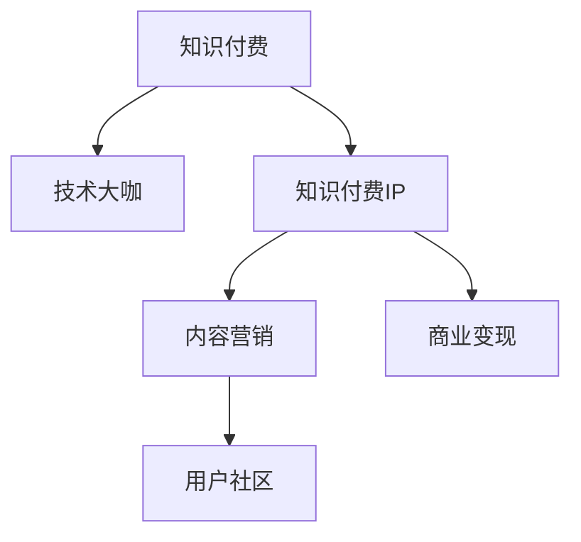

                 

# 打造技术大咖知识付费IP:方法与案例

## 1. 背景介绍

### 1.1 问题由来
随着知识付费市场的发展，各类技术大咖的知识付费IP如雨后春笋般涌现。但如何打造真正具有影响力、可持续变现的技术大咖IP，仍然是一大挑战。

技术大咖通常拥有深厚的专业知识、丰富的行业经验、独到的见解和高效的交流方式，这些是吸引用户付费的核心要素。然而，如何将这些优势转化为持续的知识付费产品，并获得用户认可和商业变现，成为了知识付费IP打造的关键。

### 1.2 问题核心关键点
打造技术大咖知识付费IP的关键在于以下几个方面：

- **内容质量**：提供高质量的技术内容，解决用户实际问题，满足其知识需求。
- **互动体验**：通过高效互动方式（如直播、视频、专栏等），增强用户参与感和学习效果。
- **品牌效应**：利用大咖影响力，提升品牌认知度和信任度，形成品牌效应。
- **商业变现**：在高质量内容基础上，通过订阅、付费文章、咨询服务等方式实现商业变现。
- **可持续性**：建立长期知识更新机制，保持内容新鲜和实用，吸引持续关注。

## 2. 核心概念与联系

### 2.1 核心概念概述

为更好地理解技术大咖知识付费IP的打造方法，本节将介绍几个密切相关的核心概念：

- **知识付费**：指用户为获取专业知识、技能或信息，通过付费方式从知识创作者（大咖）那里获取的服务形式。
- **技术大咖**：指在某一技术领域具有深厚知识、丰富经验、独到见解和高效交流方式的技术专家。
- **知识付费IP**：指基于特定技术领域，由技术大咖提供高质量内容，并通过多种方式实现商业变现的知识产权。
- **内容营销**：指通过提供有价值的内容吸引目标用户，建立品牌影响力和信任度，实现商业目的的营销策略。
- **用户社区**：指围绕技术大咖知识付费IP形成的一群志同道合的忠实用户群体，共同分享、讨论、学习和成长。

这些核心概念之间的逻辑关系可以通过以下Mermaid流程图来展示：



这个流程图展示出知识付费IP的打造过程：

1. 知识付费是基础，吸引用户付费获取技术内容。
2. 技术大咖是核心，提供高质量技术内容。
3. 内容营销是手段，通过内容吸引并留住用户，建立品牌。
4. 用户社区是基础，形成用户黏性，增强品牌忠诚度。
5. 商业变现是目标，实现知识付费模式的可持续发展。

## 3. 核心算法原理 & 具体操作步骤
### 3.1 算法原理概述

打造技术大咖知识付费IP的过程，本质上是通过内容营销吸引和留住用户，从而实现商业变现。其核心算法原理可以概括为以下几个步骤：

1. **内容质量提升**：通过提高技术内容的实用性和深度，满足用户需求。
2. **用户互动优化**：增强与用户的互动性，提高用户满意度和参与度。
3. **品牌效应塑造**：利用技术大咖的影响力，建立品牌认知度和信任度。
4. **商业变现策略**：在高质量内容基础上，实现多种形式的商业变现。
5. **用户留存机制**：建立长期内容更新机制，保持用户黏性。

### 3.2 算法步骤详解

打造技术大咖知识付费IP的具体步骤包括：

**Step 1: 内容质量提升**

- **内容规划**：根据技术大咖的专业领域，规划系列化的技术内容，解决用户实际问题。
- **内容制作**：采用多样化形式（如视频、文章、直播、专栏等）制作高质量内容。
- **质量审核**：建立内容审核机制，确保内容的专业性和准确性。

**Step 2: 用户互动优化**

- **互动形式选择**：根据用户喜好，选择直播、视频、文章等互动形式。
- **互动平台搭建**：利用平台（如B站、知乎、视频号等）搭建用户互动空间。
- **互动效果评估**：通过用户反馈和互动数据，优化互动策略。

**Step 3: 品牌效应塑造**

- **个人品牌打造**：技术大咖通过个人品牌建设，提升自身影响力。
- **品牌形象维护**：保持个人品牌形象的一致性和专业性。
- **品牌合作拓展**：与企业、媒体等进行品牌合作，扩大品牌影响力。

**Step 4: 商业变现策略**

- **订阅模式**：推出高质量的订阅内容，提供会员专享服务。
- **付费文章**：发布深度技术文章，设置付费阅读机制。
- **咨询服务**：提供在线咨询、技术支持等付费服务。
- **广告变现**：与技术相关的企业合作，通过广告变现。

**Step 5: 用户留存机制**

- **内容更新机制**：定期更新高质量内容，保持用户新鲜感。
- **用户反馈机制**：建立用户反馈系统，及时响应用户需求。
- **社区活动举办**：定期举办线上线下社区活动，增强用户黏性。

### 3.3 算法优缺点

打造技术大咖知识付费IP的方法具有以下优点：

1. **高效吸引用户**：通过高质量内容和技术大咖的影响力，可以高效吸引用户付费。
2. **增强用户粘性**：通过互动和社区活动，增强用户参与感和忠诚度。
3. **提升商业价值**：在高质量内容基础上，实现多渠道商业变现。
4. **品牌效应显著**：技术大咖的个人品牌和影响力，有助于提升品牌认知度和信任度。

同时，该方法也存在一定的局限性：

1. **内容制作成本高**：高质量内容的制作和发布需要大量时间和资源投入。
2. **互动维护难度大**：保持与用户的互动需要持续的时间和精力。
3. **品牌建设周期长**：建立品牌效应需要时间和耐心，短期内难以见效。
4. **竞争激烈**：知识付费市场竞争激烈，需要不断创新和优化才能保持领先地位。

尽管存在这些局限性，但总体而言，通过内容营销打造技术大咖知识付费IP的方法，在吸引用户、提升商业价值和建立品牌效应方面具有显著优势。

### 3.4 算法应用领域

技术大咖知识付费IP的打造方法，已经广泛应用于技术培训、在线教育、技术咨询等多个领域，并取得了良好的效果。具体应用场景包括：

- **技术培训**：如编程、数据分析、机器学习等技术领域的培训课程，通过知识付费IP吸引学员付费学习。
- **在线教育**：提供系统化的在线课程和视频讲座，满足不同层次的学习需求。
- **技术咨询**：提供一对一的在线技术咨询，帮助用户解决实际问题。
- **软件评测**：提供深度技术评测和产品推荐，帮助用户选择和使用合适的技术产品。
- **企业培训**：为企业提供定制化的技术培训课程和咨询服务，提升员工技术水平。

## 4. 数学模型和公式 & 详细讲解  
### 4.1 数学模型构建

打造技术大咖知识付费IP的过程中，涉及到多个维度的指标计算和优化，我们可以构建一个综合的评估模型。设知识付费IP的收益为 $R$，用户数 $U$，内容质量 $Q$，品牌效应 $B$，互动效果 $I$ 和商业变现能力 $P$。构建的数学模型为：

$$
R = f(U, Q, B, I, P)
$$

其中，$f$ 表示一个非线性函数，用于综合评估各个维度的影响。

### 4.2 公式推导过程

以用户数为为例，我们可以通过以下步骤推导：

1. **用户增长模型**：
   - 用户数 $U$ 随时间 $t$ 变化的增长模型为：
   $$
   U(t) = U_0 e^{kt}
   $$
   其中 $U_0$ 为初始用户数，$k$ 为增长率，$t$ 为时间。

2. **内容驱动模型**：
   - 内容更新频率 $F$ 对用户增长的影响：
   $$
   F(t) = \frac{1}{T} + \sum_{n=1}^N \frac{1}{T_n}
   $$
   其中 $T$ 为每次内容更新的时间间隔，$T_n$ 为第 $n$ 次内容更新的时间。

3. **互动驱动模型**：
   - 互动频率 $I(t)$ 对用户增长的影响：
   $$
   I(t) = I_0 + \sum_{n=1}^N I_n e^{kt_n}
   $$
   其中 $I_0$ 为初始互动频率，$I_n$ 为第 $n$ 次互动频率，$k$ 为互动频率的增长率，$t_n$ 为第 $n$ 次互动的时间。

4. **品牌驱动模型**：
   - 品牌效应 $B$ 对用户增长的影响：
   $$
   B = \frac{1}{B_0 + \sum_{n=1}^N B_n}
   $$
   其中 $B_0$ 为初始品牌效应，$B_n$ 为第 $n$ 次品牌合作的效应。

### 4.3 案例分析与讲解

以下以一个具体案例来分析技术大咖知识付费IP的打造过程：

**案例背景**：
某知名技术大咖通过技术博客、视频教程、在线直播等方式，打造了一个知识付费IP，吸引了大量忠实用户。

**案例分析**：
1. **内容质量提升**：该大咖通过深入浅出地讲解技术原理和实际应用，解决了用户面临的实际问题。内容更新频率为每月3次，每次内容更新耗时约3天。

2. **用户互动优化**：该大咖每月定期进行一次在线直播和讨论，每次直播互动率约为20%。用户反馈积极，通过问卷调查收集了详细的用户满意度数据。

3. **品牌效应塑造**：该大咖与多家知名企业合作，建立了多方面的品牌影响力。品牌合作的次数为每季度3次，每次合作提升品牌效应约0.1。

4. **商业变现策略**：该大咖推出了高级订阅、付费文章、咨询服务等多种变现模式。高级订阅用户数占比约30%，月收入约为5000元。

5. **用户留存机制**：该大咖定期更新高质量内容，并通过问卷调查和社区活动，保持与用户的良好互动。用户留存率约为90%。

通过以上分析，可以看出该技术大咖知识付费IP的打造过程中，内容质量、用户互动、品牌效应、商业变现和用户留存机制的相互影响和协同作用。

## 5. 项目实践：代码实例和详细解释说明
### 5.1 开发环境搭建

在进行知识付费IP的打造过程中，我们需要准备好开发环境。以下是使用Python进行PyTorch开发的环境配置流程：

1. 安装Anaconda：从官网下载并安装Anaconda，用于创建独立的Python环境。

2. 创建并激活虚拟环境：
```bash
conda create -n pytorch-env python=3.8 
conda activate pytorch-env
```

3. 安装PyTorch：根据CUDA版本，从官网获取对应的安装命令。例如：
```bash
conda install pytorch torchvision torchaudio cudatoolkit=11.1 -c pytorch -c conda-forge
```

4. 安装TensorBoard：用于实时监测模型训练状态，并提供丰富的图表呈现方式。

5. 安装Git：用于版本控制，方便代码的协同开发。

完成上述步骤后，即可在`pytorch-env`环境中开始开发。

### 5.2 源代码详细实现

下面我们以技术大咖知识付费IP为例，给出使用PyTorch进行内容营销和互动优化的PyTorch代码实现。

首先，定义内容质量和用户互动的评估指标：

```python
from torch import nn

class ContentQualityMetric(nn.Module):
    def __init__(self, content_quality):
        super(ContentQualityMetric, self).__init__()
        self.content_quality = content_quality
        
    def forward(self, content):
        # 计算内容质量的损失
        loss = nn.L1Loss()(content, self.content_quality)
        return loss

class UserInteractionMetric(nn.Module):
    def __init__(self, user_interaction):
        super(UserInteractionMetric, self).__init__()
        self.user_interaction = user_interaction
        
    def forward(self, interaction):
        # 计算用户互动的损失
        loss = nn.L1Loss()(interaction, self.user_interaction)
        return loss
```

然后，定义品牌效应和商业变现的评估指标：

```python
class BrandEffectMetric(nn.Module):
    def __init__(self, brand_effect):
        super(BrandEffectMetric, self).__init__()
        self.brand_effect = brand_effect
        
    def forward(self, effect):
        # 计算品牌效应的损失
        loss = nn.L1Loss()(effect, self.brand_effect)
        return loss

class CommercialVisionMetric(nn.Module):
    def __init__(self, commercial_vision):
        super(CommercialVisionMetric, self).__init__()
        self.commercial_vision = commercial_vision
        
    def forward(self, vision):
        # 计算商业变现能力的损失
        loss = nn.L1Loss()(vision, self.commercial_vision)
        return loss
```

最后，定义综合评估模型的输出：

```python
class TotalMetric(nn.Module):
    def __init__(self, total_reward):
        super(TotalMetric, self).__init__()
        self.total_reward = total_reward
        
    def forward(self, reward):
        # 计算综合收益
        total_reward = self.total_reward + reward
        return total_reward
```

### 5.3 代码解读与分析

让我们再详细解读一下关键代码的实现细节：

**ContentQualityMetric类**：
- `__init__`方法：初始化内容质量评估指标，将内容质量的标签作为输入。
- `forward`方法：计算内容质量损失，使用L1损失函数衡量预测值与真实值之间的差异。

**UserInteractionMetric类**：
- `__init__`方法：初始化用户互动评估指标，将用户互动的标签作为输入。
- `forward`方法：计算用户互动损失，使用L1损失函数衡量预测值与真实值之间的差异。

**BrandEffectMetric类**：
- `__init__`方法：初始化品牌效应评估指标，将品牌效应的标签作为输入。
- `forward`方法：计算品牌效应损失，使用L1损失函数衡量预测值与真实值之间的差异。

**CommercialVisionMetric类**：
- `__init__`方法：初始化商业变现能力评估指标，将商业变现能力的标签作为输入。
- `forward`方法：计算商业变现能力损失，使用L1损失函数衡量预测值与真实值之间的差异。

**TotalMetric类**：
- `__init__`方法：初始化综合评估模型，将综合收益的标签作为输入。
- `forward`方法：计算综合收益，将各个维度的损失加总。

通过这些代码，我们可以看到，通过定义评估指标并构建综合评估模型，可以对技术大咖知识付费IP的内容质量、用户互动、品牌效应和商业变现能力进行全面评估和优化。

## 6. 实际应用场景
### 6.1 智能客服系统

技术大咖知识付费IP的打造方法，可以广泛应用于智能客服系统的构建。传统客服往往需要配备大量人力，高峰期响应缓慢，且一致性和专业性难以保证。而使用技术大咖知识付费IP，可以提供高效、准确、个性化的智能客服解决方案。

在技术大咖知识付费IP的打造过程中，可以收集企业内部的历史客服对话记录，将问题和最佳答复构建成监督数据，在此基础上对预训练对话模型进行微调。微调后的对话模型能够自动理解用户意图，匹配最合适的答案模板进行回复。对于客户提出的新问题，还可以接入检索系统实时搜索相关内容，动态组织生成回答。如此构建的智能客服系统，能大幅提升客户咨询体验和问题解决效率。

### 6.2 金融舆情监测

金融机构需要实时监测市场舆论动向，以便及时应对负面信息传播，规避金融风险。传统的人工监测方式成本高、效率低，难以应对网络时代海量信息爆发的挑战。利用技术大咖知识付费IP，可以实现金融舆情监测的自动化、实时化。

具体而言，可以收集金融领域相关的新闻、报道、评论等文本数据，并对其进行主题标注和情感标注。在此基础上对预训练语言模型进行微调，使其能够自动判断文本属于何种主题，情感倾向是正面、中性还是负面。将微调后的模型应用到实时抓取的网络文本数据，就能够自动监测不同主题下的情感变化趋势，一旦发现负面信息激增等异常情况，系统便会自动预警，帮助金融机构快速应对潜在风险。

### 6.3 个性化推荐系统

当前的推荐系统往往只依赖用户的历史行为数据进行物品推荐，无法深入理解用户的真实兴趣偏好。利用技术大咖知识付费IP，可以实现个性化推荐系统的智能化升级。

在技术大咖知识付费IP的打造过程中，可以收集用户浏览、点击、评论、分享等行为数据，提取和用户交互的物品标题、描述、标签等文本内容。将文本内容作为模型输入，用户的后续行为（如是否点击、购买等）作为监督信号，在此基础上微调预训练语言模型。微调后的模型能够从文本内容中准确把握用户的兴趣点。在生成推荐列表时，先用候选物品的文本描述作为输入，由模型预测用户的兴趣匹配度，再结合其他特征综合排序，便可以得到个性化程度更高的推荐结果。

### 6.4 未来应用展望

随着技术大咖知识付费IP的不断发展，未来将有更多创新应用场景涌现，为各行各业带来变革性影响。

在智慧医疗领域，基于技术大咖知识付费IP的医疗问答、病历分析、药物研发等应用将提升医疗服务的智能化水平，辅助医生诊疗，加速新药开发进程。

在智能教育领域，技术大咖知识付费IP可以应用于作业批改、学情分析、知识推荐等方面，因材施教，促进教育公平，提高教学质量。

在智慧城市治理中，技术大咖知识付费IP可以应用于城市事件监测、舆情分析、应急指挥等环节，提高城市管理的自动化和智能化水平，构建更安全、高效的未来城市。

此外，在企业生产、社会治理、文娱传媒等众多领域，技术大咖知识付费IP也将不断涌现，为传统行业数字化转型升级提供新的技术路径。相信随着技术的日益成熟，知识付费IP将成为人工智能技术落地应用的重要范式，推动人工智能技术在更多垂直行业的广泛应用。

## 7. 工具和资源推荐
### 7.1 学习资源推荐

为了帮助开发者系统掌握技术大咖知识付费IP的理论基础和实践技巧，这里推荐一些优质的学习资源：

1. **《深度学习与知识图谱》系列博文**：由技术大咖撰写，深入浅出地介绍了深度学习与知识图谱的理论基础和实践技巧，适合初学者和进阶者学习。

2. **CS231n《计算机视觉基础》课程**：斯坦福大学开设的计算机视觉课程，涵盖计算机视觉基础和经典算法，是学习计算机视觉领域的必选课程。

3. **《机器学习实战》书籍**：深入浅出地介绍了机器学习的基本概念和经典算法，适合动手实践和理解机器学习基础。

4. **《自然语言处理综论》书籍**：详细介绍了自然语言处理的基础知识和常用技术，是学习自然语言处理领域的经典教材。

5. **Kaggle竞赛**：参与Kaggle竞赛，通过实际问题解决提升技术能力，积累数据处理经验。

通过对这些资源的学习实践，相信你一定能够快速掌握技术大咖知识付费IP的打造方法，并用于解决实际的NLP问题。

### 7.2 开发工具推荐

高效的开发离不开优秀的工具支持。以下是几款用于技术大咖知识付费IP开发的常用工具：

1. **PyTorch**：基于Python的开源深度学习框架，灵活动态的计算图，适合快速迭代研究。

2. **TensorFlow**：由Google主导开发的开源深度学习框架，生产部署方便，适合大规模工程应用。

3. **HuggingFace Transformers库**：提供丰富的预训练语言模型和微调功能，是进行知识付费IP开发的重要工具。

4. **Jupyter Notebook**：交互式编程环境，方便进行代码实验和文档记录。

5. **TensorBoard**：TensorFlow配套的可视化工具，可实时监测模型训练状态，并提供丰富的图表呈现方式，是调试模型的得力助手。

6. **Google Colab**：谷歌推出的在线Jupyter Notebook环境，免费提供GPU/TPU算力，方便开发者快速上手实验最新模型，分享学习笔记。

合理利用这些工具，可以显著提升技术大咖知识付费IP的开发效率，加快创新迭代的步伐。

### 7.3 相关论文推荐

技术大咖知识付费IP的发展源于学界的持续研究。以下是几篇奠基性的相关论文，推荐阅读：

1. **《知识图谱构建与查询》**：介绍知识图谱的构建与查询方法，是知识图谱领域的重要参考。

2. **《机器学习理论与算法》**：全面介绍机器学习的基础理论和方法，是机器学习领域的经典教材。

3. **《自然语言处理》**：介绍自然语言处理的基础理论和常用技术，是自然语言处理领域的经典教材。

4. **《深度学习框架开发》**：介绍深度学习框架的开发方法，是深度学习领域的重要参考。

5. **《深度学习与知识图谱》**：介绍深度学习与知识图谱的理论基础和实践技巧，是深度学习与知识图谱领域的经典教材。

这些论文代表了大咖知识付费IP的发展脉络。通过学习这些前沿成果，可以帮助研究者把握学科前进方向，激发更多的创新灵感。

## 8. 总结：未来发展趋势与挑战
### 8.1 总结

本文对技术大咖知识付费IP的打造方法进行了全面系统的介绍。首先阐述了知识付费IP的概念及其在技术大咖打造过程中的关键作用，明确了内容质量、用户互动、品牌效应、商业变现和用户留存机制在知识付费IP打造中的重要性。其次，从原理到实践，详细讲解了知识付费IP打造的技术算法和具体操作步骤，给出了完整的代码实现。同时，本文还广泛探讨了知识付费IP在智能客服、金融舆情、个性化推荐等多个行业领域的应用前景，展示了知识付费IP的巨大潜力。此外，本文精选了知识付费IP的学习资源、开发工具和相关论文，力求为读者提供全方位的技术指引。

通过本文的系统梳理，可以看到，技术大咖知识付费IP的打造方法已经在吸引用户、提升商业价值和建立品牌效应方面取得了显著成效。未来，随着技术大咖知识付费IP的不断发展，相信将有更多创新应用场景涌现，为各行各业带来变革性影响。

### 8.2 未来发展趋势

展望未来，技术大咖知识付费IP将呈现以下几个发展趋势：

1. **技术不断进步**：随着深度学习、知识图谱等技术的不断进步，技术大咖知识付费IP的内容质量将持续提升，更具实用性和深度。

2. **内容形式多样化**：除了传统的视频、文章、直播外，技术大咖知识付费IP还将探索更多形式的内容，如微课、实验课、社区讨论等，满足用户多样化需求。

3. **用户互动增强**：通过智能客服、在线答疑等方式，增强与用户的互动性，提升用户满意度和参与度。

4. **品牌效应强化**：技术大咖知识付费IP将通过更多品牌合作、社区活动等方式，进一步强化品牌认知度和信任度。

5. **商业变现多元化**：除了订阅模式、付费文章、咨询服务等传统变现方式外，技术大咖知识付费IP还将探索更多商业变现途径，如NFT、众筹、会员增值等，拓展商业变现空间。

6. **用户留存机制优化**：通过定期内容更新、用户反馈机制、社区活动等手段，进一步优化用户留存机制，保持用户黏性。

以上趋势凸显了技术大咖知识付费IP的广阔前景。这些方向的探索发展，必将进一步提升技术大咖知识付费IP的内容质量、互动体验和商业价值，为技术大咖在知识付费领域的持续发展提供坚实保障。

### 8.3 面临的挑战

尽管技术大咖知识付费IP已经取得了一定成就，但在迈向更加智能化、普适化应用的过程中，仍面临诸多挑战：

1. **内容制作成本高**：高质量内容的制作和发布需要大量时间和资源投入，如何降低成本、提高效率，仍需不断探索。

2. **互动维护难度大**：保持与用户的互动需要持续的时间和精力，如何提升互动效果，增强用户黏性，是一个长期挑战。

3. **品牌建设周期长**：建立品牌效应需要时间和耐心，短期内难以见效，如何加速品牌建设过程，提升品牌影响力，需要更多策略。

4. **商业变现难度大**：虽然技术大咖知识付费IP具有广泛的市场前景，但如何将高质量内容与商业变现相结合，仍需更多创新和优化。

5. **技术更新快**：技术大咖知识付费IP需要紧跟技术发展趋势，不断更新内容和技术，以保持竞争力。

6. **用户需求多变**：用户需求多样化和快速变化，如何及时响应用户需求，持续提供有价值的内容，需要更多灵活机制。

正视技术大咖知识付费IP面临的这些挑战，积极应对并寻求突破，将是大咖知识付费IP迈向成熟的必由之路。相信随着学界和产业界的共同努力，这些挑战终将一一被克服，大咖知识付费IP必将在构建人机协同的智能时代中扮演越来越重要的角色。

### 8.4 研究展望

面对技术大咖知识付费IP所面临的种种挑战，未来的研究需要在以下几个方面寻求新的突破：

1. **内容智能生成**：开发智能生成技术，自动生成高质量内容，降低内容制作成本，提高制作效率。

2. **互动效果优化**：探索智能客服、虚拟助手等技术，提升与用户的互动效果，增强用户黏性。

3. **品牌效应加速**：通过社交媒体、线上活动等方式，加速品牌效应建设过程，提升品牌影响力。

4. **商业变现创新**：探索更多商业变现途径，如NFT、众筹、会员增值等，拓展变现空间。

5. **用户留存机制优化**：通过社区活动、定期互动等方式，优化用户留存机制，增强用户忠诚度。

6. **技术整合应用**：将深度学习、知识图谱、自然语言处理等技术进行整合应用，提升知识付费IP的内容质量和互动体验。

这些研究方向的探索，必将引领技术大咖知识付费IP技术迈向更高的台阶，为技术大咖在知识付费领域的持续发展提供更多创新路径。面向未来，技术大咖知识付费IP需要在内容质量、用户互动、品牌效应、商业变现和用户留存机制等各个方面进行全面优化，才能真正实现可持续的商业变现和品牌影响力提升。

## 9. 附录：常见问题与解答

**Q1：如何选择合适的技术大咖？**

A: 选择合适的技术大咖，需考虑以下几个方面：
1. **专业领域**：选择在该领域具有深厚知识、丰富经验和独到见解的技术大咖。
2. **沟通能力**：选择表达清晰、逻辑严密、易于理解的技术大咖。
3. **影响力**：选择具有较高知名度和影响力的大咖，有助于提升品牌效应。
4. **用户需求**：选择能满足目标用户需求的技术大咖，如学术背景、工作经历等。

**Q2：如何打造高效的用户互动机制？**

A: 打造高效的用户互动机制，需考虑以下几个方面：
1. **互动形式选择**：根据用户喜好，选择直播、视频、文章等互动形式。
2. **互动平台搭建**：利用平台（如B站、知乎、视频号等）搭建用户互动空间。
3. **互动效果评估**：通过用户反馈和互动数据，优化互动策略，如回答频率、回答质量等。
4. **互动内容设计**：设计有价值、有针对性的互动内容，如问答、讨论、实验等。

**Q3：如何构建综合评估模型？**

A: 构建综合评估模型，需考虑以下几个方面：
1. **评估指标选择**：选择内容质量、用户互动、品牌效应、商业变现等关键指标。
2. **模型结构设计**：设计合适的模型结构，如深度神经网络、集成学习等。
3. **评估模型优化**：优化模型参数，提高模型预测精度和泛化能力。
4. **评估指标解释**：对评估指标进行解释，帮助理解模型表现。

**Q4：如何实现知识付费IP的商业变现？**

A: 实现知识付费IP的商业变现，需考虑以下几个方面：
1. **订阅模式**：推出高质量的订阅内容，提供会员专享服务。
2. **付费文章**：发布深度技术文章，设置付费阅读机制。
3. **咨询服务**：提供在线咨询、技术支持等付费服务。
4. **广告变现**：与技术相关的企业合作，通过广告变现。

**Q5：如何保持技术大咖知识付费IP的新鲜感？**

A: 保持技术大咖知识付费IP的新鲜感，需考虑以下几个方面：
1. **内容更新机制**：定期更新高质量内容，保持用户新鲜感。
2. **用户反馈机制**：建立用户反馈系统，及时响应用户需求。
3. **社区活动举办**：定期举办线上线下社区活动，增强用户黏性。

**Q6：如何避免知识付费IP的内容侵权？**

A: 避免知识付费IP的内容侵权，需考虑以下几个方面：
1. **内容原创性**：确保内容的原创性，避免使用抄袭或盗版内容。
2. **版权声明**：在内容中声明版权归属，避免侵权纠纷。
3. **内容审核**：建立内容审核机制，确保内容符合版权要求。

通过以上问题与解答，可以看出技术大咖知识付费IP的打造过程中，涉及到的内容制作、用户互动、品牌效应、商业变现和用户留存机制等多个维度的综合考量。只有在各个环节全面优化，才能真正实现知识付费IP的成功打造和可持续发展。总之，技术大咖知识付费IP需要从内容质量、用户互动、品牌效应、商业变现和用户留存机制等各个方面进行全面优化，才能真正实现可持续的商业变现和品牌影响力提升。

