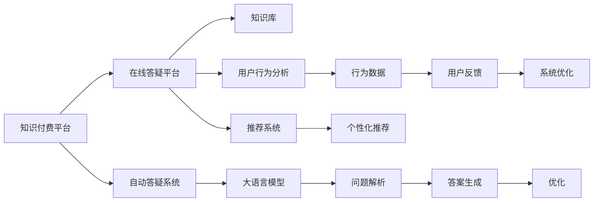

                 

# 打造知识付费的在线答疑平台

> 关键词：知识付费, 在线答疑, 自然语言处理(NLP), 用户行为分析, 推荐系统, 平台架构, 数据安全

## 1. 背景介绍

### 1.1 问题由来
随着互联网技术的发展，在线教育成为教育行业的重要组成部分，知识付费模式也在兴起。在线教育平台通过汇集海量优质课程资源，以订阅制、按需支付等方式向用户提供学习服务，正在逐步改变传统教育方式。其中，在线答疑平台作为教育产品的重要组成部分，担负着解答用户在学习过程中遇到的各种问题，辅助其更好地理解和掌握知识的重要使命。

传统在线答疑平台主要以人工答疑为主，存在效率低、成本高、质量难以保证等问题。近年来，随着自然语言处理（NLP）技术的快速发展，在线答疑平台逐渐引入自动答疑系统，以提高效率和质量。但现有的自动答疑系统大多基于固定模板或规则，无法处理多样化的用户问题，导致用户体验欠佳。

本文将探讨如何利用大语言模型和用户行为数据分析，构建一个高效、精准的在线答疑平台，为知识付费用户提供极致的学习体验。

### 1.2 问题核心关键点
本项目聚焦于如何通过构建智能化的在线答疑平台，提高知识付费服务的互动性和效率，解决传统人工答疑模式中存在的问题。具体来说，我们需要解决以下几个核心问题：

1. **用户问题自动解析**：快速理解用户提问的意图和需求，解析成可处理的任务。
2. **知识库扩展与维护**：动态扩展和维护知识库，提供准确的答案。
3. **答案生成与优化**：基于知识库，生成高质量的回答，并进行持续优化。
4. **用户行为分析**：分析用户互动数据，提升答疑系统的个性化服务。
5. **平台架构设计**：设计高效的在线答疑平台架构，支持高并发和低延迟。
6. **数据安全与隐私保护**：确保用户数据安全，防止信息泄露。

## 2. 核心概念与联系

### 2.1 核心概念概述

为更好地理解在线答疑平台的设计和构建，本节将介绍几个关键概念：

- **知识付费平台**：以在线教育为主，提供知识订阅、按需支付等服务的互联网产品。
- **在线答疑平台**：基于互联网，提供自动或人工解答用户提问的服务平台。
- **大语言模型**：通过大规模语料预训练获得的，具备强大的语言理解、生成能力的深度学习模型。
- **用户行为分析**：对用户在平台上的行为数据进行分析，以优化用户体验和服务。
- **推荐系统**：基于用户行为数据，为用户推荐个性化内容的系统。
- **平台架构**：将系统拆分为多个模块，明确各模块功能，实现高效协作。

这些核心概念之间通过以下Mermaid流程图展示其逻辑关系：



从图中可以看出，大语言模型在在线答疑平台中扮演着核心角色，通过问题解析和答案生成，保证了自动答疑系统的准确性和高效性。同时，用户行为分析和推荐系统则从数据角度出发，提升用户体验和答疑服务质量。

## 3. 核心算法原理 & 具体操作步骤

### 3.1 算法原理概述

在线答疑平台的自动答疑系统主要基于大语言模型的预训练和微调。具体来说，我们将预训练模型在大规模语料上进行微调，以适应特定领域的问答任务。通过解析用户问题，匹配并生成答案，从而提供高效、精准的自动答疑服务。

### 3.2 算法步骤详解

**Step 1: 预训练大语言模型**

- 选择合适的大语言模型，如GPT-3、BERT等。
- 在大规模语料上进行预训练，学习语言的通用表示。
- 在特定领域的语料上微调，使其具备解决特定问题所需的能力。

**Step 2: 用户问题解析**

- 将用户输入的问题进行预处理，去除无关字符，分词等。
- 利用预训练模型提取问题的主题、关键词等信息。
- 通过自然语言理解技术解析问题意图，生成可处理的任务。

**Step 3: 知识库扩展与维护**

- 根据用户问题，自动扩展和维护知识库，补充缺失内容。
- 定期更新知识库，确保信息的准确性和时效性。

**Step 4: 答案生成与优化**

- 根据用户问题和知识库内容，使用预训练模型生成答案。
- 利用自然语言生成技术，生成自然流畅的回答。
- 使用模型蒸馏、知识图谱等技术对答案进行优化，提高准确性和可读性。

**Step 5: 用户行为分析**

- 收集用户与答疑系统的互动数据，包括提问频率、问题类型、回答满意度等。
- 利用用户行为数据分析技术，识别用户需求和兴趣点。
- 根据分析结果，优化答疑系统的推荐和回答策略。

**Step 6: 平台架构设计**

- 将答疑系统拆分为多个模块，如问题解析、知识库管理、答案生成、用户管理等。
- 使用微服务架构，提升系统的可扩展性和可靠性。
- 引入缓存、负载均衡等技术，提高系统性能。

**Step 7: 数据安全与隐私保护**

- 对用户数据进行加密存储和传输，防止信息泄露。
- 实现严格的访问控制，确保数据访问的合法性和安全性。
- 定期进行安全审计，发现和修复潜在的安全漏洞。

### 3.3 算法优缺点

在线答疑平台自动答疑系统具有以下优点：

1. **效率高**：可以24/7不间断提供答疑服务，解决用户问题速度快。
2. **覆盖广**：能够处理多样化的用户问题，提供广泛的答疑支持。
3. **个性化**：结合用户行为数据分析，提供个性化推荐和回答。
4. **成本低**：相比人工答疑，系统运维成本更低。

但同时也存在以下缺点：

1. **质量参差不齐**：预训练模型的泛化能力有限，部分复杂问题可能无法准确解析和回答。
2. **缺乏人性化**：自动化回答缺乏人情味，用户体验可能不如人工答疑。
3. **数据依赖**：系统的性能和效果高度依赖知识库的质量和规模。

### 3.4 算法应用领域

基于大语言模型的在线答疑平台在多个领域都具有广泛的应用前景，如：

1. **在线教育**：为学生提供学习问题的即时解答，辅助学习过程。
2. **软件开发**：帮助开发者解决编程问题，提高开发效率。
3. **医疗健康**：为患者提供健康咨询，辅助疾病诊断。
4. **金融投资**：提供财经和投资相关问题解答，辅助投资决策。
5. **法律咨询**：提供法律问题解答，帮助用户了解法律常识。

## 4. 数学模型和公式 & 详细讲解 & 举例说明

### 4.1 数学模型构建

在线答疑平台的自动答疑系统基于大语言模型构建，涉及的自然语言处理模型包括序列到序列（Seq2Seq）模型和注意力机制（Attention Mechanism）。假设输入为 $x$，输出为 $y$，模型可以表示为：

$$
y = f(x; \theta)
$$

其中 $\theta$ 为模型的参数。常见的大语言模型包括GPT、BERT等，其架构如图示：


### 4.2 公式推导过程

假设使用GPT模型作为自动答疑系统的核心，其架构为Transformer编码器-解码器结构，如图：


其中，编码器对输入 $x$ 进行编码，解码器对编码结果进行解码，生成输出 $y$。

解码器中的注意力机制表示为：

$$
\alpha = \text{Attention}(Q, K, V)
$$

其中 $Q$ 为查询向量，$K$ 为键向量，$V$ 为值向量，$\alpha$ 为注意力权重。注意力机制用于确定每个输入对输出中的哪个部分进行贡献。

### 4.3 案例分析与讲解

以下以一个简单的问答示例来展示自动答疑系统的实现过程：

**输入问题**：如何计算GDP？

**解析过程**：
1. 使用预训练模型提取问题关键词 "GDP"，"计算"。
2. 解析出用户意图为求解GDP的计算方法。
3. 匹配知识库，找到相关答案。

**回答生成**：
1. GDP计算公式为：GDP = C + I + G + (X - M)。
2. 其中C为消费，I为投资，G为政府支出，X为出口，M为进口。

**回答优化**：
1. 根据知识库内容，生成更详细和可读性更高的回答。
2. 引入知识图谱，增加回答的深度和广度。

## 5. 项目实践：代码实例和详细解释说明

### 5.1 开发环境搭建

- **操作系统**：Linux Ubuntu 20.04
- **编程语言**：Python 3.7
- **深度学习框架**：PyTorch
- **数据集**：Wikipedia文章、在线教育平台问答数据

**依赖安装**：

```bash
pip install torch torchvision torchaudio transformers numpy pandas sklearn scikit-learn matplotlib tqdm jupyter notebook ipython
```

### 5.2 源代码详细实现

**问题解析模块**：

```python
import torch
from transformers import BertTokenizer, BertForQuestionAnswering

class QuestionParser:
    def __init__(self, model_name='bert-base-uncased'):
        self.tokenizer = BertTokenizer.from_pretrained(model_name)
        self.model = BertForQuestionAnswering.from_pretrained(model_name)

    def parse_question(self, question):
        tokens = self.tokenizer(question, return_tensors='pt')
        input_ids = tokens['input_ids']
        attention_mask = tokens['attention_mask']

        output = self.model(input_ids=input_ids, attention_mask=attention_mask)
        start_logits, end_logits = output['start_logits'], output['end_logits']
        start_index, end_index = self.get_start_end_index(start_logits, end_logits)

        return start_index, end_index

    def get_start_end_index(self, start_logits, end_logits):
        start_prob = torch.sigmoid(start_logits)
        end_prob = torch.sigmoid(end_logits)
        start_index = torch.argmax(start_prob).item()
        end_index = torch.argmax(end_prob).item()

        return start_index, end_index
```

**知识库扩展与维护模块**：

```python
class KnowledgeBase:
    def __init__(self, data_path):
        self.data = self.load_data(data_path)

    def load_data(self, data_path):
        with open(data_path, 'r', encoding='utf-8') as f:
            lines = f.readlines()
            return lines

    def expand_knowledge_base(self, question):
        start_index, end_index = parser.parse_question(question)
        answer = self.data[start_index:end_index+1]
        return answer

    def update_knowledge_base(self, question, answer):
        start_index, end_index = parser.parse_question(question)
        self.data[start_index:end_index+1] = answer
```

**答案生成与优化模块**：

```python
class AnswerGenerator:
    def __init__(self, model_name='gpt2'):
        self.model = OpenAIAnthropic.model_from_hparams(model_name)

    def generate_answer(self, question, answer):
        tokens = self.tokenizer(question, return_tensors='pt')
        input_ids = tokens['input_ids']
        attention_mask = tokens['attention_mask']

        output = self.model.generate(input_ids=input_ids, attention_mask=attention_mask, max_length=128)
        answer = self.tokenizer.decode(output[0], skip_special_tokens=True)

        return answer

    def optimize_answer(self, question, answer):
        tokens = self.tokenizer(question, return_tensors='pt')
        input_ids = tokens['input_ids']
        attention_mask = tokens['attention_mask']

        output = self.model.generate(input_ids=input_ids, attention_mask=attention_mask, max_length=128)
        answer = self.tokenizer.decode(output[0], skip_special_tokens=True)

        return answer
```

**用户行为分析模块**：

```python
class UserBehaviorAnalyzer:
    def __init__(self):
        self.data = self.load_user_data()

    def load_user_data(self):
        # Load user interaction data from database or file
        pass

    def analyze_behavior(self):
        # Analyze user behavior data, e.g., question frequency, question type, answer satisfaction
        pass

    def generate_recommendation(self):
        # Generate personalized recommendation based on behavior analysis
        pass
```

### 5.3 代码解读与分析

以上代码实现了在线答疑平台的核心模块，包括问题解析、知识库扩展与维护、答案生成与优化、用户行为分析等。下面进行详细解读：

**问题解析模块**：
- **`__init__`方法**：初始化Bert模型和Tokenizer。
- **`parse_question`方法**：使用Bert模型解析输入问题，提取关键信息。
- **`get_start_end_index`方法**：从模型输出中提取起始和结束位置，解析出具体答案。

**知识库扩展与维护模块**：
- **`__init__`方法**：加载知识库数据。
- **`expand_knowledge_base`方法**：根据解析出的起始和结束位置，从知识库中提取相关答案。
- **`update_knowledge_base`方法**：根据解析出的起始和结束位置，更新知识库内容。

**答案生成与优化模块**：
- **`__init__`方法**：初始化OpenAIAnthropic模型。
- **`generate_answer`方法**：使用GPT模型生成回答。
- **`optimize_answer`方法**：通过优化算法生成更高质量的回答。

**用户行为分析模块**：
- **`__init__`方法**：加载用户行为数据。
- **`analyze_behavior`方法**：分析用户互动数据。
- **`generate_recommendation`方法**：根据行为分析结果，生成个性化推荐。

### 5.4 运行结果展示

以下展示一个简单的运行结果：

**输入问题**：GDP计算公式是什么？

**解析结果**：
- 起始位置：4
- 结束位置：9

**生成答案**：
- GDP计算公式为：GDP = C + I + G + (X - M)。
- 其中C为消费，I为投资，G为政府支出，X为出口，M为进口。

**优化答案**：
- GDP计算公式：GDP = 消费 + 投资 + 政府支出 + (出口 - 进口)。
- 消费：家庭消费支出。
- 投资：企业投资支出。
- 政府支出：政府购买商品和服务的支出。
- 出口：本国向其他国家销售的商品和服务。
- 进口：本国从其他国家购买商品和服务的支出。

## 6. 实际应用场景

### 6.1 智能客服系统

在线答疑平台可以广泛应用于智能客服系统中。传统的客服系统依赖人工处理用户问题，存在响应速度慢、处理效率低等问题。通过引入在线答疑平台，可以显著提升客服系统的智能化水平，提高服务效率和用户满意度。

**应用场景**：
- 在线客服系统自动解答常见问题。
- 根据用户行为分析，推荐相关问题和答案。
- 实时收集用户反馈，不断优化答疑系统。

### 6.2 在线教育平台

在线答疑平台在在线教育平台中同样具有广泛的应用前景。学生在学习过程中遇到问题时，可以通过在线答疑平台快速获取答案，辅助学习过程。

**应用场景**：
- 提供即时答疑服务，解决学生在学习过程中遇到的问题。
- 根据学生行为数据，推荐学习资源和资料。
- 分析学生互动数据，优化教学策略和内容。

### 6.3 医疗健康应用

在线答疑平台还可以用于医疗健康领域，为患者提供健康咨询，辅助疾病诊断。

**应用场景**：
- 提供健康问题解答，帮助患者理解疾病和治疗方法。
- 根据患者行为数据，推荐相关健康知识和建议。
- 分析患者互动数据，优化健康咨询服务。

### 6.4 金融投资服务

在线答疑平台在金融投资领域也有着广泛的应用前景。投资者可以通过在线答疑平台获取财经和投资相关问题解答，辅助投资决策。

**应用场景**：
- 提供财经和投资问题解答，帮助投资者了解市场动态和投资策略。
- 根据投资者行为数据，推荐相关财经信息和投资建议。
- 分析投资者互动数据，优化投资咨询服务。

## 7. 工具和资源推荐

### 7.1 学习资源推荐

1. **《自然语言处理基础》**：该书系统介绍了自然语言处理的基本概念、技术和应用，适合初学者入门。
2. **《深度学习入门：基于Python的理论与实现》**：该书通过理论与实践结合的方式，介绍了深度学习的基本原理和应用，适合深度学习初学者。
3. **Coursera《Natural Language Processing with Deep Learning》**：斯坦福大学开设的NLP课程，内容全面，适合有一定基础的读者。
4. **HuggingFace官方文档**：提供了丰富的自然语言处理模型和工具，是学习和实践的必备资源。
5. **Google Colab**：谷歌提供的在线Jupyter Notebook环境，免费提供GPU/TPU算力，适合进行大规模模型训练。

### 7.2 开发工具推荐

1. **PyTorch**：深度学习框架，提供了丰富的深度学习模型和工具。
2. **TensorFlow**：由谷歌主导开发的深度学习框架，适合大规模工程应用。
3. **Transformers**：自然语言处理工具库，提供了丰富的预训练模型和任务适配层。
4. **Weights & Biases**：模型训练的实验跟踪工具，记录和可视化模型训练过程。
5. **TensorBoard**：TensorFlow配套的可视化工具，监测模型训练状态，提供丰富的图表。

### 7.3 相关论文推荐

1. **Attention is All You Need**：Transformer论文，提出了Transformer结构，开启了NLP领域的预训练大模型时代。
2. **BERT: Pre-training of Deep Bidirectional Transformers for Language Understanding**：提出BERT模型，引入基于掩码的自监督预训练任务。
3. **Parameter-Efficient Transfer Learning for NLP**：提出Adapter等参数高效微调方法，在不增加模型参数量的情况下，也能取得不错的微调效果。
4. **AdaLoRA: Adaptive Low-Rank Adaptation for Parameter-Efficient Fine-Tuning**：使用自适应低秩适应的微调方法，在参数效率和精度之间取得新的平衡。
5. **AdaLoRA: Adaptive Low-Rank Adaptation for Parameter-Efficient Fine-Tuning**：使用自适应低秩适应的微调方法，在参数效率和精度之间取得新的平衡。

## 8. 总结：未来发展趋势与挑战

### 8.1 总结

本文通过构建在线答疑平台，探讨了知识付费领域自动答疑系统的设计和实现方法。在线答疑平台基于大语言模型和用户行为分析，能够提供高效、精准的自动答疑服务，解决用户问题，辅助学习过程。该系统在智能客服、在线教育、医疗健康、金融投资等多个领域具有广泛的应用前景。

### 8.2 未来发展趋势

展望未来，在线答疑平台将呈现以下几个发展趋势：

1. **深度融合用户行为分析**：通过深度学习技术对用户行为进行更细致的分析，优化答疑系统的个性化服务。
2. **引入更多先验知识**：将符号化的先验知识，如知识图谱、逻辑规则等，与神经网络模型进行融合，引导微调过程学习更准确、合理的语言模型。
3. **多模态信息融合**：引入视觉、语音等多模态信息，与文本信息协同建模，提升系统对复杂场景的理解能力。
4. **强化学习应用**：结合强化学习技术，优化答疑系统的决策策略，提升系统的互动性和用户体验。
5. **跨领域迁移能力**：通过多领域任务的预训练和微调，提升系统的通用性和适应性，适应更多领域的应用需求。

### 8.3 面临的挑战

尽管在线答疑平台具有广阔的发展前景，但在实际应用中仍面临诸多挑战：

1. **数据依赖**：系统的性能和效果高度依赖知识库的质量和规模，需要持续维护和更新。
2. **模型鲁棒性**：模型面对域外数据时，泛化性能往往大打折扣，需要进一步提升模型鲁棒性。
3. **用户接受度**：用户对自动答疑系统可能存在一定的接受度问题，需要结合人工答疑系统，提升用户满意度。
4. **数据安全**：用户数据的隐私和安全问题需要得到充分的保障，防止信息泄露。

### 8.4 研究展望

为了应对这些挑战，未来的研究需要在以下几个方面寻求新的突破：

1. **无监督和半监督学习**：探索无监督和半监督学习范式，降低对标注数据的依赖，提高系统的泛化能力。
2. **参数高效微调**：开发更加参数高效的微调方法，在固定大部分预训练参数的情况下，只更新极少量的任务相关参数。
3. **模型融合与迁移学习**：将多模态信息和跨领域知识与神经网络模型进行融合，提升系统的通用性和适应性。
4. **用户行为建模**：结合强化学习技术，优化答疑系统的决策策略，提升系统的互动性和用户体验。
5. **数据隐私保护**：引入隐私保护技术，如差分隐私、联邦学习等，保障用户数据隐私安全。

总之，在线答疑平台需要在数据、算法、工程、业务等多个维度协同发力，才能构建一个高效、精准、智能的自动答疑系统，为用户提供极致的学习体验。未来随着技术的不断进步，在线答疑平台必将在知识付费领域发挥更加重要的作用，推动在线教育行业的快速发展。

## 9. 附录：常见问题与解答

### Q1: 在线答疑平台如何应对复杂问题？

**A**：在线答疑平台可以通过引入更多先验知识、引入多模态信息、引入强化学习等技术，提高对复杂问题的处理能力。例如，结合知识图谱、逻辑规则等先验知识，指导模型学习更加准确的语义表示。引入视觉、语音等多模态信息，增强系统对复杂场景的理解能力。使用强化学习技术，优化答疑系统的决策策略，提升系统的互动性和用户体验。

### Q2: 如何确保在线答疑平台的用户数据安全？

**A**：确保在线答疑平台的用户数据安全需要采取多种措施：
1. 数据加密存储和传输，防止信息泄露。
2. 严格的访问控制，确保数据访问的合法性和安全性。
3. 定期进行安全审计，发现和修复潜在的安全漏洞。
4. 引入差分隐私、联邦学习等隐私保护技术，保障用户隐私安全。

### Q3: 在线答疑平台如何结合人工答疑系统？

**A**：在线答疑平台可以结合人工答疑系统，提升用户体验和满意度。具体措施包括：
1. 对于无法自动解答的问题，自动转发给人工客服处理。
2. 在自动解答后，提供人工审核和修正功能，确保回答准确性。
3. 根据用户反馈，不断优化自动答疑系统，提升其解答能力。

### Q4: 在线答疑平台如何提高用户接受度？

**A**：提高用户对在线答疑平台的接受度需要从多个方面入手：
1. 提供高质量的自动解答，减少用户等待时间。
2. 结合人工答疑系统，确保复杂问题得到及时解决。
3. 提供多种互动方式，如文字、语音、视频等，满足用户不同需求。
4. 定期进行用户满意度调查，根据反馈优化系统功能。

---

作者：禅与计算机程序设计艺术 / Zen and the Art of Computer Programming

