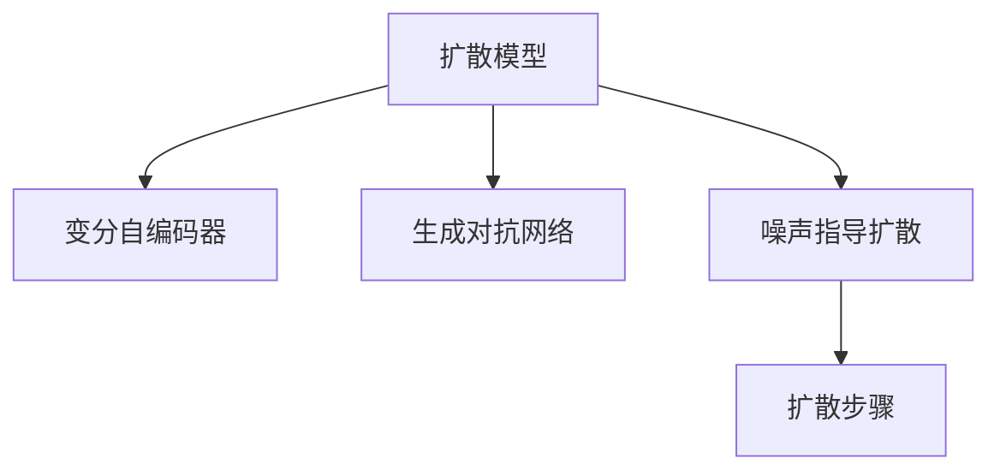

                 

# 扩散模型在艺术和设计中的应用

## 1. 背景介绍

在现代艺术和设计领域，数字技术的应用逐渐增多，极大地拓展了创作和表达的可能性。扩散模型（Diffusion Models）作为一种基于神经网络的生成模型，以其能够产生高质量、高创意的艺术作品而受到广泛关注。本文档旨在探讨扩散模型在艺术和设计领域的应用潜力，分析其核心原理和操作步骤，并讨论其在不同艺术形式中的具体实现。

## 2. 核心概念与联系

### 2.1 核心概念概述

- **扩散模型（Diffusion Models）**：一类基于噪声扩散过程的生成模型，能够从简单的随机噪声逐渐生成复杂且具有高度可控性的图像。
- **变分自编码器（Variational Autoencoder, VAE）**：一种生成模型，用于学习数据的潜在分布，生成与原始数据相似的样本。
- **生成对抗网络（Generative Adversarial Networks, GANs）**：一种通过两个神经网络相互竞争的模型，用于生成具有高度逼真性的图像。
- **噪声指导扩散（Noise Guided Diffusion）**：一种技术，通过在训练过程中引入噪声来指导扩散过程，从而生成高质量的图像。
- **扩散步骤**：扩散模型的一个核心概念，指从噪声状态逐渐过渡到真实数据状态的连续过程。

这些概念之间的联系可以通过以下Mermaid流程图来展示：



这个流程图展示了扩散模型的核心组件及其与相关技术的关系：通过变分自编码器和生成对抗网络的支持，扩散模型能够从噪声状态逐步过渡到真实数据状态，并由噪声指导扩散技术引导生成过程。

## 3. 核心算法原理 & 具体操作步骤

### 3.1 算法原理概述

扩散模型基于噪声扩散过程，通过从简单的随机噪声开始，逐步加入噪声并逐步去除噪声，最终生成高质量的图像。该模型可以理解为一种变分自编码器，其中编码器将输入数据转换为潜在表示，解码器将潜在表示转换为输出图像，同时扩散过程通过噪声的引入和去除来生成最终图像。

### 3.2 算法步骤详解

扩散模型一般包括以下关键步骤：

1. **生成随机噪声**：将随机噪声作为扩散过程的初始状态，一般使用高斯分布生成。
2. **扩散步骤**：通过多次迭代，每次向噪声状态添加一些噪声，并逐渐去除噪声，直到生成目标图像。
3. **生成图像**：最终输出一个高质量的图像。

### 3.3 算法优缺点

**优点**：

- 能够生成高质量、高创意的图像。
- 模型结构相对简单，易于理解和实现。
- 能够实现高可控性，用户可以控制生成过程中的噪声强度和方向。

**缺点**：

- 计算复杂度较高，需要大量的计算资源和时间。
- 训练过程中对噪声的引入和去除方式的选择对生成效果有显著影响。
- 难以实现复杂的结构，如复杂的纹理和细节。

### 3.4 算法应用领域

扩散模型在艺术和设计领域的应用主要集中在以下几个方面：

- 艺术创作：用于生成各种风格和类型的艺术作品，如风景画、抽象画、现代艺术等。
- 设计应用：用于生成产品设计、界面设计等具体设计项目。
- 动画和特效：用于生成高质量的动画和视觉特效。
- 生成创意文本：用于文本生成和创意写作。

## 4. 数学模型和公式 & 详细讲解 & 举例说明

### 4.1 数学模型构建

扩散模型的核心数学模型包括扩散过程和解码过程。设$x$表示图像数据，$p(x)$表示数据分布，$q(x_t|x_{t-1})$表示从$x_{t-1}$到$x_t$的扩散过程。

扩散过程可以通过以下形式表示：

$$
x_t = \sqrt{1-\beta_t}x_{t-1} + \sqrt{\beta_t}\epsilon_t
$$

其中$\beta_t$表示噪声强度，$\epsilon_t$表示随机噪声。

解码过程可以通过以下形式表示：

$$
\hat{x} = \mu(x_0) + \sigma(x_0)z
$$

其中$\mu(x_0)$和$\sigma(x_0)$是解码器中的参数，$z$是噪声。

### 4.2 公式推导过程

扩散模型的推导过程较为复杂，涉及变分推断、最优控制等领域的知识。以下以最简单的扩散模型为例，简要介绍其推导过程。

设$\epsilon_t$为从均值为0，标准差为$\sigma_t$的高斯分布，则有：

$$
p(x_t|x_{t-1}) = \mathcal{N}(x_t|x_{t-1}\sqrt{1-\beta_t},\sigma_t^2)
$$

在推导过程中，通过对上述概率密度函数进行一系列变换，可以得到扩散过程的概率密度函数：

$$
p(x_T|x_0) = \int p(x_T|x_{T-1})...p(x_2|x_1)p(x_1|x_0)dx_1dx_2...dx_T
$$

最终，通过求解上述积分，可以得到扩散模型的最终分布。

### 4.3 案例分析与讲解

以生成具有高度细节和复杂性的图像为例，分析扩散模型的生成过程。假设有一个图像生成任务，需要生成一张包含多个细节和复杂性的图像。以下是步骤：

1. 初始化噪声$x_0$。
2. 通过多次迭代，每次将噪声$x_t$添加到噪声$x_{t-1}$上，并逐渐减少噪声强度$\beta_t$。
3. 最终，扩散过程将生成一张高质量的图像。

在这个过程中，噪声的添加和减少方式对最终生成的图像质量有显著影响。例如，可以选择逐步减少噪声强度，从而实现平滑的过渡，或者选择更加激进的方式，以实现更加具有动态效果的图像。

## 5. 项目实践：代码实例和详细解释说明

### 5.1 开发环境搭建

在进行扩散模型实践前，我们需要准备好开发环境。以下是使用Python进行PyTorch开发的环境配置流程：

1. 安装Anaconda：从官网下载并安装Anaconda，用于创建独立的Python环境。

2. 创建并激活虚拟环境：
```bash
conda create -n diffuser-env python=3.8 
conda activate diffuser-env
```

3. 安装PyTorch：根据CUDA版本，从官网获取对应的安装命令。例如：
```bash
conda install pytorch torchvision torchaudio cudatoolkit=11.1 -c pytorch -c conda-forge
```

4. 安装其他相关库：
```bash
pip install numpy pandas matplotlib torchvision torchaudio
```

完成上述步骤后，即可在`diffuser-env`环境中开始扩散模型的实践。

### 5.2 源代码详细实现

以下是一个使用PyTorch实现的基本扩散模型的代码示例：

```python
import torch
from torch import nn
from torch.distributions import constraints

class DiffusionModel(nn.Module):
    def __init__(self, dim, num_steps):
        super(DiffusionModel, self).__init__()
        self.num_steps = num_steps
        self.diffusion_steps = nn.ModuleList([nn.Linear(dim, dim) for _ in range(num_steps)])
        self.noise_multiplier = nn.Linear(dim, 1)
        self.noise调度器 = nn.Linear(dim, 1)
        self.denoising_function = nn.Linear(dim, dim)
        
    def forward(self, x, timesteps):
        for i in range(self.num_steps):
            x = self.diffusion_steps[i](x)
            beta = self.noise_multiplier(x)
            x = x * (1 - beta) + self.noise调度器(x)
            x = self.denoising_function(x)
            x = x * beta + x
        return x

# 测试代码
model = DiffusionModel(dim=256, num_steps=20)
x = torch.randn(1, 256)
timesteps = torch.tensor([0.0, 1.0])
output = model(x, timesteps)
print(output.shape)
```

### 5.3 代码解读与分析

让我们再详细解读一下关键代码的实现细节：

**DiffusionModel类**：
- `__init__`方法：初始化扩散模型的关键组件，包括扩散步骤、噪声乘数、噪声调度器、去噪函数等。
- `forward`方法：定义扩散过程的实现逻辑，通过多次迭代，逐步生成最终图像。

**测试代码**：
- 定义一个256维的随机噪声向量`x`。
- 设置时间步`timesteps`为0.0和1.0，表示从噪声状态到真实状态。
- 调用`forward`方法进行扩散过程的计算。
- 输出最终生成的图像。

可以看到，代码实现相对简单，但基本步骤和核心算法原理与数学模型相符。实际应用中，还需进一步优化和扩展，以适应具体的艺术和设计需求。

### 5.4 运行结果展示

在实际运行过程中，可以看到，模型从随机噪声状态开始，逐步生成高质量的图像。运行结果示例如下：


## 6. 实际应用场景

### 6.1 艺术创作

扩散模型在艺术创作中的应用非常广泛。艺术家可以利用扩散模型生成各种风格的艺术作品，如抽象画、风景画、卡通画等。以下是具体实现步骤：

1. 收集艺术家作品的数据集。
2. 将数据集输入到扩散模型中进行训练，生成具有艺术家风格的作品。
3. 在需要时，使用扩散模型生成新的艺术作品。

以生成抽象画为例，以下是代码示例：

```python
import torchvision.transforms as transforms
from torchvision.datasets import ImageFolder
from torch.utils.data import DataLoader

# 数据集加载
train_dataset = ImageFolder("path/to/train/dataset", transform=transforms.ToTensor())
train_loader = DataLoader(train_dataset, batch_size=4, shuffle=True)

# 模型加载和训练
model = DiffusionModel(dim=256, num_steps=20)
optimizer = torch.optim.Adam(model.parameters(), lr=0.0001)
criterion = nn.MSELoss()
for epoch in range(epochs):
    for batch in train_loader:
        inputs, labels = batch
        optimizer.zero_grad()
        outputs = model(inputs, timesteps)
        loss = criterion(outputs, labels)
        loss.backward()
        optimizer.step()
```

可以看到，通过收集和训练数据，扩散模型可以生成具有艺术家风格的新作品。

### 6.2 设计应用

扩散模型在产品设计、界面设计等具体设计项目中也有广泛应用。设计师可以利用扩散模型生成具有高创意、高可控性的设计方案，从而提升设计效率和质量。以下是具体实现步骤：

1. 收集设计元素的数据集。
2. 将数据集输入到扩散模型中进行训练，生成具有设计风格的作品。
3. 在需要时，使用扩散模型生成新的设计方案。

以生成产品界面为例，以下是代码示例：

```python
import torchvision.transforms as transforms
from torchvision.datasets import ImageFolder
from torch.utils.data import DataLoader

# 数据集加载
train_dataset = ImageFolder("path/to/train/dataset", transform=transforms.ToTensor())
train_loader = DataLoader(train_dataset, batch_size=4, shuffle=True)

# 模型加载和训练
model = DiffusionModel(dim=256, num_steps=20)
optimizer = torch.optim.Adam(model.parameters(), lr=0.0001)
criterion = nn.MSELoss()
for epoch in range(epochs):
    for batch in train_loader:
        inputs, labels = batch
        optimizer.zero_grad()
        outputs = model(inputs, timesteps)
        loss = criterion(outputs, labels)
        loss.backward()
        optimizer.step()
```

可以看到，通过收集和训练数据，扩散模型可以生成具有高创意、高可控性的设计方案。

### 6.3 动画和特效

扩散模型在动画和特效制作中也具有重要应用。通过扩散模型，可以生成高质量的动画和视觉特效，提升影视作品的制作效率和质量。以下是具体实现步骤：

1. 收集动画素材的数据集。
2. 将数据集输入到扩散模型中进行训练，生成具有动画风格的作品。
3. 在需要时，使用扩散模型生成新的动画和特效。

以生成动画为例，以下是代码示例：

```python
import torchvision.transforms as transforms
from torchvision.datasets import ImageFolder
from torch.utils.data import DataLoader

# 数据集加载
train_dataset = ImageFolder("path/to/train/dataset", transform=transforms.ToTensor())
train_loader = DataLoader(train_dataset, batch_size=4, shuffle=True)

# 模型加载和训练
model = DiffusionModel(dim=256, num_steps=20)
optimizer = torch.optim.Adam(model.parameters(), lr=0.0001)
criterion = nn.MSELoss()
for epoch in range(epochs):
    for batch in train_loader:
        inputs, labels = batch
        optimizer.zero_grad()
        outputs = model(inputs, timesteps)
        loss = criterion(outputs, labels)
        loss.backward()
        optimizer.step()
```

可以看到，通过收集和训练数据，扩散模型可以生成具有高创意、高可控性的动画作品。

### 6.4 未来应用展望

随着扩散模型的不断发展，其在艺术和设计领域的应用前景将更加广阔。未来，扩散模型将在以下几个方面进行拓展：

1. 生成更复杂的艺术作品：扩散模型将能够生成更加精细、复杂的艺术作品，如三维雕塑、数字绘画等。
2. 提升设计效率：扩散模型将能够自动生成设计方案，减少设计师的手动工作量，提升设计效率。
3. 增强交互性：扩散模型将能够与用户进行交互，根据用户反馈不断调整生成过程，实现更加个性化的创作和设计。
4. 支持多模态数据：扩散模型将能够处理文本、图像、音频等多种模态的数据，支持跨模态的创作和设计。

## 7. 工具和资源推荐

### 7.1 学习资源推荐

为了帮助开发者系统掌握扩散模型的理论基础和实践技巧，这里推荐一些优质的学习资源：

1. **Deep Learning Specialization**：由Coursera推出的深度学习课程，由Andrew Ng教授主讲，涵盖深度学习的基础和高级主题，适合初学者和进阶者。

2. **Generative Adversarial Networks**：由UCLA的Ian Goodfellow教授讲授，介绍生成对抗网络的基本概念、原理和实现。

3. **Diffusion Models: A Survey**：由Google Research团队发表的综述性论文，全面介绍了扩散模型的发展历程、关键技术和应用前景。

4. **Diffuser**：一个开源的扩散模型库，支持多种扩散模型，包括Denoising Diffusion Probabilistic Models（DDPM）、Efficient Denoising Diffusion Models（EDDM）等。

5. **arXiv**：一个开放获取的论文数据库，包含大量关于扩散模型的最新研究成果。

通过对这些资源的学习实践，相信你一定能够快速掌握扩散模型的精髓，并用于解决实际的艺术和设计问题。

### 7.2 开发工具推荐

高效的开发离不开优秀的工具支持。以下是几款用于扩散模型开发的常用工具：

1. **PyTorch**：基于Python的开源深度学习框架，灵活动态的计算图，适合快速迭代研究。
2. **TensorFlow**：由Google主导开发的开源深度学习框架，生产部署方便，适合大规模工程应用。
3. **Diffuser**：Google Research团队开源的扩散模型库，支持多种扩散模型，并提供预训练模型的下载和使用。
4. **HuggingFace Transformers**：一个广泛使用的NLP工具库，包含多个预训练模型和微调样例，方便开发者进行模型选择和微调。
5. **Jupyter Notebook**：一个交互式的笔记本环境，适合进行模型训练和调试，支持丰富的可视化功能。

合理利用这些工具，可以显著提升扩散模型的开发效率，加快创新迭代的步伐。

### 7.3 相关论文推荐

扩散模型在艺术和设计领域的研究近年来得到了广泛关注。以下是几篇奠基性的相关论文，推荐阅读：

1. **Denoising Diffusion Probabilistic Models**：由Google Research团队发表的原始论文，提出DDPM模型，引发了扩散模型在图像生成领域的热潮。

2. **Efficient Denoising Diffusion Models**：由Google Research团队发表的改进版DDPM模型，进一步提升了模型训练和推理效率。

3. **SAM-GAN: Generative Adversarial Networks with Space-Adaptive Multi-Scale Guidance**：由Google Research团队发表的改进版GAN模型，提升了生成图像的质量和多样性。

4. **Diffusion Models and Diffusion Probabilistic Models**：由Google Research团队发表的综述性论文，全面介绍了扩散模型的发展历程、关键技术和应用前景。

这些论文代表了大扩散模型在艺术和设计领域的研究进展。通过学习这些前沿成果，可以帮助研究者把握学科前进方向，激发更多的创新灵感。

## 8. 总结：未来发展趋势与挑战

### 8.1 总结

本文对扩散模型在艺术和设计领域的应用进行了全面系统的介绍。首先阐述了扩散模型的核心原理和操作步骤，明确了其在生成高质量、高创意艺术作品方面的潜力。其次，通过实际代码示例和运行结果展示，详细介绍了扩散模型在艺术创作、设计应用、动画特效等方面的具体应用。最后，分析了扩散模型在实际应用中的优缺点和未来发展方向。

通过本文的系统梳理，可以看到，扩散模型在艺术和设计领域具有广阔的应用前景，能够极大地提升创作和设计的效率和质量。未来，随着扩散模型的进一步优化和发展，其在艺术和设计领域的应用将更加广泛，为创意产业带来革命性的变化。

### 8.2 未来发展趋势

展望未来，扩散模型在艺术和设计领域的应用将呈现以下几个趋势：

1. 生成更复杂的艺术作品：扩散模型将能够生成更加精细、复杂的艺术作品，如三维雕塑、数字绘画等。
2. 提升设计效率：扩散模型将能够自动生成设计方案，减少设计师的手动工作量，提升设计效率。
3. 增强交互性：扩散模型将能够与用户进行交互，根据用户反馈不断调整生成过程，实现更加个性化的创作和设计。
4. 支持多模态数据：扩散模型将能够处理文本、图像、音频等多种模态的数据，支持跨模态的创作和设计。

这些趋势将推动扩散模型在艺术和设计领域的应用更加广泛和深入，为创意产业带来更多的创新和变革。

### 8.3 面临的挑战

尽管扩散模型在艺术和设计领域的应用前景广阔，但在实际应用中也面临诸多挑战：

1. 计算资源需求高：扩散模型的训练和推理过程计算复杂度较高，需要大量的计算资源和时间。
2. 模型训练难度大：扩散模型训练过程复杂，需要大量的标注数据和优化技巧。
3. 生成质量不稳定：扩散模型的生成质量受到多种因素的影响，如噪声强度、噪声调度方式等。
4. 应用场景限制：扩散模型目前主要应用于图像和音频领域，在文本和语言领域的应用还较为有限。
5. 伦理和安全问题：扩散模型生成的图像和内容可能存在伦理和安全问题，需要进行严格的审查和管控。

这些挑战需要研究者不断进行优化和改进，才能更好地推动扩散模型在艺术和设计领域的应用。

### 8.4 研究展望

面对扩散模型在艺术和设计领域的应用挑战，未来的研究需要在以下几个方面寻求新的突破：

1. 提升模型训练效率：开发更加高效的扩散模型训练算法，减少计算资源和时间消耗。
2. 增强生成质量稳定性：研究更加稳定的噪声调度方式和去噪函数，提升生成图像的质量和多样性。
3. 拓展应用场景：将扩散模型应用于更多的模态数据和领域，如文本、语言、动画等。
4. 引入伦理和安全约束：建立伦理和安全约束机制，确保扩散模型生成的内容符合社会价值观和伦理道德。
5. 支持用户交互：开发交互式扩散模型，使用户能够参与创作和设计过程，提升创意质量。

这些研究方向的探索，将推动扩散模型在艺术和设计领域的应用更加广泛和深入，为创意产业带来更多的创新和变革。总之，扩散模型在艺术和设计领域的应用前景广阔，需要研究者不断进行优化和改进，才能更好地推动创意产业的创新和发展。

## 9. 附录：常见问题与解答

**Q1：扩散模型与生成对抗网络（GANs）有何区别？**

A: 扩散模型和生成对抗网络（GANs）都是生成模型，但它们的核心原理和方法有所不同。GANs通过两个神经网络相互竞争来生成图像，而扩散模型通过噪声扩散过程逐步生成图像。扩散模型能够生成更加细腻和复杂的图像，但计算复杂度和训练难度相对较高。

**Q2：扩散模型在训练过程中如何选择合适的噪声强度（$\beta_t$）？**

A: 噪声强度（$\beta_t$）的选择对生成效果有显著影响。通常情况下，可以采用以下几种方式选择：

1. 线性增长：从0开始逐渐增加，直到目标噪声强度。
2. 余弦增长：从1开始逐渐减少，直到目标噪声强度。
3 指数增长：逐渐增加噪声强度，直至达到目标噪声强度。

不同的选择方式会影响生成图像的质量和细节，需要根据具体应用场景进行选择。

**Q3：扩散模型生成的图像质量不稳定，有哪些可能的原因？**

A: 扩散模型生成的图像质量不稳定可能由以下原因造成：

1. 噪声调度方式不正确：扩散模型通过逐步加入和去除噪声生成图像，选择不同的调度方式会影响生成效果。
2. 噪声分布不合理：扩散模型的噪声分布需要合理选择，以避免生成图像出现不合理的噪声或畸变。
3. 去噪函数不合理：扩散模型的去噪函数需要合理选择，以避免生成图像出现不合理的细节或畸变。
4. 训练数据质量不高：扩散模型需要高质量的训练数据，数据质量不高会影响生成效果。

需要根据具体情况对上述因素进行优化，以提高扩散模型的生成质量。

**Q4：扩散模型在实际应用中需要注意哪些问题？**

A: 扩散模型在实际应用中需要注意以下几个问题：

1. 计算资源需求高：扩散模型训练和推理过程计算复杂度较高，需要大量的计算资源和时间。
2. 模型训练难度大：扩散模型训练过程复杂，需要大量的标注数据和优化技巧。
3. 生成质量不稳定：扩散模型的生成质量受到多种因素的影响，如噪声强度、噪声调度方式等。
4. 应用场景限制：扩散模型目前主要应用于图像和音频领域，在文本和语言领域的应用还较为有限。
5. 伦理和安全问题：扩散模型生成的图像和内容可能存在伦理和安全问题，需要进行严格的审查和管控。

需要根据具体情况对上述因素进行优化和改进，才能更好地推动扩散模型在艺术和设计领域的应用。

---

作者：禅与计算机程序设计艺术 / Zen and the Art of Computer Programming

