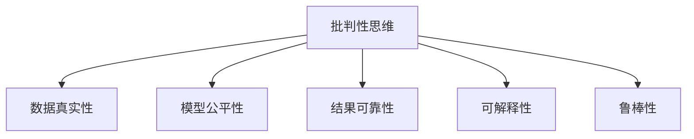

                 

# 批判性思维：提升认知质量

在人工智能(AI)不断演进的时代，批判性思维(Critical Thinking)已成为一种重要的技能，对提升认知质量、提升决策水平至关重要。本文将从核心概念、关键算法、实践指导、应用场景、工具推荐和未来展望等多个方面，系统阐述批判性思维在AI领域的应用和重要性。

## 1. 背景介绍

### 1.1 问题由来
在当前信息爆炸的时代，人们面临大量的数据和信息，如何从海量信息中辨识真伪、提炼关键、做出合理决策，变得愈发困难。尤其是在AI领域，模型训练、推理等过程中，如何确保数据和模型的可靠性，防止误导性的输出，更是关键。

### 1.2 问题核心关键点
- **数据真实性**：确保模型训练数据的质量，避免因数据偏差、噪声、假数据等问题导致模型误导。
- **模型公平性**：保证模型对不同群体的公平性，防止因偏见、歧视等现象导致的输出不公。
- **结果可靠性**：确保模型推理和输出的可靠性，避免因模型错误、推理失误等导致决策失误。
- **可解释性**：提供模型决策的透明和可解释性，便于理解和审查模型的输出。
- **鲁棒性**：增强模型对异常输入和变化数据的适应性，避免因数据扰动或模型过拟合导致的不稳定性。

## 2. 核心概念与联系

### 2.1 核心概念概述

为更好地理解批判性思维在AI中的应用，本节将介绍几个密切相关的核心概念：

- **批判性思维**：指通过质疑、分析和评估信息，以形成基于证据和逻辑的决策能力。在AI中，批判性思维表现为对数据、模型、推理的严谨审查，确保输出的可信性和合理性。
- **数据真实性**：指数据的准确性、完整性和真实性，确保模型训练的依据是可靠的。
- **模型公平性**：指模型对不同群体的公平对待，避免因数据偏差导致的偏见。
- **结果可靠性**：指模型推理和输出的准确性和稳定性，确保决策的可靠性和安全性。
- **可解释性**：指模型决策过程的透明性和可解释性，便于理解和审查模型的行为。
- **鲁棒性**：指模型对异常输入和数据变化的适应性，确保模型在多变环境下的稳定性和鲁棒性。

这些核心概念之间的逻辑关系可以通过以下Mermaid流程图来展示：



这个流程图展示了一个批判性思维主导的AI系统结构，其中每个概念都是其关键组成部分。

## 3. 核心算法原理 & 具体操作步骤

### 3.1 算法原理概述

批判性思维在AI中的应用，通常通过以下几个关键步骤来实现：

1. **数据审查**：对输入数据进行全面审查，确保其真实性、完整性和代表性。
2. **模型评估**：使用多种指标和工具评估模型性能，确保其公平性、可靠性和鲁棒性。
3. **结果验证**：通过交叉验证、对抗测试等方法验证模型输出，确保其可靠性。
4. **透明可解释**：提供模型决策过程的透明性和可解释性，便于理解和审查模型的行为。

### 3.2 算法步骤详解

**Step 1: 数据审查**
- 确定数据源的可靠性和真实性，进行数据清洗，去除异常值和噪声。
- 对数据进行分布分析，检查是否存在样本偏差或特征不平衡。
- 使用数据增强等技术，丰富训练集的多样性，减少过拟合风险。

**Step 2: 模型评估**
- 使用准确率、召回率、F1值等指标评估模型性能。
- 使用A/B测试、交叉验证等方法评估模型在不同数据分布下的表现。
- 使用对抗样本检测模型鲁棒性，确保模型对输入扰动具有一定抵御能力。

**Step 3: 结果验证**
- 使用真实世界数据验证模型输出，检查模型的泛化能力和鲁棒性。
- 使用解释性模型或可解释技术，如LIME、SHAP等，解释模型的推理过程。
- 使用对抗攻击、梯度掩蔽等技术验证模型的稳定性和安全性。

**Step 4: 透明可解释**
- 使用可解释模型或可解释技术，提供模型决策的透明性和可解释性。
- 使用可视化工具展示模型关键特征和决策路径。
- 使用语言模型提示技术，引导模型提供更加详细和具体的解释。

### 3.3 算法优缺点

批判性思维在AI中的应用具有以下优点：
1. 提高数据和模型的可信度，降低误导风险。
2. 提升模型输出的可靠性和鲁棒性，增强系统的安全性。
3. 提供透明和可解释的决策过程，便于审查和监管。

同时，该方法也存在一定的局限性：
1. 增加了模型的复杂度和计算成本。
2. 可能需要更多的训练数据和计算资源。
3. 模型的可解释性依赖于具体的解释方法，可能存在解释误差。

尽管存在这些局限性，但就目前而言，批判性思维在AI中的应用正变得越来越重要，成为确保系统可靠性和安全性不可或缺的一环。

### 3.4 算法应用领域

批判性思维在AI中的应用领域非常广泛，涉及以下几个方面：

- **医疗健康**：确保医疗诊断数据的真实性，保证模型对不同病症的公平性，提高诊断的可靠性和可解释性。
- **金融风险**：评估金融数据的真实性，确保模型对不同群体的公平性，增强金融预测的可靠性。
- **自动驾驶**：确保环境感知数据的真实性，提升自动驾驶模型的鲁棒性和可解释性，确保安全驾驶。
- **智能客服**：审查输入数据和模型输出，确保客户服务的一致性和安全性。
- **网络安全**：检测和防御数据注入、对抗样本等攻击，提升系统的鲁棒性和安全性。

这些领域的应用展示了批判性思维在确保AI系统可靠性和安全性方面的重要性和广泛性。

## 4. 数学模型和公式 & 详细讲解 & 举例说明

### 4.1 数学模型构建

批判性思维在AI中的应用，可以通过数学模型和公式来进行更加严格的刻画。

- **数据审查模型**：假设数据集为 $D=\{(x_i,y_i)\}_{i=1}^N$，其中 $x_i$ 为输入，$y_i$ 为标签。数据审查模型的目标是通过 $D$ 训练出一个判别器 $M_{\theta}$，使得 $M_{\theta}(x_i) \approx 1$ 表示数据真实，$M_{\theta}(x_i) \approx 0$ 表示数据不真实。
- **模型评估模型**：使用 $D$ 和测试集 $D_{test}$ 评估模型 $M_{\theta}$ 的性能，目标是最小化损失函数 $\mathcal{L}(\theta)$。
- **结果验证模型**：使用对抗样本生成器 $G$ 生成对抗样本 $x'$，检查模型 $M_{\theta}$ 的鲁棒性，目标是最小化损失函数 $\mathcal{L}_{robust}(\theta)$。
- **可解释模型**：使用解释性模型 $M_{\phi}$ 和解释技术 $E$，解释模型 $M_{\theta}$ 的决策过程，目标是最小化解释误差 $\mathcal{E}(E(\theta),\phi)$。

### 4.2 公式推导过程

以数据审查模型为例，其损失函数定义为：

$$
\mathcal{L}(\theta) = \frac{1}{N}\sum_{i=1}^N -\log M_{\theta}(x_i)
$$

其中 $M_{\theta}(x_i)$ 表示判别器对输入数据 $x_i$ 的真实性预测，$\log$ 函数用于计算预测结果的对数，取负号是因为我们希望预测真实的数据。

使用梯度下降算法更新模型参数 $\theta$，目标是最小化损失函数：

$$
\theta \leftarrow \theta - \eta \nabla_{\theta}\mathcal{L}(\theta)
$$

其中 $\eta$ 为学习率，$\nabla_{\theta}\mathcal{L}(\theta)$ 为损失函数对参数 $\theta$ 的梯度。

### 4.3 案例分析与讲解

以一个简单的医疗诊断数据审查为例，展示如何应用数学模型进行数据审查：

假设数据集 $D=\{(x_i,y_i)\}_{i=1}^N$，其中 $x_i$ 为病人症状，$y_i$ 为医生诊断结果。使用一个二分类模型 $M_{\theta}$ 作为数据审查模型，预测 $x_i$ 的真实性。模型参数 $\theta$ 包括权重和偏置。

**数据审查模型的构建**：
1. 收集医疗数据集 $D$。
2. 将数据分为训练集和测试集。
3. 使用训练集 $D_{train}$ 训练模型 $M_{\theta}$，最小化损失函数 $\mathcal{L}(\theta)$。
4. 使用测试集 $D_{test}$ 评估模型性能，选择性能最优的模型 $M_{\theta}$。

**模型评估与验证**：
1. 使用交叉验证等技术，评估模型在不同数据分布下的性能。
2. 使用对抗样本生成器 $G$，生成对抗样本 $x'$，评估模型的鲁棒性。
3. 使用可解释性模型 $M_{\phi}$ 和解释技术 $E$，解释模型的决策过程，验证模型的可解释性。

## 5. 项目实践：代码实例和详细解释说明

### 5.1 开发环境搭建

在进行批判性思维应用实践前，我们需要准备好开发环境。以下是使用Python进行TensorFlow开发的环境配置流程：

1. 安装Anaconda：从官网下载并安装Anaconda，用于创建独立的Python环境。

2. 创建并激活虚拟环境：
```bash
conda create -n tf-env python=3.8 
conda activate tf-env
```

3. 安装TensorFlow：根据CUDA版本，从官网获取对应的安装命令。例如：
```bash
conda install tensorflow -c pytorch -c conda-forge
```

4. 安装各类工具包：
```bash
pip install numpy pandas scikit-learn matplotlib tqdm jupyter notebook ipython
```

完成上述步骤后，即可在`tf-env`环境中开始实践。

### 5.2 源代码详细实现

以下是一个简单的医疗诊断数据审查模型的PyTorch代码实现：

```python
import torch
import torch.nn as nn
import torch.optim as optim
from sklearn.model_selection import train_test_split
from sklearn.metrics import accuracy_score

class DiagnosisReview(nn.Module):
    def __init__(self):
        super(DiagnosisReview, self).__init__()
        self.fc1 = nn.Linear(5, 10)
        self.fc2 = nn.Linear(10, 1)
    
    def forward(self, x):
        x = torch.relu(self.fc1(x))
        x = torch.sigmoid(self.fc2(x))
        return x

# 加载数据集
data = load_data('diagnosis.csv')
features = data[['symptom1', 'symptom2', 'symptom3', 'symptom4', 'symptom5']]
labels = data['diagnosis']

# 划分数据集
train_features, test_features, train_labels, test_labels = train_test_split(features, labels, test_size=0.2, random_state=42)

# 构建模型
model = DiagnosisReview()
criterion = nn.BCELoss()
optimizer = optim.Adam(model.parameters(), lr=0.01)

# 训练模型
for epoch in range(10):
    optimizer.zero_grad()
    outputs = model(train_features)
    loss = criterion(outputs, train_labels)
    loss.backward()
    optimizer.step()
    print(f'Epoch {epoch+1}, Loss: {loss.item()}')

# 评估模型
outputs = model(test_features)
predicted_labels = (outputs > 0.5).float()
print(f'Accuracy: {accuracy_score(test_labels, predicted_labels)}')
```

### 5.3 代码解读与分析

让我们再详细解读一下关键代码的实现细节：

**DiagnosisReview类**：
- `__init__`方法：定义模型的结构，包括两个全连接层。
- `forward`方法：定义前向传播的计算过程。

**数据处理**：
- `load_data`函数：加载医疗诊断数据集，并进行数据清洗和划分。
- `train_features`和`test_features`：训练集和测试集的数据特征。
- `train_labels`和`test_labels`：训练集和测试集的标签。

**模型训练**：
- `DiagnosisReview`模型：定义一个简单的二分类模型。
- `nn.BCELoss`损失函数：二分类交叉熵损失函数。
- `Adam`优化器：使用Adam优化器更新模型参数。
- `for`循环：迭代10个epoch，每次更新模型参数。

**模型评估**：
- `predicted_labels`：模型对测试集的预测结果。
- `accuracy_score`函数：计算模型的准确率。

以上代码展示了如何通过TensorFlow进行一个简单的医疗诊断数据审查模型的训练和评估。可以看到，TensorFlow提供了丰富的API和工具，便于开发者进行模型构建和评估。

## 6. 实际应用场景

### 6.1 智能客服系统

基于批判性思维的智能客服系统，可以有效地审查和验证客户输入，确保系统输出的准确性和可靠性。通过批判性思维的应用，客服系统可以实时检测并识别异常输入，防止恶意攻击和数据注入，提升客户服务的质量和安全性。

### 6.2 金融风险监测

在金融风险监测中，批判性思维的应用可以显著提高数据真实性的审查效率，确保模型对不同群体的公平性，提升金融预测的准确性和鲁棒性。通过对输入数据和模型输出进行全面审查，金融风险监测系统可以更准确地识别和防范金融风险。

### 6.3 自动驾驶

在自动驾驶系统中，批判性思维的应用可以确保环境感知数据的真实性和鲁棒性，提升模型的决策透明度和可解释性，确保自动驾驶的安全性和可靠性。通过对输入数据和模型输出的全面审查，自动驾驶系统可以更好地应对复杂和多变的驾驶环境。

### 6.4 网络安全

基于批判性思维的网络安全系统可以检测和防御各种攻击，确保数据和系统的安全。通过对输入数据的全面审查和模型输出的验证，网络安全系统可以更有效地识别和防范数据注入、对抗样本等攻击，提升系统的鲁棒性和安全性。

## 7. 工具和资源推荐

### 7.1 学习资源推荐

为了帮助开发者系统掌握批判性思维在AI中的应用，这里推荐一些优质的学习资源：

1. 《批判性思维导论》：介绍批判性思维的基本概念、方法和技巧，适用于初学者入门。
2. 《数据科学批判性思维》：结合数据科学的具体应用场景，深入讲解批判性思维的实际应用。
3. 《TensorFlow教程》：介绍TensorFlow的使用方法和最佳实践，适用于TensorFlow开发者。
4. 《深度学习批判性思维》：结合深度学习的应用场景，深入讲解批判性思维的实际应用。
5. 《自然语言处理批判性思维》：结合自然语言处理的具体应用场景，深入讲解批判性思维的实际应用。

通过对这些资源的学习实践，相信你一定能够系统掌握批判性思维在AI中的应用，并用于解决实际的AI问题。

### 7.2 开发工具推荐

高效的开发离不开优秀的工具支持。以下是几款用于批判性思维应用的开发工具：

1. TensorFlow：基于Python的开源深度学习框架，支持分布式计算和GPU加速，适合复杂模型训练和推理。
2. PyTorch：基于Python的开源深度学习框架，支持动态计算图和GPU加速，适合快速迭代和研究。
3. Jupyter Notebook：支持交互式编程和可视化，便于开发者进行代码编写和结果展示。
4. Visual Studio Code：支持丰富的扩展和插件，方便开发者进行代码编写和调试。
5. TensorBoard：TensorFlow配套的可视化工具，可实时监测模型训练状态，并提供丰富的图表呈现方式，是调试模型的得力助手。

合理利用这些工具，可以显著提升批判性思维应用的开发效率，加快创新迭代的步伐。

### 7.3 相关论文推荐

批判性思维在AI中的应用源于学界的持续研究。以下是几篇奠基性的相关论文，推荐阅读：

1. 《Data-Driven Explainable AI》：介绍数据驱动的解释性AI技术，提升模型的透明性和可解释性。
2. 《Fairness, Accountability, and Transparency》：介绍公平性、责任和透明性的AI系统构建方法，提升模型的公平性和可信度。
3. 《Adversarial Robustness in Neural Networks》：介绍对抗样本生成和检测方法，提升模型的鲁棒性和安全性。
4. 《Robustness and Interpretability of Neural Networks》：介绍神经网络的鲁棒性和可解释性评估方法，提升模型的稳定性和可理解性。
5. 《Explainable Machine Learning》：介绍可解释机器学习的研究进展和应用方法，提升模型的透明性和可理解性。

这些论文代表了大语言模型微调技术的发展脉络。通过学习这些前沿成果，可以帮助研究者把握学科前进方向，激发更多的创新灵感。

## 8. 总结：未来发展趋势与挑战

### 8.1 总结

本文对批判性思维在AI中的应用进行了全面系统的介绍。首先阐述了批判性思维在AI中的重要性和应用场景，明确了其对提高数据和模型可信度、提升模型可靠性和鲁棒性、增强模型可解释性等方面的独特价值。其次，从原理到实践，详细讲解了批判性思维的应用流程和关键步骤，给出了批判性思维应用任务的完整代码实例。同时，本文还广泛探讨了批判性思维在多个行业领域的应用前景，展示了其广阔的应用潜力和重要性。

通过本文的系统梳理，可以看到，批判性思维在AI中的应用正变得越来越重要，成为确保系统可靠性和安全性不可或缺的一环。

### 8.2 未来发展趋势

展望未来，批判性思维在AI中的应用将呈现以下几个发展趋势：

1. 模型复杂度的增加。随着模型结构越来越复杂，批判性思维的应用将变得更加重要，以确保模型的可靠性和可解释性。
2. 自动化程度提升。未来的自动化工具将更加智能化，能够自动进行数据审查、模型评估和结果验证。
3. 融合多模态信息。批判性思维将结合视觉、听觉等多种模态信息，提升模型的综合感知能力。
4. 引入更多先验知识。批判性思维将引入更多的领域知识，提升模型的公平性和鲁棒性。
5. 增强可解释性和透明度。未来的解释性技术将更加完善，能够提供更透明和详细的模型解释。

这些趋势展示了批判性思维在AI中的重要性和发展前景。

### 8.3 面临的挑战

尽管批判性思维在AI中的应用正日益普及，但在迈向更加智能化、普适化应用的过程中，它仍面临着诸多挑战：

1. 数据量不足。虽然批判性思维能够有效提高数据和模型的可信度，但在数据量不足的情况下，模型的泛化能力将受到限制。
2. 模型复杂度增加。随着模型结构越来越复杂，批判性思维的应用难度也将增加。
3. 自动化工具的完善。自动化工具的开发和应用是批判性思维普及的关键，但目前仍存在许多技术和应用上的挑战。
4. 领域知识的应用。批判性思维需要结合领域知识，提升模型的公平性和鲁棒性，但领域知识的获取和应用仍需进一步研究。
5. 解释性的提升。批判性思维需要提供透明和可解释的决策过程，但当前的解释性技术仍存在一定的局限性。

## 9. 附录：常见问题与解答

**Q1：如何提高数据和模型的可信度？**

A: 提高数据和模型的可信度需要从数据审查和模型评估两个方面入手：
1. 数据审查：确保数据的真实性、完整性和代表性，使用数据增强技术丰富训练集。
2. 模型评估：使用多种指标和工具评估模型性能，确保模型的公平性和鲁棒性。

**Q2：如何增强模型的鲁棒性和可解释性？**

A: 增强模型的鲁棒性和可解释性需要结合对抗训练和可解释性技术：
1. 对抗训练：使用对抗样本生成器检测模型的鲁棒性，提升模型对异常输入的抵御能力。
2. 可解释性技术：使用LIME、SHAP等工具解释模型的推理过程，提供透明和可解释的决策支持。

**Q3：如何自动进行数据审查和模型评估？**

A: 自动进行数据审查和模型评估需要开发和应用自动化工具：
1. 数据审查工具：使用Python自动化脚本和库进行数据清洗、审查和增强。
2. 模型评估工具：使用TensorBoard、Jupyter Notebook等工具进行模型训练、评估和可视化。

**Q4：如何应用批判性思维提升AI系统的安全性和可靠性？**

A: 应用批判性思维提升AI系统的安全性和可靠性需要综合应用多个技术手段：
1. 数据审查：确保输入数据的真实性和代表性。
2. 模型评估：使用交叉验证、对抗测试等技术评估模型的鲁棒性和可靠性。
3. 可解释性：提供透明和可解释的决策过程，便于审查和监管。

这些方法和工具的应用，将帮助开发者构建更加安全、可靠、可解释和鲁棒的AI系统，提升系统的整体性能和应用价值。总之，批判性思维在AI中的应用需要结合数据审查、模型评估、可解释性等多个方面，综合应用各种技术和工具，才能确保系统的可靠性和安全性。

