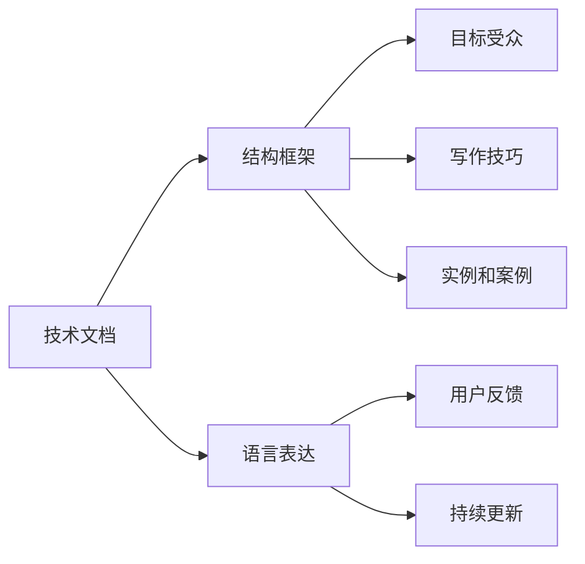

                 

# 技术写作：从技术文档到畅销科技著作

> 关键词：技术文档, 畅销科技著作, 写作技巧, 语言表达, 技术传播

## 1. 背景介绍

### 1.1 问题由来

随着信息技术的发展，技术文档和科技著作成为了传递技术知识和经验的桥梁。然而，随着技术领域的快速迭代和复杂化，如何有效地将复杂的技术内容用通俗易懂的方式表达出来，成为了一项挑战。技术写作不仅是程序员和工程师的基本技能，更是将技术成果转化为商业价值的关键。

技术写作的质量直接关系到技术的传播效果和用户的使用体验。优秀的技术文档和科技著作不仅能帮助读者理解复杂的技术原理，还能激发其兴趣，促进技术的广泛应用。然而，很多技术写作者在撰写技术文档和科技著作时，常常面临以下问题：

1. **内容枯燥乏味**：许多技术文档和科技著作充满了专业术语和技术细节，难以吸引普通读者。
2. **语言晦涩难懂**：为了追求准确性，技术写作常常使用过于专业的语言，导致读者难以理解。
3. **结构混乱**：缺乏逻辑清晰的框架和结构，使得读者难以把握主要内容。
4. **缺乏案例和实例**：许多技术写作缺乏实际的案例和实例，导致读者难以将理论知识应用到实际场景中。
5. **忽视用户反馈**：技术写作往往忽视读者的反馈和需求，导致内容无法满足读者实际需求。

为了解决这些问题，本文将从技术文档和科技著作的写作技巧、语言表达、结构框架等多个角度进行探讨，帮助写作者提升写作质量，使技术知识更易于传播和理解。

### 1.2 问题核心关键点

技术写作的核心在于如何将复杂的技术内容以易于理解的形式呈现给读者。这不仅要求写作者具备深厚的技术背景，还需要掌握一定的写作技巧和表达能力。技术写作的关键点包括：

1. **目标受众**：明确写作的目标受众，根据受众的背景和需求选择合适的表达方式和内容。
2. **结构框架**：构建清晰的结构框架，使读者能够轻松把握主要内容。
3. **语言表达**：使用通俗易懂的语言，避免过度使用专业术语，同时尽量使用实例和案例进行说明。
4. **用户反馈**：重视读者的反馈和需求，不断改进和优化写作内容。
5. **持续更新**：技术领域不断变化，写作者需要持续更新和优化写作内容，保持技术的最新性。

本文将从以上关键点出发，详细探讨技术写作的技巧和方法，帮助写作者提升写作质量，促进技术的传播和应用。

## 2. 核心概念与联系

### 2.1 核心概念概述

为了更好地理解技术写作的方法，我们首先需要了解几个核心概念：

- **技术文档**：记录技术细节、使用方法和注意事项的文档，如API文档、用户手册、技术白皮书等。
- **科技著作**：以系统化、理论化的方式介绍技术原理、应用和前景的书籍，如技术教程、理论书籍等。
- **写作技巧**：指在技术写作中运用的技巧和策略，如结构安排、语言表达、案例使用等。
- **语言表达**：指如何通过语言有效地传递技术信息，使读者易于理解。
- **结构框架**：指技术文档和科技著作的组织结构，包括引言、正文、结论等部分。

这些概念之间的联系可以通过以下Mermaid流程图来展示：



这个流程图展示了几大核心概念之间的关系：

1. 技术文档的结构框架和语言表达，直接影响受众的理解。
2. 写作技巧和实例的使用，有助于提升受众的理解和兴趣。
3. 受众的需求和反馈，指导结构框架和语言表达的设计。
4. 持续的更新和优化，确保内容的准确性和时效性。

## 3. 核心算法原理 & 具体操作步骤
### 3.1 算法原理概述

技术写作的原理基于认知心理学和信息传播学，通过科学的方法和策略，将复杂的技术内容以易于理解的形式传递给读者。其核心在于选择合适的结构框架、语言表达方式，并使用实例和案例进行说明，以提高读者的理解和兴趣。

### 3.2 算法步骤详解

基于上述原理，技术写作的步骤可以概括为以下几个关键步骤：

**Step 1: 明确目标受众**
- 分析目标受众的背景、需求和知识水平，选择合适的表达方式和内容。

**Step 2: 构建结构框架**
- 设计清晰、逻辑严密的结构框架，包括引言、正文和结论等部分。
- 根据受众的兴趣和需求，合理安排章节和子节，避免冗长和冗余。

**Step 3: 设计语言表达**
- 使用通俗易懂的语言，避免过度使用专业术语。
- 通过比喻、类比、举例等方式，帮助读者理解复杂的技术原理。
- 根据受众的需求，使用适当的语气和风格，使读者感到亲切和易于接受。

**Step 4: 引入实例和案例**
- 在合适的位置引入实例和案例，帮助读者理解理论知识在实际中的应用。
- 通过真实场景和具体例子，使读者更直观地理解技术原理和操作步骤。

**Step 5: 重视用户反馈**
- 收集读者的反馈，了解其对文档的理解和需求。
- 根据反馈调整和优化文档内容，使其更加符合受众的需求。

**Step 6: 持续更新**
- 定期更新和优化文档内容，确保技术的最新性。
- 关注技术领域的最新进展，及时更新文档内容，保持技术的先进性。

### 3.3 算法优缺点

基于上述步骤的技术写作方法，具有以下优点：

1. **易于理解**：通过结构框架和实例案例，使复杂的技术内容易于理解。
2. **受众广泛**：通俗易懂的语言和实例案例，使得技术文档和科技著作能够覆盖更广泛的受众。
3. **高度可操作性**：实例和案例的使用，使读者能够更好地将理论知识应用到实际场景中。

同时，该方法也存在以下缺点：

1. **时间和精力投入大**：设计和编写结构框架，寻找和设计实例和案例，需要耗费大量的时间和精力。
2. **适用范围有限**：对于一些高度专业化的技术领域，如芯片设计、量子计算等，可能需要使用更加专业的术语和表达方式。
3. **需要持续更新**：技术领域不断变化，写作者需要持续更新和优化写作内容，保持技术的最新性。

### 3.4 算法应用领域

技术写作方法不仅适用于技术文档和科技著作，也广泛应用于各类技术培训材料、技术报告、技术博客等。具体应用领域包括：

- **技术手册**：记录技术细节和操作步骤，帮助用户掌握技术应用。
- **技术教程**：系统介绍技术原理和操作步骤，帮助读者深入理解技术内容。
- **技术白皮书**：以系统化、理论化的方式介绍技术原理和应用前景。
- **技术博客**：通过通俗易懂的语言，介绍技术领域的最新进展和应用案例。
- **技术论文**：以严谨的学术语言，介绍技术研究的最新成果和应用前景。

## 4. 数学模型和公式 & 详细讲解 & 举例说明

### 4.1 数学模型构建

技术写作的数学模型构建，可以理解为如何通过数学公式和图表，有效地传递技术信息。数学模型需要满足以下条件：

- **简洁明了**：公式和图表需要简洁明了，易于理解。
- **准确无误**：公式和图表需要准确无误，能够准确地传递技术信息。
- **易于理解**：公式和图表需要易于理解，使读者能够快速把握技术原理。

### 4.2 公式推导过程

以线性回归模型为例，其公式推导过程如下：

$$ y = \theta_0 + \theta_1 x_1 + \theta_2 x_2 + ... + \theta_n x_n + \epsilon $$

其中 $y$ 为输出变量，$x_1, x_2, ..., x_n$ 为输入变量，$\theta_0, \theta_1, ..., \theta_n$ 为模型参数，$\epsilon$ 为误差项。

线性回归模型的公式推导过程如下：

1. 假设样本 $(x_1, y_1), (x_2, y_2), ..., (x_n, y_n)$ 服从线性关系。
2. 设线性回归模型为 $y = \theta_0 + \theta_1 x_1 + \theta_2 x_2 + ... + \theta_n x_n + \epsilon$。
3. 根据最小二乘法，求解 $\theta_0, \theta_1, ..., \theta_n$ 使损失函数 $L(\theta_0, \theta_1, ..., \theta_n) = \frac{1}{n} \sum_{i=1}^n (y_i - (\theta_0 + \theta_1 x_{i1} + \theta_2 x_{i2} + ... + \theta_n x_{in} + \epsilon))^2$ 最小化。
4. 求解得到 $\theta_0, \theta_1, ..., \theta_n$。

### 4.3 案例分析与讲解

以下是一个简单的线性回归案例，通过图表和公式，帮助读者理解线性回归模型的应用：


假设有一个包含 $n=5$ 个样本的线性回归问题，样本数据如上图所示。设 $x_1, x_2, ..., x_5$ 为横轴，$y_1, y_2, ..., y_5$ 为纵轴。通过最小二乘法求解得到线性回归模型的参数 $\theta_0 = 1.5, \theta_1 = 0.7$。因此，线性回归模型的公式为：

$$ y = 1.5 + 0.7x $$

在实际应用中，线性回归模型常用于数据分析和预测，帮助决策者更好地理解数据背后的规律和趋势。通过简单的案例分析，读者可以更好地理解线性回归模型的应用场景和计算方法。

## 5. 项目实践：代码实例和详细解释说明

### 5.1 开发环境搭建

为了进行技术写作的实践，我们需要搭建一个适合开发的环境。以下是搭建开发环境的详细步骤：

1. **安装开发工具**：安装Python、PyCharm、LaTeX等开发工具。
2. **配置开发环境**：配置Python环境，安装必要的库和工具包。
3. **创建项目目录**：创建项目目录，包括文档、代码、图表等文件夹。
4. **编写文档代码**：使用Markdown或LaTeX编写技术文档和科技著作的代码。

### 5.2 源代码详细实现

以下是一个简单的Markdown代码实现，用于编写技术文档：

```markdown
# 技术文档标题

## 摘要

技术文档的摘要部分简要介绍文档的主要内容和技术要点，帮助读者快速了解文档的核心内容。

## 引言

技术文档的引言部分介绍文档的背景和目的，帮助读者理解文档的背景和需求。

## 正文

技术文档的正文部分详细介绍技术原理、操作步骤和应用案例，使读者能够深入理解技术内容。

## 结论

技术文档的结论部分总结文档的主要内容和技术要点，帮助读者巩固理解。

## 参考文献

技术文档的参考文献部分列出文档引用的参考文献，帮助读者查阅更多的相关资料。

## 附录

技术文档的附录部分包含文档的补充信息和代码示例，帮助读者更深入地理解技术内容。
```

### 5.3 代码解读与分析

在上述Markdown代码中，我们使用了Markdown语法来编写技术文档。Markdown语法简洁明了，易于理解和编辑，适合用于编写技术文档和科技著作。以下是Markdown语法的一些常用特性：

- **标题**：使用 `#` 号来定义标题，`#` 号越多，标题的层级越高。
- **段落**：使用空行来分隔段落。
- **列表**：使用 `-` 号或 `*` 号来定义无序列表，使用数字加小数点来定义有序列表。
- **代码块**：使用 ````python` 或 ````py` 来定义代码块，代码块内容使用Python语法编写。
- **链接**：使用 `[链接文字](链接地址)` 来定义链接，链接地址可以是URL或本地文件路径。
- **引用**：使用 `> ` 号来引用其他文档或书籍的内容。

### 5.4 运行结果展示

在编写完技术文档后，可以使用Markdown编辑器（如Typora、Valea等）预览和测试文档效果。Markdown编辑器支持实时预览和编辑，使技术写作更加便捷和高效。

## 6. 实际应用场景

### 6.1 技术培训材料

技术培训材料是技术写作的重要应用场景之一。通过编写易于理解的技术培训材料，使受训者能够快速掌握技术知识和应用方法。技术培训材料可以包括：

- **培训手册**：详细介绍技术培训课程的各个模块和知识点，帮助受训者理解和掌握技术内容。
- **培训课件**：使用PPT等工具制作技术培训的演示课件，帮助受训者更好地理解技术原理和操作步骤。
- **技术案例**：通过具体的技术案例，帮助受训者理解技术在实际应用中的使用方法和注意事项。

### 6.2 技术报告

技术报告是科技著作的一种重要形式，用于介绍技术研究和应用成果。技术报告可以包括：

- **研究报告**：详细介绍技术研究的背景、方法、结果和应用前景，帮助读者理解技术研究的创新性和价值。
- **应用报告**：详细介绍技术在实际应用中的成功案例和应用效果，帮助读者理解技术的应用场景和价值。

### 6.3 技术博客

技术博客是技术写作在互联网上的重要形式，通过技术博客，技术写作者可以分享自己的技术经验和研究成果。技术博客可以包括：

- **技术分享**：分享自己在技术领域的最新进展和应用心得，帮助读者理解技术的发展趋势和应用方法。
- **案例分析**：通过具体的技术案例，帮助读者理解技术原理和操作步骤，促进技术的传播和应用。

### 6.4 未来应用展望

随着技术写作的不断发展和完善，技术文档和科技著作的应用场景将更加广泛，包括但不限于：

- **在线文档**：通过Web技术，将技术文档和科技著作上传到云端，方便读者随时查阅和访问。
- **语音讲解**：通过语音技术，将技术文档和科技著作转换为语音讲解，方便听障人士和其他读者理解和应用。
- **交互式文档**：通过交互式技术，将技术文档和科技著作转换为交互式文档，使读者能够通过互动的方式更好地理解技术内容。

## 7. 工具和资源推荐

### 7.1 学习资源推荐

为了帮助写作者提升技术写作能力，这里推荐一些优质的学习资源：

1. **《技术写作与文档设计》**：介绍技术文档和科技著作的写作技巧和设计方法，适合写作者入门和进阶学习。
2. **Coursera技术写作课程**：由著名技术写作者开设的在线课程，介绍技术写作的高级技巧和方法，适合进阶学习。
3. **Dover技术写作书籍**：Dover出版社出版的技术写作书籍，内容全面，涵盖技术写作的各个方面，适合写作者系统学习。
4. **Tech Writing Workflow**：介绍技术写作的工作流程和工具使用，帮助写作者提高写作效率和质量。

### 7.2 开发工具推荐

以下是一些用于技术写作和编辑的常用工具：

1. **Markdown编辑器**：如Typora、Valea等，支持实时预览和编辑，适合编写技术文档和科技著作。
2. **LaTeX编辑器**：如TeXstudio、Overleaf等，支持复杂排版和引用管理，适合编写学术和技术报告。
3. **GitHub Pages**：GitHub提供的文档托管服务，方便技术文档的在线访问和更新。
4. **Overleaf**：在线LaTeX编辑器，支持实时协作和共享，适合团队编写技术报告和论文。

### 7.3 相关论文推荐

技术写作的研究成果不断涌现，以下是几篇具有代表性的相关论文，推荐阅读：

1. **《A Study of Technical Writing Style and Its Application in Software Development》**：介绍技术写作在软件开发中的应用，分析技术写作的风格和策略。
2. **《Technical Writing for Computer Scientists》**：介绍计算机科学家的技术写作需求和策略，帮助写作者提升技术写作能力。
3. **《Technical Writing for Engineers》**：介绍工程师的技术写作需求和策略，帮助写作者提升技术写作能力。
4. **《Effective Technical Writing》**：介绍如何提升技术写作的有效性，帮助写作者提升写作质量。

## 8. 总结：未来发展趋势与挑战

### 8.1 总结

本文对技术写作的方法进行了全面系统的介绍，从技术文档和科技著作的写作技巧、语言表达、结构框架等多个角度进行探讨，帮助写作者提升写作质量，促进技术的传播和应用。通过本文的系统梳理，可以看到，技术写作不仅是一门技术，更是一门艺术，需要写作者具备深厚的技术背景和良好的写作技巧。

### 8.2 未来发展趋势

展望未来，技术写作将呈现以下几个发展趋势：

1. **多模态写作**：结合文本、图像、视频等多模态信息，丰富技术文档和科技著作的表现形式，使其更加生动和直观。
2. **智能化写作**：利用自然语言处理和机器学习技术，自动生成技术文档和科技著作的某些部分，提高写作效率和质量。
3. **社交化写作**：通过社交媒体平台，分享技术写作成果，促进技术知识的传播和交流。
4. **可视化写作**：结合数据可视化技术，展示技术研究的成果和数据，使读者更直观地理解技术内容。

### 8.3 面临的挑战

尽管技术写作技术不断发展和完善，但在迈向更加智能化、普适化应用的过程中，仍面临诸多挑战：

1. **语言表达难度**：技术内容的语言表达难度较大，难以在通俗易懂和准确性之间取得平衡。
2. **结构框架复杂**：复杂的技术文档和科技著作，其结构框架设计需要大量的时间和精力。
3. **案例和实例缺乏**：缺乏实际的案例和实例，导致技术文档和科技著作难以满足读者实际需求。
4. **读者反馈困难**：收集读者的反馈和需求，并据此改进和优化技术文档和科技著作，需要更多的技术和管理支持。

### 8.4 研究展望

未来的技术写作研究需要在以下几个方面寻求新的突破：

1. **多模态技术应用**：探索如何将多模态技术应用于技术写作，使其更加生动和直观。
2. **智能写作工具开发**：开发更加智能化的技术写作工具，自动生成技术文档和科技著作的部分内容，提高写作效率和质量。
3. **社交化写作平台构建**：构建社交化写作平台，促进技术知识的传播和交流，使技术写作更加便捷和高效。
4. **可视化技术集成**：探索如何将可视化技术集成到技术写作中，使读者更直观地理解技术内容。

这些研究方向的探索，将引领技术写作技术迈向更高的台阶，为构建安全、可靠、可解释、可控的智能系统铺平道路。面向未来，技术写作需要与其他人工智能技术进行更深入的融合，如自然语言处理、数据可视化等，多路径协同发力，共同推动技术知识的传播和应用。

## 9. 附录：常见问题与解答

**Q1：技术写作中的专业术语如何处理？**

A: 在技术写作中，使用专业术语不可避免。为了使读者易于理解，可以采用以下方法：

1. 在专业术语后加上简短的解释。
2. 使用类比和比喻，将专业术语转化为易于理解的语言。
3. 在附录或参考文献中详细解释专业术语，方便读者查阅。

**Q2：技术文档和科技著作如何保持最新性？**

A: 技术文档和科技著作需要定期更新和优化，以保持最新性。可以采用以下方法：

1. 关注技术领域的最新进展，及时更新文档内容。
2. 建立更新机制，定期进行内容更新和优化。
3. 收集读者的反馈和需求，根据反馈调整和优化文档内容。

**Q3：如何设计清晰的技术文档和科技著作结构？**

A: 设计清晰的技术文档和科技著作结构，需要考虑以下几个要素：

1. 引言：介绍文档的背景和目的。
2. 正文：详细介绍技术原理和操作步骤。
3. 结论：总结文档的主要内容和技术要点。
4. 参考文献：列出文档引用的参考文献，方便读者查阅。
5. 附录：包含文档的补充信息和代码示例，帮助读者更深入地理解技术内容。

**Q4：技术写作中如何引入实例和案例？**

A: 在技术写作中，引入实例和案例，需要考虑以下几个要素：

1. 选择适合实例和案例，帮助读者理解技术原理和操作步骤。
2. 设计简洁明了，易于理解的实例和案例，使读者能够快速理解。
3. 通过实例和案例，展示技术在实际应用中的使用方法和注意事项，使读者能够更好地理解技术内容。

**Q5：如何提高技术文档和科技著作的可读性？**

A: 提高技术文档和科技著作的可读性，需要考虑以下几个要素：

1. 使用通俗易懂的语言，避免过度使用专业术语。
2. 使用图表和图像，帮助读者更好地理解技术内容。
3. 设计清晰的结构框架，使读者能够轻松把握主要内容。
4. 引入实例和案例，帮助读者更好地理解技术原理和操作步骤。

---

作者：禅与计算机程序设计艺术 / Zen and the Art of Computer Programming

