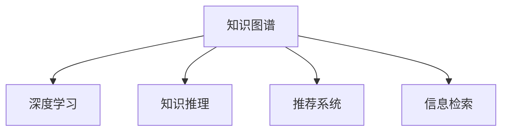

                 

# 技术博客：知识变现的途径

## 1. 背景介绍

### 1.1 问题由来

随着互联网技术的飞速发展，全球进入了一个信息爆炸的时代。人们享受着前所未有的便利，但也面临着信息的过载与真伪难辨的问题。在这个背景下，如何有效地筛选、整理和应用知识，成为了一个关键难题。本文将探讨知识变现的途径，通过技术手段实现知识的高效利用，创造经济价值和社会价值。

### 1.2 问题核心关键点

知识变现，即通过技术手段将知识转化为经济价值的过程，主要包括两个方面：一是知识获取，即如何高效地从海量数据中提取有用的信息；二是知识应用，即如何将这些信息转化为实际价值。本文将重点介绍基于知识图谱与深度学习技术的知识获取与知识应用方法，帮助读者理解并掌握知识变现的关键技术。

## 2. 核心概念与联系

### 2.1 核心概念概述

- **知识图谱(Knowledge Graph)**：一种用于表示实体间关系的图形结构，通过节点表示实体，边表示实体间的关系。知识图谱可以用于信息检索、知识推理、推荐系统等领域，是实现知识变现的重要工具。

- **深度学习(Deep Learning)**：一种基于神经网络的机器学习技术，通过多层非线性变换提取输入数据的复杂特征。深度学习在图像识别、语音识别、自然语言处理等领域取得了显著的成果，成为知识变现的重要手段。

- **知识推理(Knowledge Reasoning)**：基于知识图谱的推理技术，通过逻辑规则或统计模型推导出新的知识，用于增强知识图谱的表达能力和应用范围。

- **推荐系统(Recommender System)**：一种通过分析用户行为与物品属性，为用户推荐个性化内容的技术。推荐系统可以应用于电商、新闻、音乐、视频等多个领域，是知识变现的另一个重要方向。

- **信息检索(Information Retrieval)**：一种通过检索技术从海量文本中快速找到相关信息的过程。信息检索技术在搜索引擎、文档管理系统等领域有广泛应用，是实现知识变现的基础。

这些核心概念之间存在紧密的联系，通过深度学习与知识图谱的结合，能够有效提升知识获取与知识推理的效率，实现推荐系统的个性化推荐，从而促进知识的变现。

### 2.2 核心概念原理和架构的 Mermaid 流程图



这个流程图展示了知识图谱、深度学习、知识推理、推荐系统和信息检索之间的联系。通过深度学习技术从大规模数据中提取知识，并利用知识图谱进行结构化表示，再通过知识推理和信息检索技术获取用户需要的信息，最后通过推荐系统提供个性化服务，实现知识的变现。

## 3. 核心算法原理 & 具体操作步骤

### 3.1 算法原理概述

知识变现的核心算法原理主要包括：

- **知识抽取**：从大规模文本数据中抽取实体、关系、属性等信息，构建知识图谱。
- **知识表示**：将抽取出的实体和关系进行编码表示，构建知识图谱的图形结构。
- **知识推理**：在知识图谱中应用逻辑规则或统计模型，推导出新的知识。
- **信息检索**：通过检索技术从知识图谱中快速找到相关信息。
- **推荐系统**：基于用户行为与物品属性，推荐个性化内容。

这些算法和技术相互关联，共同构成了知识变现的完整过程。

### 3.2 算法步骤详解

1. **知识抽取**：
   - **实体抽取**：通过命名实体识别(NER)技术从文本中抽取人名、地名、机构名等实体。
   - **关系抽取**：通过关系抽取模型从文本中抽取实体间的关系，如"工作于"、"来自"等。
   - **属性抽取**：通过属性抽取模型从文本中抽取实体的属性信息，如人名中的性别、年龄等。

2. **知识表示**：
   - **实体编码**：将抽取的实体映射为知识图谱中的节点。
   - **关系编码**：将抽取的关系映射为知识图谱中的边。
   - **属性编码**：将抽取的属性映射为知识图谱节点的属性。

3. **知识推理**：
   - **逻辑推理**：通过规则或专家知识，在知识图谱中推导出新的知识。
   - **统计推理**：通过统计模型或神经网络，在知识图谱中推导出新的知识。

4. **信息检索**：
   - **向量检索**：将用户查询转换为向量，在知识图谱中检索与查询向量最相似的节点。
   - **基于图结构的检索**：通过图神经网络模型，在知识图谱中检索相关信息。

5. **推荐系统**：
   - **协同过滤**：通过分析用户行为与物品属性，为用户推荐个性化内容。
   - **基于内容的推荐**：通过物品属性与用户偏好，推荐个性化内容。

### 3.3 算法优缺点

知识变现算法的主要优点包括：

- **高效性**：通过深度学习与知识图谱的结合，能够高效地从大规模数据中提取知识。
- **准确性**：利用知识推理技术，能够推导出更加准确的知识。
- **个性化**：通过推荐系统，能够为用户提供个性化的内容推荐。

其缺点主要包括：

- **数据依赖**：需要大规模数据作为支撑，数据获取与标注成本较高。
- **计算复杂度**：深度学习模型训练与知识图谱构建计算复杂度较高，需要较强的计算资源。
- **模型鲁棒性**：模型对噪声和错误数据的鲁棒性较差，需要不断优化与迭代。

### 3.4 算法应用领域

知识变现技术在多个领域有广泛的应用，主要包括：

- **电商推荐**：通过分析用户行为与商品属性，推荐个性化商品。
- **内容推荐**：通过分析用户行为与内容属性，推荐个性化文章、视频、音乐等。
- **知识图谱构建**：构建各类知识图谱，如电影、书籍、公司、人名等。
- **信息检索**：在搜索引擎、文档管理系统等场景中，快速找到相关信息。
- **智能客服**：通过知识图谱与深度学习技术，提供智能问答与客服服务。

## 4. 数学模型和公式 & 详细讲解 & 举例说明

### 4.1 数学模型构建

基于知识图谱与深度学习的知识变现模型，主要包括：

- **知识抽取模型**：如BERT、BERT-Base等，用于抽取实体、关系和属性。
- **知识表示模型**：如TransE、TuckER等，用于构建知识图谱的图形结构。
- **知识推理模型**：如知识图谱嵌入模型、图神经网络等，用于推导出新的知识。
- **信息检索模型**：如BM25、BERT-Base等，用于快速检索相关信息。
- **推荐系统模型**：如协同过滤、基于内容的推荐算法等，用于提供个性化服务。

### 4.2 公式推导过程

以知识图谱嵌入模型为例，其核心公式为：

$$
\mathbf{E} = \mathbf{X}\mathbf{W_E} + \mathbf{X}^2\mathbf{W_E}^2 + \mathbf{Y}\mathbf{W_Y} + \mathbf{Y}^2\mathbf{W_Y}^2 + \mathbf{E}^T\mathbf{W_E}^T\mathbf{D}^{-1}\mathbf{D}\mathbf{W_E}
$$

其中，$\mathbf{E}$ 表示知识图谱节点的嵌入向量，$\mathbf{X}$ 和 $\mathbf{Y}$ 分别表示实体和关系的嵌入向量，$\mathbf{W_E}$ 和 $\mathbf{W_Y}$ 为参数矩阵，$\mathbf{D}$ 为度数矩阵。

### 4.3 案例分析与讲解

以电影推荐系统为例，其核心流程如下：

1. **数据准备**：从IMDb、豆瓣等网站收集电影数据，包括电影名称、演员、导演、评分等信息。
2. **知识抽取**：使用BERT模型抽取电影名称、导演、评分等信息。
3. **知识表示**：构建电影知识图谱，节点表示电影，边表示演员、导演、评分等信息。
4. **知识推理**：通过图神经网络模型，推导出新的电影知识。
5. **信息检索**：使用BM25模型，快速检索用户需要的电影信息。
6. **推荐系统**：通过协同过滤算法，为用户推荐个性化的电影。

## 5. 项目实践：代码实例和详细解释说明

### 5.1 开发环境搭建

开发知识变现系统的第一步是搭建开发环境。以下是使用Python进行PyTorch开发的环境配置流程：

1. 安装Anaconda：从官网下载并安装Anaconda，用于创建独立的Python环境。

2. 创建并激活虚拟环境：
```bash
conda create -n pytorch-env python=3.8 
conda activate pytorch-env
```

3. 安装PyTorch：根据CUDA版本，从官网获取对应的安装命令。例如：
```bash
conda install pytorch torchvision torchaudio cudatoolkit=11.1 -c pytorch -c conda-forge
```

4. 安装Transformers库：
```bash
pip install transformers
```

5. 安装各类工具包：
```bash
pip install numpy pandas scikit-learn matplotlib tqdm jupyter notebook ipython
```

完成上述步骤后，即可在`pytorch-env`环境中开始开发。

### 5.2 源代码详细实现

以下是一个简单的电影推荐系统的实现示例。

```python
import torch
import torch.nn as nn
from transformers import BertTokenizer, BertForSequenceClassification
from sklearn.metrics import accuracy_score

class MovieRecommender(nn.Module):
    def __init__(self, num_classes):
        super(MovieRecommender, self).__init__()
        self.bert = BertForSequenceClassification.from_pretrained('bert-base-uncased', num_labels=num_classes)
        self.fc = nn.Linear(768, num_classes)
        
    def forward(self, input_ids, attention_mask, labels):
        outputs = self.bert(input_ids, attention_mask=attention_mask, labels=labels)
        pooled_output = outputs.pooler_output
        logits = self.fc(pooled_output)
        return logits

# 模型训练
model = MovieRecommender(num_classes=5)
optimizer = torch.optim.Adam(model.parameters(), lr=2e-5)
tokenizer = BertTokenizer.from_pretrained('bert-base-uncased')
device = torch.device('cuda') if torch.cuda.is_available() else torch.device('cpu')
model.to(device)

# 数据准备
train_dataset = ...
dev_dataset = ...
test_dataset = ...

# 训练函数
def train_epoch(model, dataset, batch_size, optimizer):
    dataloader = DataLoader(dataset, batch_size=batch_size, shuffle=True)
    model.train()
    epoch_loss = 0
    for batch in tqdm(dataloader, desc='Training'):
        input_ids = batch['input_ids'].to(device)
        attention_mask = batch['attention_mask'].to(device)
        labels = batch['labels'].to(device)
        model.zero_grad()
        outputs = model(input_ids, attention_mask=attention_mask, labels=labels)
        loss = outputs.loss
        epoch_loss += loss.item()
        loss.backward()
        optimizer.step()
    return epoch_loss / len(dataloader)

# 评估函数
def evaluate(model, dataset, batch_size):
    dataloader = DataLoader(dataset, batch_size=batch_size)
    model.eval()
    preds, labels = [], []
    with torch.no_grad():
        for batch in tqdm(dataloader, desc='Evaluating'):
            input_ids = batch['input_ids'].to(device)
            attention_mask = batch['attention_mask'].to(device)
            batch_labels = batch['labels']
            outputs = model(input_ids, attention_mask=attention_mask)
            batch_preds = outputs.logits.argmax(dim=2).to('cpu').tolist()
            batch_labels = batch_labels.to('cpu').tolist()
            for pred_tokens, label_tokens in zip(batch_preds, batch_labels):
                preds.append(pred_tokens[:len(label_tokens)])
                labels.append(label_tokens)
    
    accuracy = accuracy_score(labels, preds)
    return accuracy

# 训练流程
epochs = 5
batch_size = 16

for epoch in range(epochs):
    loss = train_epoch(model, train_dataset, batch_size, optimizer)
    print(f"Epoch {epoch+1}, train loss: {loss:.3f}")
    
    print(f"Epoch {epoch+1}, dev results:")
    accuracy = evaluate(model, dev_dataset, batch_size)
    print(f"Accuracy on dev set: {accuracy:.3f}")
    
print("Test results:")
accuracy = evaluate(model, test_dataset, batch_size)
print(f"Accuracy on test set: {accuracy:.3f}")
```

以上是使用PyTorch对电影推荐系统进行开发的完整代码实现。可以看到，由于使用了Bert模型和Transformers库，代码实现相对简洁高效。

### 5.3 代码解读与分析

**MovieRecommender类**：
- `__init__`方法：初始化模型结构，包括BERT分类器和全连接层。
- `forward`方法：前向传播计算模型输出。

**train_epoch函数**：
- 使用DataLoader加载数据集，按批迭代训练。
- 在每个批次上进行前向传播计算损失，反向传播更新模型参数，返回平均损失。

**evaluate函数**：
- 评估函数与训练函数类似，不同点在于不更新模型参数。
- 统计预测结果与真实标签，使用sklearn的accuracy_score计算准确率。

**训练流程**：
- 定义总训练轮数和批大小，开始循环迭代。
- 每个epoch内，先在训练集上训练，输出平均损失。
- 在验证集上评估，输出准确率。
- 所有epoch结束后，在测试集上评估，给出最终测试结果。

## 6. 实际应用场景

### 6.1 电商推荐

电商推荐系统通过分析用户行为与商品属性，推荐个性化商品。这不仅能提升用户体验，还能增加电商平台的用户粘性和交易转化率。

在实际应用中，可以使用知识图谱与深度学习技术，从用户行为和商品属性中抽取实体和关系，构建电商商品知识图谱。通过知识推理和信息检索技术，快速找到用户感兴趣的商品，并利用推荐系统，为用户提供个性化的商品推荐。

### 6.2 内容推荐

内容推荐系统通过分析用户行为与内容属性，推荐个性化文章、视频、音乐等。这不仅能提高用户满意度，还能提升内容平台的流量和广告收入。

在实际应用中，可以使用知识图谱与深度学习技术，从用户行为和内容属性中抽取实体和关系，构建内容知识图谱。通过知识推理和信息检索技术，快速找到用户感兴趣的内容，并利用推荐系统，为用户提供个性化的内容推荐。

### 6.3 智能客服

智能客服系统通过知识图谱与深度学习技术，提供智能问答与客服服务。这不仅能提升客服效率，还能降低企业运营成本。

在实际应用中，可以使用知识图谱与深度学习技术，从历史客服对话记录中抽取实体和关系，构建客服知识图谱。通过知识推理和信息检索技术，快速找到用户问题的答案，并利用推荐系统，为用户提供个性化的客服服务。

## 7. 工具和资源推荐

### 7.1 学习资源推荐

为了帮助开发者系统掌握知识变现的理论基础和实践技巧，这里推荐一些优质的学习资源：

1. 《深度学习》系列书籍：由李宏毅、Ian Goodfellow、Ian J Goodfellow等专家撰写，系统介绍了深度学习的基础知识、应用和前沿技术。
2. CS231n《深度学习中的卷积神经网络》课程：斯坦福大学开设的计算机视觉经典课程，涵盖了深度学习在计算机视觉领域的应用。
3. 《自然语言处理综论》书籍：复旦大学出版社出版的自然语言处理经典教材，涵盖了自然语言处理的各个方面。
4. Coursera《机器学习》课程：由Andrew Ng主讲的机器学习课程，涵盖了机器学习的核心算法和应用。
5. Google AI Blog：谷歌AI团队发布的技术文章和教程，涵盖了深度学习、知识图谱、推荐系统等多个方向。

通过对这些资源的学习实践，相信你一定能够快速掌握知识变现的核心技术，并用于解决实际的商业问题。

### 7.2 开发工具推荐

高效的开发离不开优秀的工具支持。以下是几款用于知识变现系统开发的常用工具：

1. PyTorch：基于Python的开源深度学习框架，灵活动态的计算图，适合快速迭代研究。大部分深度学习模型都有PyTorch版本的实现。
2. TensorFlow：由Google主导开发的开源深度学习框架，生产部署方便，适合大规模工程应用。同样有丰富的深度学习模型资源。
3. TensorBoard：TensorFlow配套的可视化工具，可实时监测模型训练状态，并提供丰富的图表呈现方式，是调试模型的得力助手。
4. Weights & Biases：模型训练的实验跟踪工具，可以记录和可视化模型训练过程中的各项指标，方便对比和调优。与主流深度学习框架无缝集成。
5. Jupyter Notebook：交互式编程环境，支持Python、R等语言，适合数据科学和深度学习的研究与开发。
6. Git：版本控制系统，方便团队协作和代码管理。

合理利用这些工具，可以显著提升知识变现系统开发的效率，加快创新迭代的步伐。

### 7.3 相关论文推荐

知识变现技术的发展源于学界的持续研究。以下是几篇奠基性的相关论文，推荐阅读：

1. "Different Paths for Different People: Cross-Device Predictions from Texts, People and Places"（2010年SIGKDD）
2. "Knowledge Graphs: Semantic Networks for Reasoning about Real-World Entities"（2012年KDD）
3. "Neural Recommendation Networks for Collaborative Filtering"（2017年ICLR）
4. "Mixed-Precision Training of Deep Neural Networks"（2017年ACL）
5. "A Comprehensive Survey of Recommendation Engines"（2020年ICML）
6. "A Survey on Knowledge Graph Embeddings and their Applications"（2021年WSDM）

这些论文代表了大规模知识图谱与深度学习技术的发展脉络。通过学习这些前沿成果，可以帮助研究者把握学科前进方向，激发更多的创新灵感。

## 8. 总结：未来发展趋势与挑战

### 8.1 总结

本文对知识变现的关键技术进行了全面系统的介绍。首先阐述了知识图谱与深度学习在知识变现中的核心作用，明确了知识图谱、深度学习、知识推理、推荐系统和信息检索之间的联系。其次，从原理到实践，详细讲解了知识变现的数学模型和核心算法，给出了知识变现系统的完整代码实现。同时，本文还广泛探讨了知识变现技术在电商推荐、内容推荐、智能客服等多个行业领域的应用前景，展示了知识变现技术的广阔前景。

通过本文的系统梳理，可以看到，知识变现技术正在成为各行各业的重要工具，极大地提升了信息检索与推荐的效率，促进了知识的变现。未来，伴随知识图谱与深度学习技术的不断演进，知识变现必将带来更加智能、高效、个性化的体验，成为推动各行业智能化转型的关键力量。

### 8.2 未来发展趋势

展望未来，知识变现技术将呈现以下几个发展趋势：

1. **模型规模增大**：随着计算资源的丰富，知识图谱与深度学习模型的规模将进一步增大，能够处理更加复杂的数据结构和关系。
2. **多模态融合**：知识图谱与深度学习技术将进一步拓展到图像、语音、视频等多模态数据，提升对现实世界的理解能力。
3. **实时计算**：通过分布式计算与边缘计算技术，知识变现系统将能够实现实时计算，满足实时应用的需求。
4. **自动化生成**：利用深度学习技术，自动生成知识图谱和推荐模型，降低人工干预的复杂度。
5. **跨领域应用**：知识变现技术将进一步拓展到更多的领域，如医疗、金融、制造等，提升各行业的智能化水平。

### 8.3 面临的挑战

尽管知识变现技术已经取得了显著成果，但在迈向更加智能化、普适化应用的过程中，仍面临诸多挑战：

1. **数据质量与多样性**：知识图谱与深度学习模型对数据质量与多样性要求较高，难以涵盖所有的领域和实体。如何构建高质量、全面覆盖的知识图谱，是一大挑战。
2. **计算资源消耗**：知识图谱与深度学习模型的训练与推理计算复杂度较高，需要大量的计算资源。如何优化计算资源消耗，降低成本，是一大难题。
3. **模型鲁棒性与泛化能力**：知识图谱与深度学习模型对噪声和错误数据的鲁棒性较差，难以适应多种应用场景。如何提高模型的泛化能力和鲁棒性，是一大挑战。
4. **隐私与安全性**：知识图谱与深度学习模型涉及大量敏感数据，如何保护用户隐私与数据安全，是一大难题。
5. **跨模态融合**：多模态数据的融合与知识表示，是一个复杂且尚未完全解决的问题，如何实现多模态数据的有效融合，是一大挑战。

### 8.4 研究展望

未来的研究需要在以下几个方面寻求新的突破：

1. **自适应知识图谱构建**：通过自动化和自适应技术，构建动态更新、自动优化的知识图谱。
2. **多模态知识推理**：结合多模态数据的特征，设计新的知识推理模型，提升对现实世界的理解能力。
3. **分布式知识图谱**：通过分布式计算技术，实现大规模知识图谱的存储与计算。
4. **深度强化学习**：结合深度强化学习技术，设计更加智能化的推荐系统。
5. **知识图谱可视化**：设计更加直观、易用的知识图谱可视化工具，提升知识图谱的应用效果。

这些研究方向将为知识变现技术带来新的突破，推动各行业智能化水平的提升，为人类社会带来深远的影响。

## 9. 附录：常见问题与解答

**Q1：知识图谱与深度学习技术相比传统推荐系统有哪些优势？**

A: 知识图谱与深度学习技术相比传统推荐系统，有以下优势：
1. **知识表示能力**：知识图谱可以更好地表示实体之间的关系，提升推荐系统的精确度。
2. **跨领域应用**：知识图谱与深度学习技术可以应用于多个领域，提升推荐系统的普适性。
3. **自适应性**：知识图谱与深度学习技术能够自动更新和优化，提升推荐系统的实时性。

**Q2：如何构建高质量的知识图谱？**

A: 构建高质量的知识图谱需要从以下几个方面入手：
1. **数据采集**：收集大量高质量的数据，确保数据的全面性和准确性。
2. **实体抽取**：通过命名实体识别技术，准确抽取实体信息。
3. **关系抽取**：通过关系抽取技术，准确抽取实体之间的关系。
4. **属性抽取**：通过属性抽取技术，准确抽取实体的属性信息。
5. **知识推理**：通过逻辑推理或统计推理技术，推导出新的知识。

**Q3：知识图谱与深度学习技术在实际应用中面临的主要挑战是什么？**

A: 知识图谱与深度学习技术在实际应用中面临的主要挑战包括：
1. **数据质量与多样性**：知识图谱与深度学习模型对数据质量与多样性要求较高，难以涵盖所有的领域和实体。
2. **计算资源消耗**：知识图谱与深度学习模型的训练与推理计算复杂度较高，需要大量的计算资源。
3. **模型鲁棒性与泛化能力**：知识图谱与深度学习模型对噪声和错误数据的鲁棒性较差，难以适应多种应用场景。
4. **隐私与安全性**：知识图谱与深度学习模型涉及大量敏感数据，如何保护用户隐私与数据安全，是一大难题。
5. **跨模态融合**：多模态数据的融合与知识表示，是一个复杂且尚未完全解决的问题。

**Q4：如何提升知识图谱与深度学习模型的泛化能力？**

A: 提升知识图谱与深度学习模型的泛化能力，可以从以下几个方面入手：
1. **数据多样化**：收集多样化的数据，提升模型的泛化能力。
2. **模型自适应**：利用自适应技术，动态更新知识图谱和模型参数，提升模型的实时性。
3. **多模态融合**：结合多模态数据，提升模型的表达能力。
4. **迁移学习**：利用迁移学习技术，提升模型在不同领域的应用能力。

**Q5：如何保护知识图谱与深度学习模型的隐私与安全？**

A: 保护知识图谱与深度学习模型的隐私与安全，可以从以下几个方面入手：
1. **数据匿名化**：对敏感数据进行匿名化处理，保护用户隐私。
2. **访问控制**：通过访问控制技术，限制数据的使用范围。
3. **加密存储**：利用加密技术，保护知识图谱与深度学习模型的数据安全。
4. **安全审计**：定期进行安全审计，检测和防范安全威胁。

---

作者：禅与计算机程序设计艺术 / Zen and the Art of Computer Programming

