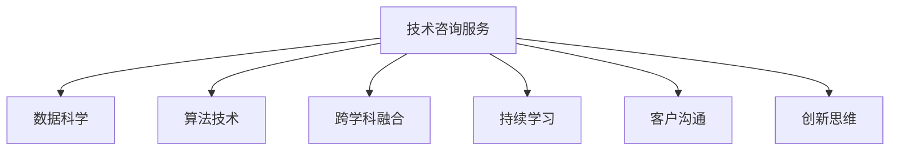

                 

# 技术咨询：高价值服务的提供

## 1. 背景介绍

在当前快速变化和竞争激烈的商业环境中，技术咨询成为了企业获取核心竞争力的重要手段。无论是传统行业还是新兴技术领域，技术咨询服务的质量和深度直接关系到企业的创新能力和市场地位。然而，随着信息量的爆炸式增长和技术的飞速发展，单纯依赖传统的技术咨询已经难以满足现代企业的需求。本文将探讨如何通过提供高价值的技术咨询服务，帮助企业应对复杂的商业和技术挑战。

### 1.1 问题由来

随着企业对技术创新的需求日益增长，技术咨询服务也面临着新的挑战和机遇。传统技术咨询多依赖于专家的经验积累和直觉判断，缺乏系统化和科学化的理论基础。而当前，随着大数据、人工智能、云计算等新兴技术的发展，技术咨询服务需要更多地利用数据和算法，提供基于科学理论和实际数据的高价值服务。因此，如何在新的技术背景下，提升技术咨询服务的价值，成为摆在咨询师和企业的面前的重要课题。

### 1.2 问题核心关键点

为了提升技术咨询服务的价值，我们需要关注以下几个核心关键点：

1. **数据驱动**：利用数据科学和机器学习技术，提取数据背后的规律和趋势，为咨询决策提供数据支持。
2. **算法辅助**：引入先进算法，如优化算法、预测算法、分类算法等，帮助企业解决复杂问题。
3. **跨学科融合**：将不同的学科知识和技术方法进行融合，如数据科学、心理学、工程学等，提供综合解决方案。
4. **持续学习**：通过不断学习和掌握新知识，咨询师能够持续提供高质量的服务。
5. **客户沟通**：与客户建立深度沟通，理解其需求和痛点，提供定制化解决方案。
6. **创新思维**：运用创新思维，如设计思维、系统思维等，帮助客户突破固有思维模式，发现新的可能性。

这些关键点共同构成了高价值技术咨询服务的基础框架，帮助咨询师和企业共同应对挑战，实现目标。

## 2. 核心概念与联系

### 2.1 核心概念概述

为了更好地理解高价值技术咨询服务的内涵和实施路径，我们需要首先梳理几个核心概念：

- **技术咨询服务**：利用专家的知识和经验，通过分析、设计、实施等步骤，帮助企业解决技术问题或提升技术水平的服务。
- **数据科学**：运用统计学、机器学习等方法，从数据中提取信息和知识，辅助决策过程。
- **算法技术**：通过编程实现解决特定问题的算法，如图算法、深度学习算法等。
- **跨学科融合**：将不同领域的知识和技术进行融合，形成综合解决方案。
- **持续学习**：咨询师通过不断学习和实践，更新和提升自身能力。
- **客户沟通**：与客户建立深度沟通，理解其需求和挑战。
- **创新思维**：运用设计思维、系统思维等创新方法，帮助客户发现新的解决方案。

这些概念之间的逻辑关系可以通过以下Mermaid流程图来展示：



这个流程图展示的技术咨询服务的核心概念及其之间的关系：

1. 技术咨询服务通过数据科学和算法技术，从数据中提取信息，为决策提供依据。
2. 跨学科融合使得技术咨询服务能够综合运用不同领域的知识和技能，提供更全面的解决方案。
3. 持续学习使得咨询师能够不断提升自身能力，保持服务质量。
4. 客户沟通确保了咨询师能够深入理解客户需求，提供定制化服务。
5. 创新思维帮助咨询师跳出传统思维模式，发现新的解决方案。

## 3. 核心算法原理 & 具体操作步骤

### 3.1 算法原理概述

高价值技术咨询服务的核心在于算法和数据驱动的决策支持。这里将重点介绍几种常用的算法原理和操作步骤：

1. **回归分析**：通过建立回归模型，预测因变量与自变量之间的关系，为决策提供数据支持。
2. **分类算法**：利用分类模型，如决策树、支持向量机等，对数据进行分类，辅助决策。
3. **聚类算法**：通过聚类算法，将数据分组，发现数据背后的模式和趋势，辅助决策。
4. **优化算法**：如遗传算法、粒子群算法等，用于解决最优化问题，辅助企业优化决策。
5. **深度学习**：通过构建深度神经网络，处理大规模数据，提高预测精度和决策能力。
6. **推荐系统**：利用推荐算法，帮助企业发现新机会，提升用户体验。

### 3.2 算法步骤详解

一个完整的高价值技术咨询服务通常包括以下几个关键步骤：

**Step 1: 数据收集与预处理**
- 收集企业运营数据、市场数据、客户反馈数据等，确保数据质量。
- 对数据进行清洗、去重、归一化等预处理操作。

**Step 2: 数据建模与分析**
- 利用回归分析、分类算法等，对数据进行建模和分析。
- 使用机器学习算法，如K-means、PCA等，进行特征提取和降维。
- 建立预测模型，如线性回归、随机森林等，进行数据预测。

**Step 3: 算法应用与优化**
- 将算法应用于具体问题，如市场趋势预测、客户流失预测等。
- 优化模型参数，提高模型精度和泛化能力。
- 结合业务场景，调整模型输出，使其更加符合企业需求。

**Step 4: 模型部署与评估**
- 将训练好的模型部署到生产环境，实时提供决策支持。
- 通过A/B测试等方法，评估模型效果，不断优化。

**Step 5: 持续学习与反馈**
- 收集模型使用过程中的反馈数据，进行模型更新和迭代。
- 不断学习新知识，提高模型性能和应用能力。

### 3.3 算法优缺点

高价值技术咨询服务中使用的算法技术具有以下优点：

1. **提高决策精度**：通过数据驱动的决策支持，提高决策的科学性和准确性。
2. **提升服务效率**：自动化算法处理数据，提高服务效率和响应速度。
3. **支持跨领域应用**：算法技术可以应用于各种行业和领域，提供通用解决方案。
4. **降低成本**：通过自动化和优化算法，减少人工干预和错误，降低企业成本。

同时，这些算法技术也存在一些缺点：

1. **数据质量依赖**：算法的输出依赖于数据的质量和完整性，低质量数据可能影响模型效果。
2. **模型复杂度高**：复杂的算法模型需要较高的计算资源，对硬件环境要求较高。
3. **解释性不足**：某些高级算法模型的决策过程难以解释，可能降低企业信任度。
4. **需要专业知识**：算法的应用需要专业知识和技能，难以广泛普及。

## 4. 数学模型和公式 & 详细讲解 & 举例说明

### 4.1 数学模型构建

在技术咨询服务中，数学模型的构建是数据分析和决策支持的核心环节。以市场趋势预测为例，构建数学模型的基本步骤如下：

1. **数据收集**：收集市场历史数据、相关经济指标等，确保数据的完整性和准确性。
2. **数据预处理**：对数据进行清洗、归一化等操作，去除异常值和噪声。
3. **特征选择**：根据业务需求，选择有预测能力的特征，进行特征工程。
4. **模型建立**：选择适当的算法，如线性回归、决策树等，构建预测模型。
5. **模型评估**：通过交叉验证等方法，评估模型效果，调整模型参数。

### 4.2 公式推导过程

以线性回归模型为例，其基本公式为：

$$
y = \beta_0 + \beta_1x_1 + \beta_2x_2 + ... + \beta_nx_n + \epsilon
$$

其中，$y$为预测值，$\beta_0$为截距，$\beta_1, \beta_2, ..., \beta_n$为特征系数，$x_1, x_2, ..., x_n$为特征变量，$\epsilon$为误差项。

线性回归模型的推导过程如下：

1. 假设模型为$y = \theta^Tx$，其中$\theta$为模型参数。
2. 根据最小二乘法，求解$\theta$，使得预测值与真实值之间的平方误差最小。
3. 利用矩阵运算和逆矩阵求解，得到$\theta$的值。
4. 将$\theta$代入模型公式，得到最终的预测值。

### 4.3 案例分析与讲解

以一家电子商务公司为例，使用线性回归模型预测客户流失率。

1. **数据收集**：收集客户历史行为数据、购买记录、用户反馈等。
2. **数据预处理**：对数据进行清洗、去重、归一化等操作。
3. **特征选择**：选择有预测能力的特征，如购买频率、满意度、停留时间等。
4. **模型建立**：利用线性回归算法，构建客户流失率预测模型。
5. **模型评估**：通过交叉验证等方法，评估模型效果，调整模型参数。
6. **模型应用**：将训练好的模型部署到生产环境，实时预测客户流失率，并采取相应的留存策略。

通过这种数据驱动的决策支持，帮助企业提前预测客户流失，及时采取措施，减少流失率，提高客户满意度和忠诚度。

## 5. 项目实践：代码实例和详细解释说明

### 5.1 开发环境搭建

在进行高价值技术咨询服务的项目实践前，我们需要准备好开发环境。以下是使用Python进行Scikit-learn和TensorFlow开发的环境配置流程：

1. 安装Anaconda：从官网下载并安装Anaconda，用于创建独立的Python环境。

2. 创建并激活虚拟环境：
```bash
conda create -n my_env python=3.8 
conda activate my_env
```

3. 安装Scikit-learn和TensorFlow：
```bash
pip install scikit-learn tensorflow
```

4. 安装各类工具包：
```bash
pip install numpy pandas matplotlib seaborn jupyter notebook
```

完成上述步骤后，即可在`my_env`环境中开始项目实践。

### 5.2 源代码详细实现

下面我们以市场趋势预测为例，给出使用Scikit-learn和TensorFlow进行线性回归的Python代码实现。

```python
import pandas as pd
from sklearn.model_selection import train_test_split
from sklearn.linear_model import LinearRegression
from sklearn.metrics import mean_squared_error

# 读取数据
data = pd.read_csv('market_data.csv')

# 数据预处理
data = data.dropna()
X = data[['gdp_growth_rate', 'inflation_rate', 'unemployment_rate']]
y = data['market_index']

# 特征选择
X = X.drop(['market_index'], axis=1)

# 划分训练集和测试集
X_train, X_test, y_train, y_test = train_test_split(X, y, test_size=0.2, random_state=42)

# 建立模型
model = LinearRegression()

# 训练模型
model.fit(X_train, y_train)

# 预测
y_pred = model.predict(X_test)

# 评估
mse = mean_squared_error(y_test, y_pred)
print(f"Mean Squared Error: {mse:.2f}")
```

### 5.3 代码解读与分析

让我们再详细解读一下关键代码的实现细节：

**数据预处理**：
- 使用`pd.read_csv`方法读取CSV文件，确保数据格式的正确性。
- 使用`dropna`方法去除缺失数据，确保数据的完整性。
- 使用`drop`方法去除无用的特征，减少计算量和噪声。

**模型建立与训练**：
- 使用`train_test_split`方法将数据集划分为训练集和测试集。
- 使用`LinearRegression`类建立线性回归模型。
- 使用`fit`方法训练模型，将训练集数据输入模型进行训练。

**模型评估**：
- 使用`predict`方法预测测试集数据，得到预测值。
- 使用`mean_squared_error`方法计算预测值与真实值之间的均方误差，评估模型效果。

通过上述代码，可以完成一个简单的线性回归模型，用于市场趋势预测。代码实现简洁高效，易于理解和调试。

### 5.4 运行结果展示

运行上述代码，将得到市场趋势预测的均方误差结果，展示了模型对历史数据的拟合程度。根据均方误差的大小，可以进一步调整模型参数，优化预测效果。

## 6. 实际应用场景

### 6.1 智能客服系统

基于高价值技术咨询服务的智能客服系统，通过数据分析和算法模型，能够快速响应客户咨询，提供个性化的服务体验。具体实现步骤包括：

1. **客户行为分析**：利用数据分析工具，挖掘客户行为模式，识别潜在问题。
2. **情感分析**：使用情感分析算法，分析客户情感倾向，优化服务策略。
3. **智能推荐**：通过推荐算法，提供个性化解决方案，提升客户满意度。
4. **实时监控**：建立实时监控系统，及时发现和解决问题，确保服务稳定。

通过这种基于数据驱动和算法模型的智能客服系统，能够显著提高客户体验，减少企业运营成本。

### 6.2 金融风险管理

金融风险管理是企业经营中的重要环节。通过高价值技术咨询服务，企业能够更准确地评估风险，制定有效的风险管理策略。具体实现步骤包括：

1. **市场风险预测**：利用金融数据，建立市场风险预测模型，评估市场波动风险。
2. **信用风险评估**：使用机器学习算法，对客户信用进行评估，识别高风险客户。
3. **欺诈检测**：通过数据分析和算法模型，实时监控交易行为，发现潜在的欺诈行为。
4. **优化投资组合**：利用推荐系统，优化投资组合，降低风险，提升收益。

通过这种基于数据驱动的高价值技术咨询服务，企业能够更好地应对金融风险，保障企业稳定运营。

### 6.3 生产流程优化

在制造业、物流等行业，生产流程的优化直接影响企业的运营效率和成本。通过高价值技术咨询服务，企业能够通过数据分析和算法模型，优化生产流程，提升生产效率。具体实现步骤包括：

1. **生产数据分析**：收集生产数据，分析生产流程中的瓶颈和问题。
2. **优化生产计划**：利用优化算法，优化生产计划，提升生产效率。
3. **预测维护**：通过预测模型，预测设备故障，提前进行维护，减少停机时间。
4. **质量控制**：利用分类算法，提高产品质量，减少废品率。

通过这种基于数据驱动的高价值技术咨询服务，企业能够更高效地进行生产管理，提升竞争力。

### 6.4 未来应用展望

随着高价值技术咨询服务的应用和推广，未来将有以下发展趋势：

1. **智能化水平提升**：通过大数据和算法技术，提供更智能化的决策支持，帮助企业应对复杂多变的环境。
2. **多领域应用扩展**：高价值技术咨询服务将从金融、制造等领域，扩展到医疗、教育等更多行业，提供全方位的解决方案。
3. **算法技术优化**：不断优化算法模型，提高预测精度和应用效果。
4. **数据治理提升**：加强数据治理，提高数据质量和完整性，为数据分析和决策提供坚实基础。
5. **模型可解释性增强**：提高模型输出的可解释性，增强企业对决策结果的信任度。
6. **跨学科融合深入**：将不同领域的知识和技术进行更深入的融合，提供更全面、高效的解决方案。

## 7. 工具和资源推荐

### 7.1 学习资源推荐

为了帮助开发者系统掌握高价值技术咨询服务的理论基础和实践技巧，这里推荐一些优质的学习资源：

1. 《Python数据科学手册》：由Jake VanderPlas编写，全面介绍了Python在数据科学中的应用，是入门数据科学的必读书籍。
2. 《TensorFlow实战》：由Vincent Vanhoucke等编写，介绍了TensorFlow的基本用法和应用案例，适合初学者和进阶开发者。
3. 《机器学习实战》：由Peter Harrington编写，通过具体案例，介绍了机器学习算法的实现和应用。
4. Coursera的《数据科学与机器学习》课程：由Johns Hopkins大学开设，覆盖数据科学和机器学习的多个方面，适合进一步深入学习。
5. Kaggle：数据科学竞赛平台，提供丰富的数据集和比赛机会，适合实践和提升技能。

通过这些学习资源，相信你一定能够全面掌握高价值技术咨询服务的核心知识和技能，为企业的技术咨询服务提供更有价值的支持。

### 7.2 开发工具推荐

高效的开发离不开优秀的工具支持。以下是几款用于高价值技术咨询服务开发的常用工具：

1. Jupyter Notebook：免费的开源交互式计算环境，支持Python、R等多种语言，适合数据科学和机器学习项目开发。
2. PyCharm：由JetBrains开发的IDE，支持Python、Scala、R等多种语言，提供丰富的插件和工具，适合大型项目开发。
3. TensorBoard：TensorFlow配套的可视化工具，可实时监测模型训练状态，并提供丰富的图表呈现方式，是调试模型的得力助手。
4. Weights & Biases：模型训练的实验跟踪工具，可以记录和可视化模型训练过程中的各项指标，方便对比和调优。
5. Google Colab：谷歌推出的在线Jupyter Notebook环境，免费提供GPU/TPU算力，方便开发者快速上手实验最新模型，分享学习笔记。

合理利用这些工具，可以显著提升高价值技术咨询服务项目的开发效率，加快创新迭代的步伐。

### 7.3 相关论文推荐

高价值技术咨询服务的核心在于算法和数据驱动的决策支持，以下是几篇奠基性的相关论文，推荐阅读：

1. Linear Regression and Bias-Variance Tradeoffs：对线性回归算法进行详细分析，探讨模型偏差和方差的关系，为优化模型提供理论支持。
2. Decision Trees and Random Forests：介绍决策树和随机森林算法，分析其优缺点，适合解决分类和回归问题。
3. k-means Clustering：介绍k-means聚类算法，分析其原理和应用，适合进行数据分组和模式发现。
4. Gradient Boosting Machines：介绍梯度提升树算法，分析其原理和优化方法，适合解决复杂的预测问题。
5. Deep Learning with Python：由Francois Chollet编写，全面介绍TensorFlow和Keras的使用方法，适合数据科学和机器学习项目开发。

这些论文代表了大数据和算法技术的发展脉络，通过学习这些前沿成果，可以帮助研究者把握学科前进方向，激发更多的创新灵感。

## 8. 总结：未来发展趋势与挑战

### 8.1 总结

本文对高价值技术咨询服务的理论和实践进行了全面系统的介绍。首先阐述了高价值技术咨询服务的重要性和核心关键点，明确了其在提升企业决策质量和运营效率方面的独特价值。其次，从原理到实践，详细讲解了算法模型和操作步骤，给出了高价值技术咨询服务的具体代码实现。同时，本文还探讨了其在智能客服、金融风险管理、生产流程优化等多个行业领域的应用前景，展示了数据驱动和算法模型在解决实际问题中的巨大潜力。此外，本文精选了高价值技术咨询服务的各类学习资源，力求为读者提供全方位的技术指引。

通过本文的系统梳理，可以看到，高价值技术咨询服务在数据科学和算法技术的支持下，能够为企业提供更有价值的决策支持和解决方案。未来，伴随数据科学和算法技术的不断进步，高价值技术咨询服务必将成为企业数字化转型和智能化升级的重要手段。

### 8.2 未来发展趋势

展望未来，高价值技术咨询服务将呈现以下几个发展趋势：

1. **智能化水平提升**：随着人工智能和机器学习技术的发展，高价值技术咨询服务将越来越智能化，能够提供更精准、实时的决策支持。
2. **跨领域应用扩展**：高价值技术咨询服务将从金融、制造等领域，扩展到医疗、教育等更多行业，提供全方位的解决方案。
3. **算法技术优化**：不断优化算法模型，提高预测精度和应用效果。
4. **数据治理提升**：加强数据治理，提高数据质量和完整性，为数据分析和决策提供坚实基础。
5. **模型可解释性增强**：提高模型输出的可解释性，增强企业对决策结果的信任度。
6. **跨学科融合深入**：将不同领域的知识和技术进行更深入的融合，提供更全面、高效的解决方案。

以上趋势凸显了高价值技术咨询服务的广阔前景。这些方向的探索发展，必将进一步提升高价值技术咨询服务的价值，为企业的技术决策提供更可靠、更有效的支持。

### 8.3 面临的挑战

尽管高价值技术咨询服务已经取得了显著成就，但在迈向更加智能化、普适化应用的过程中，它仍面临诸多挑战：

1. **数据质量问题**：高质量数据是高价值技术咨询服务的基础，但在实际应用中，数据往往存在缺失、噪声、偏差等问题，影响模型效果。
2. **模型复杂性**：算法模型的复杂性往往带来较高的计算成本和资源消耗，需要在资源和效果之间做出平衡。
3. **算法透明性**：部分高级算法模型的决策过程难以解释，可能降低企业信任度。
4. **跨领域应用难度**：不同行业和领域的知识差异较大，将算法应用于特定行业需要更多定制化开发。
5. **人才短缺问题**：高价值技术咨询服务需要具备数据科学和算法技术的专业人才，但目前市场上这类人才仍然稀缺。
6. **伦理和隐私问题**：在数据应用过程中，需要考虑伦理和隐私问题，保护数据安全和用户隐私。

正视高价值技术咨询服务面临的这些挑战，积极应对并寻求突破，将使其逐步走向成熟，成为企业数字化转型的重要助力。

### 8.4 研究展望

面对高价值技术咨询服务所面临的种种挑战，未来的研究需要在以下几个方面寻求新的突破：

1. **数据预处理技术**：开发更高效的数据预处理算法，提高数据质量和完整性，为模型训练提供坚实基础。
2. **算法优化技术**：研究更高效的算法模型，降低计算成本，提升预测精度。
3. **模型解释性增强**：开发更易于解释的算法模型，增强模型的可解释性和透明度。
4. **跨领域知识整合**：将不同领域的知识进行融合，提供更全面、综合的解决方案。
5. **智能交互界面**：开发智能交互界面，帮助企业更直观地理解模型输出和决策结果。
6. **伦理和隐私保护**：建立伦理和隐私保护的框架，确保数据应用过程中的安全性。

这些研究方向将为高价值技术咨询服务带来更多的创新和发展空间，帮助企业在数据驱动的决策过程中，获取更可靠、更高效的决策支持。

## 9. 附录：常见问题与解答

**Q1: 什么是高价值技术咨询服务？**

A: 高价值技术咨询服务是通过数据科学和算法技术，为企业提供基于数据驱动的决策支持，帮助企业解决技术问题或提升技术水平的服务。

**Q2: 高价值技术咨询服务在实际应用中需要考虑哪些因素？**

A: 高价值技术咨询服务在实际应用中需要考虑以下几个因素：
1. 数据质量：确保数据完整性和准确性，提高模型效果。
2. 算法选择：根据具体问题选择合适的算法模型，提高预测精度。
3. 客户需求：与客户建立深度沟通，了解其需求和痛点，提供定制化解决方案。
4. 持续学习：不断学习和掌握新知识，更新和提升自身能力。
5. 模型可解释性：提高模型输出的可解释性，增强企业信任度。

**Q3: 高价值技术咨询服务如何提升企业的决策质量？**

A: 高价值技术咨询服务通过数据分析和算法模型，提供基于数据驱动的决策支持，帮助企业更准确地评估风险，制定有效的决策策略。具体实现步骤包括：
1. 收集数据，分析数据模式。
2. 建立模型，进行预测和分类。
3. 优化模型，提高预测精度。
4. 实时监控，及时调整决策策略。

**Q4: 高价值技术咨询服务在金融行业的应用案例有哪些？**

A: 高价值技术咨询服务在金融行业的应用案例包括：
1. 市场趋势预测：利用金融数据，建立市场趋势预测模型，评估市场波动风险。
2. 信用风险评估：使用机器学习算法，对客户信用进行评估，识别高风险客户。
3. 欺诈检测：通过数据分析和算法模型，实时监控交易行为，发现潜在的欺诈行为。
4. 优化投资组合：利用推荐系统，优化投资组合，降低风险，提升收益。

**Q5: 如何评估高价值技术咨询服务的模型效果？**

A: 评估高价值技术咨询服务的模型效果，可以使用以下指标：
1. 均方误差（MSE）：衡量模型预测值与真实值之间的平均误差。
2. 均方根误差（RMSE）：衡量模型预测值与真实值之间的平均误差，是MSE的平方根。
3. 平均绝对误差（MAE）：衡量模型预测值与真实值之间的平均绝对误差。
4. 精确度（Precision）和召回率（Recall）：用于分类模型的评估，衡量模型的预测准确率和覆盖率。
5. F1分数：综合考虑精确度和召回率，用于评估分类模型的综合效果。

通过以上指标，可以全面评估模型的效果，及时调整模型参数，优化模型性能。

