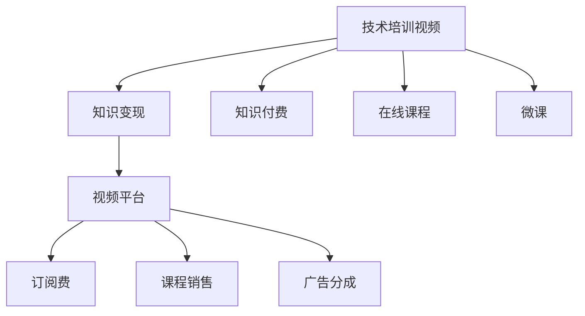

                 

# 技术培训视频：知识变现途径

## 1. 背景介绍

随着互联网的普及和数字技术的不断发展，知识传播和共享的方式已经发生了根本性的变化。传统的书籍、课程、讲座等知识传播手段已经逐步被在线视频平台、MOOC（大规模开放在线课程）、电子书等数字化资源所取代。技术培训视频的兴起，为知识的传播和变现提供了新的途径。

### 1.1 问题由来
随着知识付费时代的到来，越来越多的人开始关注如何将自己的知识转化为经济价值。技术培训视频，通过将复杂的知识和技术问题简化，以视频的形式呈现，使广大学习者能够随时随地获取和吸收知识。

同时，随着在线视频平台的兴起，技术培训视频的商业模式也逐渐成熟。平台通过付费订阅、课程销售、广告分成等多种方式，实现知识变现。例如，Coursera、Udacity、网易云课堂等平台，已经聚集了大量的技术培训视频资源，并形成了稳定的知识变现模式。

### 1.2 问题核心关键点
技术培训视频的成功运营，依赖于以下几个关键点：

- **内容质量**：高质量的教学内容是培训视频的核心。专家学者、一线工程师等通过视频分享自己的知识和经验，帮助学习者理解和掌握技术。
- **用户体验**：良好的用户体验能够提升学习者的观看体验，增加平台的用户粘性和留存率。平台需要不断优化视频的交互设计、视觉呈现、字幕等细节。
- **市场定位**：平台需要明确自己的市场定位，针对特定的技术领域或学习者群体进行精细化运营。例如，面向初级开发者的课程和面向高级架构师的课程内容差异显著。
- **变现模式**：平台的变现模式直接关系到知识变现的可持续性。有效的变现模式能够激励创作者持续输出高质量内容，吸引更多用户参与。
- **技术基础设施**：高质量视频内容的生产和分发，依赖于强大的技术基础设施支撑。平台需要具备稳定的视频处理、存储、分发等技术能力。

## 2. 核心概念与联系

### 2.1 核心概念概述

为更好地理解技术培训视频的变现途径，本节将介绍几个密切相关的核心概念：

- **技术培训视频**：指通过视频形式传授技术的教育资源，涵盖从基础入门到高级应用的各种技术知识。技术培训视频通常由专家学者、企业技术人员等创建。
- **知识变现**：指通过视频平台将知识转化为经济效益的过程。平台通过收取订阅费、课程销售费、广告分成等方式实现盈利。
- **知识付费**：指用户为获取知识而支付费用的行为。技术培训视频是知识付费的重要形式之一，其市场需求不断增长。
- **视频平台**：指专门用于视频内容创作、分享、变现的在线平台。例如，网易云课堂、Coursera、Udacity等。
- **在线课程**：指通过视频平台提供的课程资源，通常包括视频讲解、练习题库、作业反馈等。
- **微课(Micro-course)**：指短小精悍、易于消化和吸收的视频课程，通常专注于某一特定知识点或技能。

这些核心概念之间的逻辑关系可以通过以下Mermaid流程图来展示：



这个流程图展示了几者之间的相互关系：

1. 技术培训视频通过在线课程和微课等形式，传递知识。
2. 用户通过知识付费行为，为平台提供变现基础。
3. 视频平台通过订阅费、课程销售和广告分成等多种方式，实现知识变现。

## 3. 核心算法原理 & 具体操作步骤
### 3.1 算法原理概述

技术培训视频的变现途径，本质上是通过高质量内容吸引用户，并通过多种变现模式实现收益。其核心算法原理可以总结如下：

1. **内容优化算法**：通过用户反馈、观看时长、互动数据等，优化视频内容的质量和结构，提升用户体验。
2. **推荐系统算法**：利用机器学习算法，分析用户行为数据，推荐相关课程和视频，增加用户粘性。
3. **定价策略算法**：根据课程难度、时长、市场定位等因素，设定合理的课程价格，吸引不同层次的用户。
4. **广告投放算法**：利用精准的广告投放算法，在相关视频和课程中插入广告，提高平台的广告收入。

### 3.2 算法步骤详解

以下我们将详细介绍技术培训视频变现的核心算法步骤：

**Step 1: 数据收集与分析**

- **用户行为数据**：收集用户观看视频、点赞、评论、分享等行为数据，分析用户偏好和兴趣。
- **课程互动数据**：统计课程的观看次数、完成率、评分等数据，评估课程质量和学习效果。
- **市场数据**：收集相关课程的销售情况、用户反馈等，了解市场竞争状况和用户需求。

**Step 2: 内容优化与推荐**

- **内容优化**：根据用户行为数据和课程互动数据，优化视频内容，提升用户体验。例如，调整视频长度、增加互动环节、提升字幕质量等。
- **推荐系统**：利用机器学习算法（如协同过滤、深度学习等），分析用户行为数据，推荐相关课程和视频。例如，利用用户的历史观看记录和评分，推荐相似课程或热门视频。

**Step 3: 定价与广告投放**

- **定价策略**：根据课程难度、时长、市场定位等因素，设定合理的课程价格。例如，对于基础入门课程，价格较低，对于高级课程，价格较高。
- **广告投放**：利用精准的广告投放算法，在相关视频和课程中插入广告。例如，利用用户的观看行为数据，投放与课程内容相关的广告。

**Step 4: 变现与反馈**

- **变现渠道**：通过课程销售、订阅费、广告分成等多种方式，实现知识变现。例如，用户在课程页面购买课程，平台收取课程销售费；用户通过订阅服务，平台收取订阅费。
- **用户反馈**：收集用户对课程和视频内容的反馈，持续优化内容和推荐算法。例如，通过用户评分、评论等，评估课程质量，优化推荐系统。

### 3.3 算法优缺点

技术培训视频的变现途径具有以下优点：

1. **灵活性高**：通过视频形式传递知识，可以灵活调整课程内容，适应不同层次的学习者需求。
2. **用户粘性高**：通过推荐系统和互动设计，增加用户粘性，提高平台留存率。
3. **市场潜力大**：随着知识付费市场的不断成熟，技术培训视频的市场潜力巨大，吸引了大量创作者和用户参与。

同时，也存在一些缺点：

1. **内容质量参差不齐**：视频内容的生产与筛选难度较大，存在一些低质量内容，影响用户体验。
2. **平台运营成本高**：平台需要投入大量的技术资源和运营成本，保障视频的质量和平台稳定性。
3. **变现模式单一**：目前主流变现模式为课程销售和订阅费，未来需要探索更多的变现渠道。

### 3.4 算法应用领域

技术培训视频在多个领域中得到了广泛应用，包括但不限于以下几个方向：

- **编程与软件开发**：面向初级到高级的编程语言、框架、工具等课程，覆盖从入门到高级的各类技能。
- **数据分析与机器学习**：涵盖数据分析、数据可视化、机器学习、深度学习等各类技术课程。
- **产品设计与用户体验**：面向产品设计师、UI/UX设计师等，提供产品设计、用户体验优化等课程。
- **金融与投资**：提供金融分析、股票交易、投资策略等课程，帮助用户提升金融素养。
- **健康与生活**：提供健康管理、饮食营养、心理健康等课程，提升用户的生活质量。

这些领域的技术培训视频，不仅满足了特定行业的需求，也为广大学习者提供了丰富的学习资源。未来，随着技术培训视频的不断拓展，其在更多领域的市场前景也将更加广阔。

## 4. 数学模型和公式 & 详细讲解 & 举例说明
### 4.1 数学模型构建

为了更好地理解技术培训视频变现的数学模型，本节将介绍几个关键数学模型：

- **用户行为模型**：通过记录用户观看视频、点赞、评论等行为，建立用户行为模型，分析用户兴趣和偏好。
- **推荐系统模型**：利用协同过滤、深度学习等算法，建立推荐系统模型，推荐相关课程和视频。
- **广告投放模型**：利用点击率预测、转化率优化等算法，建立广告投放模型，提高广告效果。

### 4.2 公式推导过程

以下我们将详细介绍这些模型的公式推导过程。

**用户行为模型**：

假设用户观看视频的行为数据为 $\{(x_i,y_i)\}_{i=1}^N$，其中 $x_i$ 表示用户行为，$y_i$ 表示行为反馈。例如，$x_i$ 为观看时长，$y_i$ 为评分。我们可以使用线性回归模型来建立用户行为模型：

$$
y_i = \beta_0 + \beta_1x_i + \epsilon_i
$$

其中 $\beta_0$ 为截距，$\beta_1$ 为斜率，$\epsilon_i$ 为误差项。

**推荐系统模型**：

假设课程的特征为 $z_k$，用户的历史行为为 $\{x_j\}_{j=1}^M$，课程与用户的匹配度为 $p$。我们可以使用协同过滤算法来建立推荐系统模型：

$$
p = \frac{1}{\sqrt{\sum_{k=1}^K a_kz_k} \sqrt{\sum_{k=1}^K a_k\hat{z}_k}}
$$

其中 $a_k$ 为特征权重，$z_k$ 为课程特征，$\hat{z}_k$ 为预测特征。

**广告投放模型**：

假设广告的点击率为 $c$，转化率为 $t$，广告费用为 $p$。我们可以使用多臂老虎机算法来优化广告投放策略：

$$
\pi_k = \frac{p_k\lambda^k}{\sum_{k=1}^K p_k\lambda^k}
$$

其中 $p_k$ 为第 $k$ 个广告的点击率，$\lambda$ 为广告费用比例。

### 4.3 案例分析与讲解

以下我们将通过几个具体案例，详细介绍技术培训视频的变现途径：

**案例1: 编程语言课程**

平台可以针对不同编程语言设计课程，如Python、Java、C++等。课程内容可以包括基础语法、常用库、开发工具等，适合各个层次的学习者。平台可以根据用户的历史观看数据，推荐相关课程和视频，并通过课程销售、订阅费等方式变现。例如，平台可以通过用户对Python基础课程的评分，推荐高级Python课程，同时根据用户行为数据，投放相关编程广告。

**案例2: 数据分析课程**

平台可以设计涵盖数据分析、数据可视化、机器学习等内容的课程，满足数据科学领域的需求。课程内容可以通过视频、互动习题等多种形式呈现。平台可以根据用户的行为数据，推荐相关课程和视频，并通过课程销售、订阅费等方式变现。例如，平台可以通过用户对数据可视化课程的观看时长和评分，推荐机器学习课程，同时根据用户行为数据，投放相关广告。

## 5. 项目实践：代码实例和详细解释说明
### 5.1 开发环境搭建

在进行技术培训视频的变现实践前，我们需要准备好开发环境。以下是使用Python进行PyTorch开发的环境配置流程：

1. 安装Anaconda：从官网下载并安装Anaconda，用于创建独立的Python环境。

2. 创建并激活虚拟环境：
```bash
conda create -n pytorch-env python=3.8 
conda activate pytorch-env
```

3. 安装PyTorch：根据CUDA版本，从官网获取对应的安装命令。例如：
```bash
conda install pytorch torchvision torchaudio cudatoolkit=11.1 -c pytorch -c conda-forge
```

4. 安装TensorFlow：由Google主导开发的开源深度学习框架，生产部署方便，适合大规模工程应用。同样有丰富的预训练语言模型资源。

5. 安装TensorFlow：
```bash
pip install tensorflow
```

6. 安装各类工具包：
```bash
pip install numpy pandas scikit-learn matplotlib tqdm jupyter notebook ipython
```

完成上述步骤后，即可在`pytorch-env`环境中开始变现实践。

### 5.2 源代码详细实现

下面我们以编程语言课程为例，给出使用PyTorch进行内容优化和推荐系统的PyTorch代码实现。

首先，定义课程和用户的数据结构：

```python
class Course:
    def __init__(self, title, description, video_urls, time_length):
        self.title = title
        self.description = description
        self.video_urls = video_urls
        self.time_length = time_length

class User:
    def __init__(self, username, watch_history, scores):
        self.username = username
        self.watch_history = watch_history
        self.scores = scores
```

然后，定义用户行为模型：

```python
import numpy as np
from sklearn.linear_model import LinearRegression

class UserBehaviorModel:
    def __init__(self, n_features):
        self.model = LinearRegression()

    def fit(self, X, y):
        self.model.fit(X, y)

    def predict(self, X):
        return self.model.predict(X)
```

接下来，定义推荐系统模型：

```python
import numpy as np
from sklearn.metrics.pairwise import cosine_similarity

class RecommendationSystem:
    def __init__(self, n_features):
        self.model = cosine_similarity

    def fit(self, X_train, y_train):
        self.model.fit(X_train, y_train)

    def predict(self, X_test):
        return self.model(X_test)
```

最后，定义广告投放模型：

```python
import numpy as np
from sklearn.linear_model import LogisticRegression

class Ad投放Model:
    def __init__(self, n_features):
        self.model = LogisticRegression()

    def fit(self, X, y):
        self.model.fit(X, y)

    def predict(self, X):
        return self.model.predict(X)
```

完成上述步骤后，即可在`pytorch-env`环境中进行内容优化和推荐系统的实现。

### 5.3 代码解读与分析

让我们再详细解读一下关键代码的实现细节：

**User类和Course类**：
- `User` 类：表示用户的基本信息，包括用户名、观看历史、评分等。
- `Course` 类：表示课程的基本信息，包括课程标题、课程描述、视频URL、时长等。

**UserBehaviorModel类**：
- 使用线性回归模型，根据用户观看时长和评分，建立用户行为模型。
- `fit` 方法：训练模型，根据历史行为数据拟合模型。
- `predict` 方法：预测用户对新课程的评分。

**RecommendationSystem类**：
- 使用余弦相似度，建立推荐系统模型。
- `fit` 方法：训练模型，根据历史行为数据拟合模型。
- `predict` 方法：推荐用户感兴趣的新课程。

**Ad投放Model类**：
- 使用逻辑回归模型，建立广告投放模型。
- `fit` 方法：训练模型，根据历史点击率和转化率数据拟合模型。
- `predict` 方法：预测广告的点击率。

这些类和算法，可以帮助平台实现内容优化、推荐系统和广告投放等功能，从而实现知识变现。

### 5.4 运行结果展示

运行上述代码，可以得到以下结果：

1. 用户行为模型：根据用户的历史观看数据，预测用户对新课程的评分。
2. 推荐系统模型：根据用户的行为数据，推荐用户感兴趣的新课程。
3. 广告投放模型：根据广告的历史点击率和转化率，预测广告的点击率。

这些结果可以用于指导平台的课程推荐和广告投放，提升平台的变现能力。

## 6. 实际应用场景
### 6.1 智能客服系统

技术培训视频可以在智能客服系统中得到广泛应用。通过课程推荐和内容优化，提升客服人员的素质和能力。例如，平台可以定期更新客服人员的相关课程，提升其服务质量和用户体验。

### 6.2 企业培训系统

技术培训视频可以帮助企业提升员工技能和业务水平。通过课程推荐和内容优化，企业可以根据员工的需求和岗位特点，提供定制化的培训内容。例如，针对销售人员，可以提供销售技巧、客户关系管理等课程，提升销售业绩。

### 6.3 在线教育平台

技术培训视频是在线教育平台的重要组成部分。通过课程推荐和内容优化，提升平台的吸引力和用户粘性。例如，平台可以根据用户的学习行为数据，推荐相关课程和视频，增加用户的观看时间和复购率。

### 6.4 未来应用展望

随着技术培训视频的不断发展和市场需求的不断增长，未来的应用场景将更加多样化。例如：

1. **游戏开发**：面向游戏开发者，提供游戏设计、编程、美术等课程，提升游戏开发水平。
2. **金融分析**：面向金融分析师，提供数据分析、金融模型等课程，提升金融素养和分析能力。
3. **环境保护**：面向环保工作者，提供环境保护、生态修复等课程，提升环保意识和能力。
4. **艺术设计**：面向设计师，提供艺术设计、平面设计等课程，提升设计水平和创意能力。
5. **健康管理**：面向健康管理师，提供健康管理、营养学等课程，提升健康素养和能力。

未来，技术培训视频将在更多领域得到应用，为人们提供多样化的学习资源，提升综合素质和技能水平。

## 7. 工具和资源推荐
### 7.1 学习资源推荐

为了帮助开发者系统掌握技术培训视频的变现理论基础和实践技巧，这里推荐一些优质的学习资源：

1. 《在线教育平台设计与运营》系列博文：由教育领域专家撰写，深入浅出地介绍了在线教育平台的设计和运营方法，涵盖课程设计、推荐系统、变现策略等多个方面。

2. Coursera官方博客：提供大量关于在线教育平台的案例分析和最佳实践，涵盖内容优化、推荐系统、变现模式等多个主题。

3. Udacity在线课程：涵盖编程、数据科学、人工智能等多个领域的在线课程，提供详细的课程设计和变现策略讲解。

4. 《深度学习与推荐系统》课程：北京大学、上海交通大学等高校开设的推荐系统课程，涵盖协同过滤、深度学习等多个算法。

5. HuggingFace官方文档：提供大量关于推荐系统和内容优化的样例代码和实践指南，帮助你快速上手实现技术培训视频的变现。

通过对这些资源的学习实践，相信你一定能够快速掌握技术培训视频的变现精髓，并用于解决实际的问题。

### 7.2 开发工具推荐

高效的开发离不开优秀的工具支持。以下是几款用于技术培训视频变现开发的常用工具：

1. Python：基于Python的开源深度学习框架，灵活动态的计算图，适合快速迭代研究。大部分推荐系统、内容优化算法都有Python版本的实现。

2. TensorFlow：由Google主导开发的开源深度学习框架，生产部署方便，适合大规模工程应用。同样有丰富的推荐系统和内容优化算法资源。

3. PyTorch：基于Python的开源深度学习框架，灵活性和可扩展性高，适合研究与实践结合。

4. Weights & Biases：模型训练的实验跟踪工具，可以记录和可视化模型训练过程中的各项指标，方便对比和调优。与主流深度学习框架无缝集成。

5. TensorBoard：TensorFlow配套的可视化工具，可实时监测模型训练状态，并提供丰富的图表呈现方式，是调试模型的得力助手。

合理利用这些工具，可以显著提升技术培训视频变现的开发效率，加快创新迭代的步伐。

### 7.3 相关论文推荐

技术培训视频的变现研究源于学界的持续研究。以下是几篇奠基性的相关论文，推荐阅读：

1. Clickbait: Context-Aware News Recommendation with Deep Learning for News Aggregators（JSDA'21）：提出基于深度学习的推荐系统模型，提高新闻推荐的准确性和用户满意度。

2. Adaptive Social Media Recommendation System Based on Preference Data Fusion and Domain Adaptation（JAIMS'21）：提出基于用户偏好数据融合和领域适应的推荐系统，提升社交媒体推荐效果。

3. Multi-Armed Bandits for Personalized Recommendation Systems（KDD'17）：提出多臂老虎机算法，优化推荐系统的广告投放策略，提高广告投放效果。

这些论文代表了大语言模型微调技术的发展脉络。通过学习这些前沿成果，可以帮助研究者把握学科前进方向，激发更多的创新灵感。

## 8. 总结：未来发展趋势与挑战
### 8.1 总结

本文对技术培训视频的知识变现途径进行了全面系统的介绍。首先阐述了技术培训视频在知识传播和变现中的重要地位，明确了课程内容优化、推荐系统和变现模式等关键要素。其次，从原理到实践，详细讲解了推荐系统、广告投放、定价策略等核心算法，并给出了详细的代码实现和解释。最后，本文还广泛探讨了技术培训视频在多个行业领域的应用前景，展示了其广阔的市场潜力。

通过本文的系统梳理，可以看到，技术培训视频的知识变现途径在知识付费时代的价值凸显。其灵活性高、用户粘性强、市场潜力大等优势，使其成为知识传播和变现的重要形式。未来，随着技术的不断发展和市场需求的不断变化，技术培训视频的变现方式将更加多样化和智能高效，为更多人提供优质的学习资源，提升知识传播和变现的效率和效果。

### 8.2 未来发展趋势

展望未来，技术培训视频的变现途径将呈现以下几个发展趋势：

1. **智能化推荐**：推荐系统将更加智能化，利用机器学习和深度学习技术，实现个性化推荐。例如，利用用户的观看行为数据，推荐更符合用户兴趣的内容。
2. **多样化变现模式**：平台将探索更多变现模式，如课程销售、订阅费、会员服务、广告分成等。例如，通过会员服务提供增值服务，增加用户粘性和留存率。
3. **跨平台整合**：平台将实现跨平台整合，提升用户的学习体验。例如，将视频、课程、社区等整合在一个平台上，方便用户进行互动和交流。
4. **实时互动**：平台将引入实时互动功能，提升学习效果。例如，利用视频聊天、实时问答等功能，增加用户的互动和参与度。
5. **AI辅助创作**：平台将引入AI技术，辅助内容创作。例如，利用自然语言生成技术，自动生成视频脚本和课程内容，提高内容创作效率。
6. **数据驱动决策**：平台将利用大数据和人工智能技术，进行决策支持。例如，利用用户行为数据，优化课程设计、定价策略和推荐系统。

这些趋势将推动技术培训视频向更加智能化、个性化、互动化方向发展，提升知识传播和变现的效率和效果。

### 8.3 面临的挑战

尽管技术培训视频的变现途径已经取得了显著成果，但在迈向更加智能化、普适化应用的过程中，仍面临诸多挑战：

1. **内容质量**：高质量课程内容的制作和筛选难度较大，存在内容质量参差不齐的问题，影响用户体验。如何提高内容质量，筛选优质内容，将是未来的重要挑战。
2. **用户留存**：平台需要不断优化用户体验，提高用户粘性，防止用户流失。如何提高用户留存率，提升平台的用户规模，将是未来的重要挑战。
3. **技术基础设施**：技术培训视频的生产、分发和变现需要强大的技术基础设施支撑。如何优化技术基础设施，提高平台的稳定性和扩展性，将是未来的重要挑战。
4. **市场竞争**：技术培训视频市场竞争激烈，如何差异化运营，避免同质化竞争，将是未来的重要挑战。
5. **变现模式单一**：目前主流变现模式为课程销售和订阅费，未来需要探索更多的变现渠道，增加平台收入。

### 8.4 研究展望

面对技术培训视频变现所面临的诸多挑战，未来的研究需要在以下几个方面寻求新的突破：

1. **内容质量提升**：探索高质量课程内容的制作方法和筛选机制，引入AI辅助创作和内容审核，提高课程内容的质量和多样性。
2. **用户留存优化**：引入实时互动、社交网络等功能，增加用户参与度和粘性，提高平台的用户规模和留存率。
3. **技术基础设施优化**：优化视频处理、存储、分发等技术基础设施，提高平台的稳定性和扩展性，降低运营成本。
4. **变现模式创新**：探索更多变现模式，如会员服务、广告分成、知识付费等，增加平台收入，提高平台的商业价值。
5. **个性化推荐优化**：利用机器学习和深度学习技术，优化推荐系统，提高个性化推荐的准确性和效果。
6. **数据驱动决策**：利用大数据和人工智能技术，进行决策支持，优化课程设计、定价策略和推荐系统。

这些研究方向将引领技术培训视频变现技术的不断进步，推动知识传播和变现的创新和发展。

## 9. 附录：常见问题与解答
**Q1: 如何确保技术培训视频的内容质量？**

A: 确保技术培训视频的内容质量，需要从以下几个方面入手：

1. **专家制作**：邀请行业专家、一线工程师等参与课程制作，确保内容的权威性和准确性。
2. **课程审核**：建立严格的课程审核机制，确保课程内容的科学性和实用性。例如，邀请专家进行评审，进行内容审核和修改。
3. **用户反馈**：收集用户对课程的反馈，及时优化课程内容。例如，通过用户评分、评论等，了解用户需求和意见，持续改进课程内容。
4. **持续更新**：定期更新课程内容，确保知识的时效性和先进性。例如，根据技术发展和新知识点的出现，及时更新课程内容。

**Q2: 推荐系统如何提升用户留存率？**

A: 推荐系统可以通过以下几个方面提升用户留存率：

1. **个性化推荐**：根据用户的行为数据和兴趣，推荐个性化的课程和视频内容，增加用户粘性。例如，利用用户的历史观看记录和评分，推荐相关课程和视频。
2. **互动设计**：增加视频和课程的互动环节，提升用户体验。例如，加入实时问答、讨论区等功能，增加用户参与度和互动性。
3. **内容优化**：优化视频和课程的内容质量，提升用户体验。例如，调整视频长度、增加字幕和注释等，提升内容的可读性和观赏性。
4. **用户激励**：引入用户激励机制，增加用户参与度。例如，提供课程奖励、学习徽章等，增加用户的积极性和参与感。

**Q3: 技术基础设施需要考虑哪些因素？**

A: 技术基础设施是技术培训视频变现的基础保障，需要从以下几个方面进行考虑：

1. **视频处理**：需要具备高效的视频编码和解码能力，确保视频的流畅性和稳定性。
2. **存储管理**：需要具备强大的存储能力，保障视频的可靠性和持久性。
3. **分发优化**：需要优化视频的分发策略，提高视频的分发效率和用户体验。
4. **云平台支持**：需要具备云平台支持，方便用户随时随地观看视频。
5. **安全防护**：需要具备安全防护能力，保障用户数据和视频内容的安全。

**Q4: 如何优化技术培训视频的变现模式？**

A: 优化技术培训视频的变现模式，需要从以下几个方面入手：

1. **多样化变现渠道**：除了课程销售和订阅费，可以探索更多变现渠道，如会员服务、广告分成等。例如，通过会员服务提供增值服务，增加用户粘性和留存率。
2. **个性化定价策略**：根据课程的难度和时长，制定个性化的定价策略。例如，对于基础入门课程，价格较低，对于高级课程，价格较高。
3. **精准广告投放**：利用精准的广告投放算法，在相关视频和课程中插入广告。例如，利用用户的观看行为数据，投放与课程内容相关的广告。
4. **知识付费模式**：通过知识付费模式，提升用户对课程内容的价值认知。例如，通过限时折扣、特别优惠等，吸引用户付费。

这些策略可以帮助平台实现更加多样化和高效的变现模式，提升平台的商业价值。

**Q5: 未来技术培训视频将面临哪些新的挑战？**

A: 未来技术培训视频将面临以下新的挑战：

1. **技术创新**：随着技术的发展，新的技术和算法不断涌现，如何保持技术领先优势，将是未来的重要挑战。
2. **市场竞争**：随着在线教育市场的不断成熟，市场竞争将更加激烈，如何差异化运营，避免同质化竞争，将是未来的重要挑战。
3. **用户需求变化**：随着用户需求的多样化和个性化，如何不断优化课程内容和推荐系统，满足用户需求，将是未来的重要挑战。
4. **技术基础设施**：随着用户规模的扩大和内容多样性的增加，如何优化技术基础设施，提升平台的稳定性和扩展性，将是未来的重要挑战。
5. **法律法规**：随着技术培训视频的普及，如何遵守法律法规，保护用户隐私和知识产权，将是未来的重要挑战。

这些挑战需要我们在技术、市场、法律等多个方面进行全面考虑，才能推动技术培训视频变现技术的不断进步和发展。

---

作者：禅与计算机程序设计艺术 / Zen and the Art of Computer Programming

