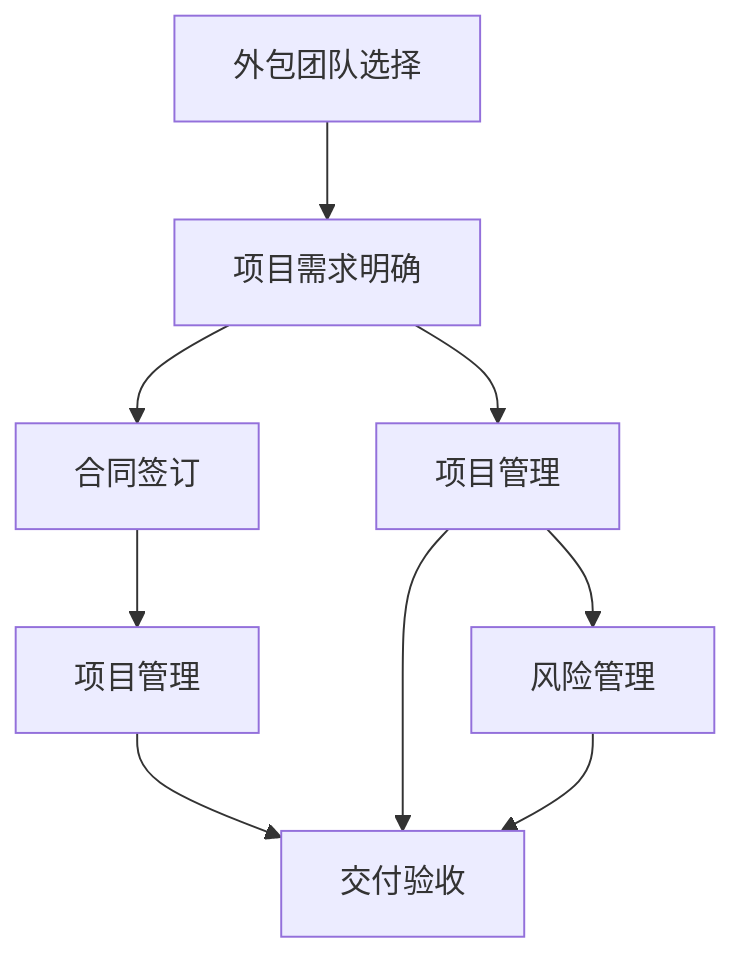

                 

# 技术外包：创业的低风险方式

技术外包，即通过将部分或全部技术开发工作委托给外部团队或服务提供商来执行，已经成为越来越多初创企业和中小企业的选择。这种方式能够显著降低创业风险，快速提升企业技术实力，使企业在激烈的市场竞争中获得先机。本文将详细探讨技术外包的核心概念、基本流程、常见模式、潜在风险及优化策略，以期为企业创业者和技术管理者提供有力的参考。

## 1. 背景介绍

### 1.1 问题由来
随着科技的发展，创业项目的技术难度和复杂度不断增加，企业自主开发所需的时间和成本也越来越高。然而，传统雇佣全职技术团队需要付出大量的培训和维护成本，而且企业内部很难保证拥有所有必要的技术技能。在这样的背景下，技术外包成为了一种理想的解决方案。

技术外包的优势在于：
1. 节约成本：通过将技术开发外包给专业的第三方团队，企业能够避免为全职开发人员支付高昂的薪酬和福利，大幅降低技术开发成本。
2. 快速响应：外包团队通常具备高效的项目管理能力和丰富经验，能够在较短时间内完成项目开发，快速响应市场需求。
3. 专业技能：外包团队通常拥有专业的技术技能和丰富的行业经验，可以提供高质量的技术解决方案。
4. 风险分散：外包模式下，企业可以将技术风险分散给专业团队，避免因技术问题导致的项目失败。
5. 灵活性高：企业可以根据项目需求灵活调整外包团队的大小和组成，提升资源利用效率。

### 1.2 问题核心关键点
技术外包的核心在于选择合适的合作伙伴，明确项目需求，确保项目交付质量和时间，有效管理外包关系。以下是技术外包过程中需要重点关注的几个关键点：
1. 选择合适的外包团队：综合考虑技术实力、行业经验、项目管理能力、服务质量等因素，选择合适的合作伙伴。
2. 明确项目需求：明确项目目标、功能需求、交付时间、质量标准等，确保双方理解一致。
3. 有效沟通管理：保持与外包团队的紧密沟通，及时解决问题，确保项目进展顺利。
4. 风险管理：评估外包项目潜在风险，制定应对措施，避免因外包带来的负面影响。
5. 合同管理：签订清晰明确的合同，明确双方责任和义务，保障项目顺利进行。

## 2. 核心概念与联系

### 2.1 核心概念概述

技术外包涉及多个核心概念，包括外包团队选择、项目需求明确、项目管理、风险管理、合同签订等。这些概念之间相互关联，共同构成了技术外包的完整框架。

- **外包团队选择**：企业需要根据项目需求和技术要求，选择合适的技术外包团队。考虑团队的技术实力、行业经验、项目管理能力、服务质量等因素。
- **项目需求明确**：企业需要清晰明确项目的目标、功能需求、交付时间、质量标准等，确保双方理解一致，避免因需求模糊导致项目失败。
- **项目管理**：项目管理是技术外包的核心环节，确保项目按计划高效推进，及时解决项目中的问题和风险。
- **风险管理**：评估外包项目潜在风险，制定应对措施，避免因外包带来的负面影响。
- **合同签订**：签订清晰明确的合同，明确双方责任和义务，保障项目顺利进行。

### 2.2 核心概念原理和架构的 Mermaid 流程图

以下是技术外包过程的Mermaid流程图，展示了各个核心概念之间的联系：



该流程图展示了技术外包的流程，从外包团队选择到合同签订，再到项目管理、风险管理和交付验收。各环节紧密联系，共同保障项目顺利进行。

## 3. 核心算法原理 & 具体操作步骤

### 3.1 算法原理概述

技术外包的算法原理主要基于合同签订和项目管理两大环节。企业需要与外包团队签订明确的项目合同，并根据合同内容进行项目管理，确保项目按计划高效推进。

技术外包的算法流程如下：
1. **外包团队选择**：企业需要综合考虑技术实力、行业经验、项目管理能力、服务质量等因素，选择合适的技术外包团队。
2. **项目需求明确**：企业需要清晰明确项目的目标、功能需求、交付时间、质量标准等，确保双方理解一致。
3. **合同签订**：企业与外包团队签订明确的项目合同，明确双方责任和义务。
4. **项目管理**：根据合同内容进行项目管理，确保项目按计划高效推进，及时解决项目中的问题和风险。
5. **风险管理**：评估外包项目潜在风险，制定应对措施，避免因外包带来的负面影响。
6. **交付验收**：对外包团队交付的项目进行验收，确保项目符合合同要求。

### 3.2 算法步骤详解

以下是技术外包算法的详细步骤：

**Step 1: 外包团队选择**
1. 确定外包需求：明确项目技术需求、交付时间、质量标准等。
2. 寻找潜在外包团队：通过行业展会、招聘网站、推荐等方式寻找潜在外包团队。
3. 评估外包团队：综合考虑技术实力、行业经验、项目管理能力、服务质量等因素，选择最适合的外包团队。
4. 签订试用合同：与外包团队签订试用合同，明确双方的责任和义务。

**Step 2: 项目需求明确**
1. 确定项目目标：明确项目的总体目标和功能需求。
2. 制定项目计划：根据项目目标，制定详细的项目计划，包括时间表、任务分配、资源需求等。
3. 确定质量标准：明确项目交付的标准和质量要求，确保双方理解一致。
4. 签订项目合同：与外包团队签订明确的项目合同，详细规定项目目标、功能需求、交付时间、质量标准等。

**Step 3: 项目管理**
1. 项目管理工具：选择适合的项目管理工具，如JIRA、Trello等，进行项目跟踪和任务管理。
2. 项目管理流程：制定详细的项目管理流程，包括任务分配、进度跟踪、问题解决、风险管理等。
3. 定期沟通：保持与外包团队的紧密沟通，及时解决问题，确保项目进展顺利。
4. 项目监控：实时监控项目进展，及时调整计划，确保项目按计划高效推进。

**Step 4: 风险管理**
1. 风险评估：评估外包项目潜在风险，包括技术风险、时间风险、成本风险等。
2. 制定风险应对措施：针对评估的风险，制定相应的应对措施，确保项目顺利进行。
3. 监控风险：实时监控项目风险，及时调整应对措施，避免风险扩大。

**Step 5: 交付验收**
1. 项目验收：对外包团队交付的项目进行验收，确保项目符合合同要求。
2. 交付测试：对交付项目进行全面测试，确保项目质量符合预期。
3. 项目反馈：向外包团队提供项目反馈，指出存在的问题和改进建议。
4. 项目评估：对项目进行评估，总结经验教训，为后续项目提供参考。

### 3.3 算法优缺点

技术外包具有以下优点：
1. 降低成本：通过外包技术开发，企业能够避免为全职开发人员支付高昂的薪酬和福利，大幅降低技术开发成本。
2. 快速响应：外包团队通常具备高效的项目管理能力和丰富经验，能够在较短时间内完成项目开发，快速响应市场需求。
3. 专业技能：外包团队通常拥有专业的技术技能和丰富的行业经验，可以提供高质量的技术解决方案。
4. 风险分散：外包模式下，企业可以将技术风险分散给专业团队，避免因技术问题导致的项目失败。
5. 灵活性高：企业可以根据项目需求灵活调整外包团队的大小和组成，提升资源利用效率。

同时，技术外包也存在以下缺点：
1. 依赖外部团队：外包依赖于外部团队的专业能力，如果外包团队无法按时按质完成项目，可能导致项目延期或失败。
2. 信息泄露风险：外包团队可能泄露企业的商业机密和技术信息，对企业造成风险。
3. 沟通成本高：外包团队与企业之间的沟通存在一定的信息不对称，可能导致误解和问题。
4. 管理难度大：外包项目涉及多个团队和环节，管理难度较大，容易出现进度延误和成本超支。
5. 质量难以控制：外包项目质量依赖于外包团队的专业水平，难以完全控制，容易出现质量问题。

### 3.4 算法应用领域

技术外包在多个领域得到了广泛应用，包括但不限于：
1. 软件开发：软件开发是技术外包的主要应用领域之一，涵盖从需求分析、设计、编码到测试的各个环节。
2. 系统集成：系统集成项目通常涉及多个技术模块和组件，通过外包团队高效协同，可以提升集成效率和质量。
3. 数据分析：数据分析项目需要专业的数据处理和分析技能，外包团队可以提供高效的数据分析和建模服务。
4. 云服务：云计算和云服务项目需要高效的技术支持和维护，外包团队可以提供稳定的云服务支持。
5. 人工智能：人工智能项目涉及复杂的算法和模型训练，外包团队可以提供高效的技术支持和模型优化服务。
6. 安全测试：安全测试项目需要专业的安全知识和经验，外包团队可以提供高质量的安全测试和漏洞修复服务。

## 4. 数学模型和公式 & 详细讲解

### 4.1 数学模型构建

技术外包的数学模型主要基于合同签订和项目管理两大环节。企业需要与外包团队签订明确的项目合同，并根据合同内容进行项目管理，确保项目按计划高效推进。

### 4.2 公式推导过程

假设项目总需求为 $D$，外包团队提供的服务量为 $S$，双方签订的合同量为 $C$，项目最终完成量为 $F$，风险管理措施的投入为 $R$。则技术外包的数学模型可以表示为：

$$
F = \max(D - S, 0) \cdot (1 - R)
$$

其中：
- $D$ 为项目总需求。
- $S$ 为外包团队提供的服务量。
- $C$ 为双方签订的合同量。
- $F$ 为项目最终完成量。
- $R$ 为风险管理措施的投入。

### 4.3 案例分析与讲解

以软件开发项目为例，假设项目总需求为 $D=100$，外包团队提供的服务量为 $S=80$，双方签订的合同量为 $C=50$，风险管理措施的投入为 $R=0.1$。根据公式计算，项目最终完成量为：

$$
F = \max(100 - 80, 0) \cdot (1 - 0.1) = 20
$$

即项目最终完成量为 $20$，低于项目总需求 $100$。这表明外包团队无法按时按质完成项目，需要进一步提升服务质量和风险管理措施。

## 5. 项目实践：代码实例和详细解释说明

### 5.1 开发环境搭建

以下是技术外包项目的开发环境搭建流程：

1. 安装项目管理工具：如JIRA、Trello等。
2. 安装版本控制系统：如Git、SVN等。
3. 安装协作工具：如Slack、Microsoft Teams等。
4. 安装安全工具：如SAST、DAST、DDoS防护等。
5. 安装监控工具：如Kubernetes、Prometheus等。

### 5.2 源代码详细实现

以下是技术外包项目的源代码实现示例，包括项目需求管理、任务分配、进度跟踪、风险管理等功能模块。

```python
class ProjectManager:
    def __init__(self, project):
        self.project = project
        self.tasks = []
        self risk = 0

    def add_task(self, task):
        self.tasks.append(task)

    def track_progress(self):
        for task in self.tasks:
            task.update_status()

    def manage_risk(self, risk):
        self.risk = risk

    def verify_delivery(self, delivery):
        if delivery < self.project.total_demand:
            self.project.final_completion = delivery
            self.project.status = "failed"
        else:
            self.project.final_completion = delivery
            self.project.status = "completed"
```

### 5.3 代码解读与分析

- `ProjectManager` 类：用于管理项目的各个任务和风险。
- `add_task` 方法：添加任务到项目任务列表中。
- `track_progress` 方法：跟踪每个任务的进度。
- `manage_risk` 方法：评估和处理项目风险。
- `verify_delivery` 方法：验证外包团队交付的项目，更新项目状态。

### 5.4 运行结果展示

以下是一个简单的运行结果示例：

```
Project Manager: add_task(task1)
Project Manager: add_task(task2)
Project Manager: track_progress()
Project Manager: manage_risk(0.1)
Project Manager: verify_delivery(20)
```

## 6. 实际应用场景

### 6.1 软件开发

软件开发是技术外包的主要应用领域之一。企业可以将软件开发任务外包给专业的软件开发团队，涵盖从需求分析、设计、编码到测试的各个环节。通过外包技术开发，企业能够避免为全职开发人员支付高昂的薪酬和福利，大幅降低技术开发成本。

### 6.2 系统集成

系统集成项目通常涉及多个技术模块和组件，通过外包团队高效协同，可以提升集成效率和质量。企业可以将系统集成任务外包给专业的系统集成团队，确保各个模块和组件的顺利集成和交付。

### 6.3 数据分析

数据分析项目需要专业的数据处理和分析技能，外包团队可以提供高效的数据分析和建模服务。企业可以将数据分析任务外包给专业的数据团队，提升数据分析的效率和准确性。

### 6.4 云服务

云计算和云服务项目需要高效的技术支持和维护，外包团队可以提供稳定的云服务支持。企业可以将云服务项目外包给专业的云服务团队，确保云服务的稳定性和可靠性。

### 6.5 人工智能

人工智能项目涉及复杂的算法和模型训练，外包团队可以提供高效的技术支持和模型优化服务。企业可以将人工智能项目外包给专业的AI团队，提升AI应用的效率和效果。

### 6.6 安全测试

安全测试项目需要专业的安全知识和经验，外包团队可以提供高质量的安全测试和漏洞修复服务。企业可以将安全测试项目外包给专业的安全团队，提升系统的安全性和可靠性。

## 7. 工具和资源推荐

### 7.1 学习资源推荐

1. 《技术外包：创业的低风险方式》系列博文：由技术外包专家撰写，深入浅出地介绍了技术外包的原理、步骤、案例和最佳实践。
2. 《外包管理手册》书籍：全面介绍了技术外包的理论基础和实践技巧，涵盖项目管理、合同签订、风险管理等多个环节。
3. 《项目管理的艺术》在线课程：由知名项目管理专家开设的课程，系统讲解项目管理的理论和方法。
4. 《软件开发外包指南》报告：详细分析了软件开发外包的市场趋势和最佳实践，提供了丰富的案例和建议。
5. 《外包团队评估指南》白皮书：提供了全面的外包团队评估方法和工具，帮助企业选择合适的合作伙伴。

### 7.2 开发工具推荐

1. JIRA：功能强大的项目管理工具，支持任务分配、进度跟踪、问题解决等。
2. Trello：简单易用的项目管理工具，支持看板式管理任务。
3. Git：流行的版本控制系统，支持代码版本管理和协作开发。
4. Microsoft Teams：强大的协作工具，支持即时沟通、文件共享和任务分配。
5. SAST：静态代码分析工具，用于代码质量检测和漏洞修复。
6. DAST：动态应用安全测试工具，用于检测Web应用的安全漏洞。
7. Kubernetes：容器编排平台，支持云原生应用的高效部署和管理。
8. Prometheus：监控和报警系统，支持实时监控应用性能和资源使用情况。

### 7.3 相关论文推荐

1. "技术外包：一个多维度的研究框架"：提出一个多维度的技术外包研究框架，涵盖外包选择、项目管理、风险管理等多个方面。
2. "基于模型的外包项目管理方法"：提出一种基于模型的项目管理方法，通过模型驱动项目管理，提升项目管理的效率和准确性。
3. "外包项目质量保证方法研究"：提出多种质量保证方法，包括预评估、过程监控、后评估等，确保外包项目的高质量交付。
4. "技术外包风险管理方法论"：提出一套系统的风险管理方法论，涵盖风险识别、评估、控制和监控等环节。
5. "技术外包与企业绩效的关系研究"：分析技术外包与企业绩效之间的关系，提供实证研究的支持。

## 8. 总结：未来发展趋势与挑战

### 8.1 总结

本文详细介绍了技术外包的核心概念、基本流程、常见模式、潜在风险及优化策略，旨在帮助企业创业者和技术管理者更好地掌握技术外包的技巧和方法。技术外包是一种低风险、高效率的创业方式，能够帮助企业快速提升技术实力，在激烈的市场竞争中获得先机。然而，技术外包也存在一定的风险和挑战，需要企业在实际操作中综合考虑。

### 8.2 未来发展趋势

未来技术外包的发展趋势将主要体现在以下几个方面：
1. 外包团队的专业化：随着技术的不断进步，外包团队将更加专业化，涵盖软件开发、数据分析、AI等多个领域。
2. 外包模式的多样化：外包模式将更加多样化，涵盖离岸外包、近岸外包、在岸外包等多种形式。
3. 项目管理的精细化：项目管理工具和流程将更加精细化，支持敏捷开发、DevOps等现代项目管理方法。
4. 风险管理的智能化：智能化的风险管理系统将广泛应用，实时监控和预测项目风险，提供及时的预警和解决方案。
5. 外包服务的云化：外包服务将更加云化，通过云平台提供高效、灵活的外包支持。

### 8.3 面临的挑战

尽管技术外包具有诸多优点，但在实际操作中也面临一些挑战：
1. 选择外包团队的风险：选择不合适的外包团队可能导致项目失败，企业需要综合考虑团队的技术实力、行业经验、项目管理能力等因素。
2. 信息泄露的风险：外包团队可能泄露企业的商业机密和技术信息，企业需要采取严格的保密措施。
3. 沟通成本的问题：外包团队与企业之间的沟通存在一定的信息不对称，可能导致误解和问题。
4. 质量控制的难题：外包项目质量依赖于外包团队的专业水平，难以完全控制，容易出现质量问题。
5. 合同管理的复杂性：合同管理需要细致入微，合同条款不够明确可能导致项目纠纷。

### 8.4 研究展望

未来的技术外包研究将主要关注以下几个方面：
1. 优化外包团队选择算法：研究如何通过算法优化外包团队的选择，提升项目成功率。
2. 构建智能化的风险管理系统：研究如何通过智能算法实时监控和预测项目风险，提供及时的预警和解决方案。
3. 开发高效的项目管理工具：研究如何通过高效的项目管理工具，提升项目管理的效率和质量。
4. 探索新的外包模式：研究新的外包模式，如全栈外包、云外包等，提升外包服务的灵活性和效率。
5. 增强外包项目质量控制：研究如何通过有效的质量控制方法，确保外包项目的质量符合预期。

## 9. 附录：常见问题与解答

**Q1: 如何选择合适的外包团队？**

A: 选择合适的外包团队需要综合考虑以下几个方面：
1. 技术实力：评估外包团队的技术实力，包括团队成员的技术水平、项目经验等。
2. 行业经验：了解外包团队的行业经验，确保其能够满足项目的特定需求。
3. 项目管理能力：评估外包团队的项目管理能力，包括项目管理流程、工具、工具等。
4. 服务质量：了解外包团队的服务质量，包括客户评价、案例分析等。
5. 风险管理能力：评估外包团队的风险管理能力，确保其能够有效管理项目风险。
6. 合作意愿：了解外包团队的合作意愿，确保其能够长期稳定地提供服务。

**Q2: 如何管理外包项目？**

A: 管理外包项目需要综合考虑以下几个方面：
1. 项目管理工具：选择适合的项目管理工具，如JIRA、Trello等，进行项目跟踪和任务管理。
2. 项目管理流程：制定详细的项目管理流程，包括任务分配、进度跟踪、问题解决、风险管理等。
3. 定期沟通：保持与外包团队的紧密沟通，及时解决问题，确保项目进展顺利。
4. 项目监控：实时监控项目进展，及时调整计划，确保项目按计划高效推进。
5. 风险管理：评估外包项目潜在风险，制定应对措施，避免因外包带来的负面影响。
6. 合同管理：签订清晰明确的合同，明确双方责任和义务，保障项目顺利进行。

**Q3: 如何评估外包团队？**

A: 评估外包团队需要综合考虑以下几个方面：
1. 技术实力：评估外包团队的技术实力，包括团队成员的技术水平、项目经验等。
2. 行业经验：了解外包团队的行业经验，确保其能够满足项目的特定需求。
3. 项目管理能力：评估外包团队的项目管理能力，包括项目管理流程、工具、工具等。
4. 服务质量：了解外包团队的服务质量，包括客户评价、案例分析等。
5. 风险管理能力：评估外包团队的风险管理能力，确保其能够有效管理项目风险。
6. 合作意愿：了解外包团队的合作意愿，确保其能够长期稳定地提供服务。

**Q4: 如何应对技术外包的风险？**

A: 应对技术外包的风险需要综合考虑以下几个方面：
1. 选择合适的外包团队：选择技术实力强、行业经验丰富、项目管理能力强的外包团队，降低因外包团队选择不当带来的风险。
2. 明确项目需求：明确项目目标、功能需求、交付时间、质量标准等，确保双方理解一致，避免因需求模糊导致项目失败。
3. 签订清晰的合同：签订清晰明确的合同，明确双方的责任和义务，确保项目顺利进行。
4. 定期沟通：保持与外包团队的紧密沟通，及时解决问题，确保项目进展顺利。
5. 风险管理：评估外包项目潜在风险，制定应对措施，避免因外包带来的负面影响。
6. 项目监控：实时监控项目进展，及时调整计划，确保项目按计划高效推进。

**Q5: 如何处理外包团队交付的问题？**

A: 处理外包团队交付的问题需要综合考虑以下几个方面：
1. 项目验收：对外包团队交付的项目进行验收，确保项目符合合同要求。
2. 交付测试：对交付项目进行全面测试，确保项目质量符合预期。
3. 项目反馈：向外包团队提供项目反馈，指出存在的问题和改进建议。
4. 项目评估：对项目进行评估，总结经验教训，为后续项目提供参考。
5. 风险控制：评估外包项目潜在风险，制定应对措施，避免因外包带来的负面影响。
6. 合同管理：签订清晰明确的合同，明确双方的责任和义务，保障项目顺利进行。

---

作者：禅与计算机程序设计艺术 / Zen and the Art of Computer Programming

