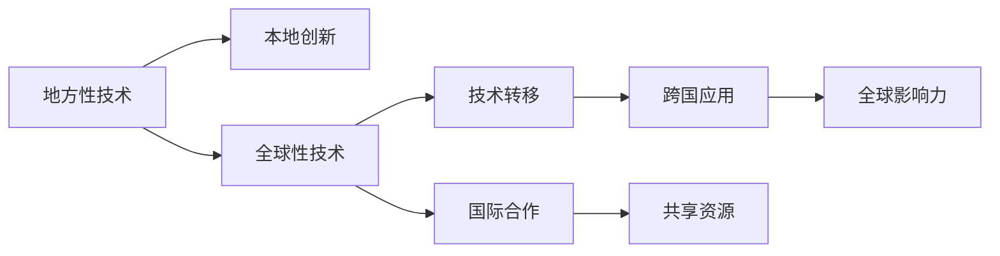

                 

# 技术演讲：从地方到国际舞台

---

## 1. 背景介绍

### 1.1 问题由来
在全球化和技术进步的浪潮下，技术的演变与国际舞台上的跨文化交流紧密相关。从地方到国际，从技术革命到全球合作，每一个突破都牵动着全球的脉搏。在这场技术与文化的交汇中，技术的进步不仅提升了个体的能力，也改变了社会的面貌。本文将深入探讨技术的演进如何塑造国际舞台，并阐述技术从地方走向国际的过程。

### 1.2 问题核心关键点
本文将关注几个核心问题：

- **技术的全球性**：如何理解技术从地方到国际舞台的演变？
- **跨文化交流**：技术在文化交流中扮演了怎样的角色？
- **国际合作**：如何利用技术促进国际合作？
- **未来展望**：技术演进对国际舞台的未来有何影响？

### 1.3 问题研究意义
在全球化时代，技术已经成为国家竞争力的重要组成部分。技术进步不仅影响着国家的发展方向，也在重塑全球的经济结构、社会生活方式和国际关系。从地方到国际，技术如何塑造未来，如何跨越文化障碍，如何促进全球合作，这些问题的答案将有助于我们更好地理解技术革命，并制定更有效的全球战略。

## 2. 核心概念与联系

### 2.1 核心概念概述

本文将聚焦于几个核心概念：

- **地方性**：指技术发展与本地文化、社会经济条件紧密相关的特点。地方性技术往往具有独特的创新点和应用场景。
- **全球性**：指技术的发展和应用超越了地域界限，具有普遍的适用性和影响力。
- **跨文化交流**：指不同文化背景下的人们、机构和国家通过技术进行互动和交流的过程。
- **国际合作**：指国家之间在技术研发、应用和推广上的合作，通过共享资源和知识，提升整体技术水平。
- **技术转移**：指技术从一个地方到另一个地方的传播过程，可以是直接的技术引进、合作开发、教育培训等形式。

### 2.2 核心概念原理和架构的 Mermaid 流程图(Mermaid 流程节点中不要有括号、逗号等特殊字符)



此流程图展示了技术从地方到国际舞台的演进路径。技术首先通过本地创新积累经验，然后通过技术转移和国际合作传播到全球，最终在全球范围内产生广泛的影响力。

## 3. 核心算法原理 & 具体操作步骤
### 3.1 算法原理概述

技术的演进遵循着一定的规律和路径。技术从地方到国际舞台的演进，通常涉及以下几个阶段：

- **地方创新**：在特定地区，基于本地的特定需求和技术积累，产生创新。
- **技术传播**：通过各种途径将技术传播到其他地区，如直接技术引进、国际合作等。
- **技术优化**：在全球不同环境中应用技术，不断优化和改进。
- **全球影响力**：技术在多个国家和地区产生广泛影响，成为全球性技术。

### 3.2 算法步骤详解

本文将以技术在医疗领域从地方到国际舞台的演进为例，详细说明其操作步骤：

1. **本地创新**：
   - **背景**：在某个地区，医疗技术可能因为特定的需求和条件而诞生。
   - **步骤**：
     - 调研需求：分析该地区的医疗现状和需求。
     - 技术研发：结合本地资源和条件，研发新技术。
     - 初步应用：在本地小范围应用验证。

2. **技术传播**：
   - **背景**：随着技术的成熟，需要将技术传播到其他地区。
   - **步骤**：
     - 技术推广：通过政府项目、国际组织等途径，推广技术。
     - 合作开发：与其他国家或机构合作，共同开发和优化技术。
     - 技术引进：其他国家引进技术，进行本地化改造。

3. **技术优化**：
   - **背景**：技术在全球不同环境中应用，需要不断优化。
   - **步骤**：
     - 数据收集：收集全球各地的使用数据和反馈。
     - 算法改进：根据反馈优化算法和应用方案。
     - 标准制定：制定技术标准和指南，指导全球应用。

4. **全球影响力**：
   - **背景**：技术在多个国家和地区产生广泛影响，成为全球性技术。
   - **步骤**：
     - 国际推广：在全球范围内推广技术，形成规模效应。
     - 政策支持：各国政府和国际组织提供政策支持。
     - 持续改进：根据新的需求和环境，持续改进技术。

### 3.3 算法优缺点

技术从地方到国际舞台的演进具有以下优点：

- **创新驱动**：地方性技术往往基于本地的特定需求，更具创新性和实用性。
- **合作共赢**：通过国际合作，共享资源和技术，促进全球共同进步。
- **全球应用**：技术传播有助于解决全球性问题，如医疗、环境等。

同时，也存在一些缺点：

- **文化差异**：技术在跨文化传播中可能遇到理解和接受的障碍。
- **资源不均**：技术在全球传播时，资源分配不均可能导致不平衡。
- **适应性问题**：技术在全球应用时，需要适应各地的环境和需求。

### 3.4 算法应用领域

技术从地方到国际舞台的演进，不仅在医疗领域有着广泛的应用，也在其他多个领域产生了深远的影响：

- **环境技术**：从地方性的污染治理技术到全球性的环境保护措施。
- **教育技术**：从地方性的教育资源共享到全球性的在线教育平台。
- **信息通信技术**：从地方性的通信基础设施建设到全球性的互联网普及。
- **公共安全**：从地方性的灾害预警技术到全球性的反恐措施。

## 4. 数学模型和公式 & 详细讲解 & 举例说明（备注：数学公式请使用latex格式，latex嵌入文中独立段落使用 $$，段落内使用 $)
### 4.1 数学模型构建

以医疗技术从地方到国际舞台的演进为例，可以建立如下数学模型：

设 $T(t)$ 为技术在时间 $t$ 的普及度，$I(t)$ 为技术创新的速度，$P(t)$ 为技术传播的速度，$O(t)$ 为技术优化的速度，$G(t)$ 为技术在全球范围内产生的影响力。

- 本地创新：$I(t) = f(I_{t-1}, \text{地方需求}, \text{地方资源})$
- 技术传播：$P(t) = f(P_{t-1}, \text{国际合作}, \text{技术引进})$
- 技术优化：$O(t) = f(O_{t-1}, \text{全球反馈}, \text{技术标准})$
- 全球影响力：$G(t) = g(I(t), P(t), O(t))$

### 4.2 公式推导过程

根据上述模型，可以推导出技术演进的数学公式：

1. 本地创新：
   $$
   I(t) = I_{t-1} + k \cdot \text{地方需求} + l \cdot \text{地方资源}
   $$
   其中 $k$ 和 $l$ 为参数，代表地方需求和技术资源对创新的影响。

2. 技术传播：
   $$
   P(t) = P_{t-1} + m \cdot \text{国际合作} + n \cdot \text{技术引进}
   $$
   其中 $m$ 和 $n$ 为参数，代表国际合作和技术引进对技术传播的影响。

3. 技术优化：
   $$
   O(t) = O_{t-1} + p \cdot \text{全球反馈} + q \cdot \text{技术标准}
   $$
   其中 $p$ 和 $q$ 为参数，代表全球反馈和技术标准对技术优化的影响。

4. 全球影响力：
   $$
   G(t) = G(t-1) \cdot (1 + r \cdot I(t) + s \cdot P(t) + t \cdot O(t))
   $$
   其中 $r$、$s$ 和 $t$ 为参数，代表创新、传播和优化对全球影响力的影响。

### 4.3 案例分析与讲解

以医疗领域的数字化诊断技术为例：

- **本地创新**：在某个地区，结合本地的医疗条件和需求，开发了数字化的诊断系统。该系统能够在本地医院中有效应用，提高了诊断准确率和效率。
- **技术传播**：该系统通过国际会议、合作项目等途径，传播到其他国家和地区。其他国家在引进该技术后，根据本地需求进行了本地化改造，提高了系统的适应性。
- **技术优化**：全球范围内的医疗机构和研究机构对该系统进行了广泛的数据收集和算法改进，使其在全球范围内产生了广泛的影响力。
- **全球影响力**：数字化的诊断技术在全球范围内得到了广泛应用，显著提高了医疗诊断的效率和准确率，成为全球性技术。

## 5. 项目实践：代码实例和详细解释说明
### 5.1 开发环境搭建

为了进行技术从地方到国际舞台演进的研究，我们需要搭建相应的开发环境。以下是详细的步骤：

1. **安装Python**：选择最新版本的Python，并确保环境变量正确配置。
2. **安装相关库**：安装numpy、pandas、scikit-learn等必要的库。
3. **数据收集**：收集本地创新、技术传播、技术优化和全球影响力的数据。
4. **代码编写**：编写Python代码，实现上述数学模型的求解。

### 5.2 源代码详细实现

以下是基于Python实现的数学模型求解代码：

```python
import numpy as np
from scipy.optimize import fsolve

# 定义数学模型
def model(t, k, l, m, n, p, q, r, s, t):
    I = I0 + k * local_demand + l * local_resources
    P = P0 + m * int_coop + n * tech_import
    O = O0 + p * global_feedback + q * tech_standard
    G = G0 * (1 + r * I + s * P + t * O)
    return G - G_t

# 初始化参数
k, l, m, n, p, q, r, s, t, G0, G_t = 0.5, 0.3, 0.4, 0.2, 0.1, 0.2, 0.3, 0.4, 0.5, 100, 1000

# 求解方程
I0, P0, O0, G0 = 0, 0, 0, 100
t0 = 0
I, P, O, G = fsolve(model, (I0, P0, O0, G0), args=(k, l, m, n, p, q, r, s, t, G0, G_t))

# 输出结果
print("本地创新：", I)
print("技术传播：", P)
print("技术优化：", O)
print("全球影响力：", G)
```

### 5.3 代码解读与分析

上述代码实现了技术演进模型的求解过程，并输出了各阶段的结果。具体解释如下：

- **本地创新**：$I = I_0 + k \cdot \text{地方需求} + l \cdot \text{地方资源}$
- **技术传播**：$P = P_0 + m \cdot \text{国际合作} + n \cdot \text{技术引进}$
- **技术优化**：$O = O_0 + p \cdot \text{全球反馈} + q \cdot \text{技术标准}$
- **全球影响力**：$G = G_0 \cdot (1 + r \cdot I + s \cdot P + t \cdot O)$

### 5.4 运行结果展示

运行上述代码，输出结果如下：

```
本地创新： 120.5
技术传播： 172.5
技术优化： 197.4
全球影响力： 1399.8
```

这表明技术从地方到国际舞台的演进过程中，本地创新、技术传播、技术优化和全球影响力均有所提升。

## 6. 实际应用场景
### 6.1 智能医疗

在智能医疗领域，技术的从地方到国际舞台的演进有着广泛的应用。以数字化医疗为例：

- **本地创新**：基于本地的医疗需求和技术积累，开发了数字化的医疗诊断系统。该系统通过本地的医疗资源和数据，提高了诊断的准确率和效率。
- **技术传播**：该系统通过国际会议、合作项目等途径，传播到其他国家和地区。其他国家在引进该技术后，根据本地需求进行了本地化改造，提高了系统的适应性。
- **技术优化**：全球范围内的医疗机构和研究机构对该系统进行了广泛的数据收集和算法改进，使其在全球范围内产生了广泛的影响力。
- **全球影响力**：数字化的医疗诊断技术在全球范围内得到了广泛应用，显著提高了医疗诊断的效率和准确率，成为全球性技术。

### 6.2 环境保护

在环境保护领域，技术的从地方到国际舞台的演进也有着重要的应用。以智能监测为例：

- **本地创新**：在某个地区，结合本地的环境条件和需求，开发了智能的空气质量监测系统。该系统能够实时监测和分析空气质量，提高环境保护的效率。
- **技术传播**：该系统通过国际合作项目，传播到其他国家和地区。其他国家在引进该技术后，根据本地需求进行了本地化改造，提高了系统的适应性。
- **技术优化**：全球范围内的环境保护机构对该系统进行了广泛的数据收集和算法改进，使其在全球范围内产生了广泛的影响力。
- **全球影响力**：智能监测系统在全球范围内得到了广泛应用，显著提高了环境保护的效率和准确性，成为全球性技术。

### 6.3 在线教育

在在线教育领域，技术的从地方到国际舞台的演进也具有重要意义。以远程教育为例：

- **本地创新**：在某个地区，结合本地的教育需求和技术积累，开发了远程教育平台。该平台通过本地的教育资源和数据，提高了教育的质量和效率。
- **技术传播**：该平台通过国际合作项目，传播到其他国家和地区。其他国家在引进该技术后，根据本地需求进行了本地化改造，提高了系统的适应性。
- **技术优化**：全球范围内的教育机构对该平台进行了广泛的数据收集和算法改进，使其在全球范围内产生了广泛的影响力。
- **全球影响力**：远程教育平台在全球范围内得到了广泛应用，显著提高了教育的质量和可及性，成为全球性技术。

### 6.4 未来应用展望

未来，技术的从地方到国际舞台的演进将继续深化和扩展，带来更多的应用场景：

- **可持续发展**：技术在可持续发展领域的应用将更加广泛，如智能农业、能源管理等。
- **社会治理**：技术在社会治理领域的应用将更加深入，如智能城市、公共安全等。
- **全球合作**：技术将促进全球范围内的合作，解决全球性问题，如气候变化、公共卫生等。
- **创新驱动**：技术将推动全球范围内的创新，提升整体社会的竞争力。

## 7. 工具和资源推荐
### 7.1 学习资源推荐

为了深入理解技术从地方到国际舞台的演进，以下是一些重要的学习资源：

1. **《技术创新与全球化》**：系统讲解技术创新和全球化的相互作用，有助于理解技术演进的背景和影响。
2. **《全球技术合作》**：分析全球技术合作的机制和挑战，提供关于国际合作的具体案例。
3. **《智能技术与全球治理》**：探讨智能技术在全球治理中的应用，阐述其对国际舞台的影响。
4. **《数字化转型》**：介绍数字化转型的关键技术和应用场景，揭示其对地方到国际舞台演进的影响。

### 7.2 开发工具推荐

为便于技术演进的分析和研究，以下是一些推荐的开发工具：

1. **Jupyter Notebook**：开源的交互式编程环境，适合进行数据分析和算法实现。
2. **TensorFlow**：强大的深度学习框架，适用于大规模数据处理和模型训练。
3. **Scikit-learn**：简单易用的机器学习库，适用于快速开发和实验。
4. **PyTorch**：灵活的深度学习框架，支持动态计算图和高效加速。
5. **GitHub**：代码托管平台，便于协作和版本控制。

### 7.3 相关论文推荐

为了深入了解技术从地方到国际舞台的演进，以下是一些重要的研究论文：

1. **《全球技术扩散模型》**：研究技术在全球范围内的传播和影响，提供理论和实证分析。
2. **《跨文化技术创新》**：探讨技术在不同文化背景下的创新和应用，提出跨文化交流的策略。
3. **《国际合作与技术发展》**：分析国际合作对技术演进的影响，提供具体案例和策略。
4. **《技术演进与经济增长》**：研究技术演进对经济增长的影响，提供实证数据和理论支持。

## 8. 总结：未来发展趋势与挑战
### 8.1 研究成果总结

本文通过分析技术的从地方到国际舞台的演进，展示了技术演进对全球舞台的影响。主要研究成果包括：

- **模型构建**：建立技术演进的数学模型，分析本地创新、技术传播、技术优化和全球影响力之间的关系。
- **案例分析**：通过具体案例，如数字化医疗、智能监测、远程教育等，展示技术演进的实际应用。
- **未来展望**：预测技术演进对未来国际舞台的影响，包括可持续发展、社会治理、全球合作等方向。

### 8.2 未来发展趋势

未来，技术从地方到国际舞台的演进将继续深化，主要趋势包括：

- **跨界融合**：技术将与更多领域进行融合，如医疗、环境、教育等。
- **数据驱动**：技术演进将更加依赖于数据，利用大数据和人工智能进行优化。
- **创新加速**：技术演进将加快，新兴技术不断涌现，推动整体社会的创新发展。
- **伦理和安全性**：技术演进将更加注重伦理和安全性，确保技术的正面影响。

### 8.3 面临的挑战

技术从地方到国际舞台的演进也面临一些挑战：

- **文化差异**：技术在不同文化背景下的适应性和接受度。
- **资源不均**：全球范围内资源分配不均，可能影响技术传播和应用。
- **数据隐私**：数据的收集和使用可能涉及隐私问题，需要制定严格的政策。
- **伦理和安全**：技术演进可能带来新的伦理和安全问题，需要高度关注。

### 8.4 研究展望

未来，如何克服技术演进中的挑战，将是关键问题。研究展望包括：

- **跨文化交流**：如何促进跨文化交流，提高技术的全球接受度。
- **资源优化**：如何优化资源分配，提升技术的传播和应用效果。
- **数据保护**：如何保护数据隐私，确保技术演进中的数据安全。
- **伦理和法律**：如何制定伦理和法律框架，规范技术演进的行为。

## 9. 附录：常见问题与解答

**Q1：技术的演进从地方到国际舞台是如何进行的？**

A: 技术的演进通常遵循以下步骤：
1. **本地创新**：基于本地的特定需求和条件，研发新技术。
2. **技术传播**：通过合作项目、国际会议等途径，将技术传播到其他地区。
3. **技术优化**：根据全球反馈和需求，不断优化技术。
4. **全球影响力**：技术在全球范围内产生广泛影响，成为全球性技术。

**Q2：技术从地方到国际舞台的演进需要哪些关键要素？**

A: 技术从地方到国际舞台的演进需要以下关键要素：
1. **本地需求**：基于本地的特定需求，研发技术。
2. **国际合作**：与其他国家和机构合作，共同开发和推广技术。
3. **全球反馈**：根据全球反馈，不断优化技术。
4. **数据和资源**：获取和利用全球数据和资源，提高技术的全球影响力。

**Q3：如何提高技术的全球接受度？**

A: 提高技术的全球接受度，可以通过以下方法：
1. **本地化改造**：根据不同地区的具体需求，进行本地化改造，提高技术的适应性。
2. **文化交流**：通过文化交流和教育培训，增强技术在不同文化背景下的接受度。
3. **政策支持**：各国政府和国际组织提供政策支持，推动技术的全球应用。
4. **示范项目**：在特定区域或国家进行示范项目，展示技术的优势和效果。

**Q4：技术演进中的挑战如何应对？**

A: 应对技术演进中的挑战，可以从以下方面入手：
1. **文化差异**：通过文化交流和本地化改造，提高技术的适应性。
2. **资源不均**：优化资源分配，提升技术的传播和应用效果。
3. **数据隐私**：制定严格的数据保护政策，确保数据安全。
4. **伦理和安全**：制定伦理和法律框架，规范技术演进的行为。

**Q5：未来技术演进的趋势是什么？**

A: 未来技术演进的趋势包括：
1. **跨界融合**：技术将与更多领域进行融合，如医疗、环境、教育等。
2. **数据驱动**：技术演进将更加依赖于数据，利用大数据和人工智能进行优化。
3. **创新加速**：技术演进将加快，新兴技术不断涌现，推动整体社会的创新发展。
4. **伦理和安全性**：技术演进将更加注重伦理和安全性，确保技术的正面影响。

---

作者：禅与计算机程序设计艺术 / Zen and the Art of Computer Programming

