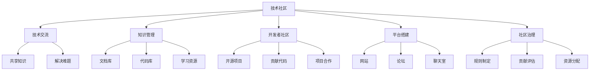

                 

# 技术社区建设：从参与者到组织者

> 关键词：技术社区、技术交流、知识分享、开发者社区、平台搭建、社区治理

## 1. 背景介绍

### 1.1 问题由来
在数字化转型加速的时代，技术的发展日新月异。无论是初创企业，还是大型组织，技术的持续创新都是核心竞争力之一。然而，技术的发展往往依赖于知识的共享和传承。单靠孤军奋战，很难攻克技术难题，实现突破性进展。因此，技术社区的建设，成为了推动技术进步的关键。

技术社区，是一个由技术爱好者、开发者、研究人员等组成的集体。在这里，技术交流、知识分享、项目合作成为常态，成员之间可以相互学习、共同成长，推动技术的迭代和应用。一个成熟的技术社区，不仅是技术交流的场所，更是创新和变革的策源地。

### 1.2 问题核心关键点
技术社区的建设，并不是简单的搭建一个平台那么简单。它涉及社区成员的招募、社区规则的制定、知识的组织、活动的管理等诸多环节。关键点包括：

- **社区定位**：明确社区的目标和方向，吸引合适的成员。
- **知识管理**：组织、分类、共享知识，使社区成员能够高效获取信息。
- **活动策划**：定期举办技术交流、项目合作、竞赛等活动，增强社区活力。
- **规则制定**：制定社区规则，包括行为规范、版权归属、贡献评估等，确保社区的良性运作。
- **技术支持**：提供必要的技术支撑，包括工具、平台、云服务等，帮助社区成员更好地进行开发和交流。

这些问题看似简单，但要全面、系统地解决，却需要深入思考和细致规划。只有从参与者到组织者，全面把控技术社区的各个环节，才能让其真正发挥作用，成为技术发展的有力支撑。

## 2. 核心概念与联系

### 2.1 核心概念概述

为了更好地理解技术社区的建设，本节将介绍几个核心概念：

- **技术社区**：由技术爱好者、开发者、研究人员等组成的集体，旨在共享知识、推动技术进步。
- **技术交流**：社区成员之间分享技术经验和项目成果，解决技术难题。
- **知识管理**：组织、分类、共享技术文档、代码库、学习资源等，提高知识获取效率。
- **开发者社区**：基于开源软件或平台的技术社区，通常以开源项目为核心，吸引开发者贡献代码和解决方案。
- **平台搭建**：建立技术社区的物理和数字空间，如网站、论坛、聊天室等。
- **社区治理**：制定并执行社区规则，包括行为规范、贡献评估、资源分配等，确保社区的良性运作。

这些核心概念之间的逻辑关系可以通过以下Mermaid流程图来展示：



这个流程图展示了技术社区的核心构成及其相互关系：

1. **技术社区**是主体，通过技术交流、知识管理等活动提供价值。
2. **开发者社区**是其核心，围绕开源项目展开。
3. **平台搭建**和**社区治理**是社区运作的基础。
4. **技术交流**和**知识管理**是社区成员之间的互动方式。
5. **文档库、代码库和学习资源**是知识共享的主要载体。
6. **开源项目、贡献代码和项目合作**是开发者社区的核心活动。

这些概念共同构成了技术社区的完整框架，是建设一个活跃、健康、富有活力的社区的基础。

## 3. 核心算法原理 & 具体操作步骤

### 3.1 算法原理概述

技术社区的建设，本质上是一个复杂的社会网络系统。通过网络拓扑结构、知识传播机制、社区规则等关键因素，构建一个高效、开放、协作的环境，使社区成员能够高效地进行技术交流、知识共享和项目合作。

为了更好地理解技术社区的建设原理，我们需要引入几个关键概念：

- **网络拓扑**：描述社区成员之间的关系网络，通过节点和边来表示社区成员之间的互动。
- **知识传播**：描述知识如何在社区成员间传播，通常包括知识生成、共享和吸收三个阶段。
- **社区规则**：描述社区成员之间的行为规范，包括贡献评估、版权归属、资源分配等。

技术社区的建设，通常遵循以下原则：

1. **开放性**：鼓励自由交流和知识共享，任何人都可以加入和贡献。
2. **协作性**：鼓励成员之间的合作和互助，共同解决技术难题。
3. **贡献性**：通过明确的贡献评估机制，激励成员积极参与和贡献。
4. **可持续性**：通过合理的资源分配和规则制定，确保社区的良性运作和可持续发展。

### 3.2 算法步骤详解

技术社区的建设，可以分为以下几个关键步骤：

**Step 1: 社区定位与目标设定**
- 明确社区的目标和方向，确定社区的核心主题和领域。
- 制定社区的愿景和使命，吸引合适的成员和利益相关者。

**Step 2: 招募与治理结构**
- 通过多种渠道招募社区成员，包括线上平台、社交媒体、开源项目等。
- 建立社区的治理结构，包括管理委员会、技术委员会等，负责制定规则和决策。

**Step 3: 知识管理与共享机制**
- 构建知识库、代码库和学习资源，组织、分类和共享技术文档、代码片段、学习材料等。
- 引入搜索和推荐算法，帮助成员高效获取和利用知识。

**Step 4: 活动策划与组织**
- 定期举办技术交流会、项目合作、竞赛等活动，增强社区的活力和互动性。
- 引入游戏化元素，通过积分、徽章、排行榜等方式激励成员积极参与。

**Step 5: 规则制定与执行**
- 制定社区规则，包括行为规范、版权归属、贡献评估等。
- 建立监控和反馈机制，确保规则的公平和透明。

**Step 6: 技术支持与资源配置**
- 提供必要的技术支撑，包括平台、工具、云服务等。
- 优化资源配置，确保社区的可持续发展和良性运作。

以上是技术社区建设的总体步骤。在实际执行中，每个步骤都需要细化和优化，以确保社区的健康发展和高效运作。

### 3.3 算法优缺点

技术社区的建设，具有以下优点：

1. **知识共享**：社区成员能够高效获取和利用知识，加速技术创新和应用。
2. **协作互助**：成员之间的合作和互助，可以解决技术难题，提高开发效率。
3. **激励机制**：通过明确的贡献评估机制，激励成员积极参与和贡献。
4. **平台开放**：开放的平台吸引更多成员和贡献者，扩大社区的影响力和覆盖面。

同时，该方法也存在一定的局限性：

1. **管理复杂性**：社区的运作需要精心规划和管理，否则容易偏离方向。
2. **规则执行难度**：社区规则的制定和执行需要严格的监督和管理，否则容易产生不公平现象。
3. **成员多样性**：社区成员的技术水平和经验差异较大，需要制定灵活的规则和机制。
4. **动态变化**：技术的发展和变化需要社区不断调整和优化，保持与时俱进。

尽管存在这些局限性，但就目前而言，技术社区建设仍然是推动技术创新和应用的重要手段。未来相关研究的重点在于如何进一步优化社区治理结构，提高社区的效率和公平性，同时兼顾多样性和可持续性等因素。

### 3.4 算法应用领域

技术社区的建设，在多个领域都有广泛的应用，例如：

- **开源社区**：如GitHub、Apache、Mozilla等，聚集了全球的开发者和技术爱好者，推动了众多开源项目的成功。
- **技术博客与论坛**：如CSDN、Stack Overflow、Medium等，为技术交流和学习提供了丰富的资源和平台。
- **技术会议与沙龙**：如NeurIPS、ICML、KubeCon等，通过面对面的交流和互动，促进了技术的深入理解和应用。
- **企业内外部合作**：如Google的AI Open Source、微软的GitHub、Amazon的AWS等，通过社区合作，加速技术创新和应用。

除了上述这些经典应用外，技术社区还被创新性地应用到更多场景中，如在线教育、创业孵化、在线协作等，为技术创新和应用提供了新的模式和路径。随着技术社区的不断发展，相信其在推动技术进步和社会变革中的作用将越来越重要。

## 4. 数学模型和公式 & 详细讲解 & 举例说明

### 4.1 数学模型构建

为了更好地理解技术社区的建设，我们可以使用数学语言对社区运作进行更加严格的刻画。

设技术社区有 $N$ 个成员，构成一个无向图 $G=(V,E)$，其中 $V$ 表示成员集合，$E$ 表示成员之间的互动关系。社区的知识库 $K$ 包含 $M$ 个知识项，每个知识项 $k_i$ 描述了一个技术点或项目。社区的知识传播过程可以用知识传播网络 $N_k=(K,E_k)$ 描述，其中 $E_k$ 表示知识项之间的传播关系。

社区的规则可以用规则网络 $R=(V,R)$ 描述，其中 $R$ 表示社区成员的行为规范和贡献评估。社区的活动可以用活动网络 $A=(V,A)$ 描述，其中 $A$ 表示社区成员的互动活动。社区的技术支持可以用资源网络 $T=(V,T)$ 描述，其中 $T$ 表示社区提供的工具、平台、云服务等。

### 4.2 公式推导过程

以下我们以开源社区为例，推导知识传播网络的知识传播过程及其影响因素。

假设知识项 $k_i$ 的知识水平为 $W_i$，知识传播速率 $S_i$，社区成员 $v_j$ 的知识水平为 $W_j$。知识传播过程可以描述为：

$$
W_j = \sum_{k \in \mathcal{N}(v_j)} S_k \cdot W_k
$$

其中 $\mathcal{N}(v_j)$ 表示成员 $v_j$ 的知识传播网络中与之相连的知识项集合。知识传播速率 $S_k$ 表示知识项 $k$ 的知识传播能力，可以通过社区成员的互动次数、知识更新频率等因素计算得出。

对于社区成员而言，知识传播速率 $S_j$ 可以表示为：

$$
S_j = \sum_{k \in \mathcal{N}(v_j)} W_k
$$

通过知识传播速率的计算，可以衡量社区成员的知识传播能力，进而评估其在社区中的影响力和贡献。

### 4.3 案例分析与讲解

以GitHub为例，分析其在开源社区建设中的关键机制和影响因素。

GitHub作为全球最大的开源社区，通过以下机制促进了知识的传播和共享：

1. **开源项目**：GitHub提供了丰富的开源项目，吸引了全球的开发者和技术爱好者参与贡献。项目代码公开透明，任何人都可以查看、修改和贡献。

2. **社区互动**：GitHub提供了丰富的互动工具，包括issue评论、pull request、fork等，促进了成员之间的交流和合作。

3. **知识库**：GitHub的Wiki和文档库功能，使得项目文档和知识共享变得更加便捷。成员可以自由创建和编辑文档，形成知识积累和传承。

4. **贡献评估**：GitHub通过积分、徽章、star等机制，激励成员积极参与和贡献。积分和徽章可以用于展示成员的贡献和影响力，star可以表示项目的受欢迎程度和影响力。

5. **技术支持**：GitHub提供了丰富的工具和平台，包括代码托管、CI/CD、项目管理等，支持开源项目的快速开发和部署。

通过以上机制，GitHub成功地构建了一个高效、开放、协作的开源社区，推动了全球开源技术的发展。

## 5. 项目实践：代码实例和详细解释说明

### 5.1 开发环境搭建

在进行社区建设实践前，我们需要准备好开发环境。以下是使用Python进行Web开发的环境配置流程：

1. 安装Anaconda：从官网下载并安装Anaconda，用于创建独立的Python环境。

2. 创建并激活虚拟环境：
```bash
conda create -n web-dev python=3.8 
conda activate web-dev
```

3. 安装必要的Python库：
```bash
pip install Flask Django SQLAlchemy Flask-WTF
```

4. 安装Web框架：
```bash
pip install Flask-Diamond
```

5. 安装数据库：
```bash
pip install PostgreSQL psycopg2
```

完成上述步骤后，即可在`web-dev`环境中开始社区建设实践。

### 5.2 源代码详细实现

这里我们以GitHub为例，给出使用Flask框架搭建技术社区平台的PyTorch代码实现。

首先，定义社区成员、知识项、活动等模型：

```python
from flask_sqlalchemy import SQLAlchemy
from flask_login import UserMixin, LoginManager, login_user, logout_user, login_required
from werkzeug.security import generate_password_hash, check_password_hash

db = SQLAlchemy()

class User(UserMixin, db.Model):
    id = db.Column(db.Integer, primary_key=True)
    username = db.Column(db.String(50), unique=True)
    password_hash = db.Column(db.String(100))
    is_admin = db.Column(db.Boolean)

    def set_password(self, password):
        self.password_hash = generate_password_hash(password)

    def check_password(self, password):
        return check_password_hash(self.password_hash, password)

class KnowledgeItem(db.Model):
    id = db.Column(db.Integer, primary_key=True)
    name = db.Column(db.String(100))
    level = db.Column(db.Integer)
    created_at = db.Column(db.DateTime)
    updated_at = db.Column(db.DateTime)

class Activity(db.Model):
    id = db.Column(db.Integer, primary_key=True)
    user_id = db.Column(db.Integer, db.ForeignKey('user.id'))
    knowledge_id = db.Column(db.Integer, db.ForeignKey('knowledge_item.id'))
    created_at = db.Column(db.DateTime)
    updated_at = db.Column(db.DateTime)

login_manager = LoginManager()
login_manager.init_app(app)
login_manager.login_view = 'login'

@login_manager.user_loader
def load_user(id):
    return User.query.get(int(id))

@app.route('/')
def index():
    knowledge_items = KnowledgeItem.query.all()
    activities = Activity.query.all()
    return render_template('index.html', knowledge_items=knowledge_items, activities=activities)

@app.route('/login', methods=['GET', 'POST'])
def login():
    if request.method == 'POST':
        username = request.form['username']
        password = request.form['password']
        user = User.query.filter_by(username=username).first()
        if user and user.check_password(password):
            login_user(user)
            return redirect('/')
        else:
            flash('Invalid credentials', 'error')
    return render_template('login.html')

@app.route('/logout')
@login_required
def logout():
    logout_user()
    return redirect('/')

@app.route('/add_knowledge_item', methods=['GET', 'POST'])
@login_required
def add_knowledge_item():
    if request.method == 'POST':
        name = request.form['name']
        level = request.form['level']
        knowledge_item = KnowledgeItem(name=name, level=level)
        db.session.add(knowledge_item)
        db.session.commit()
        flash('Knowledge item added successfully', 'success')
        return redirect('/')
    return render_template('add_knowledge_item.html')

@app.route('/knowledge_item_details', methods=['GET'])
@login_required
def knowledge_item_details():
    id = request.args.get('id')
    knowledge_item = KnowledgeItem.query.get(int(id))
    activities = Activity.query.filter_by(knowledge_id=int(id)).all()
    return render_template('knowledge_item_details.html', knowledge_item=knowledge_item, activities=activities)
```

然后，定义登录、注册、用户管理等视图：

```python
from flask_wtf import FlaskForm
from wtforms import StringField, PasswordField, BooleanField, SubmitField, IntegerField
from wtforms.validators import DataRequired, Length, Email, EqualTo

class LoginForm(FlaskForm):
    username = StringField('Username', validators=[DataRequired(), Length(min=2, max=20)])
    password = PasswordField('Password', validators=[DataRequired()])
    remember_me = BooleanField('Remember Me')
    submit = SubmitField('Sign In')

class RegistrationForm(FlaskForm):
    username = StringField('Username', validators=[DataRequired(), Length(min=2, max=20)])
    email = StringField('Email', validators=[DataRequired(), Email()])
    password = PasswordField('Password', validators=[DataRequired()])
    confirm_password = PasswordField('Confirm Password', validators=[DataRequired(), EqualTo('password')])
    submit = SubmitField('Register')

@app.route('/register', methods=['GET', 'POST'])
def register():
    if request.method == 'POST':
        form = RegistrationForm()
        if form.validate_on_submit():
            user = User(username=form.username.data, email=form.email.data)
            user.set_password(form.password.data)
            db.session.add(user)
            db.session.commit()
            flash('Registration successful', 'success')
            return redirect('/')
    return render_template('register.html', form=RegistrationForm())

@app.route('/admin/users')
@login_required
def users():
    if current_user.is_admin:
        users = User.query.all()
        return render_template('users.html', users=users)
    else:
        return redirect('/')
```

最后，启动Web应用并测试：

```python
if __name__ == '__main__':
    app.run(debug=True)
```

以上就是使用Flask框架搭建技术社区平台的完整代码实现。可以看到，通过Flask框架和SQLAlchemy等库，可以快速搭建一个功能齐全的技术社区平台。

### 5.3 代码解读与分析

让我们再详细解读一下关键代码的实现细节：

**User模型**：
- 定义社区成员的基本信息，包括用户名、密码、管理员状态等。
- 通过`set_password`和`check_password`方法，进行密码的加密和验证。

**KnowledgeItem模型**：
- 定义知识项的基本信息，包括名称、等级、创建时间等。

**Activity模型**：
- 定义社区成员与知识项之间的互动，包括用户ID、知识项ID、创建时间等。

**登录、注册、用户管理等视图**：
- 使用Flask-WTF库定义登录和注册表单，进行表单验证和数据提交。
- 利用Flask-Login库管理用户登录状态，确保用户安全。
- 定义管理员视图，展示社区成员列表，并进行用户管理。

**index视图**：
- 获取所有知识项和活动，展示在主界面上。

**login视图**：
- 处理登录请求，验证用户输入的用户名和密码。

**logout视图**：
- 注销用户登录状态，重定向回主界面。

**add_knowledge_item视图**：
- 新增知识项，将其保存到数据库中。

**knowledge_item_details视图**：
- 展示指定知识项的详情，包括其活动记录。

可以看到，通过Flask框架和SQLAlchemy等库，可以快速搭建一个功能齐全的技术社区平台，提供登录、注册、用户管理、知识共享、活动展示等功能。

当然，工业级的系统实现还需考虑更多因素，如权限管理、数据备份、安全防护等。但核心的社区功能基本与此类似。

## 6. 实际应用场景

### 6.1 智能城市建设

智能城市的建设，需要大量的技术支持和创新，技术社区在其中发挥着重要的作用。通过建立技术社区，汇聚城市建设和运营的各种技术需求，促进技术交流和项目合作，可以实现城市管理的信息化和智能化。

具体而言，技术社区可以为智能城市建设提供以下支持：

1. **技术交流**：提供平台供城市建设和运营的技术人员交流经验和知识，解决技术难题。
2. **项目合作**：促进城市建设和运营中各项目的技术对接和合作，加速项目进展。
3. **知识共享**：分享城市建设和运营中的技术文档、代码库和学习资源，提高技术应用效率。
4. **活动策划**：举办城市建设和运营的技术沙龙、研讨会、竞赛等活动，提升技术应用水平。

通过技术社区的建设，智能城市的建设可以更加高效、安全和可持续。

### 6.2 医疗健康领域

医疗健康领域的技术需求复杂多样，技术社区在其中也扮演着重要角色。通过建立技术社区，汇聚医疗领域的技术需求，促进技术交流和项目合作，可以实现医疗健康技术的创新和应用。

具体而言，技术社区可以为医疗健康领域提供以下支持：

1. **技术交流**：提供平台供医疗健康领域的技术人员交流经验和知识，解决技术难题。
2. **项目合作**：促进医疗健康领域中各项目的技术对接和合作，加速项目进展。
3. **知识共享**：分享医疗健康领域的技术文档、代码库和学习资源，提高技术应用效率。
4. **活动策划**：举办医疗健康领域的技术沙龙、研讨会、竞赛等活动，提升技术应用水平。

通过技术社区的建设，医疗健康领域的技术创新和应用可以更加高效、安全和可持续。

### 6.3 教育培训领域

教育培训领域的技术需求多样，技术社区在其中也具有重要意义。通过建立技术社区，汇聚教育培训领域的技术需求，促进技术交流和项目合作，可以实现教育培训技术的创新和应用。

具体而言，技术社区可以为教育培训领域提供以下支持：

1. **技术交流**：提供平台供教育培训领域的技术人员交流经验和知识，解决技术难题。
2. **项目合作**：促进教育培训领域中各项目的技术对接和合作，加速项目进展。
3. **知识共享**：分享教育培训领域的技术文档、代码库和学习资源，提高技术应用效率。
4. **活动策划**：举办教育培训领域的技术沙龙、研讨会、竞赛等活动，提升技术应用水平。

通过技术社区的建设，教育培训领域的技术创新和应用可以更加高效、安全和可持续。

### 6.4 未来应用展望

随着技术社区的不断发展，其应用领域将更加广泛，为各行业的数字化转型和智能化升级提供支持。

1. **智能制造**：通过技术社区促进智能制造领域的技术交流和项目合作，推动智能制造技术的创新和应用。
2. **智慧农业**：提供平台供智慧农业领域的技术人员交流经验和知识，解决技术难题。
3. **环境保护**：促进环境保护领域的技术对接和合作，推动环境保护技术的创新和应用。
4. **文化创意**：提供平台供文化创意领域的技术人员交流经验和知识，解决技术难题。
5. **城市交通**：通过技术社区促进城市交通领域的技术对接和合作，推动城市交通技术的创新和应用。
6. **智慧旅游**：提供平台供智慧旅游领域的技术人员交流经验和知识，解决技术难题。
7. **金融科技**：促进金融科技领域的技术对接和合作，推动金融科技技术的创新和应用。
8. **生物医药**：提供平台供生物医药领域的技术人员交流经验和知识，解决技术难题。
9. **能源环保**：促进能源环保领域的技术对接和合作，推动能源环保技术的创新和应用。
10. **智能建筑**：提供平台供智能建筑领域的技术人员交流经验和知识，解决技术难题。

技术社区的应用领域将不断拓展，推动各行业的数字化转型和智能化升级，为社会发展和人类福祉做出贡献。

## 7. 工具和资源推荐
### 7.1 学习资源推荐

为了帮助开发者系统掌握技术社区的建设原理和实践技巧，这里推荐一些优质的学习资源：

1. **《社区驱动的创新》**：一本深入浅出地介绍技术社区建设原理和实践的书，涵盖了社区定位、成员招募、知识管理、活动策划等多个环节。

2. **Coursera《社区管理和治理》课程**：Coursera上开设的社区管理和治理课程，涵盖社区治理结构、规则制定、用户管理等多个主题，帮助开发者全面掌握社区建设的技巧。

3. **GitHub官方文档**：GitHub的官方文档，提供了丰富的开源项目和社区建设的样例代码，是学习GitHub社区建设的重要资源。

4. **社区平台开源项目**：如Discourse、Gitee、Slack等，提供了多种社区平台的开源代码，帮助开发者快速搭建技术社区。

5. **社区建设书籍**：如《社区驱动的软件开发》、《社区驱动的创新》等，深入探讨了社区建设对软件开发的影响，提供了大量的案例和经验。

通过对这些资源的学习实践，相信你一定能够系统掌握技术社区建设的精髓，并用于解决实际的社区问题。

### 7.2 开发工具推荐

高效的开发离不开优秀的工具支持。以下是几款用于技术社区建设开发的常用工具：

1. **Flask框架**：基于Python的开源Web框架，简单易用，适合快速开发技术社区平台。

2. **Django框架**：基于Python的开源Web框架，功能丰富，适合开发复杂的技术社区应用。

3. **GitHub平台**：全球最大的开源社区平台，提供丰富的开源项目和社区建设工具。

4. **Slack平台**：全球最受欢迎的企业级通信和协作平台，支持实时消息、频道管理、文件共享等功能。

5. **JIRA平台**：全球领先的项目管理和协作平台，支持任务管理、缺陷跟踪、版本控制等功能。

6. **Redmine平台**：开源的项目管理和协作平台，支持任务管理、文档共享、权限管理等功能。

7. **Jenkins平台**：开源的自动化工具，支持持续集成和部署，帮助社区自动化开发和测试。

合理利用这些工具，可以显著提升技术社区建设的开发效率，加快创新迭代的步伐。

### 7.3 相关论文推荐

技术社区的建设，涉及社会学、管理学、计算机科学等多个学科，其研究仍在不断深入。以下是几篇奠基性的相关论文，推荐阅读：

1. **《技术社区的社会网络分析》**：研究技术社区中知识传播网络的特点和规律，揭示知识共享和创新的机制。

2. **《社区驱动的创新模型》**：提出社区驱动的创新模型，分析社区成员的互动行为和创新过程，提出社区建设的最佳实践。

3. **《技术社区的知识传播机制》**：研究技术社区中知识传播机制，揭示知识传播的规律和影响因素，提出知识传播的优化策略。

4. **《技术社区的治理结构研究》**：研究技术社区的治理结构，提出社区规则制定的原则和方法，确保社区的良性运作。

5. **《技术社区的活动策划与管理》**：研究技术社区的活动策划和管理，提出活动策划的策略和实施方法，增强社区的活力和互动性。

6. **《技术社区的资源配置与优化》**：研究技术社区的资源配置和优化，提出资源配置的原则和方法，确保社区的可持续发展。

这些论文代表了大语言模型微调技术的发展脉络。通过学习这些前沿成果，可以帮助研究者把握学科前进方向，激发更多的创新灵感。

## 8. 总结：未来发展趋势与挑战

### 8.1 总结

本文对技术社区的建设进行了全面系统的介绍。首先阐述了技术社区建设的背景和意义，明确了技术社区的目标和方向。其次，从原理到实践，详细讲解了技术社区的数学模型和核心步骤，给出了社区建设的具体代码实现。同时，本文还广泛探讨了技术社区在多个领域的应用前景，展示了技术社区建设的巨大潜力。此外，本文精选了社区建设的各类学习资源，力求为读者提供全方位的技术指引。

通过本文的系统梳理，可以看到，技术社区的建设在推动技术进步和创新方面具有重要价值。技术社区为技术交流、知识共享、项目合作提供了平台，使成员能够高效地进行技术创新和应用。未来，伴随技术社区的不断发展，相信其在推动技术创新和社会变革中的作用将越来越重要。

### 8.2 未来发展趋势

展望未来，技术社区的建设将呈现以下几个发展趋势：

1. **社区规模扩大**：随着技术社区的影响力不断扩大，更多技术爱好者和开发者将加入社区，推动技术的快速迭代和创新。
2. **跨领域融合**：技术社区将进一步与其他领域进行融合，如教育、医疗、金融、农业等，推动跨领域技术的创新和应用。
3. **智能化水平提升**：通过引入人工智能、大数据等技术，提升技术社区的智能化水平，推动技术社区的进一步发展。
4. **社会化功能增强**：技术社区将更加注重社会化功能，如知识传播、文化交流、公益活动等，提升社区的社会影响力。
5. **国际化扩展**：技术社区将更加国际化，吸引全球的技术爱好者和开发者，推动全球技术创新的发展。

这些趋势凸显了技术社区的广阔前景。这些方向的探索发展，必将进一步提升技术社区的效率和影响力，为技术进步和社会变革带来新的动力。

### 8.3 面临的挑战

尽管技术社区建设取得了一定的成果，但在迈向更加智能化、普适化应用的过程中，仍面临诸多挑战：

1. **管理复杂性**：社区的运作需要精心规划和管理，否则容易偏离方向。
2. **规则执行难度**：社区规则的制定和执行需要严格的监督和管理，否则容易产生不公平现象。
3. **成员多样性**：社区成员的技术水平和经验差异较大，需要制定灵活的规则和机制。
4. **动态变化**：技术的发展和变化需要社区不断调整和优化，保持与时俱进。

尽管存在这些挑战，但就目前而言，技术社区建设仍然是推动技术创新和应用的重要手段。未来相关研究的重点在于如何进一步优化社区治理结构，提高社区的效率和公平性，同时兼顾多样性和可持续性等因素。

### 8.4 研究展望

面对技术社区建设所面临的挑战，未来的研究需要在以下几个方面寻求新的突破：

1. **社区治理结构优化**：制定更加灵活、公平的社区治理结构，确保社区的良性运作和高效管理。
2. **社区规则制定**：引入更加智能化的规则制定机制，如AI驱动的规则生成、自动化评估等，提高社区规则的公平性和透明性。
3. **知识传播优化**：通过引入推荐系统和游戏化机制，优化知识传播过程，提高社区成员的知识获取效率。
4. **资源配置优化**：优化社区的资源配置，如硬件资源、软件工具、云服务等，提升社区的可持续性和资源利用效率。
5. **跨领域合作**：促进不同领域的技术社区进行合作，推动跨领域技术的创新和应用。

这些研究方向的探索，必将引领技术社区建设迈向更高的台阶，为技术进步和社会变革提供新的动力。

## 9. 附录：常见问题与解答

**Q1：技术社区建设是否适用于所有行业？**

A: 技术社区建设在各个行业都有广泛的应用，但对于一些特定行业，如金融、医疗、能源等，需要结合行业特点进行定制化建设。技术社区的建设应根据行业需求，选择合适的技术工具和活动形式。

**Q2：如何选择合适的技术社区平台？**

A: 选择合适的技术社区平台，应考虑平台的功能、易用性、扩展性等多个因素。常用的社区平台包括GitHub、Discourse、Slack等，各有其优缺点，应根据实际需求进行选择。

**Q3：技术社区建设是否需要大量资金支持？**

A: 技术社区建设所需的资金支持主要取决于社区规模和功能需求。小规模社区可以通过开源项目和开源工具进行搭建，而大规模社区可能需要购买商业云服务，进行定制化开发。

**Q4：技术社区建设是否需要专业的技术团队？**

A: 技术社区建设确实需要专业的技术团队进行开发和管理。团队成员应具备良好的技术背景和社区管理经验，确保社区的健康运作和持续发展。

**Q5：技术社区建设的难点是什么？**

A: 技术社区建设的难点主要在于社区的治理结构和规则制定。如何制定公平、透明、灵活的社区规则，确保社区的良性运作，是社区建设的核心问题。

这些常见问题及其解答，有助于开发者更好地理解技术社区建设的关键点，为其提供实用的指导和建议。

---

作者：禅与计算机程序设计艺术 / Zen and the Art of Computer Programming

